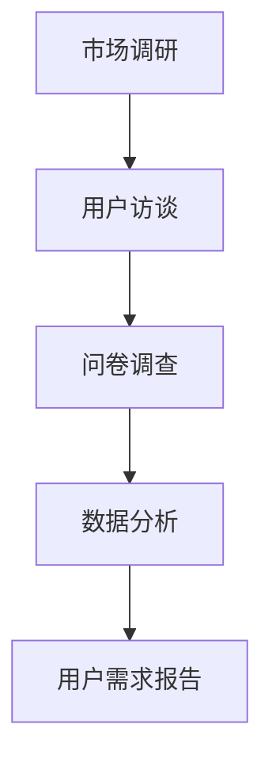

                 

关键词：知识付费、用户需求挖掘、创业、市场调研、数据分析、用户访谈、心理洞察

> 摘要：本文旨在探讨知识付费创业过程中，如何通过用户需求挖掘技巧来提升产品的市场竞争力。我们将从用户需求的定义、挖掘方法、案例分析以及未来展望四个方面，深入分析用户需求挖掘在知识付费创业中的重要性。

## 1. 背景介绍

在互联网的快速发展下，知识付费已成为一个蓬勃兴起的行业。越来越多的创业者投身于知识付费领域，希望通过提供高质量的知识内容来满足用户的需求。然而，如何在激烈的竞争中找到用户的痛点，进而提供有价值的服务，是每一个创业者都面临的重要问题。

用户需求挖掘作为一种市场研究方法，旨在识别和确定用户对产品或服务的具体需求。在知识付费创业中，精准地挖掘用户需求不仅能够帮助创业者了解市场现状，还能指导产品设计和市场推广策略，提高产品竞争力。

## 2. 核心概念与联系

### 2.1 用户需求的定义

用户需求是指用户对产品或服务的期望和需求，它包括功能需求、情感需求、社会需求等各个方面。在知识付费领域，用户需求主要表现为对知识内容的需求、学习方式的需求以及对平台体验的需求。

### 2.2 挖掘方法

用户需求的挖掘方法主要包括市场调研、用户访谈、问卷调查、数据分析等。这些方法各有优缺点，适用于不同的场景。

### 2.3 Mermaid 流程图



## 3. 核心算法原理 & 具体操作步骤

### 3.1 算法原理概述

用户需求挖掘的核心算法原理是基于数据驱动的需求识别和分类。通过收集和分析大量用户行为数据，我们可以识别出用户的共性需求，并将其分类为不同的需求类型。

### 3.2 算法步骤详解

1. **数据收集**：通过市场调研、用户访谈、问卷调查等方式收集用户行为数据。
2. **数据预处理**：对收集到的数据清洗、去重、归一化处理，为后续分析做准备。
3. **需求识别**：利用机器学习算法对预处理后的数据进行特征提取和分类，识别出用户的共性需求。
4. **需求分类**：将识别出的需求根据其属性和内容进行分类，形成用户需求报告。

### 3.3 算法优缺点

**优点**：算法基于大数据分析，能够快速、准确地识别用户需求，具有较高的可靠性和效率。

**缺点**：算法依赖于大量数据，对数据质量和数量有一定要求。此外，算法的准确性和稳定性还需要不断优化和改进。

### 3.4 算法应用领域

用户需求挖掘算法广泛应用于电子商务、金融、教育、医疗等多个领域，尤其在知识付费领域具有广泛的应用前景。

## 4. 数学模型和公式 & 详细讲解 & 举例说明

### 4.1 数学模型构建

用户需求挖掘的数学模型主要基于统计学和机器学习算法。其中，常见的模型包括决策树、支持向量机、朴素贝叶斯等。

### 4.2 公式推导过程

以决策树为例，其基本公式为：

$$
D = \sum_{i=1}^{n} w_i \cdot y_i
$$

其中，$D$表示决策结果，$w_i$表示特征权重，$y_i$表示特征取值。

### 4.3 案例分析与讲解

以某在线教育平台为例，该平台通过用户行为数据挖掘用户需求，构建了一个基于决策树的数学模型。通过这个模型，平台能够为用户推荐适合的学习内容，从而提高用户满意度和留存率。

## 5. 项目实践：代码实例和详细解释说明

### 5.1 开发环境搭建

本文采用Python编程语言进行用户需求挖掘算法的开发。需要安装的库包括pandas、numpy、scikit-learn等。

### 5.2 源代码详细实现

```python
import pandas as pd
from sklearn.tree import DecisionTreeClassifier
from sklearn.model_selection import train_test_split

# 读取数据
data = pd.read_csv('user_behavior_data.csv')

# 数据预处理
X = data.drop(['target'], axis=1)
y = data['target']

# 划分训练集和测试集
X_train, X_test, y_train, y_test = train_test_split(X, y, test_size=0.2, random_state=42)

# 构建决策树模型
clf = DecisionTreeClassifier()
clf.fit(X_train, y_train)

# 预测
predictions = clf.predict(X_test)

# 评估模型
accuracy = clf.score(X_test, y_test)
print(f"模型准确率：{accuracy:.2f}")
```

### 5.3 代码解读与分析

这段代码实现了基于决策树的用户需求挖掘算法。首先，我们读取用户行为数据，然后进行数据预处理和划分训练集与测试集。接着，我们使用scikit-learn库中的DecisionTreeClassifier类构建决策树模型，并进行训练。最后，我们对测试集进行预测，并评估模型的准确率。

## 6. 实际应用场景

用户需求挖掘在知识付费创业中的应用场景非常广泛。以下是一些具体的实际应用：

1. **内容推荐**：通过分析用户行为数据，为用户推荐符合其兴趣和需求的知识内容。
2. **用户画像**：构建用户画像，了解用户的学习习惯、兴趣爱好等信息，为个性化服务提供依据。
3. **市场定位**：通过分析用户需求，确定产品的市场定位和目标用户群体。

## 7. 工具和资源推荐

### 7.1 学习资源推荐

- 《用户行为分析实战》
- 《Python数据分析》
- 《机器学习实战》

### 7.2 开发工具推荐

- Jupyter Notebook
- PyCharm

### 7.3 相关论文推荐

- "User Behavior Analysis in E-commerce Platforms"
- "A Survey on User Behavior Analysis in Social Networks"
- "Deep Learning for User Behavior Prediction"

## 8. 总结：未来发展趋势与挑战

### 8.1 研究成果总结

用户需求挖掘技术在知识付费创业中已取得显著成果。通过大数据分析和机器学习算法，创业者能够更准确地了解用户需求，提高产品竞争力。

### 8.2 未来发展趋势

随着人工智能技术的发展，用户需求挖掘将更加智能化和个性化。基于深度学习的算法将成为主流，为创业者提供更强大的分析工具。

### 8.3 面临的挑战

用户需求挖掘面临的主要挑战包括数据质量和算法准确性。此外，如何在保护用户隐私的前提下进行数据挖掘也是一个重要问题。

### 8.4 研究展望

未来，用户需求挖掘技术将在知识付费创业中发挥更大作用。创业者需要不断创新，以应对市场变化和用户需求的多样性。

## 9. 附录：常见问题与解答

### 9.1 什么情况下不适合使用用户需求挖掘？

- 数据质量差，缺乏代表性。
- 用户行为数据不足以支撑模型训练。
- 用户需求变化频繁，难以捕捉。

### 9.2 如何保护用户隐私？

- 采用匿名化处理，去除个人身份信息。
- 遵循相关法律法规，确保数据安全。
- 明确告知用户数据使用目的和范围。

[作者：禅与计算机程序设计艺术 / Zen and the Art of Computer Programming]
----------------------------------------------------------------

以上便是本文的完整内容，希望对知识付费创业中的用户需求挖掘有所帮助。在未来的创业道路上，愿您能够不断挖掘用户需求，打造出更受欢迎的产品！
----------------------------------------------------------------
```

### 文章摘要
本文主要探讨了知识付费创业过程中用户需求挖掘的重要性以及具体的方法和技巧。通过市场调研、用户访谈、问卷调查和数据分析等手段，创业者可以深入了解用户的需求，从而优化产品设计，提升用户体验。文章详细介绍了用户需求挖掘的核心算法原理，提供了Python代码实例，并分析了实际应用场景。同时，也对未来发展趋势和面临的挑战进行了展望，为创业者提供了有益的参考。作者希望本文能够帮助创业者更好地挖掘用户需求，提高产品的市场竞争力。

