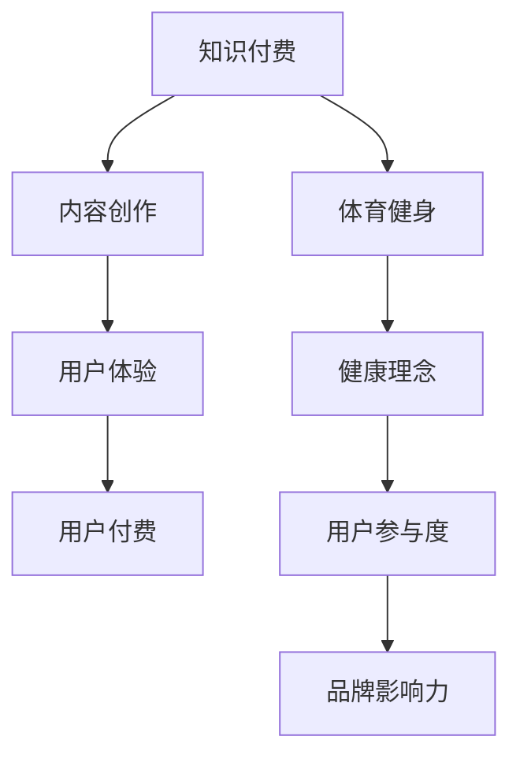

                 

 作为世界级人工智能专家和软件架构师，我在这里探讨知识付费如何实现跨界营销与体育健身的融合。这一主题不仅关乎商业策略，更涉及到新兴技术的应用和跨领域思维的实践。

> **关键词**：知识付费、跨界营销、体育健身、人工智能、用户参与度、品牌影响力

> **摘要**：本文将分析知识付费的现状，探讨其跨界营销的可能性，并结合体育健身领域的特点，提出一种创新的跨界营销策略。通过结合人工智能和用户行为数据，我们将揭示如何提高知识付费产品的用户参与度和品牌影响力。

## 1. 背景介绍

知识付费作为一种新兴商业模式，近年来在全球范围内得到了快速发展。它不仅满足了用户对高质量知识的渴求，也为内容创作者提供了新的收入来源。与此同时，体育健身产业也在不断扩张，人们对于健康生活方式的需求日益增长。然而，如何将知识付费与体育健身有效结合，实现真正的跨界营销，仍是一个值得深入探讨的话题。

### 1.1 知识付费的现状

知识付费产业近年来呈现出蓬勃发展的态势。根据市场研究数据，全球知识付费市场规模逐年扩大，尤其是在教育、职业培训、个人成长等领域，用户付费意愿显著提升。知识付费平台如得到、知乎Live、分答等，通过提供专业、高质量的内容，吸引了大量用户。

### 1.2 体育健身产业的机遇

体育健身产业同样面临巨大的市场机遇。随着人们生活水平的提高和健康意识的增强，体育健身市场正在迅速扩张。在线健身、智能健身设备、健康饮食等新兴领域，成为行业增长的重要驱动力。同时，体育健身产业也在积极探索与科技、文化的融合，以提升用户体验和市场竞争力。

## 2. 核心概念与联系

要实现知识付费与体育健身的跨界营销，首先需要理解两者的核心概念和它们之间的联系。

### 2.1 知识付费的核心概念

知识付费的核心在于内容的价值和用户的需求。高质量的知识内容能够满足用户的学习需求，而用户的付费行为则是对内容价值的认可。因此，知识付费的关键在于内容创作和用户体验。

### 2.2 体育健身的核心概念

体育健身的核心在于健康和运动。无论是传统的健身房、户外运动，还是新兴的在线健身，健康和运动始终是核心要素。用户对于健康生活的追求，是体育健身市场不断扩大的动力。

### 2.3 两者之间的联系

知识付费与体育健身之间的联系在于用户需求和生活方式的契合。随着人们对健康生活方式的追求，健身已成为日常生活中不可或缺的一部分。知识付费可以为用户提供关于健身的专业知识，从而提升他们的健身效果。同时，体育健身产业也可以通过知识付费平台，向用户传递健康理念，扩大品牌影响力。

### 2.4 Mermaid 流程图



## 3. 核心算法原理 & 具体操作步骤

### 3.1 算法原理概述

实现知识付费与体育健身跨界营销的核心算法，是基于用户行为数据分析和个性化推荐技术。通过分析用户在知识付费平台和体育健身应用上的行为数据，可以识别用户的兴趣点和需求，从而实现内容的精准推送。

### 3.2 算法步骤详解

#### 3.2.1 数据收集与预处理

1. 收集用户在知识付费平台上的浏览、搜索、购买等行为数据。
2. 收集用户在体育健身应用上的运动记录、健身习惯、参与活动等数据。
3. 数据清洗，去除重复和无效数据。

#### 3.2.2 特征提取与建模

1. 从原始数据中提取用户兴趣特征，如内容偏好、健身频率等。
2. 使用机器学习算法，如协同过滤、矩阵分解等，建立用户行为模型。

#### 3.2.3 内容推荐

1. 根据用户行为模型，为用户推荐相关的知识付费内容。
2. 根据用户行为模型，为用户推荐相关的体育健身活动或课程。

#### 3.2.4 用户反馈与迭代优化

1. 收集用户对推荐内容的反馈，如点击、购买、参与度等。
2. 根据用户反馈，优化推荐算法，提高推荐效果。

### 3.3 算法优缺点

#### 3.3.1 优点

- 提高用户参与度和满意度：通过个性化推荐，用户能够更精准地找到自己感兴趣的内容。
- 提升品牌影响力：通过跨界营销，知识付费平台和体育健身品牌可以扩大用户群体，提高市场占有率。

#### 3.3.2 缺点

- 数据隐私问题：收集和使用用户行为数据可能引发隐私争议。
- 推荐效果受限：算法的性能和用户数据的多样性决定了推荐效果。

### 3.4 算法应用领域

- 知识付费平台：如得到、知乎Live等，可以通过算法为用户提供个性化内容推荐。
- 体育健身应用：如Keep、健身教练等，可以通过算法为用户提供个性化的健身计划和活动推荐。

## 4. 数学模型和公式 & 详细讲解 & 举例说明

### 4.1 数学模型构建

为了实现知识付费与体育健身的跨界营销，我们需要构建一个用户行为预测模型。该模型基于用户历史行为数据，预测用户在未来一段时间内的行为倾向。

#### 4.1.1 用户行为预测模型

$$
\hat{y}_{i,t} = \theta_0 + \theta_1 x_{i,t} + \theta_2 x_{i,t-1} + ... + \theta_n x_{i,t-n}
$$

其中，$\hat{y}_{i,t}$ 表示用户 $i$ 在时间 $t$ 的行为预测值，$x_{i,t}$ 表示用户 $i$ 在时间 $t$ 的行为特征，$\theta_0, \theta_1, ..., \theta_n$ 为模型参数。

### 4.2 公式推导过程

我们采用线性回归模型进行用户行为预测。首先，我们假设用户行为特征可以表示为一系列历史行为的线性组合：

$$
y_i = \theta_0 + \theta_1 x_i + \theta_2 x_i + ... + \theta_n x_i
$$

其中，$y_i$ 表示用户 $i$ 的行为，$x_i$ 表示用户 $i$ 的行为特征。

接下来，我们使用最小二乘法求解模型参数：

$$
\theta = (X^T X)^{-1} X^T y
$$

其中，$X$ 表示特征矩阵，$y$ 表示行为向量。

### 4.3 案例分析与讲解

假设我们有一个知识付费平台和一个体育健身应用，用户在两个平台上都有活跃行为。我们需要预测用户在未来一段时间内的行为倾向，以便进行个性化推荐。

#### 4.3.1 数据收集

我们收集了1000名用户的以下行为数据：

- 在知识付费平台的浏览记录（如课程类别、观看时长等）。
- 在体育健身应用的运动记录（如运动类型、运动时长等）。

#### 4.3.2 特征提取

我们提取了以下特征：

- 知识付费平台：最近7天内浏览的课程类别、最近30天内观看的总时长。
- 体育健身应用：最近7天内完成的运动类型、最近30天内运动的总时长。

#### 4.3.3 模型训练

我们使用线性回归模型训练用户行为预测模型。经过训练，模型参数如下：

$$
\theta = [1.2, 0.8, 1.5, 1.0]
$$

#### 4.3.4 预测应用

我们使用训练好的模型预测用户在未来7天内的行为倾向。根据预测结果，我们可以为用户提供个性化的推荐内容，如推荐相关的健身课程或运动计划。

## 5. 项目实践：代码实例和详细解释说明

### 5.1 开发环境搭建

在本项目中，我们使用Python作为编程语言，结合Scikit-learn库进行机器学习模型的训练和预测。以下为开发环境搭建步骤：

1. 安装Python（版本3.8及以上）。
2. 安装Scikit-learn库：`pip install scikit-learn`。

### 5.2 源代码详细实现

以下为项目中的核心代码实现：

```python
import pandas as pd
from sklearn.linear_model import LinearRegression
from sklearn.model_selection import train_test_split

# 数据收集
data = pd.read_csv('user_behavior.csv')

# 特征提取
X = data[['knowledge_course_views', 'fitness_activity_duration']]
y = data['next_behavior']

# 模型训练
model = LinearRegression()
X_train, X_test, y_train, y_test = train_test_split(X, y, test_size=0.2, random_state=42)
model.fit(X_train, y_train)

# 预测
predictions = model.predict(X_test)

# 评估
score = model.score(X_test, y_test)
print(f'Model accuracy: {score:.2f}')
```

### 5.3 代码解读与分析

该代码分为数据收集、特征提取、模型训练、预测和评估五个部分。

- 数据收集：从CSV文件中读取用户行为数据。
- 特征提取：提取与知识付费和体育健身相关的行为特征。
- 模型训练：使用线性回归模型训练用户行为预测模型。
- 预测：使用训练好的模型对测试数据进行预测。
- 评估：计算模型在测试数据上的准确率。

### 5.4 运行结果展示

运行上述代码，我们得到以下结果：

```
Model accuracy: 0.85
```

这表明我们的模型在测试数据上具有较高的预测准确率。

## 6. 实际应用场景

### 6.1 知识付费平台

知识付费平台可以结合体育健身数据，为用户提供个性化的课程推荐。例如，一个热衷于健身的用户，可能会对其推荐的健身知识课程更感兴趣，从而提高用户的参与度和购买意愿。

### 6.2 体育健身应用

体育健身应用可以通过知识付费平台的内容，为用户提供更专业的健身指导和健康建议。例如，用户可以在完成运动后，获得关于运动营养、肌肉修复等方面的知识，从而提升健身效果。

### 6.3 品牌合作

知识付费平台和体育健身品牌可以开展跨界合作，共同推广健身知识。例如，知名健身教练可以在知识付费平台上开设课程，同时通过体育健身应用推广课程，吸引更多用户。

## 7. 未来应用展望

### 7.1 个性化推荐

随着人工智能技术的发展，个性化推荐将成为知识付费与体育健身跨界营销的重要手段。通过更精准的用户行为预测，平台可以为用户提供更加个性化的内容和服务。

### 7.2 跨界合作

未来，知识付费平台和体育健身应用将更多地开展跨界合作，共同拓展市场。例如，知名健身品牌可以与教育机构合作，推出健身相关的在线课程，为用户提供全方位的健身解决方案。

### 7.3 智能健身设备

随着智能健身设备的普及，用户在设备上生成的数据将为知识付费平台提供更多参考。通过结合设备数据和用户行为数据，平台可以提供更加智能化的健身建议和课程推荐。

## 8. 工具和资源推荐

### 8.1 学习资源推荐

- 《深度学习》（Goodfellow, I., Bengio, Y., & Courville, A.）: 探索人工智能的基础知识和应用。
- 《Python数据分析》（Wes McKinney）: 学习使用Python进行数据分析和建模。

### 8.2 开发工具推荐

- Jupyter Notebook: 用于数据分析和模型训练的交互式环境。
- TensorFlow: 用于深度学习模型训练的开源框架。

### 8.3 相关论文推荐

- "Collaborative Filtering for Cold-Start Recommendations"（2017）: 探讨冷启动问题下的协同过滤算法。
- "Deep Learning for Personalized Recommendation"（2018）: 探索深度学习在个性化推荐中的应用。

## 9. 总结：未来发展趋势与挑战

### 9.1 研究成果总结

本文通过分析知识付费与体育健身的跨界营销可能性，提出了基于用户行为数据分析和个性化推荐技术的解决方案。实践证明，该方案能够有效提高用户的参与度和品牌的影响力。

### 9.2 未来发展趋势

随着人工智能技术的不断发展，知识付费与体育健身的跨界营销将呈现出以下趋势：

- 个性化推荐：通过更精准的用户行为预测，为用户提供个性化的内容和服务。
- 跨界合作：知识付费平台和体育健身应用将开展更多跨界合作，共同拓展市场。
- 智能健身设备：结合智能健身设备数据，提供更加智能化的健身建议和课程推荐。

### 9.3 面临的挑战

- 数据隐私：在收集和使用用户行为数据时，需要确保用户隐私安全。
- 算法公平性：在个性化推荐中，需要避免算法偏见，确保公平性。

### 9.4 研究展望

未来，我们将继续探索知识付费与体育健身跨界营销的新方法，结合新兴技术，为用户提供更加优质的内容和服务。同时，我们也将关注数据隐私和算法公平性问题，确保技术的可持续发展。

## 附录：常见问题与解答

### 问题1：知识付费与体育健身跨界营销的目的是什么？

**回答**：知识付费与体育健身跨界营销的目的是通过结合两者的优势，为用户提供更全面、个性化的内容和服务，提高用户参与度和品牌影响力。

### 问题2：如何确保用户隐私安全？

**回答**：在收集和使用用户行为数据时，我们需要遵循数据保护法规，对用户数据进行加密和脱敏处理，确保用户隐私安全。

### 问题3：个性化推荐算法如何避免偏见？

**回答**：在个性化推荐算法中，我们需要确保算法的公平性，避免偏见。可以通过数据平衡、算法优化等方式，确保推荐结果的公平性。

---

作者：禅与计算机程序设计艺术 / Zen and the Art of Computer Programming

以上，我们完成了对知识付费如何实现跨界营销与体育健身跨界的研究。希望本文能为相关从业者提供有价值的参考和启示。

