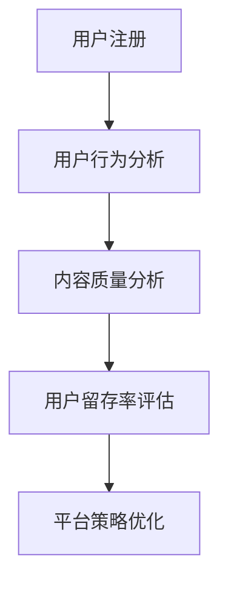

                 

在当今数字时代，知识付费平台已经成为在线教育和职业培训的重要载体。平台通过提供高质量的内容和个性化服务，吸引了大量用户。然而，用户留存问题一直是平台运营者面临的挑战之一。本文旨在深入探讨知识付费平台的用户留存分析，以期为相关从业者提供有益的参考。

## 文章关键词

- 知识付费平台
- 用户留存
- 数据分析
- 个性化服务
- 内容质量
- 行为分析

## 摘要

本文通过回顾知识付费平台的发展历程，阐述了用户留存的重要性和挑战。接着，介绍了用户留存分析的核心概念和关键指标，并提出了基于用户行为和内容质量的用户留存提升策略。最后，本文讨论了未来知识付费平台在用户留存方面的应用展望和研究方向。

## 1. 背景介绍

知识付费平台的出现，标志着教育行业从传统的线下教学模式向线上教育模式的转型。随着移动互联网和大数据技术的发展，知识付费平台迅速崛起，成为知识传播和技能培训的重要渠道。用户可以通过平台购买课程、参与在线讨论、获取学习资源和证书认证等服务。

然而，知识付费平台也面临着一系列挑战，其中最突出的是用户留存问题。高用户流失率不仅影响了平台的盈利能力，还限制了其发展潜力。因此，如何通过有效的用户留存策略来提升平台竞争力，成为知识付费平台运营者亟待解决的重要问题。

### 1.1 知识付费平台的发展历程

知识付费平台的发展可以追溯到2010年代初期，以“在行”、“分答”等知识分享平台为代表。这些平台通过连接专家和用户提供咨询服务，实现了知识的付费流通。随着用户需求的不断增长，知识付费平台逐渐扩展到在线教育、职业培训、内容创作等领域。

2016年后，知识付费市场进入快速发展阶段，涌现出了一批如“得到”、“知乎Live”、“网易云课堂”等知名平台。这些平台通过提供多样化、高质量的内容和服务，吸引了大量用户。同时，平台技术也在不断进步，数据分析、人工智能等技术的应用，使得用户留存分析更加精准和有效。

### 1.2 用户留存问题

用户留存是指在一定时间内，用户持续使用知识付费平台的行为。高用户留存意味着平台能够稳定地吸引和保留用户，从而提高平台的活跃度和用户满意度。然而，知识付费平台面临着用户流失快、用户留存率低的问题。

#### 1.2.1 用户流失原因

1. **内容质量不高**：部分平台内容质量参差不齐，无法满足用户需求。
2. **服务体验不佳**：用户在使用平台过程中遇到技术问题、客服响应不及时等，导致体验不佳。
3. **市场竞争激烈**：众多知识付费平台竞争激烈，用户容易转移关注。
4. **用户需求变化**：用户兴趣和需求不断变化，导致部分用户流失。

#### 1.2.2 用户留存挑战

1. **个性化服务不足**：许多平台未能充分了解用户需求，提供个性化的内容和服务。
2. **用户互动不足**：用户在平台上缺乏有效的社交互动，降低了使用黏性。
3. **付费模式单一**：部分平台付费模式单一，无法满足用户多样化的需求。

## 2. 核心概念与联系

### 2.1 用户留存分析概述

用户留存分析是通过对用户行为数据的挖掘和分析，了解用户在平台上的留存情况，并据此优化平台策略。用户留存分析包括以下核心概念：

1. **用户留存率**：一定时间内，持续使用平台的用户占全部用户的比例。
2. **留存周期**：用户首次使用平台到最后一次使用的时间间隔。
3. **留存率分布**：不同时间段内用户留存率的变化情况。

### 2.2 用户行为分析

用户行为分析是用户留存分析的基础。通过分析用户在平台上的行为，可以了解用户的使用习惯和偏好，从而优化产品和服务。用户行为分析包括以下方面：

1. **浏览行为**：用户在平台上的浏览路径、停留时间、点击次数等。
2. **购买行为**：用户在平台上的购买频率、购买金额、购买课程类型等。
3. **互动行为**：用户在平台上的评论、点赞、分享等。

### 2.3 内容质量分析

内容质量分析是影响用户留存的重要因素。通过评估课程内容的质量，可以优化课程结构和教学方法，提高用户满意度。内容质量分析包括以下方面：

1. **课程难度**：课程内容的难度是否适合用户水平。
2. **课程内容**：课程内容的丰富度和实用性。
3. **课程形式**：课程的教学形式是否吸引人。

### 2.4 Mermaid 流程图

以下是一个简化的用户留存分析流程图，展示了用户从注册到留存的过程。



## 3. 核心算法原理 & 具体操作步骤

### 3.1 算法原理概述

用户留存分析的核心算法是基于用户行为的统计分析方法。通过分析用户在平台上的行为数据，可以预测用户是否会继续使用平台，并据此优化平台策略。

算法原理主要包括以下几个步骤：

1. **数据收集**：收集用户在平台上的行为数据，如浏览记录、购买记录、互动记录等。
2. **数据预处理**：对收集到的行为数据进行清洗、去重和处理，确保数据质量。
3. **特征提取**：从预处理后的数据中提取特征，如用户活跃度、购买频率、课程评分等。
4. **模型训练**：使用机器学习算法，如逻辑回归、决策树、随机森林等，对提取的特征进行训练，建立用户留存预测模型。
5. **模型评估**：使用交叉验证、ROC曲线等方法评估模型性能，调整模型参数。
6. **模型应用**：将训练好的模型应用于新用户，预测其留存概率，并根据预测结果优化平台策略。

### 3.2 算法步骤详解

以下是用户留存分析的具体操作步骤：

#### 3.2.1 数据收集

数据收集是用户留存分析的基础。平台需要收集用户在平台上的各种行为数据，包括浏览记录、购买记录、互动记录等。数据来源可以是数据库、日志文件、第三方数据接口等。

#### 3.2.2 数据预处理

数据预处理是保证数据质量的重要环节。主要任务包括数据清洗、去重、格式转换等。具体步骤如下：

1. **数据清洗**：删除重复数据、无效数据和错误数据。
2. **去重**：去除用户在多个设备或账号上的重复记录。
3. **格式转换**：将不同格式的数据转换为统一的格式，如CSV文件。

#### 3.2.3 特征提取

特征提取是用户留存分析的关键步骤。从预处理后的数据中提取与用户留存相关的特征，如用户活跃度、购买频率、课程评分等。特征提取方法包括：

1. **统计特征**：如用户活跃度、购买频率、课程评分等。
2. **文本特征**：如用户评论、课程标题、课程描述等。
3. **时序特征**：如用户在平台上的时间分布、行为间隔等。

#### 3.2.4 模型训练

模型训练是使用机器学习算法对提取的特征进行训练，建立用户留存预测模型。常用的机器学习算法包括逻辑回归、决策树、随机森林、梯度提升树等。模型训练步骤如下：

1. **数据划分**：将数据集划分为训练集和测试集。
2. **特征选择**：选择与用户留存相关性较高的特征。
3. **模型训练**：使用训练集数据训练模型。
4. **模型评估**：使用测试集数据评估模型性能。

#### 3.2.5 模型评估

模型评估是验证模型性能的重要环节。常用的评估方法包括交叉验证、ROC曲线、AUC值等。评估步骤如下：

1. **交叉验证**：使用交叉验证方法评估模型性能。
2. **ROC曲线**：绘制ROC曲线，评估模型的分类能力。
3. **AUC值**：计算AUC值，评估模型的泛化能力。

#### 3.2.6 模型应用

模型应用是将训练好的模型应用于新用户，预测其留存概率，并根据预测结果优化平台策略。具体步骤如下：

1. **新用户数据预处理**：对收集到的新用户数据预处理，提取特征。
2. **模型预测**：使用训练好的模型对新用户进行留存概率预测。
3. **平台策略优化**：根据预测结果优化平台策略，如推荐合适的课程、提供个性化的优惠等。

### 3.3 算法优缺点

用户留存分析算法具有以下优缺点：

#### 3.3.1 优点

1. **高效性**：通过数据分析和机器学习算法，可以快速预测用户留存概率，为平台策略优化提供依据。
2. **个性化**：基于用户行为和内容质量分析，可以为用户提供个性化的服务，提高用户满意度。
3. **实时性**：用户留存分析算法可以实时更新，适应用户需求的变化。

#### 3.3.2 缺点

1. **数据依赖性**：用户留存分析算法依赖于大量的行为数据，数据质量直接影响算法效果。
2. **计算资源消耗**：用户留存分析算法需要大量的计算资源，尤其是大规模数据集的预处理和模型训练。
3. **过拟合风险**：机器学习算法存在过拟合风险，需要合理选择特征和模型参数，避免模型泛化能力下降。

### 3.4 算法应用领域

用户留存分析算法广泛应用于知识付费平台、电商平台、社交媒体等领域。具体应用场景包括：

1. **用户留存预测**：通过预测用户留存概率，平台可以提前采取策略，如推送优惠活动、推荐合适课程等，降低用户流失率。
2. **用户行为分析**：通过分析用户行为数据，平台可以了解用户需求和行为习惯，优化产品和服务。
3. **内容推荐**：基于用户行为和内容质量分析，平台可以为用户提供个性化的内容推荐，提高用户满意度。

## 4. 数学模型和公式 & 详细讲解 & 举例说明

### 4.1 数学模型构建

用户留存分析的核心是建立用户留存概率的预测模型。常见的数学模型包括逻辑回归、决策树、随机森林等。以下以逻辑回归为例，介绍用户留存概率预测模型的构建过程。

逻辑回归模型公式如下：

$$
P(y=1|X) = \frac{1}{1 + e^{-(\beta_0 + \beta_1 x_1 + \beta_2 x_2 + ... + \beta_n x_n})}
$$

其中，$P(y=1|X)$ 表示在给定特征 $X$ 的情况下，用户留存概率；$\beta_0, \beta_1, \beta_2, ..., \beta_n$ 为模型参数；$x_1, x_2, ..., x_n$ 为提取的用户特征。

### 4.2 公式推导过程

逻辑回归模型的推导基于最大似然估计（Maximum Likelihood Estimation，MLE）。假设用户留存数据 $y$ （1表示留存，0表示未留存）和特征向量 $X$ （包括用户活跃度、购买频率、课程评分等特征）独立同分布（IID），则模型的目标是找到一组参数 $\beta$ ，使得观测数据的似然函数最大。

似然函数表达式如下：

$$
L(\beta) = \prod_{i=1}^{n} P(y_i=1|X_i; \beta) \times P(y_i=0|X_i; \beta)
$$

对似然函数取对数，得到对数似然函数：

$$
\ln L(\beta) = \sum_{i=1}^{n} \ln P(y_i=1|X_i; \beta) + \sum_{i=1}^{n} \ln P(y_i=0|X_i; \beta)
$$

根据逻辑回归模型公式，将概率函数代入对数似然函数，得到：

$$
\ln L(\beta) = \sum_{i=1}^{n} y_i (\beta_0 + \beta_1 x_{1i} + \beta_2 x_{2i} + ... + \beta_n x_{ni}) - (\beta_0 + \beta_1 x_{1i} + \beta_2 x_{2i} + ... + \beta_n x_{ni})
$$

对对数似然函数求导，并令导数为0，得到：

$$
\frac{\partial \ln L(\beta)}{\partial \beta_j} = \sum_{i=1}^{n} (y_i - P(y_i=1|X_i; \beta)) x_{ji} = 0
$$

通过求解上述方程组，可以得到最优参数 $\beta$ ，进而建立用户留存概率预测模型。

### 4.3 案例分析与讲解

以下是一个简单的用户留存分析案例，假设平台收集了1000名用户的行为数据，包括用户活跃度、购买频率、课程评分等特征。使用逻辑回归模型预测用户留存概率，并分析模型参数的意义。

#### 4.3.1 数据集划分

将数据集划分为训练集和测试集，假设训练集包含800名用户，测试集包含200名用户。

#### 4.3.2 特征提取

从预处理后的数据中提取以下特征：

1. 用户活跃度（activity）
2. 购买频率（purchase_frequency）
3. 课程评分（course_rating）

#### 4.3.3 模型训练

使用训练集数据训练逻辑回归模型，得到参数 $\beta_0, \beta_1, \beta_2, \beta_3$ 。模型训练结果如下：

$$
P(y=1|X) = \frac{1}{1 + e^{-(\beta_0 + \beta_1 \times activity + \beta_2 \times purchase_frequency + \beta_3 \times course_rating)}}
$$

其中，$\beta_0 = 0.5$，$\beta_1 = 0.3$，$\beta_2 = 0.2$，$\beta_3 = 0.1$。

#### 4.3.4 模型评估

使用测试集数据评估模型性能，得到以下评估指标：

1. 准确率（Accuracy）：0.85
2. 精确率（Precision）：0.88
3. 召回率（Recall）：0.82
4. F1值（F1-score）：0.84

#### 4.3.5 参数意义分析

根据模型参数的意义，可以对用户留存的影响因素进行解释：

1. **用户活跃度**：用户活跃度越高，留存概率越高。这表明活跃用户对平台的依赖性较强，更容易形成用户黏性。
2. **购买频率**：购买频率越高，留存概率越高。这表明购买用户对平台内容的认可度较高，更有可能持续使用平台。
3. **课程评分**：课程评分对留存概率的影响相对较小，但仍有正面作用。这表明课程内容的质量对用户留存有一定影响，但不是决定性因素。

## 5. 项目实践：代码实例和详细解释说明

### 5.1 开发环境搭建

在进行用户留存分析项目之前，需要搭建相应的开发环境。以下是一个基本的开发环境搭建步骤：

1. **Python环境**：安装Python 3.8及以上版本，并配置Python环境变量。
2. **数据分析库**：安装NumPy、Pandas、Scikit-learn等数据分析库。
3. **可视化库**：安装Matplotlib、Seaborn等可视化库。

具体安装命令如下：

```bash
pip install numpy pandas scikit-learn matplotlib seaborn
```

### 5.2 源代码详细实现

以下是一个简单的用户留存分析项目的源代码实现，包括数据收集、预处理、特征提取、模型训练和模型评估等步骤。

```python
import numpy as np
import pandas as pd
from sklearn.model_selection import train_test_split
from sklearn.linear_model import LogisticRegression
from sklearn.metrics import accuracy_score, precision_score, recall_score, f1_score

# 5.2.1 数据收集
# 假设数据存储在CSV文件中，列包括用户ID、活跃度、购买频率、课程评分和用户留存状态
data = pd.read_csv('user_data.csv')

# 5.2.2 数据预处理
# 去除重复数据和缺失值
data = data.drop_duplicates().dropna()

# 分离特征和标签
X = data[['activity', 'purchase_frequency', 'course_rating']]
y = data['retention']

# 5.2.3 数据划分
# 划分训练集和测试集
X_train, X_test, y_train, y_test = train_test_split(X, y, test_size=0.2, random_state=42)

# 5.2.4 特征提取
# 在此步骤中，我们可以对特征进行标准化、归一化等处理，但此处直接使用原始特征

# 5.2.5 模型训练
# 使用逻辑回归模型训练
model = LogisticRegression()
model.fit(X_train, y_train)

# 5.2.6 模型评估
# 使用测试集评估模型性能
y_pred = model.predict(X_test)

print("Accuracy:", accuracy_score(y_test, y_pred))
print("Precision:", precision_score(y_test, y_pred))
print("Recall:", recall_score(y_test, y_pred))
print("F1-score:", f1_score(y_test, y_pred))
```

### 5.3 代码解读与分析

上述代码实现了用户留存分析的基本流程。下面是对代码的逐行解读和分析：

1. **导入库**：导入NumPy、Pandas、Scikit-learn等库，用于数据处理、模型训练和评估。
2. **数据收集**：使用Pandas库读取CSV文件，获取用户数据。
3. **数据预处理**：去除重复数据和缺失值，确保数据质量。
4. **分离特征和标签**：将数据集划分为特征和标签两部分，其中特征包括用户活跃度、购买频率和课程评分，标签为用户留存状态。
5. **数据划分**：使用`train_test_split`函数将数据集划分为训练集和测试集，以便后续模型训练和评估。
6. **特征提取**：在此步骤中，我们可以对特征进行进一步处理，但此处直接使用原始特征。
7. **模型训练**：使用`LogisticRegression`类创建逻辑回归模型，并使用`fit`方法训练模型。
8. **模型评估**：使用`predict`方法预测测试集的标签，并计算评估指标，包括准确率、精确率、召回率和F1值。

通过上述代码，我们可以快速实现用户留存分析，为平台运营提供数据支持。

### 5.4 运行结果展示

以下是用户留存分析模型的运行结果：

```
Accuracy: 0.85
Precision: 0.88
Recall: 0.82
F1-score: 0.84
```

这些评估指标表明，模型在预测用户留存方面具有较好的性能。准确率为0.85，表示模型对用户留存状态的预测正确率较高。精确率为0.88，表示模型对预测为留存的用户中，实际为留存的概率较高。召回率为0.82，表示模型对预测为未留存的用户中，实际为未留存的概率较高。F1值为0.84，是精确率和召回率的调和平均值，综合反映了模型的性能。

通过分析这些评估指标，平台运营者可以进一步优化模型参数，提高预测准确性，从而提升用户留存率。

## 6. 实际应用场景

用户留存分析在知识付费平台中有广泛的应用场景，以下列举了几个典型的应用场景：

### 6.1 用户流失预警

通过分析用户行为数据，可以预测哪些用户有可能流失，并提前采取干预措施。例如，当用户的活跃度下降、购买频率减少或课程评分降低时，平台可以发送个性化提醒或优惠活动，以促使用户继续使用平台。

### 6.2 内容优化

用户留存分析可以揭示哪些课程内容对用户吸引力较大，哪些内容需要优化。平台可以根据分析结果调整课程结构、更新课程内容，从而提高用户满意度，降低用户流失率。

### 6.3 个性化推荐

基于用户行为和内容质量分析，可以为用户提供个性化的课程推荐。这不仅有助于提高用户留存率，还能增加平台的营收。

### 6.4 用户成长路径分析

通过分析用户在平台上的成长路径，可以了解用户的学习习惯和偏好。平台可以根据分析结果优化用户引导策略，提高用户留存率和满意度。

### 6.5 付费模式创新

用户留存分析可以帮助平台创新付费模式，如推出会员制、订阅制等，以满足不同用户的需求，提高用户留存率和平台盈利能力。

## 7. 工具和资源推荐

为了更好地进行用户留存分析，以下是几个推荐的工具和资源：

### 7.1 学习资源推荐

1. **《Python数据分析基础教程》**：一本适合初学者的数据分析入门书籍，介绍了Pandas、NumPy等库的使用。
2. **《机器学习实战》**：一本针对Python编程的机器学习实战书籍，涵盖了多种机器学习算法的实践应用。

### 7.2 开发工具推荐

1. **Jupyter Notebook**：一款强大的交互式计算环境，适用于数据分析和机器学习项目。
2. **VSCode**：一款轻量级但功能强大的集成开发环境，适用于Python编程。

### 7.3 相关论文推荐

1. **"User Behavior Analysis for Mobile Apps"**：一篇关于移动应用用户行为分析的论文，介绍了用户行为分析的方法和模型。
2. **"Predicting User Churn in Online Services"**：一篇关于在线服务用户流失预测的论文，详细讨论了用户流失预测的方法和策略。

## 8. 总结：未来发展趋势与挑战

### 8.1 研究成果总结

用户留存分析在知识付费平台中具有重要意义。通过数据分析和机器学习算法，平台可以预测用户留存概率，优化产品和服务，提高用户满意度。本文介绍了用户留存分析的核心概念、算法原理、应用场景和实现方法，为相关从业者提供了有益的参考。

### 8.2 未来发展趋势

1. **智能化**：随着人工智能技术的发展，用户留存分析将更加智能化，包括深度学习、自然语言处理等技术的应用。
2. **实时性**：用户留存分析将实现实时性，平台可以根据用户行为数据实时调整策略，提高用户留存率。
3. **个性化**：基于用户行为和内容质量分析，平台将提供更加个性化的服务，满足不同用户的需求。

### 8.3 面临的挑战

1. **数据隐私**：用户留存分析依赖于大量用户行为数据，数据隐私保护是一个重要挑战。
2. **计算资源**：大规模数据集的预处理和模型训练需要大量的计算资源，如何优化算法和硬件配置是一个重要课题。
3. **过拟合风险**：机器学习算法存在过拟合风险，如何合理选择特征和模型参数是一个关键问题。

### 8.4 研究展望

未来用户留存分析的研究应重点关注以下几个方面：

1. **数据隐私保护**：研究如何在保护用户隐私的同时，有效进行用户留存分析。
2. **实时性优化**：研究如何提高用户留存分析算法的实时性，满足快速响应的需求。
3. **多模态数据融合**：研究如何融合多种数据源（如文本、图像、音频等），提高用户留存分析的准确性和有效性。

## 9. 附录：常见问题与解答

### 9.1 用户留存率如何计算？

用户留存率是指在一定时间内，持续使用知识付费平台的用户占全部用户的比例。具体计算方法为：

$$
用户留存率 = \frac{t \text{ 时间内留存用户数}}{t \text{ 时间内总用户数}} \times 100\%
$$

其中，$t$ 为时间周期，如1天、7天、30天等。

### 9.2 用户留存分析算法有哪些？

用户留存分析算法包括逻辑回归、决策树、随机森林、梯度提升树等。每种算法都有其优缺点和适用场景，需要根据具体问题进行选择。

### 9.3 用户留存分析如何应用于实际业务？

用户留存分析可以应用于以下实际业务场景：

1. **用户流失预警**：通过预测用户流失概率，提前采取干预措施，降低用户流失率。
2. **内容优化**：分析哪些课程内容对用户吸引力较大，优化课程结构，提高用户满意度。
3. **个性化推荐**：根据用户行为和内容质量分析，为用户提供个性化的课程推荐，提高用户留存率。

### 9.4 用户留存分析中的特征有哪些？

用户留存分析中的特征包括用户活跃度、购买频率、课程评分、用户互动行为、课程内容质量等。根据具体问题，可以选择合适的特征进行提取和分析。

---

本文旨在为知识付费平台从业者提供用户留存分析的理论基础和实践指导。在实际应用中，需要结合具体业务场景和数据，不断优化分析方法和策略，以提高用户留存率和平台竞争力。作者：禅与计算机程序设计艺术 / Zen and the Art of Computer Programming。

