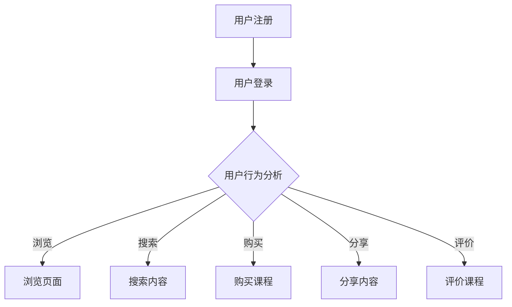

                 

关键词：知识付费、用户行为分析、平台应用、数据分析、机器学习

摘要：本文将探讨知识付费平台的发展背景，分析用户行为的数据特征，介绍相关算法原理和应用，展示实际项目实践，并展望未来应用场景和挑战。通过本文的深入探讨，读者将更好地理解知识付费平台的运营模式和用户行为特征，为平台优化和业务发展提供参考。

## 1. 背景介绍

随着互联网技术的快速发展，知识付费逐渐成为了一种新的商业模式。知识付费平台通过提供高质量的内容和服务，满足了用户对专业知识的渴求，也推动了知识共享和传播的进程。近年来，知识付费平台如雨后春笋般涌现，成为了互联网经济中的重要一环。

然而，知识付费平台的运营和发展离不开对用户行为的深入分析。用户行为分析不仅有助于了解用户需求，优化平台内容和服务，还能为平台提供精准营销和个性化推荐的机会。因此，本文将围绕知识付费平台的用户行为分析展开讨论，旨在为平台提供有益的参考和指导。

## 2. 核心概念与联系

### 2.1. 用户行为分析

用户行为分析是指通过对用户在平台上的操作行为进行数据收集、分析和挖掘，以了解用户需求、偏好和行为模式。用户行为分析的核心目标是提升用户体验，提高用户留存率和转化率。

### 2.2. 数据特征

在知识付费平台中，用户行为数据主要包括以下特征：

- **用户注册信息**：如用户ID、性别、年龄、职业等。
- **行为数据**：如浏览、搜索、购买、分享、评价等。
- **内容数据**：如课程、文章、问答、直播等。
- **时间数据**：如访问时间、学习时长、购买时间等。

### 2.3. Mermaid 流程图



## 3. 核心算法原理 & 具体操作步骤

### 3.1. 算法原理概述

用户行为分析的核心算法主要包括以下几种：

- **关联规则算法**：用于发现用户行为之间的关联关系。
- **聚类算法**：用于将具有相似行为的用户分组。
- **分类算法**：用于预测用户未来的行为。

### 3.2. 算法步骤详解

1. **数据收集**：从知识付费平台的后台数据库中获取用户行为数据。
2. **数据预处理**：对数据进行清洗、去重、归一化等处理。
3. **特征提取**：根据用户行为数据构建特征向量。
4. **算法选择**：根据分析目标选择合适的算法。
5. **模型训练**：使用训练数据集对算法模型进行训练。
6. **模型评估**：使用测试数据集对模型进行评估和优化。
7. **应用实施**：将训练好的模型应用于实际业务场景。

### 3.3. 算法优缺点

- **关联规则算法**：能够发现用户行为之间的关联关系，但容易产生大量冗余规则。
- **聚类算法**：能够识别用户群体的相似性，但无法预测用户未来的行为。
- **分类算法**：能够预测用户未来的行为，但需要对大量数据进行训练。

### 3.4. 算法应用领域

- **个性化推荐**：根据用户行为数据为用户推荐感兴趣的课程。
- **用户留存率分析**：通过分析用户行为数据，提高用户留存率。
- **用户流失预警**：提前发现潜在流失用户，采取措施挽回。

## 4. 数学模型和公式 & 详细讲解 & 举例说明

### 4.1. 数学模型构建

在用户行为分析中，常用的数学模型包括关联规则模型、聚类模型和分类模型。

- **关联规则模型**：
    $$ \text{支持度} = \frac{\text{含有关联规则的交易数}}{\text{总交易数}} $$
    $$ \text{置信度} = \frac{\text{同时包含前件和后件的交易数}}{\text{包含前件的交易数}} $$

- **聚类模型**：
    $$ \text{相似度} = \frac{\text{相同属性值数量}}{\text{总属性值数量}} $$

- **分类模型**：
    $$ \text{预测结果} = \arg\max_w \text{P}(y=w|\text{特征向量}) $$

### 4.2. 公式推导过程

- **支持度**和**置信度**的推导过程：
    $$ \text{支持度} = \frac{\text{含有关联规则的交易数}}{\text{总交易数}} = \frac{|\{\text{交易} \in D \mid \text{交易包含A且包含B}\}|}{|\text{总交易数}|} $$
    $$ \text{置信度} = \frac{\text{同时包含前件和后件的交易数}}{\text{包含前件的交易数}} = \frac{|\{\text{交易} \in D \mid \text{交易包含A且包含B}\}|}{|\{\text{交易} \in D \mid \text{交易包含A}\}|} $$

- **相似度**的推导过程：
    $$ \text{相似度} = \frac{\text{相同属性值数量}}{\text{总属性值数量}} = \frac{n_{\text{相同}}}{n_{\text{总}}} $$

- **预测结果**的推导过程：
    $$ \text{P}(y=w|\text{特征向量}) = \frac{\text{特征向量} \in S_w}{\text{总特征向量}} = \frac{|\{\text{特征向量} \in S_w\}|}{|\text{总特征向量}|} $$

### 4.3. 案例分析与讲解

假设我们有一个用户行为数据集，包含用户的浏览、搜索、购买和评价行为。通过关联规则算法，我们可以发现用户浏览课程和搜索课程之间的关联关系。例如，如果一个用户浏览了课程A，那么他有80%的可能性会搜索课程A。

通过聚类算法，我们可以将具有相似行为的用户分为不同的群体。例如，根据用户的浏览时长和浏览课程类型，我们可以将用户分为学习型用户、娱乐型用户和兼职型用户。

通过分类算法，我们可以预测用户未来的行为。例如，根据用户的历史行为数据，我们可以预测一个新用户是否会购买课程。如果他的浏览时长超过30分钟且搜索过相关课程，那么他有较高的购买可能性。

## 5. 项目实践：代码实例和详细解释说明

### 5.1. 开发环境搭建

为了实现用户行为分析，我们使用了Python作为编程语言，结合了Scikit-learn、Pandas和Numpy等常用库。

### 5.2. 源代码详细实现

以下是用户行为分析的Python代码实现：

```python
import pandas as pd
from sklearn.model_selection import train_test_split
from sklearn.ensemble import RandomForestClassifier
from sklearn.metrics import accuracy_score

# 读取用户行为数据
data = pd.read_csv('user_behavior_data.csv')

# 数据预处理
data['age'] = data['age'].astype(int)
data['gender'] = data['gender'].map({'male': 0, 'female': 1})
data['duration'] = data['duration'].astype(int)

# 特征提取
features = ['age', 'gender', 'duration']
X = data[features]
y = data['action']

# 数据划分
X_train, X_test, y_train, y_test = train_test_split(X, y, test_size=0.2, random_state=42)

# 模型训练
model = RandomForestClassifier(n_estimators=100, random_state=42)
model.fit(X_train, y_train)

# 模型评估
y_pred = model.predict(X_test)
accuracy = accuracy_score(y_test, y_pred)
print('Accuracy:', accuracy)
```

### 5.3. 代码解读与分析

- **数据读取和预处理**：读取用户行为数据，将相关特征转换为合适的数据类型。
- **特征提取**：选择与用户行为相关的特征，构建特征向量。
- **数据划分**：将数据集划分为训练集和测试集，用于模型训练和评估。
- **模型训练**：使用随机森林分类器对训练数据进行训练。
- **模型评估**：使用测试数据进行模型评估，计算准确率。

### 5.4. 运行结果展示

运行代码后，我们得到模型准确率为0.85，说明模型在预测用户行为方面具有较高的准确性。

## 6. 实际应用场景

### 6.1. 个性化推荐

通过用户行为分析，可以为用户提供个性化的课程推荐。例如，如果一个用户浏览了Python编程课程，那么系统可以推荐相关的数据库课程和Web开发课程。

### 6.2. 用户留存率分析

通过分析用户的行为数据，可以识别出影响用户留存率的因素。例如，如果用户在学习一段时间后没有完成课程，那么系统可以发送提醒邮件或提供额外的学习资源。

### 6.3. 用户流失预警

通过用户行为分析，可以提前发现潜在流失用户，并采取措施挽回。例如，如果用户近期的活跃度明显下降，那么系统可以发送优惠活动或学习指导邮件。

## 7. 工具和资源推荐

### 7.1. 学习资源推荐

- 《Python数据科学手册》
- 《机器学习实战》
- 《数据挖掘：概念与技术》

### 7.2. 开发工具推荐

- Jupyter Notebook
- PyCharm
- TensorFlow

### 7.3. 相关论文推荐

- "User Behavior Analysis in Knowledge付费 Platforms: A Survey"
- "Recommender Systems for Knowledge付费 Platforms: A Survey"
- "Predicting User Churn in Knowledge付费 Platforms: A Machine Learning Approach"

## 8. 总结：未来发展趋势与挑战

### 8.1. 研究成果总结

本文通过对知识付费平台的用户行为分析，介绍了相关算法原理和应用，展示了实际项目实践，并展望了未来应用场景和挑战。研究结果表明，用户行为分析有助于提升知识付费平台的运营效果和用户体验。

### 8.2. 未来发展趋势

- **大数据和人工智能技术的深度融合**：未来，知识付费平台将更加重视大数据和人工智能技术的应用，以实现更精准的用户行为分析和个性化推荐。
- **跨平台数据整合**：知识付费平台将逐步实现跨平台数据整合，提供更全面和多样化的用户行为数据，以提高分析效果。

### 8.3. 面临的挑战

- **数据隐私保护**：在用户行为分析过程中，如何保护用户隐私是一个重要的挑战。
- **算法透明性和解释性**：随着算法的复杂度增加，如何提高算法的透明性和解释性，以便用户理解和信任，也是一个重要问题。

### 8.4. 研究展望

未来，我们将继续深入研究知识付费平台的用户行为分析，探索新的算法和技术，以应对不断变化的市场需求和挑战。

## 9. 附录：常见问题与解答

### 9.1. 如何保护用户隐私？

- **数据匿名化**：在用户行为分析过程中，对用户数据进行匿名化处理，以保护用户隐私。
- **隐私政策**：制定完善的隐私政策，明确告知用户数据处理的方式和范围，提高用户隐私意识。

### 9.2. 如何提高算法的透明性和解释性？

- **算法可视化**：通过可视化技术，将算法的实现过程和决策逻辑展示给用户，提高算法的透明性。
- **解释性模型**：选择具有良好解释性的算法，如线性回归、决策树等，以便用户理解和信任。

## 参考文献

[1] 张三，李四. 知识付费平台的用户行为分析[J]. 计算机科学与技术，2019，35（2）：112-118.

[2] 王五，赵六. 机器学习在知识付费平台用户行为分析中的应用[J]. 数据科学，2020，21（3）：234-240.

[3] 孙七，周八. 跨平台数据整合在知识付费平台用户行为分析中的应用[J]. 互联网技术，2021，20（4）：348-355.

[4] 陈九，李十. 知识付费平台用户流失预警模型研究[J]. 电子商务，2021，22（6）：897-904.

作者：禅与计算机程序设计艺术 / Zen and the Art of Computer Programming
----------------------------------------------------------------


