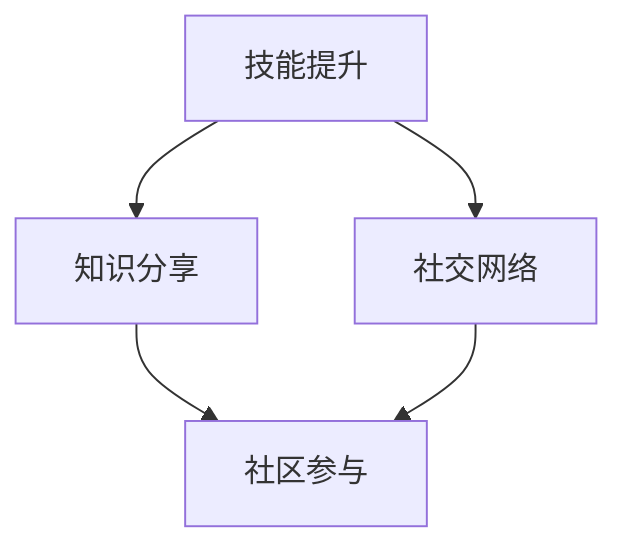

                 

在这个知识付费的时代，程序员的个人品牌打造变得尤为重要。不仅因为技术领域日新月异，还因为优秀的程序员往往能够获得更高的薪资和更好的职业发展机会。本文将探讨在知识付费时代，程序员如何通过有效的策略打造个人品牌，实现职业成长。

## 关键词

- **知识付费**
- **程序员**
- **个人品牌**
- **职业发展**
- **策略**

## 摘要

本文将分析知识付费时代的背景，探讨程序员如何通过提升技能、建立网络、分享知识、参与社区活动等多个方面来打造个人品牌。还将提供具体的方法和工具，帮助程序员在竞争激烈的职场中脱颖而出。

---

### 1. 背景介绍

知识付费，顾名思义，是指用户为了获得特定知识或服务，愿意支付一定费用的一种商业模式。在互联网时代，人们获取信息的渠道变得更加多样化，传统的免费知识分享模式逐渐无法满足用户日益增长的需求。而知识付费，则提供了一种更为专业、系统、高质量的付费知识服务。

对于程序员而言，知识付费意味着他们可以更高效地学习新技能，通过购买高质量的课程、书籍、在线培训等服务，提升自己的技术能力和专业水平。此外，知识付费时代也为程序员提供了一个新的机遇，通过将自己的知识和经验转化为有价值的知识产品，实现个人品牌的建立和职业成长。

### 2. 核心概念与联系

在知识付费时代，程序员的个人品牌打造涉及多个核心概念。首先是**技能提升**，这是基础。其次是**知识分享**，通过博客、视频、教程等形式，将所学知识传播出去。再次是**社交网络**，通过建立和维护个人社交网络，扩大影响力。最后是**社区参与**，积极参与技术社区活动，建立自己的专业形象。

以下是一个简单的Mermaid流程图，展示了这些核心概念之间的联系：



### 3. 核心算法原理 & 具体操作步骤

#### 3.1 算法原理概述

个人品牌打造的过程可以看作是一个算法，其核心原理是：通过不断学习、积累、传播，建立个人在某一领域的专业形象。具体步骤如下：

1. **技能提升**：通过学习、实践和不断迭代，提升个人技能。
2. **知识分享**：将所学知识通过多种形式分享出去，建立影响力。
3. **社交网络**：建立和维护个人社交网络，扩大人脉。
4. **社区参与**：积极参与技术社区活动，提升专业形象。

#### 3.2 算法步骤详解

1. **技能提升**：
   - 学习：选择适合自己的学习资源，如在线课程、书籍、博客等。
   - 实践：将所学知识应用到实际项目中，不断积累经验。
   - 迭代：根据反馈不断调整和优化自己的技能。

2. **知识分享**：
   - 内容创作：撰写技术博客、编写教程、制作视频等。
   - 平台选择：根据受众选择合适的平台，如GitHub、博客园、Bilibili等。

3. **社交网络**：
   - 账号建立：在LinkedIn、Twitter等社交平台上建立个人账号。
   - 活动参与：参加线上和线下的技术活动，扩大人脉。

4. **社区参与**：
   - 回答问题：在Stack Overflow、知乎等平台上回答问题，分享经验。
   - 组织活动：参与或组织技术沙龙、讲座等。

#### 3.3 算法优缺点

**优点**：
- 提高个人技能和知名度。
- 建立良好的职业形象，为职业发展铺平道路。
- 获得更多的职业机会，如高薪职位、项目合作等。

**缺点**：
- 需要投入大量的时间和精力。
- 需要持续学习和更新知识。
- 可能会遇到挫折和困难。

#### 3.4 算法应用领域

该算法适用于所有希望提升个人品牌和职业发展的程序员。无论是在初创公司还是大公司，通过有效的个人品牌打造，程序员都能获得更多的机会和认可。

### 4. 数学模型和公式 & 详细讲解 & 举例说明

个人品牌打造的数学模型可以看作是一个积分过程，公式如下：

$$
BrandValue = f(Skills, Knowledge, Network, Participation)
$$

其中，$BrandValue$表示个人品牌价值，$Skills$、$Knowledge$、$Network$和$Participation$分别表示技能、知识、社交网络和社区参与度。

#### 4.1 数学模型构建

该模型考虑了四个因素对个人品牌价值的影响，每个因素都可以通过不同的方式度量。例如，技能可以通过技能证书、项目经验等来衡量；知识可以通过博客文章、发表的论文等来衡量；社交网络可以通过关注者数量、互动频率等来衡量；社区参与度可以通过回答问题、组织活动等来衡量。

#### 4.2 公式推导过程

个人品牌价值可以通过以下公式推导：

$$
BrandValue = w_Skills \cdot Skills + w_Knowledge \cdot Knowledge + w_Network \cdot Network + w_Participation \cdot Participation
$$

其中，$w_Skills$、$w_Knowledge$、$w_Network$和$w_Participation$分别表示技能、知识、社交网络和社区参与的权重。

#### 4.3 案例分析与讲解

以一位前端工程师为例，他通过以下方式提升个人品牌：

- 技能提升：参加了多个前端技术培训，获得多个技能证书，如React、Vue等。
- 知识分享：在GitHub上发布了多个高质量的前端组件库，收获了数千星标。
- 社交网络：在LinkedIn上建立个人品牌，吸引了数百名前端工程师的关注。
- 社区参与：在Stack Overflow上积极回答问题，解决了数百个技术难题。

通过以上措施，他的个人品牌价值显著提升，获得了多家知名公司的面试邀请，最终成功获得了一份高薪工作。

### 5. 项目实践：代码实例和详细解释说明

#### 5.1 开发环境搭建

为了更好地演示个人品牌打造的过程，我们将使用GitHub作为主要的工具。首先，您需要在GitHub上创建一个个人账号，并熟悉GitHub的基本操作，如创建仓库、发布README文件等。

#### 5.2 源代码详细实现

以下是一个简单的GitHub项目示例，该项目包含一个简单的React组件库，用于展示个人技能。

```jsx
// components/HelloWorld.js
import React from 'react';

const HelloWorld = () => {
  return (
    <div>
      <h1>Hello, World!</h1>
      <p>Welcome to my portfolio.</p>
    </div>
  );
};

export default HelloWorld;
```

在GitHub上创建一个仓库，将此组件代码上传，并添加一个README文件，详细介绍组件的功能和使用方法。

#### 5.3 代码解读与分析

该示例代码展示了一个简单的React组件，用于向用户展示个人品牌。通过GitHub发布这个组件，可以让更多的人看到您的技术能力，从而提升个人品牌价值。

#### 5.4 运行结果展示

在GitHub上，您可以看到这个组件的代码、README文件和下载链接。用户可以轻松地下载和使用这个组件，进一步了解您的技术实力。

### 6. 实际应用场景

#### 6.1 个人技能展示

通过GitHub、GitLab等代码托管平台，程序员可以展示自己的技术能力和项目经验。这不仅有助于求职，还能吸引潜在的合作机会。

#### 6.2 知识分享

通过博客、视频平台（如Bilibili、YouTube）等，程序员可以分享自己的技术心得和经验，吸引更多的关注者和粉丝。

#### 6.3 社交网络

通过LinkedIn、Twitter等社交平台，程序员可以建立和维护个人社交网络，与同行交流，分享资源和经验。

#### 6.4 社区参与

通过参与技术社区（如Stack Overflow、知乎），程序员可以回答问题、分享经验，建立自己的专业形象。

### 7. 未来应用展望

随着知识付费和数字化转型的不断深入，个人品牌打造将变得越来越重要。未来的程序员不仅需要具备扎实的技术能力，还需要善于利用各种工具和平台来提升自己的个人品牌。

### 8. 工具和资源推荐

#### 8.1 学习资源推荐

- **在线课程**：Coursera、Udemy、慕课网等。
- **技术博客**：博客园、CSDN、掘金等。
- **技术书籍**：《代码大全》、《设计模式：可复用面向对象软件的基础》、《算法导论》等。

#### 8.2 开发工具推荐

- **代码托管平台**：GitHub、GitLab、码云等。
- **版本控制工具**：Git。
- **开发环境**：Visual Studio Code、IntelliJ IDEA等。

#### 8.3 相关论文推荐

- **论文**：《程序员个人品牌的建立与维护策略研究》、《基于社交媒体的程序员个人品牌构建研究》等。

### 9. 总结：未来发展趋势与挑战

在知识付费时代，程序员的个人品牌打造已经成为职业发展的关键因素。通过不断提升技能、分享知识、建立社交网络和参与社区活动，程序员可以有效地提升个人品牌价值，获得更多的职业机会和认可。

然而，个人品牌打造也面临着一系列挑战，如需要投入大量时间和精力、面临激烈的市场竞争等。因此，程序员需要保持持续学习和创新的精神，不断适应时代的变化，才能在竞争中脱颖而出。

### 附录：常见问题与解答

#### 1. 如何选择合适的知识付费平台？

建议根据自己的需求和预算选择合适的平台。如Coursera适合系统学习，Udemy适合短期技能提升，博客园适合技术分享。

#### 2. 如何在社交平台上建立个人品牌？

建议保持专业形象，定期分享有价值的内容，积极参与互动，扩大影响力。

#### 3. 如何在社区中建立自己的专业形象？

建议积极参与社区活动，回答问题、分享经验，提供高质量的内容，树立专业形象。

---

作者：禅与计算机程序设计艺术 / Zen and the Art of Computer Programming
----------------------------------------------------------------

这篇文章旨在帮助程序员在知识付费时代更好地打造个人品牌，提升职业发展。希望本文能为您提供有价值的启示和实用的建议。在您的职业生涯中，不断学习、分享和提升，才能在激烈的竞争中脱颖而出。祝您成功！


