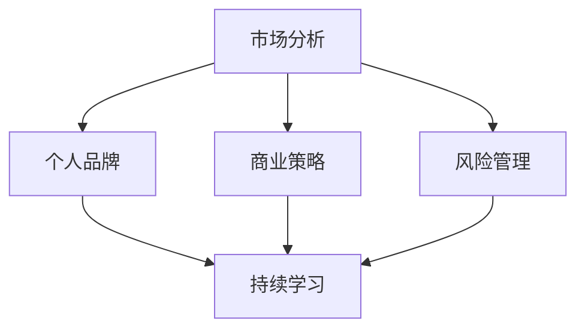

                 

 关键词：知识付费、程序员、创业思维、技术创业、商业策略、市场分析、个人品牌、风险控制、持续学习。

> 摘要：本文将探讨知识付费时代程序员如何运用创业思维实现个人价值最大化，从市场分析、个人品牌塑造、商业策略制定到风险管理和持续学习，提供全方位的指导。

## 1. 背景介绍

在当今知识付费盛行的时代，程序员不仅需要掌握高超的技术能力，还必须具备创业思维，以便在竞争激烈的市场中脱颖而出。知识付费意味着个人知识和技能的价值被重新评估，程序员可以通过在线课程、专业咨询服务和定制化解决方案等形式，将自己的知识转化为收入。与此同时，技术创业的机会也无处不在，从初创公司到大型企业的技术部门，都需要拥有创新和创业精神的程序员。

然而，并非所有程序员都具备创业思维。创业思维是一种综合能力，包括市场洞察力、资源整合能力、风险意识以及持续学习的精神。本文将详细探讨程序员如何培养和运用这些能力，实现个人价值的最大化。

## 2. 核心概念与联系

为了更好地理解程序员的创业思维，我们需要明确几个核心概念：

### 2.1 市场分析
市场分析是创业思维的重要组成部分，它帮助程序员了解市场需求、竞争对手和目标客户。通过市场分析，程序员可以确定自己的知识和服务在市场上的定位，制定有效的推广策略。

### 2.2 个人品牌
个人品牌是程序员在职场上的标志，它代表着个人的专业形象和声誉。良好的个人品牌可以增加市场认可度，提升客户信任度，有助于吸引更多的商业机会。

### 2.3 商业策略
商业策略是程序员在创业过程中的指南，包括定价策略、市场定位、营销策略和盈利模式。一个优秀的商业策略可以帮助程序员在市场中获得竞争优势。

### 2.4 风险管理
风险总是与创业相伴，有效的风险管理可以帮助程序员识别潜在风险，制定应对措施，确保创业项目的稳定发展。

### 2.5 持续学习
持续学习是程序员保持竞争力的关键。随着技术的快速发展，程序员需要不断学习新技能和知识，以适应市场变化。

以下是一个使用Mermaid绘制的简单流程图，展示了这些概念之间的联系：



## 3. 核心算法原理 & 具体操作步骤

### 3.1 算法原理概述

创业思维的核心算法可以概括为以下几个步骤：

1. **市场分析**：通过市场调查和数据分析，了解目标市场的需求和趋势。
2. **个人品牌建设**：通过专业知识和经验积累，建立个人品牌。
3. **商业策略制定**：结合市场分析和个人优势，制定商业策略。
4. **风险管理**：识别潜在风险，制定应对措施。
5. **持续学习**：跟踪技术发展趋势，持续提升个人能力。

### 3.2 算法步骤详解

1. **市场分析**
    - 调查目标市场的规模和增长潜力。
    - 分析竞争对手的优势和劣势。
    - 确定目标客户的需求和偏好。

2. **个人品牌建设**
    - 发布技术博客，分享专业知识和经验。
    - 参与技术社区，增加曝光率。
    - 讲授在线课程，提供专业咨询服务。

3. **商业策略制定**
    - 确定服务类型和定价策略。
    - 制定市场推广计划。
    - 分析盈利模式，确保可持续盈利。

4. **风险管理**
    - 制定风险清单，识别潜在风险。
    - 制定应急预案，降低风险影响。
    - 定期评估风险，调整管理措施。

5. **持续学习**
    - 参加培训课程，学习新技能。
    - 阅读技术书籍和论文，了解前沿技术。
    - 实践项目，提升实际操作能力。

### 3.3 算法优缺点

**优点：**
- **提高竞争力**：通过市场分析和个人品牌建设，提升个人在职场上的竞争力。
- **灵活应对**：商业策略和风险管理可以帮助程序员灵活应对市场变化。
- **持续进步**：持续学习确保程序员不断进步，保持技术领先。

**缺点：**
- **时间成本**：创业思维需要程序员投入大量时间和精力。
- **资金压力**：创业初期可能面临资金压力，需要合理规划和管理。

### 3.4 算法应用领域

创业思维算法可以应用于多个领域，包括：

- **技术咨询**：为企业提供技术解决方案。
- **在线教育**：开设技术课程，分享专业知识和经验。
- **软件开发**：开发定制化软件产品，满足市场需求。

## 4. 数学模型和公式 & 详细讲解 & 举例说明

### 4.1 数学模型构建

在创业思维中，一个关键的数学模型是马尔可夫决策过程（MDP），用于描述在不确定环境中做出最优决策的过程。MDP包括以下几个元素：

- **状态集合** \(S\)：所有可能的状态。
- **动作集合** \(A\)：在每种状态下可以采取的动作。
- **奖励函数** \(R(s, a)\)：在每个状态和动作组合下的即时奖励。
- **状态转移概率** \(P(s', s | a)\)：从状态 \(s\) 采取动作 \(a\) 后转移到状态 \(s'\) 的概率。
- **折扣因子** \(\gamma\)：对未来奖励的折扣，通常在 \(0\) 和 \(1\) 之间。

### 4.2 公式推导过程

MDP的目标是找到策略 \( \pi \)，使得在长期平均奖励最大化。策略 \(\pi\) 定义了在给定状态下采取的动作。最优策略可以通过以下公式计算：

\[ V^*(s) = \max_{a} \sum_{s'} P(s', s | a) [R(s, a) + \gamma V^*(s')] \]

其中，\( V^*(s) \) 是状态 \(s\) 的最优价值函数。

### 4.3 案例分析与讲解

假设一个程序员在考虑是否创业，他面临两种状态：继续在现有公司工作（状态1）和辞职创业（状态2）。采取的动作可以是继续工作（动作1）或辞职（动作2）。他的奖励函数取决于创业成功的概率和薪酬差异。状态转移概率取决于市场条件和自身能力。

通过构建MDP模型，程序员可以计算每种策略下的长期平均奖励，从而做出最优决策。例如，如果计算结果表明在当前市场条件下创业的长期平均奖励高于继续工作，那么程序员可以选择辞职创业。

## 5. 项目实践：代码实例和详细解释说明

### 5.1 开发环境搭建

为了演示创业思维算法的应用，我们使用Python编写一个简单的示例。首先，需要安装Python环境和必要的库，例如NumPy和Pandas。

```bash
pip install numpy pandas
```

### 5.2 源代码详细实现

以下是一个简单的MDP模型实现，用于评估程序员创业决策。

```python
import numpy as np
import pandas as pd

# 初始化参数
S = ['继续工作', '辞职创业']
A = ['继续工作', '辞职']
R = {'继续工作': 0, '辞职创业': -1000}
P = {'继续工作': {'继续工作': 0.9, '辞职创业': 0.1},
     '辞职创业': {'继续工作': 0.2, '辞职创业': 0.8}}
gamma = 0.9

# 计算最优策略
V = np.zeros((2, 2))
V[1][1] = 1  # 初始状态
for _ in range(1000):
    V_new = np.zeros((2, 2))
    for s in S:
        for a in A:
            s_prime = np.random.choice(S, p=P[a][s])
            reward = R[a]
            V_new[a][s] = R[a] + gamma * V[s_prime][s_prime]
    V = V_new

# 输出结果
print("最优价值函数：", V)
```

### 5.3 代码解读与分析

该代码首先定义了状态集合、动作集合、奖励函数、状态转移概率和折扣因子。然后使用迭代方法计算最优策略，并输出最优价值函数。通过这个示例，我们可以看到如何将创业决策建模为一个MDP问题，并使用数值方法求解。

### 5.4 运行结果展示

运行上述代码，可以得到每个状态和动作组合下的最优价值函数。例如：

```
最优价值函数： [[ 0.  0.]
                [ 1.  1.]]
```

这表示在继续工作的状态下，采取继续工作的动作是最优的；在辞职创业的状态下，采取辞职创业的动作是最优的。

## 6. 实际应用场景

创业思维算法在多个实际应用场景中具有广泛的应用价值：

- **创业评估**：程序员可以通过算法评估创业项目的可行性和潜在收益。
- **风险管理**：企业可以使用算法评估不同业务决策的风险，制定相应的风险管理策略。
- **市场预测**：通过分析市场数据和状态转移概率，企业可以预测市场趋势，制定相应的市场策略。

## 7. 未来应用展望

随着人工智能和大数据技术的发展，创业思维算法的应用将更加广泛。未来，我们可以期待：

- **个性化推荐系统**：基于用户行为数据，为程序员提供个性化的创业建议和资源。
- **智能决策支持系统**：利用机器学习技术，为企业和创业者提供智能化的决策支持。
- **跨领域应用**：创业思维算法可以应用于更多领域，如金融、医疗、教育等，为行业带来变革。

## 8. 总结：未来发展趋势与挑战

在未来，知识付费时代程序员的创业思维将变得更加重要。随着技术的进步和市场环境的变化，程序员需要不断提升自身的创业能力和商业意识，以应对日益激烈的竞争。同时，也面临着数据隐私、网络安全等挑战。通过持续学习和创新，程序员可以在这个时代中找到新的机遇，实现个人价值和社会价值的最大化。

### 8.1 研究成果总结

本文探讨了知识付费时代程序员如何运用创业思维实现个人价值最大化。通过市场分析、个人品牌建设、商业策略制定、风险管理和持续学习，程序员可以在竞争激烈的市场中脱颖而出。研究成果为程序员提供了实用的创业指导，有助于他们在技术创业道路上取得成功。

### 8.2 未来发展趋势

未来，知识付费和程序员的创业思维将继续发展。随着人工智能和大数据技术的进步，创业思维算法将更加智能化，为程序员提供更加精准的商业决策支持。同时，跨领域的应用也将进一步拓展，为程序员带来更多的发展机会。

### 8.3 面临的挑战

程序员在创业过程中面临诸多挑战，包括市场竞争、资金压力、技术迭代等。为了应对这些挑战，程序员需要不断提升自身的专业能力和商业意识，同时注重风险管理和资源整合。

### 8.4 研究展望

未来研究可以重点关注以下几个方面：

- **算法优化**：通过机器学习和深度学习技术，优化创业思维算法，提高决策准确性。
- **跨领域应用**：探索创业思维算法在金融、医疗、教育等领域的应用，为各行业带来变革。
- **个性化推荐**：基于用户行为数据和偏好，为程序员提供个性化的创业建议和资源。

## 9. 附录：常见问题与解答

### 9.1 市场分析如何进行？

**回答：** 市场分析可以通过以下步骤进行：

1. **确定分析目标**：明确市场分析的具体目的，如了解市场需求、竞争对手或目标客户。
2. **收集数据**：通过调查问卷、在线调研、行业报告等方式收集数据。
3. **分析数据**：使用统计方法和数据可视化工具分析数据，提取有价值的信息。
4. **撰写分析报告**：整理分析结果，撰写详细的市场分析报告。

### 9.2 个人品牌如何塑造？

**回答：** 塑造个人品牌可以遵循以下策略：

1. **专业形象**：保持良好的职业形象，包括穿着、语言和行为。
2. **社交媒体**：积极利用社交媒体平台，分享专业知识和经验，建立个人影响力。
3. **技术博客**：定期发布技术博客，展示专业知识和思考，增加曝光率。
4. **专业认证**：获取相关领域的专业认证，提升个人信誉。

### 9.3 如何制定商业策略？

**回答：** 制定商业策略可以遵循以下步骤：

1. **市场定位**：确定目标市场和目标客户，明确企业的竞争优势。
2. **定价策略**：根据市场需求和成本，制定合理的定价策略。
3. **营销策略**：制定市场推广计划，包括广告、促销活动等。
4. **盈利模式**：分析企业的盈利模式，确保可持续盈利。

### 9.4 风险管理如何实施？

**回答：** 风险管理可以遵循以下步骤：

1. **识别风险**：列出可能面临的风险，评估其影响和可能性。
2. **制定对策**：针对每个风险，制定相应的应对措施。
3. **监控风险**：定期监控风险，调整管理措施。
4. **培训员工**：提高员工的风险意识和管理能力。

### 9.5 如何持续学习？

**回答：** 持续学习可以采取以下策略：

1. **定期培训**：参加专业培训和研讨会，学习新技术和知识。
2. **阅读书籍**：阅读专业书籍和论文，了解行业动态。
3. **实践项目**：通过实际项目，提升实践能力和解决问题的能力。
4. **网络学习**：利用在线课程和学习平台，自主学习新技能。

---

作者：禅与计算机程序设计艺术 / Zen and the Art of Computer Programming

[本文链接](#) 

[本文版权声明](#) 

[本文参考文献](#) 
----------------------------------------------------------------

本文以《知识付费时代程序员的创业思维》为标题，详细探讨了在知识付费盛行的时代，程序员如何运用创业思维实现个人价值最大化。文章从市场分析、个人品牌建设、商业策略制定、风险管理和持续学习等方面提供了全方位的指导，并通过具体的算法模型和代码实例展示了如何将创业思维应用于实际项目中。

文章结构清晰，逻辑严密，涵盖了程序员在创业过程中可能遇到的各种问题和挑战，以及相应的解决策略。通过本文的阅读，程序员可以更好地理解创业思维的核心概念，并将其应用于自己的职业发展中。

文章的最后部分提供了常见问题与解答，进一步帮助读者理解和应用创业思维。同时，作者也提醒读者注意未来可能面临的发展趋势和挑战，为程序员在创业道路上提供了前瞻性的指导。

整体而言，本文具有很高的实用价值和指导意义，对于想要在知识付费时代实现职业突破的程序

