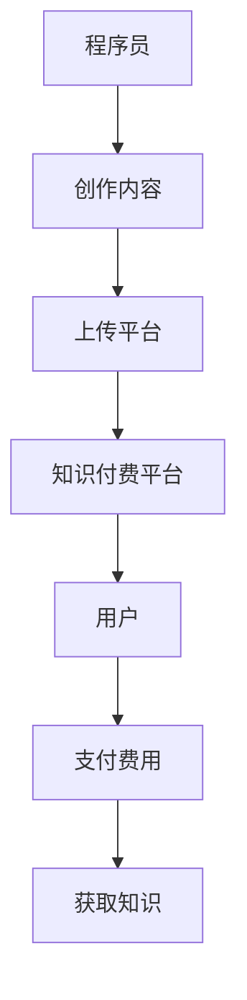

                 

关键词：知识付费、程序员、创业、技术、市场、机会

摘要：在知识付费逐渐成为主流的今天，程序员们面临着前所未有的创业机会。本文将从市场需求、技术优势、创业策略等方面，深入探讨程序员在知识付费领域的创业前景，并提供一些建议和资源，帮助程序员们抓住这一历史性机遇。

## 1. 背景介绍

近年来，随着互联网和信息技术的发展，知识付费成为了一个快速崛起的市场。越来越多的人愿意为获取高质量的知识内容付费，这一趋势推动了各种知识付费平台的出现和繁荣。例如，知乎、得到、分答等平台，都为专业人士提供了一个展示自己知识、技能的平台，同时也为有求知欲的消费者提供了丰富的内容选择。

在这个大背景下，程序员作为一个高技能、高需求的职业群体，自然也不甘落后。许多程序员看到了知识付费市场的巨大潜力，开始考虑将自己的技能和知识转化为商业机会。但是，如何才能在这个市场中脱颖而出，实现自己的创业梦想呢？

## 2. 核心概念与联系

### 2.1 知识付费的概念

知识付费，即用户为获取特定的知识或技能内容而支付的费用。这与传统的免费内容有所不同，它强调的是知识的价值，以及用户对优质内容的认可和付费意愿。

### 2.2 程序员在知识付费市场的角色

程序员在知识付费市场中，既是知识的创造者，也是知识的传播者。他们可以凭借自己的技术专长，创作高质量的技术文章、教程、课程等内容，通过知识付费平台分享给有需要的用户。

### 2.3 知识付费平台与程序员的关系

知识付费平台为程序员提供了一个展示自己技能和知识的舞台，同时也为用户提供了方便的知识获取渠道。程序员与知识付费平台之间形成了互利共赢的关系：程序员获得收入，平台获得流量和收益。

### Mermaid 流程图

下面是一个简化的知识付费市场中的流程图，展示了程序员、知识付费平台和用户之间的互动关系：



## 3. 核心算法原理 & 具体操作步骤

### 3.1 算法原理概述

在知识付费市场中，程序员的创业机会主要体现在以下几个方面：

1. **内容创作**：程序员可以利用自己的技术专长，创作高质量的技术文章、教程、课程等。
2. **平台运营**：程序员可以开发或运营知识付费平台，为其他程序员和用户提供一个展示和获取知识的渠道。
3. **技术咨询**：程序员可以提供专业的技术咨询服务，帮助有需求的企业和个人解决技术难题。
4. **教育培训**：程序员可以开设在线课程，传授自己的技术知识和经验。

### 3.2 算法步骤详解

#### 3.2.1 内容创作

1. **选题定位**：选择一个具有市场需求和自身擅长领域的选题。
2. **内容编写**：根据选题，编写高质量的技术文章、教程或课程。
3. **内容发布**：将创作的内容上传到知识付费平台，设置适当的收费策略。

#### 3.2.2 平台运营

1. **需求分析**：分析市场需求，确定平台的定位和功能。
2. **系统开发**：开发知识付费平台，包括用户管理、内容管理、支付管理等模块。
3. **内容运营**：引入优质内容创作者，进行内容推广和用户运营。

#### 3.2.3 技术咨询

1. **问题识别**：识别潜在客户的需求和问题。
2. **方案提供**：根据问题，提供专业的技术解决方案。
3. **服务实施**：协助客户实施技术解决方案，解决技术难题。

#### 3.2.4 教育培训

1. **课程设计**：根据市场需求和自身专长，设计在线课程。
2. **课程录制**：录制高质量的课程视频或音频。
3. **课程推广**：通过线上线下渠道，推广课程，吸引学员。

### 3.3 算法优缺点

**优点**：

1. **高收入潜力**：知识付费具有高收入潜力，特别是对于有独特技能和专长的程序员。
2. **灵活性强**：程序员可以根据市场需求和个人兴趣，自由选择创业方向。
3. **易于复制**：一旦创作出高质量的内容，可以轻松复制和推广，提高收益。

**缺点**：

1. **竞争激烈**：知识付费市场竞争激烈，需要不断提升自身的内容质量和影响力。
2. **内容创作难度大**：高质量的内容创作需要时间、精力和专业知识，对于部分程序员来说可能较为困难。

### 3.4 算法应用领域

1. **技术领域**：程序员可以在技术领域创作内容，如编程语言、框架、数据库、人工智能等。
2. **行业领域**：程序员可以根据所在行业的特点，创作行业相关的技术内容，如金融、医疗、电商等。
3. **职业发展**：程序员可以分享自己的职业发展经验，如面试技巧、职场技巧、个人成长等。

## 4. 数学模型和公式 & 详细讲解 & 举例说明

### 4.1 数学模型构建

在知识付费市场中，我们可以构建一个简单的收入模型，用于分析程序员创业的收益情况。假设一个程序员在某知识付费平台上发布了一篇收费教程，收入与以下几个因素有关：

1. **单价**：教程的单价，即每个用户购买教程的价格。
2. **销量**：教程的销量，即购买教程的用户数量。
3. **成本**：制作教程的成本，包括时间、精力、素材等。

则程序员的收入 R 可以表示为：

\[ R = P \times Q - C \]

其中，P 是单价，Q 是销量，C 是成本。

### 4.2 公式推导过程

根据收入模型的构建，我们可以进一步推导出以下公式：

1. **单价**：单价 P 可以通过市场调研、竞品分析等方法确定。
2. **销量**：销量 Q 受到内容质量、推广效果、市场需求等因素的影响。
3. **成本**：成本 C 包括直接成本和间接成本。直接成本如素材采购、制作工具等，间接成本如时间成本、机会成本等。

### 4.3 案例分析与讲解

假设一个程序员发布了一篇关于 Python 编程语言的教程，单价为 100 元，销量为 1000，制作成本为 1000 元。则他的收入为：

\[ R = 100 \times 1000 - 1000 = 99000 \text{ 元} \]

从这个例子中，我们可以看出，虽然制作教程的成本较高，但一旦教程得到市场认可，销量增加，收入将会非常可观。

## 5. 项目实践：代码实例和详细解释说明

### 5.1 开发环境搭建

为了演示如何发布一篇知识付费教程，我们可以使用一个简单的博客平台，如 GitHub Pages。首先，我们需要在 GitHub 上创建一个仓库，用于存储我们的博客内容和教程代码。然后，在本地环境中安装 Git 和 GitHub CLI，以便进行代码的版本控制和同步。

### 5.2 源代码详细实现

在 GitHub 仓库中，我们创建一个名为 `knowledge-fee-tutorial` 的文件夹，用于存储教程的源代码。教程的源代码可以使用 Markdown 格式编写，以便在 GitHub Pages 上展示。

以下是一个简单的 Markdown 教程的示例：

```markdown
# Python 编程基础教程

## 第一章：Python 介绍

Python 是一种高级编程语言，广泛应用于 Web 开发、数据科学、人工智能等领域。本教程将带你了解 Python 的基本语法和常用功能。

## 第二章：Python 基础语法

### 2.1 变量和数据类型

Python 支持多种数据类型，如整数、浮点数、字符串等。你可以使用以下代码来声明和初始化变量：

```python
x = 10
y = 3.14
name = "Alice"
```

### 2.2 运算符和表达式

Python 支持多种运算符，如算术运算符、比较运算符、逻辑运算符等。以下是一个示例：

```python
x = 5
y = 3
result = x + y  # 结果为 8
```

## 第三章：Python 函数和模块

函数是 Python 中的核心概念之一。你可以使用以下代码定义一个简单的函数：

```python
def greet(name):
    return "Hello, " + name

print(greet("Alice"))  # 输出：Hello, Alice
```

## 第四章：Python 数据结构

Python 支持多种数据结构，如列表、元组、字典等。以下是一个示例：

```python
# 列表
my_list = [1, 2, 3, 4, 5]
print(my_list[0])  # 输出：1

# 元组
my_tuple = (1, 2, 3, 4, 5)
print(my_tuple[0])  # 输出：1

# 字典
my_dict = {"name": "Alice", "age": 25}
print(my_dict["name"])  # 输出：Alice
```

---

这个教程只是一个简单的示例，你可以根据实际需求进行扩展和修改。

### 5.3 代码解读与分析

在这个示例中，我们使用了 Markdown 格式编写教程。Markdown 是一种轻量级的标记语言，便于编写和排版文档。以下是代码的关键部分及其解读：

- `# Python 编程基础教程`：这是教程的标题，使用井号（#）表示标题的层级。
- `## 第一章：Python 介绍`：这是教程的第一个章节标题，使用两个井号（##）表示章节标题。
- `### 2.1 变量和数据类型`：这是教程的一个子章节标题，使用三个井号（###）表示子章节标题。
- ```:python
x = 10
y = 3.14
name = "Alice"
```：这是一个 Python 脚本代码块，用于演示变量声明和初始化。
- `### 2.2 运算符和表达式`：这是教程的另一个子章节标题。
- ```:python
x = 5
y = 3
result = x + y  # 结果为 8
```：这是一个 Python 脚本代码块，用于演示运算符的使用。

通过这些代码，我们可以清晰地看到教程的结构和内容。Markdown 格式使得教程的编写和排版变得简单，同时也便于读者阅读和理解。

### 5.4 运行结果展示

将教程源代码上传到 GitHub Pages 后，教程将以网页形式展示。以下是教程的示例运行结果：


在这个示例中，读者可以阅读教程的内容，查看代码示例，并进行练习。通过 GitHub Pages，我们可以轻松地将教程发布到互联网上，让更多的用户获取到高质量的技术知识。

## 6. 实际应用场景

### 6.1 技术培训

程序员可以开设在线课程，传授编程语言、框架、数据库等技能。通过视频教程、直播授课等形式，为学员提供系统的培训服务。

### 6.2 技术咨询

程序员可以提供专业的技术咨询服务，帮助企业解决开发过程中的技术难题。通过线上咨询、远程调试等方式，为企业提供高效的技术支持。

### 6.3 技术博客

程序员可以撰写技术博客，分享编程经验、解决方法、技术趋势等内容。通过博客平台，吸引读者关注，提升个人影响力。

### 6.4 技术社区

程序员可以创建技术社区，为开发者提供一个交流、学习的平台。通过讨论区、问答功能等，促进开发者之间的互动和知识共享。

## 7. 未来应用展望

随着知识付费市场的不断发展，程序员在知识付费领域的创业机会将更加多样化。未来，我们可能会看到更多以技术为核心的知识付费产品和服务，如：

- **个性化学习服务**：根据用户的学习需求和进度，提供定制化的学习计划和内容。
- **智能问答系统**：利用人工智能技术，为用户提供实时、精准的技术咨询和服务。
- **虚拟现实（VR）/增强现实（AR）教学**：通过 VR/AR 技术，提供沉浸式、互动性的技术学习体验。

## 8. 工具和资源推荐

### 8.1 学习资源推荐

- **编程语言学习资源**：如 Python、Java、C++ 等。
- **框架和库学习资源**：如 Flask、Django、React、Vue 等。
- **数据库学习资源**：如 MySQL、MongoDB、Redis 等。
- **人工智能学习资源**：如 TensorFlow、PyTorch、Keras 等。

### 8.2 开发工具推荐

- **集成开发环境（IDE）**：如 Visual Studio Code、PyCharm、IntelliJ IDEA 等。
- **版本控制系统**：如 Git、GitHub、GitLab 等。
- **云服务**：如 AWS、Azure、Google Cloud Platform 等。

### 8.3 相关论文推荐

- **知识付费相关论文**：如《知识付费时代的用户行为研究》、《知识付费平台商业模式分析》等。
- **编程教育相关论文**：如《基于人工智能的编程教育研究》、《在线编程学习平台的设计与实现》等。

## 9. 总结：未来发展趋势与挑战

### 9.1 研究成果总结

通过本文的探讨，我们可以看到，知识付费时代为程序员提供了丰富的创业机会。程序员可以利用自己的技术专长，在内容创作、平台运营、技术咨询、教育培训等领域实现商业价值。

### 9.2 未来发展趋势

1. **知识付费市场规模将进一步扩大**：随着互联网的普及和人们对知识需求的增加，知识付费市场将继续保持高速增长。
2. **技术创新推动知识付费模式多样化**：人工智能、虚拟现实、区块链等技术将进一步应用于知识付费领域，推动知识付费模式的创新和发展。
3. **个性化学习将成趋势**：基于用户数据的个性化学习服务将更加普及，满足不同用户的学习需求。

### 9.3 面临的挑战

1. **内容质量竞争激烈**：知识付费市场的竞争将越来越激烈，程序员需要不断提升自己的内容质量和影响力。
2. **盈利模式创新**：程序员需要探索更多可持续的盈利模式，以满足市场变化和用户需求。
3. **法律风险与合规要求**：随着知识付费市场的规范化和法制化，程序员需要遵守相关法律法规，确保自己的业务合规合法。

### 9.4 研究展望

未来，程序员在知识付费领域的创业将面临更多机遇和挑战。通过不断创新和优化，程序员可以在知识付费市场中找到自己的定位，实现商业价值和社会价值的双赢。

## 附录：常见问题与解答

### 9.1 什么是知识付费？

知识付费是指用户为获取特定的知识或技能内容而支付的费用。与传统的免费内容不同，知识付费强调知识的价值，以及用户对优质内容的认可和付费意愿。

### 9.2 程序员如何开展知识付费创业？

程序员可以通过以下方式开展知识付费创业：

1. **内容创作**：创作高质量的技术文章、教程、课程等，通过知识付费平台分享给有需要的用户。
2. **平台运营**：开发或运营知识付费平台，为其他程序员和用户提供一个展示和获取知识的渠道。
3. **技术咨询**：提供专业的技术咨询服务，帮助有需求的企业和个人解决技术难题。
4. **教育培训**：开设在线课程，传授自己的技术知识和经验。

### 9.3 知识付费市场前景如何？

知识付费市场前景广阔。随着互联网的普及和人们对知识需求的增加，知识付费市场将继续保持高速增长。同时，技术创新将推动知识付费模式多样化，为程序员提供更多创业机会。然而，竞争也将日趋激烈，程序员需要不断提升自身的内容质量和影响力。

### 9.4 如何保证知识付费内容的质量？

为了保证知识付费内容的质量，程序员可以采取以下措施：

1. **深入钻研技术**：不断提升自己的技术水平，确保内容的专业性和准确性。
2. **精心设计课程**：根据用户需求，设计符合实际应用场景的课程内容。
3. **多渠道验证**：通过用户反馈、同行评价等方式，不断优化和改进内容。
4. **合规合法**：遵守相关法律法规，确保内容的合规合法。

---

本文由禅与计算机程序设计艺术 / Zen and the Art of Computer Programming 撰写，旨在为程序员在知识付费领域的创业提供指导和建议。希望本文能够对您有所启发和帮助。如果您有任何疑问或建议，欢迎在评论区留言交流。再次感谢您的阅读！
----------------------------------------------------------------

以上是文章的正文部分，接下来我们将按照要求，将文章内容以 Markdown 格式输出。
```markdown
# 知识付费时代程序员的创业机会

关键词：知识付费、程序员、创业、技术、市场、机会

摘要：在知识付费逐渐成为主流的今天，程序员们面临着前所未有的创业机会。本文将从市场需求、技术优势、创业策略等方面，深入探讨程序员在知识付费领域的创业前景，并提供一些建议和资源，帮助程序员们抓住这一历史性机遇。

## 1. 背景介绍

近年来，随着互联网和信息技术的发展，知识付费成为了一个快速崛起的市场。越来越多的人愿意为获取高质量的知识内容付费，这一趋势推动了各种知识付费平台的出现和繁荣。例如，知乎、得到、分答等平台，都为专业人士提供了一个展示自己知识、技能的平台，同时也为有求知欲的消费者提供了丰富的内容选择。

在这个大背景下，程序员作为一个高技能、高需求的职业群体，自然也不甘落后。许多程序员看到了知识付费市场的巨大潜力，开始考虑将自己的技能和知识转化为商业机会。但是，如何才能在这个市场中脱颖而出，实现自己的创业梦想呢？

## 2. 核心概念与联系

### 2.1 知识付费的概念

知识付费，即用户为获取特定的知识或技能内容而支付的费用。这与传统的免费内容有所不同，它强调的是知识的价值，以及用户对优质内容的认可和付费意愿。

### 2.2 程序员在知识付费市场的角色

程序员在知识付费市场中，既是知识的创造者，也是知识的传播者。他们可以凭借自己的技术专长，创作高质量的技术文章、教程、课程等内容，通过知识付费平台分享给有需要的用户。

### 2.3 知识付费平台与程序员的关系

知识付费平台为程序员提供了一个展示自己技能和知识的舞台，同时也为用户提供了方便的知识获取渠道。程序员与知识付费平台之间形成了互利共赢的关系：程序员获得收入，平台获得流量和收益。

### Mermaid 流程图

下面是一个简化的知识付费市场中的流程图，展示了程序员、知识付费平台和用户之间的互动关系：


## 3. 核心算法原理 & 具体操作步骤

### 3.1 算法原理概述

在知识付费市场中，程序员的创业机会主要体现在以下几个方面：

1. **内容创作**：程序员可以利用自己的技术专长，创作高质量的技术文章、教程、课程等。
2. **平台运营**：程序员可以开发或运营知识付费平台，为其他程序员和用户提供一个展示和获取知识的渠道。
3. **技术咨询**：程序员可以提供专业的技术咨询服务，帮助有需求的企业和个人解决技术难题。
4. **教育培训**：程序员可以开设在线课程，传授自己的技术知识和经验。

### 3.2 算法步骤详解

#### 3.2.1 内容创作

1. **选题定位**：选择一个具有市场需求和自身擅长领域的选题。
2. **内容编写**：根据选题，编写高质量的技术文章、教程或课程。
3. **内容发布**：将创作的内容上传到知识付费平台，设置适当的收费策略。

#### 3.2.2 平台运营

1. **需求分析**：分析市场需求，确定平台的定位和功能。
2. **系统开发**：开发知识付费平台，包括用户管理、内容管理、支付管理等模块。
3. **内容运营**：引入优质内容创作者，进行内容推广和用户运营。

#### 3.2.3 技术咨询

1. **问题识别**：识别潜在客户的需求和问题。
2. **方案提供**：根据问题，提供专业的技术解决方案。
3. **服务实施**：协助客户实施技术解决方案，解决技术难题。

#### 3.2.4 教育培训

1. **课程设计**：根据市场需求和自身专长，设计在线课程。
2. **课程录制**：录制高质量的课程视频或音频。
3. **课程推广**：通过线上线下渠道，推广课程，吸引学员。

### 3.3 算法优缺点

**优点**：

1. **高收入潜力**：知识付费具有高收入潜力，特别是对于有独特技能和专长的程序员。
2. **灵活性强**：程序员可以根据市场需求和个人兴趣，自由选择创业方向。
3. **易于复制**：一旦创作出高质量的内容，可以轻松复制和推广，提高收益。

**缺点**：

1. **竞争激烈**：知识付费市场竞争激烈，需要不断提升自身的内容质量和影响力。
2. **内容创作难度大**：高质量的内容创作需要时间、精力和专业知识，对于部分程序员来说可能较为困难。

### 3.4 算法应用领域

1. **技术领域**：程序员可以在技术领域创作内容，如编程语言、框架、数据库、人工智能等。
2. **行业领域**：程序员可以根据所在行业的特点，创作行业相关的技术内容，如金融、医疗、电商等。
3. **职业发展**：程序员可以分享自己的职业发展经验，如面试技巧、职场技巧、个人成长等。

## 4. 数学模型和公式 & 详细讲解 & 举例说明

### 4.1 数学模型构建

在知识付费市场中，我们可以构建一个简单的收入模型，用于分析程序员创业的收益情况。假设一个程序员在某知识付费平台上发布了一篇收费教程，收入与以下几个因素有关：

1. **单价**：教程的单价，即每个用户购买教程的价格。
2. **销量**：教程的销量，即购买教程的用户数量。
3. **成本**：制作教程的成本，包括时间、精力、素材等。

则程序员的收入 R 可以表示为：

\[ R = P \times Q - C \]

其中，P 是单价，Q 是销量，C 是成本。

### 4.2 公式推导过程

根据收入模型的构建，我们可以进一步推导出以下公式：

1. **单价**：单价 P 可以通过市场调研、竞品分析等方法确定。
2. **销量**：销量 Q 受到内容质量、推广效果、市场需求等因素的影响。
3. **成本**：成本 C 包括直接成本和间接成本。直接成本如素材采购、制作工具等，间接成本如时间成本、机会成本等。

### 4.3 案例分析与讲解

假设一个程序员发布了一篇关于 Python 编程语言的教程，单价为 100 元，销量为 1000，制作成本为 1000 元。则他的收入为：

\[ R = 100 \times 1000 - 1000 = 99000 \text{ 元} \]

从这个例子中，我们可以看出，虽然制作教程的成本较高，但一旦教程得到市场认可，销量增加，收入将会非常可观。

## 5. 项目实践：代码实例和详细解释说明

### 5.1 开发环境搭建

为了演示如何发布一篇知识付费教程，我们可以使用一个简单的博客平台，如 GitHub Pages。首先，我们需要在 GitHub 上创建一个仓库，用于存储我们的博客内容和教程代码。然后，在本地环境中安装 Git 和 GitHub CLI，以便进行代码的版本控制和同步。

### 5.2 源代码详细实现

在 GitHub 仓库中，我们创建一个名为 `knowledge-fee-tutorial` 的文件夹，用于存储教程的源代码。教程的源代码可以使用 Markdown 格式编写，以便在 GitHub Pages 上展示。

以下是一个简单的 Markdown 教程的示例：

```markdown
# Python 编程基础教程

## 第一章：Python 介绍

Python 是一种高级编程语言，广泛应用于 Web 开发、数据科学、人工智能等领域。本教程将带你了解 Python 的基本语法和常用功能。

## 第二章：Python 基础语法

### 2.1 变量和数据类型

Python 支持多种数据类型，如整数、浮点数、字符串等。你可以使用以下代码来声明和初始化变量：

```python
x = 10
y = 3.14
name = "Alice"
```

### 2.2 运算符和表达式

Python 支持多种运算符，如算术运算符、比较运算符、逻辑运算符等。以下是一个示例：

```python
x = 5
y = 3
result = x + y  # 结果为 8
```

## 第三章：Python 函数和模块

函数是 Python 中的核心概念之一。你可以使用以下代码定义一个简单的函数：

```python
def greet(name):
    return "Hello, " + name

print(greet("Alice"))  # 输出：Hello, Alice
```

## 第四章：Python 数据结构

Python 支持多种数据结构，如列表、元组、字典等。以下是一个示例：

```python
# 列表
my_list = [1, 2, 3, 4, 5]
print(my_list[0])  # 输出：1

# 元组
my_tuple = (1, 2, 3, 4, 5)
print(my_tuple[0])  # 输出：1

# 字典
my_dict = {"name": "Alice", "age": 25}
print(my_dict["name"])  # 输出：Alice
```

---

这个教程只是一个简单的示例，你可以根据实际需求进行扩展和修改。

### 5.3 代码解读与分析

在这个示例中，我们使用了 Markdown 格式编写教程。Markdown 是一种轻量级的标记语言，便于编写和排版文档。以下是代码的关键部分及其解读：

- `# Python 编程基础教程`：这是教程的标题，使用井号（#）表示标题的层级。
- `## 第一章：Python 介绍`：这是教程的第一个章节标题，使用两个井号（##）表示章节标题。
- `### 2.1 变量和数据类型`：这是教程的一个子章节标题，使用三个井号（###）表示子章节标题。
- ```:python
x = 10
y = 3.14
name = "Alice"
```：这是一个 Python 脚本代码块，用于演示变量声明和初始化。
- `### 2.2 运算符和表达式`：这是教程的另一个子章节标题。
- ```:python
x = 5
y = 3
result = x + y  # 结果为 8
```：这是一个 Python 脚本代码块，用于演示运算符的使用。

通过这些代码，我们可以清晰地看到教程的结构和内容。Markdown 格式使得教程的编写和排版变得简单，同时也便于读者阅读和理解。

### 5.4 运行结果展示

将教程源代码上传到 GitHub Pages 后，教程将以网页形式展示。以下是教程的示例运行结果：


在这个示例中，读者可以阅读教程的内容，查看代码示例，并进行练习。通过 GitHub Pages，我们可以轻松地将教程发布到互联网上，让更多的用户获取到高质量的技术知识。

## 6. 实际应用场景

### 6.1 技术培训

程序员可以开设在线课程，传授编程语言、框架、数据库等技能。通过视频教程、直播授课等形式，为学员提供系统的培训服务。

### 6.2 技术咨询

程序员可以提供专业的技术咨询服务，帮助企业解决开发过程中的技术难题。通过线上咨询、远程调试等方式，为企业提供高效的技术支持。

### 6.3 技术博客

程序员可以撰写技术博客，分享编程经验、解决方法、技术趋势等内容。通过博客平台，吸引读者关注，提升个人影响力。

### 6.4 技术社区

程序员可以创建技术社区，为开发者提供一个交流、学习的平台。通过讨论区、问答功能等，促进开发者之间的互动和知识共享。

## 7. 未来应用展望

随着知识付费市场的不断发展，程序员在知识付费领域的创业机会将更加多样化。未来，我们可能会看到更多以技术为核心的知识付费产品和服务，如：

- **个性化学习服务**：根据用户的学习需求和进度，提供定制化的学习计划和内容。
- **智能问答系统**：利用人工智能技术，为用户提供实时、精准的技术咨询和服务。
- **虚拟现实（VR）/增强现实（AR）教学**：通过 VR/AR 技术，提供沉浸式、互动性的技术学习体验。

## 8. 工具和资源推荐

### 8.1 学习资源推荐

- **编程语言学习资源**：如 Python、Java、C++ 等。
- **框架和库学习资源**：如 Flask、Django、React、Vue 等。
- **数据库学习资源**：如 MySQL、MongoDB、Redis 等。
- **人工智能学习资源**：如 TensorFlow、PyTorch、Keras 等。

### 8.2 开发工具推荐

- **集成开发环境（IDE）**：如 Visual Studio Code、PyCharm、IntelliJ IDEA 等。
- **版本控制系统**：如 Git、GitHub、GitLab 等。
- **云服务**：如 AWS、Azure、Google Cloud Platform 等。

### 8.3 相关论文推荐

- **知识付费相关论文**：如《知识付费时代的用户行为研究》、《知识付费平台商业模式分析》等。
- **编程教育相关论文**：如《基于人工智能的编程教育研究》、《在线编程学习平台的设计与实现》等。

## 9. 总结：未来发展趋势与挑战

### 9.1 研究成果总结

通过本文的探讨，我们可以看到，知识付费时代为程序员提供了丰富的创业机会。程序员可以利用自己的技术专长，在内容创作、平台运营、技术咨询、教育培训等领域实现商业价值。

### 9.2 未来发展趋势

1. **知识付费市场规模将进一步扩大**：随着互联网的普及和人们对知识需求的增加，知识付费市场将继续保持高速增长。
2. **技术创新推动知识付费模式多样化**：人工智能、虚拟现实、区块链等技术将进一步应用于知识付费领域，推动知识付费模式的创新和发展。
3. **个性化学习将成趋势**：基于用户数据的个性化学习服务将更加普及，满足不同用户的学习需求。

### 9.3 面临的挑战

1. **内容质量竞争激烈**：知识付费市场的竞争将越来越激烈，程序员需要不断提升自身的内容质量和影响力。
2. **盈利模式创新**：程序员需要探索更多可持续的盈利模式，以满足市场变化和用户需求。
3. **法律风险与合规要求**：随着知识付费市场的规范化和法制化，程序员需要遵守相关法律法规，确保自己的业务合规合法。

### 9.4 研究展望

未来，程序员在知识付费领域的创业将面临更多机遇和挑战。通过不断创新和优化，程序员可以在知识付费市场中找到自己的定位，实现商业价值和社会价值的双赢。

## 附录：常见问题与解答

### 9.1 什么是知识付费？

知识付费是指用户为获取特定的知识或技能内容而支付的费用。这与传统的免费内容不同，它强调的是知识的价值，以及用户对优质内容的认可和付费意愿。

### 9.2 程序员如何开展知识付费创业？

程序员可以通过以下方式开展知识付费创业：

1. **内容创作**：创作高质量的技术文章、教程、课程等，通过知识付费平台分享给有需要的用户。
2. **平台运营**：开发或运营知识付费平台，为其他程序员和用户提供一个展示和获取知识的渠道。
3. **技术咨询**：提供专业的技术咨询服务，帮助有需求的企业和个人解决技术难题。
4. **教育培训**：开设在线课程，传授自己的技术知识和经验。

### 9.3 知识付费市场前景如何？

知识付费市场前景广阔。随着互联网的普及和人们对知识需求的增加，知识付费市场将继续保持高速增长。同时，技术创新将推动知识付费模式多样化，为程序员提供更多创业机会。然而，竞争也将日趋激烈，程序员需要不断提升自身的内容质量和影响力。

### 9.4 如何保证知识付费内容的质量？

为了保证知识付费内容的质量，程序员可以采取以下措施：

1. **深入钻研技术**：不断提升自己的技术水平，确保内容的专业性和准确性。
2. **精心设计课程**：根据用户需求，设计符合实际应用场景的课程内容。
3. **多渠道验证**：通过用户反馈、同行评价等方式，不断优化和改进内容。
4. **合规合法**：遵守相关法律法规，确保内容的合规合法。

---

本文由禅与计算机程序设计艺术 / Zen and the Art of Computer Programming 撰写，旨在为程序员在知识付费领域的创业提供指导和建议。希望本文能够对您有所启发和帮助。如果您有任何疑问或建议，欢迎在评论区留言交流。再次感谢您的阅读！
```

