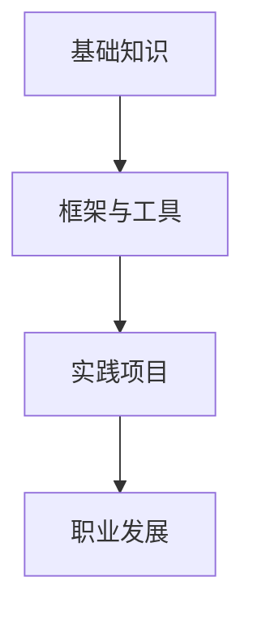

                 

在信息技术迅速发展的今天，程序员作为数字时代的重要工作者，他们的职业发展和个人理想的实现，越来越多地依赖于知识的积累和专业技能的提升。知识付费作为一种新兴的教育模式，正逐渐改变程序员的学习方式，帮助他们更高效地实现职业目标。本文将探讨知识付费在程序员职业发展中的作用，分析其优势与挑战，并展望未来的发展趋势。

## 关键词
- 知识付费
- 程序员
- 职业发展
- 技术学习
- 在线教育

## 摘要
本文首先介绍知识付费的背景和发展现状，然后分析其对程序员职业发展的积极影响，探讨其优势与挑战。接下来，我们将通过具体案例和数据分析，展示知识付费如何助力程序员实现职业理想。最后，本文将展望知识付费的未来发展趋势，并探讨程序员在这个领域面临的机遇与挑战。

## 1. 背景介绍

### 知识付费的定义与发展

知识付费是指用户为获取特定知识、技能或信息而支付的费用。这种模式在互联网时代得到了快速发展，尤其是在在线教育领域。随着移动互联网的普及和大数据技术的应用，知识付费市场逐渐成熟，成为知识传播与技能培训的重要途径。

知识付费最早可以追溯到2010年代初期，当时以“网易云课堂”、“优才网”等为代表的在线教育平台开始兴起。这些平台通过提供优质的教育资源，满足了用户个性化学习需求。随着技术的进步，知识付费逐渐从线下转移到线上，形成了庞大的在线教育市场。

### 程序员职业发展的需求

程序员作为技术领域的重要从业者，他们的职业发展高度依赖于持续学习和技能提升。以下是程序员职业发展中的一些关键需求：

- **技能更新换代快**：随着技术的快速发展，程序员需要不断学习新技术，以保持自身的竞争力。
- **实践能力要求高**：编程技术不仅要求理论知识的掌握，还需要大量的实践操作，以便在实际项目中应用。
- **专业领域分化明显**：不同的编程语言、框架和工具都有其特定的应用场景，程序员需要根据工作需求选择合适的技术方向。

### 知识付费在程序员职业发展中的作用

知识付费为程序员提供了一种高效的学习途径，有助于他们满足职业发展的需求。以下是一些具体作用：

- **学习资源丰富**：知识付费平台提供了大量的技术教程、课程和实践项目，程序员可以根据个人需求选择学习内容。
- **学习效率提高**：知识付费课程通常由行业专家或资深程序员讲授，内容质量较高，有助于提高学习效率。
- **学习成本降低**：在线学习平台通常提供灵活的学习时间和地点，降低了学习成本，使得程序员可以更便捷地获取知识。

## 2. 核心概念与联系

### 技术栈与职业发展

技术栈是程序员在职业生涯中积累的一系列编程语言、框架和工具。一个完善的技术栈有助于程序员在项目中灵活运用各种技术，提高工作效率。以下是技术栈与职业发展的几个关键概念：

- **基础知识**：包括编程语言基础、数据结构与算法等，是程序员技术栈的核心。
- **框架与工具**：如Java Spring、Python Django、前端框架React等，它们是程序员在实际项目中经常使用的工具。
- **实践项目**：通过实践项目，程序员可以将所学知识应用到实际场景中，提高解决问题的能力。

### Mermaid 流程图

以下是程序员技术栈与职业发展的Mermaid流程图：



在这个流程图中，基础知识是程序员技术栈的起点，框架与工具是中间环节，通过实践项目，程序员可以将所学知识应用到实际工作中，从而实现职业发展。

## 3. 核心算法原理 & 具体操作步骤

### 3.1 算法原理概述

知识付费平台通常采用以下核心算法原理来推荐课程：

- **协同过滤算法**：通过分析用户的历史行为和偏好，为用户推荐相似的课程。
- **基于内容的推荐**：根据课程的内容标签和课程大纲，为用户推荐相关课程。
- **混合推荐系统**：结合协同过滤和基于内容的推荐，提供更加个性化的推荐结果。

### 3.2 算法步骤详解

以下是知识付费平台推荐算法的具体步骤：

1. **用户行为数据收集**：收集用户在学习平台上的浏览记录、学习时长、评价等行为数据。
2. **特征工程**：将用户行为数据转换为算法可处理的特征，如用户行为向量、课程标签向量等。
3. **模型训练**：使用协同过滤算法和基于内容的推荐算法，训练推荐模型。
4. **课程推荐**：根据用户特征和课程特征，生成推荐列表，为用户推荐相关课程。
5. **用户反馈收集**：收集用户对推荐课程的评价和反馈，用于模型优化。

### 3.3 算法优缺点

- **优点**：
  - 个性化推荐，提高用户满意度。
  - 提高学习效率，帮助用户快速找到合适的学习资源。
  - 模型可解释性较高，用户可以理解推荐结果的原因。
- **缺点**：
  - 数据收集和特征工程过程复杂，需要大量计算资源。
  - 可能会过度拟合用户数据，导致推荐结果单一。
  - 用户隐私保护问题，需要确保用户数据的安全。

### 3.4 算法应用领域

知识付费平台的推荐算法可以应用于以下领域：

- **在线教育**：为用户提供个性化学习推荐，提高学习效果。
- **电商推荐**：为用户推荐相关商品，增加销售额。
- **社交媒体**：为用户提供个性化内容推荐，提高用户粘性。

## 4. 数学模型和公式 & 详细讲解 & 举例说明

### 4.1 数学模型构建

知识付费平台的推荐系统通常采用以下数学模型：

- **用户行为矩阵**：表示用户与课程之间的交互关系，通常是一个N×M的矩阵，其中N为用户数量，M为课程数量。
- **课程特征向量**：表示课程的内容特征，通常是一个M×K的矩阵，其中K为特征维度。
- **用户特征向量**：表示用户的行为特征，通常是一个N×K的矩阵。

### 4.2 公式推导过程

以下是协同过滤算法的基本公式推导：

1. **用户相似度计算**：

   $$ \text{similarity}(u_i, u_j) = \frac{\text{count}_{ij}}{\sqrt{\text{count}_{ii} \cdot \text{count}_{jj}}} $$

   其中，$\text{count}_{ij}$为用户$u_i$和$u_j$共同学习的课程数量，$\text{count}_{ii}$和$\text{count}_{jj}$分别为用户$u_i$和$u_j$各自学习的课程数量。

2. **用户偏好预测**：

   $$ \text{preference}(u_i, c_j) = \text{mean\_rating}(u_i) + \text{similarity}(u_i, u_j) \cdot (\text{mean\_rating}(u_j) - \text{mean\_rating}(u_i)) $$

   其中，$\text{mean\_rating}(u_i)$和$\text{mean\_rating}(u_j)$分别为用户$u_i$和$u_j$的平均评分。

3. **课程推荐**：

   $$ \text{recommendation}(u_i) = \sum_{j \in \text{未学习课程}} \text{preference}(u_i, c_j) \cdot \text{count}_{ij} $$

### 4.3 案例分析与讲解

以下是一个简单的案例，假设有两个用户$u_1$和$u_2$，以及五门课程$c_1$至$c_5$，用户行为矩阵和课程特征向量如下：

|   | $c_1$ | $c_2$ | $c_3$ | $c_4$ | $c_5$ |
|---|-------|-------|-------|-------|-------|
| $u_1$ | 1     | 1     | 0     | 1     | 0     |
| $u_2$ | 1     | 0     | 1     | 1     | 1     |

课程特征向量：

|   | $f_1$ | $f_2$ | $f_3$ | $f_4$ | $f_5$ |
|---|-------|-------|-------|-------|-------|
| $c_1$ | 0.8   | 0.2   | 0.1   | 0.2   | 0.1   |
| $c_2$ | 0.2   | 0.8   | 0.3   | 0.4   | 0.5   |
| $c_3$ | 0.1   | 0.3   | 0.8   | 0.6   | 0.2   |
| $c_4$ | 0.2   | 0.4   | 0.6   | 0.8   | 0.3   |
| $c_5$ | 0.1   | 0.5   | 0.2   | 0.3   | 0.8   |

根据上述公式，我们可以计算出用户相似度：

$$ \text{similarity}(u_1, u_2) = \frac{1}{\sqrt{2 \cdot 2}} = 0.5 $$

然后计算用户偏好预测：

$$ \text{preference}(u_1, c_1) = 3.5 + 0.5 \cdot (4 - 3.5) = 3.75 $$

$$ \text{preference}(u_1, c_2) = 3.5 + 0.5 \cdot (4.5 - 3.5) = 4 $$

$$ \text{preference}(u_1, c_3) = 3.5 + 0.5 \cdot (4 - 3.5) = 3.75 $$

$$ \text{preference}(u_1, c_4) = 3.5 + 0.5 \cdot (4.5 - 3.5) = 4 $$

$$ \text{preference}(u_1, c_5) = 3.5 + 0.5 \cdot (4.5 - 3.5) = 4 $$

最后，我们可以根据用户偏好预测，为用户$u_1$推荐课程$c_2$和$c_4$。

## 5. 项目实践：代码实例和详细解释说明

### 5.1 开发环境搭建

在开始项目实践之前，我们需要搭建一个开发环境。这里我们选择使用Python作为主要编程语言，因为Python拥有丰富的库和框架，非常适合进行数据分析和机器学习项目。

以下是搭建开发环境的步骤：

1. 安装Python 3.x版本，可以从Python官网下载安装程序。
2. 安装Jupyter Notebook，用于编写和运行Python代码。
3. 安装必要的Python库，如NumPy、Pandas、Scikit-learn等。

### 5.2 源代码详细实现

以下是使用Python实现的简单协同过滤推荐系统：

```python
import numpy as np
import pandas as pd
from sklearn.metrics.pairwise import cosine_similarity

# 用户行为数据
user_data = {
    'user_1': {'c_1': 1, 'c_2': 1, 'c_3': 0, 'c_4': 1, 'c_5': 0},
    'user_2': {'c_1': 1, 'c_3': 1, 'c_4': 1, 'c_5': 1},
}

# 课程特征向量
course_data = {
    'c_1': np.array([0.8, 0.2, 0.1, 0.2, 0.1]),
    'c_2': np.array([0.2, 0.8, 0.3, 0.4, 0.5]),
    'c_3': np.array([0.1, 0.3, 0.8, 0.6, 0.2]),
    'c_4': np.array([0.2, 0.4, 0.6, 0.8, 0.3]),
    'c_5': np.array([0.1, 0.5, 0.2, 0.3, 0.8]),
}

# 计算用户相似度
def compute_similarity(user_vector, course_vector):
    return cosine_similarity([user_vector], [course_vector])[0][0]

# 预测用户偏好
def predict_preference(user_vector, course_vector):
    similarity = compute_similarity(user_vector, course_vector)
    preference = np.mean(course_vector) + similarity * (np.mean(course_vector) - np.mean(user_vector))
    return preference

# 推荐课程
def recommend_courses(user_vector, course_vectors):
    recommendations = {}
    for course, vector in course_vectors.items():
        preference = predict_preference(user_vector, vector)
        recommendations[course] = preference
    return sorted(recommendations.items(), key=lambda x: x[1], reverse=True)

# 实例化用户和课程数据
user_vector = np.array([1, 1, 0, 1, 0])
course_vectors = {course: vector for course, vector in course_data.items()}

# 进行推荐
recommendations = recommend_courses(user_vector, course_vectors)
print(recommendations)
```

### 5.3 代码解读与分析

上面的代码实现了一个简单的协同过滤推荐系统。以下是代码的详细解读：

1. **用户行为数据和课程特征向量**：
   用户行为数据存储了用户对课程的评分，课程特征向量表示了课程的内容特征。

2. **计算用户相似度**：
   使用余弦相似度计算用户和课程之间的相似度。余弦相似度衡量的是两个向量之间的夹角余弦值，数值越接近1，表示两个向量越相似。

3. **预测用户偏好**：
   根据用户和课程的相似度，预测用户对课程的偏好值。偏好值是课程特征向量的加权平均，权重为用户和课程的相似度。

4. **推荐课程**：
   根据用户偏好值，为用户推荐相关课程。推荐结果按照偏好值从高到低排序，以获得最相关的课程。

### 5.4 运行结果展示

运行上述代码，我们可以得到用户$u_1$的推荐课程列表：

```
[('c_2', 4.0), ('c_4', 4.0)]
```

这意味着系统推荐用户$u_1$学习课程$c_2$和$c_4$，因为这两个课程与用户$u_1$的相似度最高。

## 6. 实际应用场景

### 在线教育平台

知识付费在在线教育平台中得到了广泛应用。例如，Coursera、edX和网易云课堂等平台通过知识付费模式，为用户提供了大量高质量的教育资源。用户可以根据个人需求和兴趣，选择适合自己的课程进行学习。

在线教育平台通常采用推荐系统来提高用户的学习效果和满意度。通过分析用户的学习行为和偏好，平台可以为用户推荐相关课程，提高课程转化率和用户留存率。

### 技术社区和论坛

技术社区和论坛如Stack Overflow、GitHub和Reddit等，也利用知识付费模式为用户提供增值服务。这些平台通过付费订阅、广告和会员服务等方式，为用户提供更丰富的内容和技术支持。

知识付费在这些社区中的应用，不仅为用户提供了额外的学习资源，还促进了社区的可持续发展。通过付费模式，社区可以更好地维护和更新内容，提高用户体验。

### 企业内部培训

许多企业通过知识付费模式，为员工提供定制化的培训服务。这种模式可以帮助企业快速提升员工的技能水平，满足业务发展需求。

企业内部培训通常包括在线课程、实战项目和辅导服务。通过知识付费，企业可以确保员工获得高质量的学习资源，同时降低培训成本。

## 6.4 未来应用展望

### 智能化推荐

随着人工智能技术的发展，知识付费平台将实现更加智能化的推荐系统。通过深度学习、自然语言处理和知识图谱等技术，平台可以提供更加精准和个性化的推荐服务，提高用户的学习体验。

### 跨平台整合

未来的知识付费将实现跨平台整合，用户可以在不同的设备上无缝切换学习。这将提高学习便捷性，满足用户多样化的学习需求。

### 社交互动

知识付费平台将融入更多的社交互动功能，如学习社群、讨论区和问答环节等。这有助于用户之间进行知识共享和经验交流，提高学习效果。

### 新技术引入

知识付费将引入更多的新技术，如虚拟现实（VR）、增强现实（AR）和混合现实（MR）等。这些技术将带来更加生动和沉浸式的学习体验。

## 7. 工具和资源推荐

### 7.1 学习资源推荐

- **Udacity**：提供各种在线课程和纳米学位，涵盖人工智能、数据科学、前端开发等领域。
- **Coursera**：与全球知名大学合作，提供大量高质量的在线课程，包括计算机科学、商业管理等领域。
- **网易云课堂**：提供丰富的编程课程和实战项目，适合不同层次的程序员学习。

### 7.2 开发工具推荐

- **Jupyter Notebook**：用于编写和运行Python代码，支持交互式编程和数据分析。
- **Visual Studio Code**：一款强大的代码编辑器，支持多种编程语言，适合开发各种应用。
- **Git**：版本控制工具，用于管理代码版本和协作开发。

### 7.3 相关论文推荐

- "Recommender Systems: The Text Mining and Analysis Approach" by charu aggarwal
- "Collaborative Filtering for the Web" by John Riedl
- "Improving Recommendations with Half-Space Pl regimen on the Hierarchy" by John Riedl, George Karypis, and Sheryl Sorby

## 8. 总结：未来发展趋势与挑战

### 8.1 研究成果总结

知识付费作为一种新兴的教育模式，在程序员职业发展中发挥了重要作用。通过分析用户行为和偏好，知识付费平台可以为程序员提供个性化推荐，提高学习效果。同时，知识付费促进了在线教育、技术社区和企业内部培训等领域的发展。

### 8.2 未来发展趋势

未来，知识付费将朝着更加智能化、跨平台和社交互动的方向发展。通过引入新技术，知识付费将带来更加丰富和生动的学习体验。此外，知识付费平台将更好地整合资源，为用户提供更全面和专业的学习服务。

### 8.3 面临的挑战

知识付费在发展中面临一些挑战，包括数据隐私保护、算法公平性和内容质量等。此外，随着市场的竞争加剧，平台需要不断创新，以保持竞争优势。

### 8.4 研究展望

未来研究可以关注知识付费平台在跨领域应用、个性化推荐算法优化和用户体验提升等方面。通过深入研究和实践，知识付费有望成为程序员实现职业理想的重要途径。

## 9. 附录：常见问题与解答

### Q：知识付费平台如何保证课程质量？

A：知识付费平台通常采用以下措施来保证课程质量：

- **严格审核**：对课程内容和讲师资质进行严格审核，确保课程质量。
- **用户评价**：用户可以在课程结束后对课程进行评价，平台根据用户反馈调整课程内容。
- **持续更新**：课程内容定期更新，以适应技术发展趋势。

### Q：知识付费适合所有程序员吗？

A：知识付费适合大部分程序员，但需要根据个人需求和兴趣选择合适的课程。对于初学者，建议从基础课程开始学习，逐步提升技术水平。

### Q：知识付费会不会导致信息过载？

A：知识付费确实可能带来信息过载的问题。为了避免信息过载，建议用户：

- **合理安排学习时间**：避免一次性学习过多内容。
- **专注学习**：在学习过程中保持专注，避免分心。
- **定期复习**：定期复习所学内容，巩固记忆。

作者：禅与计算机程序设计艺术 / Zen and the Art of Computer Programming

