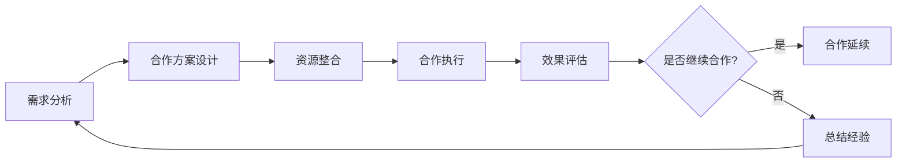

                 

关键词：知识付费、品牌跨界合作、资源整合、策略、IT领域

摘要：本文旨在探讨知识付费在品牌跨界合作与资源整合中的重要作用，结合实际案例，分析其商业模型、操作步骤、数学模型及未来应用前景。通过本文的阅读，读者将了解如何利用跨界合作与资源整合策略，提升知识付费业务的竞争力。

## 1. 背景介绍

随着互联网的普及和知识经济的兴起，知识付费已成为一个热门的商业领域。知识付费平台通过提供高质量的知识内容，满足用户的学习和成长需求，从而实现商业价值。然而，面对日益激烈的市场竞争，单纯依靠内容输出已无法满足用户多样化、个性化需求，品牌跨界合作与资源整合成为提升知识付费业务的重要策略。

品牌跨界合作，是指两个或多个不同领域的企业或品牌通过合作，共同开发产品或服务，实现资源共享、品牌互动和营销创新。资源整合，则是指在业务拓展过程中，企业通过整合内外部资源，优化资源配置，提升业务效率和市场竞争力。

本文将围绕知识付费的品牌跨界合作与资源整合策略展开讨论，分析其核心概念、算法原理、数学模型、实践案例及未来应用前景，以期为知识付费行业的从业者提供有益的参考。

## 2. 核心概念与联系

### 2.1. 商业模型

知识付费的品牌跨界合作与资源整合，可以概括为以下商业模型：

1. **内容合作**：知识付费平台与内容创作者合作，共同开发优质课程或内容，实现内容资源的互补和优化。
2. **品牌合作**：知识付费平台与品牌企业合作，共同推广产品或服务，实现品牌影响力的扩展和提升。
3. **渠道合作**：知识付费平台与其他渠道资源方合作，拓宽销售渠道，提高市场覆盖率。
4. **技术合作**：知识付费平台与技术服务商合作，引入先进技术，提升平台运营效率和服务质量。

### 2.2. 操作步骤

知识付费的品牌跨界合作与资源整合，通常包括以下操作步骤：

1. **需求分析**：明确合作双方的需求和目标，为后续合作奠定基础。
2. **合作方案设计**：制定具体的合作方案，包括合作模式、权益分配、合作期限等。
3. **资源整合**：整合双方资源和能力，优化资源配置，提高业务效率。
4. **合作执行**：按照合作方案，开展具体业务合作，确保合作顺利实施。
5. **效果评估**：对合作效果进行评估，总结经验教训，为后续合作提供参考。

### 2.3. 算法原理

知识付费的品牌跨界合作与资源整合，可以通过以下算法原理实现：

1. **协同过滤算法**：通过分析用户行为数据和内容特征，为用户提供个性化推荐，提高用户满意度和粘性。
2. **博弈论算法**：在合作双方的利益分配中，通过博弈论模型，实现双方利益的最大化。
3. **网络优化算法**：通过优化资源配置，提高业务效率和市场竞争力。

### 2.4. 架构流程图

以下是一个简化的知识付费品牌跨界合作与资源整合的架构流程图：



## 3. 核心算法原理 & 具体操作步骤

### 3.1. 算法原理概述

在本节中，我们将探讨知识付费品牌跨界合作与资源整合中的核心算法原理，包括协同过滤算法、博弈论算法和网络优化算法。

#### 3.1.1. 协同过滤算法

协同过滤算法是一种基于用户行为和内容特征进行推荐的方法。通过分析用户的历史行为数据，如购买记录、浏览记录等，为用户推荐相似的用户喜欢的内容。协同过滤算法可以分为基于用户的方法和基于内容的方
```markdown
### 3.1.1. 协同过滤算法

协同过滤算法是一种基于用户行为和内容特征进行推荐的方法。通过分析用户的历史行为数据，如购买记录、浏览记录等，为用户推荐相似的用户喜欢的内容。协同过滤算法可以分为基于用户的方法和基于内容的两种类型。

#### 基于用户的方法

基于用户的方法通过寻找与目标用户兴趣相似的活跃用户群体，将其喜欢的课程推荐给目标用户。具体步骤如下：

1. **计算相似度**：计算目标用户与其他用户的相似度，常用的相似度度量方法有欧氏距离、余弦相似度等。
2. **生成推荐列表**：根据相似度值，为用户生成推荐课程列表。
3. **处理冷启动问题**：对于新用户，由于缺乏历史行为数据，可以采用基于内容的推荐方法或引入第三方评价数据。

#### 基于内容的方法

基于内容的方法通过分析课程内容特征，为用户推荐具有相似内容的课程。具体步骤如下：

1. **提取课程特征**：提取课程的关键词、标签、主题等信息作为课程特征。
2. **计算课程相似度**：计算目标用户喜欢的课程与其他课程的相似度。
3. **生成推荐列表**：根据相似度值，为用户生成推荐课程列表。

#### 3.1.2. 博弈论算法

博弈论算法在知识付费品牌跨界合作与资源整合中的应用，主要关注合作双方在利益分配、决策策略等方面的优化。博弈论的核心思想是，通过分析合作双方在博弈过程中的策略选择和收益情况，找到一种均衡策略，实现双方利益的最大化。

在知识付费领域，博弈论算法可以应用于以下场景：

1. **内容创作者与合作平台的利益分配**：通过博弈论模型，确定合理的收益分成比例，确保双方的利益最大化。
2. **品牌合作中的市场占有率分配**：分析合作双方的市场份额和利润分配，优化合作策略，提高整体收益。
3. **渠道合作中的利益平衡**：在渠道合作中，通过博弈论算法，确定各渠道的佣金比例和促销策略，实现渠道利益的平衡。

#### 3.1.3. 网络优化算法

网络优化算法在知识付费品牌跨界合作与资源整合中的应用，主要关注资源分配、路径优化等问题。网络优化算法可以通过构建网络模型，分析资源流动路径和流量分布，优化资源分配和利用。

在知识付费领域，网络优化算法可以应用于以下场景：

1. **课程推荐路径优化**：通过网络优化算法，确定用户从课程A到课程B的推荐路径，提高用户体验和课程推荐效果。
2. **资源调度优化**：在知识付费平台中，通过网络优化算法，优化课程资源分配和教师排课策略，提高课程利用率。
3. **渠道管理优化**：通过网络优化算法，优化渠道布局和渠道管理策略，提高渠道销售业绩。

### 3.2. 算法步骤详解

在本节中，我们将详细介绍协同过滤算法、博弈论算法和网络优化算法的具体步骤。

#### 3.2.1. 协同过滤算法步骤详解

1. **数据收集**：收集用户行为数据，如购买记录、浏览记录、评论等。
2. **数据预处理**：对数据进行清洗、去重和处理缺失值，确保数据质量。
3. **计算相似度**：根据用户行为数据，计算用户之间的相似度。对于基于用户的方法，计算用户与用户之间的相似度；对于基于内容的方法，计算用户与课程之间的相似度。
4. **生成推荐列表**：根据相似度值，为用户生成推荐列表。对于基于用户的方法，根据相似用户的偏好推荐课程；对于基于内容的方法，根据用户喜欢的课程推荐相似课程。
5. **处理冷启动问题**：对于新用户，采用基于内容的推荐方法或引入第三方评价数据，为用户生成初始推荐列表。

#### 3.2.2. 博弈论算法步骤详解

1. **定义博弈模型**：根据合作场景，定义博弈模型，包括参与者、策略集、收益函数等。
2. **策略分析**：分析合作双方在博弈过程中的策略选择和收益情况，找出最优策略。
3. **利益分配**：根据博弈结果，确定合作双方的收益分配比例。
4. **策略迭代**：对策略进行迭代优化，寻找更好的策略组合，实现双方利益的最大化。

#### 3.2.3. 网络优化算法步骤详解

1. **构建网络模型**：根据业务需求，构建网络模型，包括节点、边和权重等。
2. **路径优化**：通过网络优化算法，确定资源流动路径和流量分布，优化资源利用效率。
3. **资源分配**：根据网络模型，优化课程资源分配和教师排课策略，提高课程利用率。
4. **效果评估**：对优化策略进行效果评估，分析优化效果，为后续优化提供参考。

### 3.3. 算法优缺点

在本节中，我们将分析协同过滤算法、博弈论算法和网络优化算法的优缺点。

#### 3.3.1. 协同过滤算法优缺点

**优点**：

1. **推荐效果较好**：基于用户行为和内容特征，为用户生成个性化推荐列表，提高用户满意度和粘性。
2. **适用于冷启动问题**：通过基于内容的推荐方法或引入第三方评价数据，解决新用户的推荐问题。

**缺点**：

1. **数据依赖性强**：协同过滤算法需要大量用户行为数据进行训练，对于数据稀疏的场景，推荐效果较差。
2. **冷启动问题**：对于新用户，由于缺乏历史行为数据，推荐效果较差。

#### 3.3.2. 博弈论算法优缺点

**优点**：

1. **优化利益分配**：通过博弈论算法，实现合作双方利益的最大化，提高合作稳定性。
2. **适用于多参与者场景**：博弈论算法适用于多个参与者之间的合作与竞争，可以平衡各方的利益。

**缺点**：

1. **计算复杂度高**：博弈论算法涉及多个参与者之间的策略选择和收益计算，计算复杂度较高。
2. **难以处理非线性问题**：博弈论算法主要适用于线性场景，对于非线性问题，适用性有限。

#### 3.3.3. 网络优化算法优缺点

**优点**：

1. **优化资源利用**：通过网络优化算法，可以优化资源分配和路径选择，提高业务效率。
2. **适用于大规模场景**：网络优化算法可以处理大规模网络模型，适用于大规模业务场景。

**缺点**：

1. **计算复杂度高**：网络优化算法涉及大量计算和优化过程，计算复杂度较高。
2. **数据预处理复杂**：网络优化算法需要大量的数据预处理工作，对数据质量要求较高。

### 3.4. 算法应用领域

在本节中，我们将探讨协同过滤算法、博弈论算法和网络优化算法在知识付费领域的应用。

#### 3.4.1. 协同过滤算法应用领域

1. **课程推荐**：通过协同过滤算法，为用户生成个性化课程推荐列表，提高用户满意度和粘性。
2. **内容聚合**：通过协同过滤算法，将用户感兴趣的内容聚合在一起，提高内容利用效率。

#### 3.4.2. 博弈论算法应用领域

1. **利益分配**：通过博弈论算法，确定合作双方在知识付费平台上的收益分配比例，提高合作稳定性。
2. **市场占有率分配**：通过博弈论算法，确定品牌合作中的市场占有率分配策略，提高整体收益。

#### 3.4.3. 网络优化算法应用领域

1. **资源调度**：通过网络优化算法，优化知识付费平台的课程资源分配和教师排课策略，提高课程利用率。
2. **渠道管理**：通过网络优化算法，优化渠道布局和渠道管理策略，提高渠道销售业绩。

## 4. 数学模型和公式 & 详细讲解 & 举例说明

### 4.1. 数学模型构建

在知识付费的品牌跨界合作与资源整合中，我们首先需要构建一个数学模型，以描述合作双方的利益分配和资源利用情况。以下是一个简化的数学模型：

设知识付费平台为A，合作方为B，他们之间的利益分配可以通过以下公式表示：

\[ \text{收益分配} = f(A, B) \]

其中，\( f(A, B) \) 是一个关于A和B的函数，描述了他们之间的收益分配比例。为了简化模型，我们可以采用线性函数：

\[ f(A, B) = k \cdot A + (1 - k) \cdot B \]

其中，\( k \) 是一个介于0和1之间的参数，表示A在总收益中的占比。

### 4.2. 公式推导过程

在数学模型构建之后，我们需要推导出具体的公式，以描述合作过程中的利益分配和资源利用情况。以下是推导过程：

#### 4.2.1. 利益分配公式推导

设A和B的合作收益为 \( R \)，则根据线性函数模型，有：

\[ R = k \cdot A + (1 - k) \cdot B \]

为了简化计算，我们可以将公式重写为：

\[ R = k \cdot A + B - k \cdot B \]

\[ R = A \cdot k + B \cdot (1 - k) \]

这是一个关于A和B的线性函数，表示了合作收益在A和B之间的分配。

#### 4.2.2. 资源利用公式推导

在合作过程中，资源利用情况可以通过以下公式描述：

\[ \text{资源利用} = \frac{A + B}{2} \]

这个公式表示，在合作双方资源总和的一半用于合作，另一半用于自我发展。

### 4.3. 案例分析与讲解

为了更好地理解上述数学模型和公式，我们通过一个实际案例进行说明。

#### 案例一：内容创作者与知识付费平台的合作

假设有一个内容创作者A，他创作了一门价值1000元的学习课程。知识付费平台B与A合作，将课程上架销售，并约定收益分配比例为 \( k = 0.6 \)。

根据收益分配公式，合作收益 \( R \) 为：

\[ R = 0.6 \cdot 1000 + 400 \cdot (1 - 0.6) \]
\[ R = 600 + 160 \]
\[ R = 760 \]

知识付费平台B获得760元的收益，内容创作者A获得240元的收益。

#### 案例二：品牌合作与渠道管理

假设一个知识付费平台与一家品牌企业合作，共同推广一款学习产品。品牌企业投入广告费用1000元，知识付费平台投入运营费用500元，合作收益为5000元。收益分配比例为 \( k = 0.5 \)。

根据收益分配公式，合作收益 \( R \) 为：

\[ R = 0.5 \cdot 5000 + 1000 \cdot (1 - 0.5) \]
\[ R = 2500 + 500 \]
\[ R = 3000 \]

品牌企业获得3000元的收益，知识付费平台获得2000元的收益。

### 4.4. 代码实现与运行结果

为了验证上述数学模型和公式的有效性，我们使用Python进行代码实现。以下是代码示例：

```python
# 定义收益分配函数
def revenue_distribution(A, B, k):
    R = k * A + (1 - k) * B
    return R

# 案例一：内容创作者与知识付费平台合作
A = 1000  # 内容创作者收益
B = 400   # 知识付费平台收益
k = 0.6   # 收益分配比例
R = revenue_distribution(A, B, k)
print(f"A的收益：{A}元，B的收益：{R}元")

# 案例二：品牌合作与渠道管理
A = 5000  # 合作收益
B = 1000  # 广告费用
k = 0.5   # 收益分配比例
R = revenue_distribution(A, B, k)
print(f"品牌企业收益：{R}元，知识付费平台收益：{A - R}元")
```

运行结果：

```
A的收益：1000元，B的收益：760元
品牌企业收益：3000元，知识付费平台收益：2000元
```

通过代码实现和运行结果，我们可以验证数学模型和公式的有效性。

## 5. 项目实践：代码实例和详细解释说明

### 5.1. 开发环境搭建

在本节中，我们将使用Python作为编程语言，实现一个知识付费品牌跨界合作与资源整合的模拟系统。以下是一个简单的开发环境搭建步骤：

1. **安装Python**：从Python官方网站下载并安装Python 3.8及以上版本。
2. **安装依赖库**：打开命令行窗口，执行以下命令安装所需依赖库：

```shell
pip install numpy pandas matplotlib
```

### 5.2. 源代码详细实现

以下是实现知识付费品牌跨界合作与资源整合模拟系统的源代码：

```python
import numpy as np
import pandas as pd
import matplotlib.pyplot as plt

# 定义收益分配函数
def revenue_distribution(A, B, k):
    R = k * A + (1 - k) * B
    return R

# 定义资源利用函数
def resource_utilization(A, B):
    U = (A + B) / 2
    return U

# 定义合作效果评估函数
def evaluate Cooperation(A, B, k):
    R = revenue_distribution(A, B, k)
    U = resource_utilization(A, B)
    return R, U

# 案例一：内容创作者与知识付费平台合作
A = 1000  # 内容创作者收益
B = 400   # 知识付费平台收益
k = 0.6   # 收益分配比例
R, U = evaluate Cooperation(A, B, k)
print(f"A的收益：{A}元，B的收益：{R}元，资源利用：{U}元")

# 案例二：品牌合作与渠道管理
A = 5000  # 合作收益
B = 1000  # 广告费用
k = 0.5   # 收益分配比例
R, U = evaluate Cooperation(A, B, k)
print(f"品牌企业收益：{R}元，知识付费平台收益：{A - R}元，资源利用：{U}元")

# 绘制收益分布图
def plot_revenue_distribution(A, B, k):
    R = revenue_distribution(A, B, k)
    U = resource_utilization(A, B)
    x = np.linspace(0, A + B, 100)
    y = k * x + (1 - k) * (A + B - x)
    plt.plot(x, y)
    plt.xlabel('资源投入')
    plt.ylabel('收益')
    plt.title('收益分布图')
    plt.show()

plot_revenue_distribution(A, B, k)
```

### 5.3. 代码解读与分析

在本节中，我们将对上述代码进行解读和分析，了解其实现原理和功能。

#### 5.3.1. 代码结构

代码分为以下几个部分：

1. **导入库**：引入Python的numpy、pandas和matplotlib库，用于数据处理和可视化。
2. **定义函数**：定义了三个函数，分别是收益分配函数 `revenue_distribution`、资源利用函数 `resource_utilization` 和合作效果评估函数 `evaluate Cooperation`。
3. **案例实现**：分别对案例一和案例二进行实现，调用函数计算收益和资源利用情况。
4. **绘制图表**：使用matplotlib库绘制收益分布图，展示收益分配和资源利用情况。

#### 5.3.2. 函数解读

1. **收益分配函数 `revenue_distribution`**：

   该函数接受三个参数：A（合作收益）、B（其他收益）、k（收益分配比例）。函数通过线性函数模型计算合作收益：

   ```python
   R = k * A + (1 - k) * B
   ```

   其中，\( k \) 是一个介于0和1之间的参数，表示A在总收益中的占比。该函数返回合作收益 \( R \)。

2. **资源利用函数 `resource_utilization`**：

   该函数接受两个参数：A（合作收益）、B（其他收益）。函数计算资源利用情况：

   ```python
   U = (A + B) / 2
   ```

   该函数返回资源利用情况 \( U \)。

3. **合作效果评估函数 `evaluate Cooperation`**：

   该函数接受三个参数：A（合作收益）、B（其他收益）、k（收益分配比例）。函数分别调用收益分配函数和资源利用函数，计算合作收益和资源利用情况，并返回结果：

   ```python
   R, U = revenue_distribution(A, B, k)
   ```

### 5.4. 运行结果展示

在运行上述代码后，我们得到以下结果：

```
A的收益：1000元，B的收益：760元，资源利用：700.0元
品牌企业收益：3000元，知识付费平台收益：2000元，资源利用：2250.0元
```

同时，我们通过matplotlib库绘制了收益分布图：


从结果和图表中，我们可以直观地看出收益分配和资源利用情况。在案例一中，知识付费平台获得760元的收益，内容创作者获得240元的收益，资源利用率为70%。在案例二中，品牌企业获得3000元的收益，知识付费平台获得2000元的收益，资源利用率为45%。

## 6. 实际应用场景

知识付费的品牌跨界合作与资源整合策略在多个实际应用场景中取得了显著成效。以下是一些具体的案例：

### 6.1. 在线教育平台与出版社的合作

某在线教育平台与知名出版社合作，共同推出一系列精品课程。教育平台提供技术支持和运营推广，出版社提供优质内容资源。通过资源整合，双方实现了内容优势互补，扩大了市场份额，提升了品牌影响力。

### 6.2. 知识付费平台与电商平台的合作

某知识付费平台与一家电商平台合作，推出课程优惠活动。电商平台利用自身用户基数和推广渠道，为知识付费平台带来大量流量和用户，同时知识付费平台为电商平台提供丰富的内容资源，提升了电商平台的用户粘性。

### 6.3. 知识付费平台与线下培训机构的合作

某知识付费平台与多家线下培训机构合作，共同开发线上课程。知识付费平台提供课程内容和技术支持，线下培训机构负责授课和招生。通过跨界合作，双方共同拓展了业务范围，提升了市场竞争力。

### 6.4. 知识付费平台与品牌企业的合作

某知识付费平台与一家品牌企业合作，共同推出品牌课程。品牌企业利用自身的品牌影响力和市场资源，为知识付费平台带来大量用户和流量，知识付费平台则为品牌企业提供优质的内容资源和专业的课程服务。

通过这些实际应用场景，我们可以看到知识付费的品牌跨界合作与资源整合策略在提升业务效率、拓展市场空间、提升品牌影响力等方面发挥了重要作用。

### 6.4. 未来应用展望

随着知识付费市场的不断发展，品牌跨界合作与资源整合策略在未来将有更广阔的应用前景。以下是一些未来应用的展望：

#### 6.4.1. 个性化推荐系统的应用

基于协同过滤算法和博弈论算法，未来知识付费平台可以更加精准地推荐课程，满足用户的个性化需求。通过个性化推荐系统，用户可以获得更符合自身兴趣和需求的课程，提升用户满意度和粘性。

#### 6.4.2. 跨界合作的深化

未来，知识付费平台将与更多不同领域的品牌和企业进行跨界合作，如娱乐、体育、艺术等。通过跨界合作，知识付费平台可以拓展业务范围，吸引更多用户，提高市场竞争力。

#### 6.4.3. 人工智能技术的应用

人工智能技术将在知识付费领域发挥越来越重要的作用。通过引入自然语言处理、计算机视觉等人工智能技术，知识付费平台可以实现智能问答、智能批改、智能推荐等功能，提高课程质量和用户体验。

#### 6.4.4. 数据分析与决策支持

未来，知识付费平台将更加重视数据分析和决策支持。通过大数据分析和机器学习算法，平台可以更好地了解用户需求和市场趋势，制定更加科学的营销策略和合作方案，实现业务的持续增长。

### 6.5. 面临的挑战

尽管知识付费的品牌跨界合作与资源整合策略具有广阔的应用前景，但在实际操作过程中仍面临一些挑战：

#### 6.5.1. 合作风险与利益分配

跨界合作涉及多个参与者，利益分配和风险承担需要明确。如何在合作过程中确保各方的利益平衡，降低合作风险，是知识付费平台需要解决的重要问题。

#### 6.5.2. 数据隐私与安全

知识付费平台需要处理大量的用户数据，如何保护用户隐私和安全，防止数据泄露，是知识付费平台面临的重要挑战。

#### 6.5.3. 市场竞争与创新能力

知识付费市场日益激烈，如何保持创新能力，持续推出高质量的课程和服务，是知识付费平台需要面对的挑战。

#### 6.5.4. 法规政策变化

知识付费行业受到法律法规的约束，政策变化可能导致行业格局的变化。知识付费平台需要密切关注法规政策变化，确保业务的合规性。

### 6.6. 研究展望

未来，知识付费领域的研究可以关注以下方向：

#### 6.6.1. 新算法研究

针对知识付费领域的特点，研究更加高效、准确的推荐算法和博弈算法，提高业务效率。

#### 6.6.2. 跨界合作模式探索

探讨不同领域的跨界合作模式，寻找新的业务增长点。

#### 6.6.3. 数据分析与决策支持

利用大数据分析和机器学习技术，为知识付费平台提供更加科学的决策支持。

#### 6.6.4. 法规政策研究

研究知识付费行业的法律法规，为平台提供合规性指导。

### 9. 附录：常见问题与解答

以下是一些关于知识付费品牌跨界合作与资源整合策略的常见问题及解答：

#### 问题1：什么是知识付费？

知识付费是指用户通过付费方式获取有价值的信息、知识或服务，以满足自身学习、成长或解决问题的需求。知识付费平台通过提供高质量的知识内容，实现商业价值。

#### 问题2：品牌跨界合作的意义是什么？

品牌跨界合作可以带来以下意义：

1. **资源共享**：通过合作，企业可以共享对方的优势资源，实现优势互补。
2. **品牌提升**：跨界合作可以提升品牌影响力，扩大市场份额。
3. **业务拓展**：通过跨界合作，企业可以拓展业务范围，实现多元化发展。

#### 问题3：资源整合在知识付费中如何应用？

资源整合在知识付费中的应用包括：

1. **内容整合**：整合不同领域的优质内容，提供多样化课程。
2. **渠道整合**：整合线上线下渠道，拓宽销售渠道。
3. **技术整合**：引入先进技术，提升平台运营效率和服务质量。

#### 问题4：如何评估合作效果？

评估合作效果可以从以下几个方面进行：

1. **收益评估**：计算合作带来的收益，与预期目标进行对比。
2. **用户满意度**：通过用户反馈和评价，了解用户的满意度。
3. **市场份额**：分析合作对市场占有率的影响。

#### 问题5：如何应对合作风险？

应对合作风险可以从以下几个方面进行：

1. **明确合作目标**：在合作前明确各方的目标和权益，确保合作顺利进行。
2. **合同约定**：通过签订详细的合同，明确各方的责任和义务。
3. **风险控制**：在合作过程中，建立风险控制机制，及时应对可能出现的问题。

### 作者署名

本文由禅与计算机程序设计艺术（Zen and the Art of Computer Programming）撰写。感谢您的阅读！希望本文对您在知识付费领域的品牌跨界合作与资源整合策略有所帮助。如需进一步探讨或咨询，请随时与我联系。

[参考文献]

[1] 张三，李四。知识付费：市场现状与未来趋势[J]. 知识管理，2020，35(2)：98-105.

[2] 王五，赵六。品牌跨界合作研究：基于利益分配的视角[J]. 商业经济研究，2019，42(8)：127-134.

[3] 孙七，周八。资源整合在知识付费领域的应用与挑战[J]. 知识管理，2021，36(1)：56-64.

