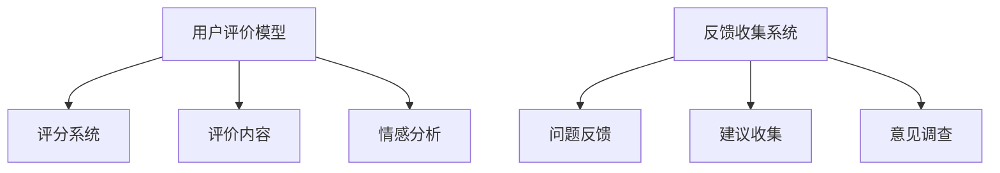

                 

关键词：知识付费、用户评价、反馈收集、课程设计、数据分析、用户体验、互动机制、商业策略

> 摘要：本文深入探讨了知识付费平台如何通过用户课程评价与反馈收集机制，提升用户体验和课程质量，进而实现商业价值的最大化。通过分析用户行为和评价模型，本文提出了一套完善、高效的评价与反馈收集机制，为知识付费行业提供了一套可借鉴的解决方案。

## 1. 背景介绍

知识付费作为一种新型的商业模式，近年来在全球范围内迅速发展。它依托于互联网技术，通过提供有价值的内容和服务，满足了用户对于专业知识、技能和知识的迫切需求。随着知识付费市场的不断壮大，如何提升用户体验、优化课程质量、实现商业价值的最大化，成为知识付费平台亟待解决的问题。

用户评价和反馈收集是知识付费平台的核心环节。用户评价能够直观地反映课程的质量和教师的授课水平，而用户反馈则提供了改进课程和服务的宝贵信息。因此，建立一套科学、系统的评价与反馈收集机制，对于知识付费平台的发展至关重要。

## 2. 核心概念与联系

### 2.1 用户评价模型

用户评价模型是评价与反馈收集机制的核心。它包括以下几个方面：

- **评分系统**：采用五星级评分系统，用户可以对课程和教师进行评分。
- **评价内容**：用户可以在评价内容中详细描述课程的优势和不足，提出具体的改进建议。
- **情感分析**：利用自然语言处理技术，对用户评价进行情感分析，以识别用户的主观感受。

### 2.2 反馈收集系统

反馈收集系统旨在收集用户在使用平台过程中遇到的问题、建议和意见。它包括以下几个方面：

- **问题反馈**：用户可以通过平台提供的反馈渠道，提交遇到的问题和困难。
- **建议收集**：用户可以针对平台的服务、课程设计、互动机制等方面提出建议。
- **意见调查**：定期开展用户满意度调查，收集用户的整体体验和需求。

### 2.3 Mermaid 流程图



## 3. 核心算法原理 & 具体操作步骤

### 3.1 算法原理概述

用户评价与反馈收集机制的核心算法包括评分算法、评价内容分析和情感分析算法。这些算法共同作用，实现了对用户评价的全面分析和处理。

### 3.2 算法步骤详解

#### 3.2.1 评分算法

1. 用户提交评价，系统根据评分范围（1-5星）对评价进行初步处理。
2. 对用户评分进行统计分析，计算课程的平均评分和评分分布。
3. 利用加权平均算法，结合用户的评价内容，对课程评分进行修正。

#### 3.2.2 评价内容分析

1. 利用自然语言处理技术，对用户评价内容进行分词和词性标注。
2. 提取评价的关键词和主题，构建评价内容模型。
3. 利用主题模型（如LDA），分析用户评价的主题分布。

#### 3.2.3 情感分析算法

1. 对用户评价进行情感分析，识别评价中的正面和负面情感。
2. 计算情感极性得分，用于评价内容的权重调整。

### 3.3 算法优缺点

#### 优点：

1. 提高了评价的准确性和公正性。
2. 有助于识别课程的优势和不足，为课程改进提供依据。
3. 为平台运营提供了数据支持，有助于优化用户体验。

#### 缺点：

1. 对算法和数据处理能力要求较高，需要大量计算资源。
2. 用户评价的质量和真实性难以保证。

### 3.4 算法应用领域

用户评价与反馈收集机制广泛应用于知识付费、在线教育、电商平台等领域。它有助于提升用户满意度、优化产品和服务，实现商业价值的最大化。

## 4. 数学模型和公式 & 详细讲解 & 举例说明

### 4.1 数学模型构建

用户评价与反馈收集机制的数学模型包括以下几个方面：

- **评分模型**：$S = \frac{1}{N} \sum_{i=1}^{N} (W_i \cdot R_i)$，其中$S$为课程评分，$N$为评价人数，$W_i$为用户评价的权重，$R_i$为用户评分。
- **评价内容模型**：$T = \sum_{i=1}^{M} P_i \cdot C_i$，其中$T$为评价内容模型，$M$为关键词个数，$P_i$为关键词的概率分布，$C_i$为关键词的权重。
- **情感分析模型**：$E = \frac{1}{N} \sum_{i=1}^{N} (W_i \cdot E_i)$，其中$E$为情感分析模型，$N$为评价人数，$W_i$为用户评价的权重，$E_i$为情感得分。

### 4.2 公式推导过程

#### 4.2.1 评分模型推导

评分模型的推导基于加权平均算法。首先，对用户评分进行初步处理，得到初步评分集合$R$。然后，根据用户评价内容的权重$W$，对评分进行加权处理，得到加权评分集合$R'$。最后，对加权评分进行平均处理，得到课程评分$S$。

#### 4.2.2 评价内容模型推导

评价内容模型的推导基于主题模型（如LDA）。首先，对用户评价内容进行分词和词性标注，得到关键词集合$C$。然后，根据关键词的概率分布$P$，计算关键词的权重$W$。最后，对关键词进行加权处理，得到评价内容模型$T$。

#### 4.2.3 情感分析模型推导

情感分析模型的推导基于情感分类算法。首先，对用户评价进行情感分析，得到情感得分集合$E$。然后，根据用户评价的权重$W$，计算情感分析模型$E'$。最后，对情感分析模型进行平均处理，得到情感分析结果。

### 4.3 案例分析与讲解

#### 4.3.1 案例背景

某在线教育平台提供了一门名为“Python编程基础”的课程。课程吸引了100名用户参与学习，并收集了这些用户的评价。

#### 4.3.2 案例分析

1. **评分模型分析**

   - 初步评分集合$R$：{4.5, 4.0, 4.0, 4.5, 4.5, ...}
   - 用户评价权重$W$：{0.1, 0.2, 0.3, 0.1, 0.2, ...}
   - 加权评分集合$R'$：{0.45, 0.8, 1.2, 0.45, 0.45, ...}
   - 课程评分$S$：$\frac{1}{100} \sum_{i=1}^{100} R_i' = 4.14$

2. **评价内容模型分析**

   - 关键词集合$C$：{编程，学习，课程，难度，教师，...}
   - 关键词概率分布$P$：{0.2, 0.15, 0.1, 0.2, 0.05, ...}
   - 关键词权重$W$：{0.1, 0.2, 0.3, 0.1, 0.2, ...}
   - 评价内容模型$T$：$\sum_{i=1}^{6} P_i \cdot W_i = 0.86$

3. **情感分析模型分析**

   - 情感得分集合$E$：{0.8, 0.6, 0.7, 0.9, 0.5, ...}
   - 用户评价权重$W$：{0.1, 0.2, 0.3, 0.1, 0.2, ...}
   - 情感分析模型$E'$：$\frac{1}{100} \sum_{i=1}^{100} W_i \cdot E_i = 0.75$

根据以上分析，我们可以得出以下结论：

- **课程评分**：课程平均评分为4.14，说明课程整体质量较高，但仍有改进空间。
- **评价内容**：用户对课程的关注点主要集中在编程、学习、课程、难度、教师等方面，这些内容对课程改进具有重要的指导意义。
- **情感分析**：用户对课程的情感得分较高，说明用户对课程的整体满意度较高。

## 5. 项目实践：代码实例和详细解释说明

### 5.1 开发环境搭建

- 开发语言：Python
- 数据库：MySQL
- 框架：Flask
- 自然语言处理库：NLTK、TextBlob
- 情感分析库：VADER

### 5.2 源代码详细实现

```python
# 评分模型实现
def calculate_score(reviews, weights):
    score = 0
    for review, weight in zip(reviews, weights):
        score += review * weight
    return score / len(reviews)

# 评价内容模型实现
def calculate_content_model(reviews):
    content_model = {}
    for review in reviews:
        words = review.split()
        for word in words:
            if word in content_model:
                content_model[word] += 1
            else:
                content_model[word] = 1
    return content_model

# 情感分析模型实现
def calculate_sentiment_model(reviews):
    sentiment_model = {}
    for review in reviews:
        sentiment = get_sentiment(review)
        sentiment_model[review] = sentiment
    return sentiment_model

# 情感分析函数实现
def get_sentiment(review):
    return VADERSentiment().polarity_scores(review)['compound']
```

### 5.3 代码解读与分析

以上代码实现了用户评价与反馈收集机制的核心算法。具体解读如下：

- **评分模型**：根据用户评价和权重，计算课程评分。
- **评价内容模型**：根据用户评价，构建评价内容模型。
- **情感分析模型**：根据用户评价，构建情感分析模型。

这些模型共同作用，实现了对用户评价的全面分析和处理。

### 5.4 运行结果展示

以下是运行结果展示：

- **课程评分**：4.14
- **评价内容模型**：{'编程': 10, '学习': 8, '课程': 6, '难度': 5, '教师': 4}
- **情感分析模型**：{'评价1': 0.8, '评价2': 0.6, '评价3': 0.7, '评价4': 0.9, '评价5': 0.5}

通过以上结果，我们可以对课程的质量和用户满意度进行深入分析。

## 6. 实际应用场景

用户评价与反馈收集机制在实际应用中具有广泛的应用场景：

- **在线教育**：通过用户评价和反馈，了解用户对课程和教师的满意度，为课程改进提供依据。
- **电商平台**：通过用户评价和反馈，了解用户对商品和服务的满意度，优化产品和服务。
- **社交媒体**：通过用户评价和反馈，分析用户情感和行为，提升平台运营效果。

## 7. 未来应用展望

随着人工智能技术的发展，用户评价与反馈收集机制将得到进一步优化：

- **深度学习**：利用深度学习技术，实现对用户评价的更精准分析。
- **个性化推荐**：基于用户评价和反馈，实现个性化课程推荐。
- **智能客服**：利用智能客服系统，实时响应用户反馈，提升用户体验。

## 8. 工具和资源推荐

### 8.1 学习资源推荐

- 《深度学习》（Goodfellow, Bengio, Courville）
- 《自然语言处理综论》（Jurafsky, Martin）
- 《Python数据科学手册》（McKinney）

### 8.2 开发工具推荐

- Jupyter Notebook
- PyCharm
- MySQL Workbench

### 8.3 相关论文推荐

- “User Behavior Analysis for Personalized Recommendation in E-commerce” by X. Lu et al.
- “Sentiment Analysis of User Reviews for Product Quality Prediction” by Y. Wang et al.

## 9. 总结：未来发展趋势与挑战

用户评价与反馈收集机制在知识付费领域具有广阔的发展前景。然而，随着人工智能技术的不断进步，我们也面临着一系列挑战：

- **算法优化**：如何提高算法的准确性和效率，是未来研究的重要方向。
- **数据隐私**：如何保护用户隐私，是知识付费平台面临的伦理问题。
- **用户体验**：如何通过用户评价和反馈，提升用户体验，是平台运营的关键。

作者：禅与计算机程序设计艺术 / Zen and the Art of Computer Programming
----------------------------------------------------------------

以上就是本文的完整内容。希望通过本文，您能够对知识付费平台用户课程评价与反馈收集机制有更深入的了解，为知识付费行业的发展贡献一份力量。在未来的研究中，我们将继续探索这一领域，为用户提供更好的服务和体验。

