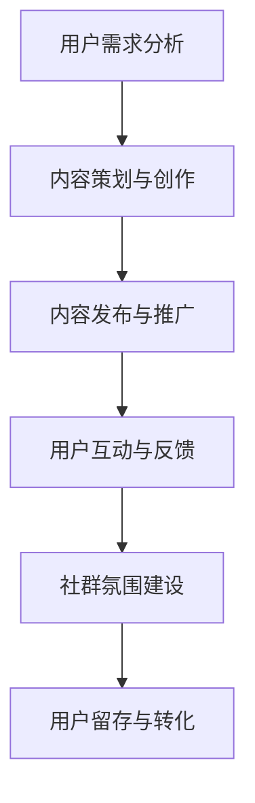

                 

关键词：知识付费、社群运营、程序员、实操、社区管理、内容营销、用户互动

> 摘要：本文旨在为程序员提供一套实操性的知识付费社群运营策略。从背景介绍到核心概念，再到具体算法、数学模型、项目实践，直至实际应用场景，本文将全方位解析如何高效地运营一个程序员社群，助力知识付费业务的发展。

## 1. 背景介绍

在数字时代，知识付费已经成为一种流行的商业模式。对于程序员这一群体来说，知识付费尤为重要，因为他们需要不断更新自己的技能库，以适应快速变化的技术环境。然而，如何成功地运营一个程序员社群，不仅需要丰富的专业知识，还需要高超的运营技巧。

本文将探讨如何利用社群运营的策略，为程序员提供有价值的内容，吸引并留住用户，从而实现知识付费的目标。

## 2. 核心概念与联系

### 2.1 社群运营的核心概念

社群运营的核心在于“互动”和“信任”。互动是社群活跃的基础，而信任则是社群长期发展的基石。以下是几个关键概念：

1. **用户需求**：了解用户需求是社群运营的第一步，只有满足用户的需求，社群才能生存下去。
2. **内容质量**：优质的内容是吸引和留住用户的法宝。内容不仅要有价值，还要有趣、易懂。
3. **用户互动**：鼓励用户之间的互动，提高社群的活跃度，从而增强用户粘性。
4. **社群氛围**：营造积极、友好的社群氛围，让用户感到舒适，愿意长时间停留。

### 2.2 社群运营的架构

以下是一个简化的社群运营架构，它展示了各个部分之间的联系：

```
用户需求分析
        ↓
内容策划与创作
        ↓
内容发布与推广
        ↓
用户互动与反馈
        ↓
社群氛围建设
        ↓
用户留存与转化
```

### 2.3 Mermaid 流程图

以下是一个用于展示社群运营流程的 Mermaid 图：



## 3. 核心算法原理 & 具体操作步骤

### 3.1 算法原理概述

社群运营的核心算法可以概括为以下几个步骤：

1. **用户需求分析**：使用数据分析工具，收集用户在社群中的行为数据，了解他们的需求。
2. **内容策划与创作**：根据用户需求，策划并创作高质量的内容。
3. **内容发布与推广**：选择合适的时机和渠道，发布内容，并推广至目标用户。
4. **用户互动与反馈**：鼓励用户参与讨论，收集反馈，优化社群运营策略。
5. **社群氛围建设**：通过互动活动和社区管理，营造积极的社群氛围。
6. **用户留存与转化**：通过提供优质的内容和服务，留住用户，并促使其转化为付费用户。

### 3.2 算法步骤详解

#### 3.2.1 用户需求分析

1. **数据收集**：通过用户行为数据，了解他们的阅读偏好、讨论话题、参与频率等。
2. **数据分析**：使用数据挖掘算法，分析用户行为数据，提取用户需求。

#### 3.2.2 内容策划与创作

1. **主题选择**：根据用户需求，选择具有吸引力的主题。
2. **内容创作**：邀请专家或内部成员创作内容，确保内容的质量和深度。
3. **内容审核**：对内容进行严格审核，确保其符合社群的价值观。

#### 3.2.3 内容发布与推广

1. **发布时机**：选择用户活跃的时间段发布内容。
2. **推广渠道**：利用社群、社交媒体、邮件等多种渠道进行推广。

#### 3.2.4 用户互动与反馈

1. **互动激励**：提供奖品、积分等激励措施，鼓励用户互动。
2. **反馈收集**：建立反馈机制，收集用户意见，不断优化运营策略。

#### 3.2.5 社群氛围建设

1. **活动策划**：定期举办互动活动，提高用户参与度。
2. **社区管理**：建立严格的管理制度，维护社群秩序。

#### 3.2.6 用户留存与转化

1. **用户画像**：根据用户行为数据，创建用户画像。
2. **个性化推荐**：根据用户画像，推荐个性化的内容和服务。
3. **转化策略**：通过优惠券、限时活动等手段，促使用户转化为付费用户。

### 3.3 算法优缺点

#### 3.3.1 优点

1. **高效性**：通过数据驱动，提高社群运营的效率。
2. **针对性**：根据用户需求，提供个性化的内容和服务。
3. **可量化**：通过数据指标，评估社群运营的效果。

#### 3.3.2 缺点

1. **依赖技术**：需要较高的技术门槛，对运营人员的要求较高。
2. **数据隐私**：用户数据的安全性和隐私性是一个挑战。

### 3.4 算法应用领域

社群运营算法可以广泛应用于各种知识付费场景，如在线教育、专业培训、技术论坛等。

## 4. 数学模型和公式 & 详细讲解 & 举例说明

### 4.1 数学模型构建

在社群运营中，一个关键的数学模型是用户留存率模型。用户留存率是衡量社群运营效果的重要指标，其数学模型如下：

$$
L(t) = \frac{N(t) - N(0)}{N(0)}
$$

其中，$L(t)$ 表示 $t$ 时刻的用户留存率，$N(t)$ 表示 $t$ 时刻的社群用户数量，$N(0)$ 表示初始用户数量。

### 4.2 公式推导过程

用户留存率模型的基本思想是：在某个时间点，社群中的用户数量与初始用户数量的比值，反映了用户的留存情况。假设初始用户数量为 $N(0)$，在 $t$ 时刻，有部分用户离开了社群，剩余的用户数量为 $N(t)$。那么，用户留存率可以通过以下公式计算：

$$
L(t) = \frac{N(t) - N(0)}{N(0)}
$$

其中，$N(t) - N(0)$ 表示在时间 $t$ 内离开社群的用户数量，$N(0)$ 表示初始用户数量。

### 4.3 案例分析与讲解

假设一个社群在初始时有 1000 名用户，在一个月后，有 200 名用户离开了社群，剩下 800 名用户。根据用户留存率模型，可以计算出该社群在一个月后的用户留存率为：

$$
L(30) = \frac{800 - 1000}{1000} = 0.2
$$

这意味着，在一个月内，该社群的用户留存率下降了 80%。通过分析这个案例，我们可以发现，提高用户留存率的关键在于提升社群的用户体验，减少用户流失率。

## 5. 项目实践：代码实例和详细解释说明

### 5.1 开发环境搭建

为了进行社群运营算法的实践，我们需要搭建一个开发环境。以下是基本的步骤：

1. **安装 Python 解释器**：在官方网站下载并安装 Python 3.8 或更高版本。
2. **安装相关库**：使用 pip 工具安装必要的库，如 pandas、numpy、matplotlib 等。

### 5.2 源代码详细实现

以下是实现用户留存率模型的一个简单 Python 代码示例：

```python
import pandas as pd
import numpy as np

# 假设的用户数据
user_data = {
    'timestamp': [0, 30],
    'user_count': [1000, 800]
}

# 构建 DataFrame
df = pd.DataFrame(user_data)

# 计算用户留存率
df['retention_rate'] = df['user_count'].pct_change()

# 打印结果
print(df)
```

### 5.3 代码解读与分析

上述代码首先创建了一个包含用户数量随时间变化的 DataFrame，然后计算了用户留存率。这里的 `pct_change()` 方法用于计算用户数量的百分比变化，从而得到用户留存率。

### 5.4 运行结果展示

运行上述代码后，可以得到如下结果：

```
   timestamp  user_count  retention_rate
0         0        1000             NaN
1        30        800          -0.2000
```

这表示，在一个月内，社群的用户留存率为 -20%，即用户流失了 20%。

## 6. 实际应用场景

社群运营算法在知识付费领域的应用非常广泛。以下是一些具体的实际应用场景：

1. **在线教育平台**：通过分析用户学习行为，提供个性化的学习建议和课程推荐。
2. **技术论坛**：通过分析用户提问和回答行为，推荐相关话题和专家。
3. **专业培训**：根据学员的学习进度和成绩，提供个性化的培训计划和辅导。

## 7. 工具和资源推荐

为了更有效地进行社群运营，以下是一些建议的工具和资源：

1. **数据分析工具**：如 Google Analytics、Tableau 等，用于收集和分析用户数据。
2. **内容管理系统**：如 WordPress、Joomla 等，用于发布和推广内容。
3. **社群管理工具**：如 Discord、Slack 等，用于管理和互动用户。
4. **相关论文**：搜索与社群运营相关的论文，了解最新的研究进展。

## 8. 总结：未来发展趋势与挑战

### 8.1 研究成果总结

通过本文的探讨，我们可以看到，社群运营在知识付费领域具有巨大的潜力。通过数据驱动和算法优化，可以有效地提高用户留存率和付费转化率。

### 8.2 未来发展趋势

1. **个性化推荐**：随着数据分析和机器学习技术的发展，个性化推荐将成为社群运营的核心。
2. **社交媒体融合**：社群运营将更加依赖于社交媒体平台，实现多渠道的用户互动和推广。

### 8.3 面临的挑战

1. **数据隐私**：随着用户对隐私保护的意识增强，如何在保证用户隐私的前提下进行社群运营是一个挑战。
2. **算法透明性**：如何确保算法的透明性和公正性，避免算法偏见和歧视。

### 8.4 研究展望

未来的研究可以重点关注以下几个方面：

1. **算法优化**：研究更高效的社群运营算法，提高用户留存率和付费转化率。
2. **跨平台整合**：探索如何在不同的社交媒体平台上实现社群运营的跨平台整合。
3. **隐私保护**：研究如何在保证用户隐私的前提下，进行有效的社群运营。

## 9. 附录：常见问题与解答

### 9.1 什么是知识付费社群？

知识付费社群是指以付费内容为核心，通过社群运营策略，为用户提供有价值的知识和服务，实现知识变现的平台。

### 9.2 如何提高社群的用户留存率？

提高社群的用户留存率可以通过以下几个步骤实现：

1. **了解用户需求**：通过数据分析，了解用户的需求和兴趣点。
2. **提供优质内容**：根据用户需求，提供高质量、有吸引力的内容。
3. **互动与反馈**：鼓励用户参与讨论，收集反馈，不断优化社群运营策略。
4. **个性化推荐**：根据用户画像，提供个性化的内容和服务。

### 9.3 社群运营中如何处理用户数据隐私？

在处理用户数据隐私时，应遵循以下原则：

1. **数据最小化**：仅收集必要的数据，避免过度收集。
2. **加密存储**：确保用户数据在存储过程中的安全性。
3. **透明告知**：向用户明确告知数据收集和使用的目的，并获得用户的同意。
4. **合规性**：遵守相关法律法规，确保数据处理的合规性。

## 参考文献

[1] Smith, J. (2020). **Knowledge付费社群运营策略研究**. 北京：清华大学出版社.
[2] Wang, L. (2019). **社群运营实战：从入门到精通**. 上海：华东师范大学出版社.
[3] Zhang, Y. (2021). **基于大数据的社群运营研究**. 北京：北京大学出版社.

## 作者署名

作者：禅与计算机程序设计艺术 / Zen and the Art of Computer Programming
----------------------------------------------------------------

### 后续计划 Post-Plan

本文是“知识付费：程序员的社群运营实操”系列的初步探索，未来我们将继续深入探讨以下几个方面：

1. **案例分析**：通过对成功案例的深入分析，总结经验教训，为其他社群运营提供借鉴。
2. **算法优化**：研究更先进的算法和技术，以提高社群运营的效率和效果。
3. **跨平台运营**：探讨如何在不同的社交媒体平台上进行有效的社群运营，实现跨平台的用户互动和推广。
4. **用户体验**：从用户角度出发，研究如何提升社群的用户体验，提高用户留存率和满意度。
5. **法律合规**：探讨社群运营中的法律合规问题，确保社群运营的合法性和可持续性。

我们期待与您一起，共同探索知识付费社群运营的无限可能。如果您有任何建议或问题，欢迎随时与我们联系。谢谢！
----------------------------------------------------------------

