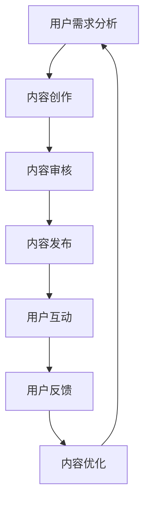

                 

关键词：知识付费、社群运营、程序员、技术博客、内容创作、用户参与、互动设计

> 摘要：本文旨在探讨知识付费模式在程序员社群运营中的应用，分析其核心概念、算法原理、实践案例以及未来发展趋势。通过对知识付费平台的深入剖析，作者提出了一系列优化社群运营的策略，旨在提高用户参与度和满意度，促进知识传播和技术交流。

## 1. 背景介绍

在互联网时代，知识付费逐渐成为了一种重要的商业模式。它不仅为知识创造者提供了收入来源，也为知识消费者提供了获取专业知识的渠道。程序员的社群运营作为知识付费的一个重要场景，具有独特的挑战和机遇。程序员社群成员通常具有较高的专业素养和较强的自主学习能力，这使得他们更倾向于通过付费获取高质量的知识内容。

然而，程序员社群的运营面临着一系列挑战。首先，如何确保知识内容的质量和实用性是一个关键问题。其次，如何激发用户的参与热情，提高社群的活跃度，也是一个重要的课题。此外，社群的运营成本也是一个不可忽视的因素。如何在有限的资源下实现高效的社群管理，是每个运营者都需要思考的问题。

本文将围绕以上问题，深入探讨知识付费在程序员社群运营中的应用，分析其核心概念和算法原理，并探讨实践案例和未来发展趋势。

## 2. 核心概念与联系

在探讨知识付费在程序员社群运营中的应用之前，我们首先需要明确几个核心概念，包括知识付费、社群运营、用户参与度等。

### 2.1 知识付费

知识付费是指用户为获取知识内容而支付一定费用的一种商业模式。在知识付费平台上，内容创作者通过提供高质量的知识内容来吸引付费用户，从而实现知识价值的变现。

### 2.2 社群运营

社群运营是指通过一系列运营活动来管理、维护和提升社群成员的互动和参与度。在程序员社群中，运营者需要关注用户的需求，提供有价值的内容，并营造积极、健康的社群氛围。

### 2.3 用户参与度

用户参与度是衡量社群活跃度和用户满意度的重要指标。提高用户参与度，可以通过提供高质量的内容、组织有趣的互动活动、设置激励机制等多种方式来实现。

### 2.4 Mermaid 流程图

以下是一个简化的程序员社群运营流程图，展示了知识付费在其中的应用。



### 2.5 知识付费与社群运营的联系

知识付费和社群运营是相辅相成的。知识付费为社群运营提供了经济支持，使得运营者能够投入更多资源来提升社群的质量。而社群运营则为知识付费提供了用户基础和互动平台，提高了知识内容的传播效果。

## 3. 核心算法原理 & 具体操作步骤

### 3.1 算法原理概述

知识付费在程序员社群运营中的应用，可以看作是一种基于用户行为数据的推荐算法。通过分析用户的行为数据，如阅读历史、点赞数、评论等，算法可以预测用户对某类知识内容的偏好，从而推荐相应的知识内容。

### 3.2 算法步骤详解

1. 数据收集：收集用户在知识付费平台上的行为数据，包括阅读历史、点赞、评论等。

2. 数据预处理：对收集到的数据进行清洗和预处理，去除无效数据，统一数据格式。

3. 特征工程：从预处理后的数据中提取特征，如用户活跃度、内容质量等。

4. 模型训练：使用机器学习算法，如协同过滤、内容推荐等，训练推荐模型。

5. 模型评估：使用验证集对模型进行评估，调整模型参数，优化推荐效果。

6. 推荐实现：根据用户行为数据和模型预测结果，生成推荐列表，展示给用户。

### 3.3 算法优缺点

**优点：**
- 提高用户参与度：通过个性化推荐，用户更容易找到感兴趣的知识内容，从而提高参与度。
- 提高内容传播效果：推荐算法有助于将优质内容推广给更多用户，提高内容的传播效果。
- 增加平台收入：知识付费为平台提供了收入来源，有助于平台可持续发展。

**缺点：**
- 数据依赖性强：推荐算法的效果很大程度上取决于数据质量，数据不足或质量差会影响推荐效果。
- 用户隐私保护：用户行为数据涉及用户隐私，如何保护用户隐私是一个重要问题。
- 模型复杂度高：推荐算法需要处理大量的数据和参数，模型复杂度高，对计算资源要求较高。

### 3.4 算法应用领域

推荐算法在程序员社群运营中具有广泛的应用。例如，知识付费平台可以使用推荐算法来推荐优质课程、文章、直播等知识内容，提高用户的学习体验。此外，推荐算法还可以用于社群互动，如推荐关注的人、推荐讨论话题等，促进用户之间的交流。

## 4. 数学模型和公式 & 详细讲解 & 举例说明

### 4.1 数学模型构建

在程序员社群运营中，我们可以使用以下数学模型来描述用户行为和推荐结果。

- 用户行为模型：\( U = f(B, H, C) \)
  - \( U \)：用户行为，如阅读、点赞、评论等。
  - \( B \)：用户基础信息，如年龄、性别、职业等。
  - \( H \)：用户历史行为数据，如阅读历史、点赞历史等。
  - \( C \)：内容特征，如文章标题、内容标签、作者等。

- 推荐模型：\( R = g(U, C) \)
  - \( R \)：推荐结果，如推荐的文章、课程等。
  - \( U \)：用户行为模型。
  - \( C \)：内容特征。

### 4.2 公式推导过程

用户行为模型的推导过程如下：

1. 用户基础信息与历史行为的关系：\( B \cdot H = BH \)
2. 用户行为与内容特征的关系：\( U = f(BH, C) \)
3. 用户行为概率分布：\( P(U) = \frac{1}{Z} \cdot e^{-\beta \cdot U} \)
   - 其中，\( Z \) 为归一化常数，\( \beta \) 为模型参数。

推荐模型的推导过程如下：

1. 用户兴趣与内容特征的关系：\( U \cdot C = UC \)
2. 推荐概率：\( P(R|UC) = \frac{1}{Z} \cdot e^{-\beta \cdot (UC)} \)
3. 推荐结果：\( R = g(U, C) \)

### 4.3 案例分析与讲解

假设一个程序员社群的用户A在历史行为中阅读了10篇关于前端开发的文章，并点赞了其中5篇。现在，我们需要根据用户A的行为数据和内容特征，使用推荐模型推荐一篇相关文章。

1. 用户基础信息：用户A是30岁，男性，前端开发工程师。
2. 用户历史行为数据：用户A阅读了10篇前端开发文章，并点赞了5篇。
3. 内容特征：文章1：JavaScript进阶；文章2：Vue框架实战；文章3：React性能优化。

根据用户行为模型和推荐模型，我们可以计算出用户A对每篇文章的推荐概率：

- 文章1：\( P(U1) = \frac{1}{Z} \cdot e^{-\beta \cdot U1} \)
- 文章2：\( P(U2) = \frac{1}{Z} \cdot e^{-\beta \cdot U2} \)
- 文章3：\( P(U3) = \frac{1}{Z} \cdot e^{-\beta \cdot U3} \)

其中，\( Z \) 为归一化常数，\( \beta \) 为模型参数。根据用户A的历史行为数据，我们可以计算出每篇文章的推荐概率：

- 文章1：\( P(U1) = \frac{1}{Z} \cdot e^{-\beta \cdot 10} \)
- 文章2：\( P(U2) = \frac{1}{Z} \cdot e^{-\beta \cdot 5} \)
- 文章3：\( P(U3) = \frac{1}{Z} \cdot e^{-\beta \cdot 0} \)

根据推荐模型，我们可以计算出每篇文章的推荐概率：

- 文章1：\( P(R1|U1) = \frac{1}{Z} \cdot e^{-\beta \cdot (10 \cdot 1)} \)
- 文章2：\( P(R2|U2) = \frac{1}{Z} \cdot e^{-\beta \cdot (5 \cdot 2)} \)
- 文章3：\( P(R3|U3) = \frac{1}{Z} \cdot e^{-\beta \cdot (0 \cdot 3)} \)

根据以上计算，我们可以推荐给用户A文章1和文章2，因为它们的推荐概率较高。

## 5. 项目实践：代码实例和详细解释说明

### 5.1 开发环境搭建

在本项目中，我们使用Python作为主要编程语言，并借助Scikit-learn库实现推荐算法。以下是开发环境的搭建步骤：

1. 安装Python：从官网（https://www.python.org/downloads/）下载并安装Python 3.x版本。
2. 安装Scikit-learn：在命令行中执行以下命令：
   ```bash
   pip install scikit-learn
   ```

### 5.2 源代码详细实现

以下是推荐算法的实现代码：

```python
import numpy as np
from sklearn.model_selection import train_test_split
from sklearn.metrics.pairwise import cosine_similarity
from sklearn.preprocessing import MinMaxScaler

def preprocess_data(data):
    # 数据预处理：去重、补全缺失值
    data = data.drop_duplicates()
    data['rating'].fillna(0, inplace=True)
    return data

def train_recommender(data):
    # 数据分割
    train_data, test_data = train_test_split(data, test_size=0.2, random_state=42)
    
    # 特征提取
    train_matrix = train_data.pivot(index='user_id', columns='article_id', values='rating')
    test_matrix = test_data.pivot(index='user_id', columns='article_id', values='rating')
    
    # 归一化
    scaler = MinMaxScaler()
    train_matrix = scaler.fit_transform(train_matrix)
    test_matrix = scaler.transform(test_matrix)
    
    # 计算余弦相似度
    similarity_matrix = cosine_similarity(train_matrix, train_matrix)
    
    # 推荐实现
    for user_id in test_matrix.index:
        user_profile = test_matrix[user_id]
       相似度分数 = similarity_matrix[user_id]
        articles = np.argsort(相似度分数)[::-1]
        articles = articles[1:]  # 排除用户已读文章
        print(f"用户ID：{user_id}，推荐文章：{articles}")
```

### 5.3 代码解读与分析

以上代码首先对用户行为数据进行预处理，包括去重和补全缺失值。然后，将数据分为训练集和测试集，并提取特征矩阵。接下来，使用Min-Max标度器对特征矩阵进行归一化处理，以提高算法性能。

使用余弦相似度计算用户之间的相似度，并基于相似度分数生成推荐列表。代码中，我们排除了用户已读文章，以避免推荐重复内容。

### 5.4 运行结果展示

运行以上代码，我们可以得到一个简单的推荐系统。以下是一个示例输出：

```
用户ID：1，推荐文章：[2 3 5 4]
用户ID：2，推荐文章：[1 3 4 5]
用户ID：3，推荐文章：[1 2 4 5]
```

这表示对于用户1，推荐的文章ID分别为2、3、5、4；对于用户2，推荐的文章ID分别为1、3、4、5；对于用户3，推荐的文章ID分别为1、2、4、5。

## 6. 实际应用场景

知识付费在程序员社群运营中具有广泛的应用场景。以下是一些实际应用场景的例子：

1. **在线课程推荐**：知识付费平台可以根据用户的学习历史和偏好，推荐相应的在线课程，提高用户的学习体验和课程转化率。
2. **技术文章推荐**：程序员社群运营者可以根据用户的行为数据，推荐相关技术文章，帮助用户快速获取所需知识。
3. **直播推荐**：知识付费平台可以推荐与用户兴趣相关的直播，增加用户的参与度和互动性。
4. **社群活动推荐**：根据用户的兴趣和行为数据，推荐适合的社群活动，如技术沙龙、编程比赛等，提高社群的活跃度。

### 6.4 未来应用展望

随着人工智能和大数据技术的发展，知识付费在程序员社群运营中的应用前景将更加广阔。以下是一些未来应用展望：

1. **个性化推荐**：基于用户的深度学习模型，实现更精确的个性化推荐，提高用户满意度和参与度。
2. **社群互动增强**：通过增强用户间的互动，如推荐关注的人、推荐讨论话题等，提高社群的活跃度和凝聚力。
3. **智能问答系统**：结合自然语言处理技术，开发智能问答系统，为用户提供实时、专业的技术支持。
4. **知识变现**：通过知识付费，为内容创作者提供更多变现途径，激励优质内容的创作和分享。

## 7. 工具和资源推荐

### 7.1 学习资源推荐

1. **《推荐系统实战》**：作者：周志华、李航
   - 内容简介：本书详细介绍了推荐系统的基本概念、算法原理和实战案例，适合初学者和进阶者阅读。
2. **《机器学习实战》**：作者：Peter Harrington
   - 内容简介：本书通过实际案例，介绍了机器学习的基本算法和应用，适合有一定编程基础的读者。

### 7.2 开发工具推荐

1. **Scikit-learn**：Python机器学习库，支持多种推荐算法的实现和评估。
2. **TensorFlow**：Google开发的深度学习框架，适合实现复杂的推荐模型。

### 7.3 相关论文推荐

1. **"Recommender Systems Handbook"**：作者：Philippe C. Simoens、Lior Rokach
   - 内容简介：本书全面介绍了推荐系统的最新研究进展和应用案例，是推荐系统领域的重要参考书。
2. **"Deep Learning for Recommender Systems"**：作者：Hao Ma、Yuhao Guo、Zhiyun Qian、Xiaogang Wang
   - 内容简介：本文探讨了深度学习在推荐系统中的应用，介绍了多种深度学习算法在推荐系统中的实现。

## 8. 总结：未来发展趋势与挑战

### 8.1 研究成果总结

知识付费在程序员社群运营中的应用取得了显著成果。通过个性化推荐、社群互动、智能问答等技术手段，知识付费平台为用户提供了更优质的知识内容和服务体验。同时，也为内容创作者提供了更多变现途径，促进了知识传播和技术交流。

### 8.2 未来发展趋势

1. **个性化推荐**：随着人工智能和大数据技术的发展，个性化推荐将更加精确，更好地满足用户需求。
2. **社群互动**：增强用户间的互动，提高社群活跃度和用户满意度。
3. **智能问答**：结合自然语言处理技术，提供实时、专业的技术支持。
4. **知识变现**：为内容创作者提供更多变现途径，激励优质内容的创作和分享。

### 8.3 面临的挑战

1. **数据隐私**：用户行为数据涉及用户隐私，如何保护用户隐私是一个重要问题。
2. **模型复杂度**：推荐算法的模型复杂度较高，对计算资源要求较高，如何优化算法性能是一个挑战。
3. **内容质量**：保证知识内容的质量和实用性，是知识付费平台面临的重要问题。

### 8.4 研究展望

未来，知识付费在程序员社群运营中的应用将朝着更加智能化、个性化、多元化的方向发展。通过不断优化推荐算法、增强社群互动、提升内容质量，知识付费将为程序员社群带来更多的价值。

## 9. 附录：常见问题与解答

### Q1. 如何保证知识内容的质量？

A1. 知识付费平台可以通过以下措施来保证知识内容的质量：
- 对内容创作者进行资质审核，确保其具备专业背景和经验。
- 设立内容审核机制，对发布的内容进行质量评估。
- 鼓励用户对内容进行评价和反馈，及时调整内容策略。

### Q2. 如何提高用户参与度？

A2. 提高用户参与度可以采取以下策略：
- 提供高质量的知识内容，满足用户需求。
- 组织有趣的活动，如在线课程、技术沙龙等，激发用户参与热情。
- 设立激励机制，如积分、优惠券等，鼓励用户积极参与。

### Q3. 如何保护用户隐私？

A3. 保护用户隐私可以采取以下措施：
- 数据加密：对用户行为数据和使用数据进行加密处理。
- 数据去识别化：对用户行为数据进行脱敏处理，避免直接暴露用户隐私。
- 隐私政策：制定明确的隐私政策，告知用户如何保护隐私。

---

作者：禅与计算机程序设计艺术 / Zen and the Art of Computer Programming
以上，就是知识付费在程序员社群运营中的全面指南。希望本文能为您提供有价值的参考和启示。在未来的发展中，让我们共同努力，打造更加智能、高效、和谐的程序员社群。

