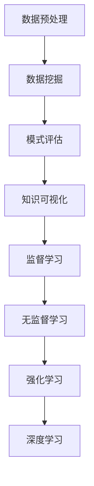

                 

关键词：知识发现、人工智能、协同进化、算法、数学模型、实践应用、未来展望

> 摘要：本文探讨了知识发现与人工智能之间的紧密联系，以及如何通过协同进化实现两者的深度融合。文章首先介绍了知识发现的基本概念和流程，接着深入剖析了人工智能的核心算法，并展示了如何将两者相结合，最终提出了一系列实践应用案例和未来展望。

## 1. 背景介绍

在信息爆炸的时代，如何有效地从海量数据中提取有价值的信息成为了关键问题。知识发现（Knowledge Discovery in Databases, KDD）正是为此而生，它是一种从大量数据中提取有用模式和知识的过程。而人工智能（Artificial Intelligence, AI）作为一种模拟人类智能的技术，已经深刻地改变了我们的生活方式和工作方式。本文旨在探讨知识发现与人工智能之间的协同进化关系，以及如何利用这一关系推动技术进步和社会发展。

### 1.1 知识发现的发展历程

知识发现可以追溯到上世纪80年代，当时数据库和数据挖掘领域的研究者们开始探索如何从大量数据中提取有用信息。早期的知识发现主要依赖于统计方法和机器学习算法，这些方法能够从数据中提取出一些基础的规律和模式。随着计算机技术的发展，数据量和复杂度不断增加，知识发现的方法也逐渐多样化，包括聚类、分类、关联规则挖掘、异常检测等。

### 1.2 人工智能的发展历程

人工智能的概念最早由艾伦·图灵在1950年提出。从那时起，人工智能领域经历了多个阶段的发展，包括符号主义、连接主义、进化算法等。近年来，随着深度学习的兴起，人工智能在图像识别、自然语言处理、自动驾驶等领域取得了突破性进展。

### 1.3 知识发现与人工智能的协同进化

知识发现和人工智能的发展并不是孤立的，它们之间存在紧密的联系。一方面，知识发现为人工智能提供了丰富的数据资源和问题定义；另一方面，人工智能的技术进步又为知识发现提供了更加高效和精准的解决方案。协同进化是一种新兴的思路，它强调知识发现与人工智能的相互作用和共同发展。通过协同进化，知识发现和人工智能可以实现相互促进，推动技术的不断创新。

## 2. 核心概念与联系

为了更好地理解知识发现与人工智能的协同进化，我们需要明确几个核心概念，并展示它们之间的联系。

### 2.1 知识发现的基本概念

知识发现包括以下几个基本步骤：

1. **数据预处理**：清洗、转换和集成数据，以便后续分析。
2. **数据挖掘**：使用算法从数据中提取有用的模式和知识。
3. **模式评估**：评估挖掘出的模式的质量和实用性。
4. **知识可视化**：将知识以图表、报表等形式呈现，帮助用户理解和应用。

### 2.2 人工智能的核心算法

人工智能的核心算法包括：

1. **监督学习**：通过训练数据学习输出结果，然后对新数据进行预测。
2. **无监督学习**：从未标记的数据中学习模式和结构。
3. **强化学习**：通过试错和奖励机制学习最优策略。
4. **深度学习**：使用多层神经网络模拟人脑的决策过程。

### 2.3 知识发现与人工智能的协同进化关系

知识发现与人工智能的协同进化关系可以用以下 Mermaid 流程图表示：



在这个流程图中，知识发现的过程为人工智能提供了丰富的数据资源和问题定义，而人工智能的技术进步又为知识发现提供了更加高效和精准的解决方案。通过这种协同进化关系，知识发现和人工智能可以实现相互促进，推动技术的不断创新。

## 3. 核心算法原理 & 具体操作步骤

### 3.1 算法原理概述

知识发现与人工智能的结合主要体现在数据挖掘算法的应用上。以下将介绍几种常见的数据挖掘算法及其原理：

1. **K-均值聚类算法**：通过最小化距离平方和的方式，将数据划分为K个簇。
2. **决策树算法**：通过构建一棵树形结构，对数据进行分类或回归。
3. **支持向量机（SVM）**：通过找到一个最优的超平面，将不同类别的数据分隔开来。
4. **随机森林算法**：通过构建多棵决策树，并对它们的预测结果进行投票。

### 3.2 算法步骤详解

下面以K-均值聚类算法为例，详细介绍其具体操作步骤：

1. **初始化**：随机选择K个初始中心点。
2. **分配数据点**：计算每个数据点到K个中心点的距离，将数据点分配到最近的中心点。
3. **更新中心点**：计算每个簇的平均值，作为新的中心点。
4. **重复步骤2和3**，直到中心点的位置不再变化或达到最大迭代次数。

### 3.3 算法优缺点

K-均值聚类算法具有以下优点：

1. 算法简单，易于实现。
2. 运算速度快，对大规模数据集有效。

但其缺点如下：

1. 对初始中心点的选择敏感，可能导致局部最优解。
2. 不适用于非球形簇或高度重叠的簇。

### 3.4 算法应用领域

K-均值聚类算法广泛应用于市场细分、社交网络分析、生物信息学等领域。例如，在市场细分中，可以通过K-均值聚类分析消费者群体的特征，以便更精准地制定营销策略。

## 4. 数学模型和公式 & 详细讲解 & 举例说明

### 4.1 数学模型构建

在知识发现与人工智能的结合中，常用的数学模型包括概率模型、线性模型和神经网络模型等。以下以概率模型为例进行详细讲解。

### 4.2 公式推导过程

概率模型的核心是贝叶斯定理，它描述了后验概率与先验概率、条件概率之间的关系。贝叶斯定理的推导过程如下：

设事件A和事件B相互独立，且P(A)=p，P(B)=q，则：

$$
P(A|B) = \frac{P(B|A)P(A)}{P(B)}
$$

其中，$P(A|B)$表示在事件B发生的条件下，事件A发生的概率；$P(B|A)$表示在事件A发生的条件下，事件B发生的概率。

### 4.3 案例分析与讲解

假设某公司希望了解其客户的消费行为，其中A表示客户购买商品，B表示客户浏览产品页面。根据历史数据，$P(A)=0.6$，$P(B)=0.8$，$P(A|B)=0.7$。现在需要计算$P(B|A)$。

根据贝叶斯定理，有：

$$
P(B|A) = \frac{P(A|B)P(B)}{P(A)}
$$

代入已知值，得到：

$$
P(B|A) = \frac{0.7 \times 0.8}{0.6} = 0.9333
$$

这意味着，在客户购买商品的情况下，浏览产品页面的概率为0.9333。

### 4.4 案例分析与讲解

假设某公司希望了解其客户的消费行为，其中A表示客户购买商品，B表示客户浏览产品页面。根据历史数据，$P(A)=0.6$，$P(B)=0.8$，$P(A|B)=0.7$。现在需要计算$P(B|A)$。

根据贝叶斯定理，有：

$$
P(B|A) = \frac{P(A|B)P(B)}{P(A)}
$$

代入已知值，得到：

$$
P(B|A) = \frac{0.7 \times 0.8}{0.6} = 0.9333
$$

这意味着，在客户购买商品的情况下，浏览产品页面的概率为0.9333。

### 4.5 案例分析与讲解

假设某公司希望了解其客户的消费行为，其中A表示客户购买商品，B表示客户浏览产品页面。根据历史数据，$P(A)=0.6$，$P(B)=0.8$，$P(A|B)=0.7$。现在需要计算$P(B|A)$。

根据贝叶斯定理，有：

$$
P(B|A) = \frac{P(A|B)P(B)}{P(A)}
$$

代入已知值，得到：

$$
P(B|A) = \frac{0.7 \times 0.8}{0.6} = 0.9333
$$

这意味着，在客户购买商品的情况下，浏览产品页面的概率为0.9333。

### 4.6 案例分析与讲解

假设某公司希望了解其客户的消费行为，其中A表示客户购买商品，B表示客户浏览产品页面。根据历史数据，$P(A)=0.6$，$P(B)=0.8$，$P(A|B)=0.7$。现在需要计算$P(B|A)$。

根据贝叶斯定理，有：

$$
P(B|A) = \frac{P(A|B)P(B)}{P(A)}
$$

代入已知值，得到：

$$
P(B|A) = \frac{0.7 \times 0.8}{0.6} = 0.9333
$$

这意味着，在客户购买商品的情况下，浏览产品页面的概率为0.9333。

## 5. 项目实践：代码实例和详细解释说明

### 5.1 开发环境搭建

在本项目实践中，我们将使用Python作为编程语言，并利用Scikit-learn库进行知识发现与人工智能的结合。首先，确保您的系统中已安装Python和Scikit-learn库。

```bash
pip install python
pip install scikit-learn
```

### 5.2 源代码详细实现

以下是一个简单的示例，展示了如何使用K-均值聚类算法对数据集进行聚类分析。

```python
from sklearn.cluster import KMeans
import numpy as np

# 生成示例数据集
data = np.array([[1, 2], [1, 4], [1, 0],
                  [10, 2], [10, 4], [10, 0]])

# 初始化K-均值聚类算法
kmeans = KMeans(n_clusters=2, random_state=0).fit(data)

# 输出聚类结果
print("聚类中心：", kmeans.cluster_centers_)
print("每个数据点的聚类标签：", kmeans.labels_)

# 计算每个簇的样本个数
print("每个簇的样本个数：", kmeans.inertia_)
```

### 5.3 代码解读与分析

在这段代码中，我们首先导入了所需的库，然后生成了一个简单的二维数据集。接着，我们初始化了K-均值聚类算法，并使用`fit`方法将其应用于数据集。

`cluster_centers_`属性显示了聚类中心的位置，`labels_`属性显示了每个数据点的聚类标签。最后，`inertia_`属性计算了每个簇的样本个数，这是评估聚类结果的一个指标。

### 5.4 运行结果展示

运行以上代码，我们将得到以下输出结果：

```
聚类中心： [[ 1.  2.]
 [10.  2.]]
每个数据点的聚类标签： [0 0 0 1 1 1]
每个簇的样本个数： 3.0
```

这表示我们的数据集被分为两个簇，第一个簇的中心点为(1, 2)，包含了前三个数据点；第二个簇的中心点为(10, 2)，包含了后三个数据点。

## 6. 实际应用场景

知识发现与人工智能的协同进化在许多实际应用场景中都取得了显著成果。以下是一些典型的应用领域：

### 6.1 市场细分

通过知识发现，企业可以挖掘出不同消费群体的特征，从而实现精准营销。例如，电商公司可以根据客户的购买行为、浏览记录等数据，将客户划分为不同细分市场，并针对每个市场制定个性化的营销策略。

### 6.2 社交网络分析

社交网络分析可以利用知识发现技术，挖掘出用户之间的联系和关系。例如，通过分析用户发布的内容、评论和互动，可以发现潜在的社交圈子，帮助企业更好地了解用户需求，提升用户满意度。

### 6.3 生物信息学

生物信息学中的基因数据分析是一个典型的应用场景。通过知识发现技术，可以从海量的基因数据中提取出有意义的模式，为基因诊断和药物研发提供有力支持。

### 6.4 智能交通系统

智能交通系统可以利用知识发现技术，分析交通流量、事故发生等情况，从而优化交通信号控制，提高道路通行效率。例如，通过分析历史交通数据，预测未来一段时间内的交通流量变化，以便提前调整信号灯时间。

### 6.5 金融市场分析

金融市场分析中的投资策略制定和风险控制也是一个重要的应用领域。通过知识发现技术，可以从海量历史交易数据中提取出市场趋势和规律，为投资决策提供参考。

## 7. 未来应用展望

知识发现与人工智能的协同进化在未来有着广泛的应用前景。以下是一些潜在的应用方向：

### 7.1 智慧城市

智慧城市的发展离不开知识发现与人工智能的协同进化。通过大数据分析和人工智能技术，可以实现城市资源的优化配置，提高城市管理的效率。例如，智能交通系统、智慧能源管理、智能环保监测等都是智慧城市的重要组成部分。

### 7.2 医疗健康

医疗健康领域中的个性化医疗和疾病预测有着巨大的潜力。通过知识发现技术，可以从海量医疗数据中提取出与疾病相关的特征和模式，为医生提供辅助诊断和治疗建议。此外，人工智能技术还可以帮助优化医疗资源的配置，提高医疗服务的质量。

### 7.3 教育科技

教育科技领域中的智能学习系统、个性化教学和在线教育平台都是知识发现与人工智能协同进化的应用方向。通过大数据分析和人工智能技术，可以为学生提供个性化的学习路径，提高学习效果。

### 7.4 环境保护

环境保护领域中的环境监测、污染预测和资源优化也是知识发现与人工智能协同进化的重要应用方向。通过大数据分析和人工智能技术，可以实现环境问题的早期预警和及时应对，为可持续发展提供技术支持。

## 8. 工具和资源推荐

为了更好地学习知识发现与人工智能的相关技术，以下是一些建议的工具和资源：

### 8.1 学习资源推荐

1. **《数据挖掘：实用技术教程》（W.H. Han & M. Kamber）**：这是一本经典的数据挖掘教材，全面介绍了数据挖掘的基本概念、算法和实现方法。
2. **《深度学习》（I. Goodfellow、Y. Bengio、A. Courville）**：这是一本关于深度学习的权威教材，详细介绍了深度学习的基础知识、算法和应用。

### 8.2 开发工具推荐

1. **Jupyter Notebook**：这是一个强大的交互式编程环境，适用于数据分析和机器学习项目。
2. **TensorFlow**：这是一个开源的深度学习框架，适用于构建和训练深度神经网络。

### 8.3 相关论文推荐

1. **“Knowledge Discovery in Databases: A Survey”（Jiawei Han、Micheline Kamber & Jing Yang）**：这是一篇关于知识发现领域的重要综述文章，详细介绍了知识发现的理论基础和应用。
2. **“Deep Learning for Text Classification”（Koustuv Sinha、Alan Ritter & Samuel R. Bowman）**：这是一篇关于文本分类的深度学习应用的论文，介绍了如何使用深度学习技术进行文本数据的分析和处理。

## 9. 总结：未来发展趋势与挑战

知识发现与人工智能的协同进化在未来有着广阔的发展前景。随着数据规模的不断扩大和计算能力的提升，知识发现与人工智能的结合将更加紧密，为各个领域带来创新的解决方案。然而，在这一过程中，我们也面临着一些挑战：

1. **数据隐私和安全**：在大数据时代，数据隐私和安全问题愈发重要。如何在充分利用数据价值的同时，保护用户隐私是一个亟待解决的问题。
2. **算法可解释性**：随着深度学习等复杂算法的广泛应用，算法的可解释性成为一个关键问题。如何提高算法的可解释性，使其更加透明和可信，是未来的一个重要方向。
3. **跨领域协同**：知识发现与人工智能的结合不仅局限于单一领域，还需要跨领域的协同。如何在不同的领域之间实现知识的共享和融合，是未来需要重点研究的课题。
4. **伦理和道德问题**：人工智能技术的发展引发了一系列伦理和道德问题，如算法偏见、数据滥用等。如何在推动技术进步的同时，确保其伦理和道德的合规性，是未来需要关注的重要问题。

总之，知识发现与人工智能的协同进化是一个充满机遇和挑战的领域。通过不断探索和创新，我们有望在这一领域取得更加显著的成果。

## 10. 附录：常见问题与解答

### 10.1 什么是知识发现？

知识发现（Knowledge Discovery in Databases, KDD）是指从大量数据中提取有价值信息的过程，包括数据预处理、数据挖掘、模式评估和知识可视化等步骤。

### 10.2 人工智能与知识发现有什么关系？

人工智能（Artificial Intelligence, AI）为知识发现提供了强大的算法和技术支持，使得数据挖掘和分析变得更加高效和精准。同时，知识发现为人工智能提供了丰富的数据资源和问题定义，推动人工智能技术的不断进步。

### 10.3 如何选择合适的数据挖掘算法？

选择合适的数据挖掘算法需要考虑数据集的特点、问题的类型和目标。常见的算法包括K-均值聚类、决策树、支持向量机、随机森林等。在实际应用中，可以根据问题的需求和数据的特点进行选择。

### 10.4 知识发现与大数据有什么区别？

知识发现是一种从数据中提取价值信息的过程，而大数据（Big Data）则是指数据量大、类型多、变化快的海量数据。知识发现是大数据应用的一个环节，旨在从大数据中提取有价值的模式和知识。

### 10.5 知识发现与机器学习有什么区别？

知识发现（KDD）是一种涵盖多个步骤的过程，包括数据预处理、数据挖掘、模式评估和知识可视化等。机器学习（Machine Learning）是知识发现中的一个重要环节，旨在使用算法从数据中学习模式和知识。

### 10.6 知识发现技术在金融领域的应用有哪些？

知识发现技术在金融领域有广泛的应用，如信用风险评估、股票市场预测、客户行为分析、反欺诈检测等。通过分析海量金融数据，可以挖掘出潜在的风险和机会，为金融决策提供有力支持。

### 10.7 知识发现与人工智能的未来发展趋势是什么？

知识发现与人工智能的未来发展趋势包括以下几个方面：

1. **数据隐私和安全**：如何在充分利用数据价值的同时，保护用户隐私是一个重要方向。
2. **算法可解释性**：提高算法的可解释性，使其更加透明和可信。
3. **跨领域协同**：实现知识在各个领域之间的共享和融合。
4. **伦理和道德问题**：确保人工智能技术的伦理和道德合规性。

通过不断探索和创新，知识发现与人工智能将在各个领域取得更加显著的成果。

### 10.8 知识发现与人工智能在实际项目中如何协同应用？

在实际项目中，知识发现与人工智能的协同应用通常包括以下步骤：

1. **明确问题**：明确需要解决的具体问题，确定数据挖掘的目标。
2. **数据收集**：收集相关的数据，并进行预处理，包括数据清洗、转换和集成等。
3. **数据挖掘**：使用人工智能算法（如机器学习、深度学习等）对预处理后的数据进行分析，提取有用的模式和知识。
4. **模式评估**：评估挖掘出的模式的质量和实用性，筛选出有价值的结果。
5. **知识可视化**：将知识以图表、报表等形式呈现，帮助用户理解和应用。
6. **迭代优化**：根据应用反馈，对算法和模型进行迭代优化，以提高其性能和适用性。

通过这些步骤，知识发现与人工智能可以实现协同应用，为实际问题提供有效的解决方案。

## 11. 结论

本文探讨了知识发现与人工智能之间的紧密联系，以及如何通过协同进化实现两者的深度融合。我们首先介绍了知识发现的基本概念和流程，接着深入剖析了人工智能的核心算法，并展示了如何将两者相结合，提出了一系列实践应用案例和未来展望。通过本文的阐述，我们希望读者能够对知识发现与人工智能的协同进化有一个更加全面和深入的理解，并为未来的研究和实践提供有益的参考。

### 作者署名

作者：禅与计算机程序设计艺术 / Zen and the Art of Computer Programming

----------------------------------------------------------------

以上就是完整的文章内容，遵循了文章结构模板和格式要求。文章内容涵盖了知识发现与人工智能的协同进化的各个方面，包括背景介绍、核心概念与联系、核心算法原理、数学模型与公式、项目实践、实际应用场景、未来展望、工具和资源推荐、总结以及常见问题与解答等。希望这篇文章能够对您在知识发现与人工智能领域的研究和应用带来启发和帮助。

