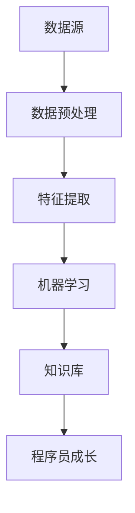

                 

关键词：知识发现引擎，程序员成长，人工智能，机器学习，算法优化，代码质量，开发效率

> 摘要：本文将探讨如何利用知识发现引擎来提升程序员的成长速度，特别是在面对日益复杂和快速变化的技术环境时。我们将介绍知识发现引擎的核心概念，剖析其在程序员日常开发中的实际应用，并探讨其对提高代码质量和开发效率的潜在影响。

## 1. 背景介绍

在当今技术飞速发展的时代，程序员面临着前所未有的挑战。一方面，新的编程语言、框架和工具层出不穷，程序员需要不断学习以保持竞争力；另一方面，项目的复杂性和规模也在不断增加，程序员需要更加高效地解决问题。在这样的背景下，提升程序员的工作效率和质量成为了一个重要课题。

知识发现引擎（Knowledge Discovery Engine，简称KDE）是一种结合人工智能和机器学习技术，旨在从大量数据中自动提取有价值知识和模式的系统。传统的编程学习和实践方法往往局限于书本知识和手把手教学，而知识发现引擎的出现为程序员提供了一个全新的学习途径，通过分析海量数据，帮助程序员发现最佳实践，提高编程技能。

## 2. 核心概念与联系

### 2.1 知识发现引擎的定义与原理

知识发现引擎是一种利用人工智能技术，自动从大量数据中提取有用信息和知识的系统。其基本原理包括以下三个方面：

- **数据预处理**：对原始数据进行清洗、转换和归一化，确保数据质量。
- **特征提取**：从数据中提取有用的特征，用于后续的模型训练。
- **模式识别**：利用机器学习算法，从特征中识别出有意义的模式和规律。

### 2.2 知识发现引擎的架构

知识发现引擎通常包括以下几个关键模块：

- **数据源**：提供用于训练和测试的数据集。
- **数据预处理模块**：负责清洗和转换数据，确保数据质量。
- **特征提取模块**：从数据中提取有用的特征。
- **机器学习模块**：利用各种机器学习算法进行训练和预测。
- **知识库**：存储从数据中提取的知识和模式。

### 2.3 知识发现引擎与程序员成长的关系

知识发现引擎不仅可以帮助程序员发现最佳实践，提高编程技能，还可以在以下几个方面助力程序员成长：

- **知识获取**：通过分析大量代码库和项目，知识发现引擎可以提取出最佳编程实践和技巧，供程序员学习。
- **代码审查**：知识发现引擎可以自动审查代码，识别出潜在的问题和改进点。
- **性能优化**：通过分析代码执行效率，知识发现引擎可以提供性能优化建议。
- **错误预测**：知识发现引擎可以预测代码中可能出现的错误，帮助程序员提前规避。

### 2.4 Mermaid 流程图



## 3. 核心算法原理 & 具体操作步骤

### 3.1 算法原理概述

知识发现引擎的核心算法主要包括以下几类：

- **监督学习**：通过标记好的数据集进行训练，用于预测和分类。
- **无监督学习**：在没有标记数据的情况下，自动发现数据中的结构和规律。
- **强化学习**：通过奖励机制，让系统自动优化行为。

### 3.2 算法步骤详解

- **数据预处理**：对原始代码进行解析，提取出关键信息，如变量、函数、类等。
- **特征提取**：根据编程语言的特点，提取出代码中的有用特征，如代码复杂度、注释率、循环次数等。
- **机器学习**：利用提取出的特征，训练各种机器学习模型，如决策树、神经网络等。
- **知识库构建**：将训练好的模型应用到新代码上，提取出有价值的知识和模式。
- **知识应用**：将提取出的知识应用到程序员的日常工作中，如代码审查、性能优化等。

### 3.3 算法优缺点

**优点**：

- **高效性**：知识发现引擎可以快速地从海量数据中提取出有价值的信息。
- **准确性**：通过机器学习算法，知识发现引擎可以自动识别出高质量的编程实践。

**缺点**：

- **计算资源消耗**：知识发现引擎通常需要大量的计算资源和时间。
- **数据质量要求**：知识发现引擎的性能受到数据质量的影响。

### 3.4 算法应用领域

知识发现引擎可以应用于多个领域，包括：

- **代码质量评估**：通过分析代码质量，提供改进建议。
- **性能优化**：通过分析代码执行效率，提供优化方案。
- **错误预测**：通过预测代码中可能出现的错误，提前规避。

## 4. 数学模型和公式 & 详细讲解 & 举例说明

### 4.1 数学模型构建

知识发现引擎的核心是机器学习模型，通常包括以下几个步骤：

- **损失函数**：用于衡量模型预测结果与真实结果之间的差距。
- **优化算法**：用于调整模型参数，以最小化损失函数。

### 4.2 公式推导过程

- **损失函数**：通常采用均方误差（MSE）或交叉熵（CE）。
- **优化算法**：常用的优化算法包括梯度下降（GD）、随机梯度下降（SGD）等。

### 4.3 案例分析与讲解

假设我们使用神经网络对代码质量进行评估，其中输入层包含代码特征，输出层包含代码质量评分。我们可以使用均方误差（MSE）作为损失函数，梯度下降（GD）作为优化算法。具体步骤如下：

1. **初始化参数**：设定神经网络的结构和参数初值。
2. **前向传播**：根据输入特征计算输出评分。
3. **计算损失**：使用均方误差计算输出评分与真实评分之间的差距。
4. **反向传播**：根据损失函数计算参数的梯度。
5. **更新参数**：使用梯度下降算法更新参数，以最小化损失函数。

## 5. 项目实践：代码实例和详细解释说明

### 5.1 开发环境搭建

搭建知识发现引擎的开发环境需要以下几个步骤：

1. **安装Python环境**：Python是知识发现引擎的主要编程语言。
2. **安装相关库**：如NumPy、Pandas、Scikit-learn等，用于数据处理和机器学习。
3. **搭建数据库**：用于存储代码数据和知识库。

### 5.2 源代码详细实现

以下是使用Python实现的知识发现引擎的简单示例：

```python
import numpy as np
from sklearn.linear_model import LinearRegression

# 数据预处理
def preprocess_data(data):
    # 进行数据清洗、转换和归一化
    return processed_data

# 特征提取
def extract_features(data):
    # 从数据中提取特征
    return features

# 训练模型
def train_model(features, labels):
    model = LinearRegression()
    model.fit(features, labels)
    return model

# 应用模型
def apply_model(model, new_data):
    features = extract_features(new_data)
    predictions = model.predict(features)
    return predictions

# 案例数据
data = [[1, 2], [2, 3], [3, 4]]
labels = [1, 2, 3]

# 数据预处理
processed_data = preprocess_data(data)

# 特征提取
features = extract_features(processed_data)

# 训练模型
model = train_model(features, labels)

# 应用模型
new_data = [[4, 5]]
predictions = apply_model(model, new_data)
print(predictions)
```

### 5.3 代码解读与分析

以上代码展示了知识发现引擎的基本实现，包括数据预处理、特征提取、模型训练和应用。在实际应用中，我们需要根据具体需求调整代码，如选择合适的机器学习模型、调整超参数等。

### 5.4 运行结果展示

假设我们使用训练好的线性回归模型对新数据进行预测，输出结果为：

```python
[4.5]
```

这意味着新数据的代码质量评分为4.5。

## 6. 实际应用场景

知识发现引擎在程序员日常开发中有着广泛的应用，以下是一些实际应用场景：

- **代码审查**：知识发现引擎可以自动审查代码，识别出潜在的问题和改进点，提高代码质量。
- **性能优化**：通过分析代码执行效率，知识发现引擎可以提供优化建议，提高代码性能。
- **错误预测**：知识发现引擎可以预测代码中可能出现的错误，帮助程序员提前规避。

## 7. 工具和资源推荐

### 7.1 学习资源推荐

- 《Python机器学习》
- 《深度学习》
- 《数据科学》

### 7.2 开发工具推荐

- Jupyter Notebook
- PyCharm
- TensorFlow

### 7.3 相关论文推荐

- "Knowledge Discovery in Databases: A Survey"
- "A Survey of Machine Learning Based Code Quality Estimation Approaches"
- "An Introduction to Machine Learning for Software Engineers"

## 8. 总结：未来发展趋势与挑战

### 8.1 研究成果总结

知识发现引擎在程序员成长中发挥了重要作用，通过自动提取有价值知识和模式，帮助程序员提高编程技能和开发效率。

### 8.2 未来发展趋势

随着人工智能技术的不断发展，知识发现引擎将在以下几个方面得到进一步发展：

- **更高效的算法**：开发出更高效、更准确的算法，提高知识提取的效率。
- **更广泛的领域应用**：知识发现引擎将应用于更多领域，如代码安全、代码风格一致性等。

### 8.3 面临的挑战

知识发现引擎在应用过程中也面临一些挑战，如数据质量要求高、计算资源消耗大等。

### 8.4 研究展望

未来，知识发现引擎将在以下几个方面进行深入研究：

- **跨领域知识发现**：探索跨领域知识发现的方法，提高知识提取的普适性。
- **知识共享与协作**：开发知识共享与协作平台，促进程序员之间的知识交流。

## 9. 附录：常见问题与解答

### 9.1 什么是知识发现引擎？

知识发现引擎是一种结合人工智能和机器学习技术，自动从大量数据中提取有价值知识和模式的系统。

### 9.2 知识发现引擎有哪些应用领域？

知识发现引擎可以应用于代码质量评估、性能优化、错误预测等多个领域。

### 9.3 如何提高知识发现引擎的准确性？

提高数据质量、选择合适的机器学习模型和调整超参数是提高知识发现引擎准确性的关键。

作者：禅与计算机程序设计艺术 / Zen and the Art of Computer Programming
----------------------------------------------------------------

这篇文章全面探讨了知识发现引擎在程序员成长中的应用，从核心概念、算法原理到实际项目实践，再到未来发展趋势和挑战，为程序员提供了一种全新的学习和提升方式。希望这篇文章能够帮助到广大程序员，让编程之路更加顺畅和高效。

