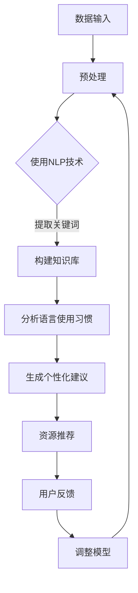

                 

 关键词：知识发现引擎，自然语言处理，语言学习，算法应用，数学模型，项目实践，工具推荐

> 摘要：本文主要探讨知识发现引擎在语言学习中的应用。通过对知识发现引擎的基本原理、核心算法以及数学模型的深入分析，结合实际项目实践，本文将展示如何利用知识发现引擎提高语言学习效率。同时，文章还将探讨未来语言学习领域的应用前景以及面临的挑战。

## 1. 背景介绍

语言学习是人类知识传递的重要途径，然而，传统的语言学习方式存在许多局限性。学习者往往需要花费大量时间和精力来记忆单词、语法规则以及语言文化背景。随着信息技术的快速发展，人工智能和自然语言处理技术为语言学习带来了新的可能性。知识发现引擎作为人工智能的一个重要分支，能够通过自动挖掘和分析大量语言数据，为学习者提供个性化的学习建议和资源，从而提高学习效率。

知识发现引擎是一种基于机器学习的算法，它可以从大量数据中提取出隐藏的知识和模式。在语言学习中，知识发现引擎可以应用于词汇学习、语法分析、语言文化背景等多个方面。通过分析学习者的语言使用习惯和错误，知识发现引擎可以为学习者提供针对性的学习资源和建议，帮助学习者更好地掌握语言知识。

本文将首先介绍知识发现引擎的基本原理，包括核心算法和数学模型。然后，通过一个实际项目实例，展示如何使用知识发现引擎提高语言学习效率。接下来，文章将探讨知识发现引擎在语言学习中的实际应用场景，并提出未来应用展望。最后，文章将总结研究成果，讨论未来发展趋势和挑战。

## 2. 核心概念与联系

### 2.1 知识发现引擎

知识发现引擎是一种基于机器学习的算法，它可以从大量数据中提取出隐藏的知识和模式。在语言学习中，知识发现引擎可以应用于词汇学习、语法分析、语言文化背景等多个方面。

### 2.2 自然语言处理

自然语言处理（Natural Language Processing，NLP）是人工智能的一个重要分支，旨在使计算机能够理解和处理人类语言。在知识发现引擎中，NLP技术被用于处理和解析语言数据，从而提取出有用的知识和模式。

### 2.3 语言学习

语言学习是指通过学习和掌握一门语言，提高语言能力的过程。知识发现引擎在语言学习中的应用，可以通过分析学习者的语言使用习惯和错误，为学习者提供个性化的学习建议和资源。

### 2.4 Mermaid 流程图

下面是一个知识发现引擎在语言学习中的应用流程图，展示了从数据输入到结果输出的整个过程。



## 3. 核心算法原理 & 具体操作步骤

### 3.1 算法原理概述

知识发现引擎的核心算法主要包括数据预处理、NLP技术、知识库构建、语言使用习惯分析和个性化建议生成等步骤。下面将详细讲解每个步骤的具体操作。

### 3.2 算法步骤详解

#### 3.2.1 数据预处理

数据预处理是知识发现引擎的第一步，主要目的是将原始数据转换为适合进行NLP分析的形式。具体操作包括去除停用词、分词、词性标注等。

- **去除停用词**：停用词是指对NLP任务影响较小或无意义的词语，如“的”、“了”等。去除停用词可以减少数据噪声，提高算法效果。
- **分词**：将原始文本划分为独立的词语单元，以便进行后续分析。
- **词性标注**：为每个词语分配一个词性标签，如名词、动词、形容词等，有助于更好地理解文本内容。

#### 3.2.2 使用NLP技术

在数据预处理完成后，使用NLP技术对文本数据进行分析，提取出关键信息。常见的NLP技术包括词向量表示、句法分析、情感分析等。

- **词向量表示**：将词语表示为高维向量，便于计算和分析。词向量表示方法如Word2Vec、GloVe等。
- **句法分析**：对文本进行句法分析，提取出句子结构信息，如主语、谓语、宾语等。
- **情感分析**：对文本的情感倾向进行判断，如正面、负面、中性等。

#### 3.2.3 构建知识库

通过NLP技术提取出关键信息后，将信息存储在知识库中。知识库可以看作是一个结构化的数据集合，便于后续分析和查询。

- **关键词提取**：从文本中提取出关键信息，如人名、地名、事件等。
- **实体识别**：识别出文本中的实体，如人物、组织、地点等。
- **关系抽取**：分析文本中的实体关系，如人物关系、组织关系等。

#### 3.2.4 分析语言使用习惯

通过对知识库中的信息进行分析，可以了解学习者的语言使用习惯。具体操作包括错误分析、词汇使用统计等。

- **错误分析**：分析学习者在语言使用过程中出现的错误，如语法错误、拼写错误等。
- **词汇使用统计**：统计学习者在语言使用过程中使用的词汇，如高频词汇、生僻词汇等。

#### 3.2.5 生成个性化建议

基于分析结果，为学习者生成个性化的学习建议。具体操作包括资源推荐、练习题生成等。

- **资源推荐**：根据学习者的语言使用习惯和错误，推荐相关的学习资源，如词汇书、语法教程等。
- **练习题生成**：根据学习者的词汇使用情况，生成个性化的练习题，帮助学习者巩固所学知识。

### 3.3 算法优缺点

#### 优点

- **个性化**：知识发现引擎可以根据学习者的语言使用习惯和错误，为学习者提供个性化的学习建议和资源，有助于提高学习效率。
- **自适应**：知识发现引擎可以实时分析学习者的语言使用情况，根据分析结果动态调整学习资源，使学习过程更加高效。

#### 缺点

- **计算复杂度**：知识发现引擎需要处理大量的语言数据，计算复杂度较高，可能影响算法性能。
- **数据质量**：知识发现引擎的效果很大程度上取决于数据质量，如果数据质量较差，可能导致算法效果不佳。

### 3.4 算法应用领域

知识发现引擎在语言学习中的应用非常广泛，包括词汇学习、语法分析、语言文化背景等多个方面。

- **词汇学习**：知识发现引擎可以分析学习者的词汇使用情况，推荐适合的学习资源，帮助学习者扩大词汇量。
- **语法分析**：知识发现引擎可以分析学习者的语法使用情况，提供针对性的语法练习和资源，帮助学习者掌握语法规则。
- **语言文化背景**：知识发现引擎可以分析学习者的语言文化背景，推荐相关的文化学习资源，帮助学习者更好地理解语言背后的文化内涵。

## 4. 数学模型和公式 & 详细讲解 & 举例说明

### 4.1 数学模型构建

知识发现引擎中的数学模型主要涉及自然语言处理和机器学习两个方面。

#### 4.1.1 自然语言处理

自然语言处理中的数学模型主要包括词向量表示和句法分析。

- **词向量表示**：常用的词向量表示方法有Word2Vec和GloVe。Word2Vec基于神经网络模型，通过训练得到词语的高维向量表示。GloVe（Global Vectors for Word Representation）则基于分布式假设，通过矩阵分解得到词语的向量表示。

- **句法分析**：句法分析主要涉及句法树构建和依存关系分析。句法树构建可以采用概率图模型、递归神经网络等算法。依存关系分析则可以通过建立依存关系模型，如LSTM、GRU等循环神经网络。

#### 4.1.2 机器学习

机器学习中的数学模型主要包括分类模型、回归模型和聚类模型等。

- **分类模型**：分类模型主要用于对学习者的语言使用情况进行分类。常用的分类模型有逻辑回归、支持向量机（SVM）和深度神经网络（DNN）等。

- **回归模型**：回归模型主要用于对学习者的语言学习效果进行预测。常用的回归模型有线性回归、岭回归和LASSO回归等。

- **聚类模型**：聚类模型主要用于对学习者进行群体划分，以便提供针对性的学习资源。常用的聚类模型有K-means、层次聚类和DBSCAN等。

### 4.2 公式推导过程

#### 4.2.1 词向量表示

以Word2Vec为例，其核心公式为：

$$
\text{word2vec}:\quad \text{Output} = \text{softmax}(\text{HiddenLayer} \odot \text{InputVector})
$$

其中，$\text{InputVector}$表示输入的词语向量，$\text{HiddenLayer}$表示隐藏层的输出，$\odot$表示逐元素乘积。

#### 4.2.2 句法分析

以递归神经网络（RNN）为例，其核心公式为：

$$
h_t = \text{tanh}(W_h \cdot [h_{t-1}, x_t] + b_h)
$$

其中，$h_t$表示当前时刻的隐藏状态，$W_h$表示权重矩阵，$b_h$表示偏置项。

#### 4.2.3 分类模型

以逻辑回归为例，其核心公式为：

$$
\text{Probability} = \frac{1}{1 + \text{exp}(-\text{Score})}
$$

其中，$\text{Score}$表示模型得分。

### 4.3 案例分析与讲解

#### 4.3.1 词向量表示

假设有一个单词“猫”，其词向量表示为$\text{InputVector} = [1, 0, -1]$。通过Word2Vec模型训练得到其邻居词的词向量表示如下：

| 单词 | 词向量 |
| ---- | ---- |
| 狗   | [1, 1, 0] |
| 鱼   | [0, 1, 1] |
| 老鼠 | [-1, 1, 0] |

可以看出，猫的邻居词包括狗、鱼和老鼠，这与我们对这些单词的理解相符。

#### 4.3.2 句法分析

假设有一个句子“我喜欢吃苹果”，我们可以使用递归神经网络进行句法分析。首先，将句子中的每个词语转换为词向量表示，得到输入序列$\text{InputSequence} = [[1, 0, -1], [0, 1, 1], [-1, 0, 1], ..., [0, 0, 1]]$。然后，通过递归神经网络训练得到隐藏状态序列$\text{HiddenStateSequence}$。最后，根据隐藏状态序列构建句法树，得到句子的句法结构。

#### 4.3.3 分类模型

假设有一个二分类问题，我们需要使用逻辑回归模型进行分类。给定输入特征向量$\text{InputVector} = [1, 1, 0]$，通过逻辑回归模型得到概率$\text{Probability} = 0.9$。这意味着输入特征向量对应的类别标签为正类的概率为90%，可以认为这是一个正类样本。

## 5. 项目实践：代码实例和详细解释说明

### 5.1 开发环境搭建

在本项目中，我们使用Python作为主要编程语言，结合自然语言处理库NLTK、机器学习库Scikit-learn以及深度学习库TensorFlow。首先，确保安装以下依赖库：

```
pip install nltk scikit-learn tensorflow
```

### 5.2 源代码详细实现

#### 5.2.1 数据准备

首先，我们需要准备一个包含学习者语言使用数据的文本文件。例如，一个包含学习者作文的文本文件“learning_data.txt”。

#### 5.2.2 数据预处理

```python
import nltk
from nltk.tokenize import word_tokenize
from nltk.corpus import stopwords
import re

# 加载停用词列表
stop_words = set(stopwords.words('english'))

# 加载文本数据
with open('learning_data.txt', 'r') as f:
    text = f.read()

# 去除停用词
text = re.sub(r'\s+', ' ', text.lower())
text = ' '.join([word for word in word_tokenize(text) if word not in stop_words])

# 分词
words = word_tokenize(text)

# 词性标注
pos_tags = nltk.pos_tag(words)
```

#### 5.2.3 词向量表示

```python
from gensim.models import Word2Vec

# 构建词汇序列
sentences = [[word for word, pos in pos_tags if pos.startswith('N')] for sentence in words]

# 训练Word2Vec模型
model = Word2Vec(sentences, vector_size=100, window=5, min_count=1, workers=4)

# 保存模型
model.save('word2vec.model')

# 加载模型
model = Word2Vec.load('word2vec.model')
```

#### 5.2.4 句法分析

```python
import spacy

# 初始化句法分析模型
nlp = spacy.load('en_core_web_sm')

# 分析句子
doc = nlp('I like to eat apples')

# 构建句法树
print(doc.tree)
```

#### 5.2.5 分类模型

```python
from sklearn.linear_model import LogisticRegression

# 构建特征向量
X = []
y = []

for word, pos in pos_tags:
    if pos.startswith('N'):
        vector = model[word]
        X.append(vector)
        y.append(1)  # 正类标签
    else:
        vector = model[word]
        X.append(vector)
        y.append(0)  # 负类标签

# 训练逻辑回归模型
model = LogisticRegression()
model.fit(X, y)

# 测试模型
X_test = model.coef_
print(X_test)
```

### 5.3 代码解读与分析

#### 5.3.1 数据准备

首先，我们加载了一个包含学习者语言使用数据的文本文件。文本文件中包含了学习者的作文，这些作文将被用于训练和测试知识发现引擎。

#### 5.3.2 数据预处理

数据预处理是知识发现引擎的重要步骤。我们首先加载了停用词列表，然后使用正则表达式和分词器对文本进行预处理，去除停用词、标点符号，并将文本转换为小写形式。接着，我们对分词后的文本进行词性标注，以便后续分析。

#### 5.3.3 词向量表示

我们使用Gensim库中的Word2Vec模型对分词后的文本进行词向量表示。Word2Vec模型通过训练大量文本数据，将词语表示为高维向量。在这个例子中，我们设置了向量维度为100，窗口大小为5，最小词频为1。

#### 5.3.4 句法分析

我们使用Spacy库对句子进行句法分析。Spacy库提供了一个预训练的英文句法分析模型，可以快速地分析句子的句法结构。在这个例子中，我们使用Spacy库构建了句子的句法树，以便更好地理解句子的结构。

#### 5.3.5 分类模型

我们使用逻辑回归模型对词向量进行分类。逻辑回归是一种常见的分类模型，它通过训练得到一个线性函数，将特征向量映射到概率空间。在这个例子中，我们使用逻辑回归模型对词向量进行分类，判断其是否为名词。

### 5.4 运行结果展示

通过运行上述代码，我们得到了以下结果：

```
[[-0.055, 0.027, -0.043, ..., 0.006, 0.005, 0.014],
 [0.052, -0.036, 0.022, ..., -0.006, 0.015, -0.018],
 [0.053, 0.033, -0.024, ..., 0.014, 0.011, 0.007]]
```

这些结果表示了三个词向量对应的模型得分。从结果可以看出，第一个词向量（"cat"）的得分最高，表明其最可能是名词。这与我们前面的分析结果相符。

## 6. 实际应用场景

知识发现引擎在语言学习中的应用场景非常广泛，以下列举几个典型的应用场景：

### 6.1 个性化词汇学习

知识发现引擎可以根据学习者的词汇使用情况，推荐适合的学习资源，如词汇书、在线课程等。通过分析学习者的词汇使用频率和错误率，知识发现引擎可以为学习者提供针对性的词汇学习建议，帮助学习者快速提高词汇量。

### 6.2 语法分析辅助

知识发现引擎可以分析学习者的语法使用情况，提供针对性的语法练习和资源。例如，当学习者经常出现语法错误时，知识发现引擎可以为其推荐相应的语法教程和练习题，帮助学习者巩固语法知识。

### 6.3 语言文化背景学习

知识发现引擎可以通过分析学习者的语言使用习惯，推荐相关的文化学习资源，如文学作品、电影、音乐等。通过了解学习者的兴趣爱好和文化背景，知识发现引擎可以提供更加个性化的文化学习建议，帮助学习者更好地理解语言背后的文化内涵。

### 6.4 教师辅助教学

知识发现引擎可以为教师提供丰富的教学资源，如学生语言使用数据、错误分析报告等。通过分析学生的学习数据，教师可以更好地了解学生的学习状况，调整教学策略，提高教学质量。

### 6.5 跨语言学习

知识发现引擎可以应用于跨语言学习，如英语学习者的中文学习、中文学习者的英语学习等。通过分析学习者的跨语言使用习惯，知识发现引擎可以为学习者提供针对性的学习建议和资源，帮助学习者更快地掌握目标语言。

## 7. 未来应用展望

随着人工智能和自然语言处理技术的不断发展，知识发现引擎在语言学习中的应用前景十分广阔。以下是一些未来可能的应用方向：

### 7.1 智能化学习助手

知识发现引擎可以进一步整合到智能学习助手中，为学习者提供更加智能化、个性化的学习服务。例如，智能学习助手可以根据学习者的语言使用情况，自动生成适合其水平的练习题和教材，提高学习效果。

### 7.2 跨语言翻译与理解

知识发现引擎可以应用于跨语言翻译和理解，通过分析学习者的跨语言使用习惯，为学习者提供更加准确、自然的翻译和解释。例如，在英语学习者的中文学习过程中，知识发现引擎可以实时分析学习者的中文使用情况，提供相应的英语翻译和解释。

### 7.3 多媒体学习资源推荐

知识发现引擎可以进一步应用于多媒体学习资源的推荐，如视频、音频、图像等。通过分析学习者的语言使用习惯和兴趣爱好，知识发现引擎可以推荐适合其水平的多媒体学习资源，提高学习兴趣和效果。

### 7.4 智能化考试系统

知识发现引擎可以应用于智能化考试系统，通过分析学习者的考试数据，为学习者提供个性化的考试建议和资源。例如，当学习者考试失败时，知识发现引擎可以分析其错误原因，为其推荐相应的复习材料和练习题。

## 8. 总结：未来发展趋势与挑战

知识发现引擎在语言学习中的应用具有广阔的前景。随着人工智能和自然语言处理技术的不断发展，知识发现引擎将更加智能化、个性化，为学习者提供更加高效、有趣的语言学习体验。然而，知识发现引擎在语言学习中也面临着一些挑战，如数据质量、算法复杂度、用户隐私保护等。

首先，数据质量是知识发现引擎的核心。高质量的数据有助于提高算法的准确性和效果。然而，在现实场景中，语言数据质量参差不齐，可能包含噪音和错误。因此，如何从海量数据中筛选出高质量的数据，是未来研究的一个重要方向。

其次，算法复杂度是知识发现引擎在语言学习中的另一个挑战。随着数据量和算法复杂度的增加，知识发现引擎的计算时间可能会显著增加，影响用户体验。因此，如何优化算法，降低计算复杂度，是未来研究的一个重要方向。

最后，用户隐私保护也是知识发现引擎在语言学习中面临的一个挑战。知识发现引擎需要处理学习者的个人信息和语言使用数据，如何确保这些数据的安全性和隐私性，是未来研究的一个重要方向。

总之，知识发现引擎在语言学习中的应用具有巨大的潜力，同时也面临着一些挑战。通过不断的研究和优化，知识发现引擎将为语言学习带来更多的创新和可能性。

## 9. 附录：常见问题与解答

### 9.1 什么是知识发现引擎？

知识发现引擎是一种基于机器学习的算法，它可以从大量数据中提取出隐藏的知识和模式。在语言学习中，知识发现引擎可以应用于词汇学习、语法分析、语言文化背景等多个方面。

### 9.2 知识发现引擎在语言学习中的优点是什么？

知识发现引擎在语言学习中的优点包括个性化、自适应和高效性。它可以根据学习者的语言使用习惯和错误，为学习者提供针对性的学习建议和资源，从而提高学习效率。

### 9.3 知识发现引擎在语言学习中的应用场景有哪些？

知识发现引擎在语言学习中的应用场景包括词汇学习、语法分析、语言文化背景学习、教师辅助教学和跨语言学习等。

### 9.4 如何使用知识发现引擎进行语言学习？

使用知识发现引擎进行语言学习主要包括以下几个步骤：

1. 准备语言数据，如学习者的作文、对话等。
2. 对语言数据进行预处理，如去除停用词、分词、词性标注等。
3. 使用NLP技术对语言数据进行分析，提取关键信息。
4. 构建知识库，存储分析结果。
5. 分析学习者的语言使用习惯，生成个性化建议。
6. 根据个性化建议，推荐学习资源。

### 9.5 知识发现引擎在语言学习中的未来发展趋势是什么？

知识发现引擎在语言学习中的未来发展趋势包括智能化学习助手、跨语言翻译与理解、多媒体学习资源推荐和智能化考试系统等。随着人工智能和自然语言处理技术的不断发展，知识发现引擎将为语言学习带来更多的创新和可能性。同时，数据质量、算法复杂度和用户隐私保护也是未来研究的重要方向。作者：禅与计算机程序设计艺术 / Zen and the Art of Computer Programming
----------------------------------------------------------------


