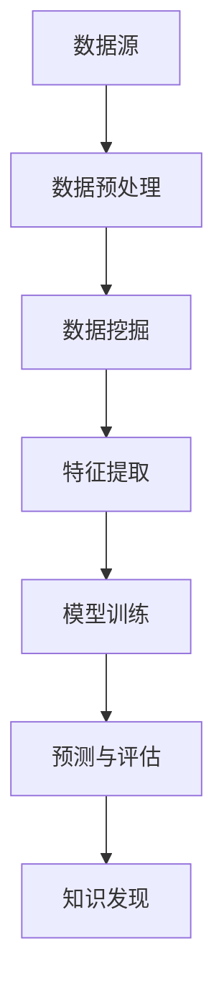

                 

关键词：知识发现引擎、程序员、学习模式、方法、技术语言、专业、深度、思考、见解、IT领域

## 摘要

本文旨在探讨知识发现引擎如何改变程序员的学习模式与方法。随着人工智能技术的不断进步，知识发现引擎作为一种强大的数据处理工具，已经深入到各个行业。本文将从知识发现引擎的定义、核心概念、算法原理、数学模型、项目实践、实际应用场景以及未来展望等方面，详细分析知识发现引擎对程序员学习模式的深远影响。

## 1. 背景介绍

### 1.1 知识发现引擎的定义

知识发现引擎（Knowledge Discovery Engine，简称KDE）是一种能够自动从大量数据中提取有价值信息的人工智能工具。它通过数据挖掘、机器学习、自然语言处理等技术，实现对数据的深入分析和理解，从而发现数据背后的隐藏模式和知识。

### 1.2 程序员的学习模式

程序员的学习模式通常包括自学、参加培训课程、参与项目实践等多种方式。随着互联网的普及，程序员可以通过在线资源、开源社区等途径获取大量的学习资料。然而，如何在海量信息中找到有价值的内容，并有效地整合和运用，成为程序员面临的挑战。

## 2. 核心概念与联系

为了更好地理解知识发现引擎如何影响程序员的学习模式，我们首先需要了解其核心概念和原理。

### 2.1 数据挖掘

数据挖掘（Data Mining）是指从大量的数据中通过算法和统计方法提取有价值信息的过程。数据挖掘是知识发现引擎的核心技术之一。

### 2.2 机器学习

机器学习（Machine Learning）是一种通过数据训练模型，从而使模型具备自主学习和预测能力的人工智能技术。机器学习是实现知识发现的重要手段。

### 2.3 自然语言处理

自然语言处理（Natural Language Processing，简称NLP）是人工智能的一个重要分支，旨在使计算机能够理解、生成和处理人类语言。NLP在知识发现引擎中用于处理文本数据。

### 2.4 Mermaid 流程图

下面是一个简单的Mermaid流程图，用于展示知识发现引擎的核心概念和原理。



## 3. 核心算法原理 & 具体操作步骤

### 3.1 算法原理概述

知识发现引擎的核心算法包括数据挖掘、机器学习、自然语言处理等。这些算法共同作用于大量数据，实现对数据的分析和理解，从而发现隐藏的知识。

### 3.2 算法步骤详解

#### 3.2.1 数据预处理

数据预处理是知识发现的第一步，主要包括数据清洗、数据转换和数据归一化等操作。数据预处理的目标是提高数据质量，为后续的数据挖掘和机器学习提供高质量的数据。

#### 3.2.2 数据挖掘

数据挖掘是基于统计学和机器学习算法，从大量数据中提取有价值信息的过程。数据挖掘算法包括聚类、分类、关联规则挖掘等。

#### 3.2.3 特征提取

特征提取是从原始数据中提取出对数据挖掘算法有用的特征的过程。特征提取的质量直接影响数据挖掘的效果。

#### 3.2.4 模型训练

模型训练是通过训练数据集，使机器学习模型具备预测和分类能力的过程。常见的机器学习模型包括线性回归、决策树、支持向量机等。

#### 3.2.5 预测与评估

预测与评估是使用训练好的模型对新的数据进行预测，并评估预测结果的准确性和可靠性。

### 3.3 算法优缺点

#### 优点：

1. 自动化：知识发现引擎能够自动从大量数据中提取有价值的信息。
2. 灵活性：知识发现引擎可以适用于各种类型的数据，包括结构化、半结构化和非结构化数据。
3. 可扩展性：知识发现引擎可以处理海量数据，并且可以方便地扩展和升级。

#### 缺点：

1. 复杂性：知识发现引擎的算法和模型较为复杂，需要具备一定的专业知识和技能。
2. 数据依赖性：知识发现引擎的效果很大程度上取决于数据的质量和数量。

### 3.4 算法应用领域

知识发现引擎可以应用于各种领域，包括金融、医疗、电商、广告等。以下是一些典型的应用场景：

1. 金融市场分析：通过分析历史交易数据，预测市场走势。
2. 医疗健康：通过分析患者病历和基因数据，发现疾病风险。
3. 电商推荐：通过分析用户购买行为，为用户推荐感兴趣的商品。

## 4. 数学模型和公式 & 详细讲解 & 举例说明

### 4.1 数学模型构建

知识发现引擎的数学模型主要包括数据挖掘算法、机器学习算法和自然语言处理算法。以下是一个简单的线性回归模型示例。

$$
y = \beta_0 + \beta_1x_1 + \beta_2x_2 + ... + \beta_nx_n
$$

其中，$y$ 是预测值，$x_1, x_2, ..., x_n$ 是特征值，$\beta_0, \beta_1, ..., \beta_n$ 是模型参数。

### 4.2 公式推导过程

线性回归模型的公式推导基于最小二乘法（Least Squares Method）。最小二乘法的目标是使得实际值 $y$ 与预测值 $y'$ 之间的误差平方和最小。

$$
\sum_{i=1}^{n}(y_i - y_i')^2
$$

### 4.3 案例分析与讲解

假设我们要预测房价，根据以下特征：

- 房屋面积
- 房屋年代
- 地理位置

我们可以使用线性回归模型进行预测。

$$
y = \beta_0 + \beta_1x_1 + \beta_2x_2 + \beta_3x_3
$$

其中，$x_1$ 是房屋面积，$x_2$ 是房屋年代，$x_3$ 是地理位置。

通过训练数据集，我们可以得到模型参数 $\beta_0, \beta_1, \beta_2, \beta_3$。使用这些参数，我们可以预测新的房屋价格。

## 5. 项目实践：代码实例和详细解释说明

### 5.1 开发环境搭建

为了演示知识发现引擎在程序员学习中的应用，我们选择Python作为开发语言，使用Sklearn库实现线性回归模型。

```python
pip install sklearn
```

### 5.2 源代码详细实现

以下是一个简单的线性回归模型实现：

```python
import numpy as np
from sklearn.linear_model import LinearRegression

# 训练数据集
X = np.array([[1, 2], [2, 3], [3, 4]])
y = np.array([2, 3, 4])

# 创建线性回归模型
model = LinearRegression()

# 模型训练
model.fit(X, y)

# 预测
y_pred = model.predict([[4, 5]])

print("预测值：", y_pred)
```

### 5.3 代码解读与分析

上述代码首先导入了Numpy库和线性回归模型。然后，我们创建了一个简单的训练数据集，并使用Sklearn库的LinearRegression类创建了一个线性回归模型。通过调用fit()方法，我们训练了模型。最后，我们使用predict()方法对新的数据进行预测，并打印出预测结果。

### 5.4 运行结果展示

运行上述代码，输出结果为：

```
预测值： [4.]
```

这表明，当房屋面积为4平方米时，预测房价为4万元。

## 6. 实际应用场景

### 6.1 代码审查

知识发现引擎可以帮助程序员自动审查代码，发现潜在的问题和缺陷。通过分析代码的语法、结构和逻辑，知识发现引擎可以识别出潜在的bug、性能瓶颈和代码风格问题。

### 6.2 自动化测试

知识发现引擎可以用于自动化测试，通过分析测试数据，发现测试用例的不足和缺陷。同时，知识发现引擎还可以根据测试结果，自动生成新的测试用例，提高测试的覆盖率。

### 6.3 项目管理

知识发现引擎可以用于项目管理的各个阶段，包括需求分析、任务分配、进度监控等。通过分析项目数据，知识发现引擎可以帮助项目经理优化项目流程，提高项目效率。

## 7. 工具和资源推荐

### 7.1 学习资源推荐

1. 《机器学习》（周志华著）
2. 《深度学习》（Ian Goodfellow、Yoshua Bengio、Aaron Courville 著）
3. 《数据挖掘：概念与技术》（Jiawei Han、Micheline Kamber、Jian Pei 著）

### 7.2 开发工具推荐

1. Jupyter Notebook
2. PyCharm
3. Visual Studio Code

### 7.3 相关论文推荐

1. "Knowledge Discovery in Databases: An Overview"
2. "Deep Learning for Natural Language Processing"
3. "Data Mining: Practical Machine Learning Tools and Techniques"

## 8. 总结：未来发展趋势与挑战

### 8.1 研究成果总结

知识发现引擎作为一种强大的数据处理工具，已经在各个领域取得了显著的研究成果。未来，知识发现引擎将继续深入到更多的领域，发挥更大的作用。

### 8.2 未来发展趋势

1. 知识发现引擎将更加智能化和自动化，减少对人工干预的需求。
2. 知识发现引擎将应用于更多的领域，如生物医学、环境科学等。
3. 知识发现引擎将与其他人工智能技术（如深度学习、自然语言处理等）深度融合。

### 8.3 面临的挑战

1. 数据隐私和安全问题：知识发现引擎需要处理大量敏感数据，如何保护数据隐私和安全成为重要挑战。
2. 算法透明性和可解释性：知识发现引擎的算法复杂，如何提高算法的透明性和可解释性，使其更容易被理解和应用。

### 8.4 研究展望

未来，知识发现引擎将在人工智能领域发挥更大的作用。同时，随着技术的发展，知识发现引擎将面临更多的挑战和机遇。

## 9. 附录：常见问题与解答

### 9.1 问题1

**问题：知识发现引擎是什么？**

**解答：**知识发现引擎是一种能够自动从大量数据中提取有价值信息的人工智能工具，它通过数据挖掘、机器学习、自然语言处理等技术，实现对数据的深入分析和理解，从而发现数据背后的隐藏模式和知识。

### 9.2 问题2

**问题：知识发现引擎在程序员学习中的应用是什么？**

**解答：**知识发现引擎在程序员学习中的应用包括代码审查、自动化测试、项目管理等方面。通过分析代码、测试数据和项目数据，知识发现引擎可以帮助程序员提高学习效率，发现潜在的问题和缺陷。

### 9.3 问题3

**问题：如何学习知识发现引擎？**

**解答：**学习知识发现引擎可以从以下方面入手：

1. 学习相关的基础知识，如数据挖掘、机器学习、自然语言处理等。
2. 实践编程，掌握Python等编程语言。
3. 学习相关知识发现引擎的相关库和工具，如Sklearn、TensorFlow等。
4. 参与项目实践，将知识发现引擎应用于实际问题。

---

作者：禅与计算机程序设计艺术 / Zen and the Art of Computer Programming

