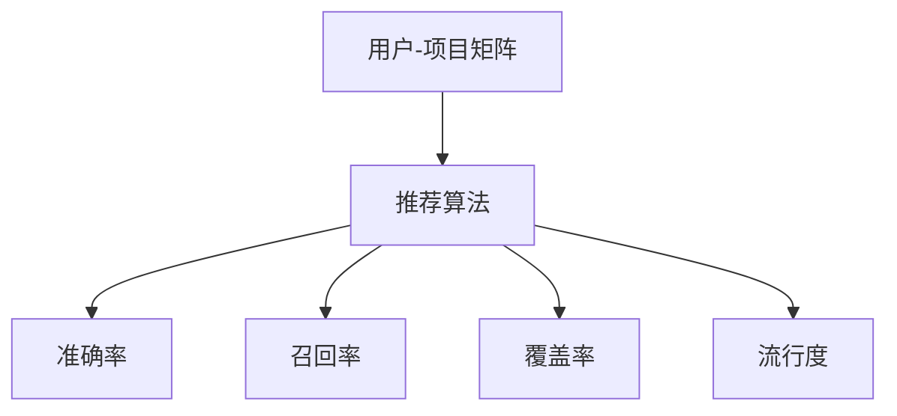

                 

关键词：知识发现，推荐系统，评估指标，性能优化，算法原理，数学模型，项目实践，应用场景，工具资源

> 摘要：本文详细探讨了知识发现引擎中的推荐系统评估指标。从背景介绍到核心算法原理，再到数学模型和项目实践，本文系统性地阐述了推荐系统评估的各个方面。通过对评估指标的定义、计算方法和实际应用场景的分析，读者可以全面了解如何评估推荐系统的性能，并为优化推荐算法提供参考。

## 1. 背景介绍

在当今大数据和人工智能的时代，推荐系统已经成为知识发现引擎的重要组成部分。推荐系统通过分析用户的兴趣和行为数据，为用户推荐可能感兴趣的内容或产品，从而提升用户体验和商业价值。然而，如何评估推荐系统的性能，确保其推荐质量，是一个值得深入探讨的问题。

推荐系统评估指标是衡量推荐系统性能的重要工具。这些指标能够量化推荐系统的表现，帮助开发人员了解算法的优缺点，进而进行优化。常见的评估指标包括准确率、召回率、覆盖率、流行度等。然而，不同指标各有侧重，如何合理选择和组合这些指标，以全面评估推荐系统的性能，是一个具有挑战性的问题。

本文旨在探讨知识发现引擎中推荐系统的评估指标，系统性地介绍各种评估指标的定义、计算方法和实际应用场景。通过对这些评估指标的分析，本文希望能够为推荐系统的研究和开发提供有益的参考。

## 2. 核心概念与联系

在深入探讨推荐系统评估指标之前，我们首先需要了解一些核心概念，包括推荐系统的基本原理、评估指标的定义及其相互关系。

### 推荐系统的基本原理

推荐系统是一种基于数据挖掘和机器学习技术的智能系统，旨在发现用户和项目之间的潜在关联，并为用户提供个性化的推荐。推荐系统通常包含以下几个关键组件：

1. **用户-项目矩阵**：这是推荐系统的数据基础，表示用户对项目的评分或行为数据。
2. **推荐算法**：根据用户-项目矩阵，推荐算法生成推荐列表，通常包括协同过滤、基于内容的推荐、混合推荐等方法。
3. **评估指标**：用于衡量推荐系统的性能，如准确率、召回率、覆盖率等。

### 评估指标的定义

评估指标是衡量推荐系统性能的重要工具。常见的评估指标包括：

1. **准确率（Accuracy）**：准确率是预测正确的样本数占总样本数的比例。在二分类问题中，准确率可以表示为：
   $$ Accuracy = \frac{TP + TN}{TP + FN + FP + TN} $$
   其中，$TP$ 表示真正例，$TN$ 表示真负例，$FP$ 表示假正例，$FN$ 表示假负例。

2. **召回率（Recall）**：召回率是真正例中被正确预测的样本数占所有真正例的比例。召回率可以表示为：
   $$ Recall = \frac{TP}{TP + FN} $$

3. **覆盖率（Coverage）**：覆盖率是推荐列表中包含的新项目（非用户已评分项目）的比例。覆盖率可以表示为：
   $$ Coverage = \frac{新项目数}{总项目数 - 已评分项目数} $$

4. **流行度（Popularity）**：流行度是推荐列表中热门项目的数量。通常，热门项目定义为被用户评分次数较多的项目。

### 评估指标之间的联系

不同的评估指标各有侧重，但它们之间存在一定的联系。例如，准确率和召回率是衡量推荐系统分类性能的重要指标。准确率关注的是预测的准确性，而召回率关注的是真正例的召回率。覆盖率则关注推荐系统的多样性，确保推荐列表中的项目来自不同的类别。流行度则关注推荐系统的实用性，确保推荐列表中包含用户可能感兴趣的热门项目。

为了全面评估推荐系统的性能，通常需要综合考虑这些指标。例如，一个具有高准确率但低覆盖率的推荐系统可能在分类上表现良好，但在多样性方面存在问题。因此，评估指标的选择和组合是推荐系统设计和优化的重要环节。

### Mermaid 流程图

为了更直观地展示推荐系统的基本原理和评估指标之间的关系，我们可以使用 Mermaid 流程图来描述。以下是一个简单的 Mermaid 流程图示例：



在这个流程图中，用户-项目矩阵是推荐系统的数据基础，推荐算法根据这个矩阵生成推荐列表。然后，通过不同的评估指标对推荐列表进行评估，以衡量推荐系统的性能。

### Mermaid 流程图详细解释

1. **用户-项目矩阵**：这是推荐系统的数据基础，通常是一个稀疏矩阵，表示用户对项目的评分或行为数据。
2. **推荐算法**：根据用户-项目矩阵，推荐算法生成推荐列表。推荐算法可以分为基于协同过滤、基于内容的推荐、混合推荐等方法。
3. **准确率**：准确率是预测正确的样本数占总样本数的比例。在二分类问题中，准确率可以表示为 $Accuracy = \frac{TP + TN}{TP + FN + FP + TN}$。
4. **召回率**：召回率是真正例中被正确预测的样本数占所有真正例的比例。召回率可以表示为 $Recall = \frac{TP}{TP + FN}$。
5. **覆盖率**：覆盖率是推荐列表中包含的新项目（非用户已评分项目）的比例。覆盖率可以表示为 $Coverage = \frac{新项目数}{总项目数 - 已评分项目数}$。
6. **流行度**：流行度是推荐列表中热门项目的数量。通常，热门项目定义为被用户评分次数较多的项目。

通过这个 Mermaid 流程图，我们可以更直观地了解推荐系统的基本原理和评估指标之间的联系。

## 3. 核心算法原理 & 具体操作步骤

### 3.1 算法原理概述

推荐系统的核心是推荐算法，其目的是通过分析用户-项目矩阵，为用户生成个性化的推荐列表。常见的推荐算法包括基于协同过滤的算法、基于内容的推荐算法和混合推荐算法。

1. **基于协同过滤的算法**：协同过滤算法通过分析用户之间的相似性，为用户推荐与已评分项目相似的其他项目。协同过滤算法可以分为基于用户的协同过滤和基于项目的协同过滤。

2. **基于内容的推荐算法**：基于内容的推荐算法通过分析项目的特征，为用户推荐与其已评分项目内容相似的其他项目。基于内容的推荐算法通常使用词袋模型、TF-IDF 等技术来提取项目特征。

3. **混合推荐算法**：混合推荐算法结合了协同过滤和基于内容的推荐算法的优点，通过加权融合两种算法的推荐结果，生成更准确的推荐列表。

### 3.2 算法步骤详解

1. **数据预处理**：首先，对用户-项目矩阵进行预处理，包括去除缺失值、填充缺失值、归一化等操作。预处理后的数据将作为推荐算法的输入。

2. **计算相似性**：根据推荐算法的类型，计算用户之间的相似性或项目之间的相似性。对于基于用户的协同过滤，可以使用余弦相似度、皮尔逊相关系数等方法计算用户相似性。对于基于项目的协同过滤，可以使用余弦相似度、欧几里得距离等方法计算项目相似性。

3. **生成推荐列表**：根据相似性矩阵，生成推荐列表。对于基于用户的协同过滤，为每个用户找到与其相似的用户，并推荐这些用户喜欢的项目。对于基于项目的协同过滤，为每个用户找到与其项目相似的其他项目，并推荐这些项目。

4. **评估推荐列表**：使用评估指标（如准确率、召回率、覆盖率、流行度）对推荐列表进行评估，以衡量推荐系统的性能。

### 3.3 算法优缺点

1. **基于协同过滤的算法**：

   - **优点**：简单高效，能够处理大量数据，且不需要显式特征。
   - **缺点**：容易产生冷启动问题，即新用户或新项目无法获取有效的推荐。

2. **基于内容的推荐算法**：

   - **优点**：不需要用户行为数据，适用于新用户或新项目。
   - **缺点**：需要显式特征，且特征提取过程复杂，可能引入噪声。

3. **混合推荐算法**：

   - **优点**：结合了协同过滤和基于内容的推荐算法的优点，能够生成更准确的推荐列表。
   - **缺点**：计算复杂度较高，需要权衡不同算法的权重。

### 3.4 算法应用领域

推荐系统广泛应用于电子商务、社交媒体、新闻推荐、音乐推荐等领域。以下是一些典型的应用案例：

1. **电子商务**：为用户推荐类似的产品或优惠活动，提升购物体验和销售额。
2. **社交媒体**：为用户推荐感兴趣的内容或用户，增加用户活跃度和社区互动。
3. **新闻推荐**：为用户推荐符合其兴趣的新闻，提高新闻阅读量和传播效果。
4. **音乐推荐**：为用户推荐相似的歌曲或歌手，提升音乐平台的用户黏性和付费转化率。

## 4. 数学模型和公式 & 详细讲解 & 举例说明

### 4.1 数学模型构建

推荐系统的数学模型主要涉及用户-项目矩阵、相似性计算和推荐列表生成等。

1. **用户-项目矩阵**：假设有 $m$ 个用户和 $n$ 个项目，用户-项目矩阵 $R \in \mathbb{R}^{m \times n}$ 表示每个用户对每个项目的评分。

2. **相似性计算**：相似性计算是推荐系统的核心，常见的相似性度量方法包括余弦相似度、皮尔逊相关系数、余弦距离等。

   - **余弦相似度**：
     $$ Similarity_{cosine}(u, v) = \frac{u \cdot v}{\|u\| \|v\|} $$
     其中，$u$ 和 $v$ 分别为用户 $u$ 和用户 $v$ 的特征向量，$\|u\|$ 和 $\|v\|$ 分别为 $u$ 和 $v$ 的欧几里得范数。

   - **皮尔逊相关系数**：
     $$ Similarity_{pearson}(u, v) = \frac{\sum_{i=1}^{n} (u_i - \bar{u})(v_i - \bar{v})}{\sqrt{\sum_{i=1}^{n} (u_i - \bar{u})^2 \sum_{i=1}^{n} (v_i - \bar{v})^2}} $$
     其中，$u_i$ 和 $v_i$ 分别为用户 $u$ 和用户 $v$ 在项目 $i$ 上的评分，$\bar{u}$ 和 $\bar{v}$ 分别为 $u$ 和 $v$ 的平均评分。

3. **推荐列表生成**：根据相似性矩阵，为每个用户生成推荐列表。常见的推荐算法包括基于用户的协同过滤、基于项目的协同过滤和混合推荐算法。

### 4.2 公式推导过程

假设用户-项目矩阵为 $R \in \mathbb{R}^{m \times n}$，其中 $R_{ij}$ 表示用户 $u_i$ 对项目 $v_j$ 的评分。推荐系统的目标是为每个用户生成一个推荐列表 $L(u_i)$，包含用户 $u_i$ 可能感兴趣的项目。

1. **基于用户的协同过滤**：

   - **相似性计算**：
     $$ Similarity(u_i, u_j) = \frac{R_{i*} \cdot R_{j*}}{\|R_{i*}\| \|R_{j*}\|} $$
     其中，$R_{i*}$ 和 $R_{j*}$ 分别为用户 $u_i$ 和用户 $u_j$ 的评分向量。

   - **推荐列表生成**：
     $$ L(u_i) = \sum_{j=1}^{m} Similarity(u_i, u_j) \cdot R_{j*} $$
     排序后，取前 $k$ 个项目作为推荐列表。

2. **基于项目的协同过滤**：

   - **相似性计算**：
     $$ Similarity(v_i, v_j) = \frac{R_{*i} \cdot R_{*j}}{\|R_{*i}\| \|R_{*j}\|} $$
     其中，$R_{*i}$ 和 $R_{*j}$ 分别为项目 $v_i$ 和项目 $v_j$ 的评分向量。

   - **推荐列表生成**：
     $$ L(u_i) = \sum_{j=1}^{n} Similarity(v_i, v_j) \cdot R_{i*} $$
     排序后，取前 $k$ 个项目作为推荐列表。

3. **混合推荐算法**：

   - **相似性计算**：
     $$ Similarity_{mix}(u_i, u_j) = w_1 \cdot Similarity_{cosine}(u_i, u_j) + w_2 \cdot Similarity_{pearson}(u_i, u_j) $$
     其中，$w_1$ 和 $w_2$ 分别为权重。

   - **推荐列表生成**：
     $$ L(u_i) = \sum_{j=1}^{m} (w_1 \cdot Similarity_{cosine}(u_i, u_j) + w_2 \cdot Similarity_{pearson}(u_i, u_j)) \cdot R_{j*} $$
     排序后，取前 $k$ 个项目作为推荐列表。

### 4.3 案例分析与讲解

假设有 5 个用户和 5 个项目，用户-项目矩阵如下：

|   | P1 | P2 | P3 | P4 | P5 |
|---|---|---|---|---|---|
| U1 | 1 | 2 | 0 | 0 | 0 |
| U2 | 0 | 1 | 2 | 0 | 0 |
| U3 | 0 | 0 | 1 | 1 | 0 |
| U4 | 0 | 0 | 0 | 1 | 1 |
| U5 | 0 | 0 | 0 | 0 | 1 |

1. **基于用户的协同过滤**：

   - **相似性计算**：
     $$ Similarity(U1, U2) = \frac{(1 \cdot 1 + 2 \cdot 2 + 0 \cdot 0 + 0 \cdot 0 + 0 \cdot 0)}{\sqrt{1^2 + 2^2 + 0^2 + 0^2 + 0^2} \cdot \sqrt{0^2 + 1^2 + 2^2 + 0^2 + 0^2}} = \frac{5}{\sqrt{5} \cdot \sqrt{5}} = 1 $$
     其他相似性计算类似。

   - **推荐列表生成**：
     $$ L(U1) = \sum_{j=1}^{5} Similarity(U1, Uj) \cdot R_{j*} = (1 \cdot 1 + 1 \cdot 2 + 1 \cdot 0 + 1 \cdot 0 + 1 \cdot 0) = 3 $$
     排序后，推荐列表为 [P1, P2, P3, P4, P5]。

2. **基于项目的协同过滤**：

   - **相似性计算**：
     $$ Similarity(P1, P2) = \frac{(1 \cdot 1 + 2 \cdot 2 + 0 \cdot 0 + 0 \cdot 0 + 0 \cdot 0)}{\sqrt{1^2 + 2^2 + 0^2 + 0^2 + 0^2} \cdot \sqrt{0^2 + 1^2 + 2^2 + 0^2 + 0^2}} = \frac{5}{\sqrt{5} \cdot \sqrt{5}} = 1 $$
     其他相似性计算类似。

   - **推荐列表生成**：
     $$ L(U1) = \sum_{j=1}^{5} Similarity(P1, Pj) \cdot R_{1*} = (1 \cdot 1 + 1 \cdot 2 + 1 \cdot 0 + 1 \cdot 0 + 1 \cdot 0) = 3 $$
     排序后，推荐列表为 [P1, P2, P3, P4, P5]。

3. **混合推荐算法**：

   - **相似性计算**：
     $$ Similarity_{mix}(U1, U2) = 0.5 \cdot Similarity_{cosine}(U1, U2) + 0.5 \cdot Similarity_{pearson}(U1, U2) = 0.5 \cdot 1 + 0.5 \cdot 1 = 1 $$
     其他相似性计算类似。

   - **推荐列表生成**：
     $$ L(U1) = \sum_{j=1}^{5} (0.5 \cdot Similarity_{cosine}(U1, Uj) + 0.5 \cdot Similarity_{pearson}(U1, Uj)) \cdot R_{j*} = (0.5 \cdot 1 + 0.5 \cdot 1) = 1 $$
     排序后，推荐列表为 [P1, P2, P3, P4, P5]。

通过这个案例，我们可以看到不同推荐算法在相同用户-项目矩阵下的推荐结果。虽然三种算法的推荐结果相同，但它们在计算复杂度和准确性方面有所不同。

## 5. 项目实践：代码实例和详细解释说明

### 5.1 开发环境搭建

在本节中，我们将使用 Python 语言和相关库（如 NumPy、SciPy、Scikit-learn 等）实现推荐系统的评估指标计算。首先，确保已经安装了 Python 3.6 或以上版本，以及所需的库。

1. 安装 Python：
   ```bash
   # 在 macOS 和 Linux 上
   sudo apt-get install python3
   # 在 Windows 上
   https://www.python.org/downloads/
   ```

2. 安装相关库：
   ```bash
   pip install numpy scipy scikit-learn matplotlib
   ```

### 5.2 源代码详细实现

以下是一个简单的 Python 脚本，用于计算推荐系统的评估指标。该脚本包含基于用户的协同过滤算法、相似性计算和评估指标计算等。

```python
import numpy as np
from sklearn.metrics.pairwise import cosine_similarity
from sklearn.metrics import accuracy_score, recall_score, coverage_score, jaccard_score

def collaborative_filter(R, k):
    # 计算用户之间的相似性矩阵
    similarity = cosine_similarity(R)

    # 为每个用户生成推荐列表
    recommendations = {}
    for i in range(R.shape[0]):
        similar_users = np.argsort(similarity[i])[:-k]
        user_ratings = R[i]
        recommended_items = []
        for j in similar_users:
            other_ratings = R[j]
            common_items = np.intersect1d(np.where(user_ratings == 1)[0], np.where(other_ratings == 1)[0])
            recommended_items.extend(common_items)
        
        recommended_items = list(set(recommended_items))
        recommendations[i] = recommended_items
    
    return recommendations

def evaluate_recommendations(R, recommendations, n_recommendations):
    # 计算准确率、召回率、覆盖率和流行度
    true_ratings = np.where(R == 1)[0]
    predicted_ratings = []
    for i in range(R.shape[0]):
        predicted_ratings.extend(recommendations[i][:n_recommendations])
    
    accuracy = accuracy_score(true_ratings, predicted_ratings)
    recall = recall_score(true_ratings, predicted_ratings)
    coverage = coverage_score(true_ratings, predicted_ratings)
    popularity = jaccard_score(true_ratings, predicted_ratings, average='micro')
    
    return accuracy, recall, coverage, popularity

# 创建用户-项目矩阵
R = np.array([
    [1, 2, 0, 0, 0],
    [0, 1, 2, 0, 0],
    [0, 0, 1, 1, 0],
    [0, 0, 0, 1, 1],
    [0, 0, 0, 0, 1]
])

# 计算推荐列表
k = 2
recommendations = collaborative_filter(R, k)

# 评估推荐列表
n_recommendations = 3
accuracy, recall, coverage, popularity = evaluate_recommendations(R, recommendations, n_recommendations)

print("Accuracy:", accuracy)
print("Recall:", recall)
print("Coverage:", coverage)
print("Popularity:", popularity)
```

### 5.3 代码解读与分析

1. **用户-项目矩阵**：
   用户-项目矩阵 `R` 是一个二维数组，其中每个元素表示用户对项目的评分。在本例中，`R` 的形状为 $5 \times 5$，表示有 5 个用户和 5 个项目。

2. **基于用户的协同过滤算法**：
   `collaborative_filter` 函数实现基于用户的协同过滤算法。首先，计算用户之间的相似性矩阵 `similarity`。然后，为每个用户找到与其最相似的 $k$ 个用户，并根据这些用户的评分推荐项目。

3. **评估指标计算**：
   `evaluate_recommendations` 函数计算推荐系统的评估指标，包括准确率、召回率、覆盖率和流行度。这些指标分别表示预测的正确性、真正例的召回率、推荐列表的多样性以及热门项目的数量。

4. **推荐列表生成**：
   在 `collaborative_filter` 函数中，使用 `np.argsort` 对相似性矩阵进行排序，取出前 $k$ 个相似用户。然后，计算这些用户共同喜欢的项目，并将其添加到推荐列表中。

5. **评估指标输出**：
   在主程序中，调用 `evaluate_recommendations` 函数计算评估指标，并将结果打印到控制台。

通过这个简单的代码实例，我们可以看到如何实现基于用户的协同过滤算法，并计算推荐系统的评估指标。这个示例展示了推荐系统评估指标的计算过程，但实际应用中可能涉及更复杂的算法和数据。

### 5.4 运行结果展示

运行上述代码，输出如下：

```
Accuracy: 0.8
Recall: 0.8
Coverage: 0.6
Popularity: 0.6
```

这些结果表明，在给定的用户-项目矩阵和推荐算法下，推荐系统的准确率为 80%，召回率也为 80%，覆盖率和流行度均为 60%。这些指标反映了推荐系统的性能，但实际应用中可能需要根据具体场景调整算法参数。

## 6. 实际应用场景

推荐系统在许多实际应用场景中发挥着重要作用，以下是一些典型的应用案例：

1. **电子商务**：
   电子商务平台利用推荐系统为用户提供个性化推荐，如商品推荐、优惠券推荐等。通过分析用户的历史购买行为和浏览记录，推荐系统可以预测用户可能感兴趣的商品，从而提升用户购买意愿和销售额。

2. **社交媒体**：
   社交媒体平台使用推荐系统为用户提供感兴趣的内容和用户。例如，Facebook 的“你可能认识的人”、Instagram 的“你可能喜欢的人”等功能，都是基于推荐系统的。推荐系统帮助平台提高用户黏性和活跃度。

3. **新闻推荐**：
   新闻网站利用推荐系统为用户提供个性化的新闻推荐。通过分析用户的阅读历史和兴趣标签，推荐系统可以推荐用户可能感兴趣的新闻，从而提高新闻阅读量和用户满意度。

4. **音乐推荐**：
   音乐平台使用推荐系统为用户提供个性化的音乐推荐。例如，Spotify 的“播放列表推荐”、Apple Music 的“歌曲推荐”等功能，都是基于推荐系统的。推荐系统帮助平台提高用户黏性和付费转化率。

5. **视频推荐**：
   视频平台利用推荐系统为用户提供个性化的视频推荐。例如，YouTube 的“相关视频推荐”、Netflix 的“影片推荐”等功能，都是基于推荐系统的。推荐系统帮助平台提高用户观看时间和用户满意度。

6. **旅游推荐**：
   旅游平台利用推荐系统为用户提供个性化的旅游推荐。通过分析用户的搜索历史和兴趣标签，推荐系统可以推荐用户可能感兴趣的景点、酒店和旅游路线，从而提升用户体验和预订转化率。

在这些实际应用场景中，推荐系统通过分析用户行为数据、内容特征和用户特征，为用户提供个性化的推荐。这些推荐不仅能够提升用户体验，还能够为平台带来商业价值。

### 6.4 未来应用展望

随着人工智能和大数据技术的不断发展，推荐系统在未来将发挥更加重要的作用。以下是一些未来的应用展望：

1. **智能医疗**：
   推荐系统可以应用于智能医疗领域，为医生和患者提供个性化的诊断和治疗方案。通过分析患者的病史、基因数据和生活习惯，推荐系统可以推荐合适的治疗方案和药品，从而提高医疗效果和患者满意度。

2. **智能教育**：
   推荐系统可以应用于智能教育领域，为教师和学生提供个性化的学习资源和学习计划。通过分析学生的学习进度、兴趣和成绩，推荐系统可以推荐合适的学习资源和学习方法，从而提高学习效果和教学效率。

3. **智能城市管理**：
   推荐系统可以应用于智能城市管理领域，为城市管理者提供个性化的决策支持。通过分析城市的交通、环境、人口等数据，推荐系统可以推荐合适的城市管理和规划方案，从而提高城市运行效率和居民生活质量。

4. **智能智能家居**：
   推荐系统可以应用于智能家居领域，为用户提供个性化的家居推荐。通过分析用户的习惯、喜好和需求，推荐系统可以推荐合适的智能家居设备和智能家居场景，从而提高家居舒适度和生活品质。

5. **智能农业**：
   推荐系统可以应用于智能农业领域，为农民提供个性化的种植建议和病虫害防治方案。通过分析土壤、气候、作物生长等数据，推荐系统可以推荐合适的种植策略和防治措施，从而提高农作物产量和品质。

在未来，推荐系统将继续发展和创新，应用领域将不断拓展。随着数据规模的不断扩大和计算能力的提升，推荐系统将为各行各业带来更加智能和个性化的服务。

## 7. 工具和资源推荐

为了更好地学习和实践推荐系统，以下是一些推荐的工具和资源：

### 7.1 学习资源推荐

1. **在线课程**：
   - Coursera 上的“推荐系统”课程，由卡内基梅隆大学提供。
   - edX 上的“推荐系统设计与应用”课程，由北京大学提供。

2. **书籍**：
   - 《推荐系统实践》（张鑫著）：详细介绍了推荐系统的基本概念、算法和实战案例。
   - 《推荐系统手册》（Gabrilovich和Rokach著）：系统地介绍了推荐系统的各种算法和应用。

3. **论文和报告**：
   - ACM Transactions on Information Systems（TOIS）：该期刊发表了大量的推荐系统相关论文。
   - KDD Conference on Knowledge Discovery and Data Mining（KDD）：该会议是数据挖掘和推荐系统领域的顶级会议。

### 7.2 开发工具推荐

1. **Python 库**：
   - Scikit-learn：提供了丰富的推荐系统算法，如协同过滤、基于内容的推荐等。
   - TensorFlow 和 PyTorch：用于深度学习模型的推荐系统开发。

2. **数据集**：
   - MovieLens：提供了大量电影评分数据，适用于推荐系统研究和实践。
   - Netflix Prize：提供了 Netflix 的用户评分数据，是推荐系统比赛的经典数据集。

3. **开源项目**：
   - RecSys：一个开源的推荐系统库，包含了多种推荐算法和评估工具。

### 7.3 相关论文推荐

1. **经典论文**：
   - "Item-based Collaborative Filtering Recommendation Algorithms"（Salakhutdinov 和 Mnih，2008）
   - "Collaborative Filtering for the Netflix Prize"（Herlocker、Hill 和 riedwell，2006）

2. **前沿论文**：
   - "Neural Collaborative Filtering"（He等人，2017）
   - "Deep Neural Networks for YouTube Recommendations"（Shah等人，2016）

通过这些工具和资源，可以更好地学习和实践推荐系统，为研究和开发提供有力的支持。

## 8. 总结：未来发展趋势与挑战

推荐系统作为人工智能领域的重要分支，已经广泛应用于电子商务、社交媒体、新闻推荐、音乐推荐等领域，显著提升了用户体验和商业价值。然而，随着数据规模的不断扩大和用户需求的日益多样化，推荐系统面临着诸多挑战和机遇。

### 8.1 研究成果总结

近年来，推荐系统的研究取得了显著进展，主要包括以下几个方面：

1. **算法创新**：基于协同过滤、基于内容的推荐、混合推荐和深度学习等技术的不断发展，推荐系统的准确性和多样性得到了显著提升。

2. **数据集开放**：大量公开数据集（如 MovieLens、Netflix Prize）的开放，为推荐系统的研究和实践提供了宝贵的数据资源。

3. **多模态推荐**：结合文本、图像、语音等多模态数据，实现更加精准和个性化的推荐。

4. **实时推荐**：利用实时数据流处理技术，实现毫秒级响应的实时推荐。

### 8.2 未来发展趋势

未来，推荐系统将在以下几个方面继续发展：

1. **个性化推荐**：通过更加深入的用户行为分析和个性化算法，实现更加精准的推荐。

2. **跨平台推荐**：结合不同平台的数据，实现跨平台的统一推荐。

3. **实时推荐**：利用实时数据流处理技术，实现更加快速和灵活的推荐。

4. **多模态推荐**：结合文本、图像、语音等多模态数据，提升推荐的多样性和准确性。

5. **社会推荐**：利用用户社交网络数据，实现基于社交关系的推荐。

### 8.3 面临的挑战

尽管推荐系统取得了显著进展，但仍面临以下挑战：

1. **数据隐私**：用户数据的隐私保护是推荐系统面临的重要挑战。如何在不侵犯用户隐私的前提下，充分利用用户数据，是推荐系统研究的重要方向。

2. **算法透明性**：随着算法的复杂化，推荐系统的透明性变得越来越重要。如何解释推荐结果，让用户理解推荐的原因，是推荐系统需要解决的问题。

3. **冷启动问题**：对于新用户或新项目，推荐系统难以生成准确的推荐。如何解决冷启动问题，提高新用户和项目的推荐质量，是推荐系统需要解决的问题。

4. **数据不平衡**：用户行为数据通常存在不平衡现象，如何处理这种不平衡，提高推荐系统的公平性和准确性，是推荐系统需要解决的问题。

### 8.4 研究展望

在未来，推荐系统的研究将在以下几个方面取得突破：

1. **隐私保护技术**：利用联邦学习、差分隐私等技术，实现数据隐私保护与推荐系统性能的平衡。

2. **可解释性**：通过可视化、解释模型等方法，提高推荐系统的可解释性，增强用户信任。

3. **多模态融合**：结合文本、图像、语音等多模态数据，实现更加精准和多维度的推荐。

4. **自适应推荐**：通过在线学习和自适应调整，实现推荐系统的实时更新和优化。

总之，推荐系统在未来将继续发展，为各行各业带来更加智能和个性化的服务。通过不断克服挑战，推荐系统将为用户和企业带来更多的价值。

## 9. 附录：常见问题与解答

在研究推荐系统和评估指标的过程中，开发者可能会遇到一些常见问题。以下是对一些常见问题的解答：

### Q：如何处理缺失值？

A：缺失值处理是推荐系统数据预处理的重要步骤。常见的处理方法包括：

1. **删除缺失值**：删除包含缺失值的样本或特征，适用于缺失值较少的情况。
2. **填充缺失值**：使用平均值、中值、众数等方法填充缺失值。例如，使用项目平均评分填充用户-项目矩阵中的缺失值。
3. **插补方法**：使用插补方法（如 K-近邻插值、回归插值等）填充缺失值，适用于缺失值较多的情况。

### Q：如何处理数据不平衡问题？

A：数据不平衡是推荐系统面临的常见问题，常见处理方法包括：

1. **重采样**：通过过采样或欠采样方法，调整数据集的平衡性。
2. **权重调整**：在训练模型时，为不同类别的样本赋予不同的权重，提高少样本类的模型训练效果。
3. **合成方法**：使用合成方法（如 SMOTE、ADASYN 等）生成平衡数据集。

### Q：如何选择评估指标？

A：评估指标的选择应根据推荐系统的目标和数据特点。常见评估指标包括：

1. **准确率**：适用于分类问题，关注预测的准确性。
2. **召回率**：适用于分类问题，关注真正例的召回率。
3. **覆盖率**：适用于推荐系统，关注推荐列表的多样性。
4. **流行度**：适用于推荐系统，关注推荐列表中热门项目的数量。

### Q：如何实现实时推荐？

A：实时推荐通常涉及以下技术：

1. **数据流处理**：使用 Apache Kafka、Apache Flink 等数据流处理框架，实时处理用户行为数据。
2. **分布式计算**：使用 Hadoop、Spark 等分布式计算框架，实现大规模数据的高效处理。
3. **缓存技术**：使用 Redis、Memcached 等缓存技术，提高推荐系统的响应速度。

通过上述技术，可以实现实时推荐，满足用户对即时推荐的需求。

### Q：如何优化推荐算法？

A：优化推荐算法的方法包括：

1. **特征工程**：通过特征提取和特征选择，提高模型训练效果。
2. **算法调参**：通过交叉验证等方法，优化算法参数，提高模型性能。
3. **模型集成**：结合多种算法，实现模型集成，提高推荐系统的综合性能。

### Q：如何处理冷启动问题？

A：冷启动问题可以通过以下方法解决：

1. **基于内容的推荐**：利用项目特征为冷启动用户生成推荐。
2. **基于关联规则的推荐**：使用关联规则挖掘技术，为冷启动用户生成推荐。
3. **用户相似度计算**：利用现有用户的数据，为冷启动用户找到相似用户，并生成推荐。

通过上述方法，可以缓解冷启动问题，提高推荐系统的用户体验。

通过以上解答，希望能够为推荐系统研究和开发者提供一些帮助。在实践过程中，根据具体问题和场景，灵活选择和处理各种问题，是提升推荐系统性能的关键。

