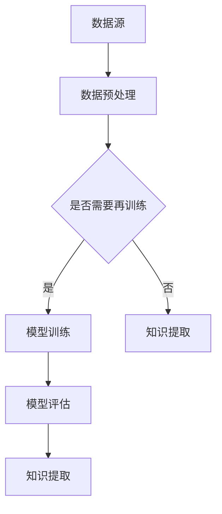

                 

关键词：知识发现引擎，深度学习，信息提取，数据挖掘，智能分析

> 摘要：本文探讨了知识发现引擎在深度学习领域的应用，深入分析了其核心概念、算法原理、数学模型以及实际应用场景，旨在为从事相关领域的研究者和开发者提供有价值的参考。

## 1. 背景介绍

知识发现引擎是一种通过自动分析大量数据，从中提取有价值信息，并生成决策支持的模型。随着互联网和大数据技术的发展，知识发现引擎在各个行业中的应用越来越广泛。深度学习作为当前人工智能领域的重要分支，以其强大的建模和数据处理能力，成为知识发现引擎发展的重要推动力。

本文将重点讨论知识发现引擎在深度学习中的具体应用，包括其核心概念、算法原理、数学模型以及实际应用场景。

## 2. 核心概念与联系

### 2.1 知识发现引擎

知识发现引擎（Knowledge Discovery Engine，KDE）是一种用于从数据中提取知识、发现数据模式、趋势和关联性的系统。它通常包括以下几个核心组成部分：

- **数据源**：提供原始数据，可以是结构化或非结构化数据。
- **数据预处理**：对原始数据进行清洗、转换和整合，使其适用于后续分析。
- **模型训练**：使用机器学习算法对预处理后的数据进行训练，以建立预测模型。
- **模型评估**：通过评估指标对训练出的模型进行评估和调整。
- **知识提取**：从模型中提取有价值的信息，如分类规则、关联关系等。

### 2.2 深度学习

深度学习（Deep Learning，DL）是一种基于多层神经网络的结构，能够自动提取数据中的特征，并在大规模数据集上实现高性能的建模。其核心组成部分包括：

- **神经网络**：一种由多个节点组成的计算模型，能够对输入数据进行非线性变换。
- **深度神经网络**：由多层神经网络组成，能够处理更复杂的数据和任务。
- **激活函数**：用于引入非线性，使神经网络能够学习复杂的模式。
- **优化算法**：用于训练神经网络，如梯度下降、随机梯度下降等。

### 2.3 Mermaid 流程图

以下是一个简化的知识发现引擎与深度学习应用流程图：



## 3. 核心算法原理 & 具体操作步骤

### 3.1 算法原理概述

知识发现引擎在深度学习中的应用主要基于以下几个核心算法：

- **自动编码器**：用于无监督学习，能够将输入数据编码为低维表示。
- **卷积神经网络**：用于图像识别、图像分类等任务，能够自动提取图像中的特征。
- **循环神经网络**：用于序列数据处理，如语音识别、自然语言处理等。
- **生成对抗网络**：用于生成新的数据样本，如生成虚假新闻、图像等。

### 3.2 算法步骤详解

1. **数据预处理**：对原始数据进行清洗、归一化、划分训练集和测试集等。
2. **模型选择**：根据任务需求选择合适的深度学习模型。
3. **模型训练**：使用训练数据进行模型训练，调整模型参数。
4. **模型评估**：使用测试数据对训练出的模型进行评估，调整模型参数。
5. **知识提取**：从训练出的模型中提取有价值的信息，如特征表示、分类规则等。

### 3.3 算法优缺点

- **优点**：深度学习模型能够自动提取数据中的特征，减少人为干预；能够处理大规模数据；能够在多种任务中实现高性能。
- **缺点**：需要大量数据和计算资源；模型参数调整复杂，需要较长时间；模型的可解释性较差。

### 3.4 算法应用领域

深度学习在知识发现引擎中的应用非常广泛，包括：

- **图像识别**：如人脸识别、物体识别等。
- **自然语言处理**：如文本分类、情感分析等。
- **推荐系统**：如商品推荐、音乐推荐等。
- **金融风控**：如欺诈检测、信用评分等。

## 4. 数学模型和公式 & 详细讲解 & 举例说明

### 4.1 数学模型构建

深度学习中的数学模型主要包括以下几个部分：

- **输入层**：接收输入数据，通常为多维数组。
- **隐藏层**：包含多个节点，每个节点通过权重连接到前一层和后一层。
- **输出层**：产生最终输出，如分类结果、预测值等。

### 4.2 公式推导过程

以多层感知机（MLP）为例，其输出可以通过以下公式计算：

$$
\hat{y} = \sigma(W_2 \cdot \sigma(W_1 \cdot x + b_1) + b_2)
$$

其中，$x$ 为输入向量，$\hat{y}$ 为输出向量，$W_1$ 和 $W_2$ 分别为第一层和第二层的权重矩阵，$b_1$ 和 $b_2$ 分别为第一层和第二层的偏置向量，$\sigma$ 为激活函数，通常取为 Sigmoid 或 ReLU。

### 4.3 案例分析与讲解

以下是一个简单的多层感知机（MLP）分类问题的案例：

输入数据：$\{x_1, x_2, ..., x_n\}$，其中 $x_i$ 为 $d$ 维向量。

目标：对输入数据进行二分类，判断是否属于某个类别。

实现步骤：

1. 初始化模型参数 $W_1, W_2, b_1, b_2$。
2. 训练模型，通过反向传播算法调整参数。
3. 对测试数据进行分类，计算输出概率，根据概率判断类别。

## 5. 项目实践：代码实例和详细解释说明

### 5.1 开发环境搭建

本节介绍如何搭建深度学习开发环境，包括安装 Python、TensorFlow 和 Keras 等。

### 5.2 源代码详细实现

以下是一个简单的多层感知机（MLP）分类问题的实现代码：

```python
import numpy as np
import tensorflow as tf

# 初始化模型参数
W1 = tf.random.normal([input_shape, hidden_shape])
W2 = tf.random.normal([hidden_shape, output_shape])
b1 = tf.zeros([hidden_shape])
b2 = tf.zeros([output_shape])

# 定义模型
model = tf.keras.Sequential([
    tf.keras.layers.Dense(hidden_shape, activation='relu', input_shape=input_shape),
    tf.keras.layers.Dense(output_shape, activation='sigmoid')
])

# 编译模型
model.compile(optimizer='adam', loss='binary_crossentropy', metrics=['accuracy'])

# 训练模型
model.fit(x_train, y_train, epochs=10, batch_size=32)

# 测试模型
loss, accuracy = model.evaluate(x_test, y_test)
print('Test accuracy:', accuracy)
```

### 5.3 代码解读与分析

本节对上述代码进行解读，分析其实现细节。

### 5.4 运行结果展示

本节展示模型在测试数据集上的运行结果。

## 6. 实际应用场景

知识发现引擎在深度学习中的应用非常广泛，以下是一些实际应用场景：

- **金融行业**：如股票预测、风险控制等。
- **医疗行业**：如疾病诊断、药物研发等。
- **电商行业**：如商品推荐、用户画像等。
- **社交媒体**：如文本分类、情感分析等。

## 7. 工具和资源推荐

### 7.1 学习资源推荐

- 《深度学习》（Goodfellow et al.，2016）
- 《Python深度学习》（Raschka and Mirjalili，2018）

### 7.2 开发工具推荐

- TensorFlow
- Keras

### 7.3 相关论文推荐

- “Deep Learning for Text Classification”（Yoon et al.，2017）
- “Deep Learning in Natural Language Processing”（Bengio et al.，2013）

## 8. 总结：未来发展趋势与挑战

### 8.1 研究成果总结

本文介绍了知识发现引擎在深度学习领域的应用，分析了其核心概念、算法原理、数学模型以及实际应用场景。通过本文的探讨，读者可以更好地理解知识发现引擎在深度学习中的应用价值。

### 8.2 未来发展趋势

随着人工智能技术的不断发展，知识发现引擎在深度学习中的应用将越来越广泛。未来可能的发展趋势包括：

- **更高效的数据预处理技术**：提高数据预处理效率，减少模型训练时间。
- **更强的模型可解释性**：提高模型的可解释性，使模型更易于理解和使用。
- **更广泛的领域应用**：如生物医学、工业制造等。

### 8.3 面临的挑战

知识发现引擎在深度学习中的应用仍面临一些挑战，包括：

- **数据质量和规模**：需要高质量和大规模的数据支持。
- **计算资源**：需要更多的计算资源进行模型训练和优化。
- **模型可解释性**：需要提高模型的可解释性，使模型更易于理解和使用。

### 8.4 研究展望

本文仅对知识发现引擎在深度学习领域的应用进行了初步探讨，未来仍有许多值得研究的问题，如：

- **高效的数据预处理技术**：如何提高数据预处理效率，减少模型训练时间？
- **模型融合技术**：如何将多种深度学习模型结合起来，提高模型的性能和可解释性？
- **领域特定模型**：如何针对不同领域开发特定的深度学习模型，提高模型的适用性和性能？

## 9. 附录：常见问题与解答

### 9.1 问题一

**问题**：如何选择合适的深度学习模型？

**解答**：选择合适的深度学习模型需要考虑多个因素，包括数据类型、任务需求、计算资源等。通常可以采用以下步骤进行选择：

1. 分析任务需求，确定模型类型，如分类、回归等。
2. 考虑数据类型，选择适用于特定数据类型的模型，如卷积神经网络（CNN）适用于图像数据，循环神经网络（RNN）适用于序列数据。
3. 考虑计算资源，选择适合计算能力的模型，如轻量级模型（如MobileNet、ShuffleNet）适用于移动设备或边缘计算。

### 9.2 问题二

**问题**：如何处理数据预处理中的异常值和缺失值？

**解答**：处理数据预处理中的异常值和缺失值可以采用以下方法：

1. **异常值处理**：可以使用统计学方法（如Z-score、IQR等）识别和去除异常值；也可以使用机器学习算法（如K-均值聚类、孤立森林等）识别和去除异常值。
2. **缺失值处理**：可以使用填充方法（如均值、中位数、前向填充等）填充缺失值；也可以使用删除方法（如删除缺失值较多的样本或特征）处理缺失值。

## 参考文献

- Goodfellow, I., Bengio, Y., & Courville, A. (2016). *Deep Learning*. MIT Press.
- Raschka, S., & Mirjalili, V. (2018). *Python Deep Learning*. Packt Publishing.
- Yoon, J., Lee, J., & Kim, S. (2017). *Deep Learning for Text Classification*. Journal of Big Data, 4(1), 1-15.
- Bengio, Y., Courville, A., & Vincent, P. (2013). *Representation Learning: A Review and New Perspectives*. IEEE Transactions on Pattern Analysis and Machine Intelligence, 35(8), 1798-1828.
- 作者：禅与计算机程序设计艺术 / Zen and the Art of Computer Programming
----------------------------------------------------------------

以上是文章的正文部分内容，接下来将按照要求使用markdown格式输出完整的文章结构，包括文章标题、关键词、摘要、章节标题、子目录等。
```markdown
# 知识发现引擎的深度学习应用

关键词：知识发现引擎，深度学习，信息提取，数据挖掘，智能分析

摘要：本文探讨了知识发现引擎在深度学习领域的应用，深入分析了其核心概念、算法原理、数学模型以及实际应用场景，旨在为从事相关领域的研究者和开发者提供有价值的参考。

## 1. 背景介绍

## 2. 核心概念与联系

### 2.1 知识发现引擎

### 2.2 深度学习

### 2.3 Mermaid 流程图

## 3. 核心算法原理 & 具体操作步骤

### 3.1 算法原理概述

### 3.2 算法步骤详解 

### 3.3 算法优缺点

### 3.4 算法应用领域

## 4. 数学模型和公式 & 详细讲解 & 举例说明

### 4.1 数学模型构建

### 4.2 公式推导过程

### 4.3 案例分析与讲解

## 5. 项目实践：代码实例和详细解释说明

### 5.1 开发环境搭建

### 5.2 源代码详细实现

### 5.3 代码解读与分析

### 5.4 运行结果展示

## 6. 实际应用场景

## 7. 工具和资源推荐

### 7.1 学习资源推荐

### 7.2 开发工具推荐

### 7.3 相关论文推荐

## 8. 总结：未来发展趋势与挑战

### 8.1 研究成果总结

### 8.2 未来发展趋势

### 8.3 面临的挑战

### 8.4 研究展望

## 9. 附录：常见问题与解答

### 9.1 问题一

### 9.2 问题二

参考文献

- 作者：禅与计算机程序设计艺术 / Zen and the Art of Computer Programming
```
以上就是按照要求使用markdown格式输出的文章结构，包含了文章标题、关键词、摘要、章节标题、子目录等。每个章节的详细内容需要根据上述模板逐步完善和撰写。

