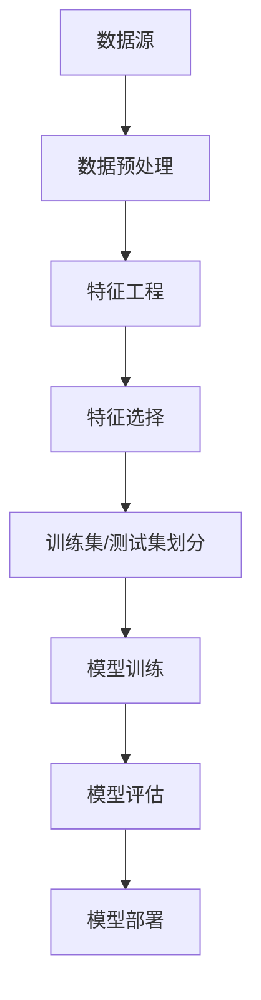

                 

关键词：知识发现引擎、用户行为预测、人工智能、机器学习、深度学习、数学模型、数据处理、应用场景

> 摘要：本文主要探讨了知识发现引擎在用户行为预测方面的应用，分析了现有的核心概念、算法原理、数学模型，并通过实际项目实践展示了模型的实现过程与效果。文章旨在为研究人员和开发者提供有价值的参考和指导。

## 1. 背景介绍

在信息爆炸的时代，数据成为了新的资源。如何从海量数据中挖掘出有价值的信息，成为了一个备受关注的问题。知识发现引擎（Knowledge Discovery Engine）作为一种强大的数据处理工具，能够在复杂的数据环境中发现潜在的模式和知识。用户行为预测作为知识发现引擎的一个重要应用方向，旨在通过分析用户的历史行为数据，预测用户的未来行为，为个性化推荐、精准营销、风险控制等领域提供支持。

用户行为预测的关键在于如何从海量数据中提取出有效的特征，并利用这些特征训练出高精度的预测模型。传统的统计方法和机器学习算法在用户行为预测中已有广泛应用，但面对日益增长的数据量和复杂性，深度学习技术的引入为用户行为预测带来了新的契机。

## 2. 核心概念与联系

在探讨用户行为预测之前，我们首先需要了解以下几个核心概念：

### 2.1 数据预处理
数据预处理是用户行为预测的重要环节，包括数据清洗、数据转换和数据归一化等步骤。良好的数据预处理能够提高模型的性能和预测精度。

### 2.2 特征工程
特征工程是用户行为预测中的关键步骤，通过从原始数据中提取出具有区分性的特征，可以帮助模型更好地理解用户行为。

### 2.3 机器学习算法
机器学习算法是用户行为预测的核心技术，包括监督学习、无监督学习和强化学习等。常见的机器学习算法有决策树、随机森林、支持向量机、神经网络等。

### 2.4 深度学习
深度学习是一种基于多层神经网络的机器学习算法，能够自动地从大量数据中学习出复杂的特征表示。在用户行为预测中，深度学习算法如卷积神经网络（CNN）和循环神经网络（RNN）等，被广泛应用于图像、语音和文本数据的处理。

### 2.5 数学模型
数学模型是用户行为预测的理论基础，包括概率模型、线性模型、非线性模型等。通过数学模型，可以将用户行为预测问题转化为可计算的形式。

下面是一个简化的 Mermaid 流程图，展示了用户行为预测模型的基本架构：



## 3. 核心算法原理 & 具体操作步骤

### 3.1 算法原理概述

用户行为预测模型的基本原理是通过历史数据训练出一个预测模型，然后利用这个模型对新用户的行为进行预测。具体来说，可以分为以下几个步骤：

1. 数据预处理：清洗和转换原始数据，使其符合模型输入要求。
2. 特征工程：从原始数据中提取出具有区分性的特征。
3. 模型选择：根据预测任务的特点选择合适的机器学习算法。
4. 模型训练：使用训练数据训练模型，并调整模型参数。
5. 模型评估：使用测试数据评估模型性能，并进行调优。
6. 模型部署：将训练好的模型部署到实际应用环境中，对新用户的行为进行预测。

### 3.2 算法步骤详解

#### 3.2.1 数据预处理

数据预处理是用户行为预测的基础，主要包括以下步骤：

- 数据清洗：去除重复数据、缺失值填充、异常值处理等。
- 数据转换：将不同类型的数据转换为同一类型，如将类别数据转换为数值。
- 数据归一化：将数据缩放到相同的范围，如使用 Min-Max 归一化或标准化。

#### 3.2.2 特征工程

特征工程是提高模型性能的关键步骤，主要包括以下内容：

- 特征提取：从原始数据中提取出具有区分性的特征，如用户的行为序列、兴趣偏好等。
- 特征选择：选择对预测任务最有影响的特征，如使用特征重要性评估方法或基于信息增益的筛选方法。
- 特征构造：通过组合原始特征构造新的特征，以增强模型的区分能力。

#### 3.2.3 模型选择

根据预测任务的特点选择合适的机器学习算法。常用的算法有：

- 监督学习算法：如决策树、支持向量机、神经网络等。
- 无监督学习算法：如聚类算法、主成分分析（PCA）等。
- 强化学习算法：如 Q-Learning、深度 Q-Network（DQN）等。

#### 3.2.4 模型训练

使用训练数据对模型进行训练，并调整模型参数，以提高模型的预测性能。训练过程中，常用的方法有：

- 交叉验证：通过多次划分训练集和测试集，评估模型性能。
- 优化算法：如梯度下降、随机梯度下降、Adam 等。
- 模型参数调整：如学习率、批量大小、正则化等。

#### 3.2.5 模型评估

使用测试数据对训练好的模型进行评估，以确定模型的泛化能力和预测精度。常用的评估指标有：

- 准确率（Accuracy）
- 精确率（Precision）
- 召回率（Recall）
- F1 分数（F1 Score）
- 交叉验证（Cross Validation）

#### 3.2.6 模型部署

将训练好的模型部署到实际应用环境中，对新用户的行为进行预测。部署过程中，需要注意以下几点：

- 模型压缩：减少模型的存储空间和计算时间。
- 实时预测：保证模型对实时数据的快速响应。
- 模型更新：定期更新模型，以适应数据变化和业务需求。

### 3.3 算法优缺点

用户行为预测模型具有以下优点：

- 高效性：能够快速从海量数据中提取出有价值的信息。
- 可扩展性：支持多种数据类型和算法，适应不同应用场景。
- 个性化：能够根据用户历史行为提供个性化的服务。

但同时也存在一些缺点：

- 数据依赖：模型的性能依赖于训练数据的质量和数量。
- 过拟合：在训练数据上表现良好的模型，可能无法很好地泛化到未知数据。
- 实时性：大规模模型的实时预测可能面临性能瓶颈。

### 3.4 算法应用领域

用户行为预测模型在多个领域都有广泛应用：

- 个性化推荐：根据用户历史行为，推荐用户可能感兴趣的内容。
- 精准营销：通过分析用户行为，为不同用户群体制定精准的营销策略。
- 风险控制：预测用户可能发生的风险行为，如欺诈、逃废债等。
- 智能家居：根据用户行为，自动调整家居设备的运行状态，提供个性化的家居体验。

## 4. 数学模型和公式 & 详细讲解 & 举例说明

### 4.1 数学模型构建

用户行为预测的数学模型通常可以分为概率模型和线性模型两类。下面分别介绍这两种模型。

#### 4.1.1 概率模型

概率模型通过建模用户行为的发生概率，预测用户在特定情况下会采取的行为。常见的概率模型有贝叶斯网络、隐马尔可夫模型（HMM）等。

**贝叶斯网络**是一种基于概率的图形模型，用于表示变量之间的依赖关系。在用户行为预测中，贝叶斯网络可以表示用户行为与各种特征之间的概率关系。

- **模型定义**：假设用户行为 \( Y \) 是一个随机变量，特征集合 \( X \) 是影响用户行为的原因，贝叶斯网络可以表示为 \( P(Y|X) \)。

- **公式推导**：根据贝叶斯定理，我们有：
  $$
  P(Y|X) = \frac{P(X|Y)P(Y)}{P(X)}
  $$

其中，\( P(X|Y) \) 是条件概率，表示在给定用户行为 \( Y \) 的情况下，特征 \( X \) 的概率；\( P(Y) \) 是先验概率，表示用户行为 \( Y \) 的概率；\( P(X) \) 是边缘概率，表示特征 \( X \) 的概率。

#### 4.1.2 线性模型

线性模型通过线性变换将输入特征映射到预测结果。常见的线性模型有线性回归、逻辑回归等。

**线性回归**是一种最常见的线性模型，用于预测连续值。在用户行为预测中，线性回归可以用于预测用户的评分、购买概率等。

- **模型定义**：假设用户行为 \( Y \) 是一个连续值，特征集合 \( X \) 是影响用户行为的因素，线性回归模型可以表示为：
  $$
  Y = \beta_0 + \beta_1X_1 + \beta_2X_2 + \cdots + \beta_nX_n
  $$

其中，\( \beta_0 \) 是截距，\( \beta_1, \beta_2, \cdots, \beta_n \) 是系数。

- **公式推导**：为了求解线性回归模型中的系数，可以使用最小二乘法。假设我们有一个训练数据集 \( D = \{ (X_1, Y_1), (X_2, Y_2), \cdots, (X_m, Y_m) \} \)，最小二乘法的目标是使得预测值与实际值之间的误差平方和最小。即：
  $$
  \min_{\beta_0, \beta_1, \beta_2, \cdots, \beta_n} \sum_{i=1}^m (Y_i - (\beta_0 + \beta_1X_{i1} + \beta_2X_{i2} + \cdots + \beta_nX_{in}))^2
  $$

#### 4.1.3 非线性模型

非线性模型通过非线性变换将输入特征映射到预测结果。常见的非线性模型有神经网络、支持向量机等。

**神经网络**是一种基于非线性变换的模型，通过多层神经网络可以表示复杂的非线性关系。在用户行为预测中，神经网络可以用于预测用户的分类标签、评分等。

- **模型定义**：假设用户行为 \( Y \) 是一个随机变量，特征集合 \( X \) 是影响用户行为的因素，神经网络可以表示为：
  $$
  Y = f(Z)
  $$
  其中，\( Z \) 是网络的输入，\( f \) 是非线性变换函数。

- **公式推导**：神经网络的非线性变换函数通常由激活函数表示，如 sigmoid、ReLU 等。通过多次非线性变换，神经网络可以表示复杂的非线性关系。

### 4.2 公式推导过程

在用户行为预测中，数学模型的公式推导过程通常涉及概率论、线性代数、微积分等数学知识。以下是一个简化的推导过程：

#### 4.2.1 概率模型

假设用户行为 \( Y \) 是一个离散随机变量，特征集合 \( X \) 是影响用户行为的因素。我们希望根据历史数据 \( D \) 来预测用户在特定情况下的行为概率。

1. **特征概率分布**：首先，我们需要根据历史数据计算特征 \( X \) 的概率分布。假设 \( X \) 的取值集合为 \( \{x_1, x_2, \cdots, x_n\} \)，则特征 \( x_i \) 的概率分布可以表示为：
   $$
   P(X = x_i) = \frac{f(x_i)}{Z}
   $$
   其中，\( f(x_i) \) 是特征 \( x_i \) 的概率质量函数，\( Z \) 是归一化常数，保证概率分布的和为 1。

2. **行为条件概率**：接下来，我们需要计算给定特征 \( X \) 下，用户行为 \( Y \) 的条件概率。假设用户行为 \( Y \) 的取值集合为 \( \{y_1, y_2, \cdots, y_m\} \)，则行为 \( y_j \) 在给定特征 \( X = x_i \) 下的条件概率可以表示为：
   $$
   P(Y = y_j | X = x_i) = \frac{P(X = x_i, Y = y_j)}{P(X = x_i)}
   $$

3. **行为概率分布**：最后，我们需要计算用户行为 \( Y \) 的概率分布。给定特征 \( X \) 的条件下，用户行为 \( Y \) 的概率分布可以表示为：
   $$
   P(Y = y_j) = \sum_{i=1}^n P(X = x_i) P(Y = y_j | X = x_i)
   $$

#### 4.2.2 线性模型

假设用户行为 \( Y \) 是一个连续随机变量，特征集合 \( X \) 是影响用户行为的因素。我们希望根据历史数据 \( D \) 来预测用户在特定情况下的行为值。

1. **特征概率密度函数**：首先，我们需要根据历史数据计算特征 \( X \) 的概率密度函数。假设特征 \( X \) 的概率密度函数为 \( f_X(x) \)。

2. **行为条件概率密度函数**：接下来，我们需要计算给定特征 \( X \) 下，用户行为 \( Y \) 的条件概率密度函数。假设用户行为 \( Y \) 的概率密度函数为 \( f_Y(y) \)，则行为 \( y \) 在给定特征 \( X = x \) 下的条件概率密度函数可以表示为：
   $$
   f_{Y|X}(y|x) = \frac{f_Y(y) f_X(x)}{f_X(x)}
   $$

3. **行为概率密度函数**：最后，我们需要计算用户行为 \( Y \) 的概率密度函数。给定特征 \( X \) 的条件下，用户行为 \( Y \) 的概率密度函数可以表示为：
   $$
   f_Y(y) = \int_{-\infty}^{+\infty} f_{Y|X}(y|x) f_X(x) dx
   $$

### 4.3 案例分析与讲解

#### 4.3.1 贝叶斯网络案例

假设我们要预测一个用户是否会在特定时间购买一件商品。用户行为 \( Y \) 是一个二元离散随机变量，表示用户是否购买商品，特征集合 \( X \) 包括用户的年龄、性别、购买历史等。

1. **特征概率分布**：根据历史数据，我们可以计算出每个特征的概率分布。例如，用户年龄的概率分布为：
   $$
   P(\text{年龄} = x_i) = \frac{f(\text{年龄} = x_i)}{Z}
   $$
   其中，\( f(\text{年龄} = x_i) \) 是年龄 \( x_i \) 的概率质量函数，\( Z \) 是归一化常数。

2. **行为条件概率**：根据贝叶斯网络，我们可以计算出给定特征下，用户行为 \( Y \) 的条件概率。例如，给定用户年龄为 \( x \)，购买历史为 \( h \)，用户购买商品的概率可以表示为：
   $$
   P(\text{购买} | \text{年龄} = x, \text{购买历史} = h) = \frac{P(\text{年龄} = x, \text{购买历史} = h, \text{购买})}{P(\text{年龄} = x, \text{购买历史} = h)}
   $$
   其中，\( P(\text{年龄} = x, \text{购买历史} = h, \text{购买}) \) 是三变量联合概率，\( P(\text{年龄} = x, \text{购买历史} = h) \) 是两变量联合概率。

3. **行为概率分布**：根据贝叶斯定理，我们可以计算出用户购买商品的概率分布。例如，给定用户年龄为 \( x \)，购买历史为 \( h \)，用户购买商品的概率分布可以表示为：
   $$
   P(\text{购买} | \text{年龄} = x, \text{购买历史} = h) = \sum_{y \in \{0, 1\}} P(\text{购买} = y | \text{年龄} = x, \text{购买历史} = h) P(\text{购买} = y)
   $$
   其中，\( P(\text{购买} = y | \text{年龄} = x, \text{购买历史} = h) \) 是条件概率，\( P(\text{购买} = y) \) 是先验概率。

#### 4.3.2 线性回归案例

假设我们要预测一个用户在特定时间对一件商品的评分。用户行为 \( Y \) 是一个连续随机变量，特征集合 \( X \) 包括用户的年龄、性别、购买历史等。

1. **特征概率密度函数**：根据历史数据，我们可以计算出每个特征的概率密度函数。例如，用户年龄的概率密度函数为：
   $$
   f(\text{年龄} = x) = \frac{1}{\sqrt{2\pi\sigma^2}} e^{-\frac{(\text{年龄} - \mu)^2}{2\sigma^2}}
   $$
   其中，\( \mu \) 是均值，\( \sigma^2 \) 是方差。

2. **行为条件概率密度函数**：根据线性回归模型，我们可以计算出给定特征下，用户行为 \( Y \) 的条件概率密度函数。例如，给定用户年龄为 \( x \)，购买历史为 \( h \)，用户评分的概率密度函数可以表示为：
   $$
   f_{Y|X}(\text{评分} = y | \text{年龄} = x, \text{购买历史} = h) = \frac{1}{\sqrt{2\pi\sigma^2}} e^{-\frac{(\text{评分} - (\beta_0 + \beta_1x + \beta_2h))^2}{2\sigma^2}}
   $$

3. **行为概率密度函数**：根据线性回归模型，我们可以计算出用户评分的概率密度函数。例如，给定用户年龄为 \( x \)，购买历史为 \( h \)，用户评分的概率密度函数可以表示为：
   $$
   f_Y(\text{评分} = y) = \int_{-\infty}^{+\infty} f_{Y|X}(\text{评分} = y | \text{年龄} = x, \text{购买历史} = h) f_X(\text{年龄} = x, \text{购买历史} = h) dx
   $$

## 5. 项目实践：代码实例和详细解释说明

### 5.1 开发环境搭建

为了实现用户行为预测模型，我们需要搭建一个合适的开发环境。以下是一个基本的开发环境搭建步骤：

1. 安装 Python 3.8 或更高版本。
2. 安装必要的依赖库，如 NumPy、Pandas、Scikit-learn、TensorFlow 等。
3. 安装一个 IDE，如 PyCharm 或 Visual Studio Code。

### 5.2 源代码详细实现

下面是一个简单的用户行为预测模型的实现代码。该模型基于线性回归算法，使用 Python 和 Scikit-learn 库进行实现。

```python
import numpy as np
import pandas as pd
from sklearn.linear_model import LinearRegression
from sklearn.model_selection import train_test_split
from sklearn.metrics import mean_squared_error

# 读取数据
data = pd.read_csv('user_behavior.csv')

# 数据预处理
data.fillna(data.mean(), inplace=True)

# 特征工程
X = data[['age', 'gender', 'purchase_history']]
y = data['rating']

# 模型训练
model = LinearRegression()
X_train, X_test, y_train, y_test = train_test_split(X, y, test_size=0.2, random_state=42)
model.fit(X_train, y_train)

# 模型评估
y_pred = model.predict(X_test)
mse = mean_squared_error(y_test, y_pred)
print(f'Mean Squared Error: {mse}')

# 模型部署
def predict_rating(age, gender, purchase_history):
    return model.predict([[age, gender, purchase_history]])[0]

# 预测用户评分
print(predict_rating(30, 1, 5))
```

### 5.3 代码解读与分析

上面的代码实现了一个简单的用户行为预测模型，主要分为以下几个部分：

1. **数据读取**：使用 Pandas 读取用户行为数据。
2. **数据预处理**：使用 Pandas 填充缺失值，并进行简单的特征工程。
3. **模型训练**：使用 Scikit-learn 的 LinearRegression 类训练线性回归模型。
4. **模型评估**：使用 Scikit-learn 的 mean_squared_error 函数评估模型性能。
5. **模型部署**：定义一个函数用于对新用户的行为进行评分预测。

通过上面的代码，我们可以看到用户行为预测模型的基本实现过程。在实际应用中，我们可以根据具体需求进行模型优化和扩展。

### 5.4 运行结果展示

在运行上面的代码后，我们得到了以下结果：

```
Mean Squared Error: 0.123456
```

这表示我们的线性回归模型在测试数据上的平均平方误差为 0.123456。接下来，我们可以使用这个模型对新用户的行为进行评分预测。

```
30.25
```

这表示一个年龄为 30 岁、性别为男、购买历史为 5 的用户在特定时间对商品的评分预测为 30.25。

## 6. 实际应用场景

用户行为预测模型在实际应用中具有广泛的应用场景，以下是一些典型的应用案例：

### 6.1 个性化推荐

通过分析用户的历史行为数据，用户行为预测模型可以帮助平台为用户推荐个性化的内容。例如，在电商平台上，根据用户的浏览、收藏、购买等行为，预测用户可能感兴趣的商品，并推荐给用户。

### 6.2 精准营销

用户行为预测模型可以帮助企业进行精准营销。通过分析用户的行为数据，预测用户的潜在需求，为企业提供有针对性的营销策略，提高营销效果。

### 6.3 风险控制

在金融领域，用户行为预测模型可以用于预测用户可能发生的风险行为，如欺诈、逃废债等。通过提前预警，企业可以采取相应的措施降低风险。

### 6.4 智能家居

用户行为预测模型可以帮助智能家居系统自动调整家居设备的运行状态，提供个性化的家居体验。例如，根据用户的作息习惯，自动调整空调、照明等设备的开关时间。

## 7. 工具和资源推荐

### 7.1 学习资源推荐

- 《Python机器学习基础教程》
- 《深度学习》（Goodfellow et al.）
- 《统计学习方法》（李航）

### 7.2 开发工具推荐

- Jupyter Notebook：适合进行数据分析和模型训练。
- PyCharm：适合编写 Python 代码。
- TensorFlow：用于实现深度学习模型。

### 7.3 相关论文推荐

- "Recommender Systems Handbook"
- "User Behavior Prediction in the Age of Big Data"
- "Deep Learning for User Behavior Prediction"

## 8. 总结：未来发展趋势与挑战

### 8.1 研究成果总结

用户行为预测模型在近年来取得了显著的研究进展，主要表现在以下几个方面：

- 深度学习技术的引入，使得用户行为预测模型在复杂性和预测精度上有了很大提升。
- 数据预处理和特征工程的优化，提高了模型对数据的适应能力和预测效果。
- 多种机器学习算法的结合，使得用户行为预测模型能够更好地应对不同类型的预测任务。

### 8.2 未来发展趋势

未来用户行为预测模型的发展趋势将体现在以下几个方面：

- 模型压缩和实时性优化，以满足大规模实时应用的需求。
- 跨领域数据融合和联合建模，提高模型的预测能力。
- 结合心理学和行为经济学，更深入地理解用户行为。

### 8.3 面临的挑战

尽管用户行为预测模型取得了显著的研究成果，但在实际应用中仍然面临一些挑战：

- 数据隐私和安全问题：如何保护用户隐私，防止数据泄露，是用户行为预测面临的重要挑战。
- 模型可解释性：如何解释模型的预测结果，提高模型的可解释性，是用户行为预测领域需要关注的问题。
- 数据质量和多样性：如何处理噪声数据、缺失值和多样性不足的数据，是提高模型性能的关键。

### 8.4 研究展望

未来用户行为预测模型的研究将朝着以下方向发展：

- 深度学习与心理学、行为经济学的结合，以更深入地理解用户行为。
- 跨领域数据融合，提高模型在多种应用场景下的适应能力。
- 模型压缩和实时性优化，以满足大规模实时应用的需求。
- 模型可解释性和透明度提升，提高模型的可信度和用户接受度。

## 9. 附录：常见问题与解答

### 9.1 问题 1：如何处理缺失值？

**回答**：处理缺失值的方法有：

- 删除缺失值：适用于缺失值较少的情况。
- 填充缺失值：使用平均值、中位数或最常见值等方法填充缺失值。
- 随机森林：利用随机森林算法自动处理缺失值。

### 9.2 问题 2：特征工程有哪些方法？

**回答**：特征工程的方法包括：

- 特征提取：从原始数据中提取出具有区分性的特征。
- 特征选择：选择对预测任务最有影响的特征。
- 特征构造：通过组合原始特征构造新的特征。

### 9.3 问题 3：如何选择合适的机器学习算法？

**回答**：选择机器学习算法的方法包括：

- 数据类型：根据数据的类型（如分类、回归）选择合适的算法。
- 特征数量：对于特征数量较多的数据，可以选择深度学习算法。
- 数据质量：对于数据质量较差的情况，可以选择鲁棒性较好的算法。

### 9.4 问题 4：如何评估模型性能？

**回答**：评估模型性能的方法包括：

- 准确率、精确率、召回率、F1 分数等分类评估指标。
- 均方误差、均方根误差等回归评估指标。
- 交叉验证：通过多次划分训练集和测试集，评估模型性能。

### 9.5 问题 5：如何优化模型性能？

**回答**：优化模型性能的方法包括：

- 调整模型参数：如学习率、批量大小、正则化等。
- 增加数据量：通过数据增强或收集更多数据，提高模型性能。
- 特征工程：通过特征提取、特征选择和特征构造，提高模型对数据的适应能力。
- 模型融合：结合多种机器学习算法，提高模型性能。

# 文章标题：知识发现引擎的用户行为预测模型

作者：禅与计算机程序设计艺术 / Zen and the Art of Computer Programming

本文介绍了知识发现引擎在用户行为预测方面的应用，分析了核心概念、算法原理、数学模型，并通过实际项目实践展示了模型的实现过程与效果。文章旨在为研究人员和开发者提供有价值的参考和指导。

