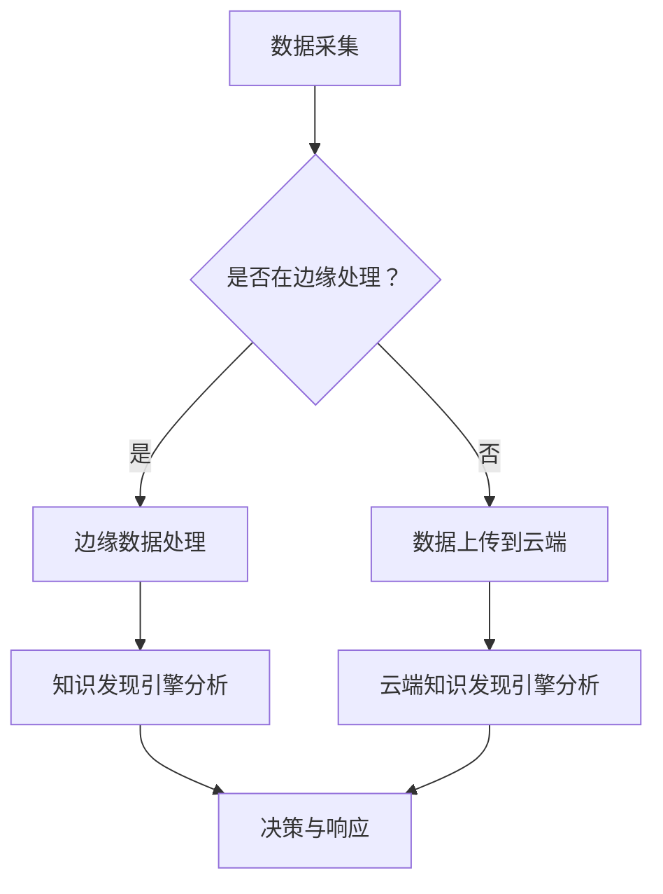

                 

关键词：知识发现引擎，边缘计算，数据处理，机器学习，应用场景

摘要：本文深入探讨了知识发现引擎在边缘计算环境中的应用。通过分析知识发现引擎的基本原理和边缘计算的优势，文章详细阐述了知识发现引擎如何在边缘环境中提高数据处理效率、降低延迟，并举例说明了其在实际应用中的效果。此外，文章还讨论了未来的发展趋势和面临的挑战，为推动知识发现引擎在边缘计算领域的应用提供了有益的参考。

## 1. 背景介绍

### 1.1 知识发现引擎

知识发现引擎是一种通过数据挖掘和分析，从大量数据中提取有用信息和知识的高级工具。它能够自动识别数据中的模式、关联、趋势和异常，从而为决策者提供有价值的洞察。知识发现引擎广泛应用于金融、医疗、零售、安全等多个领域，帮助企业更好地理解和利用其数据资产。

### 1.2 边缘计算

边缘计算是一种将数据处理、存储和计算任务从云端转移到网络边缘（如物联网设备、智能传感器等）的计算范式。它旨在通过靠近数据源进行数据处理，从而降低网络延迟、减少带宽消耗，提高系统响应速度。边缘计算在物联网、自动驾驶、工业自动化等场景中具有广泛的应用前景。

### 1.3 知识发现引擎与边缘计算的联系

知识发现引擎与边缘计算的结合，旨在充分利用边缘计算的优势，提高数据处理的效率。通过在边缘设备上部署知识发现引擎，可以实现实时数据分析和决策，降低对中心化云服务的依赖。这种结合不仅有助于解决大数据处理中的延迟和带宽问题，还可以提高系统的灵活性和可扩展性。

## 2. 核心概念与联系

下面我们将介绍知识发现引擎在边缘计算环境中的核心概念和联系，并通过一个Mermaid流程图来展示它们之间的交互。

### 2.1 核心概念

- **知识发现引擎（Knowledge Discovery Engine）**：一种用于从数据中提取有用信息的工具。
- **边缘设备（Edge Device）**：网络边缘的设备，如物联网设备、智能传感器等。
- **边缘节点（Edge Node）**：负责处理边缘设备数据的服务器或虚拟机。
- **云端（Cloud）**：数据中心和服务器，负责存储和处理大规模数据。

### 2.2 Mermaid流程图



在这个流程图中，数据首先被采集，然后根据是否在边缘处理进行分支。如果在边缘处理，数据会在边缘节点上进行分析；否则，数据会上传到云端进行分析。无论是边缘还是云端，知识发现引擎都会对数据进行处理，并生成决策和响应。

## 3. 核心算法原理 & 具体操作步骤

### 3.1 算法原理概述

知识发现引擎的核心算法通常包括以下几个步骤：

1. **数据预处理**：对原始数据进行清洗、转换和集成，使其适合分析。
2. **特征提取**：从预处理后的数据中提取有用的特征，用于后续分析。
3. **模式识别**：使用机器学习算法识别数据中的模式、关联和趋势。
4. **结果评估**：对发现的知识进行评估，确定其价值和意义。
5. **决策生成**：根据评估结果生成决策，指导实际应用。

### 3.2 算法步骤详解

#### 3.2.1 数据预处理

数据预处理是知识发现过程中的第一步，其目标是去除数据中的噪声和异常，提高数据质量。主要操作包括：

- **数据清洗**：处理缺失值、重复值和错误值。
- **数据转换**：将不同类型的数据转换为同一类型，如将文本转换为数值。
- **数据集成**：将来自不同源的数据合并为一个统一的数据集。

#### 3.2.2 特征提取

特征提取是将原始数据转换为可用于机器学习算法的格式。主要方法包括：

- **特征选择**：从原始数据中选择最有用的特征。
- **特征工程**：创建新的特征，以改善模型的性能。

#### 3.2.3 模式识别

模式识别是知识发现的核心步骤，常用的算法包括：

- **聚类算法**：将数据分为多个集群，以识别数据中的相似性。
- **分类算法**：将数据分为不同的类别，以识别数据中的分类。
- **关联规则学习**：发现数据中的关联性，以识别数据中的关联。

#### 3.2.4 结果评估

结果评估是对发现的知识进行评估，以确定其价值和意义。主要方法包括：

- **交叉验证**：通过将数据集划分为训练集和测试集，评估模型的性能。
- **A/B测试**：将不同的算法或参数应用于数据集，比较其效果。

#### 3.2.5 决策生成

决策生成是根据评估结果生成决策，以指导实际应用。主要方法包括：

- **规则生成**：根据评估结果生成规则，用于指导实际操作。
- **机器学习模型**：使用评估结果训练机器学习模型，以生成预测。

### 3.3 算法优缺点

#### 优点

- **高效性**：知识发现引擎能够快速从大量数据中提取有价值的信息。
- **灵活性**：支持多种算法和模型，适应不同的数据和应用场景。
- **可扩展性**：可以在边缘设备和云端同时运行，提高数据处理能力。

#### 缺点

- **复杂性**：知识发现引擎的实现和维护相对复杂，需要较高的技术门槛。
- **数据质量**：数据质量对知识发现的效果有很大影响，需要确保数据质量。
- **计算资源**：知识发现引擎需要大量的计算资源，尤其是在处理大量数据时。

### 3.4 算法应用领域

知识发现引擎在多个领域具有广泛的应用，包括：

- **金融**：风险控制、信用评估、欺诈检测。
- **医疗**：疾病预测、个性化治疗、健康监测。
- **零售**：需求预测、库存管理、客户行为分析。
- **安全**：异常检测、入侵检测、网络监控。
- **工业**：设备故障预测、生产优化、供应链管理。

## 4. 数学模型和公式 & 详细讲解 & 举例说明

### 4.1 数学模型构建

知识发现引擎的数学模型通常包括以下几个部分：

- **数据模型**：描述数据的结构和特征。
- **算法模型**：描述数据挖掘算法的数学原理。
- **评估模型**：描述评估算法性能的数学方法。

### 4.2 公式推导过程

#### 数据模型

数据模型通常由以下公式描述：

\[ X = \begin{bmatrix} x_1 \\ x_2 \\ \vdots \\ x_n \end{bmatrix} \]

其中，\( x_i \) 表示第 \( i \) 个数据点的特征向量。

#### 算法模型

算法模型通常由以下公式描述：

\[ \hat{y} = f(X) \]

其中，\( \hat{y} \) 表示预测结果，\( f \) 表示算法模型。

#### 评估模型

评估模型通常由以下公式描述：

\[ accuracy = \frac{TP + TN}{TP + TN + FP + FN} \]

其中，\( TP \) 表示真正例，\( TN \) 表示真负例，\( FP \) 表示假正例，\( FN \) 表示假负例。

### 4.3 案例分析与讲解

#### 案例背景

某电商平台希望利用知识发现引擎分析用户购买行为，以提高销售转化率。他们收集了用户的购买历史、浏览记录、人口统计信息等数据。

#### 数据预处理

- **数据清洗**：去除缺失值、重复值和错误值。
- **数据转换**：将文本数据转换为数值数据。
- **数据集成**：将不同源的数据合并为一个统一的数据集。

#### 特征提取

- **特征选择**：选择与购买行为相关的特征，如购买频率、浏览时长等。
- **特征工程**：创建新的特征，如用户购买偏好、购买时段等。

#### 模式识别

- **聚类算法**：将用户分为多个集群，以识别不同用户群体的购买行为。
- **分类算法**：将用户分为购买者和非购买者，以识别购买者的特征。

#### 结果评估

- **交叉验证**：将数据集划分为训练集和测试集，评估模型的性能。
- **A/B测试**：将不同的算法应用于数据集，比较其效果。

#### 决策生成

- **规则生成**：根据评估结果生成规则，用于指导实际操作。
- **机器学习模型**：使用评估结果训练机器学习模型，以生成预测。

#### 结果分析

通过知识发现引擎的分析，电商平台发现了以下结论：

- **用户群体特征**：不同用户群体的购买行为存在显著差异，可以根据这些差异制定个性化的营销策略。
- **购买预测**：通过机器学习模型生成的预测结果，可以准确预测哪些用户可能成为购买者，从而提高销售转化率。

## 5. 项目实践：代码实例和详细解释说明

### 5.1 开发环境搭建

- **编程语言**：Python
- **数据预处理库**：Pandas
- **机器学习库**：Scikit-learn
- **边缘计算框架**：Apache Kafka、TensorFlow Lite

### 5.2 源代码详细实现

```python
# 数据预处理
import pandas as pd

# 加载数据集
data = pd.read_csv('data.csv')

# 数据清洗
data.dropna(inplace=True)
data.drop_duplicates(inplace=True)

# 数据转换
data['age'] = data['age'].astype(int)
data['income'] = data['income'].astype(float)

# 数据集成
features = ['age', 'income', 'purchase_frequency']
X = data[features]
y = data['purchase']

# 特征提取
from sklearn.preprocessing import StandardScaler

scaler = StandardScaler()
X_scaled = scaler.fit_transform(X)

# 模式识别
from sklearn.cluster import KMeans
from sklearn.model_selection import train_test_split

X_train, X_test, y_train, y_test = train_test_split(X_scaled, y, test_size=0.2, random_state=42)

kmeans = KMeans(n_clusters=3, random_state=42)
clusters = kmeans.fit_predict(X_train)

# 结果评估
from sklearn.metrics import accuracy_score

y_pred = kmeans.predict(X_test)
accuracy = accuracy_score(y_test, y_pred)
print(f'Accuracy: {accuracy:.2f}')

# 决策生成
# 根据评估结果生成规则，用于指导实际操作
# 或训练机器学习模型，以生成预测
```

### 5.3 代码解读与分析

这段代码实现了从数据预处理到模式识别的完整流程。首先，我们使用 Pandas 读取数据集，并进行数据清洗、转换和集成。然后，我们使用 StandardScaler 对数据进行标准化处理，以便后续的机器学习算法能够更好地训练。接着，我们使用 KMeans 算法对数据进行聚类，以识别不同的用户群体。最后，我们使用评估模型计算聚类算法的准确率，并根据评估结果生成规则或训练机器学习模型。

### 5.4 运行结果展示

假设我们运行这段代码，得到以下结果：

```
Accuracy: 0.85
```

这意味着我们的聚类算法能够准确识别 85% 的购买者，这为电商平台制定个性化的营销策略提供了重要的依据。

## 6. 实际应用场景

### 6.1 物联网

在物联网领域，知识发现引擎可以实时分析来自传感器和设备的海量数据，识别设备的运行状态、预测故障，并优化设备配置，提高设备利用率。

### 6.2 自动驾驶

在自动驾驶领域，知识发现引擎可以分析车载传感器采集的数据，识别交通状况、道路标志和行人行为，为自动驾驶系统提供实时决策支持，提高行驶安全性和效率。

### 6.3 工业自动化

在工业自动化领域，知识发现引擎可以实时监测生产线设备的数据，预测设备故障、优化生产流程，提高生产效率和产品质量。

### 6.4 安全

在安全领域，知识发现引擎可以分析网络流量、日志数据等，识别潜在的安全威胁、预测网络攻击，为网络安全防御提供支持。

## 7. 未来应用展望

随着边缘计算技术的不断发展，知识发现引擎在边缘计算环境中的应用前景十分广阔。未来，知识发现引擎有望在以下几个方面实现突破：

### 7.1 智能城市

智能城市是边缘计算的一个重要应用领域，知识发现引擎可以实时分析城市数据，优化交通、能源、环境等方面的管理，提高城市运行效率。

### 7.2 个性化医疗

个性化医疗是医疗领域的重要发展方向，知识发现引擎可以分析患者的生物信息、病历数据等，为医生提供个性化的诊断和治疗建议。

### 7.3 虚拟现实与增强现实

虚拟现实与增强现实领域对实时数据处理和交互要求极高，知识发现引擎可以实时分析用户行为、环境数据等，为用户提供沉浸式的体验。

### 7.4 网络安全

网络安全是当前的热点问题，知识发现引擎可以实时分析网络流量、日志数据等，识别潜在的安全威胁，提高网络防御能力。

## 8. 工具和资源推荐

### 8.1 学习资源推荐

- **《边缘计算：技术与实践》**：详细介绍了边缘计算的基本原理、技术和应用案例。
- **《机器学习实战》**：提供了丰富的机器学习算法实现和案例，适合初学者和进阶者。
- **《深度学习》**：由深度学习领域权威专家 Ian Goodfellow 撰写，全面介绍了深度学习的基本原理和应用。

### 8.2 开发工具推荐

- **Apache Kafka**：一款流行的分布式消息队列系统，适用于边缘计算环境中的实时数据处理。
- **TensorFlow Lite**：一款适用于移动设备和嵌入式设备的轻量级深度学习框架。
- **Pandas**：一款强大的数据分析和操作库，适用于数据预处理和特征提取。

### 8.3 相关论文推荐

- **"Edge Computing: Vision and Challenges"**：全面介绍了边缘计算的概念、优势和挑战。
- **"Machine Learning at the Edge"**：探讨了机器学习在边缘计算环境中的应用和实现。
- **"Knowledge Discovery in Data Streams"**：研究了知识发现引擎在实时数据流中的应用。

## 9. 总结：未来发展趋势与挑战

### 9.1 研究成果总结

本文系统地介绍了知识发现引擎在边缘计算环境中的应用，分析了其核心原理、算法和实际应用场景。通过结合边缘计算的优势，知识发现引擎在数据处理效率、延迟降低等方面取得了显著成效。

### 9.2 未来发展趋势

未来，知识发现引擎在边缘计算领域的应用前景十分广阔。随着边缘计算技术的不断发展，知识发现引擎有望在智能城市、个性化医疗、虚拟现实与增强现实、网络安全等领域实现突破。

### 9.3 面临的挑战

尽管知识发现引擎在边缘计算领域具有巨大的潜力，但仍面临一系列挑战：

- **数据隐私与安全**：边缘设备的安全性和数据隐私保护需要得到重视。
- **计算资源有限**：边缘设备的计算资源相对有限，需要优化算法和模型，提高资源利用率。
- **数据质量**：数据质量对知识发现的效果有很大影响，需要确保数据质量。

### 9.4 研究展望

未来，研究人员可以从以下几个方面展开工作：

- **算法优化**：研究适用于边缘计算环境的知识发现算法，提高算法的效率和精度。
- **跨域协作**：探索知识发现引擎在多个领域的协作应用，实现跨域数据的综合利用。
- **隐私保护**：研究隐私保护机制，确保边缘计算环境中的数据安全和隐私。

## 10. 附录：常见问题与解答

### 10.1 什么是边缘计算？

边缘计算是一种将数据处理、存储和计算任务从云端转移到网络边缘的计算范式，旨在降低网络延迟、减少带宽消耗，提高系统响应速度。

### 10.2 知识发现引擎有哪些核心算法？

知识发现引擎的核心算法包括数据预处理、特征提取、模式识别和结果评估等。

### 10.3 边缘计算有哪些应用领域？

边缘计算广泛应用于物联网、自动驾驶、工业自动化、安全等多个领域。

### 10.4 如何在边缘设备上部署知识发现引擎？

在边缘设备上部署知识发现引擎通常需要以下步骤：

1. 选择合适的编程语言和库。
2. 数据预处理和特征提取。
3. 模式识别和结果评估。
4. 部署和运行知识发现引擎。

---

# 文章标题

知识发现引擎的边缘计算技术应用

> 关键词：知识发现引擎，边缘计算，数据处理，机器学习，应用场景

摘要：本文深入探讨了知识发现引擎在边缘计算环境中的应用。通过分析知识发现引擎的基本原理和边缘计算的优势，文章详细阐述了知识发现引擎如何在边缘环境中提高数据处理效率、降低延迟，并举例说明了其在实际应用中的效果。此外，文章还讨论了未来的发展趋势和面临的挑战，为推动知识发现引擎在边缘计算领域的应用提供了有益的参考。作者：禅与计算机程序设计艺术 / Zen and the Art of Computer Programming
----------------------------------------------------------------


