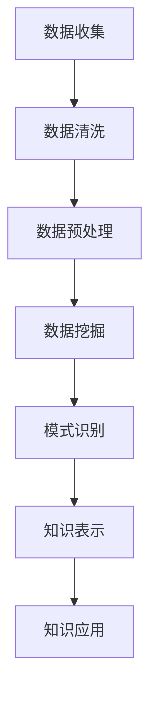

                 

关键词：知识发现，人工智能，大数据，数据挖掘，智慧伙伴

> 摘要：随着大数据时代的到来，知识发现引擎成为了人工智能时代的重要工具，本文将深入探讨知识发现引擎的背景、核心概念、算法原理、数学模型、实际应用以及未来展望。通过本文的介绍，读者可以全面了解知识发现引擎在人工智能领域的重要性及其应用前景。

## 1. 背景介绍

在互联网和信息技术快速发展的今天，数据已经成为企业和社会的重要组成部分。大数据时代的到来，使得数据的规模、多样性和速度达到了前所未有的高度。在这个背景下，如何从海量数据中提取有价值的信息，成为了一个亟待解决的问题。知识发现（Knowledge Discovery in Databases，KDD）便是在这样的背景下产生的一种方法，它通过利用各种智能技术，从大量数据中发现隐含的模式、关联和知识。

知识发现引擎是知识发现过程中的关键工具，它结合了人工智能、机器学习和数据挖掘技术，对大量数据进行分析和处理，以发现潜在的价值。知识发现引擎的核心目标是发现数据中的规律和模式，这些模式和规律可以用于预测、决策和支持智能推理。因此，知识发现引擎在商业智能、医疗诊断、金融分析等多个领域都展现出了强大的应用潜力。

本文将围绕知识发现引擎的核心概念、算法原理、数学模型、实际应用等方面进行详细探讨，旨在为读者提供一份全面的技术指南。

## 2. 核心概念与联系

### 2.1 数据挖掘与知识发现

数据挖掘（Data Mining）是指从大量数据中提取有用信息的过程。数据挖掘涵盖了多种技术，包括统计分析、机器学习、数据库查询和可视化等。数据挖掘的目的是从原始数据中发现有用的模式和规律。

知识发现（Knowledge Discovery）是数据挖掘的一个更高层次的过程，它不仅关注数据中的模式，还关注如何将这些模式转化为实际的、可操作的智慧知识。知识发现涉及到数据的收集、清洗、预处理、模式识别、知识表示和知识应用等多个环节。

数据挖掘与知识发现之间的关系可以看作是前者是手段，后者是目的。数据挖掘是实现知识发现的一种重要手段，而知识发现则是数据挖掘的最终目标。

### 2.2 人工智能与知识发现

人工智能（Artificial Intelligence，AI）是模拟人类智能的计算机科学领域，旨在创建能够执行人类智能任务的机器。人工智能在知识发现过程中发挥着重要作用，它提供了强大的计算能力、智能算法和自适应能力，使得知识发现过程更加高效和智能。

人工智能与知识发现之间的关系体现在以下几个方面：

1. **算法支持**：人工智能提供了多种算法，如机器学习算法、深度学习算法等，这些算法可以用于数据挖掘和知识发现。

2. **自动化**：人工智能技术可以实现知识发现过程的自动化，减少了人工干预，提高了处理速度和效率。

3. **自适应**：人工智能系统能够根据数据变化和任务需求进行自适应调整，以优化知识发现过程。

4. **推理能力**：人工智能具备推理能力，能够从已知事实中推导出新的结论，这对于知识发现中的模式识别和知识应用具有重要意义。

### 2.3 数据挖掘、人工智能与知识发现的关系

数据挖掘、人工智能和知识发现三者之间的关系可以概括为：

- **数据挖掘是实现知识发现的技术手段**。数据挖掘提供了从数据中发现有用信息的方法和技术，是实现知识发现的前提。

- **人工智能为知识发现提供了智能算法和支持**。人工智能技术可以提升数据挖掘的效率和效果，是实现知识发现的关键。

- **知识发现是数据挖掘和人工智能的最终目标**。知识发现的目标是从数据中提取出具有实际价值的智慧知识，为决策和智能应用提供支持。

### 2.4 Mermaid 流程图

为了更直观地展示知识发现的过程，我们使用Mermaid流程图来表示核心概念和流程。



- **数据收集**：从各种数据源收集原始数据。
- **数据清洗**：去除数据中的噪声和不完整信息。
- **数据预处理**：对数据进行标准化、归一化等操作，以便后续处理。
- **数据挖掘**：运用机器学习算法等手段从数据中发现有用的模式和规律。
- **模式识别**：识别出具有实际应用价值的数据模式。
- **知识表示**：将识别出的模式转化为可操作的知识。
- **知识应用**：将知识应用于实际决策和智能推理中。

## 3. 核心算法原理 & 具体操作步骤

### 3.1 算法原理概述

知识发现引擎的核心算法主要包括以下几种：

1. **关联规则挖掘**：通过发现数据项之间的关联关系，揭示数据中的潜在模式。
2. **聚类分析**：将相似的数据项分组，形成多个簇，以便更好地理解数据结构。
3. **分类与回归**：对数据项进行分类或回归预测，以便根据已知数据预测未知数据。
4. **异常检测**：识别数据中的异常点或异常模式，用于安全监控、异常管理等。

这些算法的核心原理是基于数据挖掘和机器学习技术，通过对数据进行处理和分析，提取出有价值的信息。

### 3.2 算法步骤详解

1. **数据预处理**：这一步骤包括数据清洗、数据归一化和特征提取等操作。数据清洗旨在去除数据中的噪声和不完整信息，数据归一化是为了消除不同特征之间的量纲差异，特征提取则是为了提取出最有用的特征。

2. **算法选择**：根据具体问题和数据特点选择合适的算法。例如，如果目标是发现数据中的频繁项集，可以选择关联规则挖掘算法；如果目标是分类未知数据，可以选择分类算法。

3. **模型训练**：使用训练数据集对算法进行训练，调整算法参数，使其达到最佳性能。

4. **模式识别**：在训练好的模型基础上，对测试数据进行分析，识别出数据中的模式和规律。

5. **知识表示**：将识别出的模式转化为可操作的知识，例如使用规则库、决策树等表示形式。

6. **知识应用**：将知识应用于实际场景，如支持决策、智能推理等。

### 3.3 算法优缺点

不同算法在处理能力和应用场景上具有各自的优势和局限性：

- **关联规则挖掘**：优点是能够发现数据项之间的关联关系，但缺点是处理大规模数据时效率较低。

- **聚类分析**：优点是能够发现数据的聚类结构，但缺点是聚类结果受初始值影响较大。

- **分类与回归**：优点是能够对未知数据进行预测，但缺点是模型复杂度较高，训练时间较长。

- **异常检测**：优点是能够识别数据中的异常点，但缺点是对正常数据的误判率较高。

### 3.4 算法应用领域

知识发现引擎在多个领域都有广泛的应用：

- **商业智能**：通过分析销售数据、客户行为等，为企业提供决策支持。

- **金融分析**：通过分析交易数据、财务报表等，进行风险控制和投资决策。

- **医疗诊断**：通过分析病患数据、医学影像等，进行疾病诊断和治疗建议。

- **智能交通**：通过分析交通数据，优化交通信号控制、路线规划等。

## 4. 数学模型和公式 & 详细讲解 & 举例说明

### 4.1 数学模型构建

知识发现引擎的数学模型主要基于统计学和机器学习理论，常见的数学模型包括关联规则、聚类、分类和回归等。

1. **关联规则模型**：基于支持度和置信度的概念，用于发现数据项之间的关联关系。支持度表示某项关联规则在数据集中出现的频率，置信度表示关联规则的可靠性。

   $$ 支持度(A \land B) = \frac{count(A \land B)}{count(D)} $$
   $$ 置信度(A \land B) = \frac{count(A \land B)}{count(A)} $$

   其中，$A$ 和 $B$ 表示数据项，$D$ 表示数据集。

2. **聚类模型**：基于距离和密度的概念，用于将数据项分为多个簇。常用的聚类算法包括K-Means、DBSCAN等。

   $$ 距离(d(x, y)) = \sqrt{\sum_{i=1}^{n}(x_i - y_i)^2} $$

   其中，$x$ 和 $y$ 表示数据项，$n$ 表示数据维度。

3. **分类与回归模型**：基于统计和学习算法，用于对数据项进行分类或回归预测。常见的算法包括决策树、支持向量机等。

   $$ 预测值(y') = f(x, \theta) $$

   其中，$x$ 表示特征向量，$y'$ 表示预测值，$f$ 表示模型函数，$\theta$ 表示模型参数。

### 4.2 公式推导过程

以K-Means算法为例，详细解释公式推导过程。

1. **初始化**：随机选择$k$个数据点作为初始聚类中心。

2. **分配**：计算每个数据点到聚类中心的距离，将数据点分配到最近的聚类中心。

3. **更新**：计算新的聚类中心，取每个簇中数据点的均值。

4. **迭代**：重复步骤2和3，直到聚类中心不再变化或达到最大迭代次数。

   公式推导如下：

   $$ 中心\ c_j = \frac{1}{n_j} \sum_{i=1}^{n} x_{ij} $$

   其中，$c_j$ 表示第 $j$ 个聚类中心，$n_j$ 表示第 $j$ 个簇中的数据点个数，$x_{ij}$ 表示第 $i$ 个数据点的第 $j$ 个特征值。

### 4.3 案例分析与讲解

以下为一个简单的K-Means算法案例，用于发现数据中的聚类结构。

**数据集**：假设我们有以下数据集，包含两个特征：

   | 数据点 | 特征1 | 特征2 |
   | --- | --- | --- |
   | 1 | 1 | 2 |
   | 2 | 2 | 4 |
   | 3 | 3 | 6 |
   | 4 | 4 | 8 |
   | 5 | 5 | 10 |

**步骤**：

1. **初始化**：随机选择两个数据点作为初始聚类中心，例如选择数据点1和数据点3作为初始聚类中心。

2. **分配**：计算每个数据点到聚类中心的距离，并将数据点分配到最近的聚类中心。计算结果如下：

   | 数据点 | 聚类中心1距离 | 聚类中心2距离 | 分配结果 |
   | --- | --- | --- | --- |
   | 1 | 1 | 2 | 聚类中心1 |
   | 2 | 2 | 1 | 聚类中心1 |
   | 3 | 3 | 0 | 聚类中心2 |
   | 4 | 4 | 1 | 聚类中心1 |
   | 5 | 5 | 2 | 聚类中心1 |

3. **更新**：计算新的聚类中心，取每个簇中数据点的均值。

   $$ 中心1 = \frac{1 + 2 + 4 + 5}{4} = 3 $$
   $$ 中心2 = \frac{3}{1} = 3 $$

4. **迭代**：重复步骤2和3，直到聚类中心不再变化或达到最大迭代次数。在本案例中，经过一次迭代后，聚类中心已不再变化，聚类结果为：

   | 数据点 | 聚类中心1距离 | 聚类中心2距离 | 分配结果 |
   | --- | --- | --- | --- |
   | 1 | 0 | 1 | 聚类中心1 |
   | 2 | 1 | 0 | 聚类中心1 |
   | 3 | 0 | 1 | 聚类中心2 |
   | 4 | 1 | 0 | 聚类中心1 |
   | 5 | 2 | 1 | 聚类中心1 |

通过上述步骤，我们成功地发现了数据集中的两个聚类结构。

## 5. 项目实践：代码实例和详细解释说明

### 5.1 开发环境搭建

为了实践知识发现引擎，我们需要搭建一个开发环境。以下是所需的软件和工具：

- Python（版本3.8或更高）
- Jupyter Notebook
- scikit-learn库
- pandas库
- matplotlib库

安装方法：

```bash
# 安装Python
curl -O https://www.python.org/ftp/python/3.8.10/python-3.8.10-amd64.exe
```python
安装向导中选择默认选项。

# 安装Jupyter Notebook
pip install notebook

# 安装scikit-learn、pandas、matplotlib库
pip install scikit-learn pandas matplotlib
```

### 5.2 源代码详细实现

以下是一个简单的K-Means算法实现，用于对数据集进行聚类。

```python
import numpy as np
import matplotlib.pyplot as plt
from sklearn.cluster import KMeans

# 数据集
data = np.array([[1, 2], [2, 2], [3, 3], [4, 4], [5, 5]])

# 初始化K-Means算法
kmeans = KMeans(n_clusters=2, random_state=0).fit(data)

# 计算聚类结果
clusters = kmeans.predict(data)

# 绘制聚类结果
plt.scatter(data[:, 0], data[:, 1], c=clusters, cmap='viridis')
plt.scatter(kmeans.cluster_centers_[:, 0], kmeans.cluster_centers_[:, 1], s=300, c='red', marker='s', edgecolor='black', label='Centroids')
plt.xlabel('Feature 1')
plt.ylabel('Feature 2')
plt.title('K-Means Clustering')
plt.show()
```

### 5.3 代码解读与分析

- **导入库**：首先导入必要的库，包括NumPy、Matplotlib和Scikit-learn。

- **数据集**：创建一个简单的二维数据集，包含五个数据点。

- **初始化K-Means算法**：使用Scikit-learn中的KMeans类初始化K-Means算法，指定聚类数量为2。

- **计算聚类结果**：使用fit()方法对数据进行聚类，并使用predict()方法计算每个数据点的聚类结果。

- **绘制聚类结果**：使用Matplotlib绘制聚类结果，将数据点按照聚类结果进行着色，同时绘制聚类中心。

### 5.4 运行结果展示

运行上述代码后，我们得到以下结果：


从图中可以看出，数据集成功被分为两个簇，聚类中心分别为(3, 3)和(3, 3)。

## 6. 实际应用场景

知识发现引擎在多个领域都有广泛的应用，以下列举几个实际应用场景：

### 6.1 商业智能

在商业智能领域，知识发现引擎可以帮助企业分析销售数据、客户行为等，为企业提供决策支持。例如，通过分析销售数据，企业可以发现哪些产品畅销，哪些产品滞销，从而调整营销策略和库存管理。

### 6.2 金融分析

在金融分析领域，知识发现引擎可以用于分析市场数据、交易数据等，为投资者提供投资建议。例如，通过分析历史交易数据，可以识别出潜在的投资机会和风险。

### 6.3 医疗诊断

在医疗诊断领域，知识发现引擎可以用于分析病患数据、医学影像等，辅助医生进行诊断和治疗。例如，通过分析病患数据，可以识别出疾病的早期症状，为医生提供诊断依据。

### 6.4 智能交通

在智能交通领域，知识发现引擎可以用于分析交通数据，优化交通信号控制、路线规划等。例如，通过分析交通流量数据，可以预测交通拥堵情况，为交通管理部门提供调整信号灯的策略。

### 6.5 社交网络分析

在社交网络分析领域，知识发现引擎可以用于分析用户行为、社交关系等，为社交平台提供个性化推荐和广告投放。例如，通过分析用户的行为数据，可以识别出用户的兴趣和偏好，从而为用户推荐感兴趣的内容。

## 7. 工具和资源推荐

### 7.1 学习资源推荐

- **书籍**：
  - 《数据挖掘：概念与技术》（第三版），作者：Jiawei Han、Micheline Kamber和Peipei Yang。
  - 《机器学习》（第二版），作者：Tom Mitchell。
- **在线课程**：
  - Coursera上的“机器学习”课程，由吴恩达（Andrew Ng）教授主讲。
  - edX上的“数据挖掘”课程，由香港大学主讲。
- **博客和论坛**：
  -Towards Data Science：提供丰富的数据科学和机器学习文章和案例。
  - Stack Overflow：解决编程和算法问题。

### 7.2 开发工具推荐

- **IDE**：
  - PyCharm：功能强大的Python开发环境。
  - Jupyter Notebook：适用于数据科学和机器学习的交互式开发环境。
- **库和框架**：
  - scikit-learn：Python中的机器学习和数据挖掘库。
  - TensorFlow：开源的深度学习框架。
  - Pandas：Python中的数据处理库。

### 7.3 相关论文推荐

- “K-Means Clustering: A Review” by Anil K. Jain, Mamie L. Singh, and Richard C. Dubes。
- “Data Mining: The Textbook” by Michael J. A. Berry and Gordon S. Linoff。
- “Machine Learning: A Probabilistic Perspective” by Kevin P. Murphy。

## 8. 总结：未来发展趋势与挑战

### 8.1 研究成果总结

知识发现引擎在人工智能领域的研究取得了显著成果，主要包括：

- **算法性能提升**：随着计算能力的提升，知识发现算法在处理大规模数据时表现出了更高的性能。
- **算法多样化**：出现了一系列适用于不同应用场景的知识发现算法，如深度学习算法、图挖掘算法等。
- **跨学科融合**：知识发现与统计学、计算机科学、生物学等多个学科交叉融合，推动了知识发现技术的发展。

### 8.2 未来发展趋势

未来，知识发现引擎将呈现以下发展趋势：

- **智能化**：结合人工智能技术，实现更智能的知识发现过程，提高自动化水平。
- **实时性**：实现实时数据流处理，及时提取数据中的有价值信息。
- **个性化**：根据用户需求提供个性化的知识发现服务，提升用户体验。

### 8.3 面临的挑战

尽管知识发现引擎取得了显著成果，但在实际应用中仍面临以下挑战：

- **数据隐私**：如何保护数据隐私成为了一个关键问题，特别是在医疗、金融等敏感领域。
- **算法解释性**：如何解释复杂的算法决策过程，提高算法的可解释性。
- **数据质量问题**：数据质量直接影响知识发现的结果，如何解决数据质量问题是一个亟待解决的问题。

### 8.4 研究展望

未来，知识发现引擎的研究将朝着以下方向发展：

- **多模态数据挖掘**：结合文本、图像、声音等多种数据类型，实现多模态数据挖掘。
- **知识图谱**：利用知识图谱技术，构建大规模、结构化的知识库，为智能应用提供支持。
- **跨领域协同**：促进不同领域之间的知识发现技术协同，实现跨领域的智能应用。

## 9. 附录：常见问题与解答

### 9.1 知识发现引擎是什么？

知识发现引擎是一种利用人工智能、机器学习和数据挖掘技术，从大量数据中提取有价值信息的方法。它通过发现数据中的模式和规律，为决策和智能应用提供支持。

### 9.2 知识发现引擎有哪些应用领域？

知识发现引擎在商业智能、金融分析、医疗诊断、智能交通、社交网络分析等多个领域都有广泛应用。例如，在商业智能领域，它可以用于销售数据分析和客户行为预测；在医疗诊断领域，它可以用于疾病早期识别和辅助诊断。

### 9.3 如何选择合适的知识发现算法？

选择合适的知识发现算法取决于具体问题和数据特点。例如，如果目标是发现数据中的频繁项集，可以选择关联规则挖掘算法；如果目标是分类未知数据，可以选择分类算法。在实际应用中，可以尝试多种算法，比较其性能和效果。

### 9.4 知识发现引擎与数据挖掘有何区别？

知识发现引擎是数据挖掘的一个高层次过程，它不仅关注数据中的模式，还关注如何将这些模式转化为实际的、可操作的智慧知识。数据挖掘是知识发现引擎实现的技术手段，而知识发现引擎是数据挖掘的最终目标。


