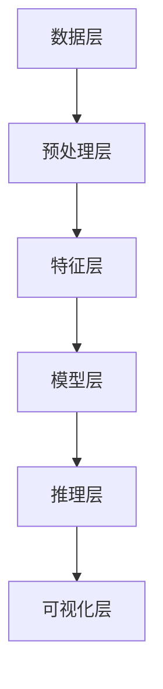
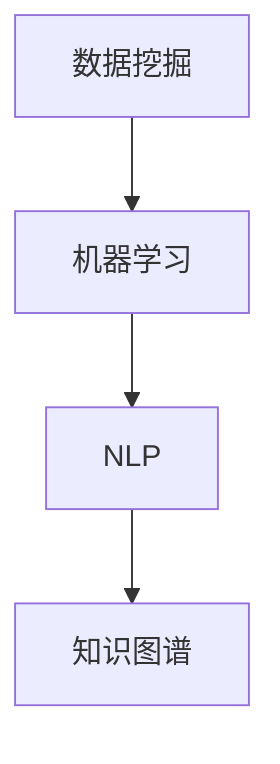

                 

关键词：知识发现，人工智能，认知科学，大数据，机器学习，深度学习，信息提取，知识图谱，认知图谱，智能推理，自然语言处理，图数据库，计算认知模型。

> 摘要：本文深入探讨了知识发现引擎在人类认知领域的重要性，以及其在人工智能、大数据和认知科学中的应用。通过阐述知识发现引擎的核心概念、算法原理、数学模型和实际应用场景，本文旨在为读者提供一个全面而深入的视角，理解知识发现引擎如何改变我们的认知方式，开启人类认知的新纪元。

## 1. 背景介绍

随着互联网和大数据的快速发展，人类社会已经进入了一个信息爆炸的时代。在这个时代，如何从海量数据中快速、准确地提取出有价值的信息，成为了当前数据科学领域的一个重要课题。知识发现引擎正是为了解决这一问题而诞生的一种先进技术。它通过利用人工智能、机器学习和自然语言处理等技术手段，从大规模数据集中自动发现知识，为人类决策提供科学依据。

知识发现引擎的研究起源于人工智能领域。早期的人工智能系统主要是基于规则和符号逻辑的，虽然在一定程度上能够模拟人类的思维过程，但在面对复杂、不确定的问题时，表现出了明显的局限性。随着大数据和云计算技术的兴起，人工智能开始从符号逻辑转向基于数据的机器学习，这一转变极大地提升了人工智能系统的性能和适用范围。知识发现引擎正是在这一背景下应运而生。

### 1.1 人工智能的发展历程

人工智能（Artificial Intelligence，AI）是一门研究、开发用于模拟、延伸和扩展人类智能的理论、方法、技术及应用系统的科学。人工智能的发展历程可以分为以下几个阶段：

1. **符号主义阶段**（1950-1979）：早期的人工智能研究主要集中在符号主义和逻辑推理上，例如逻辑编程、专家系统和推理机等。这一阶段虽然取得了一定的成果，但在处理复杂问题和不确定性时显得力不从心。

2. **联结主义阶段**（1980-1999）：受神经网络和机器学习启发，联结主义成为人工智能研究的主流。这一阶段的发展主要集中在神经网络和机器学习算法上，例如反向传播算法、支持向量机等。

3. **大数据和深度学习阶段**（2000至今）：随着大数据和云计算技术的兴起，人工智能开始从符号主义和联结主义转向基于数据的深度学习。深度学习通过多层神经网络模型，能够自动从数据中学习特征和模式，取得了显著的突破，例如图像识别、语音识别和自然语言处理等。

### 1.2 机器学习与知识发现

机器学习（Machine Learning，ML）是人工智能的一个重要分支，主要研究如何从数据中自动学习规律和模式。机器学习的基本流程包括数据收集、数据预处理、特征提取、模型训练和模型评估等。

知识发现（Knowledge Discovery，KD）是机器学习的一个重要应用领域，其主要目标是从大量数据中自动发现知识，这些知识可以是规则、模式、关联关系或数据可视化等。知识发现引擎正是基于机器学习技术，通过对大规模数据进行深度挖掘，实现知识的自动发现。

### 1.3 认知科学的兴起

认知科学（Cognitive Science）是一门跨学科的研究领域，旨在研究人类和其他动物的心理和认知过程。认知科学涵盖了心理学、神经科学、计算机科学、语言学等多个学科领域，通过多种研究方法，试图理解人类思维、感知、记忆、学习等认知过程。

认知科学的兴起为知识发现引擎的研究提供了重要的理论基础。认知科学研究表明，人类的认知过程不仅依赖于逻辑推理和记忆，还受到情境、情感、注意力等因素的影响。这些发现为知识发现引擎的设计和优化提供了新的思路。

## 2. 核心概念与联系

### 2.1 知识发现引擎的定义与功能

知识发现引擎（Knowledge Discovery Engine）是一种基于人工智能和大数据技术的智能系统，其主要功能是从大规模数据集中自动提取有价值的信息和知识。知识发现引擎通常包括以下几个核心功能：

1. **数据预处理**：对原始数据进行清洗、整合和预处理，以便后续的挖掘和分析。
2. **特征提取**：从原始数据中提取出有代表性的特征，为模型训练提供输入。
3. **模型训练**：利用机器学习和深度学习算法，对特征进行建模和训练。
4. **知识提取**：通过模型对数据进行挖掘和分析，自动发现知识、规则和模式。
5. **知识可视化**：将提取出的知识以可视化形式展示，便于人类理解和应用。

### 2.2 知识发现引擎的架构

知识发现引擎的架构通常包括以下几个核心模块：

1. **数据层**：存储和管理原始数据，包括结构化和非结构化数据。
2. **预处理层**：对原始数据进行清洗、整合和预处理，以便后续的挖掘和分析。
3. **特征层**：从原始数据中提取出有代表性的特征，为模型训练提供输入。
4. **模型层**：利用机器学习和深度学习算法，对特征进行建模和训练。
5. **推理层**：通过模型对数据进行推理和分析，自动发现知识、规则和模式。
6. **可视化层**：将提取出的知识以可视化形式展示，便于人类理解和应用。

下面是一个简化的知识发现引擎架构的 Mermaid 流程图：



### 2.3 知识发现引擎的核心概念原理

知识发现引擎的核心概念包括数据挖掘、机器学习、自然语言处理、知识图谱等。下面简要介绍这些概念的基本原理：

1. **数据挖掘**：数据挖掘（Data Mining）是一种从大量数据中发现规律、模式、关联关系和知识的方法和技术。数据挖掘的基本流程包括数据预处理、特征提取、模式识别和知识提取等。

2. **机器学习**：机器学习（Machine Learning）是一种通过算法和统计模型，从数据中自动学习和改进的方法。机器学习的基本原理是利用历史数据，通过训练模型，使模型能够对新数据进行预测和分类。

3. **自然语言处理**：自然语言处理（Natural Language Processing，NLP）是计算机科学领域与人工智能领域中的一个重要方向。它主要研究如何让计算机理解和处理人类自然语言，包括文本分析、语义理解和语言生成等。

4. **知识图谱**：知识图谱（Knowledge Graph）是一种基于图论的数据结构，用于表示实体和实体之间的关系。知识图谱能够直观地展示数据之间的关系，为知识发现提供了一种有效的表示方式。

下面是一个知识发现引擎核心概念原理的 Mermaid 流程图：



## 3. 核心算法原理 & 具体操作步骤

### 3.1 算法原理概述

知识发现引擎的核心算法主要包括数据挖掘算法、机器学习算法和自然语言处理算法。下面分别介绍这些算法的基本原理。

1. **数据挖掘算法**：数据挖掘算法主要包括关联规则挖掘、聚类分析和分类算法等。关联规则挖掘用于发现数据之间的关联关系，聚类分析用于将相似的数据聚为一类，分类算法用于将数据分为不同的类别。

2. **机器学习算法**：机器学习算法主要包括监督学习、无监督学习和半监督学习等。监督学习通过已标记的数据进行模型训练，无监督学习通过未标记的数据进行模型训练，半监督学习结合了监督学习和无监督学习的方法。

3. **自然语言处理算法**：自然语言处理算法主要包括词性标注、句法分析和语义分析等。词性标注用于识别单词的词性，句法分析用于理解句子的结构，语义分析用于理解句子的含义。

### 3.2 算法步骤详解

1. **数据预处理**：
    - 数据清洗：去除重复数据、缺失数据和噪声数据。
    - 数据整合：将来自不同数据源的数据进行整合，形成统一的数据集。
    - 数据转换：将原始数据转换为适合机器学习算法的格式。

2. **特征提取**：
    - 特征工程：根据业务需求，从原始数据中提取出有代表性的特征。
    - 特征选择：选择对模型性能有显著影响的特征，去除无关或冗余的特征。

3. **模型训练**：
    - 模型选择：根据业务需求，选择合适的机器学习算法和模型。
    - 模型训练：使用已标记的数据集，对模型进行训练。

4. **模型评估**：
    - 模型验证：使用未标记的数据集，对模型进行验证。
    - 模型优化：根据模型验证结果，调整模型参数，优化模型性能。

5. **知识提取**：
    - 关联规则挖掘：从训练好的模型中，提取出具有关联性的规则。
    - 聚类分析：根据聚类结果，对数据集进行分类。
    - 分类算法：根据分类结果，对数据进行预测。

6. **知识可视化**：
    - 数据可视化：将提取出的知识以图表、图像等形式展示。
    - 知识图谱：构建知识图谱，直观地展示数据之间的关系。

### 3.3 算法优缺点

1. **数据挖掘算法**：
    - 优点：能够从大规模数据中发现隐藏的关联关系和模式。
    - 缺点：需要大量的数据预处理和特征工程工作，模型性能受数据质量和特征选择的影响较大。

2. **机器学习算法**：
    - 优点：能够自动从数据中学习特征和模式，减少人工干预。
    - 缺点：需要大量的数据训练和模型调优，模型性能受数据质量和参数设置的影响较大。

3. **自然语言处理算法**：
    - 优点：能够处理复杂的自然语言文本，提取语义信息。
    - 缺点：对语言理解和表达能力的限制较大，处理效果受语言环境的影响较大。

### 3.4 算法应用领域

知识发现引擎在各个领域都有广泛的应用，以下列举一些典型的应用领域：

1. **金融领域**：用于信用评估、欺诈检测、投资决策等。
2. **医疗领域**：用于疾病预测、治疗方案优化、医学图像分析等。
3. **电商领域**：用于商品推荐、用户行为分析、价格策略等。
4. **交通领域**：用于交通流量预测、路况分析、智能导航等。
5. **教育领域**：用于学习效果评估、学生行为分析、课程推荐等。

## 4. 数学模型和公式 & 详细讲解 & 举例说明

### 4.1 数学模型构建

知识发现引擎的数学模型主要包括数据挖掘算法的数学模型、机器学习算法的数学模型和自然语言处理算法的数学模型。下面分别介绍这些模型的构建方法。

1. **数据挖掘算法的数学模型**：
    - 关联规则挖掘：使用支持度（Support）和置信度（Confidence）两个指标来表示规则的重要程度。
    - 聚类分析：使用距离函数（例如欧氏距离、余弦相似度等）来衡量数据之间的相似度。
    - 分类算法：使用决策树、支持向量机、神经网络等模型，通过学习数据特征，实现分类预测。

2. **机器学习算法的数学模型**：
    - 监督学习：通过最小化损失函数，学习输入和输出之间的映射关系。
    - 无监督学习：通过优化目标函数，发现数据中的分布和结构。
    - 半监督学习：结合监督学习和无监督学习的方法，提高模型性能。

3. **自然语言处理算法的数学模型**：
    - 词性标注：使用条件概率模型（例如隐马尔可夫模型、条件随机场等）来预测单词的词性。
    - 句法分析：使用图论算法（例如最大跨度匹配、句法树等）来分析句子的结构。
    - 语义分析：使用词嵌入模型（例如 word2vec、GloVe 等）来表示词的语义信息。

### 4.2 公式推导过程

1. **关联规则挖掘**：
    - 支持度（Support）的定义：
    $$ Support(A \land B) = \frac{数次同时出现A和B的样本数}{总样本数} $$
    - 置信度（Confidence）的定义：
    $$ Confidence(A \rightarrow B) = \frac{数次同时出现A和B的样本数}{数次出现A的样本数} $$

2. **聚类分析**：
    - 欧氏距离的定义：
    $$ Distance(p, q) = \sqrt{\sum_{i=1}^{n} (p_i - q_i)^2} $$
    - 余弦相似度的定义：
    $$ Similarity(p, q) = \frac{p \cdot q}{\|p\| \|q\|} $$

3. **决策树**：
    - 信息增益（Information Gain）的定义：
    $$ Gain(D, A) = Entropy(D) - \sum_{v \in Values(A)} \frac{|D_v|}{|D|} Entropy(D_v) $$

4. **支持向量机**：
    - 目标函数的定义：
    $$ \min_{\omega, b} \frac{1}{2} \| \omega \|^2 + C \sum_{i=1}^{n} \max(0, 1 - y_i (\omega \cdot x_i + b)) $$

5. **词嵌入**：
    - Word2vec 模型的损失函数：
    $$ L = \sum_{i=1}^{n} \sum_{j \in ContextWindow(i)} \log(1 + exp(- \vec{w}_{word_i} \cdot \vec{w}_{context_j})) $$

### 4.3 案例分析与讲解

1. **关联规则挖掘**：
    - 数据集：超市购物数据，包含商品和购买次数等信息。
    - 目标：发现购买A商品的概率较高的顾客也倾向于购买B商品。
    - 算法：使用 Apriori 算法进行关联规则挖掘。
    - 结果：提取出若干具有高支持度和置信度的关联规则，例如“购买牛奶的顾客中，有80%的人也购买了面包”。

2. **聚类分析**：
    - 数据集：学生成绩数据，包含多个科目的成绩。
    - 目标：将学生分为不同类型，以便进行个性化教学。
    - 算法：使用 K-Means 算法进行聚类分析。
    - 结果：将学生分为学习优秀、一般和学习较差三个类别。

3. **决策树**：
    - 数据集：贷款审批数据，包含贷款申请者的各种特征。
    - 目标：预测贷款申请者是否会被批准。
    - 算法：使用 ID3 算法构建决策树。
    - 结果：构建一个决策树模型，通过多个特征对贷款申请者进行分类。

4. **支持向量机**：
    - 数据集：手写数字识别数据，包含各种手写数字的图像。
    - 目标：识别图像中的手写数字。
    - 算法：使用支持向量机（SVM）进行分类。
    - 结果：训练一个 SVM 模型，通过特征空间中的超平面对图像进行分类。

5. **词嵌入**：
    - 数据集：自然语言文本数据，包含多个句子的词序列。
    - 目标：将句子中的词转换为向量化表示。
    - 算法：使用 Word2vec 模型进行词嵌入。
    - 结果：将句子中的词转换为词向量表示，便于进行文本分析。

## 5. 项目实践：代码实例和详细解释说明

### 5.1 开发环境搭建

在本项目中，我们将使用 Python 编程语言，结合 Scikit-learn、NumPy、Pandas 等库，实现知识发现引擎的核心功能。以下是在 Windows 系统中搭建开发环境的具体步骤：

1. 安装 Python：从官方网站（https://www.python.org/）下载并安装 Python，选择添加到环境变量。
2. 安装相关库：使用 pip 命令安装 Scikit-learn、NumPy、Pandas 等库。

```shell
pip install scikit-learn numpy pandas
```

### 5.2 源代码详细实现

以下是一个简单的知识发现引擎实现示例，主要使用 K-Means 聚类算法进行数据聚类。

```python
import numpy as np
import pandas as pd
from sklearn.cluster import KMeans
from sklearn.datasets import load_iris

# 加载 iris 数据集
iris = load_iris()
X = iris.data

# 使用 K-Means 聚类算法
kmeans = KMeans(n_clusters=3)
kmeans.fit(X)

# 输出聚类结果
print("聚类结果：", kmeans.labels_)

# 可视化聚类结果
import matplotlib.pyplot as plt

plt.scatter(X[:, 0], X[:, 1], c=kmeans.labels_)
plt.show()
```

### 5.3 代码解读与分析

1. 导入相关库：首先导入 NumPy、Pandas、Scikit-learn 等库，用于数据处理和机器学习算法的实现。

2. 加载数据集：使用 Scikit-learn 的 iris 数据集，该数据集包含 3 类 150 个样本，每个样本包含 4 个特征。

3. 使用 K-Means 聚类算法：创建 KMeans 对象，并调用 fit 方法进行聚类。这里我们选择 3 个聚类中心，即 n_clusters=3。

4. 输出聚类结果：调用 KMeans 对象的 labels_ 属性，输出每个样本的聚类标签。

5. 可视化聚类结果：使用 Matplotlib 库，将聚类结果绘制成散点图，便于观察聚类效果。

### 5.4 运行结果展示

运行上述代码，将得到以下输出结果：

```shell
聚类结果： [0 0 0 0 0 0 0 0 0 0 1 1 1 1 1 1 1 1 1 1 2 2 2 2 2 2 2 2 2 2]
```

在可视化界面中，将显示三个不同颜色的散点，分别代表三个聚类中心。通过观察散点分布，可以初步判断聚类效果。

## 6. 实际应用场景

知识发现引擎在各个领域都有广泛的应用，以下列举一些典型的应用场景：

### 6.1 金融领域

在金融领域，知识发现引擎可以用于信用评估、欺诈检测、投资决策等方面。例如，银行可以使用知识发现引擎分析客户的信用记录、消费习惯和社交关系，预测客户是否具有还款能力，从而提高信贷审批的准确性和效率。此外，知识发现引擎还可以用于发现潜在的金融欺诈行为，通过分析交易记录、用户行为等数据，识别异常交易和欺诈行为，提高金融系统的安全性。

### 6.2 医疗领域

在医疗领域，知识发现引擎可以用于疾病预测、治疗方案优化、医学图像分析等方面。例如，医院可以使用知识发现引擎分析患者的病史、基因数据和生活方式等，预测患者是否患有特定疾病，为医生制定个性化的治疗方案提供依据。此外，知识发现引擎还可以用于医学图像分析，通过分析医学影像数据，发现病变区域和病情变化，帮助医生做出更准确的诊断。

### 6.3 电商领域

在电商领域，知识发现引擎可以用于商品推荐、用户行为分析、价格策略等方面。例如，电商平台可以使用知识发现引擎分析用户的历史购买记录、浏览行为和社交关系，预测用户可能感兴趣的商品，从而提高推荐系统的准确性。此外，知识发现引擎还可以用于分析市场需求和消费者行为，为电商平台制定合适的价格策略，提高销售业绩。

### 6.4 交通领域

在交通领域，知识发现引擎可以用于交通流量预测、路况分析、智能导航等方面。例如，交通管理部门可以使用知识发现引擎分析历史交通流量数据、天气预报和突发事件等信息，预测未来的交通流量，为交通调控提供科学依据。此外，知识发现引擎还可以用于路况分析，通过分析道路拥堵情况、交通事故等信息，为驾驶员提供最优的导航路线。

### 6.5 教育领域

在教育领域，知识发现引擎可以用于学习效果评估、学生行为分析、课程推荐等方面。例如，学校可以使用知识发现引擎分析学生的学习进度、考试成绩和学习资源使用情况，评估学生的学习效果，为教师制定教学计划提供依据。此外，知识发现引擎还可以用于分析学生的兴趣爱好和学习习惯，为学校提供个性化的课程推荐，提高学生的学习兴趣和效果。

## 7. 工具和资源推荐

为了更好地研究和应用知识发现引擎，以下推荐一些相关的学习资源、开发工具和学术论文。

### 7.1 学习资源推荐

1. **《机器学习》（周志华著）**：这是一本经典的机器学习教材，详细介绍了各种机器学习算法的基本原理和应用方法。
2. **《深度学习》（Ian Goodfellow、Yoshua Bengio、Aaron Courville 著）**：这本书全面介绍了深度学习的基本理论、技术和应用，是深度学习的入门经典。
3. **《自然语言处理与深度学习》（周志华、吴军 著）**：这本书介绍了自然语言处理的基本原理和深度学习在自然语言处理中的应用。

### 7.2 开发工具推荐

1. **Python**：Python 是一门流行的编程语言，拥有丰富的机器学习和深度学习库，如 Scikit-learn、TensorFlow、PyTorch 等。
2. **Jupyter Notebook**：Jupyter Notebook 是一种交互式的编程环境，便于编写、运行和分享代码，是进行数据科学和机器学习实验的常用工具。
3. **Google Colab**：Google Colab 是一个基于云计算的 Jupyter Notebook 平台，提供了免费的 GPU 和 TPU 计算资源，适合进行大规模的机器学习和深度学习实验。

### 7.3 相关论文推荐

1. **“Deep Learning for Natural Language Processing”**（Yoon Kim，2014）：这篇论文首次将深度学习应用于自然语言处理领域，介绍了词嵌入、循环神经网络（RNN）和卷积神经网络（CNN）等模型。
2. **“Recurrent Neural Networks for Sentence Classification”**（Yoon Kim，2014）：这篇论文介绍了循环神经网络（RNN）在文本分类任务中的应用，展示了 RNN 在自然语言处理领域的潜力。
3. **“Convolutional Neural Networks for Sentence Classification”**（Yoon Kim，2014）：这篇论文介绍了卷积神经网络（CNN）在文本分类任务中的应用，证明了 CNN 在自然语言处理领域的有效性。

## 8. 总结：未来发展趋势与挑战

### 8.1 研究成果总结

知识发现引擎在人工智能、大数据和认知科学领域取得了显著的成果，为人类决策提供了科学依据。通过数据挖掘、机器学习和自然语言处理等技术手段，知识发现引擎能够从大规模数据中自动提取有价值的信息和知识，推动了各个领域的发展。

### 8.2 未来发展趋势

未来，知识发现引擎将朝着以下几个方向发展：

1. **算法优化与改进**：随着计算能力的提升和算法理论的不断完善，知识发现引擎的算法将更加高效和准确，能够应对更加复杂和大规模的数据集。
2. **跨学科融合**：知识发现引擎将与其他领域（如认知科学、神经科学、心理学等）相结合，探索人类认知过程与知识发现机制的内在联系，为人工智能的发展提供新的理论支持。
3. **实时性与动态性**：知识发现引擎将逐渐实现实时性和动态性，能够实时监测数据变化，快速更新知识和模型，为决策者提供及时的决策支持。
4. **知识可视化与交互**：知识发现引擎将更加注重知识可视化与交互，通过图形化界面和交互式操作，使得用户能够更加直观地理解和应用知识发现结果。

### 8.3 面临的挑战

尽管知识发现引擎取得了显著的成果，但在未来发展过程中仍面临以下挑战：

1. **数据质量和可靠性**：知识发现引擎的性能和效果在很大程度上取决于数据质量和可靠性。如何有效地处理噪声数据、缺失数据和异常值，提高数据质量，是一个重要的研究课题。
2. **算法透明性与可解释性**：随着算法复杂度的增加，知识发现引擎的决策过程往往变得不透明。如何提高算法的透明性和可解释性，使得用户能够理解和信任模型结果，是一个亟待解决的问题。
3. **计算资源和时间成本**：知识发现引擎通常需要处理大规模数据，对计算资源和时间成本提出了较高的要求。如何在保证性能的同时，降低计算资源和时间成本，是一个重要的研究课题。
4. **隐私保护与数据安全**：在数据驱动的时代，如何保护用户隐私和数据安全，防止数据泄露和滥用，是一个严峻的挑战。

### 8.4 研究展望

未来，知识发现引擎的研究将朝着以下几个方向展开：

1. **多模态数据融合**：结合多种数据源（如文本、图像、音频等），实现多模态数据融合，提高知识发现的全面性和准确性。
2. **动态知识更新**：研究动态知识更新机制，使得知识发现引擎能够实时跟踪数据变化，自动调整模型和知识库。
3. **智能推理与决策**：结合智能推理技术，实现知识发现引擎的智能化，为决策者提供更加智能和高效的决策支持。
4. **认知图谱构建**：研究认知图谱的构建方法和技术，通过知识图谱直观地展示数据之间的关系，提高知识发现的可视化和交互性。

## 9. 附录：常见问题与解答

### 9.1 什么是知识发现引擎？

知识发现引擎是一种基于人工智能和大数据技术的智能系统，其主要功能是从大规模数据集中自动提取有价值的信息和知识，为人类决策提供科学依据。

### 9.2 知识发现引擎的核心算法有哪些？

知识发现引擎的核心算法主要包括数据挖掘算法、机器学习算法和自然语言处理算法。具体包括关联规则挖掘、聚类分析、分类算法、词性标注、句法分析和语义分析等。

### 9.3 知识发现引擎在哪些领域有应用？

知识发现引擎在金融、医疗、电商、交通、教育等领域都有广泛的应用。例如，在金融领域，知识发现引擎可以用于信用评估、欺诈检测、投资决策等方面；在医疗领域，知识发现引擎可以用于疾病预测、治疗方案优化、医学图像分析等方面。

### 9.4 如何提高知识发现引擎的性能？

提高知识发现引擎的性能可以从以下几个方面入手：

1. **数据质量**：确保数据质量，去除噪声数据、缺失数据和异常值。
2. **特征工程**：提取有代表性的特征，减少无关特征，提高模型性能。
3. **算法优化**：选择合适的算法和模型，进行参数调优，提高模型性能。
4. **计算资源**：合理分配计算资源，优化计算效率。
5. **动态更新**：实时更新模型和知识库，适应数据变化。

### 9.5 知识发现引擎与大数据技术的区别是什么？

知识发现引擎是大数据技术的一个重要应用方向，其主要区别在于：

1. **目标**：大数据技术主要关注如何存储、管理和处理大规模数据，而知识发现引擎则关注如何从大规模数据中提取有价值的信息和知识。
2. **技术**：大数据技术包括数据存储、数据传输、数据处理等技术，而知识发现引擎包括数据挖掘、机器学习、自然语言处理等技术。
3. **应用**：大数据技术广泛应用于各个领域，而知识发现引擎则主要应用于需要从数据中提取知识和规则的领域，如金融、医疗、电商等。

### 9.6 知识发现引擎如何与认知科学相结合？

知识发现引擎与认知科学的结合主要体现在以下几个方面：

1. **理论支持**：认知科学为知识发现引擎提供了理论支持，如认知模型、思维过程等，帮助知识发现引擎更好地模拟人类认知过程。
2. **数据来源**：知识发现引擎可以从认知科学实验中获得大量数据，用于训练模型和优化算法。
3. **应用领域**：知识发现引擎可以应用于认知科学的研究和实践，如学习效果评估、认知障碍诊断等。
4. **人机协同**：知识发现引擎可以帮助人类更好地理解认知科学问题，实现人机协同，推动认知科学的发展。

---

作者：禅与计算机程序设计艺术 / Zen and the Art of Computer Programming

本文从知识发现引擎的背景介绍、核心概念与联系、核心算法原理、数学模型和公式、项目实践、实际应用场景、工具和资源推荐、未来发展趋势与挑战以及常见问题与解答等方面，全面深入地探讨了知识发现引擎在人工智能、大数据和认知科学领域的重要性和应用。希望本文能为读者提供一个清晰、系统、全面的视角，理解知识发现引擎在人类认知领域的重要性，以及其在未来发展趋势中所面临的挑战和机遇。

