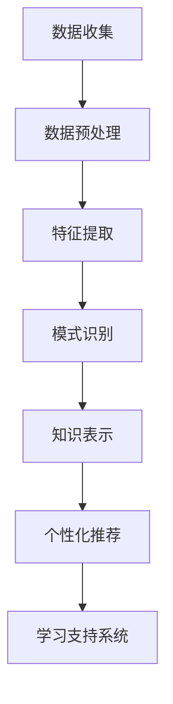

                 

关键词：知识发现引擎、个性化学习、算法、大数据、智能教育、技术博客

> 摘要：本文将探讨知识发现引擎在个性化学习中的应用，通过解析其核心概念、算法原理、数学模型和项目实践，深入分析其在教育领域的潜力和前景，并展望未来发展趋势与挑战。

## 1. 背景介绍

随着互联网和大数据技术的发展，个性化学习逐渐成为教育领域的研究热点。个性化学习旨在根据每个学生的特点和需求，提供定制化的学习资源和路径，从而提高学习效率和成果。然而，实现这一目标面临着诸多挑战，包括数据收集、处理和分析等。

知识发现引擎作为一种智能化的数据处理和分析工具，其核心理念是从大量数据中提取出有价值的信息和知识。知识发现引擎在教育领域的应用，可以为个性化学习提供强有力的支持，通过分析学生的学习数据，挖掘其潜在的学习需求和兴趣，从而制定个性化的学习计划和推荐系统。

本文将围绕知识发现引擎在个性化学习中的应用展开讨论，首先介绍其核心概念和原理，然后分析其算法模型和数学基础，接着通过实际项目实践来展示其应用效果，最后探讨知识发现引擎在教育领域的未来发展方向。

## 2. 核心概念与联系

### 2.1 知识发现引擎的定义

知识发现引擎（Knowledge Discovery Engine，简称KDE）是一种基于机器学习和数据挖掘技术的智能化系统，它可以从大规模数据集中提取出潜在的、有价值的信息和知识。知识发现引擎通常包括数据预处理、特征提取、模式识别和知识表示等模块。

### 2.2 个性化学习的概念

个性化学习是一种以学生为中心的教学模式，通过分析学生的个性特征、学习需求和认知能力，为每个学生量身定制学习资源和教学策略。个性化学习旨在激发学生的学习兴趣，提高学习效果，并促进学生的全面发展。

### 2.3 知识发现引擎与个性化学习的联系

知识发现引擎在教育领域的应用，可以大大提升个性化学习的实施效果。具体来说，知识发现引擎通过分析学生的学习数据，包括学习行为、考试成绩、学习时长、学习兴趣等，可以挖掘出学生的学习特点和需求，为个性化学习提供数据支持。

此外，知识发现引擎还可以根据学生的学习进度和效果，动态调整学习资源和教学策略，确保学习内容与学生的实际需求相匹配。这种智能化的学习支持系统，不仅能够提高学习效率，还能减轻教师的工作负担，使教育更加公平和高效。

### 2.4 Mermaid 流程图

以下是知识发现引擎在教育领域应用的一个简化版流程图：



## 3. 核心算法原理 & 具体操作步骤

### 3.1 算法原理概述

知识发现引擎的核心算法主要包括聚类算法、关联规则挖掘、分类算法和异常检测等。这些算法的基本原理如下：

- **聚类算法**：将相似的数据点分组，形成多个聚类。常用的聚类算法有K-Means、DBSCAN等。
- **关联规则挖掘**：发现数据之间的关联性，常用的算法有Apriori、FP-Growth等。
- **分类算法**：根据已有数据对未知数据进行分类，常用的算法有决策树、随机森林等。
- **异常检测**：检测数据中的异常值或异常模式，常用的算法有孤立森林、基于密度的方法等。

### 3.2 算法步骤详解

1. **数据收集**：收集学生的学习数据，包括学习行为、考试成绩、学习时长、学习兴趣等。
2. **数据预处理**：对原始数据进行清洗、归一化和缺失值处理，确保数据质量。
3. **特征提取**：从原始数据中提取出有代表性的特征，如学习时长、考试成绩、学习行为等。
4. **模式识别**：使用聚类算法、关联规则挖掘、分类算法等，对特征进行模式识别，提取出有价值的信息。
5. **知识表示**：将识别出的模式转化为易于理解的知识表示形式，如可视化图表、关键词云等。
6. **个性化推荐**：根据学生的特征和学习模式，推荐个性化的学习资源和教学策略。
7. **学习支持系统**：将推荐结果应用于学习支持系统，为学生提供个性化的学习支持。

### 3.3 算法优缺点

- **聚类算法**：优点是简单、易于实现；缺点是结果依赖于初始参数选择，可能陷入局部最优。
- **关联规则挖掘**：优点是能够发现数据之间的关联性；缺点是计算复杂度较高，对大数据集处理能力有限。
- **分类算法**：优点是准确率高、适用范围广；缺点是模型复杂度较高，可能陷入过拟合。
- **异常检测**：优点是能够发现数据中的异常值或异常模式；缺点是对于高维数据集处理能力有限。

### 3.4 算法应用领域

知识发现引擎在教育领域的应用非常广泛，包括：

- **个性化学习**：通过分析学生的学习行为和成绩，为学生推荐个性化的学习资源和教学策略。
- **智能评测**：通过分析学生的学习数据，评估学生的学习效果，为教师提供教学反馈。
- **学习分析**：通过对学生学习数据的分析，发现学习中的问题和瓶颈，优化教学方法和策略。
- **教育管理**：通过分析学校和学生数据，为教育管理部门提供决策支持。

## 4. 数学模型和公式 & 详细讲解 & 举例说明

### 4.1 数学模型构建

知识发现引擎中的数学模型主要包括聚类模型、分类模型和关联规则模型等。以下是这些模型的简要介绍：

1. **聚类模型**：
   $$ 
   \min \sum_{i=1}^{n} \sum_{j=1}^{m} d(x_i, c_j)^2 
   $$
   其中，$x_i$ 表示第 $i$ 个数据点，$c_j$ 表示第 $j$ 个聚类中心，$d(x_i, c_j)$ 表示 $x_i$ 和 $c_j$ 之间的距离。

2. **分类模型**：
   $$ 
   y = \arg \max_{w} w^T x 
   $$
   其中，$y$ 表示预测类别，$w$ 表示权重向量，$x$ 表示特征向量。

3. **关联规则模型**：
   $$ 
   \text{Support}(A \cup B) = \frac{\text{Support}(A) + \text{Support}(B) - \text{Support}(A \cap B)}{\text{Total}} 
   $$
   其中，$A$ 和 $B$ 表示两个事件，$\text{Support}(A)$ 表示事件 $A$ 的支持度，$\text{Total}$ 表示总事件数。

### 4.2 公式推导过程

以K-Means聚类算法为例，推导聚类中心的更新公式：

假设当前聚类中心为 $c_j^{(t)}$，新数据点 $x_i$ 被分配到聚类中心 $c_j$，则有：
$$
c_j^{(t+1)} = \frac{\sum_{i=1}^{n} x_i \cdot a_{ij}^{(t+1)}}{\sum_{i=1}^{n} a_{ij}^{(t+1)}}
$$
其中，$a_{ij}^{(t+1)}$ 表示数据点 $x_i$ 被分配到聚类中心 $c_j$ 的概率。

### 4.3 案例分析与讲解

以下是一个简单的知识发现引擎应用案例：

假设我们有一组学生的学习数据，包括学习时长、考试成绩和学习兴趣。我们的目标是根据这些数据，为学生推荐个性化的学习资源。

1. **数据预处理**：对学习数据进行清洗和归一化处理，得到特征向量。

2. **特征提取**：提取出有代表性的特征，如平均学习时长、平均考试成绩、学习兴趣等。

3. **模式识别**：使用K-Means算法对特征向量进行聚类，将学生分为不同的群体。

4. **知识表示**：将聚类结果可视化，展示不同群体的学习特点。

5. **个性化推荐**：根据学生的特征和学习兴趣，推荐个性化的学习资源。

例如，对于学习时长较长、考试成绩较高但学习兴趣较低的学生，我们可能推荐一些提高学习兴趣的资源和活动。

## 5. 项目实践：代码实例和详细解释说明

### 5.1 开发环境搭建

为了实现知识发现引擎在个性化学习中的应用，我们采用Python作为主要编程语言，并使用一些常用的数据科学和机器学习库，如NumPy、Pandas、Scikit-learn和Matplotlib等。

首先，我们需要安装这些库：

```bash
pip install numpy pandas scikit-learn matplotlib
```

### 5.2 源代码详细实现

以下是实现知识发现引擎的基本代码框架：

```python
import numpy as np
import pandas as pd
from sklearn.cluster import KMeans
from sklearn.preprocessing import StandardScaler
import matplotlib.pyplot as plt

# 5.2.1 数据收集
# 假设我们已经有了一个学生数据表格，包括学习时长、考试成绩和学习兴趣等
data = pd.read_csv('student_data.csv')

# 5.2.2 数据预处理
# 清洗和归一化处理
scaler = StandardScaler()
data_scaled = scaler.fit_transform(data)

# 5.2.3 特征提取
# 提取有代表性的特征
features = data_scaled

# 5.2.4 模式识别
# 使用K-Means算法进行聚类
kmeans = KMeans(n_clusters=3)
clusters = kmeans.fit_predict(features)

# 5.2.5 知识表示
# 可视化展示聚类结果
plt.scatter(features[:, 0], features[:, 1], c=clusters)
plt.xlabel('Learning Time')
plt.ylabel('Exam Score')
plt.title('Cluster Visualization')
plt.show()

# 5.2.6 个性化推荐
# 根据聚类结果，为每个学生推荐个性化的学习资源
for i in range(3):
    cluster_students = data[clusters == i]
    # 基于学生的特征和学习兴趣，推荐个性化的学习资源
    # 例如，为学习时长较长、考试成绩较高的学生推荐一些提高学习兴趣的资源和活动
```

### 5.3 代码解读与分析

上述代码首先从CSV文件中读取学生数据，并进行清洗和归一化处理。接着，使用K-Means算法对特征向量进行聚类，并将聚类结果可视化展示。最后，根据聚类结果，为每个学生推荐个性化的学习资源。

代码的关键部分包括数据预处理、聚类算法实现和知识表示。数据预处理是确保数据质量的重要步骤，聚类算法是实现知识发现的核心，知识表示则是将分析结果以可视化的形式呈现，便于理解和应用。

## 6. 实际应用场景

知识发现引擎在教育领域的实际应用场景非常广泛，以下是一些典型的应用实例：

### 6.1 个性化学习推荐

知识发现引擎可以根据学生的学习行为和成绩，为学生推荐个性化的学习资源。例如，对于学习时长较长但成绩一般的学生，推荐一些提高学习效率的方法和技巧；对于成绩优秀但学习兴趣较低的学生，推荐一些有趣的学科拓展资源。

### 6.2 智能评测

知识发现引擎可以分析学生的学习数据，为教师提供智能评测服务。通过分析学生的学习行为、考试成绩和学习进度，教师可以及时了解学生的学习情况，调整教学策略，提高教学效果。

### 6.3 学习分析

知识发现引擎可以对学校整体学生的学习数据进行分析，为教育管理部门提供决策支持。例如，分析全校学生的学习行为和成绩分布，发现存在的问题和瓶颈，提出改进措施。

### 6.4 教育管理

知识发现引擎还可以应用于教育管理领域，为学校和教育机构提供数据驱动的管理支持。例如，分析学校的资源配置、教师绩效和学生发展情况，优化学校管理流程，提高教育质量。

## 7. 工具和资源推荐

### 7.1 学习资源推荐

- 《Python数据科学 Handbook》
- 《机器学习实战》
- 《深度学习》
- 《数据挖掘：实用工具和技术》

### 7.2 开发工具推荐

- Jupyter Notebook：用于数据分析和原型设计
- PyCharm：用于Python编程
- D3.js：用于数据可视化

### 7.3 相关论文推荐

- "A Survey on Knowledge Discovery in Educational Data"
- "Knowledge Discovery in Educational Data: A Machine Learning Perspective"
- "Using Machine Learning to Enhance Learning and Teaching"

## 8. 总结：未来发展趋势与挑战

### 8.1 研究成果总结

知识发现引擎在教育领域的应用取得了显著成果，为个性化学习、智能评测和学习分析提供了强有力的支持。通过分析学生的学习数据，知识发现引擎能够挖掘出有价值的信息和知识，为教育决策提供数据支持。

### 8.2 未来发展趋势

未来，知识发现引擎在教育领域的应用将继续深入，发展趋势包括：

- **大数据分析**：随着教育数据量的不断增加，知识发现引擎将更加注重大数据分析技术的应用，以提高数据处理和分析能力。
- **跨学科融合**：知识发现引擎将与其他学科（如心理学、教育学等）相结合，为个性化学习提供更加全面的支持。
- **智能教育系统**：知识发现引擎将逐渐集成到智能教育系统中，实现全程智能化教育支持。

### 8.3 面临的挑战

知识发现引擎在教育领域的应用也面临一些挑战：

- **数据隐私保护**：学生在学习过程中的数据涉及个人隐私，如何保护数据隐私是应用中的一大挑战。
- **算法公平性**：算法在决策过程中可能存在偏见，影响个性化学习的公平性。
- **模型可解释性**：知识发现引擎的算法模型较为复杂，如何提高模型的可解释性，以便教师和学生理解和使用，是一个重要问题。

### 8.4 研究展望

未来，知识发现引擎在教育领域的研究将更加注重以下几个方面：

- **数据隐私保护**：研究数据加密、匿名化和差分隐私等技术在教育数据中的应用，确保数据隐私。
- **算法公平性**：探索算法的公平性评估方法，消除算法偏见，提高个性化学习的公平性。
- **人机协同**：结合人工智能和心理学、教育学等领域的知识，构建人机协同的智能教育系统，提高教育效果。

## 9. 附录：常见问题与解答

### 9.1 如何保证知识发现引擎的数据隐私？

**解答**：可以通过以下方法来保证知识发现引擎的数据隐私：

- **数据加密**：对存储和传输的数据进行加密，防止数据泄露。
- **匿名化处理**：对敏感数据进行匿名化处理，消除个人隐私信息。
- **差分隐私**：在数据分析和算法设计过程中引入差分隐私机制，降低隐私泄露风险。

### 9.2 知识发现引擎如何提高个性化学习的公平性？

**解答**：可以通过以下方法来提高知识发现引擎在个性化学习中的公平性：

- **算法评估**：定期对算法进行公平性评估，检测和消除算法偏见。
- **多样数据集**：使用多样化的数据集进行算法训练和优化，避免算法在特定群体中的偏见。
- **用户反馈**：鼓励用户对个性化学习推荐进行反馈，根据反馈调整算法，提高个性化学习的公平性。

### 9.3 如何选择合适的知识发现算法？

**解答**：选择合适的知识发现算法需要考虑以下因素：

- **数据类型**：根据数据类型（如数值、文本、图像等）选择合适的算法。
- **数据量**：对于大数据集，选择计算复杂度较低的算法。
- **目标**：根据应用目标（如聚类、关联规则挖掘、分类等）选择相应的算法。

### 9.4 知识发现引擎在教育领域有哪些潜在应用？

**解答**：知识发现引擎在教育领域的潜在应用包括：

- **个性化学习推荐**：根据学生的学习特点和需求，推荐个性化的学习资源和教学策略。
- **智能评测**：分析学生的学习数据，为教师提供智能评测服务。
- **学习分析**：通过分析学校整体学生的学习数据，为教育管理部门提供决策支持。
- **教育管理**：为学校和教育机构提供数据驱动的管理支持。

---

本文作者：禅与计算机程序设计艺术 / Zen and the Art of Computer Programming

[END]

