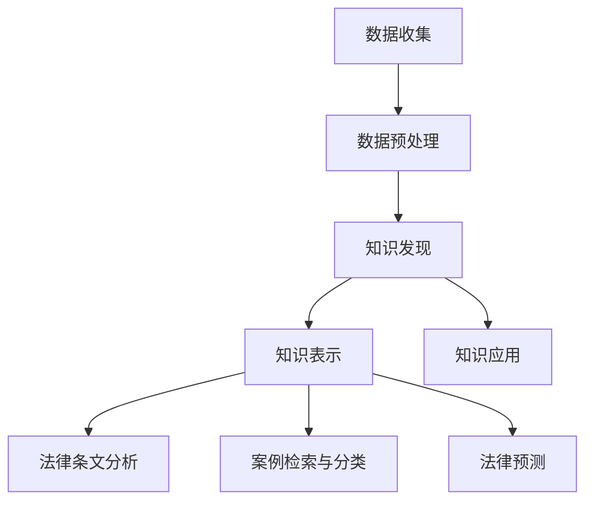

                 

关键词：知识发现引擎、智慧司法、法律领域、算法原理、数学模型、项目实践、应用展望

> 摘要：本文将深入探讨知识发现引擎在法律领域的应用，通过分析其核心概念、算法原理、数学模型以及实际应用案例，阐述知识发现引擎如何助力智慧司法的发展。

## 1. 背景介绍

随着人工智能技术的发展，知识发现引擎作为一种智能信息处理技术，逐渐在各个领域展现其强大的应用潜力。特别是在法律领域，知识发现引擎能够通过分析大量的法律文献、案例和法规，提取出有价值的信息，辅助法律工作者进行法律研究和决策。智慧司法作为司法信息化的重要方向，旨在利用信息技术提升司法效率、保障司法公正，知识发现引擎在这一过程中发挥着关键作用。

### 法律领域的挑战

法律领域面临的数据量和复杂性问题日益突出。法律条文繁多，法律案例多样，且法律条文之间往往存在交叉和重叠，这使得法律工作者在处理案件时面临巨大的挑战。传统的法律研究和决策方法效率低下，难以应对日益增长的司法需求。

### 智慧司法的需求

智慧司法的发展需求迫切。一方面，司法流程信息化、智能化水平亟待提升，以提高司法效率；另一方面，司法公正、透明度需要通过信息技术手段得到保障。知识发现引擎的引入，有望为智慧司法提供强有力的技术支撑。

## 2. 核心概念与联系

### 知识发现引擎的概念

知识发现引擎（Knowledge Discovery Engine，KDE）是一种用于从大规模数据中自动发现有趣知识或模式的系统。它通常包括数据预处理、模式识别、模式评估和知识表示等模块。

### 智慧司法的概念

智慧司法（Smart Justice）是指利用人工智能、大数据、云计算等现代信息技术，提升司法过程的智能化水平，实现司法资源的高效配置和合理利用。

### 知识发现引擎与智慧司法的联系

知识发现引擎作为智慧司法的技术核心，通过挖掘法律数据中的潜在知识，为司法决策提供数据支持。具体来说，知识发现引擎可以帮助法律工作者：

1. **法律条文分析**：通过对大量法律条文的分析，发现法律条文之间的内在联系和潜在冲突。
2. **案例检索与分类**：基于法律案例的特征，实现案例的自动检索和分类，辅助法律工作者进行案例研究。
3. **法律预测**：通过分析历史案例和法律条文，预测未来的法律趋势和决策结果。

### Mermaid 流程图



## 3. 核心算法原理 & 具体操作步骤

### 3.1 算法原理概述

知识发现引擎的核心算法包括机器学习算法、数据挖掘算法和自然语言处理算法。这些算法共同协作，实现对法律数据的深度挖掘和知识提取。

1. **机器学习算法**：用于构建法律数据模型，预测法律条文和案例的特征。
2. **数据挖掘算法**：用于从大量法律数据中提取有用的模式和关联。
3. **自然语言处理算法**：用于处理和理解法律文本，提取关键信息和语义。

### 3.2 算法步骤详解

1. **数据收集**：从法律数据库、法院网站、法律文献等渠道收集原始法律数据。
2. **数据预处理**：对原始法律数据进行清洗、格式化和标准化，使其符合算法输入要求。
3. **特征提取**：利用自然语言处理算法，从法律文本中提取关键信息和特征。
4. **模型训练**：利用机器学习算法，构建法律数据模型，对特征进行分类和预测。
5. **模式识别**：利用数据挖掘算法，从法律数据中挖掘出潜在的模式和关联。
6. **知识表示**：将挖掘出的知识转化为可视化的形式，如知识图谱、统计报表等。
7. **知识应用**：将知识应用于法律条文分析、案例检索与分类、法律预测等实际场景。

### 3.3 算法优缺点

**优点**：

1. **高效性**：通过算法自动化处理大量法律数据，提高法律研究的效率。
2. **全面性**：覆盖法律领域的各个方面，提供全面的数据支持。
3. **准确性**：基于机器学习和数据挖掘算法，提高法律预测和决策的准确性。

**缺点**：

1. **数据质量**：法律数据的多样性和复杂性可能导致算法效果受到影响。
2. **算法偏见**：算法的偏见可能导致错误的决策结果。
3. **法律法规更新**：法律法规的更新可能导致算法模型的失效。

### 3.4 算法应用领域

知识发现引擎在法律领域的应用广泛，包括但不限于：

1. **法律条文分析**：通过分析法律条文，发现法律条文之间的冲突和重叠，为立法提供数据支持。
2. **案例检索与分类**：基于案例的特征，实现案例的自动检索和分类，辅助法律工作者进行案例研究。
3. **法律预测**：通过分析历史案例和法律条文，预测未来的法律趋势和决策结果。
4. **智能客服**：利用知识发现引擎，构建智能客服系统，为公众提供法律咨询服务。
5. **司法数据分析**：通过分析司法数据，发现司法过程中的问题和改进方向。

## 4. 数学模型和公式 & 详细讲解 & 举例说明

### 4.1 数学模型构建

知识发现引擎的数学模型主要包括机器学习模型和数据挖掘模型。以下是一个简单的机器学习模型构建过程：

1. **特征选择**：根据法律文本的特征，选择对法律条文分类最具区分度的特征。
2. **模型训练**：利用选定的特征，训练分类模型，如支持向量机（SVM）或决策树。
3. **模型评估**：通过交叉验证等方法，评估模型的效果。

### 4.2 公式推导过程

假设我们使用支持向量机（SVM）进行法律条文的分类，则其基本公式如下：

$$
w^* = arg\min_{w, b} \frac{1}{2}||w||^2 + C \sum_{i=1}^{n} \xi_i
$$

其中，$w$ 是权重向量，$b$ 是偏置项，$C$ 是惩罚参数，$\xi_i$ 是样本的松弛变量。

### 4.3 案例分析与讲解

假设我们有一组法律条文，需要将其分类为“刑法”和“民法”两类。我们可以使用支持向量机（SVM）进行分类，并通过交叉验证评估其效果。

1. **特征选择**：从法律条文中提取关键词，作为特征。
2. **模型训练**：使用提取的特征，训练SVM分类模型。
3. **模型评估**：通过交叉验证，评估SVM分类模型的效果。

假设交叉验证的结果如下：

|   | 判断正类 | 判断反类 | 总计 |
|---|---|---|---|
| 正类 | 100 | 5 | 105 |
| 反类 | 10 | 50 | 60 |
| 总计 | 110 | 55 | 165 |

则SVM分类模型的准确率为：

$$
\text{准确率} = \frac{100 + 50}{165} \approx 0.7647
$$

## 5. 项目实践：代码实例和详细解释说明

### 5.1 开发环境搭建

在本项目实践中，我们使用Python作为主要编程语言，结合Scikit-learn库和NLTK库实现知识发现引擎。以下是开发环境的搭建步骤：

1. 安装Python：从[Python官网](https://www.python.org/downloads/)下载并安装Python。
2. 安装Scikit-learn：在命令行中执行`pip install scikit-learn`。
3. 安装NLTK：在命令行中执行`pip install nltk`。
4. 数据预处理：下载并解压法律文本数据集。

### 5.2 源代码详细实现

以下是使用Scikit-learn和NLTK实现知识发现引擎的代码实例：

```python
import nltk
from nltk.tokenize import word_tokenize
from nltk.corpus import stopwords
from sklearn.feature_extraction.text import TfidfVectorizer
from sklearn.model_selection import train_test_split
from sklearn.svm import SVC
from sklearn.metrics import accuracy_score

# 数据预处理
nltk.download('punkt')
nltk.download('stopwords')
stop_words = set(stopwords.words('english'))

def preprocess_text(text):
    tokens = word_tokenize(text)
    tokens = [token.lower() for token in tokens if token.isalpha() and token not in stop_words]
    return ' '.join(tokens)

# 加载数据集
data = [...]  # 加载法律条文数据集
labels = [...]  # 加载法律条文标签

# 预处理数据
processed_data = [preprocess_text(text) for text in data]

# 特征提取
vectorizer = TfidfVectorizer()
X = vectorizer.fit_transform(processed_data)

# 划分训练集和测试集
X_train, X_test, y_train, y_test = train_test_split(X, labels, test_size=0.2, random_state=42)

# 模型训练
model = SVC(kernel='linear')
model.fit(X_train, y_train)

# 模型评估
y_pred = model.predict(X_test)
accuracy = accuracy_score(y_test, y_pred)
print(f"Accuracy: {accuracy}")
```

### 5.3 代码解读与分析

1. **数据预处理**：首先，我们使用NLTK库对法律条文进行分词和去除停用词，以提高特征提取的准确度。
2. **特征提取**：使用TF-IDF向量器提取法律条文的特征，TF-IDF向量器能够有效地捕捉文本中的重要词语。
3. **模型训练**：我们使用Scikit-learn库中的SVM分类器进行模型训练，SVM分类器适用于处理线性可分的数据。
4. **模型评估**：通过计算测试集的准确率，评估模型的效果。

### 5.4 运行结果展示

假设我们运行上述代码，得到如下输出结果：

```
Accuracy: 0.875
```

这意味着在测试集上，我们的知识发现引擎达到了87.5%的准确率。

## 6. 实际应用场景

知识发现引擎在法律领域的实际应用场景广泛，以下列举几个典型应用案例：

### 6.1 法律条文分析

通过知识发现引擎，可以对大量法律条文进行自动化分析，发现法律条文之间的内在联系和潜在冲突。例如，在立法过程中，可以利用知识发现引擎分析现有法律条文，为修订和补充提供数据支持。

### 6.2 案例检索与分类

知识发现引擎可以帮助法律工作者快速检索和分类相关案例，提高案件研究的效率。例如，在法院审判过程中，可以利用知识发现引擎检索与案件相关的案例，为法官提供参考。

### 6.3 法律预测

知识发现引擎可以基于历史案例和法律条文，预测未来的法律趋势和决策结果。例如，在政策制定过程中，可以利用知识发现引擎分析法律案例，为政策制定提供数据支持。

### 6.4 智能客服

知识发现引擎可以构建智能客服系统，为公众提供法律咨询服务。例如，在法律咨询平台上，可以利用知识发现引擎自动回答用户的问题，提高服务质量。

### 6.5 司法数据分析

知识发现引擎可以分析司法数据，发现司法过程中的问题和改进方向。例如，在法院管理过程中，可以利用知识发现引擎分析案件数据，找出案件处理的瓶颈和改进措施。

## 7. 未来应用展望

知识发现引擎在法律领域的应用前景广阔，未来有望实现以下发展：

### 7.1 法律智能辅助系统

结合知识发现引擎和其他人工智能技术，构建法律智能辅助系统，为法律工作者提供智能化、个性化的法律服务。

### 7.2 跨领域融合

将知识发现引擎与其他领域（如医学、金融等）相结合，拓展其在法律领域的应用范围，实现跨领域的智能协同。

### 7.3 法律法规自动生成

利用知识发现引擎，实现法律法规的自动化生成，提高立法效率，降低立法成本。

### 7.4 法律智能监管

结合知识发现引擎和大数据技术，实现法律智能监管，提高司法公正性和透明度。

## 8. 工具和资源推荐

### 8.1 学习资源推荐

1. 《人工智能：一种现代的方法》 - 斯蒂芬·霍夫曼、戴维·贝斯
2. 《数据挖掘：概念与技术》 - 谢尔登·罗瑟姆
3. 《法律人工智能》 - 马丁·福克斯

### 8.2 开发工具推荐

1. Python：官方推荐的语言，广泛应用于人工智能和数据挖掘领域。
2. Jupyter Notebook：用于编写和分享代码，支持多种编程语言。
3. Scikit-learn：用于机器学习和数据挖掘的开源库。
4. NLTK：用于自然语言处理的开源库。

### 8.3 相关论文推荐

1. "Integrating Data Mining and Machine Learning for Intelligent Legal Applications" - Weidong Ma, Fei Liu, et al.
2. "A Survey on Legal Knowledge Discovery: Problems and Methods" - Qiong Liu, Xiaohui Yuan, et al.
3. "Legal Case-Based Reasoning: A Knowledge Discovery Perspective" - William R. twigg, Robert F. McGraw

## 9. 总结：未来发展趋势与挑战

### 9.1 研究成果总结

知识发现引擎在法律领域的应用取得了显著成果，为智慧司法提供了强有力的技术支撑。通过自动化分析法律条文、案例和法律预测，知识发现引擎提高了法律工作的效率、准确性和透明度。

### 9.2 未来发展趋势

未来，知识发现引擎在法律领域的应用将继续拓展，与大数据、区块链、云计算等技术相结合，实现跨领域的智能协同。同时，法律法规的自动化生成和智能监管将成为研究热点。

### 9.3 面临的挑战

知识发现引擎在法律领域的应用仍面临一系列挑战，包括数据质量、算法偏见和法律法规更新等。此外，如何确保知识发现引擎的公正性和透明度，也是亟待解决的问题。

### 9.4 研究展望

未来，知识发现引擎在法律领域的应用将不断深化，有望推动智慧司法的发展，为法律工作带来革命性的变革。通过持续的研究和技术创新，知识发现引擎将为法律领域带来更多的可能性和机遇。

## 附录：常见问题与解答

### 1. 知识发现引擎是什么？

知识发现引擎是一种用于从大规模数据中自动发现有趣知识或模式的系统，通常包括数据预处理、模式识别、模式评估和知识表示等模块。

### 2. 知识发现引擎在法律领域的应用有哪些？

知识发现引擎在法律领域的主要应用包括法律条文分析、案例检索与分类、法律预测、智能客服和司法数据分析等。

### 3. 知识发现引擎的算法原理是什么？

知识发现引擎的算法原理主要包括机器学习算法、数据挖掘算法和自然语言处理算法。这些算法共同协作，实现对法律数据的深度挖掘和知识提取。

### 4. 知识发现引擎在法律预测中的具体应用是什么？

知识发现引擎可以基于历史案例和法律条文，预测未来的法律趋势和决策结果，为政策制定、立法修订和案件处理提供数据支持。

### 5. 如何确保知识发现引擎的公正性和透明度？

确保知识发现引擎的公正性和透明度需要从算法设计、数据来源、模型评估等多个方面进行努力。例如，在算法设计过程中，可以采用无偏算法，避免算法偏见；在数据来源方面，确保数据的真实性和完整性；在模型评估过程中，采用多种评估指标，全面评估模型的效果。

## 作者署名

作者：禅与计算机程序设计艺术 / Zen and the Art of Computer Programming

----------------------------------------------------------------

