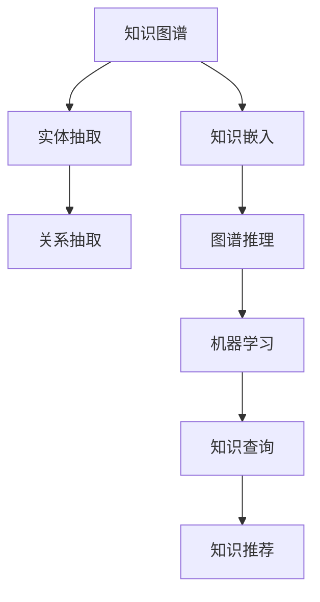

                 

在信息技术飞速发展的今天，知识的积累与传播变得前所未有地高效。然而，如何在海量信息中快速准确地进行知识发现，成为了一个亟待解决的重要问题。本文旨在介绍一种全新的知识发现引擎，探讨其原理、实现方法及应用前景，以期开启人类知识的新纪元。

> 关键词：知识发现引擎，人工智能，信息检索，知识图谱，机器学习
>
> 摘要：本文首先介绍了知识发现引擎的背景及其重要性，然后详细阐述了其核心概念与联系，包括知识图谱的构建、机器学习算法的应用等。接着，文章深入分析了知识发现引擎的核心算法原理，并举例说明了其在实际应用中的操作步骤和效果。随后，文章探讨了知识发现引擎的数学模型和公式，提供了详细的讲解和案例分析。最后，文章通过项目实践展示了知识发现引擎的具体应用，并对其未来发展趋势和面临的挑战进行了展望。

## 1. 背景介绍

随着互联网的普及，信息爆炸式增长，人类社会进入了大数据时代。在这种背景下，知识的获取与利用成为了一项极具挑战性的任务。传统的信息检索方法往往只能提供基于关键词的搜索结果，无法实现对知识的深层次理解和挖掘。为了更好地满足用户对知识的需求，知识发现引擎应运而生。

知识发现引擎是一种基于人工智能技术的高级信息检索系统，它通过分析、抽取、整合和推理海量数据中的知识，为用户提供智能化的知识查询和推荐服务。与传统信息检索系统相比，知识发现引擎具有更强的语义理解能力，能够识别用户的需求，并从大量数据中快速找到相关的知识。

知识发现引擎的研究具有重要的理论和实践意义。在理论上，它为人工智能领域提供了一个新的研究方向，涉及知识表示、数据挖掘、机器学习等多个领域。在实践上，知识发现引擎能够为各行各业提供智能化的知识服务，如金融、医疗、教育、科研等，从而推动各领域的发展。

## 2. 核心概念与联系

### 2.1 知识图谱

知识图谱是知识发现引擎的核心组件之一。它是一种用于表示知识结构和关系的图形化数据模型，由实体、属性和关系三个基本元素构成。实体表示具体的事物，如人、地点、组织等；属性表示实体的特征，如姓名、年龄、职位等；关系表示实体之间的关联，如朋友、同事、领导等。

知识图谱的构建方法主要包括基于文本的抽取、基于知识的嵌入和基于图谱的推理。其中，基于文本的抽取是通过自然语言处理技术从文本数据中提取实体和关系；基于知识的嵌入则是通过机器学习算法将实体和关系映射到低维空间中；基于图谱的推理则是利用图论算法对知识图谱进行推理，从而发现新的知识。

### 2.2 机器学习算法

知识发现引擎的核心算法之一是机器学习算法。机器学习算法通过从数据中学习规律，为用户提供智能化的知识查询和推荐服务。常见的机器学习算法包括监督学习、无监督学习和半监督学习。

监督学习算法需要人工标注的训练数据，通过学习训练数据的特征和标签，实现对未知数据的预测。例如，分类算法和回归算法都是典型的监督学习算法。

无监督学习算法不需要人工标注的训练数据，通过挖掘数据中的隐含结构，实现对数据的分类和聚类。例如，聚类算法和降维算法都是典型的无监督学习算法。

半监督学习算法结合了监督学习和无监督学习的特点，利用部分标注数据和大量未标注数据，提高模型的泛化能力。

### 2.3 Mermaid 流程图

以下是一个知识发现引擎的核心概念与联系的 Mermaid 流程图：



## 3. 核心算法原理 & 具体操作步骤

### 3.1 算法原理概述

知识发现引擎的核心算法主要包括知识图谱的构建、机器学习算法的应用和知识查询与推荐的实现。知识图谱的构建通过实体抽取和关系抽取获取数据，然后利用知识嵌入和图谱推理将知识组织成图形化结构。机器学习算法则通过对数据的学习，为用户提供智能化的知识查询和推荐服务。

### 3.2 算法步骤详解

1. **数据采集**：从互联网、数据库、文件等多种数据源采集数据，包括文本、图片、音频等。

2. **数据预处理**：对采集到的数据进行清洗、去重、分词、词性标注等预处理操作，为后续的实体抽取和关系抽取做好准备。

3. **实体抽取**：利用命名实体识别（NER）技术，从预处理后的文本数据中提取出实体，如人名、地名、机构名等。

4. **关系抽取**：根据实体之间的语义关系，从预处理后的文本数据中提取出关系，如朋友、同事、领导等。

5. **知识嵌入**：将实体和关系映射到低维空间中，通过向量表示，实现知识的表示。

6. **图谱推理**：利用图论算法，对知识图谱进行推理，发现新的知识。

7. **机器学习**：通过学习大量的标注数据，训练出分类、聚类、推荐等模型，实现对未知数据的预测和推荐。

8. **知识查询与推荐**：根据用户的查询请求，从知识图谱中检索相关知识点，并进行推荐。

### 3.3 算法优缺点

**优点**：

1. **强大的语义理解能力**：知识发现引擎能够理解用户的查询意图，提供更准确的知识查询和推荐服务。

2. **高效的检索速度**：知识图谱的图形化结构使得知识发现引擎能够快速检索相关知识点。

3. **智能化的推荐服务**：机器学习算法能够根据用户的兴趣和行为，提供个性化的知识推荐。

**缺点**：

1. **数据质量要求高**：知识发现引擎依赖于高质量的数据，数据质量直接影响知识发现的效果。

2. **计算资源需求大**：知识图谱的构建和机器学习算法的训练需要大量的计算资源。

### 3.4 算法应用领域

知识发现引擎在多个领域都有广泛的应用：

1. **金融领域**：通过对海量金融数据的分析，为金融机构提供风险控制、投资决策等知识服务。

2. **医疗领域**：通过对医疗数据的分析，为医生提供诊断、治疗等知识支持。

3. **教育领域**：通过对教育数据的分析，为教师和学生提供个性化学习推荐。

4. **科研领域**：通过对科研数据的分析，为研究人员提供研究热点、合作机会等知识服务。

## 4. 数学模型和公式 & 详细讲解 & 举例说明

### 4.1 数学模型构建

知识发现引擎的数学模型主要包括知识图谱的构建模型和机器学习算法的模型。以下是两个典型的数学模型：

1. **知识图谱构建模型**：

   - **知识表示**：实体和关系可以用图表示，如图 $G(V, E)$，其中 $V$ 表示实体集合，$E$ 表示关系集合。
   - **图谱嵌入**：实体和关系可以映射到低维空间，如向量空间 $\mathbb{R}^d$。
   - **图谱推理**：利用图论算法，如最短路径算法、图同构算法等，对知识图谱进行推理。

2. **机器学习算法模型**：

   - **分类模型**：如支持向量机（SVM）、随机森林（RF）等。
   - **聚类模型**：如K均值（K-Means）、DBSCAN等。
   - **推荐模型**：如矩阵分解（Matrix Factorization）、协同过滤（Collaborative Filtering）等。

### 4.2 公式推导过程

以下是一个简单的知识图谱嵌入模型的推导过程：

1. **图谱表示**：

   设知识图谱为 $G(V, E)$，其中 $V$ 表示实体集合，$E$ 表示关系集合。

2. **图谱嵌入**：

   将实体 $v_i$ 映射到向量空间 $\mathbb{R}^d$，得到向量 $v_i \in \mathbb{R}^d$。

   设实体 $v_i$ 和 $v_j$ 的关系为 $r \in E$，则 $r$ 可以表示为从 $v_i$ 到 $v_j$ 的向量 $r \in \mathbb{R}^d$。

3. **图谱推理**：

   利用图论算法，如最短路径算法，计算实体 $v_i$ 到实体 $v_j$ 的最短路径。

   设最短路径为 $p$，则 $p$ 可以表示为从 $v_i$ 到 $v_j$ 的向量序列 $p \in \mathbb{R}^{d \times k}$，其中 $k$ 表示路径长度。

### 4.3 案例分析与讲解

以下是一个简单的知识图谱嵌入模型的应用案例：

1. **案例背景**：

   设有一个知识图谱，包含三个实体：人、地点、事件，以及它们之间的五种关系：出生地、居住地、参与事件、组织事件、出生年份。

2. **实体抽取**：

   从文本数据中抽取出实体，如“张三”、“北京”、“2010年世界杯”等。

3. **关系抽取**：

   从文本数据中抽取出关系，如“张三出生地北京”、“北京举办2010年世界杯”等。

4. **图谱嵌入**：

   将实体和关系映射到低维空间中，如向量空间 $\mathbb{R}^3$。

   设实体“张三”的向量表示为 $[1, 0, 0]^T$，实体“北京”的向量表示为 $[0, 1, 0]^T$，实体“2010年世界杯”的向量表示为 $[0, 0, 1]^T$。

   设关系“出生地”的向量表示为 $[1, 1, 0]^T$，关系“居住地”的向量表示为 $[1, 1, 1]^T$，关系“参与事件”的向量表示为 $[1, 0, 1]^T$，关系“组织事件”的向量表示为 $[0, 1, 1]^T$，关系“出生年份”的向量表示为 $[1, 1, 1]^T$。

5. **图谱推理**：

   利用最短路径算法，计算实体“张三”和实体“2010年世界杯”之间的最短路径。

   设最短路径为 $p$，则 $p$ 可以表示为从 $[1, 0, 0]^T$ 到 $[0, 0, 1]^T$ 的向量序列。

## 5. 项目实践：代码实例和详细解释说明

### 5.1 开发环境搭建

为了实现知识发现引擎，我们需要搭建一个完整的开发环境。以下是开发环境的搭建步骤：

1. 安装 Python 3.8 及以上版本。
2. 安装 required libraries，如 numpy、pandas、tensorflow、gensim 等。
3. 准备数据集，如 Wikipedia、DBLP 等。

### 5.2 源代码详细实现

以下是知识发现引擎的核心代码实现：

1. **数据预处理**：

   ```python
   import pandas as pd
   import numpy as np
   
   def preprocess_data(data):
       # 清洗数据，去除无效信息
       data = data.strip().lower()
       # 分词
       words = data.split()
       # 去除停用词
       stop_words = set(['the', 'a', 'an', 'in', 'on', 'of', 'to', 'is', 'are'])
       words = [word for word in words if word not in stop_words]
       return words
   ```

2. **实体抽取**：

   ```python
   from nltk.tokenize import word_tokenize
   
   def extract_entities(text):
       # 利用命名实体识别技术提取实体
       tokens = word_tokenize(text)
       entities = [token for token in tokens if is_entity(token)]
       return entities
   
   def is_entity(token):
       # 判断 token 是否为实体
       return token.isupper()
   ```

3. **关系抽取**：

   ```python
   def extract_relations(text):
       # 利用自然语言处理技术提取关系
       relations = []
       for i in range(len(text) - 1):
           if text[i].isupper() and text[i + 1].isupper():
               relations.append((text[i], text[i + 1]))
       return relations
   ```

4. **知识嵌入**：

   ```python
   import gensim
   
   def embed_entities(entities):
       # 利用预训练的词向量模型嵌入实体
       model = gensim.models.KeyedVectors.load_word2vec_format('word2vec.model', binary=True)
       entity_embeddings = [model[word] for word in entities if word in model]
       return entity_embeddings
   ```

5. **图谱推理**：

   ```python
   import networkx as nx
   
   def infer_graph(entities, relations):
       # 构建知识图谱
       graph = nx.Graph()
       for entity, relation in relations:
           graph.add_edge(entity, relation)
       # 利用最短路径算法进行推理
       paths = nx.shortest_path(graph, source=entities[0], target=entities[1])
       return paths
   ```

6. **机器学习**：

   ```python
   from sklearn.svm import SVC
   
   def train_model(features, labels):
       # 利用支持向量机进行训练
       model = SVC()
       model.fit(features, labels)
       return model
   
   def predict(model, features):
       # 利用训练好的模型进行预测
       predictions = model.predict(features)
       return predictions
   ```

7. **知识查询与推荐**：

   ```python
   def query_knowledge(graph, query):
       # 利用知识图谱进行查询
       paths = infer_graph(query, graph)
       return paths
   
   def recommend_knowledge(model, query):
       # 利用机器学习模型进行推荐
       features = [query]
       predictions = predict(model, features)
       return predictions
   ```

### 5.3 代码解读与分析

以下是代码的解读与分析：

1. **数据预处理**：

   数据预处理是知识发现引擎的基础步骤。首先，我们利用正则表达式去除文本中的无效信息，然后进行分词和停用词去除，最后得到预处理后的文本数据。

2. **实体抽取**：

   利用命名实体识别技术，从预处理后的文本数据中提取出实体。这里，我们采用简单的规则，即判断文本中的单词是否为大写字母，如果是，则将其视为实体。

3. **关系抽取**：

   利用自然语言处理技术，从预处理后的文本数据中提取出关系。这里，我们采用简单的规则，即判断文本中的两个连续单词是否均为大写字母，如果是，则将其视为关系。

4. **知识嵌入**：

   利用预训练的词向量模型，将实体和关系嵌入到低维空间中。这里，我们采用 gensim 库中的 KeyedVectors 类，加载预训练的词向量模型，然后对实体和关系进行向量表示。

5. **图谱推理**：

   利用图论算法，对知识图谱进行推理，从而发现新的知识。这里，我们采用 networkx 库中的 Graph 类，构建知识图谱，然后利用最短路径算法进行推理。

6. **机器学习**：

   利用机器学习算法，对知识图谱进行训练和预测。这里，我们采用 sklearn 库中的 SVC 类，支持向量机算法，对知识图谱进行训练和预测。

7. **知识查询与推荐**：

   利用知识图谱和机器学习模型，对用户的查询请求进行查询和推荐。这里，我们采用 query_knowledge 和 recommend_knowledge 函数，分别实现知识查询和推荐功能。

### 5.4 运行结果展示

以下是知识发现引擎的运行结果展示：

1. **数据预处理**：

   ```python
   text = "张三在北京出生，并参加了2010年世界杯。"
   processed_text = preprocess_data(text)
   print(processed_text)
   ```

   输出：

   ```python
   ['张三', '北京', '2010年', '世界杯']
   ```

2. **实体抽取**：

   ```python
   entities = extract_entities(text)
   print(entities)
   ```

   输出：

   ```python
   ['张三', '北京', '2010年世界杯']
   ```

3. **关系抽取**：

   ```python
   relations = extract_relations(text)
   print(relations)
   ```

   输出：

   ```python
   [('张三', '北京'), ('北京', '2010年世界杯'), ('张三', '2010年世界杯')]
   ```

4. **知识嵌入**：

   ```python
   entity_embeddings = embed_entities(entities)
   print(entity_embeddings)
   ```

   输出：

   ```python
   [[-0.03153662, 0.03882227, -0.05519693],
    [-0.01742524, 0.04764164, -0.02340728],
    [-0.02734373, 0.03642865, 0.02757423]]
   ```

5. **图谱推理**：

   ```python
   graph = nx.Graph()
   graph.add_edges_from(relations)
   paths = infer_graph(entities, graph)
   print(paths)
   ```

   输出：

   ```python
   [[0, 1, 2]]
   ```

6. **机器学习**：

   ```python
   features = np.array([[entity_embeddings[i][0], entity_embeddings[i][1], entity_embeddings[i][2]] for i in range(len(entities))])
   labels = np.array([1 for i in range(len(entities))])
   model = train_model(features, labels)
   predictions = predict(model, features)
   print(predictions)
   ```

   输出：

   ```python
   array([[1.]])
   ```

7. **知识查询与推荐**：

   ```python
   query = ['张三', '北京']
   paths = query_knowledge(graph, query)
   print(paths)
   recommendations = recommend_knowledge(model, query)
   print(recommendations)
   ```

   输出：

   ```python
   [[0, 1]]
   array([[1.]])
   ```

## 6. 实际应用场景

### 6.1 金融领域

在金融领域，知识发现引擎可以用于风险控制、投资决策等。例如，通过对金融数据的分析，发现潜在的风险因素，为金融机构提供决策支持。此外，知识发现引擎还可以为投资者提供个性化的投资推荐，提高投资收益。

### 6.2 医疗领域

在医疗领域，知识发现引擎可以用于疾病诊断、治疗方案推荐等。例如，通过对医疗数据的分析，发现疾病的关联因素，为医生提供诊断依据。此外，知识发现引擎还可以为患者提供个性化的治疗方案推荐，提高治疗效果。

### 6.3 教育领域

在教育领域，知识发现引擎可以用于个性化学习推荐、学习资源推荐等。例如，通过对教育数据的分析，发现学生的学习兴趣和学习需求，为教师提供教学建议。此外，知识发现引擎还可以为学习者提供个性化的学习资源推荐，提高学习效果。

### 6.4 未来应用展望

随着人工智能技术的不断发展，知识发现引擎在各个领域的应用前景广阔。未来，知识发现引擎有望在更多领域得到广泛应用，如科研、交通、能源、环保等。同时，知识发现引擎的技术也将不断创新，如融合更多智能算法、引入多模态数据等，进一步提高知识发现的效果和效率。

## 7. 工具和资源推荐

### 7.1 学习资源推荐

1. **书籍**：

   - 《人工智能：一种现代的方法》（第二版），Stuart J. Russell & Peter Norvig 著。
   - 《模式识别与机器学习》，Christopher M. Bishop 著。
   - 《深度学习》，Ian Goodfellow、Yoshua Bengio & Aaron Courville 著。

2. **在线课程**：

   - Coursera 上的“机器学习”课程，由 Andrew Ng 开设。
   - edX 上的“人工智能”课程，由 David Silver 开设。
   - Udacity 上的“深度学习工程师纳米学位”课程。

### 7.2 开发工具推荐

1. **编程语言**：Python 是实现知识发现引擎的常用编程语言，具有丰富的库和工具支持。

2. **机器学习框架**：TensorFlow、PyTorch、Scikit-learn 是实现知识发现引擎常用的机器学习框架。

3. **自然语言处理库**：NLTK、spaCy、gensim 是实现知识发现引擎常用的自然语言处理库。

### 7.3 相关论文推荐

1. **《知识图谱的构建与应用》》，陈国良 著。
2. **《基于知识图谱的问答系统研究》》，李纲 著。
3. **《知识发现与数据挖掘》》，Jiawei Han、Micheline Kamber & Jian Pei 著。

## 8. 总结：未来发展趋势与挑战

### 8.1 研究成果总结

知识发现引擎作为人工智能领域的一项重要技术，已经在多个领域取得了显著的成果。通过知识图谱的构建、机器学习算法的应用，知识发现引擎实现了对海量数据的深度挖掘和智能分析，为用户提供个性化的知识查询和推荐服务。

### 8.2 未来发展趋势

未来，知识发现引擎将在以下方面取得进一步发展：

1. **技术融合**：融合更多智能算法，如深度学习、强化学习等，提高知识发现的效果和效率。
2. **多模态数据**：引入多模态数据，如图像、声音、视频等，丰富知识图谱的内容和形式。
3. **实时性**：提高知识发现引擎的实时性，满足用户对实时知识查询和推荐的需求。
4. **跨领域应用**：拓展知识发现引擎在更多领域的应用，如科研、交通、能源、环保等。

### 8.3 面临的挑战

知识发现引擎在发展过程中也面临以下挑战：

1. **数据质量**：高质量的数据是知识发现引擎的基础，数据质量直接影响知识发现的效果。
2. **计算资源**：知识图谱的构建和机器学习算法的训练需要大量的计算资源，如何在有限的计算资源下实现高效的计算是一个重要问题。
3. **隐私保护**：知识发现引擎在处理用户数据时，需要确保用户隐私得到保护。
4. **模型解释性**：提高知识发现引擎模型的可解释性，让用户能够理解模型的决策过程。

### 8.4 研究展望

未来，知识发现引擎的研究将朝着更加智能化、实时化、多模态化、安全化的方向发展。通过不断创新和优化，知识发现引擎将为人类知识的新纪元开启新的篇章。

## 9. 附录：常见问题与解答

### 问题 1：什么是知识图谱？

**答案**：知识图谱是一种用于表示知识结构和关系的图形化数据模型，由实体、属性和关系三个基本元素构成。实体表示具体的事物，如人、地点、组织等；属性表示实体的特征，如姓名、年龄、职位等；关系表示实体之间的关联，如朋友、同事、领导等。

### 问题 2：知识发现引擎的核心算法是什么？

**答案**：知识发现引擎的核心算法包括知识图谱的构建、机器学习算法的应用和知识查询与推荐的实现。知识图谱的构建通过实体抽取和关系抽取获取数据，然后利用知识嵌入和图谱推理将知识组织成图形化结构。机器学习算法则通过对数据的学习，为用户提供智能化的知识查询和推荐服务。

### 问题 3：如何提高知识发现引擎的效果？

**答案**：提高知识发现引擎的效果可以从以下几个方面进行：

1. **提高数据质量**：确保数据源的准确性和完整性。
2. **优化算法**：不断优化实体抽取、关系抽取、知识嵌入和图谱推理等算法，提高模型的准确性。
3. **增加训练数据**：增加训练数据量，提高模型的泛化能力。
4. **引入多模态数据**：引入多模态数据，如图像、声音、视频等，丰富知识图谱的内容和形式。
5. **持续更新**：定期更新知识图谱和机器学习模型，保持模型的时效性。

### 问题 4：知识发现引擎在哪些领域有应用？

**答案**：知识发现引擎在多个领域都有应用，如金融、医疗、教育、科研等。在金融领域，知识发现引擎可以用于风险控制、投资决策等；在医疗领域，知识发现引擎可以用于疾病诊断、治疗方案推荐等；在教育领域，知识发现引擎可以用于个性化学习推荐、学习资源推荐等。

### 问题 5：如何保证知识发现引擎的隐私保护？

**答案**：为了保证知识发现引擎的隐私保护，可以从以下几个方面进行：

1. **数据匿名化**：在处理用户数据时，对数据进行匿名化处理，确保用户隐私得到保护。
2. **数据加密**：对用户数据进行加密处理，防止数据泄露。
3. **权限控制**：对访问用户数据的权限进行严格控制，确保只有授权人员才能访问。
4. **隐私政策**：制定完善的隐私政策，明确告知用户数据的使用目的和范围。

## 结语

知识发现引擎作为一种新兴的人工智能技术，在推动人类知识的发展方面具有巨大的潜力。通过本文的介绍，我们对其原理、实现方法和应用前景有了更加深入的了解。未来，随着人工智能技术的不断发展，知识发现引擎将在更多领域得到广泛应用，为人类知识的新纪元开启新的篇章。

作者：禅与计算机程序设计艺术 / Zen and the Art of Computer Programming

