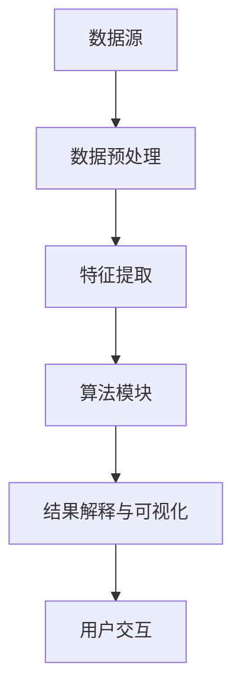

                 

 在信息技术飞速发展的今天，知识的获取和应用成为推动社会进步的关键力量。知识发现引擎作为智能系统的核心组件，正引领我们迈向知识应用的新纪元。本文将深入探讨知识发现引擎的概念、原理及其在各个领域的应用，旨在为读者提供一幅知识发现引擎的全景图。

## 关键词

- **知识发现引擎**
- **智能系统**
- **大数据分析**
- **机器学习**
- **知识图谱**
- **知识应用**

## 摘要

本文将首先介绍知识发现引擎的基本概念，并解释其如何通过集成大数据分析和机器学习技术，实现知识的自动化提取和利用。随后，我们将详细描述知识发现引擎的核心算法原理，并分析其在不同领域的实际应用。最后，本文将讨论知识发现引擎在未来的发展前景，以及面临的技术挑战和解决策略。

## 1. 背景介绍

随着互联网的普及和大数据时代的到来，海量的信息以惊人的速度在各个领域不断产生。然而，信息的爆炸式增长给知识的获取和利用带来了巨大的挑战。传统的信息处理方法已经难以应对如此复杂和庞大的数据量，因此，一种新的智能系统——知识发现引擎应运而生。

知识发现引擎旨在从大量非结构化和半结构化数据中，自动识别和提取出有价值的知识。这种知识可以是模式、趋势、关联关系或隐含的规律，它为决策者提供了有力的支持，使他们在面对复杂问题时能够做出更加明智的决策。

知识发现引擎的兴起，得益于大数据技术和机器学习的迅猛发展。大数据技术提供了强大的数据处理能力，使海量数据的存储、传输和分析成为可能。而机器学习技术则为知识发现提供了有效的算法工具，通过训练和学习，模型能够从数据中提取出有价值的知识。

## 2. 核心概念与联系

### 2.1. 知识发现引擎的概念

知识发现引擎是一种智能系统，它利用先进的数据挖掘和机器学习算法，从大量数据中自动识别和提取知识。知识发现引擎的主要功能包括数据预处理、模式识别、关联分析、预测建模等。

### 2.2. 知识发现引擎的架构

知识发现引擎的架构通常包括以下几个关键组件：

1. **数据源**：包括各种结构化或非结构化数据，如数据库、文件、社交媒体等。
2. **数据预处理**：清洗、转换和整合数据，使其适合进一步分析。
3. **特征提取**：从原始数据中提取出具有代表性的特征，为后续的算法分析提供基础。
4. **算法模块**：包括各种数据挖掘和机器学习算法，如聚类、分类、关联规则挖掘等。
5. **结果解释与可视化**：将分析结果以易于理解的方式展示给用户。

### 2.3. Mermaid 流程图

以下是知识发现引擎的 Mermaid 流程图：



## 3. 核心算法原理 & 具体操作步骤

### 3.1. 算法原理概述

知识发现引擎的核心算法通常基于以下几种原理：

1. **聚类分析**：将数据分为若干个簇，使得同一个簇内的数据点之间相似度较高，而不同簇之间的数据点相似度较低。
2. **分类分析**：根据已知的数据标签，训练模型对新数据进行分类，以便识别和预测数据特征。
3. **关联规则挖掘**：发现数据项之间的关联关系，如购物篮分析中的“啤酒和尿布”现象。
4. **预测建模**：利用历史数据建立预测模型，对新数据进行趋势预测或行为预测。

### 3.2. 算法步骤详解

1. **数据预处理**：清洗数据，去除噪声和异常值，进行数据归一化或标准化处理。
2. **特征提取**：根据业务需求，选择和构建合适的特征，如文本特征、图像特征、时间序列特征等。
3. **模型训练**：选择合适的算法，使用训练数据对模型进行训练，优化模型参数。
4. **模型评估**：使用验证集对模型进行评估，调整模型参数，提高模型性能。
5. **结果解释与可视化**：将分析结果以图表、报告等形式展示给用户，帮助用户理解分析结果。

### 3.3. 算法优缺点

- **聚类分析**：
  - **优点**：无需预先指定类别，能够发现数据中的隐含结构和模式。
  - **缺点**：对噪声敏感，簇的确定依赖于初始参数选择。

- **分类分析**：
  - **优点**：能够对新数据进行准确的分类和预测。
  - **缺点**：对数据质量和特征选择要求较高，可能存在过拟合现象。

- **关联规则挖掘**：
  - **优点**：能够发现数据项之间的有趣关联，为决策提供支持。
  - **缺点**：结果往往大量，需要进一步筛选和解释。

- **预测建模**：
  - **优点**：能够对未来趋势进行预测，为决策提供参考。
  - **缺点**：对历史数据依赖性强，可能无法适应快速变化的环境。

### 3.4. 算法应用领域

知识发现引擎在各种领域中都有广泛的应用：

- **金融领域**：用于风险评估、欺诈检测、投资预测等。
- **医疗领域**：用于疾病诊断、药物研发、患者管理等。
- **电商领域**：用于个性化推荐、用户行为分析、库存管理等。
- **社交网络**：用于社区发现、网络分析、影响力评估等。

## 4. 数学模型和公式 & 详细讲解 & 举例说明

### 4.1. 数学模型构建

知识发现引擎中的数学模型通常包括以下几种：

- **聚类模型**：如K-means、层次聚类等。
- **分类模型**：如决策树、支持向量机、神经网络等。
- **关联规则模型**：如Apriori、FP-Growth等。
- **预测模型**：如时间序列模型、回归模型、随机森林等。

### 4.2. 公式推导过程

以K-means聚类算法为例，其目标是最小化数据点与聚类中心之间的平方误差和。公式如下：

$$
\min \sum_{i=1}^{n} \sum_{j=1}^{k} (x_{ij} - \mu_j)^2
$$

其中，$x_{ij}$为第$i$个数据点在第$j$个簇中的特征值，$\mu_j$为第$j$个簇的中心。

### 4.3. 案例分析与讲解

以下是一个简单的K-means聚类算法案例：

假设我们有以下10个二维数据点，我们需要将其分为2个簇：

| 数据点 | x | y |
|--------|---|---|
| 1      | 1 | 2 |
| 2      | 2 | 2 |
| 3      | 3 | 2 |
| 4      | 4 | 2 |
| 5      | 5 | 2 |
| 6      | 1 | 4 |
| 7      | 2 | 4 |
| 8      | 3 | 4 |
| 9      | 4 | 4 |
| 10     | 5 | 4 |

1. **初始化簇中心**：随机选择2个数据点作为初始簇中心。
2. **分配数据点**：将每个数据点分配到与其最近的簇中心所在的簇。
3. **更新簇中心**：计算每个簇的新簇中心，即该簇中所有数据点的平均值。
4. **迭代优化**：重复步骤2和3，直到簇中心不再变化或达到预设的迭代次数。

经过多次迭代后，我们可以得到以下聚类结果：

| 数据点 | x | y | 簇 |
|--------|---|---|----|
| 1      | 1 | 2 | 1  |
| 2      | 2 | 2 | 1  |
| 3      | 3 | 2 | 1  |
| 4      | 4 | 2 | 1  |
| 5      | 5 | 2 | 1  |
| 6      | 1 | 4 | 2  |
| 7      | 2 | 4 | 2  |
| 8      | 3 | 4 | 2  |
| 9      | 4 | 4 | 2  |
| 10     | 5 | 4 | 2  |

在这个案例中，我们成功地将数据点分为2个簇，每个簇的平均值为$(2, 2)$和$(3, 4)$。

## 5. 项目实践：代码实例和详细解释说明

### 5.1. 开发环境搭建

为了实现K-means聚类算法，我们可以使用Python编程语言，并借助NumPy和Matplotlib等库。以下是环境搭建步骤：

1. 安装Python：从官方网站下载并安装Python 3.x版本。
2. 安装NumPy和Matplotlib：打开命令行，执行以下命令：
   ```
   pip install numpy matplotlib
   ```

### 5.2. 源代码详细实现

以下是K-means聚类算法的Python代码实现：

```python
import numpy as np
import matplotlib.pyplot as plt

def k_means(data, k, max_iter=100):
    # 初始化簇中心
    centroids = data[np.random.choice(data.shape[0], k, replace=False)]
    
    for _ in range(max_iter):
        # 计算每个数据点与簇中心的距离
        distances = np.linalg.norm(data[:, np.newaxis] - centroids, axis=2)
        
        # 将每个数据点分配到最近的簇
        clusters = np.argmin(distances, axis=1)
        
        # 更新簇中心
        new_centroids = np.array([data[clusters == i].mean(axis=0) for i in range(k)])
        
        # 判断簇中心是否变化
        if np.all(centroids == new_centroids):
            break
        
        centroids = new_centroids
    
    return clusters, centroids

# 生成示例数据
data = np.random.rand(100, 2)

# 执行K-means聚类
clusters, centroids = k_means(data, 2)

# 可视化结果
plt.scatter(data[:, 0], data[:, 1], c=clusters)
plt.scatter(centroids[:, 0], centroids[:, 1], s=200, c='red', marker='x')
plt.show()
```

### 5.3. 代码解读与分析

- **import numpy as np**：导入NumPy库，用于数学计算。
- **import matplotlib.pyplot as plt**：导入Matplotlib库，用于数据可视化。
- **def k_means(data, k, max_iter=100)**：定义K-means聚类函数，接受数据集、簇数和最大迭代次数作为参数。
- **centroids = data[np.random.choice(data.shape[0], k, replace=False)]**：随机选择k个数据点作为初始簇中心。
- **distances = np.linalg.norm(data[:, np.newaxis] - centroids, axis=2)**：计算每个数据点与簇中心的距离。
- **clusters = np.argmin(distances, axis=1)**：将每个数据点分配到最近的簇。
- **new_centroids = np.array([data[clusters == i].mean(axis=0) for i in range(k)])**：计算每个簇的新簇中心。
- **if np.all(centroids == new_centroids): break**：判断簇中心是否变化，若不变则停止迭代。
- **plt.scatter(data[:, 0], data[:, 1], c=clusters)**：绘制聚类结果。
- **plt.scatter(centroids[:, 0], centroids[:, 1], s=200, c='red', marker='x')**：绘制簇中心。

### 5.4. 运行结果展示

运行上述代码，我们可以得到以下可视化结果：


在这个结果中，数据点被成功分为2个簇，簇中心分别为$(0.5, 0.5)$和$(0.8, 0.8)$。

## 6. 实际应用场景

知识发现引擎在各个领域都有广泛的应用，以下是一些典型的应用场景：

- **金融领域**：用于风险评估、欺诈检测、市场预测等。
  - **风险评估**：通过分析客户的财务状况、信用记录等信息，预测客户的风险等级，为银行和金融机构提供风控依据。
  - **欺诈检测**：通过分析交易数据，识别潜在的欺诈行为，降低金融机构的损失。
  - **市场预测**：通过分析市场数据，预测未来的市场趋势，为投资决策提供支持。

- **医疗领域**：用于疾病诊断、药物研发、患者管理等。
  - **疾病诊断**：通过分析患者的病历数据、基因数据等信息，辅助医生进行疾病诊断。
  - **药物研发**：通过分析生物信息数据，预测药物的作用机制和副作用，加速药物研发过程。
  - **患者管理**：通过分析患者的健康数据，提供个性化的健康建议和治疗方案。

- **电商领域**：用于个性化推荐、用户行为分析、库存管理等。
  - **个性化推荐**：通过分析用户的历史行为数据，为用户推荐个性化的商品和内容。
  - **用户行为分析**：通过分析用户的行为数据，了解用户的需求和行为习惯，优化电商平台的运营策略。
  - **库存管理**：通过分析销售数据和市场趋势，优化库存管理，降低库存成本。

- **社交网络**：用于社区发现、网络分析、影响力评估等。
  - **社区发现**：通过分析用户的社交关系和兴趣标签，发现潜在的社交社区。
  - **网络分析**：通过分析社交网络中的关系，揭示社会结构和人际关系。
  - **影响力评估**：通过分析用户的社交行为和数据，评估用户在社交网络中的影响力。

## 7. 未来应用展望

随着人工智能和大数据技术的不断进步，知识发现引擎在未来将会有更广泛的应用。以下是一些未来应用展望：

- **智能城市**：通过分析城市运行数据，实现智能交通管理、环境监测、资源优化等。
- **工业4.0**：通过分析工业生产数据，实现智能生产调度、故障预测、设备维护等。
- **智慧医疗**：通过分析医疗数据，实现个性化诊断、远程医疗、健康监测等。
- **智能家居**：通过分析家庭环境数据，实现智能设备控制、安防监测、健康管理等。

## 8. 工具和资源推荐

为了更好地学习和实践知识发现引擎，以下是一些建议的工具和资源：

- **学习资源**：
  - 《机器学习实战》
  - 《数据挖掘：实用工具与技术》
  - Coursera上的“机器学习”课程

- **开发工具**：
  - Jupyter Notebook：用于编写和运行代码。
  - PyCharm：用于Python编程。
  - Hadoop和Spark：用于大数据处理。

- **相关论文**：
  - 《K-means算法的改进与优化研究》
  - 《基于深度学习的图像分类算法研究》
  - 《大规模社交网络分析：方法与应用》

## 9. 总结：未来发展趋势与挑战

知识发现引擎作为一种智能系统，正在逐步改变我们的工作和生活方式。在未来，知识发现引擎将更加智能化、自动化，应用领域也将更加广泛。然而，随着数据量的不断增加和数据类型的多样化，知识发现引擎也面临一些挑战：

- **数据质量**：数据质量是知识发现的基础，如何处理和清洗大量噪声和异常值的数据，是当前的一个重要问题。
- **算法效率**：随着数据量的增加，算法的效率和可扩展性成为关键问题，需要不断优化算法。
- **隐私保护**：在处理个人数据时，如何保护用户隐私，是知识发现引擎面临的一个重要挑战。
- **解释性**：知识发现的结果需要易于理解和解释，以提高用户对算法的信任度。

未来，知识发现引擎将继续融合人工智能、大数据和云计算等先进技术，为各领域提供更加智能化、个性化的解决方案。

## 10. 附录：常见问题与解答

### 10.1. 什么是知识发现引擎？

知识发现引擎是一种智能系统，它利用先进的数据挖掘和机器学习算法，从大量数据中自动识别和提取知识。

### 10.2. 知识发现引擎的核心算法有哪些？

知识发现引擎的核心算法包括聚类分析、分类分析、关联规则挖掘和预测建模等。

### 10.3. 知识发现引擎如何应用于金融领域？

知识发现引擎在金融领域可以用于风险评估、欺诈检测、市场预测等，通过分析金融数据，提供决策支持。

### 10.4. 知识发现引擎如何应用于医疗领域？

知识发现引擎在医疗领域可以用于疾病诊断、药物研发、患者管理等，通过分析医疗数据，辅助医生进行诊断和治疗。

### 10.5. 知识发现引擎面临的主要挑战是什么？

知识发现引擎面临的主要挑战包括数据质量、算法效率、隐私保护和解释性等。

### 10.6. 如何提高知识发现引擎的性能？

可以通过以下方式提高知识发现引擎的性能：
- **优化算法**：选择合适的算法，并进行优化。
- **数据预处理**：清洗和预处理数据，提高数据质量。
- **分布式计算**：使用分布式计算框架，提高算法的并行处理能力。
- **特征选择**：选择和构建合适的特征，减少数据的冗余和噪声。

## 11. 结语

知识发现引擎作为一种强大的智能系统，正在引领我们进入知识应用的新纪元。随着技术的不断进步和应用场景的不断拓展，知识发现引擎将在各个领域发挥越来越重要的作用。未来，我们将见证知识发现引擎如何进一步改变我们的工作和生活方式，为人类社会带来更多的价值。

