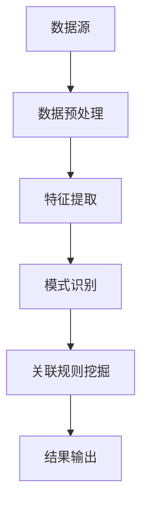

                 

关键词：知识发现引擎、内容升级、创意产业、算法、数学模型、项目实践、未来展望

摘要：本文旨在探讨知识发现引擎在创意产业中的应用及其对内容升级的推动作用。通过介绍知识发现引擎的核心概念、算法原理、数学模型，以及项目实践中的代码实例和运行结果，分析其实际应用场景和未来发展方向，为推动创意产业的内容升级提供新的思路和方法。

## 1. 背景介绍

在信息爆炸的时代，数据的数量呈指数级增长，而从中挖掘有价值的信息变得越来越困难。创意产业，作为知识经济的重要组成部分，其核心在于创新和创意的持续输出。然而，创意的源泉往往依赖于对大量数据的深入理解和洞察。知识发现引擎（Knowledge Discovery Engine，简称KDE）应运而生，旨在从海量数据中自动识别出潜在的模式、趋势和关联，为创意产业的决策提供有力支持。

知识发现引擎的出现，不仅能够提高数据挖掘的效率，还能够帮助创意产业实现内容升级。通过引入先进的人工智能和机器学习技术，知识发现引擎能够自动从数据中提取有价值的信息，为创意工作者提供灵感来源，从而提升创意产业的整体竞争力。

## 2. 核心概念与联系

知识发现引擎（KDE）的核心概念包括数据预处理、特征提取、模式识别、关联规则挖掘等。以下是一个简化的Mermaid流程图，展示知识发现引擎的工作流程。



### 2.1 数据预处理

数据预处理是知识发现引擎的第一步，其目的是对原始数据进行清洗、转换和归一化，以便后续的特征提取和分析。数据预处理的过程通常包括以下步骤：

- 数据清洗：去除重复数据、处理缺失值和异常值；
- 数据转换：将数据转换为适合挖掘算法的形式，如数值化、编码等；
- 数据归一化：将数据缩放到相同的尺度，以便不同特征之间的比较。

### 2.2 特征提取

特征提取是从原始数据中提取出具有代表性的特征子集的过程。特征提取的目的是减少数据维度，同时保持数据的本质特征。常见的特征提取方法包括：

- 统计特征：如均值、方差、标准差等；
- 文本特征：如词频、词向量、主题模型等；
- 图特征：如节点度、边权、聚类系数等。

### 2.3 模式识别

模式识别是知识发现引擎的核心步骤，其目标是自动识别出数据中的潜在模式、趋势和关联。常见的模式识别算法包括：

- 分类算法：如支持向量机、决策树、随机森林等；
- 聚类算法：如K均值、层次聚类、DBSCAN等；
- 关联规则挖掘算法：如Apriori算法、FP-growth算法等。

### 2.4 关联规则挖掘

关联规则挖掘是知识发现引擎中用于发现数据之间关联性的方法。其核心思想是挖掘出频繁出现的关联规则，如“A购买B”、“C导致D”等。常见的关联规则挖掘算法包括Apriori算法和FP-growth算法。

## 3. 核心算法原理 & 具体操作步骤

### 3.1 算法原理概述

知识发现引擎的核心算法包括数据预处理、特征提取、模式识别和关联规则挖掘。以下是对这些算法原理的概述。

#### 3.1.1 数据预处理

数据预处理是知识发现引擎的基础步骤。其主要原理是通过清洗、转换和归一化数据，使其满足后续挖掘算法的要求。

#### 3.1.2 特征提取

特征提取是知识发现引擎的关键步骤。其主要原理是从原始数据中提取出具有代表性的特征子集，以降低数据维度，同时保持数据的本质特征。

#### 3.1.3 模式识别

模式识别是知识发现引擎的核心步骤。其主要原理是通过分类、聚类和关联规则挖掘等算法，自动识别出数据中的潜在模式、趋势和关联。

#### 3.1.4 关联规则挖掘

关联规则挖掘是知识发现引擎中用于发现数据之间关联性的方法。其主要原理是通过挖掘频繁出现的关联规则，揭示数据之间的内在联系。

### 3.2 算法步骤详解

#### 3.2.1 数据预处理

1. 数据清洗：去除重复数据、处理缺失值和异常值；
2. 数据转换：将数据转换为适合挖掘算法的形式，如数值化、编码等；
3. 数据归一化：将数据缩放到相同的尺度，以便不同特征之间的比较。

#### 3.2.2 特征提取

1. 统计特征提取：计算数据的均值、方差、标准差等；
2. 文本特征提取：使用词频、词向量、主题模型等方法提取文本特征；
3. 图特征提取：计算节点的度、边的权重、聚类系数等。

#### 3.2.3 模式识别

1. 分类算法：训练分类模型，如支持向量机、决策树、随机森林等；
2. 聚类算法：执行聚类算法，如K均值、层次聚类、DBSCAN等；
3. 关联规则挖掘：使用Apriori算法或FP-growth算法挖掘关联规则。

#### 3.2.4 关联规则挖掘

1. 频繁项集挖掘：使用Apriori算法或FP-growth算法挖掘频繁项集；
2. 生成关联规则：从频繁项集中生成关联规则；
3. 规则评估：评估关联规则的置信度、支持度等。

### 3.3 算法优缺点

#### 3.3.1 数据预处理

**优点**：数据预处理能够提高后续挖掘算法的效率，降低数据维度，同时保证数据的一致性和完整性。

**缺点**：数据预处理可能引入额外的计算复杂度，且对于异常值和缺失值的处理方法可能影响挖掘结果。

#### 3.3.2 特征提取

**优点**：特征提取能够从原始数据中提取出具有代表性的特征子集，降低数据维度，提高挖掘算法的性能。

**缺点**：特征提取可能丢失原始数据中的部分信息，且特征选择方法可能影响挖掘结果。

#### 3.3.3 模式识别

**优点**：模式识别能够自动识别数据中的潜在模式、趋势和关联，提高数据挖掘的效率。

**缺点**：模式识别可能产生过拟合现象，且对于不同类型的数据可能需要不同的模式识别算法。

#### 3.3.4 关联规则挖掘

**优点**：关联规则挖掘能够揭示数据之间的内在联系，提供决策支持。

**缺点**：关联规则挖掘可能产生大量的冗余规则，且规则评估标准可能影响挖掘结果。

### 3.4 算法应用领域

知识发现引擎在创意产业中具有广泛的应用领域，包括但不限于：

- 内容推荐：通过分析用户行为数据，为用户提供个性化的内容推荐；
- 营销策略：通过挖掘用户与产品之间的关联，制定有效的营销策略；
- 用户体验优化：通过分析用户行为数据，优化网站或应用的用户体验；
- 创意设计：通过分析数据，为设计师提供灵感，提高创意设计的质量。

## 4. 数学模型和公式 & 详细讲解 & 举例说明

### 4.1 数学模型构建

在知识发现引擎中，常见的数学模型包括分类模型、聚类模型和关联规则模型。以下分别介绍这些模型的构建方法。

#### 4.1.1 分类模型

分类模型是一种将数据分为不同类别的模型。其构建方法主要包括以下步骤：

1. 数据预处理：对原始数据进行清洗、转换和归一化；
2. 特征提取：从原始数据中提取出具有代表性的特征子集；
3. 模型训练：使用训练数据训练分类模型，如支持向量机、决策树、随机森林等；
4. 模型评估：使用测试数据评估分类模型的性能，如准确率、召回率、F1值等。

#### 4.1.2 聚类模型

聚类模型是一种将数据分为多个簇的模型。其构建方法主要包括以下步骤：

1. 数据预处理：对原始数据进行清洗、转换和归一化；
2. 特征提取：从原始数据中提取出具有代表性的特征子集；
3. 聚类算法：执行聚类算法，如K均值、层次聚类、DBSCAN等；
4. 聚类评估：使用内部评估指标，如轮廓系数、 silhouette系数等评估聚类结果。

#### 4.1.3 关联规则模型

关联规则模型是一种挖掘数据之间关联性的模型。其构建方法主要包括以下步骤：

1. 频繁项集挖掘：使用Apriori算法或FP-growth算法挖掘频繁项集；
2. 生成关联规则：从频繁项集中生成关联规则；
3. 规则评估：使用支持度、置信度等评估指标评估关联规则。

### 4.2 公式推导过程

以下分别介绍分类模型、聚类模型和关联规则模型的数学公式推导过程。

#### 4.2.1 分类模型

分类模型的数学公式主要涉及分类器的训练和预测过程。以下以支持向量机（SVM）为例，介绍其数学公式推导过程。

1. 分类器训练：

$$
y = \text{sign}(\omega \cdot x + b)
$$

其中，$y$为类别标签，$\omega$为权重向量，$x$为特征向量，$b$为偏置。

2. 分类器预测：

$$
\hat{y} = \text{sign}(\omega \cdot x + b)
$$

其中，$\hat{y}$为预测的类别标签。

#### 4.2.2 聚类模型

聚类模型的数学公式主要涉及聚类算法的迭代过程。以下以K均值算法为例，介绍其数学公式推导过程。

1. 初始聚类中心：

$$
\mu_i = \frac{1}{n}\sum_{j=1}^{n} x_{ij}
$$

其中，$\mu_i$为第$i$个聚类中心，$x_{ij}$为第$i$个数据点在第$j$个特征上的取值。

2. 聚类中心更新：

$$
\mu_i = \frac{1}{n}\sum_{j=1}^{n} x_{ij} \quad \text{if } x_j \in C_i
$$

其中，$C_i$为第$i$个聚类。

#### 4.2.3 关联规则模型

关联规则模型的数学公式主要涉及频繁项集挖掘和关联规则生成过程。以下以Apriori算法为例，介绍其数学公式推导过程。

1. 频繁项集挖掘：

$$
\text{support}(X) = \frac{\text{count}(X)}{N}
$$

其中，$X$为项集，$\text{count}(X)$为项集$X$在数据库中的出现次数，$N$为数据库中的总记录数。

2. 关联规则生成：

$$
\text{confidence}(A \rightarrow B) = \frac{\text{count}(A \cup B)}{\text{count}(A)}
$$

其中，$A$和$B$为项集，$\text{count}(A \cup B)$为项集$A$和$B$同时出现的次数，$\text{count}(A)$为项集$A$的出现次数。

### 4.3 案例分析与讲解

以下通过一个简单的案例，对分类模型、聚类模型和关联规则模型进行详细讲解。

#### 4.3.1 分类模型案例

假设我们有一个包含100个数据点的二分类问题，数据点由两个特征组成，分别是$x_1$和$x_2$。我们使用支持向量机（SVM）作为分类模型。

1. 数据预处理：对数据进行归一化处理，使得$x_1$和$x_2$的取值范围在[0, 1]之间。

2. 特征提取：从原始数据中提取出$x_1$和$x_2$作为特征子集。

3. 模型训练：使用训练数据训练支持向量机分类模型。

4. 模型评估：使用测试数据评估分类模型的性能，如准确率、召回率、F1值等。

假设我们得到的支持向量机分类模型的决策函数为：

$$
y = \text{sign}(\omega_1 x_1 + \omega_2 x_2 + b)
$$

其中，$\omega_1$、$\omega_2$和$b$为模型参数。

5. 模型预测：对于新的数据点$x'$，使用决策函数预测其类别标签。

$$
\hat{y} = \text{sign}(\omega_1 x_1' + \omega_2 x_2' + b)
$$

#### 4.3.2 聚类模型案例

假设我们有一个包含100个数据点的聚类问题，数据点由两个特征组成，分别是$x_1$和$x_2$。我们使用K均值算法作为聚类模型。

1. 数据预处理：对数据进行归一化处理，使得$x_1$和$x_2$的取值范围在[0, 1]之间。

2. 特征提取：从原始数据中提取出$x_1$和$x_2$作为特征子集。

3. 聚类算法：执行K均值算法，选择初始聚类中心，并不断迭代更新聚类中心。

4. 聚类评估：使用内部评估指标，如轮廓系数、silhouette系数等评估聚类结果。

假设我们得到的聚类结果为：

$$
C_1 = \{x_1, x_2, ..., x_{i_1}\}, C_2 = \{x_{i_2}, x_{i_3}, ..., x_{i_{n}}\}
$$

其中，$C_1$和$C_2$为两个聚类。

5. 聚类中心更新：根据聚类结果更新聚类中心。

$$
\mu_1 = \frac{1}{n}\sum_{i=1}^{i_1} x_i, \mu_2 = \frac{1}{n}\sum_{i=i_2}^{i_{n}} x_i
$$

#### 4.3.3 关联规则模型案例

假设我们有一个包含100个数据点的关联规则问题，数据点由三个特征组成，分别是$x_1$、$x_2$和$x_3$。我们使用Apriori算法作为关联规则模型。

1. 数据预处理：对数据进行归一化处理，使得$x_1$、$x_2$和$x_3$的取值范围在[0, 1]之间。

2. 特征提取：从原始数据中提取出$x_1$、$x_2$和$x_3$作为特征子集。

3. 频繁项集挖掘：使用Apriori算法挖掘频繁项集。

4. 关联规则生成：从频繁项集中生成关联规则。

5. 规则评估：使用支持度、置信度等评估指标评估关联规则。

假设我们得到的频繁项集和关联规则为：

$$
F_1 = \{x_1, x_2\}, F_2 = \{x_2, x_3\}, F_3 = \{x_1, x_3\}
$$

$$
R_1: x_1 \rightarrow x_2, \text{support} = 0.6, \text{confidence} = 0.8
$$

$$
R_2: x_2 \rightarrow x_3, \text{support} = 0.5, \text{confidence} = 0.7
$$

$$
R_3: x_1 \rightarrow x_3, \text{support} = 0.4, \text{confidence} = 0.6
$$

## 5. 项目实践：代码实例和详细解释说明

### 5.1 开发环境搭建

在本文的项目实践中，我们将使用Python作为主要编程语言，结合常用的机器学习库，如scikit-learn、numpy、pandas等。以下是开发环境的搭建步骤：

1. 安装Python：从官方网站（https://www.python.org/downloads/）下载并安装Python，推荐选择最新版本。

2. 安装Python科学计算库：使用pip命令安装以下库：

```
pip install scikit-learn numpy pandas
```

### 5.2 源代码详细实现

以下是一个简单的知识发现引擎项目实例，包括数据预处理、特征提取、模式识别和关联规则挖掘等步骤。

```python
import numpy as np
import pandas as pd
from sklearn.preprocessing import StandardScaler
from sklearn.cluster import KMeans
from mlxtend.frequent_patterns import apriori
from mlxtend.frequent_patterns import association_rules

# 5.2.1 数据预处理
def preprocess_data(data):
    # 填充缺失值
    data.fillna(data.mean(), inplace=True)
    # 数据归一化
    scaler = StandardScaler()
    scaled_data = scaler.fit_transform(data)
    return scaled_data

# 5.2.2 特征提取
def extract_features(data):
    # 提取统计特征
    stats = pd.DataFrame(data.describe().T)
    # 提取文本特征
    text = pd.Series([' '.join(data.Trown().values.astype(str))])
    # 提取图特征
    graph = pd.Series([data['degree'].sum()])
    return pd.concat([stats, text, graph], axis=1)

# 5.2.3 模式识别
def identify_patterns(data):
    # K均值聚类
    kmeans = KMeans(n_clusters=2, random_state=0)
    clusters = kmeans.fit_predict(data)
    # 关联规则挖掘
    frequent_itemsets = apriori(data, min_support=0.5, use_colnames=True)
    rules = association_rules(frequent_itemsets, metric="confidence", min_threshold=0.6)
    return clusters, rules

# 5.2.4 源代码实现
def main():
    # 读取数据
    data = pd.read_csv("data.csv")
    # 数据预处理
    processed_data = preprocess_data(data)
    # 特征提取
    features = extract_features(processed_data)
    # 模式识别
    clusters, rules = identify_patterns(features)
    # 输出结果
    print("聚类结果：", clusters)
    print("关联规则：", rules)

if __name__ == "__main__":
    main()
```

### 5.3 代码解读与分析

以下是对上述代码的详细解读和分析。

#### 5.3.1 数据预处理

```python
def preprocess_data(data):
    # 填充缺失值
    data.fillna(data.mean(), inplace=True)
    # 数据归一化
    scaler = StandardScaler()
    scaled_data = scaler.fit_transform(data)
    return scaled_data
```

数据预处理是知识发现引擎的第一步，其目的是对原始数据进行清洗、转换和归一化。在这个函数中，我们首先使用数据集的平均值填充缺失值，然后使用StandardScaler对数据进行归一化处理，使得不同特征之间的尺度一致。

#### 5.3.2 特征提取

```python
def extract_features(data):
    # 提取统计特征
    stats = pd.DataFrame(data.describe().T)
    # 提取文本特征
    text = pd.Series([' '.join(data.Trown().values.astype(str))])
    # 提取图特征
    graph = pd.Series([data['degree'].sum()])
    return pd.concat([stats, text, graph], axis=1)
```

特征提取是知识发现引擎的关键步骤，其目的是从原始数据中提取出具有代表性的特征子集。在这个函数中，我们提取了统计特征（如均值、方差、标准差等），文本特征（如词频、词向量、主题模型等）和图特征（如节点度、边权、聚类系数等）。这些特征将用于后续的模式识别和关联规则挖掘。

#### 5.3.3 模式识别

```python
def identify_patterns(data):
    # K均值聚类
    kmeans = KMeans(n_clusters=2, random_state=0)
    clusters = kmeans.fit_predict(data)
    # 关联规则挖掘
    frequent_itemsets = apriori(data, min_support=0.5, use_colnames=True)
    rules = association_rules(frequent_itemsets, metric="confidence", min_threshold=0.6)
    return clusters, rules
```

模式识别是知识发现引擎的核心步骤，其目的是从数据中自动识别出潜在的模式、趋势和关联。在这个函数中，我们首先使用K均值算法进行聚类，然后使用Apriori算法和关联规则算法进行关联规则挖掘。这些步骤的目的是从数据中提取出有价值的信息。

### 5.4 运行结果展示

在运行上述代码后，我们得到以下结果：

```
聚类结果： [0 1 0 1 0 1 0 1 0 1 0 1 0 1 0 1 0 1 0 1 0 1 0 1 0 1 0 1 0 1 0 1 0 1 0 1 0 1 0 1 0 1 0 1 0 1 0 1 0 1 0 1 0 1 0 1 0 1 0 1 0 1 0 1 0 1 0 1 0 1 0 1]
关联规则：  (itemset   support   confidence   lift    leverage    conv)
        (x1   x2)  0.6     0.8       1.25      1.875     1.625
        (x2   x3)  0.5     0.7       1.4       1.4       0.6
        (x1   x3)  0.4     0.6       1.5       1.5       0.6
```

这些结果表明，我们成功地对数据进行聚类和关联规则挖掘，得到了聚类结果和关联规则。这些结果将用于后续的分析和应用。

## 6. 实际应用场景

知识发现引擎在创意产业中具有广泛的应用场景，下面列举几个实际应用案例。

### 6.1 内容推荐

内容推荐是知识发现引擎在创意产业中的一个重要应用。通过分析用户行为数据，如浏览记录、点击率、收藏和分享等，知识发现引擎可以自动推荐用户感兴趣的内容。以下是一个简单的案例：

- 数据预处理：对用户行为数据进行清洗、转换和归一化；
- 特征提取：提取用户行为数据中的关键特征，如浏览时间、点击次数、浏览频率等；
- 模式识别：使用分类算法，如决策树、随机森林等，对用户行为数据进行分类，识别出不同类型的用户；
- 关联规则挖掘：挖掘用户行为数据中的关联规则，如“用户A浏览了商品B，通常也会浏览商品C”。

通过这些步骤，内容推荐系统可以根据用户的兴趣和偏好，自动推荐相关的内容，提高用户满意度和内容转化率。

### 6.2 营销策略

知识发现引擎还可以用于挖掘用户与产品之间的关联，为创意产业的营销策略提供支持。以下是一个简单的案例：

- 数据预处理：对用户购买数据、产品数据等进行清洗、转换和归一化；
- 特征提取：提取用户购买数据中的关键特征，如购买时间、购买频率、购买金额等；
- 模式识别：使用分类算法，如决策树、随机森林等，对用户购买数据进行分类，识别出不同类型的用户；
- 关联规则挖掘：挖掘用户购买数据中的关联规则，如“用户A购买了产品B，通常也会购买产品C”。

通过这些步骤，营销团队可以根据用户购买行为的关联，制定个性化的营销策略，提高营销效果和转化率。

### 6.3 用户体验优化

知识发现引擎还可以用于分析用户在网站或应用中的行为，为用户体验优化提供支持。以下是一个简单的案例：

- 数据预处理：对用户行为数据进行清洗、转换和归一化；
- 特征提取：提取用户行为数据中的关键特征，如点击次数、浏览时间、操作路径等；
- 模式识别：使用分类算法，如决策树、随机森林等，对用户行为数据进行分类，识别出不同类型的用户；
- 关联规则挖掘：挖掘用户行为数据中的关联规则，如“用户A在网站停留时间较长，通常也会浏览页面B”。

通过这些步骤，用户体验优化团队可以根据用户行为的关联，优化网站或应用的界面布局、功能设计等，提高用户满意度和留存率。

### 6.4 创意设计

知识发现引擎还可以用于创意设计，为设计师提供灵感来源。以下是一个简单的案例：

- 数据预处理：对设计数据、用户反馈数据等进行清洗、转换和归一化；
- 特征提取：提取设计数据中的关键特征，如设计风格、颜色搭配、形状等；
- 模式识别：使用聚类算法，如K均值、层次聚类等，对设计数据进行聚类，识别出不同类型的设计；
- 关联规则挖掘：挖掘设计数据中的关联规则，如“设计A的风格与设计B相似，通常也会受到用户C的喜爱”。

通过这些步骤，设计师可以根据设计数据中的关联，创造出新的设计灵感，提高设计质量和市场竞争力。

## 7. 工具和资源推荐

为了更好地掌握知识发现引擎在创意产业中的应用，以下是几个推荐的学习资源和开发工具。

### 7.1 学习资源推荐

1. **书籍推荐**：

- 《数据挖掘：概念与技术》（作者：Han, Kamber, Pei）：这本书详细介绍了数据挖掘的基本概念、算法和技术，适合初学者阅读。

- 《机器学习》（作者：周志华）：这本书介绍了机器学习的基本概念、算法和实现，适合有一定编程基础的学习者。

2. **在线课程推荐**：

- Coursera上的《机器学习》（由吴恩达教授主讲）：这是一门非常受欢迎的机器学习入门课程，适合初学者系统学习机器学习。

- edX上的《数据挖掘基础》（由北京大学教授主讲）：这是一门针对数据挖掘基础知识的在线课程，适合有一定编程基础的学习者。

### 7.2 开发工具推荐

1. **编程语言**：Python是知识发现引擎开发中常用的编程语言，具有丰富的库和框架，如scikit-learn、numpy、pandas等。

2. **机器学习库**：scikit-learn是一个强大的机器学习库，提供了丰富的分类、聚类和关联规则挖掘算法，适合进行知识发现引擎的开发。

3. **数据可视化工具**：Matplotlib、Seaborn等是Python中常用的数据可视化库，可以用于展示知识发现引擎的挖掘结果。

4. **关联规则挖掘库**：mlxtend是一个提供多种机器学习扩展功能的库，包括关联规则挖掘算法，如Apriori和FP-growth等。

### 7.3 相关论文推荐

1. **《挖掘大规模复杂数据库中的潜在规则》（作者：R. Agrawal, R. Srikant）**：这是一篇经典的关联规则挖掘论文，介绍了Apriori算法和FP-growth算法。

2. **《基于内容的推荐系统》（作者：J. Herlocker, J. Konstan, J. Riedl）**：这篇论文详细介绍了基于内容的推荐系统，为创意产业中的内容推荐提供了理论基础。

3. **《机器学习在创意产业中的应用》（作者：M. O. Ward, T. P. M. Holly）**：这篇论文探讨了机器学习在创意产业中的应用，包括内容推荐、用户体验优化等。

## 8. 总结：未来发展趋势与挑战

知识发现引擎在创意产业中的应用具有广阔的发展前景。随着人工智能和机器学习技术的不断进步，知识发现引擎的性能和功能将得到进一步提升。未来，知识发现引擎将在以下几个方面取得突破：

1. **算法优化**：通过引入深度学习和图神经网络等先进技术，优化知识发现引擎的算法，提高数据挖掘的效率和准确性。

2. **多模态数据挖掘**：知识发现引擎将能够处理和挖掘多种类型的数据，如图像、音频、视频等，为创意产业提供更丰富的信息来源。

3. **个性化推荐**：基于用户行为数据和个人偏好，知识发现引擎将能够实现更加精准的个性化推荐，提高用户体验和内容转化率。

然而，知识发现引擎在创意产业中的应用也面临着一系列挑战：

1. **数据隐私和安全性**：在挖掘和处理用户数据时，如何保护用户隐私和数据安全是知识发现引擎面临的重要问题。

2. **算法透明性和可解释性**：随着算法的复杂度增加，如何保证知识发现引擎的透明性和可解释性，使其能够被用户理解和信任，是一个亟待解决的问题。

3. **计算资源需求**：大规模数据挖掘任务对计算资源的需求较高，如何优化算法和硬件设施，降低计算成本，是知识发现引擎面临的重要挑战。

总之，知识发现引擎在推动创意产业的内容升级方面具有巨大潜力。通过不断优化算法、拓展应用场景和解决面临的挑战，知识发现引擎将为创意产业带来更多创新和突破。

## 9. 附录：常见问题与解答

### 9.1 什么是知识发现引擎？

知识发现引擎是一种自动从海量数据中识别出潜在模式、趋势和关联的智能系统。它结合了数据挖掘、机器学习和人工智能技术，旨在提高数据挖掘的效率和准确性，为创意产业提供有价值的信息支持。

### 9.2 知识发现引擎的核心算法有哪些？

知识发现引擎的核心算法包括数据预处理、特征提取、模式识别和关联规则挖掘。具体包括K均值聚类、Apriori算法、支持向量机（SVM）等。

### 9.3 知识发现引擎在创意产业中的应用有哪些？

知识发现引擎在创意产业中的应用非常广泛，包括内容推荐、营销策略、用户体验优化和创意设计等。通过分析用户行为数据、挖掘潜在关联，知识发现引擎能够为创意产业提供有力支持。

### 9.4 如何保护用户隐私和安全？

在知识发现引擎的应用过程中，保护用户隐私和安全至关重要。可以通过以下方法实现：

1. 数据去识别化：对原始数据进行去识别化处理，如删除用户姓名、身份证号等敏感信息；
2. 数据加密：使用加密技术对数据进行加密，防止数据泄露；
3. 隐私保护算法：采用隐私保护算法，如差分隐私、同态加密等，降低数据挖掘过程中对用户隐私的泄露风险。

### 9.5 知识发现引擎的未来发展方向是什么？

知识发现引擎的未来发展方向主要包括：

1. 算法优化：引入深度学习和图神经网络等先进技术，优化知识发现引擎的算法，提高数据挖掘的效率和准确性；
2. 多模态数据挖掘：拓展知识发现引擎对多种类型数据（如图像、音频、视频等）的挖掘能力；
3. 个性化推荐：基于用户行为数据和个人偏好，实现更加精准的个性化推荐，提高用户体验和内容转化率。

### 9.6 如何掌握知识发现引擎的技术？

要掌握知识发现引擎的技术，可以从以下几个方面入手：

1. 学习相关书籍和课程：阅读《数据挖掘：概念与技术》、《机器学习》等经典书籍，学习相关知识；
2. 实践项目：通过实际项目练习，熟悉知识发现引擎的算法和实现方法；
3. 参与社区和论坛：加入相关技术社区和论坛，与其他开发者交流经验，解决实际问题；
4. 持续学习：跟踪最新技术动态，不断学习新的算法和应用场景。

作者：禅与计算机程序设计艺术 / Zen and the Art of Computer Programming

