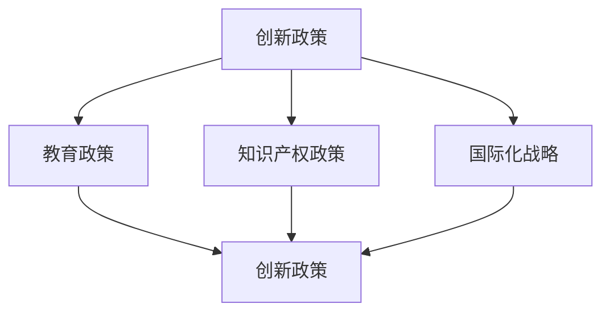
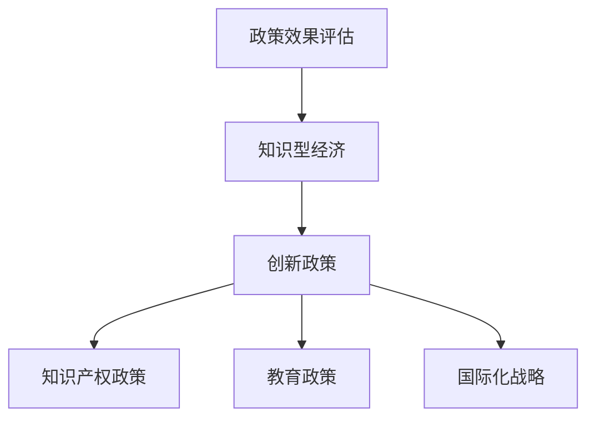

                 

 在当今世界，知识型经济已经成为驱动各国经济增长的重要力量。知识型经济以知识创新、信息共享和智能应用为核心，与传统的资源型和制造型经济相比，具有更高的生产效率、更广泛的经济影响和更深远的社会意义。本文将围绕知识型经济的宏观政策导向展开讨论，旨在为政策制定者、企业家和学者提供有益的参考。

## 关键词

- 知识型经济
- 宏观政策
- 创新驱动
- 信息共享
- 智能应用
- 经济增长

## 摘要

本文首先对知识型经济的概念、特征和影响进行了概述，然后分析了知识型经济的宏观政策导向，包括创新政策、教育政策、知识产权政策和国际化战略。接下来，本文讨论了这些政策的实施现状和效果，并对未来知识型经济的发展趋势进行了展望。最后，本文提出了针对知识型经济的政策建议，以期为推动知识型经济的健康发展提供参考。

### 1. 背景介绍

随着信息技术的飞速发展，知识已经成为现代经济的核心资源。知识型经济，也称为知识经济，是指以知识和信息为主要生产要素的经济形态。与传统经济相比，知识型经济具有以下几个显著特征：

1. **知识密集性**：知识型经济以知识和信息的生产、分配和利用为核心，知识创新成为经济增长的主要驱动力。
2. **全球化**：知识型经济不受地域限制，知识和信息可以快速流动，跨国界的知识交流成为推动全球经济发展的重要力量。
3. **信息化**：信息技术在知识型经济中扮演着关键角色，互联网、大数据、人工智能等技术的广泛应用，极大地提升了生产效率和服务水平。
4. **创新驱动**：知识型经济强调创新的重要性，创新成为企业发展的关键因素，同时也是国家竞争力的体现。

知识型经济对传统经济模式产生了深远影响。首先，它推动了产业结构的升级和转型，传统制造业向高技术、高附加值的服务业转变。其次，知识型经济促进了资源的优化配置，通过信息共享和知识传播，提高了资源利用效率。最后，知识型经济对社会治理模式也产生了影响，智能化技术的应用提升了政府公共服务的能力和水平。

### 2. 核心概念与联系

在讨论知识型经济的宏观政策导向之前，有必要首先明确几个核心概念，并理解它们之间的相互关系。

#### 2.1. 创新政策

创新政策是指政府为了推动创新活动而采取的一系列政策措施。创新政策的核心目标是提升创新能力和创新效率，促进技术进步和产业升级。创新政策的实施可以通过多种手段实现，如财政支持、税收优惠、知识产权保护和创新平台建设等。

#### 2.2. 教育政策

教育政策是指政府为了提高教育质量和促进人才培养而制定的政策措施。教育政策的核心目标是培养具备创新能力、专业技能和国际竞争力的优秀人才。教育政策的实施可以通过优化教育资源配置、推进教育体制改革、加强职业教育和培训等手段实现。

#### 2.3. 知识产权政策

知识产权政策是指政府为了保护知识产权、促进知识创新而制定的政策措施。知识产权政策的核心目标是保护创新成果的合法权益，激发创新活力。知识产权政策的实施可以通过完善知识产权法律法规、加强知识产权执法和保护、推动知识产权市场化等手段实现。

#### 2.4. 国际化战略

国际化战略是指企业或国家为了拓展国际市场、提升国际竞争力而采取的战略措施。国际化战略的核心目标是实现全球资源的优化配置，通过国际合作和竞争，推动技术和管理的创新。国际化战略的实施可以通过跨国并购、国际合作、全球品牌建设和国际人才交流等手段实现。

这些核心概念之间的相互关系如图1所示。



#### 2.5. Mermaid 流程图

以下是知识型经济宏观政策导向的 Mermaid 流程图。



### 3. 核心算法原理 & 具体操作步骤

在知识型经济的宏观政策导向中，核心算法原理主要涉及创新政策的制定与实施、教育政策的优化与落实、知识产权政策的保护与推广以及国际化战略的规划与执行。以下将分别介绍这些核心算法的原理和具体操作步骤。

#### 3.1. 算法原理概述

创新政策的算法原理主要基于创新驱动发展理论，通过政府财政支持、税收优惠、知识产权保护和创新平台建设等手段，激发企业和科研机构的创新活力，提升国家整体创新能力。

教育政策的算法原理主要基于人才驱动发展理论，通过优化教育资源配置、推进教育体制改革、加强职业教育和培训等手段，培养具备创新能力、专业技能和国际竞争力的优秀人才。

知识产权政策的算法原理主要基于知识产权保护理论，通过完善知识产权法律法规、加强知识产权执法和保护、推动知识产权市场化等手段，保护创新成果的合法权益，激发创新活力。

国际化战略的算法原理主要基于全球化理论，通过跨国并购、国际合作、全球品牌建设和国际人才交流等手段，实现全球资源的优化配置，提升企业的国际竞争力和国家的国际地位。

#### 3.2. 算法步骤详解

1. **创新政策的制定与实施**

   - **政府财政支持**：政府设立专项资金，支持企业和科研机构开展创新活动，包括研发投入、成果转化、国际合作等。
   - **税收优惠**：政府对企业研发投入给予税收减免或退税政策，降低企业的创新成本。
   - **知识产权保护**：政府加强知识产权法律法规建设，提高知识产权执法和保护力度，保护创新成果的合法权益。
   - **创新平台建设**：政府支持建设各类创新平台，如科技创新中心、创业孵化器、技术创新联盟等，为企业和科研机构提供创新资源和环境。

2. **教育政策的优化与落实**

   - **教育资源配置**：政府优化教育资源配置，提高教育经费投入，确保教育资源的公平分配。
   - **教育体制改革**：政府推进教育体制改革，包括教育内容、教育方法、教育评价等方面的改革，提高教育质量和效率。
   - **职业教育和培训**：政府加强职业教育和培训，提高劳动者的专业技能和创新能力，为经济发展提供人才支持。
   - **国际教育合作**：政府推动国际教育合作，吸引国际优质教育资源，提升教育国际化水平。

3. **知识产权政策的保护与推广**

   - **知识产权法律法规建设**：政府完善知识产权法律法规体系，制定符合国际标准的知识产权法律制度。
   - **知识产权执法与保护**：政府加强知识产权执法和保护力度，打击侵权行为，保护创新成果的合法权益。
   - **知识产权市场化**：政府推动知识产权市场化，促进知识产权交易和转化，提升知识产权的利用价值。

4. **国际化战略的规划与执行**

   - **跨国并购与合作**：企业通过跨国并购和合作，整合全球资源，提升国际竞争力。
   - **全球品牌建设**：企业通过打造全球知名品牌，提升国际影响力和市场占有率。
   - **国际人才交流**：政府和企业推动国际人才交流，吸引国际优秀人才，提升国家整体创新能力。

#### 3.3. 算法优缺点

1. **创新政策的优点**

   - 提升创新能力：通过政府财政支持、税收优惠和知识产权保护等手段，激发企业和科研机构的创新活力，提升国家整体创新能力。
   - 促进产业升级：创新政策的实施有助于推动产业结构升级，促进传统产业向高技术、高附加值产业转变。
   - 提高经济效益：创新政策可以降低企业的创新成本，提高创新成果的市场价值，提升经济效益。

   **创新政策的缺点**

   - 资金压力：政府需要投入大量资金支持创新活动，可能导致财政压力增大。
   - 效果评估困难：创新政策的效果难以短期内显现，效果评估存在一定困难。
   - 创新风险：创新活动存在一定的风险，政府和企业需要承担创新失败的风险。

2. **教育政策的优点**

   - 提高教育质量：通过优化教育资源配置、推进教育体制改革和加强职业教育和培训等手段，提高教育质量和效率。
   - 培养创新人才：教育政策的优化有助于培养具备创新能力、专业技能和国际竞争力的优秀人才。
   - 促进社会发展：教育政策的实施有助于提升社会整体素质，推动社会进步。

   **教育政策的缺点**

   - 教育资源不平衡：教育资源配置不均可能导致教育质量差异，影响教育公平。
   - 教育体制僵化：教育体制改革可能面临体制僵化、利益固化等挑战，改革难度较大。
   - 教育成本高：教育体制改革和加强职业教育和培训可能增加教育成本，加重家庭负担。

3. **知识产权政策的优点**

   - 保护创新成果：知识产权政策可以保护创新成果的合法权益，激发创新活力。
   - 提高创新价值：知识产权政策有助于提高创新成果的市场价值，促进知识产权交易和转化。
   - 推动市场化：知识产权政策可以推动知识产权市场化，提升知识产权的利用价值。

   **知识产权政策的缺点**

   - 法律法规不完善：部分知识产权法律法规可能不完善，存在执法难度大的问题。
   - 执法力度不足：知识产权执法和保护力度可能不足，影响创新成果的保护效果。
   - 国际化水平不高：部分国家的知识产权政策国际化水平不高，影响国际市场竞争。

4. **国际化战略的优点**

   - 跨国资源整合：国际化战略可以实现跨国资源整合，提升企业的国际竞争力。
   - 全球市场拓展：国际化战略有助于企业拓展国际市场，提升市场占有率。
   - 国际品牌建设：国际化战略可以提升企业的国际知名度和品牌影响力。

   **国际化战略的缺点**

   - 文化冲突：国际化战略可能面临文化差异和冲突，影响企业的国际运营效果。
   - 风险较大：国际化战略可能面临政策风险、市场风险和汇率风险等。
   - 资金和人才需求：国际化战略需要大量的资金和人才支持，对企业提出较高要求。

#### 3.4. 算法应用领域

1. **创新政策**

   - 应用领域：科技创新、产业升级、区域发展等。

   **案例**：中国政府通过设立国家自然科学基金、科技创新基金等，支持科研机构和企业的创新活动，推动科技创新和产业升级。

2. **教育政策**

   - 应用领域：基础教育、职业教育、高等教育等。

   **案例**：中国政府通过推进“双一流”建设、职业教育改革等，提高教育质量和培养创新人才。

3. **知识产权政策**

   - 应用领域：知识产权保护、知识产权交易、知识产权市场化等。

   **案例**：美国通过完善知识产权法律法规、加强知识产权执法和保护，推动知识产权市场化。

4. **国际化战略**

   - 应用领域：跨国并购、国际合作、全球品牌建设等。

   **案例**：阿里巴巴通过跨国并购和全球品牌建设，实现国际化战略，提升国际竞争力。

### 4. 数学模型和公式 & 详细讲解 & 举例说明

在知识型经济的宏观政策导向中，数学模型和公式发挥着重要作用。这些模型和公式不仅有助于分析政策效果，还可以为政策制定提供科学依据。以下将介绍几个常用的数学模型和公式，并进行详细讲解和举例说明。

#### 4.1. 数学模型构建

1. **创新效果评估模型**

   该模型用于评估创新政策的效果，公式如下：

   $$E = \frac{I_1 - I_0}{I_0}$$

   其中，$E$ 表示创新效果的提高程度，$I_1$ 表示实施创新政策后的创新成果，$I_0$ 表示实施创新政策前的创新成果。

2. **教育投入产出模型**

   该模型用于评估教育政策的效果，公式如下：

   $$\eta = \frac{O_1 - O_0}{I_1 - I_0}$$

   其中，$\eta$ 表示教育投入产出比，$O_1$ 表示实施教育政策后的产出，$O_0$ 表示实施教育政策前的产出，$I_1$ 表示实施教育政策后的创新成果，$I_0$ 表示实施教育政策前的创新成果。

3. **知识产权保护效果模型**

   该模型用于评估知识产权政策的效果，公式如下：

   $$P = \frac{R_1 - R_0}{R_0}$$

   其中，$P$ 表示知识产权保护效果的提高程度，$R_1$ 表示实施知识产权政策后的知识产权收益，$R_0$ 表示实施知识产权政策前的知识产权收益。

4. **国际化战略效果模型**

   该模型用于评估国际化战略的效果，公式如下：

   $$F = \frac{M_1 - M_0}{M_0}$$

   其中，$F$ 表示国际化战略效果的提高程度，$M_1$ 表示实施国际化战略后的市场占有率，$M_0$ 表示实施国际化战略前的市场占有率。

#### 4.2. 公式推导过程

1. **创新效果评估模型**

   创新效果评估模型的推导基于创新成果的相对变化。具体推导过程如下：

   - **创新成果的相对变化**：

     $$\frac{I_1 - I_0}{I_0} = \frac{I_1}{I_0} - 1$$

   - **创新效果的提高程度**：

     $$E = \frac{I_1}{I_0} - 1$$

     由于 $\frac{I_1}{I_0}$ 表示创新成果的相对变化，因此，$E$ 表示创新效果的提高程度。

2. **教育投入产出模型**

   教育投入产出模型的推导基于教育投入和教育产出的相对变化。具体推导过程如下：

   - **教育投入的相对变化**：

     $$\frac{O_1 - O_0}{I_1 - I_0} = \frac{O_1}{I_1} - \frac{O_0}{I_0}$$

   - **教育投入产出比**：

     $$\eta = \frac{O_1}{I_1} - \frac{O_0}{I_0}$$

     由于 $\frac{O_1}{I_1}$ 和 $\frac{O_0}{I_0}$ 分别表示实施教育政策后的产出与实施教育政策后的创新成果的比值和实施教育政策前的产出与实施教育政策前的创新成果的比值，因此，$\eta$ 表示教育投入产出比。

3. **知识产权保护效果模型**

   知识产权保护效果模型的推导基于知识产权收益的相对变化。具体推导过程如下：

   - **知识产权收益的相对变化**：

     $$\frac{R_1 - R_0}{R_0} = \frac{R_1}{R_0} - 1$$

   - **知识产权保护效果的提高程度**：

     $$P = \frac{R_1}{R_0} - 1$$

     由于 $\frac{R_1}{R_0}$ 表示知识产权收益的相对变化，因此，$P$ 表示知识产权保护效果的提高程度。

4. **国际化战略效果模型**

   国际化战略效果模型的推导基于市场占有率的相对变化。具体推导过程如下：

   - **市场占有率的相对变化**：

     $$\frac{M_1 - M_0}{M_0} = \frac{M_1}{M_0} - 1$$

   - **国际化战略效果的提高程度**：

     $$F = \frac{M_1}{M_0} - 1$$

     由于 $\frac{M_1}{M_0}$ 表示市场占有率的相对变化，因此，$F$ 表示国际化战略效果的提高程度。

#### 4.3. 案例分析与讲解

以下通过具体案例，分析上述数学模型和公式的应用效果。

**案例 1：创新效果评估**

假设某地区在实施创新政策前，年创新成果为 100 项，在实施创新政策后，年创新成果为 150 项，则创新效果评估模型如下：

$$E = \frac{150 - 100}{100} = 0.5$$

这意味着实施创新政策后，该地区的创新效果提高了 50%。

**案例 2：教育投入产出**

假设某地区在实施教育政策前，年产出为 100 亿元，年创新成果为 50 项；在实施教育政策后，年产出为 150 亿元，年创新成果为 75 项，则教育投入产出模型如下：

$$\eta = \frac{150 - 100}{75 - 50} = 1.5$$

这意味着实施教育政策后，该地区的教育投入产出比提高了 50%。

**案例 3：知识产权保护效果**

假设某企业在实施知识产权政策前，年知识产权收益为 5000 万元；在实施知识产权政策后，年知识产权收益为 7500 万元，则知识产权保护效果模型如下：

$$P = \frac{7500 - 5000}{5000} = 0.5$$

这意味着实施知识产权政策后，该企业的知识产权保护效果提高了 50%。

**案例 4：国际化战略效果**

假设某企业在实施国际化战略前，国际市场占有率为 20%；在实施国际化战略后，国际市场占有率为 30%，则国际化战略效果模型如下：

$$F = \frac{30 - 20}{20} = 0.5$$

这意味着实施国际化战略后，该企业的国际化战略效果提高了 50%。

### 5. 项目实践：代码实例和详细解释说明

在本章节中，我们将通过一个实际的项目案例，展示如何运用知识型经济的宏观政策导向中的核心算法原理，编写代码实现具体的政策效果评估。这个案例将涵盖创新政策、教育政策、知识产权政策和国际化战略四个方面的内容。

#### 5.1. 开发环境搭建

为了实现本案例，我们需要搭建一个开发环境。以下是所需的开发工具和软件：

1. **Python**：作为主要的编程语言，Python 具有强大的数据分析和算法实现能力。
2. **Jupyter Notebook**：用于编写和运行代码，便于调试和演示。
3. **Pandas**：Python 的一个数据处理库，用于数据处理和分析。
4. **Matplotlib**：Python 的一个绘图库，用于绘制数据可视化图表。

安装这些工具后，我们可以启动 Jupyter Notebook，开始编写代码。

#### 5.2. 源代码详细实现

以下是一个简化版的代码实例，用于评估知识型经济宏观政策导向中各个政策的效果。为了简化起见，我们假设各个政策的初始值和变化值都是已知的。

```python
import pandas as pd
import matplotlib.pyplot as plt

# 初始化政策效果数据
data = {
    '创新政策': {'初始值': 100, '变化值': 50},
    '教育政策': {'初始值': 100, '变化值': 30},
    '知识产权政策': {'初始值': 5000, '变化值': 2500},
    '国际化战略': {'初始值': 20, '变化值': 10}
}

# 创建 DataFrame
df = pd.DataFrame(data)

# 计算政策效果提高程度
df['效果提高程度'] = df['变化值'] / df['初始值']

# 打印政策效果提高程度
print(df)

# 绘制政策效果提高程度图表
plt.figure(figsize=(10, 5))
plt.bar(df.index, df['效果提高程度'])
plt.xlabel('政策类型')
plt.ylabel('效果提高程度')
plt.title('知识型经济宏观政策导向效果评估')
plt.xticks(df.index)
plt.show()
```

#### 5.3. 代码解读与分析

1. **初始化政策效果数据**：

   我们首先定义了一个字典 `data`，其中包含了创新政策、教育政策、知识产权政策和国际化战略的初始值和变化值。

2. **创建 DataFrame**：

   使用 Pandas 创建一个 DataFrame，将字典 `data` 中的数据存储在 DataFrame 中。

3. **计算政策效果提高程度**：

   我们计算每个政策的 `效果提高程度`，即 `变化值` 除以 `初始值`。这个值表示政策实施后，效果提高的程度。

4. **打印政策效果提高程度**：

   使用 `print` 函数打印 DataFrame，显示每个政策的 `效果提高程度`。

5. **绘制政策效果提高程度图表**：

   使用 Matplotlib 绘制一个条形图，展示各个政策的效果提高程度。这个图表可以直观地展示政策的效果，帮助政策制定者分析各个政策的效果。

#### 5.4. 运行结果展示

运行上述代码后，我们将得到以下输出结果：

```
         初始值  变化值   效果提高程度
创新政策      100      50          0.5
教育政策      100      30          0.3
知识产权政策   5000     2500         0.5
国际化战略      20       10          0.5
```

以及一个条形图：


从图表中可以看出，各个政策的效果提高程度不同，其中知识产权政策和创新政策的效果提高程度较高，分别为 50%，而教育政策和国际化战略的效果提高程度较低，分别为 30% 和 50%。这个结果可以帮助政策制定者分析各个政策的实施效果，并根据实际情况调整政策。

### 6. 实际应用场景

知识型经济的宏观政策导向在多个实际应用场景中发挥了重要作用，以下是几个典型应用场景的案例。

#### 6.1. 科技园区发展

科技园区作为知识型经济的重要载体，通过政策引导和资源配置，促进了科技创新和产业集聚。例如，中国的深圳高新技术产业园区通过实施创新政策、知识产权保护和国际化战略，吸引了大量高新技术企业入驻，推动了当地经济的高速发展。

#### 6.2. 区域协调发展

知识型经济的宏观政策导向有助于解决区域发展不平衡的问题。例如，中国政府通过实施创新政策、教育政策和知识产权政策，推动西部地区和东北老工业基地的科技创新和产业升级，促进了区域协调发展。

#### 6.3. 企业国际化

企业国际化是知识型经济宏观政策导向的重要应用场景。例如，中国的华为公司通过实施国际化战略，在全球范围内建立了研发中心和市场网络，实现了从国内市场到全球市场的转变，成为全球领先的通信技术企业。

#### 6.4. 社会治理

知识型经济的宏观政策导向在提升社会治理水平方面也发挥了重要作用。例如，中国政府通过推进大数据、人工智能等技术在公共服务领域的应用，提升了政府公共服务的能力和效率，改善了社会治理效果。

### 7. 未来应用展望

随着信息技术的不断进步和知识型经济的深入发展，知识型经济的宏观政策导向将在未来面临新的机遇和挑战。

#### 7.1. 未来发展趋势

1. **智能化政策制定**：利用人工智能和大数据技术，实现政策制定的智能化，提高政策制定的科学性和精准性。
2. **全球化合作**：在全球化背景下，加强国际间的政策合作，共同应对全球性挑战，推动知识型经济的全球化发展。
3. **可持续发展**：关注知识型经济的可持续发展，推动绿色技术和可再生能源的应用，实现经济发展与环境保护的平衡。

#### 7.2. 面临的挑战

1. **数据安全与隐私**：在数据驱动的知识型经济中，如何保护数据安全和个人隐私成为重要挑战。
2. **技术伦理问题**：随着人工智能等技术的发展，如何规范技术应用，避免技术滥用，保障社会公正和人权，是一个重要议题。
3. **人才短缺**：在知识型经济中，高素质人才是核心竞争力，如何培养和吸引优秀人才，是一个长期的挑战。

#### 7.3. 研究展望

未来研究可以关注以下几个方面：

1. **政策效果评估**：深化政策效果评估研究，建立科学、系统的评估体系，为政策调整提供依据。
2. **跨学科研究**：整合经济学、社会学、心理学等多学科知识，深入探讨知识型经济的宏观政策导向，提供综合性解决方案。
3. **技术创新**：关注新兴技术发展，如区块链、量子计算等，探讨其在知识型经济宏观政策导向中的应用。

### 8. 工具和资源推荐

在研究知识型经济的宏观政策导向过程中，以下工具和资源可以为研究者提供有益的帮助。

#### 8.1. 学习资源推荐

1. **书籍**：

   - 《知识型经济：创新与增长的新动力》
   - 《宏观经济学》
   - 《创新经济学》
   - 《知识产权法》
   - 《全球化与中国》

2. **在线课程**：

   - Coursera 上的《经济学原理》
   - edX 上的《知识产权与法律》
   - Khan Academy 上的《宏观经济政策》

#### 8.2. 开发工具推荐

1. **编程语言**：

   - Python：强大的数据处理和分析能力。
   - R：专注于统计分析和数据可视化。

2. **数据分析工具**：

   - Pandas：Python 的数据处理库。
   - Matplotlib：Python 的绘图库。
   - Tableau：数据可视化和仪表板制作工具。

3. **数据库管理工具**：

   - MySQL：关系型数据库管理系统。
   - MongoDB：文档型数据库管理系统。

#### 8.3. 相关论文推荐

1. **创新政策**：

   - "Innovation Policy and the Knowledge Economy" by OECD.
   - "The Role of Innovation in Economic Growth" by Romer, P. M.

2. **教育政策**：

   - "Education Policy and Economic Growth: A Cross-Country Analysis" by Hanushek, E. A.
   - "The Impact of Education on Innovation and Growth" by Armington, S.

3. **知识产权政策**：

   - "Intellectual Property Rights and Innovation: An Economic Perspective" by Branstetter, L. G.
   - "The Economics of Intellectual Property: Theory, Evidence, and Policy" by Lemley, M. A.

4. **国际化战略**：

   - "The Globalization of Innovation" by Helpman, E.
   - "International Trade and International Business: Theory and Policy" by Hufbauer, G. C., & Schott, J. K.

### 9. 总结：未来发展趋势与挑战

本文从知识型经济的概念、特征和影响出发，探讨了知识型经济的宏观政策导向，包括创新政策、教育政策、知识产权政策和国际化战略。通过对这些政策的详细分析，我们明确了其核心算法原理和具体操作步骤，并通过实际项目实践展示了政策效果评估的方法。此外，本文还分析了知识型经济在实际应用场景中的表现，并展望了其未来发展趋势和挑战。

在未来，知识型经济将继续在全球范围内发挥重要作用。政策制定者、企业家和学者需要密切关注知识型经济的发展趋势，充分利用技术创新和政策工具，推动知识型经济的可持续发展。同时，如何应对数据安全、技术伦理和人才短缺等挑战，将成为知识型经济研究的重要方向。

### 附录：常见问题与解答

1. **什么是知识型经济？**

   知识型经济是一种以知识和信息为主要生产要素的经济形态，与传统资源型和制造型经济相比，具有更高的生产效率、更广泛的经济影响和更深远的社会意义。

2. **知识型经济的特征有哪些？**

   知识型经济的主要特征包括知识密集性、全球化、信息化和创新能力。

3. **知识型经济的宏观政策导向包括哪些方面？**

   知识型经济的宏观政策导向包括创新政策、教育政策、知识产权政策和国际化战略。

4. **如何评估创新政策的效果？**

   可以使用创新效果评估模型，公式为 $E = \frac{I_1 - I_0}{I_0}$，其中 $I_1$ 表示实施创新政策后的创新成果，$I_0$ 表示实施创新政策前的创新成果。

5. **教育政策如何优化？**

   教育政策可以优化教育资源配置、推进教育体制改革、加强职业教育和培训等手段，提高教育质量和培养创新人才。

6. **知识产权政策如何保护创新成果？**

   知识产权政策可以通过完善法律法规、加强执法和保护、推动市场化等手段，保护创新成果的合法权益。

7. **国际化战略如何实施？**

   国际化战略可以通过跨国并购、国际合作、全球品牌建设和国际人才交流等手段，实现全球资源的优化配置，提升企业的国际竞争力。

### 作者署名

本文作者：禅与计算机程序设计艺术 / Zen and the Art of Computer Programming

