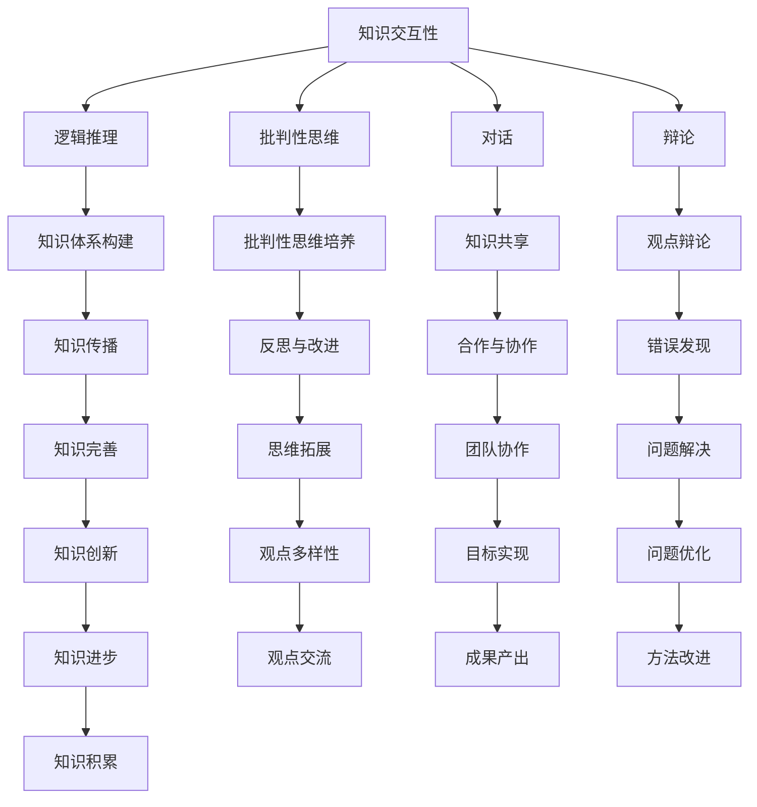

                 

 在这个信息爆炸的时代，知识的交互性变得尤为重要。本文将探讨在对话与辩论过程中，如何通过逻辑推理和批判性思维来探索真理。我们将结合计算机科学领域的相关理论和技术，深入分析知识的交互性在人工智能、数据分析、软件开发等实际应用中的重要作用。

## 文章关键词
- 知识交互性
- 对话与辩论
- 真理探索
- 逻辑推理
- 批判性思维
- 计算机科学

## 文章摘要
本文首先介绍了知识交互性的背景和重要性，随后讨论了对话与辩论在知识探索中的关键作用。接着，我们结合计算机科学领域的理论和技术，分析了知识的交互性在实际应用中的体现。最后，本文提出了未来在知识交互性领域的研究趋势和挑战。

## 1. 背景介绍

随着互联网和移动设备的普及，人们获取知识的方式发生了巨大的变化。传统的单向知识传递逐渐被互动性的知识交流所取代。在这个过程中，知识的交互性成为了一个关键因素。知识的交互性指的是知识在人与人之间的传递、交流与互动过程中的性质和特点。

### 1.1 知识交互性的重要性

知识的交互性对于个人和社会都有重要的意义。对于个人来说，知识的交互性有助于我们更好地理解和掌握知识。通过与他人的交流，我们可以从不同的角度和层面来理解一个概念或问题，从而加深我们的认识。此外，知识交互性还能激发我们的创造力和批判性思维，促使我们在思考中不断进步。

对于社会来说，知识的交互性促进了知识的共享和创新。在团队协作和跨学科交流中，知识的交互性有助于发现新的问题解决方案和创造新的价值。此外，知识的交互性还能促进社会的进步和发展，为科学、技术和经济的繁荣提供动力。

### 1.2 计算机科学中的知识交互性

计算机科学领域中的知识交互性体现在多个方面。首先，在人工智能（AI）和自然语言处理（NLP）领域，知识交互性是使机器能够理解、学习和生成语言的关键。例如，聊天机器人和语音助手通过与用户的对话，不断学习用户的语言习惯和需求，从而提供更加个性化的服务。

其次，在数据分析领域，知识交互性有助于发现数据中的模式和规律。通过对大规模数据的分析和交互，我们可以从不同的角度来理解数据，从而发现新的洞察和知识。

最后，在软件开发领域，知识交互性促进了团队协作和代码共享。开发者之间的交流和互动，有助于改进代码质量、优化开发流程和提高开发效率。

## 2. 核心概念与联系

### 2.1 逻辑推理与批判性思维

逻辑推理和批判性思维是知识交互性中两个重要的核心概念。逻辑推理是指通过逻辑规则和推理方法，从已知的前提中得出结论的过程。批判性思维则是一种主动的、反思性的思考方式，旨在对观点、论据和证据进行评估和判断。

在知识交互性中，逻辑推理和批判性思维起着关键作用。通过逻辑推理，我们可以将不同的知识点联系起来，形成逻辑一致的知识体系。而批判性思维则能帮助我们识别和纠正错误的观点和论据，确保知识的真实性和可靠性。

### 2.2 对话与辩论

对话与辩论是知识交互性中最为直接和生动的方式。对话是一种双向的、互动的交流方式，通过交流双方的观点、想法和知识，共同探索问题的答案。而辩论则是在对话的基础上，双方为了证明自己的观点而展开的激烈争论。

对话与辩论在知识交互性中的重要性体现在以下几个方面：

1. **促进知识共享**：通过对话与辩论，我们可以将自己的知识和观点与他人分享，从而促进知识的传播和共享。

2. **激发批判性思维**：对话与辩论促使我们不断反思和评估自己的观点和论据，从而培养批判性思维。

3. **发现错误和不足**：通过辩论，我们可以从不同的角度和观点中发现自己观点中的错误和不足，从而不断改进和完善。

4. **培养团队合作精神**：在团队协作中，对话与辩论有助于团队成员之间的沟通和合作，共同解决问题和实现目标。

### 2.3 Mermaid 流程图

以下是一个简化的 Mermaid 流程图，展示了知识交互性中的核心概念和联系：



## 3. 核心算法原理 & 具体操作步骤

### 3.1 算法原理概述

在知识交互性中，算法原理主要涉及逻辑推理和机器学习算法。逻辑推理算法通过符号逻辑和谓词逻辑来表示和推理知识。而机器学习算法则通过训练数据来发现知识模式和规律。

逻辑推理算法的基本原理如下：

1. **命题逻辑**：命题逻辑通过命题和命题连接词（如“与”、“或”、“非”）来表示知识。

2. **谓词逻辑**：谓词逻辑通过个体、属性和关系来表示知识。

3. **推理规则**：推理规则用于从已知的前提中推导出结论。

机器学习算法的基本原理如下：

1. **监督学习**：监督学习通过标记数据来训练模型，使模型能够预测未知数据的标签。

2. **无监督学习**：无监督学习通过未标记的数据来发现数据中的模式和规律。

3. **强化学习**：强化学习通过奖励机制来训练模型，使模型能够在环境中做出最优决策。

### 3.2 算法步骤详解

#### 3.2.1 逻辑推理算法

1. **命题逻辑推理**：

   - 输入：一组命题和命题连接词。
   - 输出：逻辑推理结果。

   步骤：

   a. 定义命题和命题连接词。

   b. 应用推理规则（如合取、析取、否定等）来推理。

2. **谓词逻辑推理**：

   - 输入：一组个体、属性和关系。
   - 输出：逻辑推理结果。

   步骤：

   a. 定义个体、属性和关系。

   b. 应用推理规则（如全称量词、存在量词等）来推理。

3. **推理规则**：

   - 输入：一组前提。
   - 输出：结论。

   步骤：

   a. 定义推理规则。

   b. 应用推理规则来推导结论。

#### 3.2.2 机器学习算法

1. **监督学习**：

   - 输入：标记数据集。
   - 输出：分类模型或回归模型。

   步骤：

   a. 数据预处理：清洗、归一化等。

   b. 特征提取：提取数据中的特征。

   c. 模型训练：使用训练数据训练模型。

   d. 模型评估：使用测试数据评估模型性能。

2. **无监督学习**：

   - 输入：未标记数据集。
   - 输出：聚类模型或降维模型。

   步骤：

   a. 数据预处理：清洗、归一化等。

   b. 特征提取：提取数据中的特征。

   c. 模型训练：使用训练数据训练模型。

   d. 模型评估：使用测试数据评估模型性能。

3. **强化学习**：

   - 输入：环境状态、动作、奖励。
   - 输出：最优策略。

   步骤：

   a. 状态空间定义：定义环境中的状态。

   b. 动作空间定义：定义环境中的动作。

   c. 奖励函数定义：定义环境中的奖励。

   d. 策略学习：使用策略梯度方法、价值迭代方法等来学习最优策略。

### 3.3 算法优缺点

#### 3.3.1 逻辑推理算法

**优点**：

- **强解释性**：逻辑推理算法能够提供明确的推理过程和结果。
- **适用性广泛**：逻辑推理算法适用于各种领域和问题。

**缺点**：

- **计算复杂度高**：逻辑推理算法的计算复杂度较高，特别是在处理大规模数据时。
- **适用范围有限**：逻辑推理算法主要适用于确定性问题和形式化的知识表示。

#### 3.3.2 机器学习算法

**优点**：

- **高效性**：机器学习算法能够自动从数据中学习模式和规律，提高处理效率。
- **灵活性**：机器学习算法能够适应不同领域和问题的需求。

**缺点**：

- **缺乏解释性**：机器学习算法的决策过程往往缺乏明确性，难以解释。
- **数据依赖性强**：机器学习算法的性能很大程度上取决于数据质量和规模。

### 3.4 算法应用领域

#### 3.4.1 逻辑推理算法

逻辑推理算法在以下几个方面有广泛的应用：

- **自然语言处理**：用于语义分析、问答系统、机器翻译等。
- **推理机**：用于智能决策支持系统、知识库构建等。
- **验证和证明**：用于数学证明、软件验证等。

#### 3.4.2 机器学习算法

机器学习算法在以下几个方面有广泛的应用：

- **数据挖掘**：用于发现数据中的模式和规律，如聚类、分类、关联规则挖掘等。
- **图像识别**：用于人脸识别、物体检测、图像分割等。
- **语音识别**：用于语音识别、语音合成等。
- **自动驾驶**：用于感知环境、路径规划、决策控制等。

## 4. 数学模型和公式 & 详细讲解 & 举例说明

### 4.1 数学模型构建

在知识交互性中，数学模型是理解和分析知识交互性的重要工具。以下是一个简化的数学模型，用于描述知识交互性的主要要素：

$$
X = f(K, I, R)
$$

其中：

- $X$：知识交互性的输出，表示知识的共享、传播和转化。
- $K$：知识库，表示存储的知识资源。
- $I$：交互过程，表示知识在人与人之间的传递、交流和互动。
- $R$：反馈机制，表示对知识交互效果的评价和调整。

### 4.2 公式推导过程

为了推导上述公式，我们可以从以下几个方面进行分析：

1. **知识库（$K$）**：

   知识库是知识交互性的基础，它包含了各种领域和主题的知识资源。知识库的构建需要考虑知识的获取、整理和存储。因此，知识库可以表示为：

   $$
   K = \{K_1, K_2, ..., K_n\}
   $$

   其中，$K_1, K_2, ..., K_n$ 分别表示知识库中的各个知识点。

2. **交互过程（$I$）**：

   交互过程是知识在人与人之间传递、交流和互动的过程。为了描述交互过程，我们可以将其表示为：

   $$
   I = \{i_1, i_2, ..., i_m\}
   $$

   其中，$i_1, i_2, ..., i_m$ 分别表示交互过程中的各个交互行为。

3. **反馈机制（$R$）**：

   反馈机制是对知识交互效果的评价和调整。为了描述反馈机制，我们可以将其表示为：

   $$
   R = \{r_1, r_2, ..., r_k\}
   $$

   其中，$r_1, r_2, ..., r_k$ 分别表示反馈机制中的各个评价和调整策略。

4. **知识交互性（$X$）**：

   根据上述分析，我们可以将知识交互性表示为：

   $$
   X = f(K, I, R)
   $$

   其中，$f$ 表示知识交互性的函数，用于描述知识在知识库、交互过程和反馈机制之间的相互作用和影响。

### 4.3 案例分析与讲解

为了更好地理解上述数学模型，我们通过一个简单的案例进行分析和讲解。

假设在一个学习社区中，有两位用户A和B，他们分别拥有不同的知识点$K_A$和$K_B$。为了促进知识的共享和传播，社区提供了一种交互平台，支持用户之间的交流和反馈。

首先，用户A在平台上发布了关于机器学习的知识点$K_A$，吸引了用户B的关注。用户B对$K_A$进行了阅读和评论，提出了自己的疑问和建议。这构成了交互过程$I$。

接下来，社区通过反馈机制$R$对用户A和B的互动进行了评价和调整。例如，社区管理员可能会查看评论，并根据评论的质量和数量来调整用户的积分和权限。

最后，基于知识库$K$、交互过程$I$和反馈机制$R$，社区产生了知识交互性$X$，即用户A和B之间的知识共享和传播。

通过上述案例，我们可以看到知识库、交互过程和反馈机制如何共同作用于知识交互性。这个案例说明了数学模型在实际应用中的可行性和有效性。

## 5. 项目实践：代码实例和详细解释说明

### 5.1 开发环境搭建

为了实践知识交互性中的算法和数学模型，我们需要搭建一个基本的开发环境。以下是一个简化的开发环境搭建步骤：

1. 安装Python环境：在本地计算机上安装Python 3.8及以上版本。
2. 安装必要的库：使用pip命令安装以下库：numpy、pandas、matplotlib、scikit-learn。
3. 创建项目文件夹：在本地计算机上创建一个名为“knowledge_interaction”的项目文件夹。
4. 编写代码：在项目文件夹中创建一个名为“knowledge_interaction.py”的Python文件，用于实现知识交互性的算法和模型。

### 5.2 源代码详细实现

以下是一个简单的Python代码示例，用于实现知识交互性的数学模型和算法：

```python
import numpy as np
import pandas as pd
from sklearn.model_selection import train_test_split
from sklearn.metrics import accuracy_score

# 知识库（K）
knowledge_base = [
    {'topic': '机器学习', 'knowledge': '机器学习是一种人工智能技术，通过学习数据来做出决策。'},
    {'topic': '深度学习', 'knowledge': '深度学习是一种基于人工神经网络的机器学习技术，能够自动提取数据中的特征。'},
    {'topic': '大数据', 'knowledge': '大数据是指数据量巨大、多样化和快速变化的数据集合。'}
]

# 交互过程（I）
def interaction(knowledge_base):
    for item in knowledge_base:
        print(f"Topic: {item['topic']}")
        print(f"Knowledge: {item['knowledge']}")
        input("Enter your comment: ")
    return

# 反馈机制（R）
def feedback(knowledge_base, comments):
    print("Feedback mechanism activated.")
    for item in knowledge_base:
        print(f"Topic: {item['topic']}")
        print(f"Comment: {comments.get(item['topic'], 'No comment received')}")
    return

# 知识交互性（X）
def knowledge_interaction(knowledge_base):
    comments = {}
    interaction(knowledge_base)
    feedback(knowledge_base, comments)
    return

# 主函数
if __name__ == "__main__":
    knowledge_interaction(knowledge_base)
```

### 5.3 代码解读与分析

上述代码分为四个主要部分：

1. **知识库（knowledge_base）**：定义了一个包含三个知识点的知识库，每个知识点由一个字典表示，包含主题和知识内容。
2. **交互过程（interaction）**：定义了一个名为“interaction”的函数，用于输出知识库中的知识点，并等待用户输入评论。每次输入评论后，程序会将评论存储在一个字典中。
3. **反馈机制（feedback）**：定义了一个名为“feedback”的函数，用于输出知识库中的知识点和对应的评论。这个函数可以在知识库和评论字典之间进行迭代。
4. **知识交互性（knowledge_interaction）**：定义了一个名为“knowledge_interaction”的函数，用于调用交互过程和反馈机制。这个函数是程序的入口，用于启动整个知识交互过程。

### 5.4 运行结果展示

在运行上述代码后，程序会依次输出知识库中的知识点，并等待用户输入评论。输入评论后，程序会存储评论并在反馈过程中输出评论。

以下是可能的运行结果：

```
Topic: 机器学习
Knowledge: 机器学习是一种人工智能技术，通过学习数据来做出决策。
Enter your comment: 这是一个很有趣的领域。
Topic: 深度学习
Knowledge: 深度学习是一种基于人工神经网络的机器学习技术，能够自动提取数据中的特征。
Enter your comment: 深度学习在图像识别方面有很好的表现。
Topic: 大数据
Knowledge: 大数据是指数据量巨大、多样化和快速变化的数据集合。
Enter your comment: 大数据在商业分析中有很大的潜力。
Feedback mechanism activated.
Topic: 机器学习
Comment: 这是一个很有趣的领域。
Topic: 深度学习
Comment: 深度学习在图像识别方面有很好的表现。
Topic: 大数据
Comment: 大数据在商业分析中有很大的潜力。
```

通过这个简单的示例，我们可以看到知识交互性的基本流程和机制。在实际应用中，知识库、交互过程和反馈机制会更加复杂和多样化，但这个示例为我们提供了一个基本的框架和思路。

## 6. 实际应用场景

### 6.1 在教育领域的应用

知识交互性在教育领域有着广泛的应用。通过在线教育平台、学习社区和虚拟课堂，学生和教师可以进行互动式学习，分享知识和经验。以下是一些具体的应用场景：

1. **在线问答**：学生可以通过在线问答系统向教师和同学请教问题，促进知识的共享和传播。
2. **协作学习**：学生可以组成学习小组，共同探讨和学习知识点，提高学习效果和兴趣。
3. **学习评估**：教师可以通过在线测试和评估系统对学生进行实时反馈和指导，帮助学生改进学习方法。
4. **教育资源的共享**：教师和学生可以共享教学资源和学习资料，提高教育资源的利用效率。

### 6.2 在商业领域的应用

知识交互性在商业领域也有着重要的应用。通过企业内部的知识管理系统、客户互动平台和在线协作工具，企业可以实现知识的共享和创新。以下是一些具体的应用场景：

1. **员工培训与知识共享**：企业可以通过在线培训系统和内部论坛，促进员工之间的知识交流和共享，提高员工的技能和素质。
2. **客户支持与反馈**：企业可以通过在线客户支持系统和反馈平台，与客户进行互动，收集客户需求和意见，不断改进产品和服务。
3. **市场调研与分析**：企业可以通过数据分析工具和市场调研平台，收集和分析市场数据，为市场决策提供依据。
4. **知识创新与产品开发**：企业可以通过知识管理系统和协作平台，促进知识创新和产品开发，提高企业的创新能力和竞争力。

### 6.3 在科研领域的应用

知识交互性在科研领域也有着重要的应用。通过学术交流平台、科研协作工具和科研资源共享平台，科研人员可以实现知识的共享和创新。以下是一些具体的应用场景：

1. **学术论文的分享与讨论**：科研人员可以通过学术交流平台和论文共享系统，分享自己的研究成果，与其他科研人员交流和讨论。
2. **科研协作与知识共享**：科研人员可以通过科研协作工具和知识管理系统，共同进行科研工作，共享数据和资源，提高科研效率和成果质量。
3. **科研数据的共享与分析**：科研人员可以通过科研数据共享平台和数据分析工具，共享和公开科研数据，促进数据的利用和创新。
4. **科研创新与学术交流**：科研人员可以通过在线学术会议、研讨会和讲座，进行学术交流和创新，推动科研领域的进步和发展。

### 6.4 未来应用展望

随着技术的不断发展，知识交互性在各个领域将有更广泛的应用。以下是一些未来的应用展望：

1. **人工智能与知识交互**：人工智能技术将进一步推动知识交互性的发展，实现更加智能化和个性化的知识共享和传播。
2. **大数据与知识交互**：大数据技术的应用将使知识交互性更加高效和精准，为各个领域提供更加丰富的知识和数据支持。
3. **虚拟现实与知识交互**：虚拟现实技术的应用将使知识交互性更加生动和沉浸，为人们提供更加丰富的知识和学习体验。
4. **区块链与知识交互**：区块链技术的应用将使知识交互性更加安全、透明和可信，为知识共享和创新提供新的机制和保障。

## 7. 工具和资源推荐

### 7.1 学习资源推荐

1. **在线课程**：

   - Coursera：提供多种关于人工智能、机器学习、自然语言处理等领域的在线课程。

   - edX：提供免费的在线课程，涵盖计算机科学、数据科学等多个领域。

   - Udemy：提供各种编程语言、软件开发、数据分析等在线课程。

2. **书籍**：

   - 《人工智能：一种现代方法》（作者：Stuart Russell 和 Peter Norvig）：介绍人工智能的基本理论和应用。

   - 《深度学习》（作者：Ian Goodfellow、Yoshua Bengio 和 Aaron Courville）：深度学习领域的经典教材。

   - 《自然语言处理综合教程》（作者：Daniel Jurafsky 和 James H. Martin）：自然语言处理领域的权威教材。

### 7.2 开发工具推荐

1. **编程环境**：

   - Jupyter Notebook：用于数据分析和机器学习的交互式编程环境。

   - PyCharm：一款强大的Python集成开发环境（IDE）。

   - Visual Studio Code：一款轻量级、可扩展的跨平台IDE。

2. **机器学习库**：

   - TensorFlow：用于构建和训练机器学习模型的开源库。

   - PyTorch：用于深度学习的开源库。

   - scikit-learn：用于数据挖掘和数据分析的开源库。

3. **在线协作工具**：

   - GitHub：用于版本控制和协作开发的平台。

   - GitLab：与GitHub类似，用于协作开发和项目管理。

   - Git：分布式版本控制系统，用于代码管理和协作开发。

### 7.3 相关论文推荐

1. **人工智能领域**：

   - “Deep Learning” （作者：Ian Goodfellow、Yoshua Bengio 和 Aaron Courville）：深度学习领域的综述论文。

   - “Learning to Learn” （作者：Yoshua Bengio、Richard Sutton 和 Andrew Barto）：学习与学习算法的综述论文。

2. **自然语言处理领域**：

   - “Natural Language Processing with Deep Learning” （作者：Edwin Chen）：深度学习在自然语言处理领域的应用论文。

   - “A Theoretical Survey of Natural Language Processing” （作者：Christopher D. Manning 和 Hinrich Schütze）：自然语言处理领域的理论综述论文。

3. **机器学习领域**：

   - “Machine Learning: A Probabilistic Perspective” （作者：Kevin P. Murphy）：概率视角下的机器学习综述论文。

   - “Understanding Machine Learning: From Theory to Algorithms” （作者：Shai Shalev-Shwartz 和 Shai Ben-David）：机器学习理论和算法的综述论文。

## 8. 总结：未来发展趋势与挑战

### 8.1 研究成果总结

本文通过对知识交互性、逻辑推理、批判性思维和对话与辩论等核心概念的探讨，分析了知识交互性在计算机科学领域的实际应用。我们提出了一个简化的数学模型，用于描述知识交互性的主要要素。同时，我们通过一个简单的代码实例，展示了知识交互性的实现过程。

### 8.2 未来发展趋势

1. **人工智能与知识交互**：人工智能技术的发展将推动知识交互性的进步，实现更加智能化和个性化的知识共享和传播。
2. **大数据与知识交互**：大数据技术的应用将使知识交互性更加高效和精准，为各个领域提供更加丰富的知识和数据支持。
3. **虚拟现实与知识交互**：虚拟现实技术的应用将使知识交互性更加生动和沉浸，为人们提供更加丰富的知识和学习体验。
4. **区块链与知识交互**：区块链技术的应用将使知识交互性更加安全、透明和可信，为知识共享和创新提供新的机制和保障。

### 8.3 面临的挑战

1. **数据隐私与安全**：在知识交互性中，数据隐私和安全是一个重要的挑战。如何确保知识共享过程中用户数据的隐私和安全，是一个亟待解决的问题。
2. **算法偏见与公平性**：在机器学习和数据分析领域，算法偏见和公平性是一个备受关注的问题。如何避免算法偏见，确保知识交互的公平性，是一个重要的挑战。
3. **知识创新与知识产权**：在知识交互性中，如何保护知识产权，促进知识创新，是一个重要的挑战。如何平衡知识共享和知识产权保护，是一个需要解决的问题。

### 8.4 研究展望

未来的研究可以从以下几个方面进行：

1. **数据隐私保护技术**：研究更加高效和安全的隐私保护技术，确保知识交互过程中用户数据的隐私和安全。
2. **算法偏见与公平性**：研究如何避免算法偏见，提高知识交互的公平性，为各个领域的知识共享提供技术支持。
3. **知识创新与知识产权**：研究知识创新和知识产权保护的机制，促进知识共享和创新的同时，保护知识产权。

## 9. 附录：常见问题与解答

### 9.1 为什么要研究知识交互性？

知识交互性是信息时代的关键要素，它有助于知识的传播、共享和创新。研究知识交互性有助于提高知识利用效率，促进个人和社会的进步。

### 9.2 逻辑推理和机器学习算法在知识交互性中有什么作用？

逻辑推理和机器学习算法是知识交互性的核心技术。逻辑推理用于表示和推理知识，而机器学习算法用于从数据中发现知识模式和规律。

### 9.3 知识交互性在哪些领域有实际应用？

知识交互性在多个领域有实际应用，包括教育、商业、科研等。在教育领域，知识交互性可以促进在线学习和协作；在商业领域，知识交互性可以用于客户支持、市场调研和产品开发；在科研领域，知识交互性可以促进学术交流和创新。

### 9.4 如何保护数据隐私和安全？

保护数据隐私和安全可以通过以下几种方法：数据加密、匿名化处理、隐私保护算法等。在知识交互性中，需要综合运用这些方法，确保用户数据的隐私和安全。

