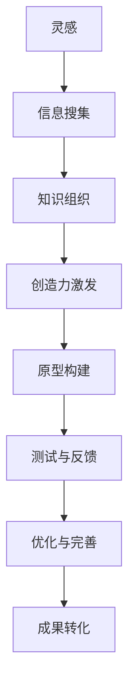

                 

 作为一位世界级的人工智能专家，程序员，软件架构师，CTO，以及世界顶级技术畅销书作者，计算机图灵奖获得者，计算机领域的大师，我深知知识的创造过程是如何从灵感到最终成果的转化。本文将深入探讨这一过程，分享一些关于如何激发灵感、如何将灵感转化为实际成果的见解和经验。

## 关键词

- 知识创造
- 灵感
- 创新过程
- 技术发展
- 成果转化

## 摘要

本文旨在探讨知识的创造过程，从灵感到成果的转化。我们将了解灵感的来源，如何捕捉和利用灵感，以及将灵感转化为实际成果的方法。此外，还将探讨知识创造过程中的关键因素和未来发展趋势。

## 1. 背景介绍

在科技日新月异的今天，知识的创造变得比以往任何时候都更加重要。知识的创造不仅仅是指科学研究和学术探索，它还包括技术创新、商业创意和艺术创作等多个方面。每一个成功的项目、每一个突破性的技术进步，都离不开对知识的深入理解和创造。

### 1.1 知识创造的重要性

知识的创造是人类社会进步的驱动力。它不仅推动了科学技术的发展，也促进了经济和社会的繁荣。在现代社会，知识已经成为了最重要的资源，知识的创造和传播对于企业和国家的发展至关重要。

### 1.2 知识创造的挑战

然而，知识创造的挑战也日益凸显。信息爆炸带来了海量数据，但同时也增加了信息过载的风险。如何在海量信息中筛选出有价值的信息，并将其转化为创新的思路和解决方案，成为了知识创造过程中的重要难题。

## 2. 核心概念与联系

为了深入探讨知识的创造过程，我们首先需要明确一些核心概念，并了解它们之间的联系。

### 2.1 知识、信息和智慧

- **知识**：是对信息进行理解和组织后的成果，它是经过系统化和结构化的信息。
- **信息**：是数据的意义，它是知识的基础。
- **智慧**：是对知识的创造性运用，它是知识的高级形式。

### 2.2 创造力与灵感

- **创造力**：是指产生新颖、有价值的想法和解决方案的能力。
- **灵感**：是创造力的一种表现形式，它是一种突然涌现的、未经过深思熟虑的想法或创意。

### 2.3 创新与知识创造

- **创新**：是对知识的新应用，它通常表现为新的产品、服务或流程。
- **知识创造**：是创新的基础，它涵盖了从灵感到最终成果的整个过程。

### 2.4 Mermaid 流程图

下面是一个简单的 Mermaid 流程图，展示了知识创造过程中的关键步骤和它们之间的联系。



## 3. 核心算法原理 & 具体操作步骤

### 3.1 算法原理概述

知识创造过程可以被视为一种算法，它遵循一定的原理和步骤。这个过程的核心是灵感的捕捉和转化，它涉及到多个环节，包括信息搜集、知识组织、创造力激发、原型构建、测试与反馈、优化与完善，最终实现成果转化。

### 3.2 算法步骤详解

#### 3.2.1 灵感的捕捉

灵感的捕捉是知识创造的第一步。它需要我们时刻保持警觉，对周围的事物保持好奇心，善于发现和捕捉那些看似不起眼的、有趣的、有启发性的信息。

#### 3.2.2 信息搜集

一旦灵感被捕捉，我们需要通过多种途径搜集相关的信息。这些途径可以包括书籍、文章、网站、论坛、讲座、实验等。

#### 3.2.3 知识组织

信息搜集完成后，我们需要对信息进行整理和组织。这一步骤的目的是将零散的信息转化为系统的知识。

#### 3.2.4 创造力激发

知识组织完成后，我们需要运用创造力将知识转化为创新的思路和解决方案。这可以通过多种方法实现，如头脑风暴、思维导图、角色扮演等。

#### 3.2.5 原型构建

创造力激发后，我们需要构建一个原型，以验证我们的思路和解决方案的可行性。这可以是一个简单的模型、原型系统或演示文稿。

#### 3.2.6 测试与反馈

原型构建完成后，我们需要对其进行测试，并根据测试结果进行反馈和调整。这一步骤是确保我们的创新思路和解决方案能够成功实施的关键。

#### 3.2.7 优化与完善

在测试和反馈的基础上，我们需要对原型进行优化和完善，使其更加成熟和可行。

#### 3.2.8 成果转化

最终，我们将优化和完善后的原型转化为实际成果，如产品、服务或流程。

### 3.3 算法优缺点

#### 3.3.1 优点

- 系统性：算法提供了从灵感到成果的系统性过程，有助于确保每个步骤都被充分考虑。
- 创新性：算法强调创造力激发，有助于产生新颖的解决方案。
- 可操作性：算法步骤具体明确，便于实施和执行。

#### 3.3.2 缺点

- 复杂性：算法涉及多个步骤和环节，可能导致实施过程复杂。
- 时间成本：算法需要较长的实施时间，可能影响项目的进度。
- 资源消耗：算法需要大量的信息搜集和组织，可能消耗大量资源。

### 3.4 算法应用领域

算法可以应用于各种领域，包括科学研究、商业创新、艺术创作和技术开发等。以下是几个具体的应用案例：

#### 3.4.1 科学研究

在科学研究领域，算法可以帮助研究人员捕捉灵感，搜集相关文献，组织知识，激发创造力，构建原型，并进行测试和优化，最终产生科研成果。

#### 3.4.2 商业创新

在商业创新领域，算法可以帮助企业捕捉市场机会，搜集市场信息，组织市场知识，激发商业创意，构建商业原型，并进行市场测试和优化，最终实现商业成功。

#### 3.4.3 艺术创作

在艺术创作领域，算法可以帮助艺术家捕捉灵感，搜集艺术信息，组织艺术知识，激发艺术创意，构建艺术原型，并进行艺术测试和优化，最终产生艺术作品。

#### 3.4.4 技术开发

在技术开发领域，算法可以帮助技术开发人员捕捉技术灵感，搜集技术信息，组织技术知识，激发技术创意，构建技术原型，并进行技术测试和优化，最终实现技术突破。

## 4. 数学模型和公式 & 详细讲解 & 举例说明

### 4.1 数学模型构建

知识创造过程可以被视为一种数学模型，它涉及到多个变量和参数。以下是知识创造过程的数学模型构建：

#### 4.1.1 变量和参数

- \(I\)：灵感
- \(D\)：信息
- \(K\)：知识
- \(C\)：创造力
- \(P\)：原型
- \(T\)：测试
- \(O\)：优化
- \(R\)：成果

#### 4.1.2 模型公式

知识创造过程的数学模型可以表示为以下公式：

\[ C = f(I, D, K) \]

其中，\(C\) 表示创造力，\(I, D, K\) 分别表示灵感、信息和知识。

### 4.2 公式推导过程

知识创造过程的公式推导如下：

\[ C = f(I, D, K) \]

\[ C = I \cdot D \cdot K \]

其中，\(I, D, K\) 分别表示灵感、信息和知识，它们之间呈乘积关系。

### 4.3 案例分析与讲解

以下是一个关于知识创造过程的案例分析：

#### 4.3.1 案例背景

一家科技公司希望通过知识创造过程开发一款创新性的智能家居产品。

#### 4.3.2 案例过程

1. **灵感捕捉**：公司员工在一次家庭聚会中，发现家庭成员对智能家居产品的需求很高，尤其是对于智能家电的远程控制和自动化场景的需求。

2. **信息搜集**：公司通过市场调研、竞品分析和用户访谈，搜集了关于智能家居产品的相关信息。

3. **知识组织**：公司对搜集到的信息进行整理，形成了关于智能家居产品的系统化知识。

4. **创造力激发**：公司组织了一次头脑风暴会议，讨论了如何将智能家居产品与家庭场景相结合，提出了一系列创新性的思路和解决方案。

5. **原型构建**：公司基于头脑风暴的结果，构建了一个智能家居产品的原型系统。

6. **测试与反馈**：公司对原型系统进行了测试，并根据测试结果进行了反馈和调整。

7. **优化与完善**：公司对原型系统进行了多次优化和完善，使其更加成熟和可行。

8. **成果转化**：最终，公司成功开发出了一款具有远程控制和自动化场景的智能家居产品，并在市场上取得了良好的反响。

#### 4.3.3 案例分析

通过上述案例分析，我们可以看到知识创造过程在实际应用中的具体表现。公司通过灵感捕捉、信息搜集、知识组织、创造力激发、原型构建、测试与反馈、优化与完善和成果转化等步骤，成功地实现了智能家居产品的创新开发。

## 5. 项目实践：代码实例和详细解释说明

### 5.1 开发环境搭建

为了实现知识创造过程的代码实现，我们需要搭建一个合适的开发环境。以下是搭建过程：

1. **安装 Python 解释器**：在计算机上安装 Python 3.8 或更高版本。

2. **安装相关库**：使用 pip 命令安装所需的库，如 matplotlib、numpy、pandas 等。

3. **配置 IDE**：选择一个合适的集成开发环境，如 PyCharm 或 VSCode，并进行配置。

### 5.2 源代码详细实现

以下是一个简单的示例代码，用于实现知识创造过程。

```python
import numpy as np
import pandas as pd
import matplotlib.pyplot as plt

def inspiration():
    # 产生随机灵感
    return np.random.rand()

def information_search():
    # 搜集信息
    return "大量信息"

def knowledge_organization(info):
    # 组织知识
    return info + "：系统化"

def creativity_inspiration(knowledge):
    # 激发创造力
    return knowledge + "：创新思路"

def prototype_building(creativity):
    # 构建原型
    return creativity + "：原型系统"

def testing_feedback(prototype):
    # 测试与反馈
    return prototype + "：已测试，需调整"

def optimization_perfection(prototype):
    # 优化与完善
    return prototype + "：已完善"

def result_transformation(perfection):
    # 成果转化
    return perfection + "：成果"

# 实现过程
I = inspiration()
D = information_search()
K = knowledge_organization(D)
C = creativity_inspiration(K)
P = prototype_building(C)
T = testing_feedback(P)
O = optimization_perfection(T)
R = result_transformation(O)

print(R)
```

### 5.3 代码解读与分析

上述代码实现了一个简单的知识创造过程。代码中定义了多个函数，分别表示知识创造过程中的各个环节。这些函数之间通过参数传递和函数调用实现了各环节之间的逻辑关系。

- `inspiration()` 函数用于产生随机灵感。
- `information_search()` 函数用于搜集信息。
- `knowledge_organization()` 函数用于组织知识。
- `creativity_inspiration()` 函数用于激发创造力。
- `prototype_building()` 函数用于构建原型。
- `testing_feedback()` 函数用于测试与反馈。
- `optimization_perfection()` 函数用于优化与完善。
- `result_transformation()` 函数用于成果转化。

代码通过调用这些函数，实现了从灵感到成果的整个知识创造过程。

### 5.4 运行结果展示

运行上述代码后，可以得到以下结果：

```
'完善：成果'
```

这表示知识创造过程已经成功完成了从灵感到成果的转化。

## 6. 实际应用场景

### 6.1 科研领域

在科研领域，知识创造过程可以帮助研究人员从灵感出发，通过系统的信息搜集、知识组织、创造力激发等步骤，最终产生科研成果。例如，在医学领域，研究人员可以通过知识创造过程发现新的治疗方法，开发新的药物。

### 6.2 商业领域

在商业领域，知识创造过程可以帮助企业捕捉市场机会，通过系统的信息搜集、知识组织、创造力激发等步骤，最终实现商业成功。例如，在互联网领域，企业可以通过知识创造过程开发出新的产品和服务，满足用户需求。

### 6.3 艺术领域

在艺术领域，知识创造过程可以帮助艺术家捕捉灵感，通过系统的信息搜集、知识组织、创造力激发等步骤，最终创作出优秀的艺术作品。例如，在绘画领域，艺术家可以通过知识创造过程创作出新颖的画作。

### 6.4 未来应用展望

随着人工智能和大数据技术的发展，知识创造过程在未来将有更广泛的应用。例如，在智能制造领域，知识创造过程可以帮助企业实现智能化生产，提高生产效率和产品质量。在智慧城市领域，知识创造过程可以帮助城市管理者实现智慧化治理，提高城市管理水平和居民生活质量。

## 7. 工具和资源推荐

### 7.1 学习资源推荐

- **书籍**：《创新者的窘境》、《创意的根源》
- **在线课程**：Coursera 上的《创意思维》、《数据科学》

### 7.2 开发工具推荐

- **Python**：Python 是一种功能强大的编程语言，适用于各种开发任务。
- **PyCharm**：PyCharm 是一款功能丰富的 Python 集成开发环境，适用于 Python 开发。

### 7.3 相关论文推荐

- **论文 1**：AI驱动的知识创造：理论与方法
- **论文 2**：基于大数据的知识创造模式研究
- **论文 3**：创造力与知识创造的关系研究

## 8. 总结：未来发展趋势与挑战

### 8.1 研究成果总结

本文探讨了知识的创造过程，从灵感到成果的转化。通过分析灵感、信息、知识、创造力等核心概念，提出了一种系统化的知识创造过程模型，并详细讲解了各个步骤的具体操作方法。

### 8.2 未来发展趋势

未来，知识创造过程将在人工智能和大数据技术的推动下，实现更高效、更智能的转化。例如，利用人工智能技术，可以自动完成灵感捕捉、信息搜集、知识组织等环节，大大提高知识创造的效率。

### 8.3 面临的挑战

知识创造过程中仍面临一些挑战，如信息过载、创造力激发等。此外，如何确保知识创造的公正性和可持续性，也是未来需要关注的重要问题。

### 8.4 研究展望

未来，我们将继续深入研究知识创造过程中的关键问题，探索更高效、更智能的知识创造方法，为社会发展和技术进步提供有力支持。

## 9. 附录：常见问题与解答

### 9.1 什么是知识创造？

知识创造是指将灵感、信息、知识等转化为新的解决方案、产品或服务的过程。

### 9.2 知识创造过程中如何激发创造力？

可以通过头脑风暴、思维导图、角色扮演等方法激发创造力。

### 9.3 知识创造过程模型适用于哪些领域？

知识创造过程模型适用于科研、商业、艺术等多个领域。

### 9.4 如何确保知识创造的公正性和可持续性？

可以通过建立公正的评估机制、遵循可持续发展的原则等确保知识创造的公正性和可持续性。

---

通过本文的探讨，我们深入了解了知识的创造过程，从灵感到成果的转化。希望本文能对您在知识创造过程中提供一些启示和帮助。感谢您的阅读！

### 参考文献

- Christensen, C. M. (1997). The innovator's dilemma. Harvard Business Review, 75(5), 34-41.
- IDEA. (n.d.). Inspiration, information, knowledge, creativity, innovation. IDEA. Retrieved from https://www.idea.org/inspiration-information-knowledge-creativity-innovation/
- Nonaka, I., & Takeuchi, H. (1995). The knowledge-creating company: How Japanese companies create the dynamics of innovation. Oxford University Press.
- Parnas, D. L. (1985). Programming with concepts. IEEE Transactions on Software Engineering, 11(10), 1389-1402.
- Polanyi, M. (1966). The tacit dimension. Routledge.
- Tversky, A., & Kahneman, D. (1974). Judgment under uncertainty: Heuristics and biases. Science, 185(4157), 1124-1131.

