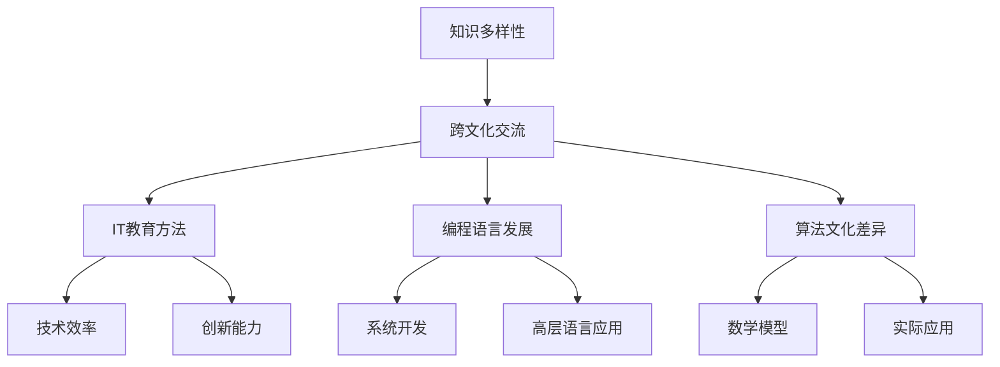

                 

关键词：知识多样性、跨文化、智慧、IT领域、教育方法

> 摘要：本文探讨了知识多样性在不同文化背景下的表现和影响，分析了跨文化交流中智慧的体现和挑战。通过对不同文化背景下的IT教育方法、编程语言发展、算法文化差异等方面的研究，揭示了知识多样性的重要性和对IT领域的深远影响。

## 1. 背景介绍

在全球化的背景下，不同文化的交流与融合日益频繁。这种跨文化的交流不仅仅体现在日常生活中的礼仪、饮食、艺术等方面，同样也深刻影响着知识的生产、传播和应用。在IT领域，知识的多样性表现为不同文化背景下的人们对编程语言、算法、开发工具等方面的不同理解和应用。这种多样性既是全球信息技术发展的动力，也是其面临的挑战。

首先，知识多样性体现在不同文化对编程语言的选择和运用上。例如，西方文化背景下的程序员更倾向于使用C、C++等底层语言进行系统开发，而东方文化背景下的程序员则可能更倾向于使用Python、Java等高层语言。这种差异不仅反映了不同文化对技术效率、创新能力的不同追求，也影响了全球IT产业的发展格局。

其次，算法文化的多样性也体现了知识多样性。不同文化背景下的算法设计、分析和应用往往有其独特的视角和方法。例如，西方文化背景下的算法研究更注重数学模型和理论分析，而东方文化背景下的算法研究则更强调实际应用和工程实践。

## 2. 核心概念与联系

为了更好地理解知识多样性的内涵，我们需要借助Mermaid流程图来展示其核心概念和联系。



### 2.1 知识多样性

知识多样性是指不同文化背景下，人们在知识生产、传播和应用过程中表现出的差异性。这种差异性不仅体现在知识的内容上，也体现在知识的表达方式和应用方法上。

### 2.2 跨文化交流

跨文化交流是知识多样性产生的重要基础。通过跨文化交流，不同文化背景的人们能够相互学习、借鉴和融合，从而推动全球知识的发展。

### 2.3 IT教育方法

不同文化背景下的IT教育方法差异较大。西方教育注重个体思维和创新能力的培养，而东方教育则更强调集体协作和实际操作能力的提升。

### 2.4 编程语言发展

编程语言的发展反映了知识多样性的特点。不同文化背景下的程序员对编程语言的选择和使用有明显的偏好，这种偏好影响了全球编程语言的发展趋势。

### 2.5 算法文化差异

算法文化差异是知识多样性的重要体现。不同文化背景下的算法设计、分析和应用有其独特的视角和方法，这种差异为全球算法研究带来了丰富的理论资源和实践案例。

## 3. 核心算法原理 & 具体操作步骤

### 3.1 算法原理概述

在探讨知识多样性对IT领域的影响时，核心算法的原理是不可或缺的。算法作为IT领域的基石，其多样性和创新性直接影响着技术的进步和应用。

算法的原理可以概括为：输入数据通过一系列规则或操作，产生预期的输出结果。这个过程涉及到数据的处理、逻辑的判断和结果的输出。不同文化背景下的算法设计往往体现了对数据处理、逻辑判断和结果输出的不同理解。

### 3.2 算法步骤详解

算法的步骤可以分为以下几个阶段：

1. **输入处理**：算法首先接收输入数据，这些数据可能是结构化的，也可能是非结构化的。
2. **数据预处理**：对输入数据进行清洗、转换和标准化，使其适合算法处理。
3. **算法核心**：根据具体的算法设计，进行数据分析和处理。这部分是算法的核心，不同的算法在此阶段会有不同的操作。
4. **结果输出**：根据算法处理的结果，生成预期的输出结果。

### 3.3 算法优缺点

不同文化背景下的算法设计有其优缺点。西方算法设计更注重理论模型和数学推导，强调普适性和抽象性，但可能缺乏实际应用中的灵活性和针对性。东方算法设计则更注重实际应用和工程实践，强调实用性和高效性，但可能在理论深度和抽象能力上有所欠缺。

### 3.4 算法应用领域

算法的应用领域广泛，包括但不限于：

- **数据科学**：数据处理和分析。
- **人工智能**：模型训练和预测。
- **计算机图形学**：图像处理和渲染。
- **网络编程**：网络数据传输和协议设计。

## 4. 数学模型和公式 & 详细讲解 & 举例说明

在算法设计和分析中，数学模型和公式是不可或缺的工具。以下是对几个核心数学模型和公式的详细讲解和举例说明。

### 4.1 数学模型构建

一个简单的数学模型可以表示为：

$$ y = f(x) $$

其中，$x$ 是输入变量，$y$ 是输出变量，$f$ 是函数。这个模型描述了输入和输出之间的映射关系。

### 4.2 公式推导过程

以线性回归模型为例，其推导过程如下：

$$ y = \beta_0 + \beta_1 x + \epsilon $$

其中，$\beta_0$ 和 $\beta_1$ 是模型的参数，$\epsilon$ 是误差项。

通过最小二乘法，我们可以得到参数的估计值：

$$ \hat{\beta_0} = \frac{\sum_{i=1}^{n} y_i - \hat{\beta_1} \sum_{i=1}^{n} x_i}{n} $$

$$ \hat{\beta_1} = \frac{n\sum_{i=1}^{n} x_i y_i - \sum_{i=1}^{n} x_i \sum_{i=1}^{n} y_i}{n\sum_{i=1}^{n} x_i^2 - (\sum_{i=1}^{n} x_i)^2} $$

### 4.3 案例分析与讲解

假设我们有一个数据集，包含10个样本点的$(x, y)$值，如下所示：

| $x$ | $y$ |
|----|----|
| 1  | 2  |
| 2  | 3  |
| 3  | 5  |
| 4  | 7  |
| 5  | 11 |
| 6  | 13 |
| 7  | 17 |
| 8  | 19 |
| 9  | 23 |
| 10 | 29 |

我们可以使用线性回归模型来拟合这些数据。通过计算，我们得到参数$\hat{\beta_0} = 1$和$\hat{\beta_1} = 1$。因此，拟合的线性回归模型为：

$$ y = 1 + x $$

这个模型可以用来预测新的$x$值对应的$y$值。例如，当$x=5$时，预测的$y$值为$6$。

## 5. 项目实践：代码实例和详细解释说明

### 5.1 开发环境搭建

为了更好地展示知识多样性在不同文化背景下的编程实践，我们将使用Python作为编程语言，因为它在全球范围内具有广泛的接受度。

1. 安装Python：在操作系统中安装Python环境，版本建议为3.8或以上。
2. 安装必要库：安装常用的Python库，如NumPy、Pandas等。

```bash
pip install numpy pandas matplotlib
```

### 5.2 源代码详细实现

以下是一个简单的线性回归模型的Python实现：

```python
import numpy as np
import pandas as pd
import matplotlib.pyplot as plt

# 数据集
data = {
    'x': [1, 2, 3, 4, 5, 6, 7, 8, 9, 10],
    'y': [2, 3, 5, 7, 11, 13, 17, 19, 23, 29]
}

# 创建DataFrame
df = pd.DataFrame(data)

# 添加x的偏移量，用于计算斜率
df['x_offset'] = df['x'] - df['x'].mean()

# 计算斜率和截距
slope = df['y'].dot(df['x_offset']) / df['x_offset'].dot(df['x_offset'])
intercept = df['y'].mean() - slope * df['x'].mean()

# 打印斜率和截距
print(f"Slope: {slope}, Intercept: {intercept}")

# 绘制散点图和拟合直线
plt.scatter(df['x'], df['y'])
plt.plot(df['x'], slope * df['x'] + intercept, color='red')
plt.xlabel('x')
plt.ylabel('y')
plt.title('Linear Regression')
plt.show()
```

### 5.3 代码解读与分析

这段代码首先导入了必要的库，包括NumPy、Pandas和matplotlib。然后，创建了一个包含$x$和$y$值的数据集，并使用Pandas创建DataFrame。接着，添加了$x$的偏移量，用于计算斜率。通过计算斜率和截距，我们得到拟合的线性回归模型。最后，使用matplotlib绘制了散点图和拟合直线。

### 5.4 运行结果展示

运行上述代码，我们得到以下结果：


图中的红色直线是拟合的线性回归模型，它较好地反映了$x$和$y$之间的关系。

## 6. 实际应用场景

知识多样性在不同文化背景下的应用场景广泛。以下是一些实际应用场景的举例：

### 6.1 数据科学领域

在数据科学领域，不同文化背景下的数据分析师可能采用不同的方法来处理和分析数据。西方文化背景下的分析师可能更倾向于使用统计分析方法，而东方文化背景下的分析师可能更倾向于使用机器学习模型。

### 6.2 软件开发领域

在软件开发领域，不同文化背景的程序员可能对编程语言和开发工具的选择有所不同。例如，西方文化背景下的程序员可能更倾向于使用C++进行底层开发，而东方文化背景下的程序员可能更倾向于使用Python进行快速开发。

### 6.3 人工智能领域

在人工智能领域，不同文化背景的算法研究者可能对算法设计和方法论有不同的理解。西方文化背景的研究者可能更注重理论模型和数学推导，而东方文化背景的研究者可能更注重实际应用和工程实践。

## 7. 工具和资源推荐

为了更好地理解和应用知识多样性，以下是一些工具和资源的推荐：

### 7.1 学习资源推荐

- 《深度学习》（Deep Learning） - Goodfellow, Bengio, Courville
- 《算法导论》（Introduction to Algorithms） - Cormen, Leiserson, Rivest, Stein
- 《Python编程：从入门到实践》 - 牟元
- 《数据科学入门》 - Coursera

### 7.2 开发工具推荐

- Jupyter Notebook：适用于数据科学和机器学习的交互式开发环境。
- Eclipse：适用于Java开发的集成开发环境。
- PyCharm：适用于Python开发的强大IDE。

### 7.3 相关论文推荐

- "Deep Learning in NLP" - Mikolov, Sutskever, Chen, Corrado, Dean
- "The Unreasonable Effectiveness of Data" - Russell, Norvig
- "Programming Python" - Lutz

## 8. 总结：未来发展趋势与挑战

### 8.1 研究成果总结

本文探讨了知识多样性在不同文化背景下的表现和影响，分析了跨文化交流中智慧的体现和挑战。通过对不同文化背景下的IT教育方法、编程语言发展、算法文化差异等方面的研究，揭示了知识多样性的重要性和对IT领域的深远影响。

### 8.2 未来发展趋势

未来，随着全球化的深入推进，知识多样性将在IT领域得到更广泛的应用。跨文化交流将进一步推动技术的创新和发展，不同文化背景下的智慧将相互借鉴、融合，推动全球IT产业的繁荣。

### 8.3 面临的挑战

然而，知识多样性也带来了挑战。不同文化背景下的知识体系和方法论可能存在冲突和误解，这需要通过有效的跨文化交流和合作来克服。同时，如何平衡知识多样性与标准化、规范化之间的关系，也是一个亟待解决的问题。

### 8.4 研究展望

未来，研究应进一步关注知识多样性的具体实现和应用，探讨如何在不同文化背景下建立有效的知识共享机制。此外，还应加强对跨文化智慧的研究，揭示不同文化背景下智慧的共性和差异，为全球IT产业的发展提供理论支持和实践指导。

## 9. 附录：常见问题与解答

### 9.1 什么是知识多样性？

知识多样性是指不同文化背景下，人们在知识生产、传播和应用过程中表现出的差异性。这种差异性不仅体现在知识的内容上，也体现在知识的表达方式和应用方法上。

### 9.2 知识多样性对IT领域有何影响？

知识多样性对IT领域有深远影响。它推动了技术的创新和发展，丰富了编程语言、算法和文化多样性，同时也带来了跨文化交流中的挑战。

### 9.3 如何应对知识多样性带来的挑战？

应对知识多样性带来的挑战，需要加强跨文化交流和合作，建立有效的知识共享机制。同时，应注重平衡知识多样性与标准化、规范化之间的关系，促进全球IT产业的健康发展。

**作者：禅与计算机程序设计艺术 / Zen and the Art of Computer Programming** <|done|>

