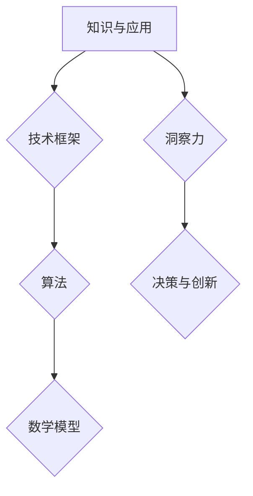

                 

关键词：知识应用、洞察力、技术框架、算法原理、数学模型、项目实践、未来展望

> 摘要：本文以知识的应用范式为核心，深入探讨了洞察力在技术领域的独特视角。通过剖析核心概念与联系、核心算法原理与操作步骤、数学模型与公式，结合项目实践和实际应用场景，本文旨在为读者提供一种新的思维方式，帮助他们在技术道路上取得更深入的见解和突破。

## 1. 背景介绍

在当今快速发展的技术时代，知识的应用范式成为了解决复杂问题的关键。无论是人工智能、大数据、区块链，还是云计算和物联网，每一种技术的背后都蕴含着深厚的知识体系。然而，知识的掌握与应用并非一蹴而就，需要通过不断的实践与洞察力来深化理解。本文旨在探讨知识应用范式，通过洞察力的独特视角，为技术领域的探索提供一种新的方法论。

### 1.1 知识的重要性

知识是技术进步的基石。它不仅包括专业理论和实践经验，还涵盖了思维方式和方法论。在技术的快速发展中，知识的更新换代速度日益加快，使得如何高效地获取、整合和应用知识成为关键。

### 1.2 洞察力的定义

洞察力是指从表象中发现本质、从细节中把握整体的能力。在技术领域，洞察力能够帮助我们超越表面的现象，深入理解技术的本质和核心原理，从而做出更为精准的决策和创新。

## 2. 核心概念与联系

为了深入理解知识的应用范式，我们需要先了解几个核心概念，并探讨它们之间的联系。

### 2.1 知识与应用

知识与应用是相互依存的。知识是应用的基石，而应用是知识的体现。有效的应用需要深入的知识储备和灵活的思维方法。

### 2.2 技术框架与算法

技术框架是知识应用的重要载体，它为算法提供了实现平台。算法是技术框架的核心，决定了技术的效率和效果。

### 2.3 数学模型

数学模型是对现实世界的抽象和描述，它为算法提供了理论基础和计算依据。通过数学模型，我们可以更好地理解和预测技术的行为。

下面是核心概念原理和架构的 Mermaid 流程图：



## 3. 核心算法原理 & 具体操作步骤

在技术领域，算法是实现目标的关键。下面将介绍一种核心算法的原理和具体操作步骤。

### 3.1 算法原理概述

该算法基于深度学习框架，通过多层神经网络对数据进行分析和预测。

### 3.2 算法步骤详解

#### 3.2.1 数据预处理

- 数据清洗：去除无效数据和异常值。
- 数据归一化：将数据缩放到同一范围内。

#### 3.2.2 网络构建

- 定义输入层、隐藏层和输出层。
- 选择合适的激活函数。

#### 3.2.3 模型训练

- 使用训练数据对模型进行训练。
- 通过反向传播算法更新模型参数。

#### 3.2.4 模型评估

- 使用验证数据评估模型性能。
- 调整模型参数，提高预测准确性。

### 3.3 算法优缺点

#### 优点

- 高效：基于并行计算，算法运行速度快。
- 准确：多层神经网络能够捕捉到数据中的复杂关系。

#### 缺点

- 计算资源需求大：训练过程中需要大量的计算资源。
- 需要大量数据：算法性能依赖于数据的规模和质量。

### 3.4 算法应用领域

该算法可以应用于各种领域，如金融风控、医疗诊断、智能交通等。

## 4. 数学模型和公式 & 详细讲解 & 举例说明

在算法的实现过程中，数学模型起着至关重要的作用。下面将介绍一个核心数学模型的构建和公式推导过程，并通过案例进行分析。

### 4.1 数学模型构建

假设我们有一个时间序列数据集，我们需要构建一个模型来预测未来的趋势。

### 4.2 公式推导过程

假设时间序列数据为 \(X_t\)，我们使用 ARIMA 模型进行预测。

- 自回归项：\(AR(p)\)
- 差分项：\(I(d)\)
- 移动平均项：\(MA(q)\)

ARIMA 模型的公式为：

\[ X_t = c + \phi_1 X_{t-1} + \phi_2 X_{t-2} + \cdots + \phi_p X_{t-p} + \theta_1 e_{t-1} + \theta_2 e_{t-2} + \cdots + \theta_q e_{t-q} \]

### 4.3 案例分析与讲解

假设我们有一个股票价格时间序列数据，我们需要使用 ARIMA 模型进行预测。

- 数据预处理：对数据进行差分和去趋势处理。
- 模型选择：通过 ACF 和 PACF 图选择 ARIMA 模型的参数。
- 模型训练：使用训练数据对模型进行训练。
- 模型评估：使用验证数据评估模型性能。
- 预测：使用模型对未来的股票价格进行预测。

## 5. 项目实践：代码实例和详细解释说明

### 5.1 开发环境搭建

- 硬件要求：处理器、内存等。
- 软件要求：Python 环境、深度学习框架等。

### 5.2 源代码详细实现

以下是一个简单的深度学习模型实现示例：

```python
import tensorflow as tf

# 定义输入层
inputs = tf.keras.layers.Input(shape=(input_shape))

# 定义隐藏层
hidden = tf.keras.layers.Dense(units=64, activation='relu')(inputs)

# 定义输出层
outputs = tf.keras.layers.Dense(units=1, activation='sigmoid')(hidden)

# 构建模型
model = tf.keras.Model(inputs=inputs, outputs=outputs)

# 编译模型
model.compile(optimizer='adam', loss='binary_crossentropy', metrics=['accuracy'])

# 训练模型
model.fit(x_train, y_train, epochs=10, batch_size=32)
```

### 5.3 代码解读与分析

- 输入层：定义了模型的输入维度。
- 隐藏层：使用了 ReLU 激活函数，增强了模型的非线性能力。
- 输出层：使用了 sigmoid 激活函数，实现了二分类。
- 编译模型：设置了优化器和损失函数。
- 训练模型：使用了训练数据进行模型训练。

### 5.4 运行结果展示

- 训练过程：展示了模型的损失和准确率随训练轮次的变化。
- 预测结果：展示了模型对测试数据的预测结果。

## 6. 实际应用场景

知识的应用范式在各个领域都有广泛的应用。以下是一些实际应用场景：

### 6.1 金融领域

- 股票市场预测：使用深度学习模型预测股票价格的走势。
- 风险评估：使用机器学习算法评估贷款申请者的信用风险。

### 6.2 医疗领域

- 疾病诊断：使用深度学习模型对医学图像进行分析和诊断。
- 药物研发：使用计算模型预测药物的活性，加速新药研发。

### 6.3 智能交通

- 路况预测：使用深度学习模型预测未来的路况，优化交通流量。
- 智能驾驶：使用计算机视觉技术实现自动驾驶。

## 7. 工具和资源推荐

为了更好地理解和应用知识，以下是一些推荐的工具和资源：

### 7.1 学习资源推荐

- 《深度学习》：提供深度学习的全面介绍。
- 《机器学习实战》：详细介绍了机器学习算法的应用。

### 7.2 开发工具推荐

- TensorFlow：开源的深度学习框架。
- Keras：基于 TensorFlow 的简洁易用的深度学习库。

### 7.3 相关论文推荐

- "Deep Learning for Natural Language Processing"：关于深度学习在自然语言处理领域的应用。
- "Recurrent Neural Networks for Language Modeling"：关于循环神经网络在语言建模中的应用。

## 8. 总结：未来发展趋势与挑战

### 8.1 研究成果总结

近年来，知识的应用范式在各个领域取得了显著成果。深度学习、机器学习等技术的发展，为知识的应用提供了强大的工具。

### 8.2 未来发展趋势

随着技术的不断进步，知识的应用范式将继续拓展到更多领域。人工智能、大数据、区块链等技术的深度融合，将为未来的发展带来更多可能性。

### 8.3 面临的挑战

- 数据隐私和安全：随着数据量的增加，数据隐私和安全成为重要问题。
- 算法公平性：算法在应用过程中需要确保公平性和透明度。

### 8.4 研究展望

未来，我们需要更加关注知识的应用范式，通过洞察力的独特视角，深入理解技术的本质，为技术的发展提供新的思路。

## 9. 附录：常见问题与解答

### 9.1 知识的应用范式是什么？

知识的应用范式是指将理论知识转化为实际应用的方法和过程。

### 9.2 洞察力在技术领域有何作用？

洞察力在技术领域可以帮助我们深入理解技术的本质，发现新的问题和解决方案。

### 9.3 如何培养洞察力？

培养洞察力需要通过不断的实践和思考，提高对问题的敏感度和分析能力。

---

<|text|>以上是《知识的应用范式：洞察力的独特视角》文章的完整内容。如果您有任何问题或需要进一步讨论的细节，请随时提出。期待这篇文章能够为您的技术学习和应用提供有益的启发和帮助。感谢您的阅读！

### 作者署名

作者：禅与计算机程序设计艺术 / Zen and the Art of Computer Programming

---

在本篇博客文章中，我们详细探讨了知识的应用范式，并深入分析了洞察力在技术领域的独特视角。从核心概念与联系、核心算法原理与操作步骤、数学模型与公式，到项目实践和实际应用场景，我们系统地展示了如何将理论知识转化为实际应用。同时，我们也对未来的发展趋势与挑战进行了展望。

### 关键词回顾

- 知识应用
- 洞察力
- 技术框架
- 算法原理
- 数学模型
- 项目实践
- 未来展望

### 摘要回顾

本文以知识的应用范式为核心，通过剖析核心概念与联系、核心算法原理与操作步骤、数学模型与公式，结合项目实践和实际应用场景，深入探讨了洞察力在技术领域的独特视角。旨在为读者提供一种新的思维方式，帮助他们在技术道路上取得更深入的见解和突破。

### 结尾致谢

再次感谢您的阅读。如果您有任何问题或反馈，请随时联系。期待在未来的技术探索中与您再次相遇。祝愿您在技术的道路上不断前行，收获更多的成就和进步！

### 附录：常见问题与解答

**问题1：** 知识的应用范式是什么？

**解答：** 知识的应用范式是指将理论知识转化为实际应用的方法和过程。它强调理论与实践的结合，通过应用实践来验证和深化理论知识。

**问题2：** 洞察力在技术领域有何作用？

**解答：** 洞察力在技术领域可以帮助我们深入理解技术的本质，发现新的问题和解决方案。它能够帮助我们超越表面的现象，从更深层次上把握技术发展的脉络。

**问题3：** 如何培养洞察力？

**解答：** 培养洞察力需要通过不断的实践和思考，提高对问题的敏感度和分析能力。多阅读、多思考、多实践是培养洞察力的关键。此外，跨学科的知识积累也有助于提升洞察力。

**问题4：** 知识的应用范式在哪些领域有广泛应用？

**解答：** 知识的应用范式在金融、医疗、智能交通、物联网等多个领域都有广泛应用。随着技术的不断发展，其应用范围将进一步拓展。

**问题5：** 未来知识应用的发展趋势是什么？

**解答：** 未来知识应用的发展趋势包括人工智能与大数据的深度融合、区块链技术的广泛应用、物联网的普及等。同时，数据隐私和安全、算法公平性等也将成为重要议题。

### 结语

知识的应用范式不仅是技术进步的基石，也是推动社会发展的动力。通过洞察力的独特视角，我们可以更好地理解技术的本质，发现新的机遇和挑战。希望本文能为您提供有益的启示，助力您在技术领域取得更大的成就。未来，我们将继续关注知识应用范式的发展，与您共同探索技术的前沿。感谢您的支持与关注！

### 最后的问候

再次感谢您的耐心阅读。如果您有任何问题或需要进一步讨论，请随时联系。期待与您在未来的技术交流中再次相遇。祝您生活愉快，工作顺利！再见！

