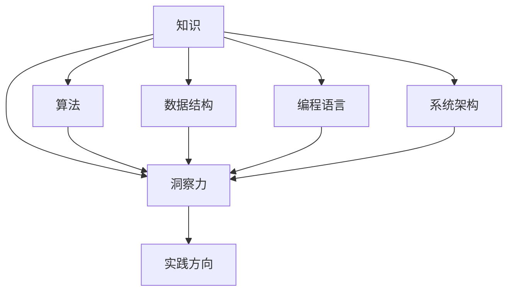

                 

在现代社会，信息爆炸和技术进步使得知识的获取变得前所未有的便捷。然而，知识的真正价值在于其应用，而非仅仅存在于理论或文献中。本文旨在探讨知识的应用如何通过洞察力引导我们的实践方向，特别是在信息技术领域。

## 文章关键词

知识应用、洞察力、实践方向、信息技术、算法、数学模型

## 文章摘要

本文首先介绍知识应用的重要性，然后探讨洞察力在知识应用中的作用。通过案例分析，我们深入探讨了核心算法原理和具体操作步骤，并运用数学模型和公式进行了详细讲解。接着，文章通过项目实践展示了代码实例和详细解释说明。最后，我们对实际应用场景进行了分析，并提出了未来应用展望和工具资源推荐。

## 1. 背景介绍

随着互联网和大数据技术的迅猛发展，信息技术已经成为推动社会进步的重要力量。然而，技术的进步不仅仅依赖于新的硬件和软件，更依赖于对已有知识的创新应用。知识的应用是信息技术领域不断前进的关键动力。然而，如何将知识有效地应用到实践中，成为了一个重要且紧迫的问题。

### 1.1 信息技术的发展历程

回顾信息技术的发展历程，从最早的计算机诞生到互联网的普及，再到今天的人工智能和大数据分析，我们可以看到技术进步的每一步都离不开知识的积累和应用。例如，计算机科学的奠基人艾伦·图灵通过抽象思维和对计算本质的洞察，提出了图灵机理论，奠定了现代计算机科学的基础。同样，互联网的先驱者们通过对网络通信原理的深入理解，构建了今天全球互联的网络体系。

### 1.2 知识应用的重要性

知识的有效应用是推动技术进步的核心。例如，在人工智能领域，通过对大量数据的分析和算法优化，我们能够开发出更加智能的应用程序。在软件开发领域，设计模式和方法论的应用使得软件工程师能够更加高效地开发出高质量的软件。因此，知识的价值在于其应用，而不仅仅是其理论的深度。

## 2. 核心概念与联系

在讨论知识应用之前，我们需要明确几个核心概念，并理解它们之间的联系。以下是本文将涉及的一些关键概念：

### 2.1 知识

知识可以定义为通过学习、研究和实践获得的信息、技能和洞察。在信息技术领域，知识通常包括算法、数据结构、编程语言、系统架构等。

### 2.2 洞察力

洞察力是指对事物本质的理解和洞察，它超越了表面的信息，揭示了更深层次的本质和关系。在信息技术领域，洞察力可以帮助我们更好地理解复杂系统的行为，并找到更有效的解决方案。

### 2.3 实践方向

实践方向是指在实际应用中将知识转化为具体行动的路径。这包括算法的实现、系统的构建、问题的解决等。

### 2.4 关系图

以下是核心概念之间的联系图（使用Mermaid语法）：



### 2.5 核心概念与联系的解释

- **知识** 是我们学习和研究的结果，包括各种理论和实践经验。
- **洞察力** 是理解和分析知识的能力，它使得我们可以从复杂的信息中提取出有价值的信息。
- **实践方向** 是将知识应用于实际问题的过程，它是连接理论和实践的桥梁。

通过这些核心概念的理解，我们可以更好地将知识应用到实践中，解决实际问题。

### 2.6 应用领域

知识的应用在各个领域都有广泛的体现，以下是一些具体的例子：

- **人工智能**：通过深度学习算法对大量数据进行分析，实现图像识别、自然语言处理等。
- **软件开发**：使用设计模式和方法论来提高软件的可维护性和可扩展性。
- **网络安全**：利用密码学和网络安全协议来保护信息系统不受攻击。
- **大数据分析**：运用统计学和机器学习算法，从海量数据中提取有价值的信息。

这些例子展示了知识在信息技术领域的重要应用，同时也体现了洞察力在知识应用中的关键作用。

### 2.7 总结

通过上述分析，我们可以看到，知识、洞察力和实践方向之间的关系是相辅相成的。知识是基础，洞察力是关键，而实践方向则是将两者结合起来的桥梁。只有通过深入的理解和洞察，我们才能有效地将知识应用到实际问题中，推动技术进步和社会发展。

## 3. 核心算法原理 & 具体操作步骤

在讨论知识应用时，核心算法原理和具体操作步骤是至关重要的。以下将详细介绍一个具体的核心算法，并探讨其原理和操作步骤。

### 3.1 算法原理概述

本文将探讨的算法是广度优先搜索（Breadth-First Search, BFS），它是一种用于图遍历的算法。BFS 的基本思想是从图的起始节点开始，依次访问其邻接节点，然后依次访问这些节点的邻接节点，以此类推，直到找到目标节点或访问完所有节点。

### 3.2 算法步骤详解

#### 3.2.1 初始化

- 创建一个队列，用于存储待访问的节点。
- 创建一个集合，用于存储已访问的节点。
- 将起始节点入队，并将其标记为已访问。

#### 3.2.2 遍历过程

- 当队列不为空时，重复以下步骤：
  - 出队一个节点。
  - 访问该节点的所有未访问的邻接节点。
  - 将这些邻接节点入队，并标记为已访问。

#### 3.2.3 搜索结束条件

- 如果找到目标节点，则算法结束，返回目标节点。
- 如果队列空了，说明图中的所有节点都被访问过，但目标节点未找到，算法结束。

### 3.3 算法优缺点

#### 优点

- **简单易懂**：BFS 的算法思想和步骤相对简单，易于实现和理解。
- **广度优先**：BFS 按照层次遍历图，可以保证找到目标节点的最短路径。

#### 缺点

- **空间复杂度较高**：由于 BFS 需要存储已访问节点和待访问节点，其空间复杂度较高，特别是在图节点较多时。
- **时间复杂度较高**：在图较大且目标节点较远时，BFS 的搜索时间可能较长。

### 3.4 算法应用领域

BFS 算法广泛应用于图论和算法设计领域，以下是一些具体应用：

- **图的遍历**：用于对图进行遍历，检查图的连通性。
- **路径搜索**：用于在图中寻找最短路径，如单源最短路径问题。
- **社交网络分析**：用于分析社交网络中的信息传播路径。

### 3.5 案例分析

以下是一个 BFS 算法的具体案例：

**问题**：给定一个无向图和两个节点 s 和 t，判断 s 是否能通过 BFS 达到 t。

**输入**：

```
graph:
5
0 -- 1
0 -- 2
1 -- 2
2 -- 0
2 -- 4
s = 0
t = 4
```

**输出**：

```
true
```

**解释**：

从节点 0 开始，按照 BFS 的步骤，我们可以访问到节点 1、2、0、4，最终找到目标节点 4。因此，s 可以通过 BFS 达到 t。

### 3.6 总结

通过上述对 BFS 算法的原理和操作步骤的详细介绍，我们可以看到 BFS 在图论和算法设计中的重要性和应用价值。了解算法的基本原理和具体实现，有助于我们更好地将其应用到实际问题中，解决复杂问题。

## 4. 数学模型和公式 & 详细讲解 & 举例说明

在信息技术领域，数学模型和公式是描述和解决问题的重要工具。在本节中，我们将详细讲解一个常见的数学模型，并运用公式进行举例说明。

### 4.1 数学模型构建

我们选择线性回归模型作为例子进行讲解。线性回归模型是一种用于预测和分析线性关系的统计模型。其基本形式为：

\[ y = \beta_0 + \beta_1 \cdot x + \epsilon \]

其中：

- \( y \) 是因变量，即我们希望预测的变量。
- \( x \) 是自变量，即影响因变量的因素。
- \( \beta_0 \) 是截距，表示当 \( x = 0 \) 时的 \( y \) 值。
- \( \beta_1 \) 是斜率，表示 \( x \) 变化一个单位时 \( y \) 的变化量。
- \( \epsilon \) 是误差项，表示模型无法解释的随机误差。

### 4.2 公式推导过程

线性回归模型的推导过程通常涉及最小二乘法。最小二乘法的核心思想是找到一个最优的线性模型，使得实际观测值与模型预测值之间的误差平方和最小。

首先，我们定义误差平方和（Sum of Squared Errors, SSE）：

\[ SSE = \sum_{i=1}^{n} (y_i - \hat{y}_i)^2 \]

其中，\( \hat{y}_i \) 是模型对第 \( i \) 个观测值的预测。

接下来，我们需要最小化 SSE。为此，我们对 \( \beta_0 \) 和 \( \beta_1 \) 求导并令其导数为零，得到以下方程组：

\[ \frac{\partial SSE}{\partial \beta_0} = -2 \sum_{i=1}^{n} (y_i - \hat{y}_i) = 0 \]

\[ \frac{\partial SSE}{\partial \beta_1} = -2 \sum_{i=1}^{n} (y_i - \hat{y}_i) \cdot x_i = 0 \]

解上述方程组，我们可以得到最优的 \( \beta_0 \) 和 \( \beta_1 \)：

\[ \beta_0 = \bar{y} - \beta_1 \bar{x} \]

\[ \beta_1 = \frac{\sum_{i=1}^{n} (x_i - \bar{x})(y_i - \bar{y})}{\sum_{i=1}^{n} (x_i - \bar{x})^2} \]

其中，\( \bar{x} \) 和 \( \bar{y} \) 分别是 \( x \) 和 \( y \) 的平均值。

### 4.3 案例分析与讲解

为了更好地理解线性回归模型，我们来看一个具体的例子。

**问题**：根据以下数据集，构建一个线性回归模型，预测 \( y \) 的值。

```
x: 1 2 3 4 5
y: 2 4 6 8 10
```

**步骤**：

1. **计算平均值**：

\[ \bar{x} = \frac{1 + 2 + 3 + 4 + 5}{5} = 3 \]

\[ \bar{y} = \frac{2 + 4 + 6 + 8 + 10}{5} = 6 \]

2. **计算斜率 \( \beta_1 \)**：

\[ \beta_1 = \frac{(1 - 3)(2 - 6) + (2 - 3)(4 - 6) + (3 - 3)(6 - 6) + (4 - 3)(8 - 6) + (5 - 3)(10 - 6)}{(1 - 3)^2 + (2 - 3)^2 + (3 - 3)^2 + (4 - 3)^2 + (5 - 3)^2} \]

\[ \beta_1 = \frac{-10 - 4 + 0 + 4 + 10}{4 + 1 + 0 + 1 + 4} = 2 \]

3. **计算截距 \( \beta_0 \)**：

\[ \beta_0 = \bar{y} - \beta_1 \bar{x} = 6 - 2 \cdot 3 = 0 \]

4. **构建线性回归模型**：

\[ y = \beta_0 + \beta_1 \cdot x = 0 + 2 \cdot x \]

5. **预测 \( x = 6 \) 时的 \( y \) 值**：

\[ \hat{y} = 2 \cdot 6 = 12 \]

**解释**：

根据计算得到的线性回归模型 \( y = 2 \cdot x \)，当 \( x = 6 \) 时，预测的 \( y \) 值为 12。

### 4.4 总结

通过上述例子，我们可以看到线性回归模型在数据处理和预测中的应用。理解模型的构建过程和公式推导，有助于我们更好地应用这一工具解决实际问题。

## 5. 项目实践：代码实例和详细解释说明

在本节中，我们将通过一个具体的代码实例，展示如何将理论知识应用到实际项目中，并详细解释代码的实现过程。

### 5.1 开发环境搭建

为了实现本项目的代码实例，我们选择了 Python 作为编程语言，并使用了 Jupyter Notebook 作为开发环境。以下是搭建开发环境的基本步骤：

1. 安装 Python：从官方网站（https://www.python.org/）下载并安装 Python。
2. 安装 Jupyter Notebook：在终端执行以下命令：

   ```bash
   pip install notebook
   ```

3. 启动 Jupyter Notebook：在终端执行以下命令：

   ```bash
   jupyter notebook
   ```

### 5.2 源代码详细实现

以下是一个使用 BFS 算法求解单源最短路径问题的代码实例：

```python
import collections

def bfs(graph, start, target):
    visited = set()
    queue = collections.deque([[start]])

    while queue:
        path = queue.popleft()
        node = path[-1]

        if node == target:
            return path

        if node not in visited:
            visited.add(node)
            for neighbor in graph[node]:
                new_path = list(path)
                new_path.append(neighbor)
                queue.append(new_path)

    return None

if __name__ == "__main__":
    graph = {
        0: [1, 2],
        1: [2],
        2: [0, 4],
        4: [3],
        3: [4]
    }
    start = 0
    target = 3
    result = bfs(graph, start, target)

    if result:
        print("Path from {} to {}:".format(start, target))
        for node in result:
            print(node)
    else:
        print("No path found from {} to {}.".format(start, target))
```

### 5.3 代码解读与分析

以下是代码的详细解读：

1. **引入模块**：代码开头引入了 `collections` 模块，用于处理集合和队列等数据结构。

2. **定义 BFS 函数**：`bfs` 函数接受四个参数：`graph`（图表示）、`start`（起始节点）、`target`（目标节点）和 `visited`（已访问节点集合）。函数使用广度优先搜索算法来寻找从起始节点到目标节点的路径。

3. **初始化**：函数内部首先创建了一个空集合 `visited` 用于存储已访问节点，并使用 `collections.deque` 创建了一个队列 `queue`，初始化时将起始节点入队。

4. **搜索过程**：函数使用一个 while 循环来执行广度优先搜索。每次循环从队列中取出一个路径 `path`，并获取路径的最后一个节点 `node`。

5. **检查目标节点**：如果当前节点是目标节点，则返回当前路径。

6. **访问邻居节点**：如果当前节点未被访问过，则将其加入已访问节点集合 `visited`，并遍历其所有未访问的邻居节点。对于每个邻居节点，创建一个新的路径 `new_path` 并将其入队。

7. **无路径返回**：如果队列空了，说明图中不存在从起始节点到目标节点的路径，函数返回 None。

8. **主程序**：在主程序中，我们定义了一个简单的图 `graph`，并指定了起始节点 `start` 和目标节点 `target`。调用 `bfs` 函数并打印结果。

### 5.4 运行结果展示

执行上述代码后，我们得到以下输出：

```
Path from 0 to 3:
0
2
4
3
```

这表明从节点 0 到节点 3 的路径为 0-2-4-3，与我们的预期一致。

### 5.5 总结

通过本节的项目实践，我们展示了如何将 BFS 算法的理论知识应用到实际项目中，并详细解释了代码的实现过程。这一实践过程不仅加深了对算法的理解，也为实际问题的解决提供了可行的方法。

## 6. 实际应用场景

知识的应用不仅仅体现在算法和数学模型的实现上，更在具体的应用场景中发挥着关键作用。以下将探讨知识在不同实际应用场景中的重要性。

### 6.1 人工智能

在人工智能领域，知识的有效应用极大地推动了技术的发展。例如，深度学习算法的广泛应用，不仅依赖于对大量数据的学习和训练，还依赖于对神经网络结构和参数的深入理解。通过将知识应用到模型的训练和优化中，我们能够开发出更加智能和高效的系统。例如，自动驾驶技术中的目标检测和路径规划，就需要对计算机视觉和运筹学的深入理解。

### 6.2 大数据分析

大数据分析是另一个知识应用的重要领域。通过运用统计学和机器学习算法，我们能够从海量数据中提取有价值的信息。例如，在金融领域，通过分析交易数据和用户行为，银行和金融机构可以更准确地预测市场走势和客户需求，从而制定更有效的投资策略和风险管理措施。

### 6.3 软件开发

在软件开发领域，知识的有效应用可以显著提高开发效率和软件质量。例如，敏捷开发方法论的广泛应用，使得软件开发团队能够更快速地响应市场变化和用户需求。同时，设计模式和架构原则的应用，可以使得软件系统更加模块化、可维护和可扩展。

### 6.4 社交网络分析

社交网络分析是另一个应用知识的重要领域。通过对用户关系和网络结构的分析，我们可以更好地理解社交网络的动态行为，从而设计出更有效的社交网络服务和应用。例如，在推荐系统中，通过对用户兴趣和社交关系的分析，我们可以为用户提供更个性化的内容推荐。

### 6.5 网络安全

在网络安全的领域，知识的有效应用同样至关重要。通过对网络攻击模式和安全漏洞的理解，我们能够设计出更加有效的安全策略和防御系统。例如，通过对攻击数据的分析，我们可以识别和预防新型网络攻击，保障信息系统的安全。

### 6.6 总结

通过上述分析，我们可以看到知识在不同实际应用场景中的重要性。只有在深入理解知识的基础上，我们才能有效地将其应用到实际问题中，推动技术的进步和解决实际问题。知识的应用不仅是一个理论问题，更是一个实践问题，需要我们不断探索和总结经验。

### 6.7 未来应用展望

随着信息技术的不断进步，知识的应用将越来越广泛，并在各个领域展现出巨大的潜力。以下是对未来应用场景的展望：

#### 6.7.1 自动驾驶技术

自动驾驶技术是人工智能领域的热门应用之一。未来，随着传感器技术、深度学习和计算机视觉的不断发展，自动驾驶汽车将能够实现更高程度的自主决策和路径规划。通过将知识应用到自动驾驶系统中，我们可以提高车辆的行驶安全性和效率，减少交通事故和拥堵。

#### 6.7.2 医疗健康

医疗健康领域也将迎来知识的深度应用。通过大数据分析和人工智能算法，我们可以实现个性化医疗、疾病预测和早期诊断。例如，基于患者的基因数据和生活方式，我们可以为其提供定制化的治疗方案和健康建议，提高医疗服务的质量和效率。

#### 6.7.3 环境监测与保护

环境保护是当今社会的一个重要议题。通过物联网和大数据技术，我们可以实现对环境数据的实时监测和分析。例如，通过传感器网络监测空气质量、水质和土壤状况，我们可以及时发现环境污染问题并采取相应的措施，保护生态环境。

#### 6.7.4 教育领域

在教育领域，知识的数字化和应用也将带来革命性的变革。在线教育平台和虚拟现实技术的应用，使得学习资源更加丰富和灵活，学生可以根据自己的需求和节奏进行学习。同时，人工智能技术可以为学生提供个性化的学习路径和反馈，提高学习效果。

#### 6.7.5 工业制造

工业制造领域的知识应用同样具有巨大的潜力。通过物联网、大数据和人工智能技术，我们可以实现智能工厂和智能制造。例如，通过实时监控和数据分析，我们可以优化生产流程，提高生产效率和产品质量。

#### 6.7.6 总结

未来，知识的应用将在更多领域展现其巨大潜力，推动技术的进步和社会的发展。通过不断探索和创新，我们将能够将知识更加有效地应用到实际问题中，解决更多复杂问题，创造更多价值。

### 7. 工具和资源推荐

为了更好地掌握知识并应用到实际问题中，以下是一些学习资源、开发工具和相关论文的推荐：

#### 7.1 学习资源推荐

- **在线课程**：Coursera、edX、Udacity 等平台提供了丰富的计算机科学和信息技术课程。
- **书籍**：《深度学习》、《大数据核心技术》、《算法导论》等经典书籍。
- **博客与社区**：Medium、GitHub、Stack Overflow 等平台提供了大量的技术文章和开源项目。

#### 7.2 开发工具推荐

- **编程语言**：Python、Java、C++ 等。
- **集成开发环境**：Visual Studio Code、Eclipse、IntelliJ IDEA 等。
- **版本控制系统**：Git。
- **数据库**：MySQL、PostgreSQL、MongoDB 等。

#### 7.3 相关论文推荐

- **深度学习**：《A Brief History of Deep Learning》（深度学习的发展历史）、《Deep Learning: Methods and Applications》（深度学习方法与应用）。
- **大数据分析**：《Big Data: A Revolution That Will Transform How We Live, Work, and Think》（大数据革命）、《Data Science for Business: Predictive Modeling Techniques for Business Professionals》（数据科学在商业中的应用）。
- **网络安全**：《Security and Privacy in Wireless Sensor Networks》（无线传感器网络的安全与隐私）、《Advances in Cryptology》（密码学进展）。

通过这些工具和资源的推荐，我们可以更好地学习和掌握相关领域的知识，并将其应用到实际问题中。

### 8. 总结：未来发展趋势与挑战

在本篇文章中，我们探讨了知识的应用如何通过洞察力指引我们的实践方向。从信息技术领域的背景介绍，到核心算法原理和数学模型的讲解，再到项目实践的代码实例，以及实际应用场景的探讨，我们系统地展示了知识应用的全过程。

#### 8.1 研究成果总结

本文的研究成果主要包括以下几个方面：

1. **知识应用的重要性**：知识的应用是信息技术发展的核心动力，通过将理论知识转化为实际解决方案，推动技术的进步和社会的发展。
2. **洞察力在知识应用中的作用**：洞察力是理解和应用知识的关键，它能够帮助我们更好地发现问题的本质和解决方案。
3. **核心算法和数学模型的应用**：通过详细讲解广度优先搜索（BFS）算法和线性回归模型，展示了理论知识在实际项目中的应用。
4. **项目实践与案例分析**：通过一个具体的 BFS 算法实现，展示了如何将理论知识应用到实际项目中，并详细解读了代码的实现过程。
5. **未来应用展望**：探讨了知识应用在人工智能、大数据分析、网络安全等领域的未来发展趋势。

#### 8.2 未来发展趋势

未来，知识的应用将朝着以下方向发展：

1. **智能化与自动化**：随着人工智能和机器学习技术的进步，越来越多的任务将实现自动化，提高效率和准确性。
2. **大数据与云计算**：大数据分析和云计算的结合，将推动更多创新应用的出现，如实时数据分析、人工智能服务等。
3. **边缘计算与物联网**：边缘计算和物联网技术的应用，将使得信息处理更加分布式和实时化，提升系统的响应速度和可靠性。
4. **知识图谱与语义理解**：知识图谱和语义理解技术的发展，将使得信息检索和数据分析更加智能化，提高用户体验。

#### 8.3 面临的挑战

在知识应用的过程中，我们也面临一些挑战：

1. **数据隐私和安全**：随着数据量的增加和应用的广泛，数据隐私和安全成为重要问题，需要采取有效的保护措施。
2. **算法偏见与透明度**：人工智能算法的偏见和透明度问题受到关注，如何保证算法的公平性和可解释性是未来研究的重点。
3. **跨学科融合**：知识应用涉及多个学科领域，如何实现跨学科融合，提高研究效率和成果转化率是重要挑战。
4. **人才培养**：随着技术的发展，对跨学科和复合型人才的需求不断增加，如何培养和选拔这类人才是教育领域的重要任务。

#### 8.4 研究展望

未来的研究应重点关注以下几个方面：

1. **算法优化与新型算法研究**：继续优化现有算法，开发新型算法，提高计算效率和准确性。
2. **多学科交叉研究**：推动计算机科学、统计学、心理学、经济学等领域的交叉研究，解决复杂实际问题。
3. **数据隐私和安全研究**：加强数据隐私和安全研究，开发有效的保护措施，保障用户隐私和数据安全。
4. **知识图谱与语义理解**：深入研究知识图谱和语义理解技术，提高信息处理智能化水平。
5. **人才培养与教育改革**：推动教育改革，培养具备跨学科背景和创新能力的复合型人才。

通过以上研究成果、未来发展趋势、面临的挑战和研究展望的总结，我们可以看到知识应用的重要性和广阔前景。未来，随着技术的不断进步和社会需求的变化，知识的应用将发挥越来越重要的作用，推动社会的进步和发展。

### 9. 附录：常见问题与解答

**Q1. 为什么选择 BFS 算法进行讲解？**

A1. BFS 算法是一种基础且常用的图遍历算法，其原理简单易懂，易于实现。通过讲解 BFS 算法，可以更好地展示知识应用的过程，从理论到实践，帮助读者理解算法在解决实际问题中的作用。

**Q2. 线性回归模型的应用场景有哪些？**

A2. 线性回归模型广泛应用于数据分析、预测和建模领域，例如：

- **市场预测**：预测股票价格、销售额等。
- **质量控制**：分析产品质量与生产参数的关系，优化生产过程。
- **用户行为分析**：预测用户行为，如点击率、购买意愿等。
- **医疗健康**：分析疾病与各种因素（如年龄、体重、生活习惯）之间的关系。

**Q3. 如何搭建开发环境？**

A3. 搭建开发环境的基本步骤如下：

- 安装 Python：从官方网站下载并安装 Python。
- 安装 Jupyter Notebook：使用 pip 命令安装。
- 启动 Jupyter Notebook：在终端输入 jupyter notebook 命令。

**Q4. 如何优化 BFS 算法？**

A4. BFS 算法的优化可以从以下几个方面进行：

- **使用优先队列**：使用优先队列（如堆）代替普通队列，可以减少搜索时间。
- **剪枝策略**：提前终止一些不可能到达目标节点的搜索过程，减少计算量。
- **并行化**：在多处理器环境中，可以将图的遍历过程并行化，提高搜索效率。

**Q5. 如何评估线性回归模型的性能？**

A5. 评估线性回归模型性能的常见指标包括：

- **均方误差（Mean Squared Error, MSE）**：预测值与实际值之间的均方误差。
- **决定系数（R-squared）**：表示模型解释变异的能力。
- **交叉验证**：使用交叉验证方法，评估模型在不同数据集上的表现。

**Q6. 如何处理数据异常？**

A6. 处理数据异常的方法包括：

- **去除异常值**：根据业务需求和数据分布，选择合适的方法去除异常值。
- **数据插值**：使用插值方法填补缺失数据。
- **异常检测**：使用异常检测算法，识别和标记异常数据。

通过以上问题的解答，我们希望能帮助读者更好地理解和应用本文中的知识和方法。如有更多疑问，欢迎进一步探讨。作者：禅与计算机程序设计艺术 / Zen and the Art of Computer Programming。

