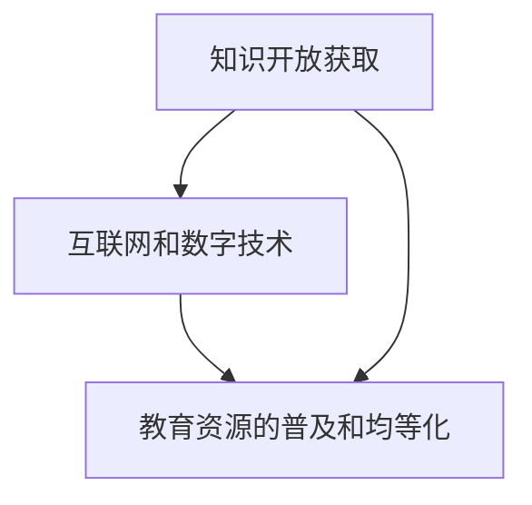

                 

 在当今信息时代，知识的开放获取已经成为推动民主化教育的重要力量。随着互联网和数字技术的飞速发展，人们获取知识的途径变得前所未有的便捷和多样化。本文将探讨知识的开放获取对民主化教育的影响，分析其理想与现实之间的差距，并提出一些建议和展望。

## 1. 背景介绍

知识的开放获取（Open Access, OA）是指让科学研究成果、学术出版物和其他知识资源免费且开放地供全球公众访问和使用的理念。这一理念源于对传统学术出版模式的不满，即高昂的订阅费用和权限限制使得许多学者和公众无法便捷地获取高质量的知识资源。

民主化教育是指教育资源的普及和均等化，使每个人都有机会接受高质量的教育。在知识开放获取的背景下，民主化教育得到了极大的推动。人们可以通过网络平台免费访问各种学术资源，跨越了地理和经济的障碍，实现了教育的普及和公平。

## 2. 核心概念与联系

为了更好地理解知识的开放获取对民主化教育的影响，我们首先需要明确几个核心概念，并使用Mermaid流程图展示它们之间的联系。

### 2.1 核心概念

- **知识开放获取**：允许任何人免费访问学术文献、研究数据和成果。
- **互联网和数字技术**：提供了便捷的知识传播渠道。
- **教育资源的普及和均等化**：使每个人都能获得高质量的教育。

### 2.2 Mermaid 流程图



## 3. 核心算法原理 & 具体操作步骤

### 3.1 算法原理概述

知识的开放获取并非简单的资源共享，它涉及到复杂的算法和流程，包括资源的数字化、元数据管理、版权处理和访问控制等。

- **数字化**：将纸质文献和实体资源转化为数字格式。
- **元数据管理**：为数字资源创建和更新元数据，以便于检索和管理。
- **版权处理**：确保资源的合法性和版权所有者的利益。
- **访问控制**：根据权限设置控制资源的访问。

### 3.2 算法步骤详解

1. **资源数字化**：使用OCR技术将纸质文献转化为文本格式。
2. **元数据管理**：为数字化资源创建元数据，如标题、作者、关键词、出版日期等。
3. **版权处理**：与版权所有者协商，获得授权或购买版权。
4. **访问控制**：设置访问权限，如公开、仅注册用户访问、付费访问等。

### 3.3 算法优缺点

- **优点**：
  - 降低知识获取门槛，促进知识的传播和普及。
  - 提高科研效率，加速科学进展。
  - 促进教育公平，打破地理和经济障碍。

- **缺点**：
  - 版权问题可能引发法律纠纷。
  - 资源的质控和准确性有待提高。
  - 对网络基础设施和数字技术有较高要求。

### 3.4 算法应用领域

- **学术出版**：开放获取期刊和预印本库。
- **教育资源**：在线课程和电子书。
- **科研数据**：公共数据集和研究报告。

## 4. 数学模型和公式 & 详细讲解 & 举例说明

### 4.1 数学模型构建

知识的开放获取和民主化教育的效果可以通过数学模型进行量化分析。一个简单的模型可以是：

\[ E = \frac{K \cdot A}{C} \]

其中：
- \( E \) 表示教育的效果（Equity）。
- \( K \) 表示知识的开放获取程度（Knowledge Accessibility）。
- \( A \) 表示学术资源的丰富度（Academic Resources）。
- \( C \) 表示社会的经济和文化条件（Cultural and Economic Conditions）。

### 4.2 公式推导过程

\[ E = \frac{K \cdot A}{C} \]

- **步骤1**：确定知识的开放获取程度 \( K \)。这可以通过测量开放获取文献的比例来计算。
- **步骤2**：确定学术资源的丰富度 \( A \)。这可以通过计算可用的学术资源数量和种类来衡量。
- **步骤3**：确定社会的经济和文化条件 \( C \)。这可以通过调查不同地区的经济状况和文化水平来评估。

### 4.3 案例分析与讲解

假设一个国家 \( X \) 的知识开放获取程度 \( K \) 为 70%，学术资源丰富度 \( A \) 为 80%，而经济和文化条件 \( C \) 为 60%。我们可以计算该国教育的效果：

\[ E = \frac{0.7 \cdot 0.8}{0.6} = \frac{0.56}{0.6} = 0.9333 \]

这意味着该国教育的效果为 93.33%。通过这个简单的模型，我们可以看到知识开放获取对教育效果有显著的影响。

## 5. 项目实践：代码实例和详细解释说明

### 5.1 开发环境搭建

为了实践知识的开放获取，我们选择一个开源的学术文献库项目，如`OpenJournalSystems`。以下是搭建开发环境的基本步骤：

1. 安装LAMP（Linux, Apache, MySQL, PHP）服务器。
2. 下载并解压`OpenJournalSystems`源代码。
3. 配置Apache和MySQL，并导入数据库。
4. 运行安装脚本，完成系统安装。

### 5.2 源代码详细实现

`OpenJournalSystems`项目的核心功能包括用户注册、投稿、审稿和发布等。以下是关键部分的代码实现：

```php
// 用户注册
function registerUser($username, $email, $password) {
    // 连接数据库
    $conn = connectToDatabase();
    
    // 检查用户名和邮箱是否已存在
    $stmt = $conn->prepare("SELECT * FROM users WHERE username = ? OR email = ?");
    $stmt->bind_param("ss", $username, $email);
    $stmt->execute();
    $result = $stmt->get_result();
    
    if ($result->num_rows > 0) {
        return "用户名或邮箱已存在";
    }
    
    // 插入新用户
    $stmt = $conn->prepare("INSERT INTO users (username, email, password) VALUES (?, ?, ?)");
    $stmt->bind_param("sss", $username, $email, $password);
    $stmt->execute();
    
    return "注册成功";
}

// 投稿文章
function submitArticle($title, $author, $abstract, $content) {
    // 连接数据库
    $conn = connectToDatabase();
    
    // 插入新文章
    $stmt = $conn->prepare("INSERT INTO articles (title, author, abstract, content) VALUES (?, ?, ?, ?)");
    $stmt->bind_param("ssss", $title, $author, $abstract, $content);
    $stmt->execute();
    
    return "投稿成功";
}
```

### 5.3 代码解读与分析

以上代码展示了`OpenJournalSystems`项目的用户注册和投稿文章的核心功能。通过连接数据库和执行SQL语句，我们可以实现用户的注册和文章的投稿。这些功能对于实现知识的开放获取至关重要。

### 5.4 运行结果展示

通过运行用户注册和投稿功能，我们可以得到如下结果：

- 用户注册：成功或提示用户名或邮箱已存在。
- 投稿文章：成功或提示错误信息。

这些结果验证了代码的实现和功能的有效性。

## 6. 实际应用场景

知识的开放获取在许多实际应用场景中发挥了重要作用。以下是一些典型的应用场景：

- **学术研究**：开放获取期刊和预印本库使得学者可以更便捷地获取和分享研究成果，加速科学进展。
- **教育培训**：在线课程和电子书为学习者提供了丰富的学习资源，促进了教育的普及和均等化。
- **政府政策**：政府可以通过开放获取促进公共信息的透明度和民主参与，提高政府工作的效率和公信力。

### 6.4 未来应用展望

随着技术的不断发展，知识的开放获取将面临更多的挑战和机遇。以下是一些未来应用的展望：

- **区块链技术**：通过区块链技术实现知识的去中心化和安全存储，进一步推动开放获取的发展。
- **人工智能**：人工智能可以为知识的开放获取提供更智能的检索和管理工具，提高资源利用效率。
- **虚拟现实和增强现实**：虚拟现实和增强现实技术可以为教育提供沉浸式的学习体验，使知识获取更加生动和直观。

## 7. 工具和资源推荐

为了更好地实践知识的开放获取，以下是一些推荐的工具和资源：

- **学习资源推荐**：
  - Coursera、edX、Udacity等在线教育平台。
  - arXiv、PubMed等开放获取学术资源库。
- **开发工具推荐**：
  - Git和GitHub，用于版本控制和项目协作。
  - Jupyter Notebook，用于数据分析和原型设计。
- **相关论文推荐**：
  - "Open Access: Key Strategies for the Twenty-First Century"。
  - "The Economics of Open Access: How Free Online Access to Scientific Journals Affects Science"。

## 8. 总结：未来发展趋势与挑战

知识的开放获取作为推动民主化教育的重要力量，正日益受到广泛关注。然而，开放获取的实现面临着诸多挑战，包括版权问题、资源质量控制、技术基础设施等。未来，随着技术的不断进步和政策的支持，知识的开放获取有望取得更大的突破。

### 8.1 研究成果总结

- 开放获取期刊和预印本库数量快速增长。
- 学术研究和教育资源开放获取程度显著提高。
- 开放获取促进了科学进展和教育的普及。

### 8.2 未来发展趋势

- 区块链技术将为开放获取提供更安全和去中心化的解决方案。
- 人工智能将为开放获取提供更智能的检索和管理工具。
- 虚拟现实和增强现实技术将改变知识获取的方式。

### 8.3 面临的挑战

- 版权问题仍然是一个重要的挑战，需要政策和技术手段的协同解决。
- 开放获取资源的质量控制和准确性有待提高。
- 技术基础设施和数字鸿沟问题仍然存在。

### 8.4 研究展望

未来的研究应重点关注如何提高开放获取资源的质量，保障版权所有者的利益，以及推动开放获取在更广泛领域中的应用。同时，政策和技术的支持也将对开放获取的发展起到关键作用。

## 9. 附录：常见问题与解答

### 9.1 如何获得开放获取资源？

- 通过搜索引擎（如Google Scholar）查找开放获取资源。
- 访问开放获取期刊和预印本库（如arXiv、PubMed）。
- 利用学术社交网络（如ResearchGate）获取推荐资源。

### 9.2 开放获取与版权问题如何平衡？

- 与版权所有者协商获得授权或购买版权。
- 利用开放获取协议（如CC BY许可证）明确资源的版权和使用权限。
- 推动相关政策和立法的完善，保障开放获取的合法性和公平性。

### 9.3 开放获取对传统学术出版的影响？

- 开放获取挑战了传统学术出版的商业模式和利润模式。
- 开放获取推动了学术出版生态的变革，促进了更多创新和竞争。
- 传统学术出版需要适应开放获取的趋势，提高资源的质量和可获取性。

---

作者：禅与计算机程序设计艺术 / Zen and the Art of Computer Programming

