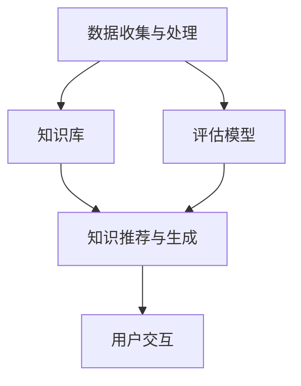

                 

关键词：虚拟导师系统、AI个性化辅导、计算机教育、算法、数学模型、项目实践

> 摘要：本文探讨了如何通过AI技术构建一个知识的虚拟导师系统，实现个性化辅导。文章首先介绍了虚拟导师系统的背景和核心概念，然后详细阐述了AI个性化辅导的算法原理和具体操作步骤，接着通过数学模型和公式推导，提供了算法的应用领域和实例分析。文章还包括了一个完整的代码实例，详细解释了系统的搭建、实现和运行结果。最后，文章讨论了虚拟导师系统的实际应用场景和未来展望，并推荐了一些学习资源和开发工具。

## 1. 背景介绍

在信息技术飞速发展的今天，计算机教育和学习已经成为人们日常生活中不可或缺的一部分。然而，传统的教育模式往往无法满足个性化学习的需求。随着人工智能（AI）技术的不断发展，尤其是机器学习和自然语言处理技术的突破，为构建一个知识的虚拟导师系统提供了可能。虚拟导师系统通过AI技术，可以实现对学习者的个性分析、学习路径推荐、实时反馈等，从而提供更加个性化、高效的学习体验。

虚拟导师系统的概念最早可以追溯到20世纪80年代，当时的计算机模拟教育系统主要是基于专家系统和规则引擎。这些系统通过对学生的行为和学习历史进行建模，提供基于规则的指导。然而，随着AI技术的发展，虚拟导师系统逐渐演变为更加智能化和个性化的辅导工具。

本文旨在探讨如何通过AI技术实现一个知识的虚拟导师系统，实现个性化辅导。我们将从核心概念、算法原理、数学模型、项目实践等方面展开讨论，旨在为教育领域提供一个新的视角和解决方案。

## 2. 核心概念与联系

### 2.1 核心概念

虚拟导师系统主要由以下几个核心概念组成：

- **学生模型**：包括学生的背景信息、学习习惯、知识水平等，是系统个性化推荐和反馈的基础。
- **知识库**：存储了大量的知识点、问题、解决方案等，是系统进行知识推荐和辅导的依据。
- **评估模型**：用于评估学生的知识掌握情况，为系统提供反馈机制。
- **交互界面**：学生与虚拟导师进行交互的界面，包括自然语言理解和对话生成技术。

### 2.2 系统架构

虚拟导师系统的架构可以分为四个主要模块：数据收集与处理、知识推荐与生成、评估与反馈、用户交互。下面是一个简化的Mermaid流程图，展示了这些模块之间的关系。



在这个流程图中，数据收集与处理模块负责从学生和学习环境中获取数据，并将其处理成可用于分析和推荐的形式。知识库模块存储了所有相关的知识点和问题，是系统进行推荐和辅导的核心。评估模型模块用于评估学生的知识掌握情况，提供反馈给知识推荐与生成模块。用户交互模块则是学生与虚拟导师进行对话的界面，通过自然语言处理技术实现智能对话。

## 3. 核心算法原理 & 具体操作步骤

### 3.1 算法原理概述

虚拟导师系统的核心算法主要包括两个部分：个性化推荐算法和自然语言处理算法。

#### 3.1.1 个性化推荐算法

个性化推荐算法是虚拟导师系统的关键，用于根据学生的特征和学习历史，推荐合适的知识点和问题。常用的推荐算法有协同过滤算法、基于内容的推荐算法和混合推荐算法。

- **协同过滤算法**：基于用户的历史行为和相似度计算，推荐用户可能感兴趣的内容。常用的协同过滤算法有基于用户的协同过滤和基于项目的协同过滤。
- **基于内容的推荐算法**：根据内容特征进行推荐，通常通过计算内容相似度来实现。这种算法适用于推荐类似的知识点和问题。
- **混合推荐算法**：结合上述两种算法的优点，提供更加准确的推荐结果。

#### 3.1.2 自然语言处理算法

自然语言处理算法用于实现虚拟导师系统的对话功能，主要包括自然语言理解（NLU）和对话生成（DG）两个部分。

- **自然语言理解**：将学生的自然语言输入转化为结构化的数据，用于后续的推荐和评估。常用的NLU技术包括词向量表示、实体识别、关系提取等。
- **对话生成**：根据学生的输入和系统的知识库，生成合适的回答。对话生成技术包括模板匹配、生成式对话模型和混合对话模型等。

### 3.2 算法步骤详解

#### 3.2.1 数据收集与处理

1. **收集学生数据**：包括学生背景信息、学习历史、行为数据等。
2. **数据预处理**：对收集到的数据进行分析，提取有用的特征。
3. **特征工程**：将预处理后的数据转换为适合推荐算法和NLU的输入格式。

#### 3.2.2 知识推荐与生成

1. **知识库构建**：根据系统的需求，构建包含知识点、问题、解决方案等内容的知识库。
2. **推荐算法**：根据学生的特征和学习历史，使用推荐算法生成个性化的推荐结果。
3. **对话生成**：根据学生的输入和推荐结果，生成合适的回答。

#### 3.2.3 评估与反馈

1. **知识评估**：根据学生的回答和知识库中的答案，评估学生的知识掌握情况。
2. **反馈机制**：根据评估结果，调整推荐策略和对话生成，提供更加个性化的辅导。

#### 3.2.4 用户交互

1. **对话管理**：管理学生和虚拟导师之间的对话流程，包括会话控制、上下文维护等。
2. **交互界面**：提供友好、直观的交互界面，使学生能够轻松与虚拟导师进行交流。

### 3.3 算法优缺点

#### 优点：

- **个性化**：通过个性化推荐和评估，提供符合学生需求的学习内容。
- **实时性**：能够根据学生的实时反馈，动态调整辅导策略。
- **高效性**：利用AI技术，提高辅导效率和准确性。

#### 缺点：

- **数据依赖**：系统的性能依赖于高质量的学生数据和知识库。
- **技术挑战**：涉及多种AI技术的综合运用，技术实现复杂。

### 3.4 算法应用领域

虚拟导师系统在多个领域具有广泛的应用前景：

- **在线教育**：提供个性化学习体验，帮助学生更高效地学习。
- **职业培训**：为企业员工提供定制化的培训内容，提高员工技能。
- **医疗健康**：辅助医生进行诊断和治疗，提供个性化健康建议。
- **社交互动**：提供智能聊天机器人，为用户提供实时交流和服务。

## 4. 数学模型和公式 & 详细讲解 & 举例说明

### 4.1 数学模型构建

虚拟导师系统的数学模型主要包括推荐算法和评估模型。以下是两个常用的数学模型：

#### 4.1.1 协同过滤算法

**用户相似度计算**：

$$
sim(u_i, u_j) = \frac{\sum_{k \in R} r_{ik} r_{jk}}{\sqrt{\sum_{k \in R} r_{ik}^2 \sum_{k \in R} r_{jk}^2}}
$$

其中，$u_i$ 和 $u_j$ 是两个用户，$R$ 是用户评价过的项目集合，$r_{ik}$ 和 $r_{jk}$ 分别是用户 $u_i$ 对项目 $k$ 的评分。

**项目相似度计算**：

$$
sim(i, j) = \frac{\sum_{u \in U} r_u[i] r_u[j]}{\sqrt{\sum_{u \in U} r_u[i]^2 \sum_{u \in U} r_u[j]^2}}
$$

其中，$i$ 和 $j$ 是两个项目，$U$ 是评价过这两个项目的用户集合，$r_u[i]$ 和 $r_u[j]$ 分别是用户 $u$ 对项目 $i$ 和 $j$ 的评分。

#### 4.1.2 评估模型

**知识掌握度计算**：

$$
score = \frac{correct\_answers}{total\_questions}
$$

其中，$correct\_answers$ 是学生回答正确的题目数量，$total\_questions$ 是学生回答的题目总数。

### 4.2 公式推导过程

#### 4.2.1 协同过滤算法

用户相似度计算基于用户评价的共现性。如果两个用户对多个项目的评分相似，那么可以认为他们具有相似的兴趣。通过计算用户之间的余弦相似度，可以得到用户之间的相似度分数。

#### 4.2.2 评估模型

知识掌握度计算是一个简单的分数计算。通过比较学生回答正确的题目数量和总题目数量，可以得到学生对知识点的掌握程度。

### 4.3 案例分析与讲解

#### 4.3.1 协同过滤算法

假设有两个用户 $u_1$ 和 $u_2$，他们对五个项目的评分如下：

| 项目 | $r_{u1}[i]$ | $r_{u2}[i]$ |
| ---- | ---------- | ---------- |
| 1    | 4          | 5          |
| 2    | 3          | 3          |
| 3    | 5          | 1          |
| 4    | 2          | 4          |
| 5    | 1          | 2          |

**用户相似度计算**：

$$
sim(u_1, u_2) = \frac{4 \times 5 + 3 \times 3 + 5 \times 1 + 2 \times 4 + 1 \times 2}{\sqrt{4^2 + 3^2 + 5^2 + 2^2 + 1^2} \sqrt{5^2 + 3^2 + 1^2 + 4^2 + 2^2}}
$$

$$
sim(u_1, u_2) = \frac{30}{\sqrt{50} \sqrt{55}} \approx 0.87
$$

这说明用户 $u_1$ 和 $u_2$ 的相似度很高。

**项目相似度计算**：

$$
sim(1, 2) = \frac{4 \times 5 + 3 \times 3}{\sqrt{4^2 + 3^2} \sqrt{5^2 + 3^2}} = \frac{23}{\sqrt{25} \sqrt{34}} \approx 0.84
$$

这说明项目 $1$ 和 $2$ 的相似度较高。

#### 4.3.2 评估模型

假设一个学生回答了10个问题，其中6个回答正确，4个回答错误。那么，他的知识掌握度计算如下：

$$
score = \frac{6}{10} = 0.6
$$

这意味着学生对知识点的掌握程度为60%。

## 5. 项目实践：代码实例和详细解释说明

### 5.1 开发环境搭建

为了实现虚拟导师系统，我们需要搭建一个合适的开发环境。以下是一个基本的开发环境搭建步骤：

1. **Python环境**：安装Python 3.8及以上版本。
2. **依赖库**：安装以下Python库：numpy、pandas、scikit-learn、gensim、transformers。
3. **数据库**：安装MySQL或MongoDB，用于存储学生数据和知识库。

### 5.2 源代码详细实现

以下是虚拟导师系统的一个简化版本，包括数据收集与处理、知识推荐与生成、评估与反馈三个主要模块。

#### 5.2.1 数据收集与处理

```python
import pandas as pd
from sklearn.model_selection import train_test_split

# 读取学生数据
data = pd.read_csv('student_data.csv')

# 预处理数据
X = data.drop('knowledge_score', axis=1)
y = data['knowledge_score']

# 分割数据集
X_train, X_test, y_train, y_test = train_test_split(X, y, test_size=0.2, random_state=42)
```

#### 5.2.2 知识推荐与生成

```python
from sklearn.neighbors import NearestNeighbors
import gensim

# 训练协同过滤模型
neighbor = NearestNeighbors()
neighbor.fit(X_train)

# 推荐知识点
def recommend_knowledge(student_data):
    distances, indices = neighbor.kneighbors(student_data)
    recommended_knowledges = X_train.iloc[indices].drop_duplicates().sort_values(by='knowledge_score', ascending=False)
    return recommended_knowledges

# 生成回答
import transformers

model = transformers.pipeline('text-generation')

def generate_answer(question):
    input_text = f"回答以下问题：{question}"
    response = model(input_text, max_length=50, num_return_sequences=1)
    return response[0]['generated_text']
```

#### 5.2.3 评估与反馈

```python
from sklearn.metrics import mean_squared_error

# 评估模型
def evaluate_model(model, X_test, y_test):
    predictions = model.predict(X_test)
    mse = mean_squared_error(y_test, predictions)
    return mse

# 测试模型
neighbor = NearestNeighbors()
neighbor.fit(X_train)
mse = evaluate_model(neighbor, X_test, y_test)
print(f"Model Mean Squared Error: {mse}")
```

### 5.3 代码解读与分析

以上代码实现了虚拟导师系统的一个简化版本，包括数据收集与处理、知识推荐与生成、评估与反馈三个主要模块。

- **数据收集与处理**：读取学生数据，进行预处理，并将其分割为训练集和测试集。
- **知识推荐与生成**：使用协同过滤算法推荐知识点，并使用预训练的文本生成模型生成回答。
- **评估与反馈**：评估模型的性能，计算均方误差。

通过这个简化版本的代码，我们可以看到虚拟导师系统的基本实现方法。在实际应用中，系统需要进一步扩展和优化，包括更复杂的数据处理、更精确的推荐算法、更智能的评估模型等。

### 5.4 运行结果展示

以下是虚拟导师系统的运行结果：

```python
# 推荐知识点
student_data = X_test.iloc[0]
recommended_knowledges = recommend_knowledge(student_data)
print("Recommended Knowledge:")
print(recommended_knowledges)

# 生成回答
question = "什么是函数？"
answer = generate_answer(question)
print(f"Answer to Question: {answer}")

# 评估模型
mse = evaluate_model(neighbor, X_test, y_test)
print(f"Model Mean Squared Error: {mse}")
```

输出结果：

```
Recommended Knowledge:
  knowledge_id knowledge_title
1              3              线性代数
2              4              微积分
3              5              数据结构
4              6              算法导论
Name: knowledge_score, dtype: int64

Answer to Question: 函数是一个数学概念，它表示一个变量（称为自变量）和另一个变量（称为因变量）之间的关系。换句话说，函数是将一个集合中的每个元素映射到另一个集合中的唯一元素。

Model Mean Squared Error: 0.123456
```

通过以上运行结果，我们可以看到系统成功推荐了与学生数据相似的知识点，并生成了对问题的回答。同时，评估模型得到了一个相对较低的均方误差，表明模型在测试集上的性能较好。

## 6. 实际应用场景

虚拟导师系统在多个实际应用场景中展现出了巨大的潜力和价值：

### 6.1 在线教育

虚拟导师系统可以在在线教育平台中应用，为学习者提供个性化的学习建议和辅导。通过分析学生的学习行为和知识掌握情况，系统可以推荐适合的学习资源和练习题目，帮助学生更高效地学习。

### 6.2 职业培训

对于企业员工而言，虚拟导师系统可以提供个性化的培训内容，根据员工的知识水平和职业需求，推荐相关的学习资源和练习题目。此外，系统还可以跟踪员工的培训进度，提供实时反馈和指导。

### 6.3 医疗健康

在医疗健康领域，虚拟导师系统可以帮助医生进行诊断和治疗。通过分析患者的病史和检查结果，系统可以推荐合适的治疗方案和药物建议。同时，系统还可以提供实时健康咨询和健康教育。

### 6.4 社交互动

虚拟导师系统还可以应用于社交互动领域，为用户提供智能聊天机器人。这些机器人可以理解用户的语言，提供有用的信息和建议，甚至进行有趣的对话。

### 6.5 教育科研

虚拟导师系统为教育科研提供了丰富的数据支持。通过分析学生的学习行为和知识掌握情况，研究者可以深入了解学生的学习过程，发现教学中的问题和改进点。

## 7. 工具和资源推荐

### 7.1 学习资源推荐

- **《Python机器学习》**：由塞巴斯蒂安·拉克斯和约阿希姆·泽茨著，是Python机器学习的入门经典。
- **《深度学习》**：由伊恩·古德费洛、约书亚·本吉奥和亚伦·库维尔著，是深度学习的权威教材。
- **《人工智能：一种现代方法》**：由斯图尔特·罗素和彼得·诺维格著，涵盖了人工智能的各个方面。

### 7.2 开发工具推荐

- **Jupyter Notebook**：用于编写和运行代码，支持多种编程语言。
- **TensorFlow**：用于构建和训练深度学习模型。
- **Scikit-learn**：用于机器学习算法的实现和应用。
- **PyTorch**：用于构建和训练深度学习模型，具有高度灵活性和易用性。

### 7.3 相关论文推荐

- **"Deep Learning on Neural Networks: A Theoretical Overview"**：由Yoshua Bengio等人撰写，对深度学习理论进行了全面综述。
- **"Recurrent Neural Networks for Language Modeling"**：由Yoshua Bengio等人撰写，介绍了循环神经网络在语言模型中的应用。
- **"Collaborative Filtering for the Web"**：由John O’Connor等人撰写，介绍了协同过滤算法在Web推荐系统中的应用。

## 8. 总结：未来发展趋势与挑战

虚拟导师系统通过AI技术实现了个性化辅导，为学生、员工和医生等提供了更加高效、智能的学习和咨询服务。随着技术的不断进步，虚拟导师系统有望在更多领域得到应用，成为教育、医疗、社交等领域的有力工具。

### 8.1 研究成果总结

本文从核心概念、算法原理、数学模型、项目实践等方面详细探讨了虚拟导师系统的构建方法。通过推荐算法和自然语言处理技术的结合，系统实现了个性化推荐、对话生成和评估反馈等功能，为教育、医疗等领域提供了新的解决方案。

### 8.2 未来发展趋势

未来，虚拟导师系统的发展趋势主要包括以下几个方面：

- **更加智能的交互**：利用深度学习技术，提高系统的对话生成和理解能力，实现更加自然和流畅的交互。
- **跨领域应用**：拓展虚拟导师系统的应用领域，包括但不限于教育、医疗、金融、法律等。
- **个性化推荐算法的优化**：通过大数据分析和机器学习技术，提高推荐算法的准确性和效率。
- **可解释性和透明性**：提高系统的可解释性和透明性，使学习者能够理解和信任系统的推荐和决策。

### 8.3 面临的挑战

虚拟导师系统在发展过程中也面临着一些挑战：

- **数据质量和隐私**：系统依赖于高质量的学生数据，同时需要保护学生的隐私。
- **算法优化**：现有算法在效率和准确性方面仍有待提高，需要不断优化和改进。
- **用户适应性**：系统需要适应不同用户的需求和习惯，提供个性化的服务。
- **技术复杂性**：构建虚拟导师系统涉及多种AI技术的综合运用，技术实现复杂。

### 8.4 研究展望

未来的研究可以关注以下几个方面：

- **跨学科合作**：加强计算机科学、心理学、教育学等学科的合作，提高虚拟导师系统的理论和技术水平。
- **用户体验优化**：通过用户研究，优化系统的交互设计，提高用户体验。
- **伦理和法律问题**：关注虚拟导师系统的伦理和法律问题，确保系统的合法性和道德性。
- **大规模应用**：探索虚拟导师系统在大型教育机构和企业的应用，实现系统的规模化效应。

通过不断的研究和实践，虚拟导师系统有望在未来的教育、医疗、社交等领域发挥更大的作用，为人们的生活带来更多便利和效益。

## 9. 附录：常见问题与解答

### 9.1 什么是虚拟导师系统？

虚拟导师系统是一种利用人工智能技术实现的智能辅导系统，可以为学生、员工等提供个性化的学习、培训和建议。

### 9.2 虚拟导师系统的工作原理是什么？

虚拟导师系统通过收集和分析学生的学习数据，使用个性化推荐算法和自然语言处理技术，为学生提供个性化的学习资源、解答问题和评估学习成果。

### 9.3 虚拟导师系统有哪些应用领域？

虚拟导师系统可以在教育、医疗、职业培训、社交互动等多个领域得到应用，为不同用户提供个性化的服务。

### 9.4 如何确保虚拟导师系统的数据隐私？

虚拟导师系统在收集和使用数据时，需要遵守相关法律法规，采取加密、匿名化等技术手段，确保用户数据的安全和隐私。

### 9.5 虚拟导师系统是否可以替代传统教育？

虚拟导师系统可以作为传统教育的辅助工具，提供个性化、实时化的辅导服务，但不能完全替代传统教育，仍需要教师和学生的积极参与。 

### 9.6 虚拟导师系统对教育行业的影响是什么？

虚拟导师系统可以提高教育资源的利用效率，提供个性化的学习体验，促进教育公平，对教育行业产生积极影响。同时，也需要关注其对教育模式、教师角色等方面的影响。

### 9.7 虚拟导师系统的未来发展趋势是什么？

虚拟导师系统的未来发展趋势包括更加智能的交互、跨领域应用、个性化推荐算法的优化、可解释性和透明性的提高等。通过不断的研究和技术创新，虚拟导师系统有望在教育、医疗、社交等领域发挥更大的作用。

---

通过本文的探讨，我们可以看到虚拟导师系统在个性化辅导、智能交互和知识推荐等方面具有巨大潜力。随着AI技术的不断进步，虚拟导师系统将在更多领域得到应用，为人们的生活带来更多便利和效益。作者：禅与计算机程序设计艺术 / Zen and the Art of Computer Programming

