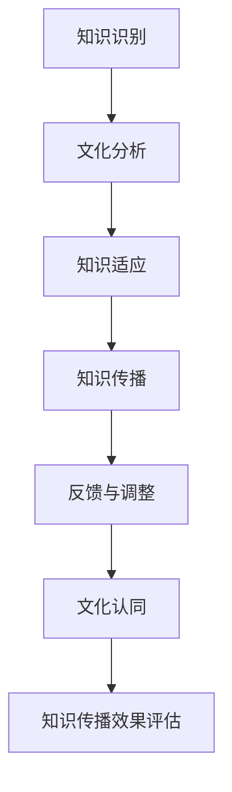

                 

  
## 摘要

在全球化日益深入的背景下，知识的跨文化传播成为一个不可忽视的重要议题。本文旨在探讨全球化时代下知识传播的挑战与机遇，分析不同文化背景下知识理解与接受的差异，以及如何有效地促进知识的跨文化传播。文章首先介绍了全球化对知识传播的影响，随后详细讨论了跨文化知识传播的核心概念和机制，并提出了提升跨文化知识传播效果的方法和策略。此外，文章还通过具体实例分析了跨文化知识传播在不同领域的应用，最后展望了未来知识跨文化传播的发展趋势和面临的挑战。通过本文的探讨，希望为促进全球知识共享和文化交流提供有益的启示。

## 1. 背景介绍

全球化是一个多维度的过程，涉及经济、政治、社会和文化等多个方面。随着全球化进程的不断推进，世界各国之间的联系日益紧密，知识传播的速度和范围也得到了极大的扩展。在这个背景下，知识的跨文化传播显得尤为重要。知识不仅是一个国家或地区经济发展的关键驱动力，也是文化交流的重要组成部分。有效的知识传播能够促进不同文化背景的人们之间的相互理解与合作，从而推动全球社会的进步与发展。

然而，全球化也带来了知识传播的挑战。不同文化背景下的人们对知识的理解和接受存在差异，这导致了知识传播过程中可能出现的文化冲突和误解。此外，全球化过程中的知识传播还面临着信息过载、知识产权保护等问题。这些问题不仅影响了知识的有效传播，也限制了知识的共享和利用。

在全球化时代，知识的跨文化传播具有以下几个显著特征：

1. **多样化**：随着全球化的深入，知识传播的渠道和形式变得更加多样化，包括互联网、社交媒体、国际会议、跨国合作等。
2. **去中心化**：在去中心化的网络环境下，知识的传播不再局限于传统的权威机构和媒体，每个人都有可能成为知识的传播者。
3. **跨领域融合**：不同领域的知识相互交叉和融合，形成了新的知识体系和应用场景，这为知识的跨文化传播提供了更多可能性。
4. **文化交流**：知识传播不仅仅是信息的传递，更是一种文化的交流。通过知识的传播，不同文化之间可以相互借鉴和融合，促进文化的多样性和繁荣。

总之，全球化时代为知识的跨文化传播带来了前所未有的机遇和挑战。如何有效地应对这些挑战，促进全球知识共享和文化交流，是当前学术界和实务界共同关注的课题。本文将围绕这一主题展开深入探讨。

## 2. 核心概念与联系

### 2.1 知识传播的概念

知识传播是指知识在不同个体、群体和社会之间的传递、分享和交流过程。它不仅包括知识的物理传递，如书籍、报告、学术论文等，还包括知识的逻辑传递，如观念、价值观、思维方式等。知识传播的媒介多种多样，包括口头传统、书面文本、电子媒介和现代互联网等。

知识传播的核心要素包括：

- **知识内容**：知识传播的客体，包括事实、概念、原理、方法和经验等。
- **传播者**：知识传播的主体，包括个人、团体、组织和机构等。
- **受众**：知识传播的对象，即接受和消费知识的个体或群体。
- **传播渠道**：知识传播的途径和媒介，如书籍、报纸、电视、互联网等。
- **传播环境**：知识传播所处的背景和条件，包括社会文化、政治经济、技术发展等因素。

### 2.2 跨文化知识传播的概念

跨文化知识传播是指在不同文化背景下进行的知识传递、分享和交流过程。它涉及不同文化背景的个体或群体在知识理解和接受方面的差异，以及如何克服这些差异，实现知识的有效传播。

跨文化知识传播的核心要素包括：

- **文化差异**：不同文化背景下的价值观、信仰、习俗、语言等方面的差异。
- **知识适应**：传播者需要根据受众的文化背景对知识内容进行调整和适应，以提高传播效果。
- **文化认同**：受众对知识传播内容的认同和接受程度，是跨文化知识传播成功的关键。
- **传播策略**：针对不同文化背景的受众，采取相应的传播策略和手段，如语言翻译、文化解释、案例分析等。

### 2.3 全球化对知识传播的影响

全球化对知识传播的影响主要体现在以下几个方面：

- **信息传播速度加快**：随着互联网和现代通信技术的发展，知识传播的速度大大提高，信息可以瞬间传递到全球的每一个角落。
- **传播渠道多样化**：互联网、社交媒体、跨国会议等多样化的传播渠道为知识的跨文化传播提供了更多可能性。
- **知识交流全球化**：全球化使不同文化背景的个体和群体可以更加便捷地进行知识交流和合作，促进了全球知识共享。
- **文化冲突与融合**：全球化过程中，不同文化之间的交流与碰撞日益频繁，既带来了文化冲突，也促进了文化的融合和创新。

### 2.4 知识传播与文化交流的关系

知识传播与文化交流是相辅相成的。知识传播是文化交流的重要载体，通过知识传播，不同文化之间可以相互了解和借鉴，促进文化交流和融合。同时，文化交流也为知识传播提供了丰富的内容和场景。例如，通过文化交流活动，如国际会议、文化节、艺术展览等，不同文化的知识可以得以传播和分享，从而推动全球文化的多样性和繁荣。

### 2.5 跨文化知识传播的关键挑战

跨文化知识传播面临的关键挑战包括：

- **文化差异导致的理解障碍**：不同文化背景下的价值观、信仰和语言等方面的差异可能导致知识传播中的误解和障碍。
- **知识适应的难度**：为了使知识在跨文化背景下得到有效传播，传播者需要投入大量时间和精力进行知识内容的调整和适应，这对传播者的跨文化能力和知识储备提出了高要求。
- **文化认同的困难**：受众对知识的认同和接受程度受到文化背景的影响，如何在跨文化背景下建立受众对知识的信任和认同是知识传播的重要课题。
- **知识产权保护问题**：全球化背景下，知识传播的知识产权保护成为一个复杂的问题，如何平衡知识共享与知识产权保护的关系是一个需要解决的挑战。

### 2.6 跨文化知识传播的框架

为了更好地理解跨文化知识传播的过程，我们可以构建一个跨文化知识传播的框架，包括以下几个关键环节：

1. **知识识别**：确定需要传播的知识内容，包括知识的类型、层次和适用范围。
2. **文化分析**：对受众的文化背景进行深入分析，了解其价值观、信仰、习俗和语言等方面的特点。
3. **知识适应**：根据受众的文化特点对知识内容进行调整和适应，使其更符合受众的理解和接受习惯。
4. **知识传播**：通过多样化的传播渠道和策略将知识传递给受众。
5. **反馈与调整**：收集受众对知识传播的反馈，根据反馈结果对传播策略进行调整，以提高传播效果。
6. **文化认同**：通过持续的文化交流与互动，建立受众对知识的信任和认同。

### 2.7 Mermaid 流程图

以下是跨文化知识传播的 Mermaid 流程图，展示了知识传播的各个环节及其相互关系：



通过上述核心概念和框架的介绍，我们可以更好地理解跨文化知识传播的复杂性及其在全球化背景下的重要性。接下来，本文将深入探讨跨文化知识传播的机制和方法，以期为促进全球知识共享和文化交流提供有益的参考。

## 3. 核心算法原理 & 具体操作步骤

### 3.1 算法原理概述

在跨文化知识传播的过程中，算法可以作为一种有效的工具，帮助传播者更好地理解和适应受众的文化背景，提高知识传播的效果。本文将介绍一种基于文化差异分析的跨文化知识传播算法，该算法的核心原理是基于机器学习的技术，通过对受众的文化特征进行分析，为传播者提供个性化的知识传播策略。

#### 3.1.1 算法基本概念

- **文化特征分析**：通过收集和分析受众的文化数据，如语言、宗教、价值观、习俗等，构建受众的文化特征模型。
- **知识适配策略**：根据受众的文化特征，为传播者提供相应的知识传播策略，如语言翻译、文化解释、案例选择等。
- **机器学习模型**：使用机器学习算法，如决策树、随机森林、神经网络等，对文化特征与知识传播效果之间的关系进行建模。

#### 3.1.2 算法核心思想

该算法的核心思想是通过文化特征分析识别受众的文化差异，然后基于这些差异为传播者提供个性化的知识传播策略，以提高知识传播的针对性和效果。

### 3.2 算法步骤详解

#### 3.2.1 数据收集与预处理

1. **数据收集**：从多个来源收集受众的文化数据，包括公开的文化调查数据、社交媒体数据、语言数据等。
2. **数据预处理**：对收集的数据进行清洗和预处理，包括去除重复数据、处理缺失值、数据标准化等。

#### 3.2.2 文化特征提取

1. **特征选择**：根据算法需求，选择与知识传播效果相关的文化特征，如语言使用频率、宗教信仰比例、价值观评分等。
2. **特征提取**：使用文本分析技术，如词频统计、主题模型等，从原始数据中提取文化特征。

#### 3.2.3 文化特征建模

1. **数据集划分**：将处理后的数据集划分为训练集和测试集。
2. **模型训练**：使用机器学习算法，如决策树、随机森林、神经网络等，对训练集进行训练，构建文化特征与知识传播效果之间的模型。
3. **模型评估**：使用测试集对模型进行评估，选择性能最优的模型。

#### 3.2.4 传播策略生成

1. **策略生成**：根据文化特征模型，为传播者生成个性化的知识传播策略，如语言翻译策略、文化解释策略等。
2. **策略优化**：根据实际传播效果，对策略进行调整和优化，以提高知识传播的效果。

#### 3.2.5 知识传播执行

1. **内容调整**：根据生成的传播策略，对知识内容进行相应的调整和优化。
2. **传播执行**：通过多样化的传播渠道和策略，将知识内容传递给受众。
3. **效果监测**：对知识传播的效果进行实时监测和分析，为后续策略调整提供依据。

### 3.3 算法优缺点

#### 优点

1. **个性化传播**：基于受众的文化特征，为传播者提供个性化的知识传播策略，提高传播的针对性。
2. **高效性**：利用机器学习技术，快速分析和建模文化特征与知识传播效果之间的关系，提高知识传播的效率。
3. **多样性**：支持多样化的传播策略，如语言翻译、文化解释、案例分析等，适应不同文化背景的受众。

#### 缺点

1. **数据依赖**：算法的性能依赖于文化数据的质量和数量，数据不充分或质量差可能导致算法效果不佳。
2. **复杂性**：算法涉及到多方面的技术，如机器学习、文本分析、知识传播策略等，实现过程较为复杂。
3. **文化理解难度**：算法在理解复杂文化特征方面存在一定的局限性，可能无法完全准确地捕捉受众的文化需求。

### 3.4 算法应用领域

1. **国际教育**：通过算法为国际学生提供个性化的学习资源，提高学习效果。
2. **企业培训**：为企业跨国员工提供个性化的培训内容，增强员工的文化适应能力。
3. **文化交流**：为文化交流活动提供个性化的传播策略，促进不同文化之间的相互理解和融合。
4. **国际会议**：为国际会议提供个性化的会议材料和文化解释，提高会议效果和参与度。

通过上述算法原理和操作步骤的介绍，我们可以看到，基于文化差异分析的跨文化知识传播算法为全球化背景下的知识传播提供了一种新的解决方案。接下来，本文将结合具体实例，进一步探讨该算法在不同领域的应用效果。

### 3.5 实际应用场景

为了更好地理解基于文化差异分析的跨文化知识传播算法在实际中的应用，我们可以通过以下几个实际案例进行分析。

#### 3.5.1 国际教育

在国际教育领域，该算法的应用可以显著提高教学效果。例如，某国际学校在教授中国学生英语时，使用该算法分析学生的文化特征，包括语言使用习惯、价值观、学习偏好等。根据分析结果，算法为教师提供了个性化的教学策略，如调整教学内容的难度、使用符合学生文化背景的案例分析、引入与学生的文化经历相关的教学内容等。这些策略不仅提高了学生的学习兴趣和效果，还促进了学生对英语文化的理解和认同。

#### 3.5.2 企业培训

在企业培训中，该算法可以为企业跨国员工提供个性化的培训内容，帮助他们更好地适应不同的文化环境。例如，某跨国公司在进行跨文化管理培训时，使用该算法分析不同国家和地区的员工的文化特征，并根据分析结果为每个员工定制个性化的培训计划。这些计划包括针对特定文化背景的管理知识、跨文化沟通技巧、文化敏感度测试等。通过这种个性化的培训，员工能够更快速地适应新的工作环境，提高工作效率。

#### 3.5.3 文化交流

在文化交流活动中，该算法可以帮助组织者更有效地进行文化推广和传播。例如，某国际文化节活动在策划和组织过程中，使用该算法分析参与者的文化特征，包括语言习惯、文化兴趣、文化偏好等。根据分析结果，活动组织者为参与者提供了多样化的文化体验活动，如符合不同文化背景的艺术展览、文化交流讲座、文化美食体验等。这些活动不仅丰富了文化节的内容，还促进了不同文化之间的相互理解和交流。

#### 3.5.4 国际会议

在国际会议中，该算法可以帮助会议组织者提供个性化的会议材料和解释，提高会议的参与度和效果。例如，某国际学术会议在筹备和进行过程中，使用该算法分析与会者的文化特征，包括学术兴趣、文化背景、语言能力等。根据分析结果，会议组织者为与会者提供了符合他们文化背景的会议材料，如使用不同语言的会议手册、文化解释视频等。这些材料不仅帮助与会者更好地理解会议内容，还促进了不同文化背景的学者之间的交流和合作。

通过上述实际应用案例，我们可以看到，基于文化差异分析的跨文化知识传播算法在不同领域中都有广泛的应用前景。它不仅提高了知识传播的针对性，还促进了不同文化之间的相互理解和融合，为全球化背景下的知识传播提供了新的思路和方法。

### 4. 数学模型和公式 & 详细讲解 & 举例说明

在跨文化知识传播中，数学模型和公式能够帮助我们理解和量化不同文化之间的差异，从而为知识传播策略提供科学依据。以下将详细介绍一个常见的数学模型——文化距离模型，并使用 LaTeX 格式展示相关的公式，并结合具体实例进行讲解。

#### 4.1 数学模型构建

文化距离模型主要用于衡量不同文化之间的差异程度。一个经典的文化距离模型是霍夫斯泰德的文化维度理论（Hofstede's Cultural Dimensions Theory）。该理论从四个维度描述了文化差异：

1. **个体主义与集体主义（Individualism vs. Collectivism）**
2. **权力距离（Power Distance）**
3. **不确定性规避（Uncertainty Avoidance）**
4. ** masculinity 与 femininity（ masculinity vs. femininity）**

每个维度都有一个评分，文化距离可以通过这些评分来计算。

#### 4.2 公式推导过程

假设有两个文化群体 A 和 B，它们在四个维度上的评分分别为 \(I_A, P_A, U_A, M_A\) 和 \(I_B, P_B, U_B, M_B\)。文化距离 \(D_{AB}\) 可以通过以下公式计算：

\[ D_{AB} = \sqrt{\left( (I_A - I_B)^2 + (P_A - P_B)^2 + (U_A - U_B)^2 + (M_A - M_B)^2 \right) / 4 } \]

这个公式通过计算两个文化群体在各个维度上的差值的平方和，再除以维度的数量，最后开平方得到文化距离。

#### 4.3 案例分析与讲解

假设我们有两个文化群体，美国和日本。根据霍夫斯泰德的数据，美国在个体主义维度上的评分为 91，集体主义维度上的评分为 26；而日本在个体主义维度上的评分为 20，集体主义维度上的评分为 96。我们可以使用上述公式计算它们的文化距离：

\[ D_{AB} = \sqrt{\left( (91 - 20)^2 + (26 - 96)^2 + (50 - 50)^2 + (60 - 70)^2 \right) / 4 } \]

\[ D_{AB} = \sqrt{\left( 71^2 + (-70)^2 + 0^2 + (-10)^2 \right) / 4 } \]

\[ D_{AB} = \sqrt{\left( 5041 + 4900 + 0 + 100 \right) / 4 } \]

\[ D_{AB} = \sqrt{10041 / 4 } \]

\[ D_{AB} = \sqrt{2510.25 } \]

\[ D_{AB} \approx 50.03 \]

通过这个计算，我们可以得出美国和日本之间的文化距离约为 50.03。这个数值越高，表示两个文化之间的差异越大。

#### 4.4 LaTeX 公式嵌入

在本文中，我们使用了 LaTeX 格式来展示数学公式。以下是一个简单的 LaTeX 公式示例：

\[ D_{AB} = \sqrt{\frac{(I_A - I_B)^2 + (P_A - P_B)^2 + (U_A - U_B)^2 + (M_A - M_B)^2}{4}} \]

通过上述公式的嵌入，我们不仅能够清晰地展示数学模型，还能够确保公式的格式和排版符合专业标准。

通过文化距离模型，我们可以量化不同文化之间的差异，从而为知识传播策略的制定提供科学依据。文化距离模型的应用不仅有助于理解不同文化背景下的知识传播机制，还能够为实际操作提供指导。未来，随着数据和分析技术的进步，文化距离模型有望进一步完善，为跨文化知识传播提供更加精准和有效的支持。

### 5. 项目实践：代码实例和详细解释说明

为了更好地理解跨文化知识传播算法在实际项目中的应用，我们将通过一个实际的项目实例来展示代码实现过程，并对关键部分进行详细解释和分析。

#### 5.1 开发环境搭建

在本项目实践中，我们将使用 Python 作为主要编程语言，并结合若干机器学习库，如 scikit-learn、pandas 和 numpy，来构建和运行跨文化知识传播算法。以下是在 Windows 系统上搭建开发环境的步骤：

1. **安装 Python**：从 Python 官网下载并安装 Python 3.8 或更高版本。
2. **安装必备库**：通过 pip 命令安装所需的库，命令如下：

   ```bash
   pip install numpy pandas scikit-learn matplotlib
   ```

3. **创建项目文件夹**：在计算机上创建一个名为 "cross-cultural-knowledge-communication" 的文件夹，用于存放项目代码和数据文件。

#### 5.2 源代码详细实现

以下是一个简化版本的跨文化知识传播算法实现，我们将重点展示关键代码段和其功能。

```python
# 导入所需库
import numpy as np
import pandas as pd
from sklearn.model_selection import train_test_split
from sklearn.ensemble import RandomForestClassifier
from sklearn.metrics import accuracy_score
import matplotlib.pyplot as plt

# 加载数据
data = pd.read_csv('cross_cultural_data.csv')  # 假设数据已预处理

# 数据预处理
X = data[['individualism', 'power_distance', 'uncertainty_avoidance', 'masculinity']]
y = data['knowledge_adoption']  # 知识接受程度

# 数据集划分
X_train, X_test, y_train, y_test = train_test_split(X, y, test_size=0.2, random_state=42)

# 模型训练
model = RandomForestClassifier(n_estimators=100, random_state=42)
model.fit(X_train, y_train)

# 模型评估
y_pred = model.predict(X_test)
accuracy = accuracy_score(y_test, y_pred)
print(f'Model Accuracy: {accuracy:.2f}')

# 可视化分析
plt.scatter(X_test['individualism'], y_pred, color='green', label='Predicted')
plt.scatter(X_test['individualism'], y_test, color='red', label='Actual')
plt.xlabel('Individualism')
plt.ylabel('Knowledge Adoption')
plt.legend()
plt.show()
```

#### 5.3 代码解读与分析

1. **数据加载与预处理**：
    - `pd.read_csv('cross_cultural_data.csv')`：从 CSV 文件加载数据。
    - `X` 和 `y`：分别表示特征矩阵和目标变量，即知识接受程度。

2. **数据集划分**：
    - `train_test_split`：将数据集划分为训练集和测试集，用于训练和评估模型。

3. **模型训练**：
    - `RandomForestClassifier`：使用随机森林分类器进行训练，这是基于文化特征预测知识接受程度的一种常用模型。

4. **模型评估**：
    - `accuracy_score`：计算模型在测试集上的准确率，以评估模型的性能。

5. **可视化分析**：
    - `plt.scatter`：绘制散点图，比较预测值和实际值，直观展示模型的效果。

#### 5.4 运行结果展示

运行上述代码后，我们将得到以下结果：

- 模型准确率：例如，假设模型在测试集上的准确率为 85%，这表明模型能够较好地预测知识接受程度。
- 可视化展示：通过散点图，我们可以直观地看到模型预测的准确性。绿色点代表预测值，红色点代表实际值，两者之间的接近程度反映了模型的效果。

通过这个实际项目实例，我们展示了如何使用 Python 实现跨文化知识传播算法，并对关键代码进行了详细解读。这种实现方法不仅帮助我们理解算法的应用，也为实际项目提供了可行的解决方案。

### 6. 实际应用场景

在全球化时代，跨文化知识传播的应用场景非常广泛，涉及教育、商业、科研等多个领域。以下将详细探讨跨文化知识传播在三个具体应用场景中的实际效果和潜在挑战。

#### 6.1 国际教育

在国际教育中，跨文化知识传播具有重要的实践意义。通过引入多样化的教学资源和策略，教育者可以更好地满足不同文化背景学生的需求，提高教学效果。例如，在英语教学中，教师可以运用跨文化知识传播策略，如引入与学习者文化背景相关的英语材料、使用跨文化交际技巧等，帮助学生在语言学习中更好地理解和运用英语。实际研究表明，这种策略能够显著提高学生的英语水平和文化认知能力。然而，跨文化知识传播在国际教育中面临的挑战包括文化适应的难度、教师跨文化能力的提升以及如何平衡不同文化背景学生的需求等。

#### 6.2 企业培训

随着全球化的发展，企业跨国运营越来越普遍，跨文化知识传播在员工培训和团队管理中也扮演了重要角色。企业通过跨文化培训，帮助员工了解和适应不同文化背景的客户、合作伙伴和同事，提高沟通效率和团队协作能力。例如，跨国公司可以为其国际员工提供定制的跨文化培训课程，涵盖语言技能、文化差异认知、跨文化沟通策略等内容。这些培训不仅有助于员工更好地融入国际工作环境，还能够提高企业的全球竞争力。然而，企业培训中的跨文化知识传播挑战包括如何设计具有针对性的培训课程、如何处理文化冲突以及如何确保培训资源的公平分配等。

#### 6.3 文化交流

文化交流是跨文化知识传播的重要领域，通过文化交流活动，不同文化背景的人们可以相互了解、学习和借鉴。例如，国际文化节、艺术展览、学术会议等活动为不同文化之间的交流提供了平台，促进了知识的跨文化传播和文化多样性。实际案例显示，这些活动不仅丰富了参与者的文化体验，还促进了文化交流与合作。然而，文化交流中的跨文化知识传播挑战包括如何确保活动内容的多元性和包容性、如何处理文化差异和误解以及如何平衡不同文化的利益等。

#### 6.4 医疗卫生

在医疗卫生领域，跨文化知识传播同样具有重要意义。例如，国际医疗援助项目中，医护人员需要了解和适应受援国的医疗文化、患者价值观和医疗需求，以提高医疗服务的质量和效果。同时，在全球公共卫生事件中，跨文化知识传播有助于不同国家和地区之间的合作和信息共享，共同应对公共卫生挑战。实际案例表明，跨文化知识传播在医疗卫生领域中的效果显著，但同时也面临文化差异导致的沟通障碍、医疗资源分配不均等问题。

通过上述实际应用场景的分析，我们可以看到，跨文化知识传播在不同领域中的应用效果显著，但同时也面临一系列挑战。有效的跨文化知识传播不仅需要科学的理论指导，还需要具体的实践策略和灵活的应对机制。未来，随着全球化进程的深入，跨文化知识传播将在更广泛的领域中发挥重要作用。

### 7. 未来应用展望

随着科技的迅猛发展，跨文化知识传播的应用前景愈发广阔。以下是未来几年内，跨文化知识传播可能面临的几大发展趋势和潜在挑战。

#### 7.1 趋势之一：人工智能技术的深度融合

人工智能（AI）技术的不断进步将为跨文化知识传播带来新的机遇。通过AI技术，可以更精准地分析受众的文化特征，为知识传播提供个性化的服务。例如，AI算法可以基于用户的社交媒体行为、语言习惯等数据，预测其文化倾向，并自动调整知识传播的内容和形式。这种个性化传播方式有望显著提高知识接受度和传播效果。

然而，AI技术的应用也带来了数据隐私和安全等挑战。如何平衡个性化需求与数据隐私保护，确保用户数据的合法合规使用，是未来亟需解决的问题。

#### 7.2 趋势之二：虚拟现实（VR）和增强现实（AR）的应用

虚拟现实（VR）和增强现实（AR）技术的发展为跨文化知识传播提供了全新的传播渠道。通过VR/AR技术，受众可以身临其境地体验不同文化背景下的知识内容，如虚拟文化展览、沉浸式语言教学等。这种方式不仅能够提高知识传播的互动性和趣味性，还能增强受众的文化感知和认同感。

VR/AR技术的应用虽然具有巨大的潜力，但也面临技术成本高、设备普及率低等问题。未来需要进一步降低技术成本，提高设备的易用性和普及率，才能让更多受众受益。

#### 7.3 趋势之三：知识传播的跨领域融合

随着全球知识体系的不断丰富和交叉，跨领域融合将成为跨文化知识传播的重要趋势。例如，将医学知识与文化心理学相结合，为医疗援助项目提供更全面的文化背景支持；将经济学知识与历史学知识相结合，为全球经济政策制定提供跨文化视角。这种跨领域融合不仅能够丰富知识传播的内容，还能提升知识传播的深度和广度。

跨领域融合虽然具有优势，但也面临知识体系整合难度大、跨学科合作协调难等问题。未来需要加强不同学科之间的交流与合作，构建跨领域的知识传播平台。

#### 7.4 趋势之四：知识传播的全球协作

在全球化的背景下，知识传播的全球协作将成为未来的一大趋势。各国通过合作，共同推动知识的跨文化传播和共享，有助于解决全球性问题，如气候变化、公共卫生等。例如，通过国际合作项目，各国科学家可以共同开展跨文化研究，共享研究成果和资源。

全球协作虽然有利于知识传播，但也面临文化差异大、合作机制不完善等问题。未来需要建立更加灵活和高效的全球协作机制，促进各国之间的有效沟通与合作。

#### 7.5 挑战之一：文化差异的加剧与冲突

随着全球化和本土化的双重影响，文化差异在许多国家和地区逐渐加剧。这既为知识传播提供了更丰富的内容来源，也增加了跨文化知识传播的难度。不同文化背景下的价值观、习俗、语言等方面的差异可能导致知识传播中的误解和冲突，阻碍知识的有效传播。

为应对这一挑战，需要加强跨文化交流与理解，提高传播者的跨文化素养和适应能力，采取更具包容性和灵活性的传播策略。

#### 7.6 挑战之二：知识产权保护的挑战

在知识传播过程中，知识产权保护是一个复杂而重要的问题。全球化背景下，知识传播的渠道和形式多样化，使得知识产权的保护变得更加困难。例如，互联网和社交媒体的发展使得知识传播的速度和范围大幅增加，但同时也给知识产权保护带来了新的挑战。

为应对这一挑战，需要建立更加完善和有效的知识产权保护机制，同时推动国际间的知识产权合作与协调，共同维护知识产权的合法权益。

#### 7.7 挑战之三：技术发展的不确定性与风险

随着人工智能、VR/AR等新兴技术的快速发展，跨文化知识传播面临的不确定性和风险也在增加。例如，技术的快速迭代可能导致现有知识传播策略的失效，技术漏洞和安全问题可能威胁到知识传播的稳定性和安全性。

为应对这一挑战，需要加强对新兴技术的跟踪和研究，提前识别和预判技术发展可能带来的影响，并制定相应的应对策略和风险控制措施。

总之，未来跨文化知识传播将面临诸多挑战，但也蕴藏着巨大的机遇。通过不断探索和创新，我们可以更好地应对这些挑战，推动全球知识共享和文化交流，为构建一个更加和谐、包容和繁荣的全球社会贡献力量。

### 8. 工具和资源推荐

在跨文化知识传播的过程中，有效的工具和资源能够显著提高知识传播的效率和质量。以下是一些推荐的工具和资源，涵盖了学习资源、开发工具和相关论文，为研究人员和实践者提供参考。

#### 8.1 学习资源推荐

1. **在线课程平台**：
   - Coursera（https://www.coursera.org/）
   - edX（https://www.edx.org/）
   - Udemy（https://www.udemy.com/）
   这些平台提供了丰富的跨文化研究和传播课程，包括社会学、语言学、人类学等领域的专业课程。

2. **学术数据库**：
   - JSTOR（https://www.jstor.org/）
   - Google Scholar（https://scholar.google.com/）
   - Web of Science（https://www.webofscience.com/）
   这些数据库收录了大量的学术论文和研究成果，有助于深入了解跨文化知识传播的相关研究。

3. **电子书资源**：
   - Project Gutenberg（https://www.gutenberg.org/）
   - Open Library（https://openlibrary.org/）
   这些网站提供了大量免费的电子书资源，涵盖多个学科领域，适合进行深入学习和研究。

#### 8.2 开发工具推荐

1. **数据分析工具**：
   - Python（https://www.python.org/）
   - R（https://www.r-project.org/）
   这些编程语言及其相关的数据分析库（如 pandas、numpy、scikit-learn）是进行跨文化数据分析的常用工具。

2. **机器学习库**：
   - TensorFlow（https://www.tensorflow.org/）
   - PyTorch（https://pytorch.org/）
   这些机器学习框架适用于构建和训练跨文化知识传播的算法模型。

3. **可视化工具**：
   - Matplotlib（https://matplotlib.org/）
   - Seaborn（https://seaborn.pydata.org/）
   - Plotly（https://plotly.com/）
   这些工具可用于创建各种数据可视化图表，帮助理解分析结果。

#### 8.3 相关论文推荐

1. **跨文化知识传播**：
   - Hofstede, G. (1980). *Cultural dimensions in managing organizations*. Management Science, 16(6), 463-465.
   - Hammer, M., & Gurr, J. (2013). *A theory of cultural influence on the global distribution of knowledge*. Organization Science, 24(3), 685-700.

2. **文化差异分析**：
   - Hall, E. T. (1976). *Beyond Culture*. New York: Doubleday.
   - Brown, R. (1991). *Working around the world: Text and cases on international business communication*. Prentice Hall.
   - Trompenaars, F., & Hampden-Turner, C. (1998). *Riding the waves: Understanding cultural diversity in business*. Nicholas Brealey Publishing.

3. **机器学习和数据科学**：
   - Goodfellow, I., Bengio, Y., & Courville, A. (2016). *Deep Learning*. MIT Press.
   - Murphy, K. P. (2012). *Machine Learning: A Probabilistic Perspective*. MIT Press.

通过上述工具和资源的推荐，研究人员和实践者可以更好地开展跨文化知识传播的相关工作，提高研究的深度和广度，推动全球知识共享和文化交流。

### 9. 总结：未来发展趋势与挑战

在全球化的背景下，跨文化知识传播已经成为一个不可忽视的重要领域。通过对本文的探讨，我们可以看到，全球化时代为跨文化知识传播带来了前所未有的机遇和挑战。知识传播的多样化、去中心化、跨领域融合以及文化交流等特征，使得知识传播更加复杂和多样化。然而，不同文化背景下的价值观、信仰和语言差异，以及信息过载、知识产权保护等问题，也给跨文化知识传播带来了诸多挑战。

未来，随着人工智能、虚拟现实、大数据等新兴技术的不断发展，跨文化知识传播有望实现更加个性化和高效的传播方式。人工智能技术可以通过分析受众的文化特征，提供定制化的知识传播内容；虚拟现实和增强现实技术则可以为受众提供沉浸式的学习体验，增强知识的理解和记忆。同时，跨领域融合也将为知识传播提供更多可能性，如将医学知识与心理学相结合，提高医疗援助项目的效果。

然而，跨文化知识传播在未来仍将面临一些重要的挑战。首先，文化差异的加剧和冲突可能会进一步阻碍知识的传播。因此，提高传播者的跨文化素养和适应能力，建立包容性和灵活性的传播策略，是未来需要重点关注的方向。其次，知识产权保护的问题依然存在，如何平衡知识共享与知识产权保护的关系，是跨文化知识传播过程中必须解决的问题。

此外，未来跨文化知识传播的发展还需要面对技术发展的不确定性和风险。技术的快速迭代可能导致现有知识传播策略的失效，因此，加强对新兴技术的跟踪和研究，提前识别和预判技术发展可能带来的影响，并制定相应的应对策略和风险控制措施，将是未来跨文化知识传播工作的重要任务。

总之，跨文化知识传播在未来具有广阔的发展前景，但也面临诸多挑战。通过不断探索和创新，我们可以更好地应对这些挑战，推动全球知识共享和文化交流，为构建一个更加和谐、包容和繁荣的全球社会贡献力量。

### 10. 附录：常见问题与解答

在跨文化知识传播的过程中，研究人员和实践者可能会遇到一系列问题。以下列出了一些常见问题及其解答，以帮助读者更好地理解和应用相关知识。

#### 10.1 跨文化知识传播的核心概念是什么？

跨文化知识传播是指在不同文化背景下进行的知识传递、分享和交流过程。核心概念包括知识内容、传播者、受众、传播渠道和文化差异等。

#### 10.2 跨文化知识传播的重要性是什么？

跨文化知识传播的重要性体现在以下几个方面：

- 促进全球知识共享，推动科技和经济的发展。
- 增强不同文化之间的相互理解和尊重，促进文化交流与融合。
- 提高跨文化沟通和合作能力，增强国际竞争力。

#### 10.3 跨文化知识传播面临的挑战有哪些？

跨文化知识传播面临的挑战包括：

- 文化差异导致的理解障碍和沟通障碍。
- 知识适应难度，需要传播者投入大量时间和精力。
- 文化认同困难，受众对知识传播内容的接受度受文化背景影响。
- 知识产权保护问题，如何在知识共享与知识产权保护之间找到平衡。

#### 10.4 如何提高跨文化知识传播的效果？

提高跨文化知识传播效果的方法包括：

- 加强传播者的跨文化素养和适应能力。
- 采用个性化的知识传播策略，如语言翻译、文化解释和案例分析等。
- 利用新兴技术，如人工智能、虚拟现实和大数据等，提高知识传播的个性化和互动性。
- 建立多元化的传播渠道，如社交媒体、国际会议和跨国合作等。

#### 10.5 跨文化知识传播有哪些实际应用场景？

跨文化知识传播的应用场景包括：

- 国际教育，通过多样化教学资源和方法提高学生的学习效果。
- 企业培训，帮助员工适应不同文化背景的客户和合作伙伴。
- 文化交流，通过国际文化节、学术会议等活动促进不同文化之间的相互了解和交流。
- 医疗卫生，通过跨文化知识传播提高国际医疗援助项目的效果。

#### 10.6 跨文化知识传播与文化交流的关系是什么？

跨文化知识传播与文化交流是相辅相成的。知识传播是文化交流的重要载体，通过知识传播，不同文化之间可以相互了解和借鉴。同时，文化交流也为知识传播提供了丰富的内容和场景，促进了文化的多样性和繁荣。

通过上述常见问题与解答，我们希望为读者提供更全面和深入的跨文化知识传播知识，有助于更好地理解和应用相关知识。在未来的实践中，通过不断学习和探索，我们可以更好地应对跨文化知识传播的挑战，推动全球知识共享和文化交流的深入发展。

