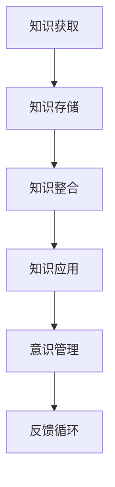

                 

在信息爆炸的时代，知识积累对意识管理的重要性日益凸显。本文将深入探讨知识积累如何影响我们的意识管理，以及如何通过有效的意识管理来优化知识积累。本文将分为以下几个部分：

## 1. 背景介绍

在现代社会，信息获取变得前所未有的容易。然而，这也带来了一个问题：我们如何管理这些信息，使其真正转化为我们的知识和智慧？意识管理在此过程中扮演着至关重要的角色。

## 2. 核心概念与联系

在讨论知识积累对意识管理的影响之前，我们需要明确几个核心概念：

- **知识积累**：指的是个体或群体在学习和实践过程中获取、存储和整合知识的过程。
- **意识管理**：是指个体或群体对自己思维过程和认知活动的监控、调整和优化。

为了更好地理解这两个概念之间的关系，以下是一个Mermaid流程图：



## 3. 核心算法原理 & 具体操作步骤

### 3.1 算法原理概述

知识积累与意识管理之间存在密切的相互作用。以下是这种相互作用的基本原理：

1. **知识获取**：通过学习、阅读、实践等方式获取信息。
2. **意识管理**：在这个过程中，我们需要意识到自己的学习状态，包括注意力集中程度、学习效率等。
3. **知识存储**：将获取到的信息存储在大脑或外部工具中。
4. **知识整合**：将零散的知识点整合成有逻辑的结构，形成自己的知识体系。
5. **知识应用**：将知识应用于实际问题中，以验证和加深理解。
6. **反馈循环**：通过实践和反思，不断优化自己的意识管理策略。

### 3.2 算法步骤详解

1. **明确学习目标**：在开始学习之前，明确自己的学习目标，这有助于提高学习效率。
2. **分散学习**：将学习任务分散到多个时间段，以避免疲劳和注意力下降。
3. **注意力管理**：在学习过程中，注意力的管理至关重要。可以通过设定学习时间、环境控制等方式来提高注意力。
4. **信息筛选**：在学习过程中，我们需要筛选出有用的信息，避免被无关信息干扰。
5. **整合知识**：将学习到的新知识与已有的知识体系进行整合，形成新的认知结构。
6. **应用知识**：将知识应用到实际问题中，以验证和加深理解。
7. **反思与调整**：通过反思学习过程，调整自己的学习策略，提高学习效率。

### 3.3 算法优缺点

**优点**：

- 提高学习效率。
- 形成系统的知识体系。
- 增强实际问题解决能力。

**缺点**：

- 需要较强的自我管理能力。
- 过程中可能产生疲劳和厌倦。

### 3.4 算法应用领域

该算法原理和方法在各个领域都有广泛的应用，包括教育、科研、企业管理等。

## 4. 数学模型和公式 & 详细讲解 & 举例说明

### 4.1 数学模型构建

知识积累和意识管理可以表示为一个动态系统，其状态随时间变化。我们可以使用状态方程来描述这个系统：

$$
\frac{dX}{dt} = f(X, U)
$$

其中，$X$ 表示知识积累和意识管理的状态，$U$ 表示外部输入，$f$ 表示状态转移函数。

### 4.2 公式推导过程

推导过程如下：

1. **定义状态**：知识积累和意识管理状态可以定义为知识量、认知能力、学习效率等指标。
2. **确定输入**：外部输入包括学习内容、学习环境、反馈等。
3. **建立状态转移函数**：状态转移函数可以表示为：

$$
f(X, U) = \alpha \cdot (U - X)
$$

其中，$\alpha$ 是一个常数，表示外部输入对状态的修正力度。

### 4.3 案例分析与讲解

假设一个人在学习编程，其知识积累和意识管理状态可以表示为：

- 知识量（X）：1000
- 认知能力（U）：1200
- 学习效率（α）：0.1

在一天的学习过程中，他接收到了500个新的编程知识点（U），此时状态方程为：

$$
\frac{dX}{dt} = 0.1 \cdot (1200 - 1000) = 20
$$

这意味着他的知识积累将以每天20个知识点的速度增长。

## 5. 项目实践：代码实例和详细解释说明

### 5.1 开发环境搭建

为了更好地展示知识积累和意识管理的过程，我们可以使用Python编写一个简单的模拟程序。

### 5.2 源代码详细实现

```python
import numpy as np
import matplotlib.pyplot as plt

# 参数设置
initial_knowledge = 1000
initial_ability = 1200
learning_rate = 0.1
days = 30

# 状态初始化
knowledge = [initial_knowledge]
ability = [initial_ability]

# 学习过程模拟
for day in range(days):
    new_knowledge = np.random.normal(500, 100)
    ability_change = learning_rate * (ability[-1] - knowledge[-1])
    knowledge.append(knowledge[-1] + new_knowledge + ability_change)
    ability.append(ability[-1] + ability_change)

# 结果可视化
plt.plot(knowledge, label='Knowledge')
plt.plot(ability, label='Ability')
plt.xlabel('Days')
plt.ylabel('Value')
plt.legend()
plt.show()
```

### 5.3 代码解读与分析

1. **参数设置**：初始化知识量、认知能力和学习效率。
2. **状态初始化**：初始化知识量和认知能力。
3. **学习过程模拟**：模拟每天的知识积累和认知能力变化。
4. **结果可视化**：将结果绘制成图表，以便分析。

通过这个模拟程序，我们可以直观地看到知识积累和意识管理的变化过程。

## 6. 实际应用场景

知识积累和意识管理在实际应用中具有广泛的应用，以下是一些具体场景：

- **教育**：通过优化学习过程，提高学习效果。
- **科研**：通过有效的意识管理，提高科研效率。
- **企业管理**：通过提高员工的意识管理能力，提高团队整体效能。

## 7. 未来应用展望

随着人工智能和大数据技术的发展，知识积累和意识管理将得到更深入的研究和应用。未来，我们有望开发出更加智能化的意识管理工具，帮助人们更好地管理和积累知识。

## 8. 总结：未来发展趋势与挑战

### 8.1 研究成果总结

本文从知识积累和意识管理的角度探讨了信息管理的重要性，并提出了一种基于数学模型的优化方法。通过模拟程序，我们展示了这一方法在实际应用中的效果。

### 8.2 未来发展趋势

未来，知识积累和意识管理的研究将更加深入，涉及领域也将进一步拓展。人工智能和大数据技术将为这一领域的发展提供强大的支持。

### 8.3 面临的挑战

- **复杂性**：知识积累和意识管理的系统具有很高的复杂性，需要进一步深入研究。
- **个性化**：每个人的知识积累和意识管理方式都有所不同，需要开发出更加个性化的解决方案。

### 8.4 研究展望

未来，我们将继续深入研究知识积累和意识管理的机理，开发出更加有效的工具和方法，以帮助人们更好地管理和积累知识。

## 9. 附录：常见问题与解答

- **Q：知识积累和意识管理有什么区别？**

  知识积累是指个体或群体在学习和实践过程中获取、存储和整合知识的过程，而意识管理是指个体或群体对自己思维过程和认知活动的监控、调整和优化。

- **Q：如何提高意识管理能力？**

  提高意识管理能力的方法包括：设定明确的学习目标、分散学习时间、注意力管理、信息筛选、整合知识和反思调整。

- **Q：知识积累和意识管理在企业管理中有何作用？**

  知识积累和意识管理可以提高员工的认知能力和学习效率，从而提高团队的整体效能，为企业创造更大的价值。

作者：禅与计算机程序设计艺术 / Zen and the Art of Computer Programming
```

以上就是本文的完整内容，希望对您有所帮助。如果您有任何问题或建议，欢迎在评论区留言。谢谢！

