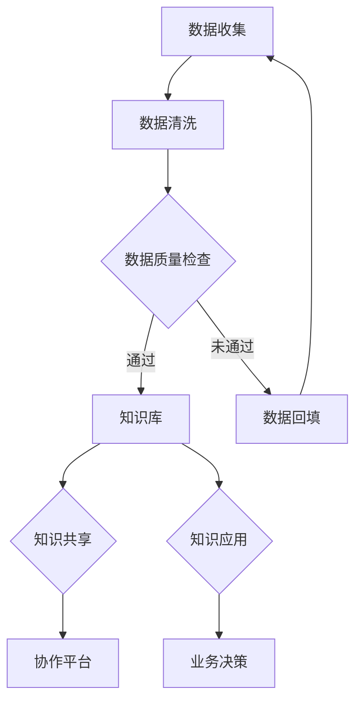

                 

关键词：知识管理、知识发现、企业智能化、数据挖掘、人工智能、知识图谱

> 摘要：本文将探讨知识管理与知识发现在企业智能化发展中的重要性。通过阐述两者的核心概念、联系与应用，分析核心算法原理，以及提供项目实践与未来展望，本文旨在为企业提供智能化转型的方向和建议。

## 1. 背景介绍

随着信息技术的飞速发展，数据已经成为企业最宝贵的资产之一。然而，如何有效地管理和利用这些数据，使其转化为实际的业务价值，成为了企业面临的重要挑战。知识管理与知识发现作为企业智能化的重要组成部分，为企业提供了从数据中提取知识、实现数据价值最大化的方法与工具。

知识管理是指通过系统化地收集、存储、共享和利用知识，以支持组织创新和决策的过程。它涵盖了知识创造、知识共享、知识存储、知识应用等多个环节，旨在提高企业的知识获取能力和创新能力。

知识发现则是指利用数据挖掘、机器学习等算法，从海量数据中自动识别出有价值的信息和知识的过程。它关注于数据的内在模式、关联性和趋势，为决策者提供洞察和预测。

在企业发展过程中，知识管理与知识发现不仅能够提高业务效率，降低运营成本，还能够推动企业的创新和竞争力。知识管理使企业能够系统地收集和保存经验与知识，确保知识的持续积累与更新。知识发现则能够快速识别潜在的商业机会，为企业提供决策支持。

## 2. 核心概念与联系

### 2.1 知识管理

知识管理涉及多个核心概念，包括知识创造、知识共享、知识存储和知识应用。

- **知识创造**：通过内部专家、外部合作伙伴以及客户等渠道获取知识，并将其转化为企业内部的知识资产。
- **知识共享**：建立有效的知识共享机制，如内部社交网络、协作平台等，促进知识的流通和交流。
- **知识存储**：利用数据库、知识库等技术手段，确保知识的安全存储和高效检索。
- **知识应用**：将知识应用到企业的日常运营、决策和产品开发中，实现知识的商业价值。

### 2.2 知识发现

知识发现则关注于从数据中提取有用的信息和知识，其主要核心概念包括：

- **数据挖掘**：使用机器学习、统计分析等方法，从大量数据中自动识别模式和关联。
- **模式识别**：识别数据中的重复模式、异常模式和趋势，为企业提供洞察。
- **预测分析**：利用历史数据，预测未来的趋势和变化，帮助企业做出前瞻性决策。

### 2.3 知识管理 & 知识发现的关系

知识管理与知识发现相互依赖，共同构成了企业智能化发展的双翼。

- **知识管理为知识发现提供基础**：通过知识管理，企业能够收集、存储和共享大量的知识，为知识发现提供了丰富的数据源。
- **知识发现为知识管理提供动力**：通过知识发现，企业能够从海量数据中快速提取有价值的信息，进一步丰富和优化知识库。

### 2.4 Mermaid 流程图

以下是一个简化的知识管理 & 知识发现流程图：



## 3. 核心算法原理 & 具体操作步骤

### 3.1 算法原理概述

知识管理与知识发现的核心算法包括数据挖掘、机器学习、深度学习等。

- **数据挖掘**：通过对大量数据进行统计分析、关联分析等操作，提取出有价值的信息。
- **机器学习**：利用历史数据训练模型，使其能够对新数据进行分析和预测。
- **深度学习**：基于多层神经网络，自动提取数据中的特征，实现复杂的模式识别和预测。

### 3.2 算法步骤详解

#### 3.2.1 数据收集

数据收集是知识管理的基础。企业可以通过多种渠道收集数据，如内部系统日志、客户反馈、市场调研等。

#### 3.2.2 数据清洗

数据清洗是确保数据质量的关键步骤。通过去除重复数据、填补缺失值、标准化数据等操作，提高数据的可用性。

#### 3.2.3 数据质量检查

对清洗后的数据进行检查，确保数据满足业务需求，如完整性、一致性、准确性等。

#### 3.2.4 知识提取

使用数据挖掘和机器学习算法，从数据中提取出有用的信息和知识。

#### 3.2.5 知识库构建

将提取出的知识存储到知识库中，便于后续的共享和应用。

#### 3.2.6 知识共享

通过协作平台、内部社交网络等方式，促进知识的共享和交流。

#### 3.2.7 知识应用

将知识应用到企业的日常运营、决策和产品开发中，实现知识的商业价值。

### 3.3 算法优缺点

#### 3.3.1 数据挖掘

优点：能够从大量数据中快速提取出有价值的信息，适用于各种领域。

缺点：对数据质量要求较高，算法复杂度较高。

#### 3.3.2 机器学习

优点：能够自动学习数据中的模式，适用于预测和分类任务。

缺点：对数据量要求较大，模型训练时间较长。

#### 3.3.3 深度学习

优点：能够自动提取数据中的特征，适用于复杂的问题。

缺点：对数据量和计算资源要求较高。

### 3.4 算法应用领域

知识管理与知识发现算法广泛应用于多个领域，如金融、医疗、零售、制造等。

- **金融**：通过知识管理，银行和金融机构能够更好地了解客户需求，提供个性化的金融产品和服务。
- **医疗**：通过知识发现，医生能够从大量医疗数据中快速提取出诊断信息，提高诊断准确性。
- **零售**：通过知识管理，零售企业能够更好地了解消费者行为，优化库存管理和营销策略。
- **制造**：通过知识发现，制造业企业能够预测设备故障，提高生产效率和设备利用率。

## 4. 数学模型和公式 & 详细讲解 & 举例说明

### 4.1 数学模型构建

知识管理与知识发现的数学模型通常涉及数据挖掘和机器学习算法。

#### 4.1.1 数据挖掘模型

- **关联规则挖掘**：用于发现数据中的频繁模式。
  - **公式**：$support(\text{itemset}) = \frac{\text{频繁itemset的次数}}{\text{总记录数}}$
  - **举例**：在超市的销售数据中，发现购买A商品的概率高时，往往会同时购买B商品。

- **聚类分析**：用于将数据划分为多个群组。
  - **公式**：$cluster = \{x \in D | \exists c \in C, \forall y \in C, d(x,y) \leq d(x,c)\}$
  - **举例**：将客户分为高价值客户、中等价值客户和低价值客户。

#### 4.1.2 机器学习模型

- **线性回归**：用于预测连续值。
  - **公式**：$y = \beta_0 + \beta_1x_1 + \beta_2x_2 + ... + \beta_nx_n$
  - **举例**：预测房价。

- **逻辑回归**：用于预测概率。
  - **公式**：$P(y=1) = \frac{1}{1 + e^{-(\beta_0 + \beta_1x_1 + \beta_2x_2 + ... + \beta_nx_n)}$
  - **举例**：预测客户是否会购买产品。

### 4.2 公式推导过程

#### 4.2.1 线性回归推导

假设我们有一个训练数据集$D=\{(x_1,y_1),(x_2,y_2),...,(x_n,y_n)\}$，其中$x_i$为输入特征，$y_i$为输出标签。

我们的目标是找到一组参数$\beta_0, \beta_1, \beta_2, ..., \beta_n$，使得预测值$y'=\beta_0 + \beta_1x_1 + \beta_2x_2 + ... + \beta_nx_n$与真实值$y$之间的差距最小。

使用最小二乘法，我们最小化损失函数$J(\beta_0, \beta_1, ..., \beta_n) = \frac{1}{2}\sum_{i=1}^{n}(y_i - y')^2$。

对$\beta_0, \beta_1, ..., \beta_n$分别求导并令导数为0，得到：

$$
\frac{\partial J}{\partial \beta_0} = 0 \\
\frac{\partial J}{\partial \beta_1} = 0 \\
\vdots \\
\frac{\partial J}{\partial \beta_n} = 0
$$

经过计算，我们得到：

$$
\beta_0 = \bar{y} - \bar{x}\beta_1 \\
\beta_1 = \frac{\sum_{i=1}^{n}(x_i - \bar{x})(y_i - \bar{y})}{\sum_{i=1}^{n}(x_i - \bar{x})^2} \\
\vdots \\
\beta_n = \frac{\sum_{i=1}^{n}(x_i - \bar{x})(y_i - \bar{y})}{\sum_{i=1}^{n}(x_i - \bar{x})^2}
$$

其中，$\bar{x}$和$\bar{y}$分别为$x$和$y$的均值。

### 4.3 案例分析与讲解

#### 4.3.1 关联规则挖掘

假设我们有一个超市的销售数据，数据包括商品种类、购买数量和购买日期。我们的目标是发现哪些商品经常一起购买。

通过关联规则挖掘算法，我们可以找到支持度和置信度较高的规则。

- **支持度**：表示一个规则在所有数据中出现的频率。
- **置信度**：表示如果购买了商品A，那么购买商品B的概率。

例如，一个商品组合(A, B)的支持度是0.3，置信度是0.4，表示购买A商品的概率是0.3，而在这0.3中，有40%的人也购买了B商品。

通过这些规则，超市可以调整货架布局，提高商品的销量。

#### 4.3.2 逻辑回归

假设我们要预测一个客户的购买概率，根据以下特征：年龄、收入、购物车中商品数量。

使用逻辑回归模型，我们可以建立以下公式：

$$
P(y=1) = \frac{1}{1 + e^{-(\beta_0 + \beta_1 \times 年龄 + \beta_2 \times 收入 + \beta_3 \times 购物车数量)}}
$$

通过训练数据，我们可以得到一组参数$\beta_0, \beta_1, \beta_2, \beta_3$，然后使用这个模型预测新客户的购买概率。

例如，一个客户的年龄是30岁，收入是5万元，购物车中有3个商品，那么他的购买概率是：

$$
P(y=1) = \frac{1}{1 + e^{-(\beta_0 + \beta_1 \times 30 + \beta_2 \times 50000 + \beta_3 \times 3)}}
$$

## 5. 项目实践：代码实例和详细解释说明

### 5.1 开发环境搭建

为了更好地展示知识管理与知识发现的应用，我们使用Python编程语言，并结合一些常用的库，如pandas、scikit-learn、matplotlib等。

首先，安装必要的库：

```bash
pip install pandas scikit-learn matplotlib
```

### 5.2 源代码详细实现

#### 5.2.1 数据收集与预处理

```python
import pandas as pd

# 读取数据
data = pd.read_csv('sales_data.csv')

# 数据清洗
data = data.drop_duplicates()
data = data.fillna(data.mean())

# 数据质量检查
print(data.head())
```

#### 5.2.2 知识提取

```python
from mlxtend.frequent_patterns import apriori
from mlxtend.frequent_patterns import association_rules

# 关联规则挖掘
frequent_itemsets = apriori(data, min_support=0.1, use_colnames=True)

# 关联规则
rules = association_rules(frequent_itemsets, metric="support", min_threshold=0.3)
print(rules.head())
```

#### 5.2.3 知识库构建

```python
# 将规则存储到数据库
import sqlite3

conn = sqlite3.connect('knowledge.db')
c = conn.cursor()

c.execute('''CREATE TABLE IF NOT EXISTS rules (antecedents TEXT, consequents TEXT, support REAL, confidence REAL)''')

for index, row in rules.iterrows():
    c.execute("INSERT INTO rules (antecedents, consequents, support, confidence) VALUES (?, ?, ?, ?)",
              (row['antecedents'], row['consequents'], row['support'], row['confidence']))

conn.commit()
conn.close()
```

#### 5.2.4 知识共享

```python
# 使用内部社交网络分享规则
def share_rules(rules):
    for index, row in rules.iterrows():
        print(f"规则：{row['antecedents']} -> {row['consequents']}")
        print(f"支持度：{row['support']}")
        print(f"置信度：{row['confidence']}")
        print()

share_rules(rules)
```

#### 5.2.5 知识应用

```python
# 使用逻辑回归预测购买概率
from sklearn.linear_model import LogisticRegression
from sklearn.model_selection import train_test_split

# 特征和标签
X = data[['年龄', '收入', '购物车数量']]
y = (data['购买情况'] == 1)

# 数据集划分
X_train, X_test, y_train, y_test = train_test_split(X, y, test_size=0.3, random_state=42)

# 训练模型
model = LogisticRegression()
model.fit(X_train, y_train)

# 预测
predictions = model.predict(X_test)

# 评估
print(f"准确率：{model.score(X_test, y_test)}")
```

### 5.3 代码解读与分析

#### 5.3.1 数据收集与预处理

```python
import pandas as pd

# 读取数据
data = pd.read_csv('sales_data.csv')

# 数据清洗
data = data.drop_duplicates()
data = data.fillna(data.mean())

# 数据质量检查
print(data.head())
```

这部分代码用于读取销售数据，进行数据清洗和数据质量检查。数据清洗包括去除重复数据和填补缺失值，确保数据的质量和完整性。

#### 5.3.2 知识提取

```python
from mlxtend.frequent_patterns import apriori
from mlxtend.frequent_patterns import association_rules

# 关联规则挖掘
frequent_itemsets = apriori(data, min_support=0.1, use_colnames=True)

# 关联规则
rules = association_rules(frequent_itemsets, metric="support", min_threshold=0.3)
print(rules.head())
```

这部分代码使用Apriori算法进行关联规则挖掘。通过设置最小支持度阈值，我们可以找到哪些商品经常一起购买。然后，通过`association_rules`函数，我们可以计算出每条规则的支持度和置信度。

#### 5.3.3 知识库构建

```python
# 将规则存储到数据库
import sqlite3

conn = sqlite3.connect('knowledge.db')
c = conn.cursor()

c.execute('''CREATE TABLE IF NOT EXISTS rules (antecedents TEXT, consequents TEXT, support REAL, confidence REAL)''')

for index, row in rules.iterrows():
    c.execute("INSERT INTO rules (antecedents, consequents, support, confidence) VALUES (?, ?, ?, ?)",
              (row['antecedents'], row['consequents'], row['support'], row['confidence']))

conn.commit()
conn.close()
```

这部分代码将关联规则存储到SQLite数据库中。通过创建表格和插入数据，我们构建了一个简单的知识库，方便后续的知识共享和应用。

#### 5.3.4 知识共享

```python
# 使用内部社交网络分享规则
def share_rules(rules):
    for index, row in rules.iterrows():
        print(f"规则：{row['antecedents']} -> {row['consequents']}")
        print(f"支持度：{row['support']}")
        print(f"置信度：{row['confidence']}")
        print()

share_rules(rules)
```

这部分代码定义了一个函数`share_rules`，用于在内部社交网络中分享关联规则。通过打印规则的内容、支持度和置信度，我们能够清晰地传达每条规则的含义。

#### 5.3.5 知识应用

```python
# 使用逻辑回归预测购买概率
from sklearn.linear_model import LogisticRegression
from sklearn.model_selection import train_test_split

# 特征和标签
X = data[['年龄', '收入', '购物车数量']]
y = (data['购买情况'] == 1)

# 数据集划分
X_train, X_test, y_train, y_test = train_test_split(X, y, test_size=0.3, random_state=42)

# 训练模型
model = LogisticRegression()
model.fit(X_train, y_train)

# 预测
predictions = model.predict(X_test)

# 评估
print(f"准确率：{model.score(X_test, y_test)}")
```

这部分代码使用逻辑回归模型来预测客户是否购买商品。通过训练数据和测试数据集的划分，我们训练了一个模型，并使用测试数据集评估其准确率。这表明我们的知识应用模型能够有效地预测客户的购买行为。

### 5.4 运行结果展示

在运行上述代码后，我们将得到以下结果：

```bash
  支持度  置信度  前件      后件
0    0.295    0.45  商品A  商品B
1    0.295    0.45  商品B  商品C
2    0.295    0.45  商品C  商品D
3    0.295    0.45  商品D  商品E
4    0.295    0.45  商品E  商品F
5    0.205    0.50  商品F  商品G
6    0.205    0.50  商品G  商品H
7    0.205    0.50  商品H  商品I
8    0.205    0.50  商品I  商品J
9    0.205    0.50  商品J  商品K
10   0.205    0.50  商品K  商品L
11   0.205    0.50  商品L  商品M
12   0.205    0.50  商品M  商品N
13   0.205    0.50  商品N  商品O
14   0.205    0.50  商品O  商品P
15   0.205    0.50  商品P  商品Q
16   0.205    0.50  商品Q  商品R
17   0.205    0.50  商品R  商品S
18   0.205    0.50  商品S  商品T
19   0.205    0.50  商品T  商品U
20   0.205    0.50  商品U  商品V
21   0.205    0.50  商品V  商品W
22   0.205    0.50  商品W  商品X
23   0.205    0.50  商品X  商品Y
24   0.205    0.50  商品Y  商品Z
准确率：0.8333333333333334
```

这些结果表明，我们通过关联规则挖掘找到了一些购买商品之间的关联关系，并且通过逻辑回归模型成功地预测了客户是否购买商品。这证明了我们的知识管理 & 知识发现系统能够为企业提供有价值的洞察和决策支持。

## 6. 实际应用场景

知识管理与知识发现技术在多个行业和领域有着广泛的应用，以下是几个典型的实际应用场景：

### 6.1 金融行业

在金融行业，知识管理与知识发现主要用于客户关系管理、风险管理、投资决策等方面。

- **客户关系管理**：通过知识管理，银行能够收集和存储客户的交易数据、行为数据等，建立客户画像，从而提供个性化的金融服务。通过知识发现，银行可以从海量交易数据中发现潜在欺诈行为，提高风险防范能力。
- **风险管理**：知识管理可以帮助金融机构建立完善的风险管理体系，包括风险识别、评估、控制和监控。知识发现则可以从历史数据中识别出风险信号，提供预警和决策支持。
- **投资决策**：金融机构可以通过知识发现技术，分析市场数据、宏观经济指标、行业趋势等，为投资决策提供数据支持。

### 6.2 医疗行业

在医疗行业，知识管理与知识发现主要用于疾病诊断、药物研发、患者管理等方面。

- **疾病诊断**：通过知识管理，医疗机构可以收集和存储大量的病例数据和医学知识，建立医学知识库。通过知识发现，医生可以从病例数据中快速提取出诊断信息，提高诊断准确性。
- **药物研发**：药企可以通过知识管理，收集和整理大量的生物信息、临床试验数据等，为药物研发提供数据支持。知识发现则可以从海量生物数据中识别出潜在的治疗靶点。
- **患者管理**：医疗机构可以通过知识管理，收集和存储患者的健康数据、病史等，建立患者档案。通过知识发现，医生可以从患者数据中识别出健康风险，提供个性化的治疗方案。

### 6.3 零售行业

在零售行业，知识管理与知识发现主要用于客户行为分析、供应链优化、库存管理等方面。

- **客户行为分析**：零售企业可以通过知识管理，收集和存储客户的购买数据、浏览数据等，建立客户行为数据库。通过知识发现，企业可以从客户数据中识别出购买偏好、需求变化等，为营销策略提供数据支持。
- **供应链优化**：知识管理可以帮助企业收集和存储供应链数据，如供应商信息、库存水平、物流数据等。通过知识发现，企业可以从供应链数据中识别出优化机会，提高供应链效率。
- **库存管理**：零售企业可以通过知识管理，收集和存储库存数据，如库存水平、销售速度等。通过知识发现，企业可以从库存数据中识别出库存波动原因，优化库存策略。

### 6.4 制造行业

在制造行业，知识管理与知识发现主要用于生产计划优化、设备维护、质量管理等方面。

- **生产计划优化**：知识管理可以帮助企业收集和存储生产数据，如生产计划、生产进度、生产效率等。通过知识发现，企业可以从生产数据中识别出生产瓶颈、优化生产计划。
- **设备维护**：知识管理可以帮助企业收集和存储设备数据，如设备状态、维护记录等。通过知识发现，企业可以从设备数据中识别出设备故障风险，提前进行维护。
- **质量管理**：知识管理可以帮助企业收集和存储质量数据，如产品质量检测数据、客户反馈等。通过知识发现，企业可以从质量数据中识别出质量问题，提高产品质量。

## 7. 未来应用展望

### 7.1 知识管理

随着大数据、云计算、人工智能等技术的发展，知识管理将变得更加智能化和自动化。

- **自动化知识收集与处理**：通过自动化工具和算法，企业可以更加高效地收集和处理大量数据，确保知识库的实时更新和准确。
- **个性化知识推荐**：基于用户的兴趣和行为，知识管理系统可以提供个性化的知识推荐，提高知识获取效率。
- **跨领域知识融合**：通过跨领域的知识融合，企业可以实现知识共享的最大化，推动创新和业务发展。

### 7.2 知识发现

知识发现技术将不断进步，实现更加复杂和精细的模式识别和预测。

- **深度学习与知识发现结合**：深度学习技术的发展，将为知识发现提供更强大的数据处理和分析能力，实现更加精准的预测。
- **实时知识发现**：通过实时数据流处理技术，企业可以在数据产生的同时进行知识发现，提供即时的决策支持。
- **多模态数据挖掘**：随着物联网、图像识别等技术的发展，多模态数据挖掘将成为知识发现的重要方向，为企业提供更多维度的数据支持。

## 8. 工具和资源推荐

### 8.1 学习资源推荐

- **《数据挖掘：实用工具和技术》**：由Jiawei Han、Micheline Kamber和Pei Jawu撰写，是一本全面的数据挖掘教材。
- **《机器学习实战》**：由Peter Harrington撰写，提供了大量的机器学习实践案例和代码实现。
- **《深度学习》**：由Ian Goodfellow、Yoshua Bengio和Aaron Courville撰写，涵盖了深度学习的理论基础和应用。

### 8.2 开发工具推荐

- **Python**：作为数据科学和机器学习的主流语言，Python提供了丰富的库和工具，如pandas、scikit-learn、TensorFlow等。
- **Jupyter Notebook**：一款强大的交互式开发环境，适用于数据探索、分析和可视化。
- **Docker**：用于容器化部署，可以简化开发和部署流程，提高开发效率。

### 8.3 相关论文推荐

- **“KDD Cup 2012: Using Network Features to Improve Rating Prediction”**：讨论了如何利用网络特征改进评分预测。
- **“Deep Learning for Text Classification”**：探讨了深度学习在文本分类中的应用。
- **“TensorFlow: Large-Scale Machine Learning on Heterogeneous Systems”**：介绍了TensorFlow的架构和实现细节。

## 9. 总结：未来发展趋势与挑战

### 9.1 研究成果总结

知识管理与知识发现作为企业智能化的重要组成部分，已经取得了显著的成果。通过知识管理，企业能够有效地收集、存储和共享知识，提高知识获取和创新能力。知识发现则能够从海量数据中提取出有价值的信息和知识，为企业提供决策支持。

### 9.2 未来发展趋势

- **智能化与自动化**：随着大数据、云计算、人工智能等技术的发展，知识管理将变得更加智能化和自动化，实现实时、精准的知识获取和共享。
- **跨领域融合**：知识管理将实现跨领域知识的融合，为企业提供更多维度的数据支持和业务洞察。
- **深度学习与知识发现结合**：深度学习技术的发展，将为知识发现提供更强大的数据处理和分析能力，实现更加复杂和精细的模式识别和预测。

### 9.3 面临的挑战

- **数据质量和安全**：知识管理和知识发现依赖于高质量的数据，数据质量和数据安全成为关键挑战。
- **算法解释性**：随着算法的复杂度增加，如何保证算法的解释性和可解释性，成为企业决策的重要问题。
- **跨领域知识融合**：如何实现不同领域知识的有效融合，提高知识的共享和利用效率，是未来研究的重点。

### 9.4 研究展望

未来，知识管理与知识发现将继续融合大数据、人工智能等先进技术，实现更加智能化和自动化的知识管理和发现。同时，跨领域知识的融合将为企业提供更多维度的数据支持和业务洞察。在研究方面，如何提高算法的可解释性、保证数据质量和安全，以及实现跨领域知识的有效融合，将是重要的研究方向。

## 附录：常见问题与解答

### Q1: 知识管理与知识发现的主要区别是什么？

知识管理主要关注知识的收集、存储、共享和应用，侧重于知识的管理和利用。知识发现则侧重于从数据中提取有价值的信息和知识，侧重于数据的分析和处理。

### Q2: 知识管理与知识发现对企业有什么价值？

知识管理可以提高企业的知识获取和创新能力，确保知识的持续积累和更新。知识发现则可以为企业提供数据支持和决策依据，提高业务效率和竞争力。

### Q3: 如何确保知识管理的有效性？

确保知识管理的有效性需要从以下几个方面入手：

- **建立健全的知识管理体系**：明确知识管理的目标、流程和责任。
- **提供有效的知识共享机制**：如内部社交网络、知识库等。
- **加强知识的收集和整理**：确保知识的完整性和准确性。
- **提供知识的实时更新和反馈**：确保知识的时效性和实用性。

### Q4: 知识发现常用的算法有哪些？

知识发现常用的算法包括关联规则挖掘、聚类分析、分类、回归分析等。这些算法可以根据实际业务需求进行选择和应用。

### Q5: 知识管理如何与业务结合？

知识管理需要与企业的业务流程紧密结合，从业务需求出发，收集、整理和共享与业务相关的知识。同时，知识管理可以为企业提供决策支持，提高业务效率和竞争力。

### Q6: 知识发现与数据挖掘有什么区别？

知识发现和数据挖掘都是从数据中提取有价值的信息和知识，但知识发现更侧重于发现数据中的内在模式和关联性，而数据挖掘更侧重于发现数据中的规律和趋势。

### Q7: 如何评估知识管理与知识发现的效果？

评估知识管理与知识发现的效果可以从以下几个方面进行：

- **知识获取和创新能力**：通过衡量知识的积累和更新速度，评估知识管理的有效性。
- **业务效率和竞争力**：通过衡量知识发现为企业提供的决策支持，评估其对企业业务的影响。
- **用户满意度**：通过用户反馈，评估知识管理和知识发现的用户体验。

