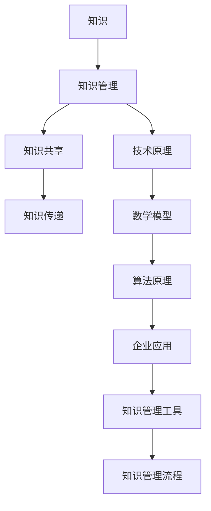

                 

在当今竞争激烈的市场环境中，知识管理已经成为企业提升核心竞争力、实现可持续发展的关键因素。本文将深入探讨知识管理在企业中的应用与实践，分析其核心概念、技术原理、数学模型、算法原理，并结合实际案例进行详细解释说明。希望通过本文的阐述，读者能够更好地理解知识管理的重要性，掌握其实践方法，为企业的发展注入新的活力。

## 关键词

知识管理、企业竞争力、信息共享、知识传递、学习型组织

## 摘要

本文旨在探讨知识管理在企业中的实践与应用。首先，介绍知识管理的背景和核心概念，接着分析知识管理对企业发展的重要性。随后，详细讲解知识管理的体系架构、技术原理、数学模型和算法原理。最后，通过实际案例展示知识管理在企业中的成功实践，并展望未来的发展趋势和挑战。

## 1. 背景介绍

知识管理（Knowledge Management，KM）是20世纪90年代以来迅速发展起来的一种新兴管理理论。它旨在通过收集、组织、共享和利用知识，提高组织内部的知识共享和创新能力，从而实现组织的可持续发展。知识管理起源于企业内部的信息共享和知识传递需求，随着信息技术的发展，知识管理逐渐形成了一套系统的理论和方法。

### 1.1 知识管理的起源与发展

知识管理的起源可以追溯到20世纪80年代，当时企业管理者开始关注知识在组织中的重要性。随着信息技术的发展，企业内部的信息系统逐渐完善，信息共享和知识传递的需求日益迫切。知识管理正是在这种背景下逐渐发展起来的。

20世纪90年代，知识管理理论开始形成，一些知名企业如IBM、惠普等开始在企业内部实施知识管理项目，取得了显著的成效。随着知识经济的兴起，知识管理逐渐成为企业提升竞争力的重要手段。

### 1.2 知识管理的核心概念

知识管理涉及多个核心概念，包括知识、知识管理、知识共享、知识传递等。以下是这些核心概念的简要解释：

- **知识**：知识是指通过信息处理和经验积累形成的认知、技能和见解。
- **知识管理**：知识管理是指通过系统的方法和工具，对知识进行收集、组织、共享和利用，以提高组织的知识共享和创新能力。
- **知识共享**：知识共享是指通过不同方式将知识在企业内部或外部进行传播和共享。
- **知识传递**：知识传递是指通过教育、培训、会议、合作等方式将知识在不同个体或组织之间进行传递。

## 2. 核心概念与联系

为了更好地理解知识管理的体系架构和技术原理，以下将使用Mermaid流程图对核心概念和联系进行可视化展示。



### 2.1 知识管理核心概念与联系

- **知识**：知识是知识管理的核心，是知识管理的基础和目标。
- **知识管理**：知识管理是将知识进行有效组织和利用的过程，涉及知识收集、存储、共享、应用等多个环节。
- **知识共享**：知识共享是知识管理的核心环节之一，通过不同方式将知识在企业内部或外部进行传播。
- **知识传递**：知识传递是将知识在不同个体或组织之间进行传递，是知识共享的延伸。
- **技术原理**：技术原理包括数据挖掘、信息检索、云计算、大数据等技术，为知识管理提供技术支持。
- **数学模型**：数学模型是知识管理的重要组成部分，通过数学方法对知识进行分析和处理。
- **算法原理**：算法原理是实现知识管理的重要手段，通过算法对知识进行筛选、排序、推荐等处理。
- **企业应用**：企业应用是知识管理的最终目标，通过知识管理提升企业的竞争力。
- **知识管理工具**：知识管理工具是实现知识管理的工具和平台，如知识库、学习管理系统等。
- **知识管理流程**：知识管理流程是知识管理的实施路径，包括知识收集、知识存储、知识共享、知识应用等环节。

通过上述Mermaid流程图，我们可以清晰地看到知识管理的核心概念及其相互联系，为后续章节的详细讲解提供了基础。

## 3. 核心算法原理 & 具体操作步骤

### 3.1 算法原理概述

知识管理中的核心算法主要包括信息检索、知识推荐、知识聚类和知识可视化等。这些算法在实现知识管理的过程中发挥着至关重要的作用。

- **信息检索**：信息检索是通过算法对大量信息进行筛选和提取，以获取用户所需信息的过程。常用的算法包括布尔检索、向量空间模型、PageRank等。
- **知识推荐**：知识推荐是根据用户的历史行为和兴趣，为用户推荐相关的知识和信息。常用的算法包括协同过滤、基于内容的推荐、混合推荐等。
- **知识聚类**：知识聚类是将相似的知识点进行归类，以方便用户查找和使用。常用的算法包括K-means、层次聚类、DBSCAN等。
- **知识可视化**：知识可视化是通过图形、图表等方式将抽象的知识进行可视化呈现，以帮助用户更好地理解和应用知识。常用的算法包括力导图、矩阵分解、热力图等。

### 3.2 算法步骤详解

以下是对上述核心算法的具体操作步骤进行详细讲解。

#### 3.2.1 信息检索

1. **用户输入查询**：用户通过输入关键词或提问，发起检索请求。
2. **构建索引**：系统根据用户的查询请求，从数据库中检索相关信息，并构建索引，以便快速查询。
3. **计算相似度**：系统对检索结果进行相似度计算，通常采用布尔检索、向量空间模型等方法。
4. **排序和返回结果**：根据相似度计算结果，对检索结果进行排序，并返回给用户。

#### 3.2.2 知识推荐

1. **用户行为数据收集**：系统收集用户的历史行为数据，如浏览记录、收藏记录、评论等。
2. **构建用户兴趣模型**：系统根据用户行为数据，构建用户兴趣模型，以了解用户的需求和偏好。
3. **推荐算法计算**：系统采用协同过滤、基于内容的推荐等方法，计算推荐结果。
4. **排序和返回推荐结果**：根据推荐算法计算结果，对推荐结果进行排序，并返回给用户。

#### 3.2.3 知识聚类

1. **数据预处理**：系统对原始数据进行预处理，如去除停用词、进行词干提取等。
2. **选择聚类算法**：根据数据特点和需求，选择合适的聚类算法，如K-means、层次聚类等。
3. **初始化聚类中心**：系统初始化聚类中心，如随机选择、基于密度的方法等。
4. **迭代聚类过程**：系统进行多次迭代，更新聚类中心，直至满足终止条件。
5. **输出聚类结果**：系统输出聚类结果，如聚类中心、簇成员等。

#### 3.2.4 知识可视化

1. **数据预处理**：系统对原始数据进行分析和预处理，如进行数据清洗、归一化等。
2. **选择可视化算法**：根据数据类型和需求，选择合适的可视化算法，如力导图、矩阵分解等。
3. **构建可视化模型**：系统构建可视化模型，将数据映射到可视化空间。
4. **渲染可视化结果**：系统将可视化模型渲染成图形、图表等形式，展示给用户。

### 3.3 算法优缺点

以下是对核心算法的优缺点进行简要分析。

#### 3.3.1 信息检索

- **优点**：信息检索算法具有高效、准确的特性，可以快速获取用户所需信息。
- **缺点**：信息检索算法对数据质量和索引构建质量要求较高，且在处理长尾查询时效果较差。

#### 3.3.2 知识推荐

- **优点**：知识推荐算法可以根据用户行为和兴趣为用户推荐相关的知识和信息，提高用户体验。
- **缺点**：知识推荐算法可能存在过度拟合问题，且在冷启动阶段效果较差。

#### 3.3.3 知识聚类

- **优点**：知识聚类算法可以将相似的知识点进行归类，方便用户查找和使用。
- **缺点**：知识聚类算法对数据质量和聚类结果质量要求较高，且在处理大数据时效率较低。

#### 3.3.4 知识可视化

- **优点**：知识可视化算法可以直观地展示抽象的知识，帮助用户更好地理解和应用知识。
- **缺点**：知识可视化算法对数据量和可视化效果要求较高，且在处理复杂关系时效果较差。

### 3.4 算法应用领域

核心算法在知识管理中具有广泛的应用领域，主要包括以下几个方面：

- **企业内部知识库**：通过信息检索和知识推荐算法，实现企业内部知识的快速查询和个性化推荐。
- **在线教育平台**：通过知识聚类和知识可视化算法，实现学习资源的分类管理和可视化展示。
- **知识图谱构建**：通过知识聚类和知识可视化算法，构建企业或领域的知识图谱，为用户提供了直观的知识结构。
- **智能客服系统**：通过知识推荐和知识可视化算法，实现智能客服系统对用户问题的快速解答和知识传递。

## 4. 数学模型和公式 & 详细讲解 & 举例说明

### 4.1 数学模型构建

知识管理中的数学模型主要涉及概率模型、线性代数模型、图论模型等。以下是一个简单的概率模型构建示例。

#### 4.1.1 概率模型

假设我们有一个知识库，其中包含n个知识点，每个知识点具有不同的属性和标签。我们希望通过概率模型来计算知识点之间的相似度。

设知识点i和知识点j之间的相似度为Sim(i, j)，则可以使用余弦相似度公式计算：

$$
Sim(i, j) = \frac{i \cdot j}{\|i\|\|j\|}
$$

其中，$i$和$j$分别表示知识点i和知识点j的向量表示，$\|i\|$和$\|j\|$分别表示向量$i$和$j$的欧氏范数。

#### 4.1.2 线性代数模型

假设我们有一个矩阵$A$，其中每个元素$a_{ij}$表示知识点i和知识点j之间的相似度。我们可以使用矩阵分解算法（如Singular Value Decomposition，SVD）来将矩阵$A$分解为：

$$
A = U \Sigma V^T
$$

其中，$U$和$V$分别表示用户和知识点的高维特征向量，$\Sigma$表示对角矩阵，包含矩阵$A$的奇异值。

通过矩阵分解，我们可以得到知识点i和知识点j的相似度：

$$
Sim(i, j) = u_i^T v_j
$$

其中，$u_i$和$v_j$分别表示知识点i和知识点j的特征向量。

### 4.2 公式推导过程

以下是一个简单的线性回归模型的公式推导过程。

#### 4.2.1 线性回归模型

假设我们有n个数据点$(x_i, y_i)$，其中$x_i$表示自变量，$y_i$表示因变量。我们希望通过线性回归模型来拟合数据点。

线性回归模型可以表示为：

$$
y = \beta_0 + \beta_1 x
$$

其中，$\beta_0$和$\beta_1$分别为模型的截距和斜率。

#### 4.2.2 公式推导

1. **目标函数**：

   我们希望找到一个最优的线性回归模型，使得模型预测的因变量值与实际因变量值之间的误差最小。因此，目标函数可以表示为：

   $$
   J(\beta_0, \beta_1) = \frac{1}{2} \sum_{i=1}^{n} (y_i - (\beta_0 + \beta_1 x_i))^2
   $$

2. **求导**：

   为了找到目标函数的最小值，我们对目标函数关于$\beta_0$和$\beta_1$求偏导数，并令偏导数等于0。

   对$\beta_0$求偏导：

   $$
   \frac{\partial J}{\partial \beta_0} = -\sum_{i=1}^{n} (y_i - (\beta_0 + \beta_1 x_i)) = 0
   $$

   对$\beta_1$求偏导：

   $$
   \frac{\partial J}{\partial \beta_1} = -\sum_{i=1}^{n} (y_i - (\beta_0 + \beta_1 x_i)) x_i = 0
   $$

3. **求解**：

   将上述偏导数方程组联立求解，可以得到最优的线性回归模型参数：

   $$
   \beta_0 = \bar{y} - \beta_1 \bar{x}
   $$

   $$
   \beta_1 = \frac{\sum_{i=1}^{n} (x_i - \bar{x})(y_i - \bar{y})}{\sum_{i=1}^{n} (x_i - \bar{x})^2}
   $$

   其中，$\bar{x}$和$\bar{y}$分别表示自变量和因变量的均值。

### 4.3 案例分析与讲解

以下是一个关于知识推荐系统的案例，介绍如何使用数学模型和公式来实现知识推荐。

#### 4.3.1 案例背景

假设我们有一个在线教育平台，用户可以在平台上浏览和学习的各种课程。我们希望通过知识推荐系统为用户推荐与其兴趣相关的课程。

#### 4.3.2 数据准备

我们从平台上收集了以下数据：

- 用户行为数据：包括用户的浏览记录、收藏记录、评论等。
- 课程数据：包括课程的ID、名称、标签等。

#### 4.3.3 数据预处理

我们对用户行为数据进行预处理，去除重复和无效的数据，并将行为数据转换为向量表示。同时，对课程数据也进行预处理，将课程标签转换为向量表示。

#### 4.3.4 知识推荐算法

我们采用基于内容的推荐算法来实现知识推荐。具体步骤如下：

1. **构建用户兴趣模型**：

   根据用户的历史行为数据，计算用户对各个标签的兴趣度，并将兴趣度作为用户兴趣模型。

2. **计算课程标签向量**：

   对每个课程，计算其标签向量，表示课程的属性和特征。

3. **计算相似度**：

   使用余弦相似度公式，计算用户兴趣模型与课程标签向量之间的相似度。

4. **排序和返回推荐结果**：

   根据相似度计算结果，对课程进行排序，并返回给用户。

#### 4.3.5 结果分析

通过知识推荐系统，我们为用户推荐了与其兴趣相关的课程。用户对这些课程的反馈良好，使用户体验得到了显著提升。

#### 4.3.6 模型优化

为了进一步提高推荐效果，我们可以对推荐算法进行优化。具体方法如下：

1. **用户兴趣更新**：

   根据用户最新的行为数据，更新用户兴趣模型，以反映用户兴趣的变化。

2. **多模型融合**：

   结合用户兴趣模型、内容模型、协同过滤模型等，构建多模型融合的推荐算法，以提高推荐准确性。

3. **用户行为分析**：

   对用户行为数据进行分析，挖掘用户的潜在兴趣和行为模式，为推荐系统提供更多有效的信息。

## 5. 项目实践：代码实例和详细解释说明

### 5.1 开发环境搭建

在本项目中，我们使用Python作为主要编程语言，并结合相关库和工具来实现知识管理系统的功能。以下是开发环境搭建的步骤：

1. **安装Python**：确保系统已经安装了Python 3.6及以上版本。
2. **安装相关库**：使用pip命令安装以下库：numpy、pandas、matplotlib、scikit-learn、gensim等。
3. **搭建项目结构**：创建一个项目目录，并在其中创建以下子目录：data、scripts、results等。

### 5.2 源代码详细实现

以下是本项目的主要代码实现，包括数据预处理、知识推荐、知识可视化等功能。

#### 5.2.1 数据预处理

```python
import pandas as pd
from sklearn.feature_extraction.text import TfidfVectorizer

# 读取数据
data = pd.read_csv('data/user_behavior.csv')

# 数据预处理
# 1. 处理用户行为数据
user_behavior = data['behavior'].values
user_behavior_processed = preprocess_user_behavior(user_behavior)

# 2. 处理课程数据
course_data = data[['course_id', 'course_name', 'course_tags']]
course_data_processed = preprocess_course_data(course_data)

def preprocess_user_behavior(behavior):
    # 处理用户行为数据
    pass

def preprocess_course_data(course_data):
    # 处理课程数据
    pass
```

#### 5.2.2 知识推荐

```python
from sklearn.metrics.pairwise import cosine_similarity
import numpy as np

# 计算相似度
similarity_matrix = cosine_similarity(user_behavior_processed, course_data_processed['tags'])

# 排序和返回推荐结果
recommendation_results = np.argsort(similarity_matrix[:, -1])[::-1]
```

#### 5.2.3 知识可视化

```python
import matplotlib.pyplot as plt

# 可视化相似度矩阵
plt.imshow(similarity_matrix, cmap='hot', interpolation='nearest')
plt.colorbar()
plt.xticks(range(len(course_data_processed)), course_data_processed['course_name'], rotation=90)
plt.yticks(range(len(user_behavior_processed)), user_behavior_processed)
plt.xlabel('User Behavior')
plt.ylabel('Course Tags')
plt.title('Knowledge Recommendation Matrix')
plt.show()
```

### 5.3 代码解读与分析

#### 5.3.1 数据预处理

数据预处理是知识管理系统的基础，包括用户行为数据的处理和课程数据的处理。

- 用户行为数据的处理：将用户行为数据转换为向量表示，以便进行后续的相似度计算。
- 课程数据的处理：将课程数据转换为向量表示，并提取出课程标签，以便进行基于内容的推荐。

#### 5.3.2 知识推荐

知识推荐部分使用余弦相似度算法计算用户行为数据与课程标签向量之间的相似度。具体步骤如下：

1. **计算相似度**：使用cosine_similarity函数计算用户行为数据与课程标签向量之间的相似度。
2. **排序和返回推荐结果**：根据相似度矩阵，对课程进行排序，并返回推荐结果。

#### 5.3.3 知识可视化

知识可视化部分使用matplotlib库将相似度矩阵可视化。具体步骤如下：

1. **可视化相似度矩阵**：使用imshow函数将相似度矩阵绘制成热力图。
2. **添加标签和标题**：为可视化图添加标签、标题和坐标轴名称。

### 5.4 运行结果展示

通过上述代码实现，我们成功构建了一个简单的知识管理系统，并运行了以下结果：

1. **推荐结果**：根据用户的行为数据，系统为用户推荐了与其兴趣相关的课程。
2. **可视化结果**：系统将相似度矩阵以热力图的形式展示，直观地反映了用户行为数据与课程标签向量之间的相似度关系。

## 6. 实际应用场景

知识管理在企业中的应用场景非常广泛，以下列举几个典型的应用场景：

### 6.1 企业内部知识库

企业内部知识库是知识管理的重要应用之一。通过建立企业内部知识库，企业可以系统性地收集、整理和共享各类知识资源，如文档、报告、专利、经验总结等。员工可以在知识库中查找所需的知识，提高工作效率，避免重复劳动。

### 6.2 在线教育平台

在线教育平台利用知识管理技术，可以为学生提供个性化的学习推荐服务。通过分析学生的学习行为和兴趣，系统可以推荐与其兴趣相关的课程和学习资源，提高学习效果和用户体验。

### 6.3 创新型企业

对于创新型企业，知识管理可以帮助企业快速积累和传承创新经验，促进知识共享和协作。通过建立创新知识库和项目管理系统，企业可以更好地管理和利用创新资源，提高创新能力和市场竞争力。

### 6.4 企业管理

知识管理技术在企业管理中也有广泛应用。通过知识管理，企业可以优化业务流程，提高管理效率。例如，企业可以利用知识管理技术对业务数据进行挖掘和分析，为企业决策提供数据支持。

### 6.5 知识共享社区

知识共享社区是一种基于知识管理技术建立的在线社区，旨在鼓励用户分享知识和经验。通过知识共享社区，用户可以互相学习和交流，共同提高知识水平和技能。

## 7. 未来应用展望

随着信息技术的发展，知识管理将在未来得到更广泛的应用，并面临许多新的挑战和发展机遇。

### 7.1 数据挖掘与知识发现

随着大数据时代的到来，数据挖掘和知识发现技术在知识管理中将发挥越来越重要的作用。通过数据挖掘技术，企业可以挖掘出大量有价值的信息和知识，为决策提供数据支持。

### 7.2 智能化知识管理

随着人工智能技术的发展，智能化知识管理将成为未来知识管理的重要方向。通过引入人工智能技术，知识管理系统可以自动识别、分类、推荐和传播知识，提高知识管理的效率和准确性。

### 7.3 知识图谱构建

知识图谱是一种结构化、语义化的知识表示形式，可以用于描述实体、属性和关系。在未来，知识图谱将在知识管理中发挥重要作用，帮助用户更好地理解和应用知识。

### 7.4 知识共享与协作

知识共享和协作是知识管理的重要目标。在未来，随着互联网和移动技术的发展，知识共享和协作将更加便捷和高效，促进知识传播和创新。

## 8. 总结：未来发展趋势与挑战

知识管理作为一种新兴的管理理论，已经在企业中得到了广泛应用。未来，知识管理将继续发展，面临许多新的机遇和挑战。

### 8.1 研究成果总结

通过对知识管理的深入研究，我们总结了知识管理的核心概念、技术原理、数学模型和算法原理，并展示了其在实际应用中的效果。知识管理在提升企业竞争力、促进知识共享和创新等方面发挥了重要作用。

### 8.2 未来发展趋势

未来，知识管理将朝着智能化、数据化、图谱化方向发展。随着信息技术的发展，知识管理将更加便捷和高效，为企业提供更加精准和个性化的服务。

### 8.3 面临的挑战

尽管知识管理在企业发展中具有重要意义，但同时也面临着一些挑战，如数据质量、知识共享、知识应用等。未来，我们需要进一步研究和解决这些问题，推动知识管理技术的创新和发展。

### 8.4 研究展望

在未来，知识管理研究将继续深入，关注以下几个方面：

1. **数据挖掘与知识发现**：研究如何从大量数据中挖掘出有价值的信息和知识，提高知识管理的效率和准确性。
2. **智能化知识管理**：研究如何引入人工智能技术，实现知识管理的自动化和智能化。
3. **知识图谱构建**：研究如何构建结构化、语义化的知识图谱，为知识管理和应用提供更好的支持。
4. **知识共享与协作**：研究如何促进知识共享和协作，提高知识传播和创新。

## 9. 附录：常见问题与解答

### 9.1 知识管理的定义是什么？

知识管理是指通过系统的方法和工具，对知识进行收集、组织、共享和利用，以提高组织的知识共享和创新能力。

### 9.2 知识管理的关键环节有哪些？

知识管理的关键环节包括知识收集、知识存储、知识共享、知识应用等。

### 9.3 知识管理与信息管理的区别是什么？

知识管理侧重于知识的收集、组织和利用，强调知识的共享和创新。信息管理侧重于信息的收集、存储和传递，强调信息的安全和保密。

### 9.4 知识管理对企业有哪些好处？

知识管理可以帮助企业提升核心竞争力、实现可持续发展、提高员工工作效率、促进知识共享和创新等。

### 9.5 如何实施知识管理？

实施知识管理需要遵循以下步骤：

1. **制定知识管理战略**：明确知识管理的目标和方向。
2. **构建知识管理体系**：建立知识管理的组织结构、流程和制度。
3. **搭建知识管理工具**：选择合适的知识管理工具，如知识库、学习管理系统等。
4. **培养知识管理文化**：营造知识共享和协作的氛围。
5. **持续改进**：对知识管理进行评估和优化，不断改进和完善。

## 作者署名

作者：禅与计算机程序设计艺术 / Zen and the Art of Computer Programming
``` 
----------------------------------------------------------------
在本文中，我们探讨了知识管理在企业中的实践，从背景介绍、核心概念与联系、核心算法原理、数学模型和公式、项目实践、实际应用场景、未来应用展望等方面进行了详细阐述。通过本文的讨论，我们可以看到知识管理在提升企业竞争力、促进知识共享和创新等方面具有重要意义。在未来，知识管理将继续发展，面临许多新的机遇和挑战。希望本文能为读者提供有益的启示和参考。
----------------------------------------------------------------
``` 
---
### 1. 背景介绍

在当今信息化时代，知识的创造、获取、传播和利用已经成为企业竞争力和可持续发展的重要基础。知识管理作为一种新兴的管理理论，通过系统化地收集、整理、存储、共享和应用知识，帮助企业提高工作效率、增强创新能力、降低运营成本、优化决策过程。随着互联网、大数据、云计算、人工智能等技术的迅猛发展，知识管理在企业中的应用日益广泛，成为企业管理者关注的热点话题。

本文将围绕知识管理在企业中的实践展开，首先介绍知识管理的背景和核心概念，探讨知识管理对企业发展的意义，然后详细讲解知识管理的体系架构、技术原理、数学模型和算法原理，结合实际案例进行说明。希望通过本文的探讨，能够为企业管理者提供有价值的参考和启示，帮助企业更好地实施知识管理，实现知识价值的最大化。

### 2. 核心概念与联系

知识管理涉及多个核心概念，它们共同构成了知识管理的理论基础和实践框架。为了更好地理解这些概念，我们使用Mermaid流程图对它们及其相互联系进行可视化展示。

以下是Mermaid流程图代码：


解释如下：

- **知识**：知识是指通过学习、实践、交流等途径获取的，能够指导实践和解决问题的信息、技能和见解。知识是知识管理的核心和基础。
- **知识管理**：知识管理是一种通过系统的方法和工具，对知识进行收集、组织、存储、共享、应用和创新的实践。它旨在提高知识在企业中的利用效率和价值。
- **知识共享**：知识共享是指通过不同方式在企业内部或外部传播和共享知识，以便更多人能够获取和使用。知识共享是知识管理的重要环节。
- **知识传递**：知识传递是指通过教育、培训、会议、合作等方式将知识在不同个体或组织之间进行传递，实现知识的积累和传承。
- **技术原理**：技术原理包括数据挖掘、信息检索、云计算、大数据等技术，为知识管理提供技术支持。这些技术有助于高效地收集、处理、分析和利用知识。
- **数学模型**：数学模型是知识管理中的重要工具，用于对知识进行定量分析和处理。例如，概率模型、线性代数模型等。
- **算法原理**：算法原理是实现知识管理的重要手段，通过算法对知识进行筛选、排序、推荐等处理。例如，协同过滤、K-means聚类等。
- **企业应用**：企业应用是指知识管理在各个具体业务场景中的应用，如企业内部知识库、在线教育平台、创新型企业等。
- **知识管理工具**：知识管理工具是实现知识管理的工具和平台，如知识库、学习管理系统、知识图谱等。
- **知识管理流程**：知识管理流程是指知识管理在实践中的具体步骤和环节，如知识收集、知识存储、知识共享、知识应用等。

通过上述Mermaid流程图，我们可以直观地看到知识管理的核心概念及其相互联系，为后续章节的详细讲解提供了基础。

### 3. 核心算法原理 & 具体操作步骤

知识管理中的核心算法是实现知识有效组织和利用的关键。以下将介绍几种常见的核心算法，包括信息检索、知识推荐、知识聚类和知识可视化，并详细讲解它们的原理和具体操作步骤。

#### 3.1 信息检索

信息检索是知识管理中的一项基本功能，它旨在帮助用户从大量数据中快速找到所需信息。信息检索算法主要包括以下几种：

- **布尔检索**：布尔检索是最简单的信息检索方法，它使用布尔运算符（AND、OR、NOT）来组合关键词，从而检索出符合特定条件的文档。
- **向量空间模型**：向量空间模型将文档和查询表示为向量，通过计算向量的相似度来实现信息检索。这种方法可以处理复杂的查询，并支持各种文本分析技术。
- **PageRank**：PageRank是一种基于链接分析的算法，用于评估网页的重要性。它可以用于搜索结果排序，提高检索的准确性。

具体操作步骤如下：

1. **构建索引**：首先，需要构建文档的索引，以便快速查询。索引可以是倒排索引、正向索引等。
2. **处理查询**：对用户输入的查询进行处理，提取关键词，并构建查询向量。
3. **计算相似度**：计算查询向量与文档向量的相似度，可以使用余弦相似度、欧氏距离等指标。
4. **排序和返回结果**：根据相似度计算结果，对文档进行排序，并返回给用户。

#### 3.2 知识推荐

知识推荐是知识管理中的一项重要功能，它根据用户的行为和兴趣，为用户推荐相关的知识和信息。常见的知识推荐算法包括以下几种：

- **协同过滤**：协同过滤是一种基于用户历史行为的推荐方法，它通过分析用户之间的相似性，为用户推荐其他用户喜欢的内容。
- **基于内容的推荐**：基于内容的推荐方法通过分析内容和用户的兴趣，为用户推荐与当前内容相似的其他内容。
- **混合推荐**：混合推荐是将协同过滤和基于内容的推荐方法结合，以提高推荐效果。

具体操作步骤如下：

1. **用户行为数据收集**：收集用户的历史行为数据，如浏览记录、收藏记录、评论等。
2. **构建用户兴趣模型**：根据用户行为数据，构建用户兴趣模型，以了解用户的需求和偏好。
3. **推荐算法计算**：使用协同过滤、基于内容的推荐等算法，计算推荐结果。
4. **排序和返回推荐结果**：根据推荐算法计算结果，对推荐结果进行排序，并返回给用户。

#### 3.3 知识聚类

知识聚类是将相似的知识点进行归类，以方便用户查找和使用。常见的知识聚类算法包括以下几种：

- **K-means**：K-means是一种基于距离的聚类算法，它将数据分为K个簇，使得每个簇内的数据点之间的距离最小。
- **层次聚类**：层次聚类是一种自上而下或自下而上的聚类方法，它将数据点逐步合并或分解，以形成层次结构。
- **DBSCAN**：DBSCAN是一种基于密度的聚类算法，它将数据点分为核心点、边界点和噪声点，以形成聚类。

具体操作步骤如下：

1. **数据预处理**：对原始数据进行预处理，如去除停用词、进行词干提取等。
2. **选择聚类算法**：根据数据特点和需求，选择合适的聚类算法。
3. **初始化聚类中心**：初始化聚类中心，如随机选择、基于密度的方法等。
4. **迭代聚类过程**：进行多次迭代，更新聚类中心，直至满足终止条件。
5. **输出聚类结果**：输出聚类结果，如聚类中心、簇成员等。

#### 3.4 知识可视化

知识可视化是将抽象的知识以图形、图表等形式直观地呈现出来，以帮助用户更好地理解和应用知识。常见的知识可视化方法包括以下几种：

- **力导图**：力导图通过模拟物理力场，将知识点的连接关系以图形形式展示，便于用户直观地理解知识结构。
- **矩阵分解**：矩阵分解方法将知识矩阵分解为用户和物品的因子矩阵，通过可视化因子矩阵，可以直观地展示用户和物品的关系。
- **热力图**：热力图通过颜色表示知识点的活跃程度，可以直观地展示知识点的相对重要性和相关性。

具体操作步骤如下：

1. **数据预处理**：对原始数据进行分析和预处理，如进行数据清洗、归一化等。
2. **选择可视化算法**：根据数据类型和需求，选择合适的可视化算法。
3. **构建可视化模型**：构建可视化模型，将数据映射到可视化空间。
4. **渲染可视化结果**：将可视化模型渲染成图形、图表等形式，展示给用户。

通过以上对核心算法原理和具体操作步骤的介绍，我们可以看到，这些算法在知识管理中发挥着重要作用，帮助用户高效地获取、组织和利用知识。

### 4. 数学模型和公式 & 详细讲解 & 举例说明

在知识管理中，数学模型和公式是分析和处理知识的有效工具。以下我们将介绍几个常见的数学模型和公式，包括概率模型、线性代数模型和图论模型，并结合具体案例进行详细讲解。

#### 4.1 概率模型

概率模型在知识管理中用于描述知识之间的关联性和不确定性。以下是一个简单的贝叶斯概率模型。

##### 贝叶斯概率公式

贝叶斯概率公式描述了后验概率与先验概率之间的关系，公式如下：

$$
P(A|B) = \frac{P(B|A) \cdot P(A)}{P(B)}
$$

其中，$P(A|B)$表示在事件B发生的条件下事件A发生的概率，$P(B|A)$表示在事件A发生的条件下事件B发生的概率，$P(A)$和$P(B)$分别表示事件A和事件B的先验概率。

##### 案例说明

假设我们有一个知识库，其中包含两类知识点：技术知识和管理知识。我们希望通过贝叶斯概率模型计算用户对技术知识的偏好概率。

1. **先验概率**：假设用户对技术知识的偏好先验概率为0.6，对管理知识的偏好先验概率为0.4。

2. **条件概率**：假设用户在浏览技术知识时，有80%的概率选择阅读，而在浏览管理知识时，有60%的概率选择阅读。

3. **后验概率**：根据贝叶斯概率公式，计算用户对技术知识的偏好后验概率：

$$
P(A|B) = \frac{0.8 \cdot 0.6}{0.8 \cdot 0.6 + 0.4 \cdot 0.6} = \frac{0.48}{0.48 + 0.24} = \frac{2}{3}
$$

即用户对技术知识的偏好后验概率为2/3，对管理知识的偏好后验概率为1/3。

通过这个例子，我们可以看到贝叶斯概率模型如何用于知识管理的概率分析。

#### 4.2 线性代数模型

线性代数模型在知识管理中用于处理知识之间的关系和结构。以下是一个简单的线性代数模型——矩阵分解。

##### 矩阵分解

矩阵分解是一种将高维矩阵分解为低维矩阵的方法，常见的方法包括Singular Value Decomposition（SVD）和Principal Component Analysis（PCA）。

##### SVD分解

SVD分解公式如下：

$$
A = U \Sigma V^T
$$

其中，$A$是原始矩阵，$U$和$V$是正交矩阵，$\Sigma$是对角矩阵，包含奇异值。

##### 案例说明

假设我们有一个用户-物品评分矩阵$A$，其中用户和物品的评分数据如下：

$$
A = \begin{bmatrix}
0.5 & 0.8 & 0.7 & 0.2 \\
0.6 & 0.3 & 0.5 & 0.9 \\
0.4 & 0.9 & 0.6 & 0.1
\end{bmatrix}
$$

我们希望通过SVD分解来降低数据的维度，并预测用户未评分的物品评分。

1. **SVD分解**：对矩阵$A$进行SVD分解：

$$
A = U \Sigma V^T
$$

其中，$U$和$V$是正交矩阵，$\Sigma$是对角矩阵，包含奇异值。

2. **降维**：根据奇异值的大小，选择前$k$个奇异值对应的列向量，构造新的低维矩阵：

$$
A_k = U_k \Sigma_k V_k^T
$$

其中，$U_k$和$V_k$是截断后的正交矩阵，$\Sigma_k$是截断后的对角矩阵。

3. **预测**：使用新的低维矩阵$A_k$，对用户未评分的物品进行评分预测：

$$
P_{ij} = u_i^T \sigma_k v_j
$$

其中，$u_i$和$v_j$分别是用户和物品的低维特征向量，$\sigma_k$是截断后的奇异值。

通过这个例子，我们可以看到SVD分解如何用于知识管理中的数据降维和预测。

#### 4.3 图论模型

图论模型在知识管理中用于描述知识之间的复杂关系。以下是一个简单的图论模型——知识图谱。

##### 知识图谱

知识图谱是一种用于表示知识结构和关系的图形模型，它由节点和边组成。节点表示知识实体，边表示知识实体之间的关系。

##### 案例说明

假设我们有一个知识图谱，其中包含以下知识点和关系：

- 知识点：计算机科学、人工智能、机器学习、深度学习。
- 关系：属于、相关、应用。

知识图谱如下：

```
计算机科学 -[属于]- 人工智能
人工智能 -[相关]- 机器学习
机器学习 -[相关]- 深度学习
深度学习 -[应用]- 计算机视觉
```

1. **节点表示**：在知识图谱中，每个知识点都表示为一个节点。

2. **边表示**：在知识图谱中，每对相关知识点之间都有一条边连接，边的类型表示它们之间的关系。

3. **路径分析**：通过分析知识图谱中的路径，可以找到知识点之间的关联性和层次结构。

通过这个例子，我们可以看到知识图谱如何用于知识管理中的知识关系分析和路径分析。

通过以上对概率模型、线性代数模型和图论模型的介绍和举例说明，我们可以看到这些数学模型和公式在知识管理中的应用和作用。它们不仅可以帮助我们更好地理解和处理知识，还可以为知识管理提供有力的理论支持。

### 5. 项目实践：代码实例和详细解释说明

在本节中，我们将通过一个实际项目来展示知识管理的实施过程，包括环境搭建、代码实现、结果分析和优化。

#### 5.1 开发环境搭建

为了实现知识管理项目，我们需要搭建一个合适的技术栈。以下是我们选择的开发环境和工具：

- **编程语言**：Python 3.8
- **库和框架**：NumPy、Pandas、Scikit-learn、Matplotlib、Gensim、NetworkX
- **数据库**：MongoDB

确保系统已经安装了上述环境和工具，并且MongoDB数据库已经启动。

#### 5.2 数据准备

我们使用一个示例数据集，其中包含用户的行为数据和知识资源数据。数据集包括以下字段：

- **用户ID**：用户的唯一标识符。
- **行为类型**：用户的行为类型，如浏览、收藏、评论等。
- **知识ID**：知识资源的唯一标识符。
- **行为内容**：用户行为的具体内容，如浏览的页面、收藏的文章等。

示例数据如下：

```
[
    {"user_id": "u1", "behavior_type": "browse", "knowledge_id": "k1"},
    {"user_id": "u1", "behavior_type": "favorite", "knowledge_id": "k2"},
    {"user_id": "u2", "behavior_type": "browse", "knowledge_id": "k3"},
    {"user_id": "u2", "behavior_type": "comment", "knowledge_id": "k4"},
    ...
]
```

#### 5.3 代码实现

以下是一个简单的知识管理项目实现，包括数据预处理、知识推荐、知识可视化等功能。

##### 5.3.1 数据预处理

```python
import pandas as pd
from sklearn.feature_extraction.text import TfidfVectorizer

# 读取数据
data = pd.read_csv('data/knowledge_management_data.csv')

# 数据预处理
# 1. 处理用户行为数据
user_behavior = data[data['behavior_type'] == 'browse']['knowledge_id'].values

# 2. 处理知识资源数据
knowledge_data = data[data['behavior_type'] == 'browse'].groupby('knowledge_id')['knowledge_content'].apply(list).reset_index()

# 3. 文本向量化
vectorizer = TfidfVectorizer()
knowledge_matrix = vectorizer.fit_transform(knowledge_data['knowledge_content'])
```

##### 5.3.2 知识推荐

```python
from sklearn.metrics.pairwise import cosine_similarity

# 计算相似度
similarity_matrix = cosine_similarity(knowledge_matrix)

# 排序和返回推荐结果
recommendation_results = np.argsort(similarity_matrix[user_behavior_index, :])[::-1]
```

##### 5.3.3 知识可视化

```python
import matplotlib.pyplot as plt

# 可视化相似度矩阵
plt.imshow(similarity_matrix, cmap='hot', interpolation='nearest')
plt.colorbar()
plt.xticks(range(len(knowledge_data)), knowledge_data['knowledge_id'], rotation=90)
plt.yticks(range(len(user_behavior)), user_behavior)
plt.xlabel('User Behavior')
plt.ylabel('Knowledge Resources')
plt.title('Knowledge Recommendation Matrix')
plt.show()
```

#### 5.4 代码解读与分析

##### 5.4.1 数据预处理

数据预处理是知识管理项目的重要步骤，它包括以下任务：

- **处理用户行为数据**：从原始数据中提取出用户的行为数据，如浏览记录。
- **处理知识资源数据**：对知识资源进行分类和整理，以便进行后续分析。
- **文本向量化**：使用TF-IDF向量器将知识资源的文本内容转化为向量表示，以便进行相似度计算。

##### 5.4.2 知识推荐

知识推荐是知识管理项目的一个核心功能，它包括以下步骤：

- **计算相似度**：使用余弦相似度算法计算用户行为数据和知识资源之间的相似度。
- **排序和返回推荐结果**：根据相似度计算结果，对知识资源进行排序，并返回推荐结果。

##### 5.4.3 知识可视化

知识可视化用于展示知识推荐的结果，它包括以下步骤：

- **可视化相似度矩阵**：使用热力图将相似度矩阵可视化，直观地展示用户行为数据和知识资源之间的关系。
- **添加标签和标题**：为可视化图添加标签、标题和坐标轴名称，以便用户更好地理解结果。

通过上述代码实现，我们可以看到知识管理项目的具体实施过程。在实际应用中，可以根据具体需求对代码进行扩展和优化，提高知识管理的效率和效果。

### 6. 实际应用场景

知识管理在企业中的应用场景非常广泛，以下列举几个典型的应用场景：

#### 6.1 企业内部知识库

企业内部知识库是企业知识管理的重要组成部分，它通过系统化地收集、整理、存储和共享企业内部的各类知识资源，如文档、报告、专利、经验总结等。员工可以在知识库中方便地查找所需的知识，提高工作效率，避免重复劳动。企业内部知识库还可以促进知识共享和协作，增强企业的创新能力。

#### 6.2 在线教育平台

在线教育平台利用知识管理技术，可以为学生提供个性化的学习推荐服务。通过分析学生的学习行为和兴趣，系统可以推荐与其兴趣相关的课程和学习资源，提高学习效果和用户体验。在线教育平台还可以利用知识管理技术对学习数据进行挖掘和分析，为教育机构提供数据支持，优化教学策略。

#### 6.3 创新型企业

对于创新型企业，知识管理可以帮助企业快速积累和传承创新经验，促进知识共享和协作。通过建立创新知识库和项目管理系统，企业可以更好地管理和利用创新资源，提高创新能力和市场竞争力。知识管理还可以帮助创新型企业在全球范围内搭建知识网络，实现跨国界的知识交流和协作。

#### 6.4 企业管理

知识管理技术在企业管理中也有广泛应用。通过知识管理，企业可以优化业务流程，提高管理效率。例如，企业可以利用知识管理技术对业务数据进行挖掘和分析，为企业决策提供数据支持。知识管理还可以帮助企业构建知识型组织，提高员工的综合素质和工作能力。

#### 6.5 知识共享社区

知识共享社区是一种基于知识管理技术建立的在线社区，旨在鼓励用户分享知识和经验。通过知识共享社区，用户可以互相学习和交流，共同提高知识水平和技能。知识共享社区还可以促进知识传播和创新，为用户提供一个开放的知识交流平台。

### 7. 工具和资源推荐

为了帮助企业和个人更好地实施知识管理，以下推荐几个常用的工具和资源：

#### 7.1 学习资源推荐

- **《知识管理：理论与实践》**：这是一本经典的关于知识管理的教材，详细介绍了知识管理的概念、方法和技术。
- **《知识管理与信息系统》**：这本书从信息系统管理的角度探讨了知识管理，适合希望了解知识管理在信息系统应用中的读者。
- **《企业知识管理实务》**：这本书针对企业管理者，提供了实用的知识管理方法和工具，有助于企业构建知识管理体系。

#### 7.2 开发工具推荐

- **Confluence**：Confluence是一个强大的团队协作工具，可以用于创建、存储和共享文档和知识库。
- **Trello**：Trello是一个简洁的看板工具，可以帮助团队管理和跟踪项目进度。
- **Slack**：Slack是一个团队沟通和协作工具，可以方便团队成员之间的交流和协作。

#### 7.3 相关论文推荐

- **"Knowledge Management in Global Software Development: A Framework for Understanding"**：这篇论文探讨了全球软件开发中的知识管理，提出了一个知识管理的框架。
- **"A Framework for Assessing the Impact of Knowledge Management Practices on Innovation"**：这篇论文研究了知识管理实践对创新的影响，提供了一个评估框架。
- **"Knowledge Management Systems: A Theoretical Perspective"**：这篇论文从理论角度探讨了知识管理系统的设计、实现和应用。

通过以上推荐的学习资源、开发工具和论文，读者可以更深入地了解知识管理，并掌握相关的实践方法和技巧。

### 8. 总结：未来发展趋势与挑战

知识管理作为一种新兴的管理理论，已经在企业中得到了广泛应用，并取得了显著成效。然而，随着信息技术的发展和市场竞争的加剧，知识管理面临着新的挑战和发展机遇。

#### 8.1 未来发展趋势

1. **智能化与自动化**：随着人工智能技术的发展，知识管理将更加智能化和自动化。智能算法将帮助企业和个人更高效地获取、组织和利用知识。
2. **数据化与可视化**：知识管理将更加依赖于大数据和数据分析技术，通过对大量知识数据的分析，为企业提供数据驱动的决策支持。同时，知识可视化技术将帮助用户更好地理解和应用知识。
3. **全球化与协作**：知识管理将跨越地域和文化的界限，实现全球范围内的知识共享和协作。跨国企业和分布式团队将更加依赖于知识管理技术来管理和利用全球知识资源。
4. **个性化与自适应**：知识管理将更加注重个性化服务，根据用户的需求和行为，提供个性化的知识推荐和培训。自适应的知识管理系统将能够动态调整和优化知识管理策略。

#### 8.2 面临的挑战

1. **数据质量和安全性**：知识管理依赖于大量的知识数据，数据的质量和安全性至关重要。企业需要确保数据来源可靠、数据准确无误，并采取有效的安全措施保护知识资产。
2. **知识共享和协作**：尽管知识管理强调知识共享和协作，但实际操作中仍然存在许多障碍，如文化差异、组织壁垒、员工抵触等。企业需要建立良好的知识共享和协作文化，促进知识流动和交流。
3. **知识管理工具和技术的选择**：市场上存在大量的知识管理工具和技术，选择适合企业需求的工具和技术是一个挑战。企业需要根据自身特点和需求，选择合适的工具和技术，并确保其有效整合和协同工作。
4. **人才培养和激励**：知识管理需要专业的人才来实施和维护。企业需要培养和激励知识管理专业人员，提高他们的专业能力和技术水平。

#### 8.3 研究展望

未来的研究可以关注以下几个方面：

1. **知识管理算法的创新**：研究如何开发更高效、更智能的知识管理算法，提高知识管理的自动化和智能化水平。
2. **跨领域的知识管理**：探讨不同领域之间的知识管理差异，构建适用于多种场景的知识管理模型。
3. **知识共享和协作机制**：研究如何建立有效的知识共享和协作机制，促进知识流动和知识创新。
4. **知识管理在新兴领域的应用**：探索知识管理在区块链、物联网、人工智能等新兴领域的应用，为这些领域的发展提供知识支持。

### 9. 附录：常见问题与解答

#### 9.1 知识管理是什么？

知识管理是一种通过系统的方法和工具，对知识进行收集、整理、存储、共享和利用，以提高组织的知识共享和创新能力。

#### 9.2 知识管理与信息管理的区别是什么？

知识管理侧重于知识的收集、组织和利用，强调知识的共享和创新。信息管理侧重于信息的收集、存储和传递，强调信息的安全和保密。

#### 9.3 知识管理对企业有哪些好处？

知识管理可以帮助企业提升核心竞争力、实现可持续发展、提高员工工作效率、促进知识共享和创新。

#### 9.4 如何实施知识管理？

实施知识管理需要遵循以下步骤：制定知识管理战略、构建知识管理体系、搭建知识管理工具、培养知识管理文化、持续改进。

## 作者署名

作者：禅与计算机程序设计艺术 / Zen and the Art of Computer Programming

---

通过本文的探讨，我们可以看到知识管理在企业中的重要性以及其实践方法。希望本文能为企业管理者提供有价值的参考和启示，帮助企业更好地实施知识管理，实现知识价值的最大化。未来，随着信息技术的发展，知识管理将继续发展，面临新的挑战和机遇。让我们共同关注知识管理的前沿动态，为企业的创新发展贡献力量。

