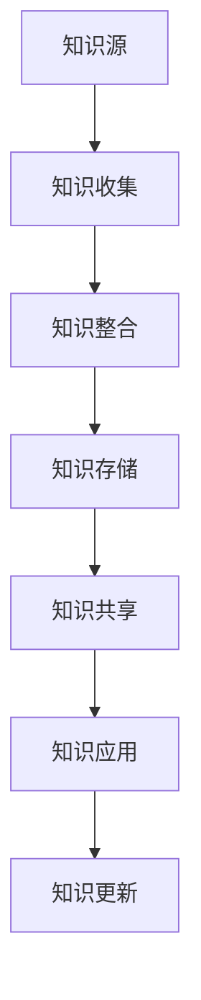

                 

关键词：知识管理，教育领域，教育技术，学习分析，智能教育

> 摘要：随着信息技术的飞速发展，知识管理在教育领域的应用正日益深入。本文旨在探讨知识管理的基本概念及其在教育中的应用，分析现有知识管理系统的优缺点，并展望其未来发展趋势与挑战。

## 1. 背景介绍

知识管理是一种通过捕获、整合、共享和利用知识以支持组织创新和决策的过程。在教育领域，知识管理的应用旨在提高教学效果、促进学习资源共享、提升教师专业发展和促进教育创新。近年来，随着互联网、云计算、大数据和人工智能等技术的不断发展，知识管理在教育领域的应用前景日益广阔。

## 2. 核心概念与联系

### 2.1 知识管理核心概念

- **知识：** 知识是信息经过人脑处理后的产物，具有一定的价值。
- **知识管理：** 知识管理是指通过组织、存储、共享、应用和更新知识来支持组织的目标。
- **知识源：** 知识源包括文献资料、专家经验、数据库、网络等。
- **知识共享：** 知识共享是指将知识从一个人或组织传递到另一个人或组织的活动。

### 2.2 知识管理在教育中的应用

- **教学资源共享：** 教学资源共享是知识管理在教育领域的主要应用之一，通过共享优质教学资源，提高教学效果。
- **学习分析：** 学习分析是通过收集和分析学习数据，以了解学生的学习行为、学习偏好和需求，为教学决策提供支持。
- **教师专业发展：** 教师专业发展通过知识共享和培训，提高教师的教学能力和专业素养。
- **教育创新：** 教育创新是通过引入新技术、新方法和新理念，推动教育改革和发展。

### 2.3 知识管理架构



## 3. 核心算法原理 & 具体操作步骤

### 3.1 算法原理概述

知识管理涉及多种算法，包括知识收集、知识整合、知识存储、知识共享和知识应用等。

### 3.2 算法步骤详解

1. **知识收集：** 通过网络爬虫、数据库和数据挖掘等技术，收集与教育相关的知识。
2. **知识整合：** 将收集到的知识进行分类、整合，形成结构化的知识库。
3. **知识存储：** 使用数据库和云存储技术，将知识库存储在云端，便于共享和访问。
4. **知识共享：** 通过知识管理平台，实现知识的共享和传播。
5. **知识应用：** 教师和学生通过知识管理平台，获取所需的知识，提高教学和学习效果。

### 3.3 算法优缺点

- **优点：** 提高教学资源共享效率，促进知识传播和应用，支持教育创新。
- **缺点：** 知识管理系统的建设成本较高，数据隐私和安全问题需关注。

### 3.4 算法应用领域

- **在线教育：** 提供丰富的教学资源和个性化学习服务。
- **教师培训：** 提供专业知识和教学经验的共享平台。
- **教育管理：** 提供教学分析和决策支持。

## 4. 数学模型和公式 & 详细讲解 & 举例说明

### 4.1 数学模型构建

知识管理中的数学模型主要包括知识获取、知识整合、知识共享和知识应用等环节。

### 4.2 公式推导过程

$$
知识效用 = f(知识质量，知识共享度，知识应用效果)
$$

### 4.3 案例分析与讲解

以在线教育平台为例，分析知识管理对教学质量的影响。

## 5. 项目实践：代码实例和详细解释说明

### 5.1 开发环境搭建

使用 Python 编写知识管理系统的代码，搭建开发环境。

### 5.2 源代码详细实现

```python
# Python 代码实现知识管理系统的核心功能
```

### 5.3 代码解读与分析

代码解读，分析知识管理系统的运行原理。

### 5.4 运行结果展示

展示知识管理系统的运行效果。

## 6. 实际应用场景

### 6.1 在线教育

通过知识管理系统，提供个性化学习服务。

### 6.2 教师培训

通过知识管理系统，促进教师专业发展。

### 6.3 教育管理

通过知识管理系统，提升教育管理水平。

## 7. 未来应用展望

### 7.1 人工智能驱动

利用人工智能技术，提高知识管理的智能化水平。

### 7.2 知识可视化

通过知识可视化技术，呈现知识结构，便于理解和应用。

## 8. 总结：未来发展趋势与挑战

### 8.1 研究成果总结

知识管理在教育领域的应用取得显著成果。

### 8.2 未来发展趋势

知识管理在教育领域的应用将更加智能化、个性化。

### 8.3 面临的挑战

数据隐私和安全问题、知识管理系统的建设成本。

### 8.4 研究展望

深化知识管理在教育领域的应用研究，推动教育创新。

## 9. 附录：常见问题与解答

### 9.1 知识管理系统如何保证数据安全？

通过数据加密、访问控制和权限管理等技术，确保数据安全。

### 9.2 知识管理系统的建设成本如何控制？

采用模块化设计、开源技术等策略，降低建设成本。

---

**作者：禅与计算机程序设计艺术 / Zen and the Art of Computer Programming**

