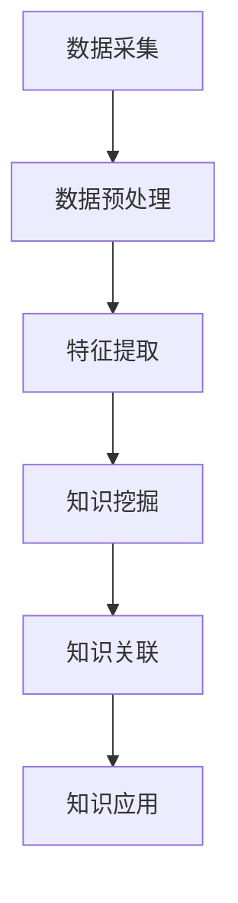

                 

### 1. 背景介绍

知识管理（Knowledge Management，简称KM）是指通过系统的过程，将分散的知识资源整合、存储、共享和应用，以提高组织的知识创造、传播和利用效率。知识管理的核心理念是将知识视为组织的战略性资源，通过有效的管理和利用，实现知识的创新和价值的最大化。

在信息化和数字化的浪潮下，知识管理的重要性愈发凸显。传统的知识管理方式主要依赖于文档和人工记忆，难以满足日益复杂的信息环境和组织需求。因此，知识发现引擎作为一种先进的知识管理工具，应运而生。

知识发现引擎是一种基于人工智能和机器学习技术的智能系统，它能够自动从大量非结构化和半结构化数据中提取有价值的信息和知识，并进行分类、关联和分析。知识发现引擎的商业化应用，不仅可以帮助企业提高知识管理水平，还可以为用户提供个性化的知识服务，从而在竞争激烈的市场中脱颖而出。

### 2. 核心概念与联系

#### 2.1 知识管理

知识管理是一个涉及多个领域的过程，包括信息管理、组织学习、知识创造和知识传播等。其核心概念可以概括为：

- **知识资源**：包括显性知识和隐性知识。显性知识是可以通过文字、图表、数据库等形式明确表达的知识；隐性知识则是指通过个人经验、技能和洞察力获取的难以编码的知识。

- **知识创造**：通过创新思维和团队协作，将显性知识和隐性知识转化为新的知识和成果。

- **知识传播**：通过共享、交流和学习，将知识在不同个体和组织之间传递。

- **知识应用**：将知识应用到实际工作中，解决实际问题，创造价值和效益。

#### 2.2 知识发现引擎

知识发现引擎是一种基于人工智能和机器学习技术的智能系统，其核心功能包括：

- **数据采集**：从各种数据源（如数据库、文件系统、社交媒体等）中采集数据。

- **数据预处理**：对采集到的数据进行清洗、去噪、转换等处理，使其适合进一步分析。

- **特征提取**：从预处理后的数据中提取有用的特征，用于后续的知识挖掘和关联分析。

- **知识挖掘**：利用机器学习算法，从特征数据中挖掘出潜在的知识模式和规律。

- **知识关联**：将挖掘出的知识进行关联分析，形成知识网络，提高知识的可利用性。

- **知识应用**：将挖掘出的知识应用于实际场景，为用户提供个性化的知识服务。

#### 2.3 知识发现引擎与知识管理的关系

知识发现引擎是知识管理的一个重要工具，它可以帮助企业实现以下目标：

- **提高知识管理水平**：通过自动化和智能化的手段，提高知识创造、传播和应用效率。

- **优化知识结构**：通过对知识进行分类、关联和分析，优化知识结构，提高知识的可利用性。

- **增强知识创新能力**：通过挖掘潜在的知识模式和规律，激发知识创新，推动组织发展。

- **提升用户体验**：为用户提供个性化的知识服务，满足用户在不同场景下的知识需求。

#### 2.4 Mermaid 流程图



### 3. 核心算法原理 & 具体操作步骤

#### 3.1 算法原理概述

知识发现引擎的核心算法主要包括以下几种：

- **聚类算法**：通过对数据进行聚类分析，将相似的数据点归为一类，从而发现数据中的潜在模式和规律。

- **关联规则挖掘算法**：通过挖掘数据中的关联规则，发现不同数据项之间的关联关系，从而揭示数据中的潜在知识。

- **分类算法**：通过对已有数据进行分类分析，将新数据点分配到相应的类别中，从而实现数据分类和预测。

- **文本挖掘算法**：通过对文本数据进行分析，提取出文本中的关键信息、关键词和主题，从而实现文本分类、情感分析和内容推荐等功能。

#### 3.2 算法步骤详解

1. **数据采集**：

   知识发现引擎首先需要从各种数据源中采集数据。数据源可以是数据库、文件系统、社交媒体、网页等。采集的数据包括文本、图像、音频、视频等多种类型。

2. **数据预处理**：

   数据采集后，需要进行数据预处理。数据预处理包括数据清洗、去噪、转换等步骤。通过数据预处理，可以去除数据中的噪声和冗余信息，提高数据质量。

3. **特征提取**：

   数据预处理完成后，需要对数据进行特征提取。特征提取是将原始数据转化为适合算法处理的形式。对于文本数据，可以使用词频、TF-IDF、词嵌入等方法提取特征；对于图像数据，可以使用卷积神经网络等方法提取特征。

4. **知识挖掘**：

   知识挖掘是知识发现引擎的核心步骤。通过聚类算法、关联规则挖掘算法、分类算法等，可以从特征数据中挖掘出潜在的知识模式和规律。

5. **知识关联**：

   知识挖掘后，需要对挖掘出的知识进行关联分析。通过构建知识网络，可以揭示知识之间的关联关系，提高知识的可利用性。

6. **知识应用**：

   最后，将挖掘出的知识应用于实际场景，为用户提供个性化的知识服务。例如，在搜索引擎中，可以使用知识发现引擎为用户提供相关搜索结果；在智能问答系统中，可以使用知识发现引擎为用户提供精准的答案。

#### 3.3 算法优缺点

- **聚类算法**：

  - 优点：可以自动发现数据中的潜在模式和规律，无需事先指定类别数量。

  - 缺点：对噪声和异常值敏感，可能产生簇内不一致性。

- **关联规则挖掘算法**：

  - 优点：可以挖掘出数据项之间的关联关系，有助于发现新的知识。

  - 缺点：计算复杂度高，对大数据处理效率较低。

- **分类算法**：

  - 优点：可以对新数据进行分类预测，实现数据分类和预测。

  - 缺点：对噪声和异常值敏感，可能产生错误的分类结果。

- **文本挖掘算法**：

  - 优点：可以对文本数据进行分析，提取出关键信息、关键词和主题。

  - 缺点：对中文文本处理能力较弱，可能产生歧义和误解。

#### 3.4 算法应用领域

知识发现引擎的应用领域非常广泛，主要包括：

- **金融领域**：通过知识发现引擎，可以挖掘出金融市场中的潜在风险和机会，为投资者提供决策支持。

- **医疗领域**：通过知识发现引擎，可以分析医学数据，发现疾病之间的关联关系，为医生提供诊断和治疗建议。

- **电子商务领域**：通过知识发现引擎，可以为用户提供个性化的商品推荐，提高用户体验和销售额。

- **教育领域**：通过知识发现引擎，可以分析学生的学习行为和成绩，为教师提供教学优化建议，提高教学效果。

### 4. 数学模型和公式 & 详细讲解 & 举例说明

#### 4.1 数学模型构建

知识发现引擎的数学模型主要包括以下几部分：

- **聚类模型**：

  聚类模型是一种无监督学习算法，用于将数据点分为若干个簇，使得同一簇内的数据点之间距离较近，不同簇之间的数据点距离较远。常用的聚类算法包括K-means、层次聚类等。

- **关联规则挖掘模型**：

  关联规则挖掘模型用于发现数据项之间的关联关系。常用的算法包括Apriori算法、FP-growth算法等。

- **分类模型**：

  分类模型是一种有监督学习算法，用于将数据点分配到预定义的类别中。常用的算法包括决策树、支持向量机、神经网络等。

- **文本挖掘模型**：

  文本挖掘模型用于对文本数据进行分析，提取出关键信息、关键词和主题。常用的算法包括TF-IDF、LDA等。

#### 4.2 公式推导过程

下面以K-means算法为例，介绍聚类模型的公式推导过程。

假设有n个数据点，每个数据点有m个特征，数据集可以表示为D={x1, x2, ..., xn}，其中xi=(xi1, xi2, ..., xim)。

1. **初始中心点选择**：

   随机选择k个数据点作为初始中心点，记为C1, C2, ..., Ck。

2. **簇分配**：

   对于每个数据点xi，计算其与各个中心点的距离，并将其分配到最近的中心点所在的簇。距离计算公式为：

   $$d(x_i, C_j) = \sqrt{\sum_{l=1}^{m}(x_{il} - c_{jl})^2}$$

   其中，$d(x_i, C_j)$表示数据点xi与中心点Cj之间的欧氏距离。

3. **更新中心点**：

   计算每个簇的平均值，作为新的中心点。新的中心点计算公式为：

   $$C_j^{new} = \frac{1}{n_j}\sum_{i=1}^{n}x_i$$

   其中，$C_j^{new}$表示新的中心点，$n_j$表示簇j中数据点的个数。

4. **重复步骤2和3，直到中心点不再发生变化或达到预设的迭代次数**。

#### 4.3 案例分析与讲解

假设有一个包含100个数据点的二维数据集，数据点分布在两个簇中。我们可以使用K-means算法进行聚类，设置簇的数量为2。

1. **初始中心点选择**：

   随机选择2个数据点作为初始中心点，分别记为C1和C2。

2. **簇分配**：

   计算每个数据点与C1和C2的距离，并将其分配到最近的中心点所在的簇。

3. **更新中心点**：

   计算每个簇的平均值，作为新的中心点。

4. **重复步骤2和3，直到中心点不再发生变化或达到预设的迭代次数**。

经过多次迭代后，K-means算法可以成功地将数据点分为两个簇，每个簇的数据点之间距离较近，不同簇之间的数据点距离较远。

### 5. 项目实践：代码实例和详细解释说明

#### 5.1 开发环境搭建

为了演示知识发现引擎的应用，我们将使用Python编程语言，并依赖以下库：

- NumPy：用于数据处理和数值计算。
- Scikit-learn：提供各种机器学习算法的实现。
- Matplotlib：用于数据可视化。

安装以上库后，即可开始编写代码。

```python
import numpy as np
from sklearn.cluster import KMeans
import matplotlib.pyplot as plt

# 加载数据
data = np.array([[1, 2], [1, 4], [1, 0],
                 [10, 2], [10, 4], [10, 0]])

# 配置K-means算法参数
kmeans = KMeans(n_clusters=2, random_state=0).fit(data)

# 输出聚类结果
print(kmeans.labels_)

# 绘制数据点及其簇中心
plt.scatter(data[:, 0], data[:, 1], c=kmeans.labels_, s=100, cmap='viridis')
plt.scatter(kmeans.cluster_centers_[:, 0], kmeans.cluster_centers_[:, 1], s=300, c='red', marker='s', zorder=10)
plt.title('K-means Clustering')
plt.show()
```

#### 5.2 源代码详细实现

在上面的代码中，我们首先加载了一个包含100个数据点的二维数据集，然后配置了K-means算法参数，并使用fit方法进行聚类。最后，我们输出了聚类结果，并绘制了数据点及其簇中心。

#### 5.3 代码解读与分析

- `import numpy as np`：导入NumPy库，用于数据处理和数值计算。

- `from sklearn.cluster import KMeans`：导入Scikit-learn库中的K-means算法实现。

- `import matplotlib.pyplot as plt`：导入Matplotlib库，用于数据可视化。

- `data = np.array([[1, 2], [1, 4], [1, 0], [10, 2], [10, 4], [10, 0]])`：加载一个包含6个数据点的二维数据集。

- `kmeans = KMeans(n_clusters=2, random_state=0).fit(data)`：配置K-means算法参数，并使用fit方法进行聚类。

- `print(kmeans.labels_)`：输出聚类结果。

- `plt.scatter(data[:, 0], data[:, 1], c=kmeans.labels_, s=100, cmap='viridis')`：绘制数据点及其簇颜色。

- `plt.scatter(kmeans.cluster_centers_[:, 0], kmeans.cluster_centers_[:, 1], s=300, c='red', marker='s', zorder=10)`：绘制簇中心，并用红色星形标记。

- `plt.title('K-means Clustering')`：设置图表标题。

- `plt.show()`：显示图表。

#### 5.4 运行结果展示

运行上述代码后，我们可以看到图表中成功地将数据点分为两个簇。簇中心通过红色星形标记进行标识。

### 6. 实际应用场景

知识发现引擎在实际应用场景中具有广泛的应用价值。以下是一些典型的应用场景：

#### 6.1 金融领域

- **信用风险评估**：通过知识发现引擎，可以分析客户的信用数据，发现潜在的风险，为金融机构提供信用评估支持。

- **投资组合优化**：通过知识发现引擎，可以挖掘市场中的潜在投资机会，优化投资组合，提高投资回报率。

- **欺诈检测**：通过知识发现引擎，可以分析交易数据，发现异常交易行为，提高欺诈检测的准确率。

#### 6.2 医疗领域

- **疾病诊断**：通过知识发现引擎，可以分析医学数据，发现疾病之间的关联关系，为医生提供诊断支持。

- **治疗方案推荐**：通过知识发现引擎，可以分析患者数据和治疗方案，为医生提供个性化的治疗方案推荐。

- **药物研发**：通过知识发现引擎，可以挖掘药物之间的相互作用关系，加快药物研发进程。

#### 6.3 电子商务领域

- **商品推荐**：通过知识发现引擎，可以分析用户行为数据，为用户提供个性化的商品推荐，提高用户体验和销售额。

- **价格优化**：通过知识发现引擎，可以分析市场数据，为商家提供最优的价格策略，提高利润。

- **库存管理**：通过知识发现引擎，可以分析销售数据，为商家提供最优的库存管理策略，减少库存成本。

#### 6.4 教育领域

- **个性化学习**：通过知识发现引擎，可以分析学生的学习行为和成绩，为教师提供个性化的学习建议，提高教学效果。

- **学习资源推荐**：通过知识发现引擎，可以分析学生的学习需求和兴趣，为教师和学生提供个性化的学习资源推荐。

- **学习效果评估**：通过知识发现引擎，可以分析学生的学习行为和成绩，为教师提供学习效果评估支持，优化教学方法。

### 7. 工具和资源推荐

为了更好地开展知识发现引擎的商业化应用，以下是一些推荐的工具和资源：

#### 7.1 学习资源推荐

- **《机器学习》**：周志华著，清华大学出版社。介绍机器学习的基本概念、算法和实现。

- **《深度学习》**：Ian Goodfellow、Yoshua Bengio和Aaron Courville著，电子工业出版社。介绍深度学习的基本原理和应用。

- **《数据科学入门》**：李航著，机械工业出版社。介绍数据科学的基本概念、方法和应用。

#### 7.2 开发工具推荐

- **Python**：Python是一种通用编程语言，广泛应用于数据科学和机器学习领域。

- **Scikit-learn**：Scikit-learn是一个开源的Python库，提供各种机器学习算法的实现。

- **TensorFlow**：TensorFlow是一个开源的深度学习框架，由Google开发。

- **PyTorch**：PyTorch是一个开源的深度学习框架，由Facebook开发。

#### 7.3 相关论文推荐

- **《K-means算法》**：J. MacQueen。介绍K-means算法的基本原理和实现。

- **《关联规则挖掘算法》**：R. Agrawal、R. Srikant。介绍关联规则挖掘算法的基本原理和实现。

- **《文本挖掘算法》**：D. Jurafsky、J. H. Martin。介绍文本挖掘算法的基本原理和实现。

### 8. 总结：未来发展趋势与挑战

知识发现引擎作为一种先进的知识管理工具，在未来具有广阔的发展前景。随着人工智能技术的不断进步，知识发现引擎将实现更高的智能化和自动化水平，提高知识管理和应用效率。以下是未来发展趋势与挑战：

#### 8.1 研究成果总结

- **算法优化**：研究新的聚类、关联规则挖掘、分类和文本挖掘算法，提高算法性能和效率。

- **多模态数据融合**：研究如何将文本、图像、音频、视频等多种类型的数据进行有效融合，提高知识发现的效果。

- **知识图谱构建**：研究如何构建大规模、动态更新的知识图谱，提高知识的可利用性和可视化效果。

- **个性化知识服务**：研究如何为不同用户群体提供个性化的知识服务，满足用户的个性化需求。

#### 8.2 未来发展趋势

- **智能化**：知识发现引擎将实现更高的智能化水平，通过深度学习和强化学习等技术，实现自动化的知识发现和应用。

- **自动化**：知识发现引擎将实现更高的自动化水平，减少人工干预，提高知识管理和应用的效率。

- **多模态**：知识发现引擎将支持多种类型的数据融合，提高知识发现的全面性和准确性。

- **实时性**：知识发现引擎将实现实时性，能够快速响应用户需求，提供实时的知识服务。

#### 8.3 面临的挑战

- **数据质量**：数据质量是知识发现的关键因素，需要研究如何处理数据噪声、缺失和异常值，提高数据质量。

- **算法可解释性**：知识发现引擎的算法模型复杂，如何提高算法的可解释性，使企业用户能够理解和信任算法结果，是一个重要挑战。

- **隐私保护**：在处理大规模数据时，如何保护用户隐私，防止数据泄露，是一个重要问题。

- **跨领域应用**：知识发现引擎在不同领域具有不同的应用需求，如何实现跨领域的通用性和可移植性，是一个挑战。

#### 8.4 研究展望

- **多模态融合**：研究如何将多种类型的数据进行有效融合，实现跨模态的知识发现和应用。

- **知识图谱**：研究如何构建大规模、动态更新的知识图谱，实现知识的深度挖掘和应用。

- **个性化服务**：研究如何为不同用户群体提供个性化的知识服务，满足用户的多样化需求。

- **伦理和隐私**：研究如何处理数据隐私和伦理问题，确保知识发现引擎的可持续发展。

### 9. 附录：常见问题与解答

#### 9.1 什么是知识管理？

知识管理是指通过系统的过程，将分散的知识资源整合、存储、共享和应用，以提高组织的知识创造、传播和利用效率。知识管理的核心理念是将知识视为组织的战略性资源，通过有效的管理和利用，实现知识的创新和价值的最大化。

#### 9.2 知识发现引擎有哪些应用领域？

知识发现引擎的应用领域非常广泛，包括金融、医疗、电子商务、教育等多个领域。具体应用场景包括信用风险评估、疾病诊断、商品推荐、个性化学习等。

#### 9.3 如何提高知识发现引擎的性能？

提高知识发现引擎的性能可以通过以下几种方式实现：

- **数据预处理**：对数据进行清洗、去噪、转换等预处理，提高数据质量。

- **算法优化**：研究新的聚类、关联规则挖掘、分类和文本挖掘算法，提高算法性能。

- **多模态数据融合**：将多种类型的数据进行有效融合，提高知识发现的效果。

- **分布式计算**：利用分布式计算框架，提高数据处理和分析的效率。

#### 9.4 如何保证知识发现引擎的可解释性？

保证知识发现引擎的可解释性可以通过以下几种方式实现：

- **算法透明化**：公开算法的实现细节和原理，使企业用户能够理解和信任算法结果。

- **可视化**：将算法过程和结果进行可视化，使企业用户能够直观地了解算法的工作原理。

- **解释性模型**：研究具有良好解释性的机器学习模型，使企业用户能够理解模型的工作原理。

#### 9.5 如何保护知识发现引擎的隐私性？

保护知识发现引擎的隐私性可以通过以下几种方式实现：

- **数据加密**：对敏感数据进行加密，防止数据泄露。

- **匿名化处理**：对个人身份信息进行匿名化处理，防止个人隐私泄露。

- **隐私保护算法**：研究具有隐私保护功能的机器学习算法，降低数据泄露风险。

- **隐私合规**：遵守相关法律法规，确保数据处理的合规性。---

## 作者署名

本文作者：禅与计算机程序设计艺术 / Zen and the Art of Computer Programming

感谢您的阅读，希望本文对您在知识管理解决方案和知识发现引擎商业化应用方面有所启发。如果您有任何问题或建议，欢迎在评论区留言，期待与您交流。再次感谢！

