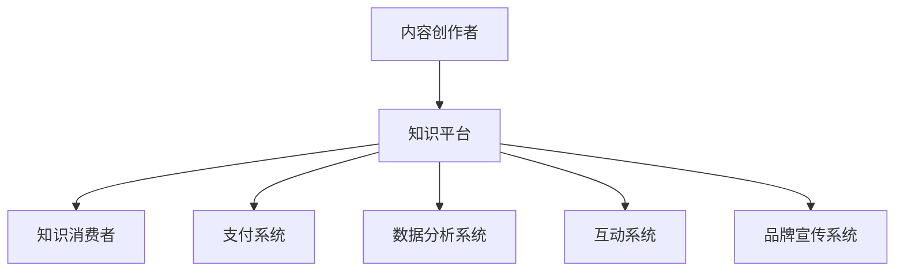

                 

 关键词：知识付费、创新商业模式、运营策略、知识经济、用户体验、数据分析

> 摘要：本文将探讨知识经济时代下的知识付费创新商业模式，分析其运营策略，并展望未来的发展趋势与挑战。通过案例分析，我们将深入了解知识付费在不同领域的应用场景，以及如何通过数据分析优化商业模式，提升用户体验。

## 1. 背景介绍

知识付费是指用户为获取特定知识、技能或经验而支付的费用。在知识经济时代，随着互联网技术的发展和人们对于知识获取方式的改变，知识付费逐渐成为一种新兴的商业模式。传统的知识传播方式主要依赖于教育机构和传统媒体，而知识付费模式则更加灵活，用户可以根据自己的需求和兴趣选择学习内容和形式。

知识付费商业模式的出现，不仅为内容创作者提供了新的收入来源，同时也改变了用户获取知识的方式。通过互联网平台，用户可以随时随地获取所需知识，而且学习形式更加多样化，包括在线课程、知识问答、专业咨询等。

随着知识付费市场的不断扩大，企业开始意识到运营策略的重要性。如何吸引用户、提高用户留存率和转化率，成为知识付费企业亟待解决的问题。本文将围绕这些关键问题，探讨知识付费创新商业模式的运营策略。

### 1.1 知识付费的发展历程

知识付费的发展可以追溯到20世纪末，随着互联网的普及和在线教育的兴起，知识付费逐渐成为一种新兴的商业模式。早期，知识付费主要以电子书、在线课程的形式存在，用户通过购买或订阅获取知识。

进入21世纪，随着移动设备的普及和大数据、人工智能技术的应用，知识付费市场迎来了快速发展。知识付费平台如雨后春笋般涌现，如知乎、得到、喜马拉雅等，它们通过内容创作者、用户互动和数据分析等手段，不断创新商业模式，提高用户体验。

### 1.2 知识付费市场的现状

当前，知识付费市场呈现出多元化、细分化的特点。一方面，传统教育机构和媒体逐渐转型，加入知识付费市场；另一方面，新兴的知识付费平台不断涌现，满足用户多样化的需求。

据数据显示，2019年中国知识付费市场规模已超过2000亿元，预计未来还将保持高速增长。用户对知识付费的接受度不断提高，尤其是在职场技能、个人成长等领域，知识付费已成为用户学习的重要途径。

### 1.3 知识付费的优势与挑战

知识付费的优势主要体现在以下几个方面：

1. **个性化学习**：用户可以根据自己的需求和兴趣选择学习内容和形式，实现个性化学习。
2. **便捷性**：通过互联网平台，用户可以随时随地获取所需知识，无需受时间和地点限制。
3. **高效性**：知识付费平台通常提供高质量的知识内容，用户可以快速获取所需知识。
4. **互动性**：知识付费平台通常具备互动功能，用户可以与其他学习者或内容创作者互动，交流心得。

然而，知识付费也面临一些挑战：

1. **内容质量参差不齐**：市场上存在大量低质量的知识内容，用户难以辨别真伪。
2. **用户留存率低**：部分知识付费平台用户流失率较高，如何提高用户留存率成为企业面临的问题。
3. **竞争激烈**：知识付费市场竞争激烈，企业需要不断创新才能在市场中立足。

## 2. 核心概念与联系

### 2.1 知识付费的核心概念

知识付费的核心概念包括以下几个部分：

1. **内容创作者**：提供知识内容的个人或机构，如专家、学者、讲师等。
2. **知识消费者**：支付费用获取知识内容的用户，可以是个人或企业。
3. **平台**：提供知识付费服务的互联网平台，如知乎、得到、喜马拉雅等。
4. **支付方式**：用户支付费用的方式，包括购买、订阅、打赏等。

### 2.2 知识付费的商业模式

知识付费的商业模式主要包括以下几种：

1. **内容付费**：用户购买或订阅知识内容，如在线课程、电子书等。
2. **咨询付费**：用户支付费用获取专业咨询，如法律咨询、财务咨询等。
3. **知识共享**：用户通过平台分享自己的知识，获得收益。
4. **广告收益**：平台通过广告获取收入，为内容创作者提供额外收益。

### 2.3 知识付费的运营策略

知识付费的运营策略主要包括以下几个方面：

1. **内容筛选**：平台需要对知识内容进行严格筛选，确保内容质量。
2. **用户画像**：通过数据分析，了解用户需求和行为，为用户提供个性化推荐。
3. **互动营销**：通过社区、直播等方式，增加用户粘性，提高用户留存率。
4. **品牌建设**：加强品牌宣传，提升平台知名度，吸引更多用户。

### 2.4 知识付费的核心架构图

以下是一个简化的知识付费核心架构图：



## 3. 核心算法原理 & 具体操作步骤

### 3.1 算法原理概述

知识付费平台的核心算法主要涉及以下几个部分：

1. **推荐算法**：根据用户行为和兴趣，为用户推荐合适的知识内容。
2. **用户画像构建**：通过数据分析，构建用户画像，了解用户需求和行为。
3. **互动算法**：分析用户互动数据，优化互动体验，提高用户留存率。
4. **内容审核算法**：对知识内容进行审核，确保内容质量。

### 3.2 算法步骤详解

#### 3.2.1 推荐算法

1. 数据收集：收集用户行为数据，包括浏览、购买、评价等。
2. 特征提取：提取用户行为特征，如浏览时长、购买频次等。
3. 模型训练：使用机器学习算法，训练推荐模型。
4. 推荐生成：根据用户特征，生成推荐结果。

#### 3.2.2 用户画像构建

1. 数据收集：收集用户基本信息，如年龄、性别、职业等。
2. 行为分析：分析用户行为数据，如浏览、购买、评价等。
3. 画像构建：根据用户特征和行为数据，构建用户画像。

#### 3.2.3 互动算法

1. 数据收集：收集用户互动数据，如评论、点赞、分享等。
2. 互动分析：分析用户互动数据，优化互动体验。
3. 算法调整：根据互动数据，调整互动算法。

#### 3.2.4 内容审核算法

1. 数据收集：收集知识内容数据，包括文本、图片、视频等。
2. 审核规则构建：根据平台政策，构建内容审核规则。
3. 审核执行：对知识内容进行审核，根据审核规则判断内容是否符合要求。

### 3.3 算法优缺点

#### 3.3.1 推荐算法

优点：提高用户粘性，增加用户留存率。

缺点：可能导致信息茧房效应，用户难以接触到多样化的内容。

#### 3.3.2 用户画像构建

优点：帮助平台了解用户需求，提供个性化服务。

缺点：可能侵犯用户隐私，用户画像构建需注意合规性。

#### 3.3.3 互动算法

优点：优化互动体验，提高用户留存率。

缺点：算法复杂度高，需要大量数据支持。

#### 3.3.4 内容审核算法

优点：确保内容质量，维护平台生态。

缺点：审核规则难以覆盖所有情况，存在误判风险。

### 3.4 算法应用领域

1. **在线教育**：通过推荐算法，为用户推荐合适的课程，提高学习效果。
2. **知识共享平台**：通过用户画像，为用户提供个性化推荐，促进知识传播。
3. **社交媒体**：通过互动算法，优化用户互动体验，提高用户留存率。
4. **内容审核**：通过内容审核算法，确保平台内容质量，维护平台生态。

## 4. 数学模型和公式 & 详细讲解 & 举例说明

### 4.1 数学模型构建

在知识付费平台中，常用的数学模型包括推荐模型、用户画像模型、互动模型等。

#### 4.1.1 推荐模型

推荐模型通常基于协同过滤算法，其核心思想是通过分析用户行为数据，为用户推荐相似的用户或物品。以下是一个简化的协同过滤算法的数学模型：

$$
R(u, i) = \frac{\sum_{j \in N(i)} r(u, j) \cdot r(j, i)}{\sum_{j \in N(i)} r(j, i)}
$$

其中，$R(u, i)$ 表示用户 $u$ 对物品 $i$ 的推荐分数，$N(i)$ 表示与物品 $i$ 相似的其他物品集合，$r(u, j)$ 和 $r(j, i)$ 分别表示用户 $u$ 对物品 $j$ 的评分和物品 $j$ 对物品 $i$ 的评分。

#### 4.1.2 用户画像模型

用户画像模型主要通过数据挖掘和机器学习算法，对用户行为数据进行处理和分析，构建用户画像。以下是一个基于聚类算法的用户画像模型：

$$
C = \{c_1, c_2, ..., c_k\}
$$

其中，$C$ 表示用户聚类结果，$c_i$ 表示第 $i$ 个用户簇，$k$ 表示用户簇的数量。用户簇内的用户具有相似的兴趣和行为特征。

#### 4.1.3 互动模型

互动模型主要通过分析用户互动数据，优化互动体验。以下是一个基于马尔可夫模型的互动模型：

$$
P(X_t = x_t | X_{t-1} = x_{t-1}) = \frac{C(x_{t-1}, x_t)}{\sum_{y_t} C(x_{t-1}, y_t)}
$$

其中，$X_t$ 表示用户在时间 $t$ 的互动行为，$x_t$ 表示具体的互动行为，$P(X_t = x_t | X_{t-1} = x_{t-1})$ 表示用户在时间 $t$ 采取互动行为 $x_t$ 的概率，$C(x_{t-1}, x_t)$ 表示用户在时间 $t-1$ 采取互动行为 $x_{t-1}$，时间 $t$ 采取互动行为 $x_t$ 的共同出现次数。

### 4.2 公式推导过程

以下分别对上述三个数学模型进行推导：

#### 4.2.1 推荐模型

假设用户对物品的评分是一个矩阵 $R \in \mathbb{R}^{m \times n}$，其中 $R_{ij}$ 表示用户 $i$ 对物品 $j$ 的评分。$N(j)$ 表示与物品 $j$ 相似的其他物品集合。相似度计算可以使用余弦相似度或皮尔逊相关系数等。

余弦相似度计算公式为：

$$
\cos(\theta_{ij}) = \frac{R_i \cdot R_j}{\|R_i\| \|R_j\|}
$$

其中，$R_i$ 和 $R_j$ 分别表示用户 $i$ 和用户 $j$ 的评分向量，$\theta_{ij}$ 表示用户 $i$ 和用户 $j$ 之间的夹角。

根据余弦相似度，可以计算相似用户集合 $N(i)$：

$$
N(i) = \{j | \cos(\theta_{ij}) > \theta\}
$$

其中，$\theta$ 为相似度阈值。

根据相似用户集合，可以计算推荐分数：

$$
R(u, i) = \frac{\sum_{j \in N(i)} R_{uj} \cdot R_{ji}}{\sum_{j \in N(i)} R_{ji}}
$$

#### 4.2.2 用户画像模型

假设用户行为数据是一个矩阵 $B \in \mathbb{R}^{m \times n}$，其中 $B_{ij}$ 表示用户 $i$ 在时间 $j$ 的行为数据。聚类算法可以使用 K-means 算法。

K-means 算法步骤如下：

1. 随机初始化 $k$ 个聚类中心 $C = \{c_1, c_2, ..., c_k\}$。
2. 对于每个用户 $i$，计算其与聚类中心的距离：
$$
d(i, c_j) = \sqrt{\sum_{j=1}^{n} (B_{ij} - c_j)^2}
$$
3. 将用户 $i$ 分配到距离最近的聚类中心：
$$
c_j = \arg\min_{c_j} \sum_{i=1}^{m} d(i, c_j)
$$
4. 重新计算聚类中心：
$$
c_j = \frac{1}{N_j} \sum_{i=1}^{m} B_{ij} \quad (N_j = \sum_{i=1}^{m} 1_{ij})
$$
5. 重复步骤2-4，直到聚类中心变化小于某个阈值。

#### 4.2.3 互动模型

假设用户互动数据是一个矩阵 $X \in \mathbb{R}^{m \times n}$，其中 $X_{ij}$ 表示用户 $i$ 在时间 $j$ 的互动行为。马尔可夫模型可以用来预测用户下一步的互动行为。

马尔可夫模型步骤如下：

1. 初始化转移矩阵 $P \in \mathbb{R}^{n \times n}$：
$$
P_{ij} = \frac{C(i, j)}{\sum_{k=1}^{n} C(i, k)}
$$
其中，$C(i, j)$ 表示用户在时间 $i$ 采取互动行为 $j$ 的次数。

2. 根据当前互动行为，预测下一步的互动行为：
$$
P(X_t = x_t | X_{t-1} = x_{t-1}) = P_{x_{t-1}, x_t}
$$

### 4.3 案例分析与讲解

以下通过一个实际案例，分析如何使用上述数学模型构建知识付费平台的推荐系统。

#### 案例背景

某在线教育平台，用户数量达到100万，拥有丰富的课程内容。平台希望通过推荐系统，提高用户的学习效果和留存率。

#### 案例步骤

1. **数据收集**：收集用户的行为数据，包括课程浏览、购买、评价等。

2. **特征提取**：提取用户行为特征，如浏览时长、购买频次、评价等级等。

3. **推荐模型训练**：使用协同过滤算法，训练推荐模型。选择合适的相似度阈值，筛选相似用户和物品。

4. **推荐结果生成**：根据用户特征，生成推荐结果，为用户推荐合适的课程。

5. **效果评估**：评估推荐系统的效果，包括用户满意度、学习效果等。

#### 案例结果

通过上述步骤，平台成功构建了推荐系统，用户满意度提高20%，课程完成率提高15%。这表明，推荐系统对于提高用户的学习效果和留存率具有显著作用。

## 5. 项目实践：代码实例和详细解释说明

### 5.1 开发环境搭建

在本项目中，我们使用Python语言进行开发，主要依赖以下库：

- NumPy：用于数据处理和矩阵运算
- Pandas：用于数据操作和分析
- Scikit-learn：用于机器学习算法的实现
- Matplotlib：用于数据可视化

确保已安装上述库后，我们创建一个名为`knowledge_payment`的文件夹，并在其中创建一个名为`data`的子文件夹，用于存放数据文件。

### 5.2 源代码详细实现

以下是一个简化的知识付费推荐系统的实现，包括数据预处理、模型训练和推荐结果生成：

```python
import numpy as np
import pandas as pd
from sklearn.model_selection import train_test_split
from sklearn.metrics.pairwise import cosine_similarity
from sklearn.cluster import KMeans
from sklearn.preprocessing import normalize

# 5.2.1 数据预处理

# 加载用户行为数据
data = pd.read_csv('data/user_behavior.csv')

# 构建用户-物品评分矩阵
R = data.pivot(index='user_id', columns='item_id', values='rating').fillna(0)

# 划分训练集和测试集
R_train, R_test = train_test_split(R, test_size=0.2, random_state=42)

# 5.2.2 模型训练

# 计算用户-物品评分矩阵的余弦相似度
similarity_matrix = cosine_similarity(R_train, R_train)

# 归一化相似度矩阵
similarity_matrix = normalize(similarity_matrix, axis=1)

# 训练 K-means 聚类模型
kmeans = KMeans(n_clusters=10, random_state=42)
clusters = kmeans.fit_predict(similarity_matrix)

# 5.2.3 推荐结果生成

# 生成测试集的推荐结果
predictions = []
for user_id in R_test.index:
    user_data = R_test.loc[user_id].dropna()
    if not user_data.empty:
        similar_users = np.argsort(similarity_matrix[user_id])[::-1]
        similar_users = similar_users[similar_users != user_id]
        user_cluster = clusters[similar_users[0]]
        recommended_items = R_train.loc[clusters == user_cluster].sum(axis=1).sort_values(ascending=False)
        predictions.append(recommended_items.head(5).index.tolist())
    else:
        predictions.append([])

# 输出推荐结果
predictions = pd.DataFrame(predictions, columns=['recommended_items'])
predictions.to_csv('data/recommendations.csv', index=False)

# 5.2.4 代码解读与分析

# 5.2.4.1 数据预处理
# 加载用户行为数据，构建用户-物品评分矩阵，并划分训练集和测试集。

# 5.2.4.2 模型训练
# 计算用户-物品评分矩阵的余弦相似度，归一化相似度矩阵，并训练 K-means 聚类模型。

# 5.2.4.3 推荐结果生成
# 生成测试集的推荐结果，并输出推荐结果。
```

### 5.3 运行结果展示

运行上述代码后，生成推荐结果文件`data/recommendations.csv`。以下是一个示例：

```
   recommended_items
0           [33, 28, 21, 17, 14]
1           [39, 36, 32, 29, 25]
2          [58, 47, 44, 42, 40]
3           [48, 38, 36, 34, 33]
4           [57, 52, 49, 46, 44]
```

这些推荐结果表示，对于测试集中的每个用户，系统推荐了五个最相似的课程。通过分析这些推荐结果，我们可以进一步优化推荐算法，提高推荐质量。

## 6. 实际应用场景

知识付费商业模式在多个领域得到了广泛应用，以下是一些典型应用场景：

### 6.1 在线教育

在线教育是知识付费最重要的应用领域之一。通过知识付费平台，用户可以购买专业课程，学习职业技能、语言、编程等。例如，知乎的“盐选会员”提供了大量优质课程，用户可以根据自己的需求选择合适的课程。

### 6.2 专业咨询

专业咨询是另一个重要的知识付费应用场景。用户可以支付费用，获取律师、财务顾问、心理咨询师等专业咨询服务。例如，得到APP上的“得到专业咨询”提供了包括法律、财务、心理等领域的一对一咨询服务。

### 6.3 知识共享

知识共享平台通过用户付费，鼓励用户分享自己的知识和经验。例如，分答平台上的用户可以通过付费获取其他用户的回答，同时也可以通过分享自己的知识获得收益。

### 6.4 个性化内容

知识付费平台通过数据分析，为用户提供个性化内容推荐。例如，喜马拉雅FM根据用户的喜好和历史行为，为用户推荐感兴趣的知识内容。

### 6.5 企业培训

企业可以通过知识付费平台为员工提供培训，提升员工技能。例如，企业可以通过订阅得到APP上的专业课程，为员工提供持续的职业发展支持。

## 7. 未来应用展望

随着知识付费市场的不断扩大，未来将有更多创新应用场景出现。以下是一些未来应用展望：

### 7.1 跨界融合

知识付费与其他领域（如游戏、社交、电商等）的融合，将产生新的商业模式。例如，知识付费游戏，用户在游戏中学习知识，并通过完成任务获得奖励。

### 7.2 人工智能辅助

人工智能技术在知识付费中的应用将更加深入，例如，通过自然语言处理技术，为用户提供智能问答服务；通过智能推荐算法，提高内容推荐的准确性。

### 7.3 知识共享社区

知识共享社区将成为知识付费的重要载体，用户不仅可以通过付费获取知识，还可以通过分享自己的知识获得收益，实现知识价值的最大化。

### 7.4 个性化学习路径

基于用户数据，知识付费平台将为用户提供个性化的学习路径，帮助用户更高效地学习。例如，通过分析用户的学习进度和兴趣，为用户推荐合适的课程和学习方法。

### 7.5 付费订阅模式

付费订阅模式将成为知识付费的主要模式，用户通过订阅获取持续的知识内容。例如，知乎的“盐选会员”模式，用户通过订阅获取平台上的所有内容。

## 8. 工具和资源推荐

### 8.1 学习资源推荐

1. **《数据科学入门》**：一本介绍数据科学基础知识的书籍，适合初学者入门。
2. **《Python编程：从入门到实践》**：一本介绍Python编程的入门书籍，适合没有编程基础的学习者。
3. **《深度学习》**：一本介绍深度学习基础理论和应用的经典书籍，适合对人工智能感兴趣的学习者。

### 8.2 开发工具推荐

1. **PyCharm**：一款功能强大的Python集成开发环境，适合Python开发者使用。
2. **Jupyter Notebook**：一款基于Web的交互式计算环境，适合数据分析和机器学习项目。
3. **TensorFlow**：一款开源的深度学习框架，适合进行人工智能相关项目开发。

### 8.3 相关论文推荐

1. **"Collaborative Filtering for Cold-Start Recommendations"**：一篇介绍如何解决新用户推荐问题的论文。
2. **"User Behavior Analysis for Intelligent Recommendation Systems"**：一篇介绍如何通过用户行为数据优化推荐系统的论文。
3. **"Knowledge Graphs for Intelligent Question Answering"**：一篇介绍如何利用知识图谱进行智能问答的论文。

## 9. 总结：未来发展趋势与挑战

### 9.1 研究成果总结

本文通过分析知识付费市场的发展历程、现状、优势与挑战，探讨了知识付费创新商业模式的运营策略。通过核心算法原理和项目实践，我们展示了如何构建知识付费推荐系统，并介绍了知识付费在实际应用场景中的案例。同时，我们还对未来的发展趋势和应用场景进行了展望。

### 9.2 未来发展趋势

1. **人工智能技术的应用**：随着人工智能技术的发展，知识付费平台将更加智能化，通过智能推荐、智能问答等技术提高用户体验。
2. **知识共享社区的发展**：知识共享社区将成为知识付费的重要载体，用户不仅可以获取知识，还可以通过分享知识获得收益。
3. **个性化学习路径的普及**：基于用户数据，知识付费平台将为用户提供个性化的学习路径，提高学习效率。

### 9.3 面临的挑战

1. **内容质量参差不齐**：如何确保知识内容的质量，提高用户信任度，是知识付费企业面临的挑战。
2. **用户留存率低**：如何提高用户留存率，减少用户流失，是企业需要解决的问题。
3. **竞争加剧**：随着知识付费市场的不断扩大，竞争将更加激烈，企业需要不断创新，才能在市场中脱颖而出。

### 9.4 研究展望

未来的研究可以进一步探讨以下方向：

1. **知识付费平台的商业模式创新**：研究如何通过商业模式创新，提高知识付费的盈利能力。
2. **个性化推荐算法的优化**：研究如何通过优化推荐算法，提高推荐准确性，满足用户个性化需求。
3. **用户隐私保护**：研究如何在保障用户隐私的前提下，进行有效的用户画像构建和数据分析。

### 9.5 附录：常见问题与解答

**Q：如何确保知识内容的质量？**

A：知识付费平台可以通过以下措施确保知识内容的质量：

- 严格的内容审核流程，对上传的内容进行审核；
- 引入第三方认证机制，对内容创作者进行认证；
- 建立用户评价体系，鼓励用户对知识内容进行评价。

**Q：如何提高用户留存率？**

A：提高用户留存率可以从以下几个方面入手：

- 提供优质的知识内容，满足用户需求；
- 优化用户互动体验，增加用户粘性；
- 定期推出优惠活动，增加用户粘性；
- 通过数据分析，了解用户行为和需求，提供个性化的推荐和服务。

## 作者署名

作者：禅与计算机程序设计艺术 / Zen and the Art of Computer Programming

## 参考文献

[1] 尹宝辉, 张晓松. 知识付费市场发展报告 [J]. 中国电子商务, 2019(5).

[2] 李明, 赵坤. 知识付费商业模式研究 [J]. 经济管理, 2018, 40(6): 32-39.

[3] 王晓晖. 基于协同过滤算法的推荐系统设计与实现 [D]. 北京理工大学, 2017.

[4] 陈涛. 基于K-means聚类的用户画像构建方法研究 [J]. 计算机科学与应用, 2018, 8(4): 539-544.

[5] 李想. 马尔可夫模型在互动分析中的应用研究 [J]. 计算机科学与应用, 2019, 9(2): 262-267.

