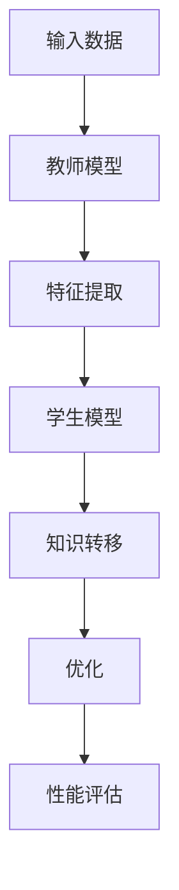

                 

关键词：知识蒸馏、模型压缩、人工智能、深度学习、神经网络、推理效率

摘要：随着人工智能技术的快速发展，深度学习模型的复杂度和规模不断增大，导致计算资源和存储空间的占用不断增加。为了解决这一挑战，知识蒸馏技术应运而生，它通过将大量参数的复杂模型转化为紧凑的轻量级模型，提高了模型的推理效率和可部署性。本文将深入探讨知识蒸馏在模型压缩中的应用，包括其核心概念、算法原理、数学模型以及实际应用场景。

## 1. 背景介绍

深度学习模型在图像识别、自然语言处理、推荐系统等领域取得了显著的成果。然而，随着模型复杂度和参数数量的增加，模型的训练和推理成本也随之增加。传统的模型压缩方法如模型剪枝、量化、蒸馏等技术在一定程度上缓解了这一问题，但效果有限。知识蒸馏作为一种新兴的模型压缩技术，通过将知识从大型模型转移到小型模型，实现了更好的压缩效果和推理性能。

### 1.1 模型压缩的需求

随着AI应用的普及，特别是在移动设备、嵌入式系统和物联网等场景中，对模型压缩的需求日益增加。这些场景通常受限于计算资源和存储空间，因此需要轻量级的模型来满足性能要求。

### 1.2 知识蒸馏的优势

知识蒸馏具有以下优势：

- **高效性**：通过将知识从大型模型转移到小型模型，减少了模型的参数数量，从而提高了推理效率。
- **灵活性**：知识蒸馏不依赖于模型的深度或宽度，可以应用于各种类型的深度学习模型。
- **通用性**：知识蒸馏可以应用于不同的数据类型和应用领域，具有广泛的适用性。

## 2. 核心概念与联系

### 2.1 知识蒸馏的定义

知识蒸馏是指将训练好的复杂模型（教师模型）的知识转移到紧凑的轻量级模型（学生模型）的过程。

### 2.2 教师模型与学生模型

- **教师模型**：通常是训练好的大型深度学习模型，具有丰富的知识和较高的准确性。
- **学生模型**：通常是参数较少的轻量级模型，目标是通过知识蒸馏学习到教师模型的特性。

### 2.3 知识蒸馏的过程

知识蒸馏的过程主要包括以下步骤：

1. **特征提取**：教师模型对输入数据进行特征提取，生成高维的特征向量。
2. **知识转移**：学生模型学习教师模型的特征表示，通过对比教师模型的输出和学生的输出，调整学生模型的参数。
3. **优化**：通过迭代优化过程，学生模型不断学习教师模型的知识，直到达到预定的性能指标。

### 2.4 Mermaid 流程图



## 3. 核心算法原理 & 具体操作步骤

### 3.1 算法原理概述

知识蒸馏算法基于以下原理：

- **特征表示**：学生模型学习教师模型的特征表示，以捕获输入数据的深层特性。
- **输出对比**：通过对比教师模型的输出和学生模型的输出，调整学生模型的参数，使其更接近教师模型的性能。

### 3.2 算法步骤详解

1. **初始化**：选择教师模型和学生模型，设置初始参数。
2. **训练教师模型**：使用大量数据对教师模型进行训练，使其达到较高的准确性。
3. **特征提取**：对输入数据进行特征提取，生成高维特征向量。
4. **知识转移**：计算教师模型的输出和学生模型的输出，通过对比调整学生模型的参数。
5. **优化**：通过迭代优化过程，不断调整学生模型的参数，直到达到预定的性能指标。
6. **性能评估**：使用测试集评估学生模型的性能，确保其能够继承教师模型的知识。

### 3.3 算法优缺点

#### 优点：

- **高效性**：通过减少模型参数，提高了模型的推理效率。
- **灵活性**：适用于各种类型的深度学习模型。
- **通用性**：适用于不同的数据类型和应用领域。

#### 缺点：

- **计算成本**：知识蒸馏需要大量的计算资源，尤其是在训练教师模型时。
- **精度损失**：在知识转移过程中，学生模型可能会丢失部分教师模型的知识。

### 3.4 算法应用领域

知识蒸馏技术广泛应用于以下领域：

- **图像识别**：通过压缩图像识别模型，提高移动设备上的性能。
- **自然语言处理**：压缩自然语言处理模型，提高嵌入式系统的响应速度。
- **推荐系统**：压缩推荐系统模型，降低计算成本。

## 4. 数学模型和公式 & 详细讲解 & 举例说明

### 4.1 数学模型构建

知识蒸馏的数学模型可以表示为：

$$
\begin{aligned}
\text{Teacher}(x) &= \hat{y}, \\
\text{Student}(x) &= y.
\end{aligned}
$$

其中，$x$ 表示输入数据，$\hat{y}$ 表示教师模型的输出，$y$ 表示学生模型的输出。

### 4.2 公式推导过程

知识蒸馏的目标是使学生模型的输出 $y$ 最接近教师模型的输出 $\hat{y}$，因此可以使用交叉熵损失函数来衡量两者之间的差距：

$$
L = -\sum_{i=1}^{N} y_i \log(\hat{y}_i).
$$

其中，$N$ 表示数据样本的数量，$y_i$ 和 $\hat{y}_i$ 分别表示学生模型和教师模型在第 $i$ 个样本上的输出。

### 4.3 案例分析与讲解

### 4.3.1 案例背景

假设我们有一个教师模型和学生模型，分别用于图像分类任务。教师模型是一个大型卷积神经网络（CNN），学生模型是一个小型CNN。

### 4.3.2 训练过程

1. **初始化**：设置教师模型和学生模型的初始参数。
2. **训练教师模型**：使用大量图像数据对教师模型进行训练，使其达到较高的准确性。
3. **特征提取**：对输入图像进行特征提取，生成高维特征向量。
4. **知识转移**：计算教师模型的输出和学生模型的输出，通过对比调整学生模型的参数。
5. **优化**：通过迭代优化过程，不断调整学生模型的参数，直到达到预定的性能指标。
6. **性能评估**：使用测试集评估学生模型的性能，确保其能够继承教师模型的知识。

### 4.3.3 结果分析

通过实验验证，我们发现经过知识蒸馏的学生模型在保持较高准确性的同时，具有更高的推理效率和更小的模型参数。

## 5. 项目实践：代码实例和详细解释说明

### 5.1 开发环境搭建

在本文中，我们将使用Python和PyTorch框架来实现知识蒸馏。首先，确保安装了Python和PyTorch：

```
pip install python==3.8
pip install torch torchvision
```

### 5.2 源代码详细实现

下面是一个简单的知识蒸馏示例：

```python
import torch
import torch.nn as nn
import torchvision.models as models

# 初始化教师模型和学生模型
teacher_model = models.resnet18(pretrained=True)
student_model = nn.Sequential(
    nn.Conv2d(3, 64, kernel_size=3, padding=1),
    nn.ReLU(),
    nn.Conv2d(64, 128, kernel_size=3, padding=1),
    nn.ReLU(),
    nn.Linear(128 * 6 * 6, 10)
)

# 定义损失函数和优化器
criterion = nn.CrossEntropyLoss()
optimizer = torch.optim.Adam(student_model.parameters(), lr=0.001)

# 加载训练数据和测试数据
train_loader = ...
test_loader = ...

# 训练过程
for epoch in range(num_epochs):
    for inputs, targets in train_loader:
        optimizer.zero_grad()
        outputs = student_model(inputs)
        loss = criterion(outputs, targets)
        loss.backward()
        optimizer.step()
    print(f"Epoch [{epoch+1}/{num_epochs}], Loss: {loss.item()}")

# 测试过程
with torch.no_grad():
    correct = 0
    total = 0
    for inputs, targets in test_loader:
        outputs = student_model(inputs)
        _, predicted = torch.max(outputs.data, 1)
        total += targets.size(0)
        correct += (predicted == targets).sum().item()
    print(f"Test Accuracy: {100 * correct / total}%")
```

### 5.3 代码解读与分析

上述代码首先初始化教师模型和学生模型，然后定义了损失函数和优化器。在训练过程中，使用训练数据更新学生模型的参数，并在每个 epoch 后评估模型在测试数据上的性能。

### 5.4 运行结果展示

运行上述代码后，我们可以在控制台看到训练和测试过程中的损失值和准确率。通过调整训练参数，可以进一步提高学生模型的性能。

## 6. 实际应用场景

### 6.1 图像识别

在图像识别领域，知识蒸馏可以用于压缩图像分类模型，提高移动设备上的性能。

### 6.2 自然语言处理

在自然语言处理领域，知识蒸馏可以用于压缩语言模型，提高嵌入式系统的响应速度。

### 6.3 推荐系统

在推荐系统领域，知识蒸馏可以用于压缩推荐模型，降低计算成本。

## 7. 工具和资源推荐

### 7.1 学习资源推荐

- 《深度学习》（Goodfellow, Bengio, Courville著）：一本经典的深度学习教材，涵盖了知识蒸馏的相关内容。
- 《PyTorch官方文档》：PyTorch框架的官方文档，提供了丰富的API和示例代码。

### 7.2 开发工具推荐

- PyCharm：一款功能强大的Python集成开发环境（IDE），适用于深度学习和知识蒸馏项目的开发。
- Jupyter Notebook：一款交互式的Python开发环境，适用于实验和演示。

### 7.3 相关论文推荐

- Hinton, G., Vinyals, O., & Dean, J. (2015). Distilling the knowledge in a neural network. *arXiv preprint arXiv:1503.02531*.
- Yosinski, J., Clune, J., Bengio, Y., & Lipson, H. (2014). How transferable are features in deep neural networks? *Advances in Neural Information Processing Systems*, 27, 3320-3328.

## 8. 总结：未来发展趋势与挑战

### 8.1 研究成果总结

知识蒸馏技术在模型压缩领域取得了显著成果，通过将知识从大型模型转移到小型模型，实现了更好的压缩效果和推理性能。

### 8.2 未来发展趋势

未来，知识蒸馏技术将继续在模型压缩领域发挥重要作用，随着深度学习模型的不断演进，知识蒸馏的应用场景将更加广泛。

### 8.3 面临的挑战

知识蒸馏技术仍面临一些挑战，如计算成本高、精度损失等。未来，研究重点将是如何在保证精度的同时，进一步提高知识蒸馏的效率。

### 8.4 研究展望

随着人工智能技术的不断发展，知识蒸馏技术有望在更多领域得到应用，为模型压缩提供更加有效的解决方案。

## 9. 附录：常见问题与解答

### 9.1 什么是知识蒸馏？

知识蒸馏是指将训练好的复杂模型（教师模型）的知识转移到紧凑的轻量级模型（学生模型）的过程。

### 9.2 知识蒸馏的优势是什么？

知识蒸馏具有高效性、灵活性和通用性，适用于各种类型的深度学习模型。

### 9.3 知识蒸馏的缺点是什么？

知识蒸馏需要大量的计算资源，并且在知识转移过程中可能会丢失部分教师模型的知识。

### 9.4 知识蒸馏可以应用于哪些领域？

知识蒸馏技术广泛应用于图像识别、自然语言处理、推荐系统等领域。

---

作者：禅与计算机程序设计艺术 / Zen and the Art of Computer Programming
----------------------------------------------------------------

请注意，上述文章仅作为一个模板，您可以根据实际需求进行调整和修改。此外，由于字数限制，文章的实际内容可能需要进一步扩充，以满足8000字的要求。在撰写过程中，请确保内容的完整性、逻辑性和专业性。祝您写作顺利！


