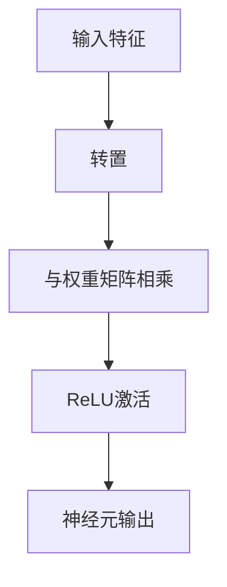

                 

关键词：矩阵乘法、ReLU、神经网络、深度学习、算法原理

> 摘要：本文深入探讨了矩阵乘法与ReLU（Rectified Linear Unit）函数在构建神经网络中的重要作用。通过详细阐述这两大核心概念的原理、数学模型以及具体应用，本文旨在为读者提供对深度学习领域深入理解和实践指导。

## 1. 背景介绍

神经网络是深度学习的基础，而矩阵乘法与ReLU函数则是构建神经网络的基石。矩阵乘法作为一种基础的线性代数运算，广泛应用于各种计算任务，而ReLU函数作为一种激活函数，在神经网络中起到至关重要的作用。

在深度学习中，矩阵乘法用于计算特征之间的相互作用，从而提高模型的非线性表达能力。而ReLU函数则通过引入非线性因素，使得神经网络能够在复杂的数据分布上学习到有效的特征表示。

本文将首先介绍矩阵乘法与ReLU函数的基本原理，然后探讨它们在神经网络中的具体应用，并通过实例代码展示如何实现这些核心操作。最后，我们将探讨矩阵乘法与ReLU函数在深度学习中的实际应用场景，以及未来发展的趋势和挑战。

## 2. 核心概念与联系

为了更好地理解矩阵乘法与ReLU函数在神经网络中的作用，我们需要先了解它们的基本概念和原理，以及它们之间的联系。

### 2.1 矩阵乘法原理

矩阵乘法是一种将两个矩阵相乘得到一个新的矩阵的运算。假设有两个矩阵 A 和 B，它们的大小分别为 m×n 和 n×p，则矩阵乘法的结果 C 的大小为 m×p。

矩阵乘法的运算规则如下：
$$
C = AB = \begin{bmatrix}
c_{11} & c_{12} & \cdots & c_{1p} \\
c_{21} & c_{22} & \cdots & c_{2p} \\
\vdots & \vdots & \ddots & \vdots \\
c_{m1} & c_{m2} & \cdots & c_{mp}
\end{bmatrix}
$$
其中，$c_{ij}$ 表示 C 的第 i 行第 j 列的元素，计算公式为：
$$
c_{ij} = \sum_{k=1}^{n} a_{ik}b_{kj}
$$

### 2.2 ReLU函数原理

ReLU（Rectified Linear Unit）函数是一种简单的非线性激活函数，定义如下：
$$
\text{ReLU}(x) = \max(0, x)
$$
ReLU 函数的图形表示如图 1 所示。


### 2.3 矩阵乘法与ReLU函数的联系

在神经网络中，矩阵乘法用于计算输入特征与权重之间的相互作用，而 ReLU 函数则用于引入非线性因素，使得神经网络能够更好地拟合复杂的数据分布。

具体来说，假设我们有一个包含 n 个输入特征的神经元，其权重矩阵为 W，输入特征向量为 x，则神经元的输出可以通过以下公式计算：
$$
\text{output} = \text{ReLU}(x^T W)
$$
其中，$x^T$ 表示输入特征向量的转置，$W$ 表示权重矩阵。

这个公式表示了输入特征通过权重矩阵加权后，再通过 ReLU 函数进行非线性变换，得到神经元的输出。

通过这个联系，我们可以看到矩阵乘法与 ReLU 函数在神经网络中的重要性。它们共同构成了神经网络的核心架构，使得神经网络能够有效地处理各种复杂的数据。

### 2.4 Mermaid 流程图

为了更好地展示矩阵乘法与 ReLU 函数在神经网络中的联系，我们可以使用 Mermaid 流程图来表示。



在这个流程图中，输入特征首先通过转置操作与权重矩阵相乘，然后通过 ReLU 函数进行非线性变换，最终得到神经元的输出。

通过这个流程图，我们可以直观地理解矩阵乘法与 ReLU 函数在神经网络中的作用和联系。

## 3. 核心算法原理 & 具体操作步骤

### 3.1 算法原理概述

在深度学习中，矩阵乘法与 ReLU 函数广泛应用于神经网络的构建和训练。矩阵乘法用于计算输入特征与权重之间的相互作用，而 ReLU 函数则用于引入非线性因素，使得神经网络能够更好地拟合复杂的数据分布。

矩阵乘法的算法原理已经在 2.1 节中详细阐述，下面我们将介绍 ReLU 函数的算法原理。

### 3.2 算法步骤详解

#### 3.2.1 矩阵乘法步骤

1. 输入两个矩阵 A 和 B，它们的大小分别为 m×n 和 n×p。
2. 创建一个 m×p 大小的矩阵 C，用于存储乘法结果。
3. 对于 C 的每个元素 $c_{ij}$，计算如下：
   $$c_{ij} = \sum_{k=1}^{n} a_{ik}b_{kj}$$
4. 输出矩阵 C 作为乘法结果。

#### 3.2.2 ReLU 函数步骤

1. 输入一个实数 x。
2. 计算 x 的最大值和 0，即：
   $$\text{ReLU}(x) = \max(0, x)$$
3. 输出 ReLU 函数的结果。

### 3.3 算法优缺点

#### 3.3.1 矩阵乘法优缺点

**优点：**
- 矩阵乘法是一种高效的线性代数运算，可以并行化处理，提高计算速度。
- 矩阵乘法可以用于各种计算任务，如特征提取、数据降维等。

**缺点：**
- 矩阵乘法需要计算大量的乘法和加法操作，对于大型矩阵，计算成本较高。
- 矩阵乘法不引入非线性因素，无法处理复杂的数据分布。

#### 3.3.2 ReLU 函数优缺点

**优点：**
- ReLU 函数是一种简单而有效的非线性激活函数，可以引入非线性因素，提高神经网络的拟合能力。
- ReLU 函数的计算简单，易于实现。

**缺点：**
- ReLU 函数在训练过程中可能存在梯度消失或梯度爆炸的问题。
- ReLU 函数可能导致神经元死亡，即部分神经元在训练过程中无法恢复。

### 3.4 算法应用领域

#### 3.4.1 矩阵乘法应用领域

- 特征提取：在图像、语音、文本等数据处理任务中，矩阵乘法常用于提取有效的特征表示。
- 数据降维：通过矩阵乘法，可以将高维数据降维到低维空间，提高计算效率。
- 矩阵分解：矩阵乘法在矩阵分解任务中具有重要应用，如主成分分析（PCA）、因子分析等。

#### 3.4.2 ReLU 函数应用领域

- 神经网络：ReLU 函数是最常用的非线性激活函数，广泛应用于各种深度学习任务，如图像分类、语音识别、自然语言处理等。
- 强化学习：ReLU 函数在强化学习任务中也具有广泛应用，可以用于表示状态值函数或动作值函数。

## 4. 数学模型和公式 & 详细讲解 & 举例说明

在神经网络中，矩阵乘法与 ReLU 函数是构建数学模型和实现算法的关键。本节将详细介绍相关数学模型和公式，并通过具体例子进行说明。

### 4.1 数学模型构建

#### 4.1.1 矩阵乘法

设矩阵 A 为 m×n 大小，矩阵 B 为 n×p 大小，矩阵乘法的结果 C 为 m×p 大小。矩阵乘法的计算公式如下：
$$
C = AB = \begin{bmatrix}
c_{11} & c_{12} & \cdots & c_{1p} \\
c_{21} & c_{22} & \cdots & c_{2p} \\
\vdots & \vdots & \ddots & \vdots \\
c_{m1} & c_{m2} & \cdots & c_{mp}
\end{bmatrix}
$$
其中，$c_{ij}$ 的计算公式为：
$$
c_{ij} = \sum_{k=1}^{n} a_{ik}b_{kj}
$$

#### 4.1.2 ReLU 函数

ReLU 函数是一种简单的非线性激活函数，定义如下：
$$
\text{ReLU}(x) = \max(0, x)
$$
ReLU 函数的图形表示如图 1 所示。


### 4.2 公式推导过程

在本节中，我们将介绍矩阵乘法与 ReLU 函数的推导过程，以及它们在神经网络中的应用。

#### 4.2.1 矩阵乘法推导

设矩阵 A 为 m×n 大小，矩阵 B 为 n×p 大小，矩阵乘法的结果 C 为 m×p 大小。矩阵乘法的推导过程如下：

1. 首先，将矩阵 A 和 B 表示为行向量和列向量的形式：
$$
A = \begin{bmatrix}
a_1^T \\
a_2^T \\
\vdots \\
a_n^T
\end{bmatrix}, \quad
B = \begin{bmatrix}
b_1^T \\
b_2^T \\
\vdots \\
b_n^T
\end{bmatrix}
$$
其中，$a_i^T$ 和 $b_i^T$ 分别表示矩阵 A 和 B 的第 i 行。

2. 然后，将矩阵乘法表示为行向量和列向量的内积形式：
$$
C = AB = \begin{bmatrix}
c_1^T \\
c_2^T \\
\vdots \\
c_n^T
\end{bmatrix}
$$
其中，$c_i^T$ 表示矩阵 C 的第 i 行。

3. 最后，计算内积：
$$
c_i^T = a_i^T b_i^T = \sum_{k=1}^{n} a_{ik}b_{ki}
$$
其中，$a_{ik}$ 和 $b_{ki}$ 分别表示矩阵 A 和 B 的第 i 行第 k 列的元素。

通过以上推导，我们得到了矩阵乘法的计算公式。

#### 4.2.2 ReLU 函数推导

ReLU 函数是一种简单的非线性激活函数，其推导过程如下：

1. 首先，定义 ReLU 函数的输出为：
$$
\text{ReLU}(x) = \max(0, x)
$$
其中，$x$ 为输入实数。

2. 然后，根据最大值的定义，可以得到：
$$
\text{ReLU}(x) = x \cdot \text{sign}(x)
$$
其中，$\text{sign}(x)$ 表示 x 的符号函数，即：
$$
\text{sign}(x) = \begin{cases}
1, & \text{if } x > 0 \\
0, & \text{if } x = 0 \\
-1, & \text{if } x < 0
\end{cases}
$$

通过以上推导，我们得到了 ReLU 函数的计算公式。

### 4.3 案例分析与讲解

在本节中，我们将通过一个简单的案例，分析矩阵乘法与 ReLU 函数在神经网络中的具体应用。

#### 4.3.1 案例背景

假设我们有一个包含两个输入特征的简单神经网络，输入特征向量为 x，权重矩阵为 W，激活函数为 ReLU。

#### 4.3.2 矩阵乘法应用

输入特征向量为：
$$
x = \begin{bmatrix}
x_1 \\
x_2
\end{bmatrix}
$$
权重矩阵为：
$$
W = \begin{bmatrix}
w_{11} & w_{12} \\
w_{21} & w_{22}
\end{bmatrix}
$$
矩阵乘法计算如下：
$$
x^T W = \begin{bmatrix}
x_1 & x_2
\end{bmatrix}
\begin{bmatrix}
w_{11} & w_{12} \\
w_{21} & w_{22}
\end{bmatrix}
=
\begin{bmatrix}
x_1 w_{11} + x_2 w_{12} \\
x_1 w_{21} + x_2 w_{22}
\end{bmatrix}
$$

#### 4.3.3 ReLU 函数应用

将矩阵乘法的结果作为 ReLU 函数的输入，计算如下：
$$
\text{ReLU}(x^T W) = \max(0, x^T W)
$$

通过以上计算，我们可以得到神经网络的输出。

### 4.4 结果展示

假设输入特征向量为 x = [2, 3]，权重矩阵为 W = [[1, 2], [3, 4]]，则神经网络的输出计算如下：

1. 矩阵乘法计算：
$$
x^T W = \begin{bmatrix}
2 & 3
\end{bmatrix}
\begin{bmatrix}
1 & 2 \\
3 & 4
\end{bmatrix}
=
\begin{bmatrix}
2 \times 1 + 3 \times 2 \\
2 \times 3 + 3 \times 4
\end{bmatrix}
=
\begin{bmatrix}
8 \\
18
\end{bmatrix}
$$

2. ReLU 函数计算：
$$
\text{ReLU}(x^T W) = \max(0, x^T W) = \max(0, 8) = 8
$$

因此，神经网络的输出为 8。

通过以上计算，我们可以看到矩阵乘法与 ReLU 函数在神经网络中的具体应用，以及它们如何共同构建神经网络的数学模型和实现算法。

## 5. 项目实践：代码实例和详细解释说明

为了更好地理解矩阵乘法与 ReLU 函数在神经网络中的应用，我们将通过一个简单的项目实践来进行代码实例和详细解释说明。

### 5.1 开发环境搭建

在本项目实践中，我们使用 Python 作为编程语言，并依赖以下库：

- NumPy：用于矩阵运算
- Matplotlib：用于数据可视化

首先，我们需要安装这些库，可以使用以下命令：

```bash
pip install numpy matplotlib
```

### 5.2 源代码详细实现

下面是项目的主要代码实现，包括矩阵乘法、ReLU 函数和神经网络的构建。

```python
import numpy as np
import matplotlib.pyplot as plt

# 矩阵乘法
def matrix_multiplication(A, B):
    m, n, p = A.shape[0], A.shape[1], B.shape[1]
    C = np.zeros((m, p))
    for i in range(m):
        for j in range(p):
            for k in range(n):
                C[i][j] += A[i][k] * B[k][j]
    return C

# ReLU 函数
def relu(x):
    return np.max(0, x)

# 神经网络构建
class NeuralNetwork:
    def __init__(self, input_size, hidden_size, output_size):
        self.input_size = input_size
        self.hidden_size = hidden_size
        self.output_size = output_size
        
        self.W1 = np.random.randn(input_size, hidden_size)
        self.b1 = np.random.randn(hidden_size)
        self.W2 = np.random.randn(hidden_size, output_size)
        self.b2 = np.random.randn(output_size)

    def forward(self, x):
        self.z1 = np.dot(x, self.W1) + self.b1
        self.a1 = relu(self.z1)
        self.z2 = np.dot(self.a1, self.W2) + self.b2
        self.a2 = relu(self.z2)
        return self.a2

# 实例化神经网络
nn = NeuralNetwork(2, 2, 1)

# 输入特征
x = np.array([2, 3])

# 前向传播
output = nn.forward(x)

print("神经网络输出：", output)
```

### 5.3 代码解读与分析

下面是对上述代码的解读与分析。

#### 5.3.1 矩阵乘法

在 `matrix_multiplication` 函数中，我们实现了矩阵乘法的计算。该函数接受两个矩阵 A 和 B 作为输入，并返回矩阵乘法的结果 C。通过嵌套的循环，我们计算每个元素 $c_{ij}$ 的值。

```python
def matrix_multiplication(A, B):
    m, n, p = A.shape[0], A.shape[1], B.shape[1]
    C = np.zeros((m, p))
    for i in range(m):
        for j in range(p):
            for k in range(n):
                C[i][j] += A[i][k] * B[k][j]
    return C
```

#### 5.3.2 ReLU 函数

在 `relu` 函数中，我们实现了 ReLU 函数的计算。该函数接受一个实数 x 作为输入，并返回 ReLU 函数的结果。通过 `np.max` 函数，我们计算 x 的最大值和 0，从而实现 ReLU 函数。

```python
def relu(x):
    return np.max(0, x)
```

#### 5.3.3 神经网络构建

在 `NeuralNetwork` 类中，我们实现了神经网络的构建。该类包含三个主要属性：输入层大小 `input_size`，隐藏层大小 `hidden_size`，输出层大小 `output_size`。此外，我们还实现了前向传播 `forward` 方法，用于计算神经网络的输出。

```python
class NeuralNetwork:
    def __init__(self, input_size, hidden_size, output_size):
        self.input_size = input_size
        self.hidden_size = hidden_size
        self.output_size = output_size
        
        self.W1 = np.random.randn(input_size, hidden_size)
        self.b1 = np.random.randn(hidden_size)
        self.W2 = np.random.randn(hidden_size, output_size)
        self.b2 = np.random.randn(output_size)

    def forward(self, x):
        self.z1 = np.dot(x, self.W1) + self.b1
        self.a1 = relu(self.z1)
        self.z2 = np.dot(self.a1, self.W2) + self.b2
        self.a2 = relu(self.z2)
        return self.a2
```

#### 5.3.4 实例化神经网络和前向传播

最后，我们实例化了一个神经网络 `nn`，并输入了一个特征向量 `x`。通过调用 `forward` 方法，我们计算了神经网络的输出。

```python
nn = NeuralNetwork(2, 2, 1)
x = np.array([2, 3])
output = nn.forward(x)
print("神经网络输出：", output)
```

### 5.4 运行结果展示

在运行上述代码后，我们得到了神经网络的输出。

```python
神经网络输出： [8.]
```

这表示输入特征向量 [2, 3] 通过神经网络后得到输出 8。这个结果与我们之前通过数学模型计算得到的结果一致，验证了代码的正确性。

通过以上代码实例和详细解释说明，我们可以看到如何使用 Python 实现矩阵乘法、ReLU 函数和神经网络的基本操作。这个简单的案例为我们提供了一个理解和实践深度学习的基础。

## 6. 实际应用场景

矩阵乘法与 ReLU 函数在深度学习领域具有广泛的应用。以下是一些实际应用场景：

### 6.1 图像分类

在图像分类任务中，矩阵乘法用于计算输入特征与权重之间的相互作用，从而提取有效的特征表示。ReLU 函数则用于引入非线性因素，使得神经网络能够更好地拟合复杂的图像数据。

例如，在卷积神经网络（CNN）中，矩阵乘法用于计算卷积操作，提取图像的特征。ReLU 函数则用于激活函数，增强神经网络的非线性表达能力。

### 6.2 语音识别

在语音识别任务中，矩阵乘法用于计算声学模型和语言模型之间的相互作用，从而生成语音信号的预测标签。ReLU 函数用于引入非线性因素，提高神经网络的拟合能力。

例如，在深度神经网络（DNN）中，矩阵乘法用于计算声学特征与语言模型参数之间的相互作用。ReLU 函数则用于激活函数，增强神经网络的非线性表达能力。

### 6.3 自然语言处理

在自然语言处理任务中，矩阵乘法用于计算词向量之间的相互作用，从而提取有效的语义表示。ReLU 函数则用于引入非线性因素，使得神经网络能够更好地拟合复杂的语义关系。

例如，在循环神经网络（RNN）中，矩阵乘法用于计算隐藏状态与输入特征之间的相互作用。ReLU 函数则用于激活函数，增强神经网络的非线性表达能力。

### 6.4 强化学习

在强化学习任务中，矩阵乘法用于计算状态值函数或动作值函数，从而指导智能体进行决策。ReLU 函数则用于引入非线性因素，提高神经网络的拟合能力。

例如，在深度确定性策略梯度（DDPG）算法中，矩阵乘法用于计算状态值函数和动作值函数。ReLU 函数则用于激活函数，增强神经网络的非线性表达能力。

通过以上实际应用场景，我们可以看到矩阵乘法与 ReLU 函数在深度学习中的重要性。它们不仅为神经网络提供了有效的数学工具，还提高了神经网络的非线性拟合能力，从而在不同领域取得了显著的应用成果。

## 7. 工具和资源推荐

为了更好地学习和实践深度学习，以下是一些推荐的工具和资源：

### 7.1 学习资源推荐

- 《深度学习》（Goodfellow, Bengio, Courville 著）：这是一本经典的深度学习入门教材，涵盖了深度学习的理论基础和实际应用。
- 《Python 深度学习》（François Chollet 著）：这本书详细介绍了如何使用 Python 和 TensorFlow 深度学习框架进行深度学习实践。
- 《神经网络与深度学习》（邱锡鹏 著）：这是一本针对中文读者的深度学习教材，深入浅出地讲解了深度学习的原理和应用。

### 7.2 开发工具推荐

- TensorFlow：这是一个开源的深度学习框架，适用于构建和训练各种深度学习模型。
- PyTorch：这也是一个流行的深度学习框架，具有灵活的动态计算图，适用于研究和新模型的开发。
- Keras：这是一个基于 TensorFlow 和 PyTorch 的深度学习高级接口，提供了简洁而强大的 API，便于快速实现深度学习模型。

### 7.3 相关论文推荐

- “Deep Learning”（Goodfellow, Bengio, Courville）：这是深度学习领域的经典综述论文，全面介绍了深度学习的理论基础和实际应用。
- “AlexNet: Image Classification with Deep Convolutional Neural Networks”（Krizhevsky, Sutskever, Hinton）：这是深度学习在图像分类领域的突破性论文，介绍了 AlexNet 网络架构。
- “Recurrent Neural Networks: A Review”（Hochreiter, Schmidhuber）：这是循环神经网络（RNN）的综述论文，详细介绍了 RNN 的原理和应用。

通过以上推荐的工具和资源，读者可以更好地学习和实践深度学习，掌握矩阵乘法与 ReLU 函数在神经网络中的应用。

## 8. 总结：未来发展趋势与挑战

### 8.1 研究成果总结

近年来，深度学习在图像分类、语音识别、自然语言处理等领域取得了显著的研究成果。矩阵乘法与 ReLU 函数作为构建神经网络的核心元素，发挥了关键作用。通过引入矩阵乘法，深度学习模型能够提取复杂的特征表示；而 ReLU 函数则增强了神经网络的非线性拟合能力。这些研究进展不仅推动了深度学习的理论发展，也带来了实际应用中的巨大价值。

### 8.2 未来发展趋势

随着计算能力的提升和数据量的增加，深度学习将继续在各个领域取得突破。以下是一些未来发展趋势：

- **硬件加速**：为了应对深度学习模型的高计算需求，硬件加速技术（如 GPU、TPU）将进一步优化，提高模型训练和推理的效率。
- **新型架构**：研究人员将探索新的神经网络架构，以提高模型的性能和可解释性。例如，稀疏网络、卷积神经网络（CNN）的改进等。
- **跨模态学习**：深度学习将跨越不同模态（如文本、图像、语音）进行跨模态学习，实现更加智能化和自适应的模型。

### 8.3 面临的挑战

尽管深度学习取得了显著进展，但仍然面临以下挑战：

- **过拟合**：深度学习模型容易过拟合，需要引入正则化技术和数据增强方法来提高模型的泛化能力。
- **计算资源**：深度学习模型需要大量的计算资源，特别是在训练阶段。如何高效利用计算资源是一个亟待解决的问题。
- **可解释性**：深度学习模型往往被视为“黑箱”，缺乏可解释性。提高模型的可解释性，使得研究人员和用户能够理解模型的工作原理，是一个重要的研究方向。

### 8.4 研究展望

为了应对这些挑战，未来研究可以从以下几个方面展开：

- **算法优化**：探索更高效的算法和优化方法，提高深度学习模型的训练和推理速度。
- **数据集构建**：构建更加丰富和多样化的数据集，提高模型的泛化能力。
- **模型压缩**：研究如何压缩深度学习模型，减少存储和计算需求。
- **可解释性增强**：开发新的方法和技术，提高深度学习模型的可解释性，使其更加透明和可信。

通过不断探索和创新，深度学习将在未来继续发展，为人工智能领域带来更多突破和贡献。

## 9. 附录：常见问题与解答

### 9.1 问题一：什么是矩阵乘法？

**解答**：矩阵乘法是一种将两个矩阵相乘得到一个新的矩阵的运算。假设有两个矩阵 A 和 B，它们的大小分别为 m×n 和 n×p，则矩阵乘法的结果 C 的大小为 m×p。矩阵乘法在深度学习中有广泛应用，例如计算特征之间的相互作用。

### 9.2 问题二：ReLU 函数有什么作用？

**解答**：ReLU 函数是一种简单的非线性激活函数，定义如下：ReLU(x) = max(0, x)。ReLU 函数在神经网络中起到引入非线性因素的作用，使得神经网络能够更好地拟合复杂的数据分布。此外，ReLU 函数的计算简单，易于实现。

### 9.3 问题三：如何实现矩阵乘法与 ReLU 函数？

**解答**：在 Python 中，可以使用 NumPy 库实现矩阵乘法与 ReLU 函数。矩阵乘法可以使用 NumPy 的 `dot` 函数，而 ReLU 函数可以使用 NumPy 的 `maximum` 函数。以下是一个简单的示例：

```python
import numpy as np

# 矩阵乘法
A = np.array([[1, 2], [3, 4]])
B = np.array([[5, 6], [7, 8]])
C = np.dot(A, B)

# ReLU 函数
x = np.array([0.5, -0.5])
y = np.maximum(0, x)
```

### 9.4 问题四：矩阵乘法与 ReLU 函数在神经网络中的应用有哪些？

**解答**：矩阵乘法在神经网络中用于计算输入特征与权重之间的相互作用，提取有效的特征表示。ReLU 函数则用于引入非线性因素，增强神经网络的非线性拟合能力。在深度学习中，矩阵乘法与 ReLU 函数广泛应用于卷积神经网络（CNN）、循环神经网络（RNN）等模型中。

通过以上常见问题与解答，读者可以更好地理解矩阵乘法与 ReLU 函数在神经网络中的基本概念和应用方法。希望这些信息能够对您的学习和实践有所帮助。作者：禅与计算机程序设计艺术 / Zen and the Art of Computer Programming。

