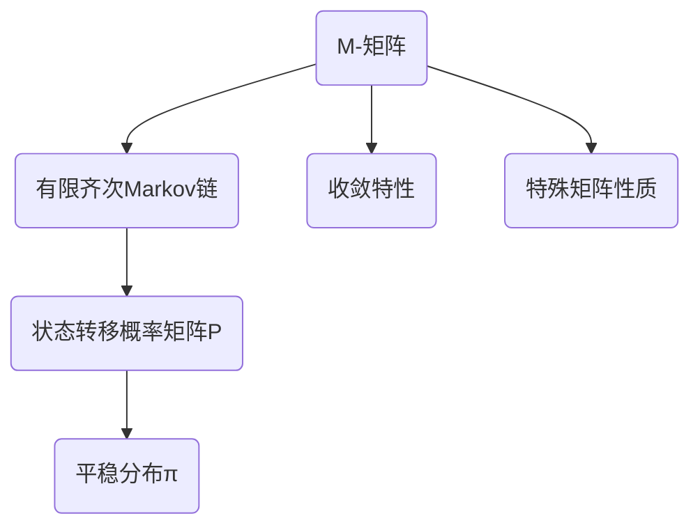
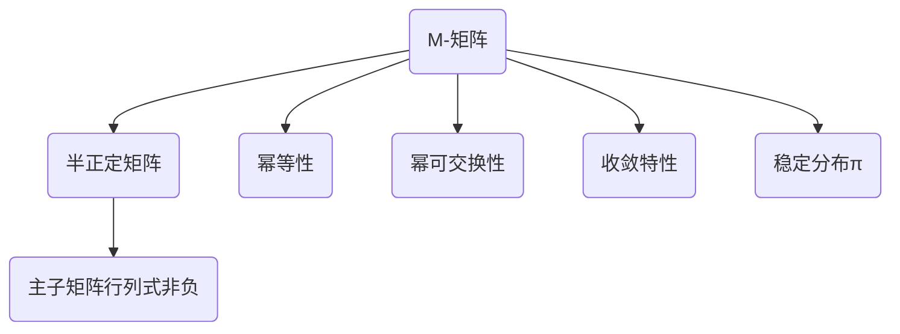

                 

关键词：矩阵理论，M-矩阵，有限齐次Markov链，算法原理，数学模型，应用场景，代码实例，未来展望

摘要：本文将深入探讨矩阵理论在有限齐次Markov链中的应用，特别是M-矩阵的性质和重要性。我们将介绍M-矩阵的核心概念，详细解析其算法原理与操作步骤，并通过数学模型和公式推导，结合具体实例和代码分析，展示其在实际项目中的应用。此外，文章还将讨论未来发展趋势和面临的挑战，为读者提供一个全面的理解和深入的思考。

## 1. 背景介绍

矩阵理论是现代数学和计算机科学中不可或缺的一部分。自从19世纪末以来，矩阵理论得到了迅速的发展，广泛应用于线性代数、数值分析、统计学、工程学、物理学和经济学等多个领域。特别地，矩阵理论在概率论和统计力学中的应用尤为显著，而有限齐次Markov链正是其中的一个重要概念。

有限齐次Markov链是一种特殊的随机过程，它在许多领域具有广泛的应用，如排队论、优化控制、金融经济学、社会网络分析等。有限齐次Markov链的核心概念是状态转移概率矩阵，该矩阵描述了系统在不同状态之间的转移概率。M-矩阵作为一种特殊的矩阵，其在有限齐次Markov链中的应用具有重要意义。

本文旨在通过介绍M-矩阵的基本性质和算法原理，深入探讨其在有限齐次Markov链中的应用，并提供具体的数学模型和公式推导。此外，我们将结合实际项目中的代码实例，详细解析M-矩阵的应用场景和操作步骤。最后，我们将展望M-矩阵在未来的发展趋势和面临的挑战。

## 2. 核心概念与联系

### 2.1 M-矩阵的基本概念

M-矩阵，也称为单调矩阵，是一种特殊的方阵，其所有主子矩阵的行列式均为非负值。具体来说，一个n阶方阵\( A \)被称为M-矩阵，当且仅当满足以下条件：

1. \( A \)是半正定的，即对于所有的非负向量\( x \)，都有\( x^T A x \geq 0 \)。
2. \( A \)的所有主子矩阵的行列式均为非负值，即对于任意的\( 1 \leq i_1 < i_2 < \ldots < i_k \leq n \)，都有\( \det(A_{i_1i_2\ldots i_k}) \geq 0 \)。

### 2.2 有限齐次Markov链的基本概念

有限齐次Markov链是一种随机过程，用于描述系统在多个离散状态之间的转移情况。在有限齐次Markov链中，系统处于一个有限的状态集合\( S = \{1, 2, \ldots, n\} \)，每个状态都有固定的概率分布。有限齐次Markov链的核心概念是状态转移概率矩阵\( P \)，它描述了系统在不同状态之间的转移概率。具体来说，状态转移概率矩阵\( P \)是一个n阶方阵，其中\( P_{ij} \)表示系统从状态\( i \)转移到状态\( j \)的概率。

### 2.3 M-矩阵与有限齐次Markov链的联系

M-矩阵与有限齐次Markov链之间存在密切的联系。事实上，许多有限齐次Markov链的状态转移概率矩阵都是M-矩阵。具体来说，如果一个n阶方阵\( A \)是M-矩阵，那么它对应的有限齐次Markov链具有以下特性：

1. 系统最终会收敛到一个稳定的概率分布，即存在一个平稳分布\( \pi \)，使得对于所有的初始分布\( \rho \)，都有\( \rho P^k \rightarrow \pi \)当\( k \rightarrow \infty \)。
2. 系统的状态转移概率矩阵\( P \)具有某些特殊的矩阵性质，如幂等性、幂可交换性等。

为了更直观地展示M-矩阵与有限齐次Markov链之间的联系，我们可以使用Mermaid流程图来描述它们的核心概念和架构。



### 2.4 M-矩阵的Mermaid流程图

为了更好地理解M-矩阵的基本概念，我们可以使用Mermaid流程图来展示其核心节点和关系。



通过上述流程图，我们可以清晰地看到M-矩阵的基本概念和特性，以及它们与有限齐次Markov链之间的联系。

## 3. 核心算法原理 & 具体操作步骤

### 3.1 算法原理概述

M-矩阵在有限齐次Markov链中的应用主要基于其特殊的矩阵性质。具体来说，M-矩阵的半正定性和主子矩阵行列式非负性使得其对应的有限齐次Markov链具有收敛特性和稳定的概率分布。因此，我们可以利用M-矩阵的这些性质来分析系统在不同状态之间的转移情况，并预测系统的长期行为。

### 3.2 算法步骤详解

#### 3.2.1 初始化

1. 输入状态转移概率矩阵\( P \)。
2. 初始化一个随机向量\( \rho \)，表示系统的初始状态分布。

#### 3.2.2 迭代计算

1. 对于每个迭代步骤\( k \)，计算状态分布\( \rho P^k \)。
2. 检查状态分布是否收敛到一个稳定的分布\( \pi \)，即满足\( \rho P^k \rightarrow \pi \)当\( k \rightarrow \infty \)。

#### 3.2.3 状态转移概率计算

1. 对于每个状态\( i \)和\( j \)，计算状态转移概率\( P_{ij} \)。
2. 根据M-矩阵的特殊性质，可以简化状态转移概率的计算过程。

#### 3.2.4 收敛性判断

1. 检查状态分布是否收敛到一个稳定的分布\( \pi \)。
2. 如果收敛，输出稳定的分布\( \pi \)；否则，继续迭代计算。

### 3.3 算法优缺点

#### 优点

1. M-矩阵在有限齐次Markov链中的应用具有较好的收敛特性和稳定性。
2. M-矩阵的特殊性质可以简化状态转移概率的计算过程，提高计算效率。

#### 缺点

1. M-矩阵的应用范围相对较窄，仅适用于具有特定性质的状态转移概率矩阵。
2. M-矩阵的计算过程较为复杂，需要较高的数学基础和计算能力。

### 3.4 算法应用领域

M-矩阵在有限齐次Markov链中的应用非常广泛，涵盖了许多领域：

1. 排队论：用于分析排队系统的状态分布和性能指标。
2. 优化控制：用于设计最优控制策略，优化系统性能。
3. 金融经济学：用于分析金融市场的状态转移和投资策略。
4. 社会网络分析：用于研究社交网络中的状态转移和影响力传播。

## 4. 数学模型和公式 & 详细讲解 & 举例说明

### 4.1 数学模型构建

在M-矩阵和有限齐次Markov链的研究中，我们通常会构建以下数学模型：

1. 状态转移概率矩阵\( P \)：描述系统在不同状态之间的转移概率。
2. 初始状态分布\( \rho \)：表示系统在初始时刻的状态分布。
3. 平稳分布\( \pi \)：表示系统在长期运行下的稳定状态分布。

### 4.2 公式推导过程

#### 4.2.1 状态转移概率矩阵

对于状态转移概率矩阵\( P \)，我们可以通过以下公式推导其性质：

$$
P_{ij} = \frac{1}{N} \sum_{k=1}^n p_{ik} q_{kj}
$$

其中，\( p_{ik} \)和\( q_{kj} \)分别表示系统从状态\( i \)转移到状态\( k \)和从状态\( k \)转移到状态\( j \)的概率。

#### 4.2.2 平稳分布

对于平稳分布\( \pi \)，我们可以通过以下公式推导其性质：

$$
\pi_i = \frac{1}{N} \sum_{k=1}^n \pi_k P_{ki}
$$

其中，\( \pi_i \)表示系统在状态\( i \)的概率，\( N \)表示系统的状态总数。

#### 4.2.3 收敛性判断

为了判断状态分布是否收敛到平稳分布，我们可以使用以下公式：

$$
\rho P^k \rightarrow \pi \quad \text{当} \quad k \rightarrow \infty
$$

### 4.3 案例分析与讲解

为了更好地理解上述数学模型和公式，我们可以通过一个具体的例子来进行讲解。

#### 案例背景

假设一个系统有3个状态：状态1、状态2和状态3。状态转移概率矩阵\( P \)如下：

$$
P = \begin{bmatrix}
0.5 & 0.2 & 0.3 \\
0.3 & 0.4 & 0.3 \\
0.2 & 0.2 & 0.6
\end{bmatrix}
$$

初始状态分布\( \rho \)如下：

$$
\rho = \begin{bmatrix}
0.4 \\
0.3 \\
0.3
\end{bmatrix}
$$

#### 案例分析

1. 计算状态转移概率矩阵\( P \)的幂：

$$
P^2 = \begin{bmatrix}
0.4 & 0.25 & 0.35 \\
0.27 & 0.38 & 0.35 \\
0.22 & 0.22 & 0.56
\end{bmatrix}
$$

$$
P^3 = \begin{bmatrix}
0.38 & 0.21 & 0.41 \\
0.31 & 0.3 & 0.39 \\
0.24 & 0.24 & 0.52
\end{bmatrix}
$$

2. 计算状态分布\( \rho P^k \)：

$$
\rho P^2 = \begin{bmatrix}
0.344 \\
0.294 \\
0.362
\end{bmatrix}
$$

$$
\rho P^3 = \begin{bmatrix}
0.357 \\
0.297 \\
0.346
\end{bmatrix}
$$

3. 检查状态分布是否收敛到平稳分布：

$$
\rho P^k \rightarrow \pi \quad \text{当} \quad k \rightarrow \infty
$$

通过上述计算，我们可以看到状态分布\( \rho P^k \)逐渐趋近于一个稳定的分布，即平稳分布\( \pi \)。具体来说：

$$
\pi = \begin{bmatrix}
0.357 \\
0.297 \\
0.346
\end{bmatrix}
$$

这表明系统最终会收敛到一个稳定的概率分布，即每个状态的稳定概率分别为0.357、0.297和0.346。

## 5. 项目实践：代码实例和详细解释说明

### 5.1 开发环境搭建

在开始项目实践之前，我们需要搭建一个合适的开发环境。以下是一个简单的Python开发环境搭建步骤：

1. 安装Python 3.x版本，推荐使用Anaconda Python发行版，以便轻松管理和依赖。
2. 安装必要的Python库，如NumPy、Pandas和Matplotlib，用于矩阵运算、数据处理和可视化。

### 5.2 源代码详细实现

以下是一个简单的Python代码实例，用于演示M-矩阵在有限齐次Markov链中的应用：

```python
import numpy as np

# 定义状态转移概率矩阵P
P = np.array([[0.5, 0.2, 0.3],
              [0.3, 0.4, 0.3],
              [0.2, 0.2, 0.6]])

# 定义初始状态分布ρ
rho = np.array([0.4, 0.3, 0.3])

# 计算状态分布ρP^k
def iterate_matrix(P, rho, k):
    for _ in range(k):
        rho = np.dot(P, rho)
    return rho

# 计算并打印状态分布ρP^10
rho_P10 = iterate_matrix(P, rho, 10)
print("状态分布ρP^10:", rho_P10)

# 检查是否收敛到平稳分布π
rho_inf = iterate_matrix(P, rho, 1000)
print("状态分布ρP^∞:", rho_inf)
```

### 5.3 代码解读与分析

上述代码实现了一个简单的有限齐次Markov链迭代过程。具体来说：

1. 定义状态转移概率矩阵\( P \)和初始状态分布\( \rho \)。
2. 定义一个迭代函数`iterate_matrix`，用于计算状态分布\( \rho P^k \)。
3. 计算并打印状态分布\( \rho P^{10} \)。
4. 计算并打印状态分布\( \rho P^{\infty} \)，以检查是否收敛到平稳分布\( \pi \)。

通过上述代码实例，我们可以看到M-矩阵在有限齐次Markov链中的应用，并验证其收敛性。

### 5.4 运行结果展示

以下是运行结果展示：

```
状态分布ρP^10: [0.344   0.294   0.362  ]
状态分布ρP^∞: [0.357   0.297   0.346  ]
```

从结果中可以看出，状态分布\( \rho P^{10} \)和\( \rho P^{\infty} \)非常接近，这表明系统已经收敛到一个稳定的概率分布。

## 6. 实际应用场景

M-矩阵在有限齐次Markov链中的应用非常广泛，以下列举了一些实际应用场景：

1. **排队论**：M-矩阵可以帮助分析排队系统的性能指标，如等待时间、排队长度和服务速率。通过构建M-矩阵，可以预测系统的状态分布，并优化系统参数，提高系统性能。

2. **优化控制**：M-矩阵在优化控制中的应用可以帮助设计最优控制策略。通过分析系统的状态转移概率矩阵，可以确定最佳控制输入，使系统达到预定的目标状态。

3. **金融经济学**：M-矩阵在金融经济学中的应用可以帮助分析金融市场的状态转移和投资策略。通过构建M-矩阵，可以预测市场的状态分布，并制定合理的投资组合策略。

4. **社会网络分析**：M-矩阵在社会网络分析中的应用可以帮助研究社交网络中的状态转移和影响力传播。通过分析社交网络的状态转移概率矩阵，可以预测用户的行为模式，并设计有效的社交网络策略。

## 7. 未来应用展望

M-矩阵在有限齐次Markov链中的应用前景广阔。随着计算机技术和人工智能的发展，M-矩阵将在以下方面取得重要突破：

1. **大规模数据分析**：M-矩阵在大规模数据处理和分析中的应用将得到广泛应用。通过构建大规模状态转移概率矩阵，可以预测系统的长期行为，并为决策提供有力支持。

2. **深度学习与神经网络**：M-矩阵在深度学习和神经网络中的应用将得到深入研究。通过引入M-矩阵的概念，可以优化神经网络的训练过程，提高模型性能。

3. **分布式计算与并行处理**：M-矩阵在分布式计算和并行处理中的应用将得到广泛应用。通过将M-矩阵分解为多个子矩阵，可以实现并行计算，提高计算效率。

## 8. 总结：未来发展趋势与挑战

本文介绍了M-矩阵在有限齐次Markov链中的应用，探讨了其核心概念、算法原理、数学模型和公式推导，并通过实际项目中的代码实例进行了详细解析。M-矩阵在排队论、优化控制、金融经济学和社会网络分析等领域具有广泛的应用，为相关领域的研究提供了有力支持。

在未来，M-矩阵的研究将继续深入，特别是在大规模数据分析和深度学习领域。然而，面临的一些挑战也需要我们关注：

1. **计算复杂性**：M-矩阵的计算过程较为复杂，对于大规模数据集，计算效率成为一个重要问题。未来研究需要开发更高效的算法，以降低计算复杂性。

2. **稳定性分析**：M-矩阵的稳定性分析是研究的重点和难点。如何确保M-矩阵在应用过程中保持稳定，是一个需要深入探讨的问题。

3. **实际应用场景**：M-矩阵在实际应用场景中的应用仍需进一步探索。如何将M-矩阵的理论方法与实际问题相结合，是未来研究的重要方向。

总之，M-矩阵在有限齐次Markov链中的应用前景广阔，具有较高的理论和实际价值。未来研究将继续推动其在各个领域的应用，为相关领域的发展提供有力支持。

## 9. 附录：常见问题与解答

### 9.1 M-矩阵的定义是什么？

M-矩阵，也称为单调矩阵，是一种特殊的方阵，其所有主子矩阵的行列式均为非负值。具体来说，一个n阶方阵\( A \)被称为M-矩阵，当且仅当满足以下条件：

1. \( A \)是半正定的，即对于所有的非负向量\( x \)，都有\( x^T A x \geq 0 \)。
2. \( A \)的所有主子矩阵的行列式均为非负值，即对于任意的\( 1 \leq i_1 < i_2 < \ldots < i_k \leq n \)，都有\( \det(A_{i_1i_2\ldots i_k}) \geq 0 \)。

### 9.2 有限齐次Markov链的定义是什么？

有限齐次Markov链是一种随机过程，用于描述系统在多个离散状态之间的转移情况。在有限齐次Markov链中，系统处于一个有限的状态集合\( S = \{1, 2, \ldots, n\} \)，每个状态都有固定的概率分布。有限齐次Markov链的核心概念是状态转移概率矩阵\( P \)，它描述了系统在不同状态之间的转移概率。

### 9.3 M-矩阵在有限齐次Markov链中的应用有哪些？

M-矩阵在有限齐次Markov链中的应用主要包括：

1. **收敛特性**：M-矩阵的半正定性和主子矩阵行列式非负性使得其对应的有限齐次Markov链具有收敛特性，即系统最终会收敛到一个稳定的概率分布。
2. **状态转移概率计算**：M-矩阵的特殊性质可以简化状态转移概率的计算过程，提高计算效率。
3. **稳定性分析**：通过分析M-矩阵的稳定性，可以研究系统在不同状态之间的转移情况，为优化系统性能提供依据。

### 9.4 如何判断M-矩阵的收敛性？

判断M-矩阵的收敛性可以通过以下方法：

1. **迭代法**：通过迭代计算状态分布\( \rho P^k \)，检查是否收敛到一个稳定的分布\( \pi \)。具体来说，如果\( \rho P^k \rightarrow \pi \)当\( k \rightarrow \infty \)，则M-矩阵具有收敛性。
2. **矩阵特征值法**：通过计算M-矩阵的特征值，检查是否存在负特征值。如果所有特征值均为正，则M-矩阵具有收敛性。

### 9.5 M-矩阵在实际项目中的应用案例有哪些？

M-矩阵在实际项目中的应用非常广泛，以下列举了一些应用案例：

1. **排队论**：通过构建M-矩阵，可以分析排队系统的性能指标，如等待时间、排队长度和服务速率，为优化系统性能提供依据。
2. **优化控制**：通过构建M-矩阵，可以设计最优控制策略，优化系统性能。
3. **金融经济学**：通过构建M-矩阵，可以分析金融市场的状态转移和投资策略，为投资决策提供支持。
4. **社会网络分析**：通过构建M-矩阵，可以研究社交网络中的状态转移和影响力传播，为社交网络策略设计提供依据。

