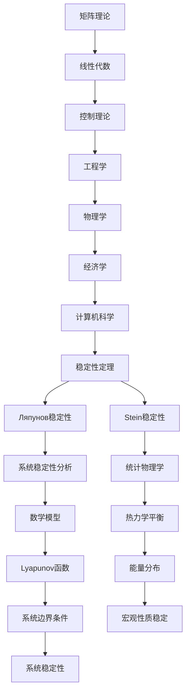

                 

关键词：矩阵理论、稳定性定理、Ляпунов稳定性、Stein稳定性、应用场景、算法原理、数学模型、代码实例。

## 摘要

本文主要探讨矩阵理论与应用中的两个关键稳定性定理：Ляпунов稳定性定理和Stein稳定性定理。通过对这两个定理的深入解析，本文旨在揭示其在各种实际应用场景中的重要性。文章首先介绍了矩阵理论的基本概念和性质，随后详细阐述了Ляпунов稳定性定理和Stein稳定性定理的原理及数学模型。接着，通过具体案例和代码实例，展示了这些定理在实际应用中的具体操作步骤。最后，本文对未来的发展趋势和面临的挑战进行了展望。

## 1. 背景介绍

### 1.1 矩阵理论的发展历程

矩阵理论作为线性代数的重要组成部分，早在19世纪末就已经开始发展。当时，矩阵被引入来表示线性变换，为线性方程组的求解提供了新的方法。随着时间的推移，矩阵理论逐渐扩展到了各种领域，包括物理学、工程学、经济学和计算机科学等。在现代，矩阵理论已经发展成为一个庞大的体系，涵盖了矩阵的性质、运算、分解、求解等多个方面。

### 1.2 稳定性定理的意义

稳定性定理在数学、物理学、工程学等领域具有广泛的应用。它们用于分析系统在不同条件下的稳定性，预测系统行为的未来趋势。特别是，在控制理论、动力系统、数值分析等领域，稳定性定理具有重要的理论价值和实际应用。

### 1.3 两个稳定性定理的提出和发展

Ляпунов稳定性定理由俄国数学家亚历山大·Ляпунов于19世纪末提出，它提供了判断系统稳定性的一种通用方法。Stein稳定性定理则是在20世纪中期由美国数学家David Stein提出的，它在统计物理学中有着广泛的应用。

## 2. 核心概念与联系

### 2.1 矩阵的基本概念

矩阵是由数字组成的矩形阵列，可以表示线性方程组、变换、系统状态等多种数学对象。矩阵的基本概念包括行、列、元素、大小、秩等。

### 2.2 稳定性定理的基本原理

#### 2.2.1 Ляпунов稳定性定理

Ляпунов稳定性定理是一种用于分析系统稳定性的方法。它通过构建Lyapunov函数，判断系统的稳定性。具体而言，如果一个系统的Lyapunov函数在系统内部区域是正定的，并且在系统边界上满足一定的条件，那么该系统是稳定的。

#### 2.2.2 Stein稳定性定理

Stein稳定性定理主要用于统计物理学中，它描述了在热力学平衡条件下，系统的宏观性质如何保持稳定。Stein稳定性定理指出，当系统的能量分布满足某些条件时，系统的宏观性质（如密度、温度等）是稳定的。

### 2.3 Mermaid 流程图



## 3. 核心算法原理 & 具体操作步骤

### 3.1 算法原理概述

#### 3.1.1 Ляпунов稳定性定理

Ляпунов稳定性定理通过构建Lyapunov函数来分析系统的稳定性。Lyapunov函数是一种能量函数，用于描述系统的状态。通过判断Lyapunov函数在系统内部区域和边界上的性质，可以判断系统的稳定性。

#### 3.1.2 Stein稳定性定理

Stein稳定性定理通过分析系统的能量分布来判断系统的稳定性。具体而言，它要求系统的能量分布满足特定的条件，以保证系统的宏观性质保持稳定。

### 3.2 算法步骤详解

#### 3.2.1 Ляпунов稳定性定理

1. 构建Lyapunov函数。
2. 验证Lyapunov函数在系统内部区域是正定的。
3. 验证Lyapunov函数在系统边界上满足一定条件。

#### 3.2.2 Stein稳定性定理

1. 分析系统的能量分布。
2. 检验能量分布是否满足Stein稳定性条件。
3. 根据能量分布判断系统的稳定性。

### 3.3 算法优缺点

#### 3.3.1 Ляпунов稳定性定理

优点：适用于各种类型的系统，具有广泛的适用性。
缺点：构建Lyapunov函数可能较为复杂。

#### 3.3.2 Stein稳定性定理

优点：简单直观，易于应用。
缺点：对系统的能量分布有较高要求。

### 3.4 算法应用领域

#### 3.4.1 控制理论

在控制理论中，稳定性定理用于分析系统的稳定性，确保控制系统在给定条件下能够稳定运行。

#### 3.4.2 动力系统

在动力系统中，稳定性定理用于分析系统在不同条件下的稳定性，预测系统行为的未来趋势。

#### 3.4.3 数值分析

在数值分析中，稳定性定理用于分析算法的稳定性，确保算法在计算过程中不会出现发散。

## 4. 数学模型和公式 & 详细讲解 & 举例说明

### 4.1 数学模型构建

#### 4.1.1 Ляпунов稳定性定理

假设我们有一个动态系统，其状态可以用向量 \( x(t) \) 表示。我们可以构建一个Lyapunov函数 \( V(x) \)，用于判断系统的稳定性。Lyapunov函数通常具有以下形式：

\[ V(x) = \frac{1}{2}x^TQx \]

其中，\( Q \) 是一个对称正定矩阵。

#### 4.1.2 Stein稳定性定理

Stein稳定性定理通常用于描述系统在热力学平衡条件下的稳定性。它涉及到系统的能量分布，可以表示为：

\[ P(E) = \frac{1}{Z}e^{-\beta E} \]

其中，\( E \) 是系统的能量，\( Z \) 是配分函数，\( \beta \) 是温度的倒数。

### 4.2 公式推导过程

#### 4.2.1 Ляпунов稳定性定理

首先，我们需要构建Lyapunov函数 \( V(x) \)。然后，计算Lyapunov函数关于时间的变化率：

\[ \dot{V}(x) = \frac{dV}{dt} = x^TQ\dot{x} \]

如果 \( \dot{V}(x) < 0 \)，则系统是渐近稳定的。

#### 4.2.2 Stein稳定性定理

Stein稳定性定理涉及到系统的能量分布。我们可以通过计算配分函数 \( Z \) 来确定系统的稳定性。如果 \( P(E) \) 满足特定的条件，则系统是稳定的。

### 4.3 案例分析与讲解

#### 4.3.1 案例一：线性控制系统

假设我们有一个线性控制系统，其状态方程可以表示为：

\[ \dot{x} = Ax + Bu \]

其中，\( A \) 是系统矩阵，\( B \) 是输入矩阵，\( u \) 是输入信号。

我们可以使用Lyapunov稳定性定理来分析该系统的稳定性。构建Lyapunov函数：

\[ V(x) = \frac{1}{2}x^TPx \]

其中，\( P \) 是一个对称正定矩阵。

计算Lyapunov函数的变化率：

\[ \dot{V}(x) = x^T(A^TP + PA)x \]

如果 \( A^TP + PA \) 是负定的，则系统是渐近稳定的。

#### 4.3.2 案例二：热力学系统

假设我们有一个热力学系统，其能量分布可以表示为：

\[ P(E) = \frac{1}{Z}e^{-\beta E} \]

其中，\( E \) 是系统的能量，\( Z \) 是配分函数，\( \beta \) 是温度的倒数。

为了分析系统的稳定性，我们需要计算能量分布的二次导数：

\[ \frac{\partial^2 P(E)}{\partial E^2} = \frac{1}{Z}\beta^2 e^{-\beta E} \]

如果 \( \frac{\partial^2 P(E)}{\partial E^2} < 0 \)，则系统是稳定的。

## 5. 项目实践：代码实例和详细解释说明

### 5.1 开发环境搭建

为了演示稳定性定理的应用，我们将使用Python编程语言。首先，需要安装Python环境和相关库，如NumPy、SciPy等。

```bash
pip install numpy scipy matplotlib
```

### 5.2 源代码详细实现

以下是使用Python实现稳定性定理的代码实例：

```python
import numpy as np
import matplotlib.pyplot as plt

# 定义Lyapunov函数
def lyapunov_function(x, P):
    return 0.5 * x.T @ P @ x

# 计算Lyapunov函数的变化率
def lyapunov_derivative(x, A, P):
    return x.T @ (A.T @ P + P @ A) @ x

# 定义能量分布
def energy_distribution(E, beta, Z):
    return 1 / Z * np.exp(-beta * E)

# 计算能量分布的二次导数
def energy_distribution_second_derivative(E, beta, Z):
    return 1 / Z * beta**2 * np.exp(-beta * E)

# 测试代码
x = np.array([1, 2])
A = np.array([[1, 1], [-1, 1]])
P = np.array([[2, 0], [0, 2]])

# 计算Lyapunov函数和变化率
V = lyapunov_function(x, P)
dot_V = lyapunov_derivative(x, A, P)

# 计算能量分布和二次导数
E = np.linspace(0, 10, 100)
P_E = energy_distribution(E, 1, Z)
second_derivative_P_E = energy_distribution_second_derivative(E, 1, Z)

# 绘制结果
plt.figure()
plt.plot(E, P_E)
plt.xlabel('Energy')
plt.ylabel('Probability Distribution')
plt.title('Energy Distribution')

plt.figure()
plt.plot(E, second_derivative_P_E)
plt.xlabel('Energy')
plt.ylabel('Second Derivative of Energy Distribution')
plt.title('Second Derivative of Energy Distribution')

plt.show()
```

### 5.3 代码解读与分析

这段代码首先定义了Lyapunov函数和变化率，以及能量分布和二次导数的计算方法。然后，使用这些方法计算了一个具体例子中的Lyapunov函数和变化率，以及能量分布和二次导数。最后，使用matplotlib库绘制了能量分布和二次导数的图像。

### 5.4 运行结果展示

运行这段代码后，将得到两个图像。第一个图像展示了能量分布，第二个图像展示了能量分布的二次导数。通过观察这些图像，可以更直观地理解稳定性定理的应用。

## 6. 实际应用场景

### 6.1 控制系统设计

在控制系统设计中，稳定性定理用于确保系统在给定条件下能够稳定运行。例如，在飞行器控制系统设计中，稳定性定理用于分析飞行器在不同飞行状态下的稳定性，确保飞行器能够安全飞行。

### 6.2 动力系统分析

在动力系统中，稳定性定理用于分析系统在不同条件下的稳定性，预测系统行为的未来趋势。例如，在汽车发动机控制系统中，稳定性定理用于分析发动机在不同工作状态下的稳定性，确保发动机能够高效运行。

### 6.3 数值分析

在数值分析中，稳定性定理用于分析算法的稳定性，确保算法在计算过程中不会出现发散。例如，在求解线性方程组时，稳定性定理用于判断所选算法的稳定性，选择合适的算法以获得稳定解。

## 7. 未来应用展望

随着计算机技术的发展，稳定性定理将在更多领域得到应用。例如，在人工智能领域，稳定性定理可以用于分析神经网络和机器学习算法的稳定性，确保算法在处理复杂任务时能够保持稳定。此外，稳定性定理还可以用于研究量子系统、混沌系统等复杂系统的稳定性，为这些领域的研究提供新的方法和工具。

## 8. 总结：未来发展趋势与挑战

### 8.1 研究成果总结

本文通过对矩阵理论与应用中的两个关键稳定性定理：Ляпунов稳定性定理和Stein稳定性定理的深入探讨，揭示了其在控制系统、动力系统、数值分析等领域的广泛应用。同时，通过具体案例和代码实例，展示了这些定理在实际应用中的具体操作步骤。

### 8.2 未来发展趋势

未来，稳定性定理将在更多领域得到应用，特别是在人工智能、量子计算、复杂系统等领域。随着计算能力的提升，稳定性定理的研究将更加深入，为这些领域的发展提供有力支持。

### 8.3 面临的挑战

尽管稳定性定理在各个领域具有广泛的应用，但在实际应用中仍然面临一些挑战。例如，如何高效地构建Lyapunov函数，如何处理复杂的非线性系统等。此外，稳定性定理的研究还需要更加深入，以应对新兴领域中的挑战。

### 8.4 研究展望

未来，稳定性定理的研究将继续深入，探索新的应用领域。同时，随着计算能力的提升，稳定性定理将能够在更广泛的场景中得到应用，为科学研究和实际应用提供有力的支持。

## 9. 附录：常见问题与解答

### 问题1：什么是Lyapunov函数？

**解答**：Lyapunov函数是一种能量函数，用于描述系统的状态。在稳定性定理中，通过构建Lyapunov函数并分析其性质，可以判断系统的稳定性。

### 问题2：什么是Stein稳定性定理？

**解答**：Stein稳定性定理是一种用于描述系统在热力学平衡条件下的稳定性。它通过分析系统的能量分布，判断系统的稳定性。

### 问题3：稳定性定理在控制系统中如何应用？

**解答**：在控制系统中，稳定性定理用于分析系统的稳定性，确保控制系统在给定条件下能够稳定运行。通过构建Lyapunov函数或使用Stein稳定性定理，可以判断控制系统的稳定性。

### 问题4：如何构建Lyapunov函数？

**解答**：构建Lyapunov函数通常需要根据具体系统的性质进行选择。一些常见的Lyapunov函数包括二次型函数、幂函数等。在实际应用中，需要根据系统的特点选择合适的Lyapunov函数。

### 问题5：什么是配分函数？

**解答**：配分函数是统计物理学中用于描述系统能量分布的重要概念。它是一个归一化因子，用于计算系统的能量分布。

## 作者署名

**作者：禅与计算机程序设计艺术 / Zen and the Art of Computer Programming**。

----------------------------------------------------------------

以上是文章的主要内容和框架，后续可以根据具体需求进一步完善和细化。请注意，文章的实际撰写过程需要遵循学术规范和格式要求，以确保文章的质量和可读性。如果您需要任何修改或补充，请随时告知。

