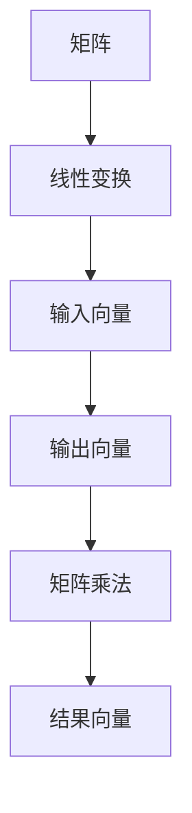

                 

关键词：矩阵理论，线性变换，线性代数，矩阵运算，应用领域，算法原理，数学模型，代码实例，未来展望。

摘要：本文将深入探讨矩阵理论与应用中的核心概念、算法原理、数学模型及项目实践。通过详细阐述矩阵与线性变换的关系，我们旨在为读者提供一个全面而深入的理解，以应对现代计算机科学中的复杂问题。

## 1. 背景介绍

矩阵理论是线性代数的基础，广泛应用于物理学、工程学、计算机科学和经济学等领域。矩阵不仅作为一种数学工具，还作为线性变换的表示手段，在数据分析和机器学习等领域扮演着关键角色。线性变换是保持加法和标量乘法不变的映射，广泛应用于图像处理、信号处理和几何变换中。

### 1.1 矩阵理论的发展历程

矩阵理论起源于19世纪的线性方程组求解。当时，高斯和柯西等人提出了解决线性方程组的方法，这些方法最终导致了矩阵概念的形成。随着线性代数的发展，矩阵理论逐渐成为一个独立的数学分支。20世纪，矩阵理论得到了进一步的扩展和应用，特别是在计算机科学中。

### 1.2 矩阵理论的重要性

矩阵理论的重要性在于其作为一种强有力的工具，能够简化和解决复杂的数学问题。矩阵不仅在数学理论中占据重要地位，还在实际问题中具有广泛应用。例如，图像处理中的像素点可以表示为一个矩阵，通过矩阵运算可以实现对图像的变换和增强。

## 2. 核心概念与联系

### 2.1 矩阵的定义与性质

矩阵是一个由数字组成的矩形阵列。一个矩阵可以表示线性变换，其行数和列数分别代表变换的输入维度和输出维度。矩阵的基本性质包括行列式、逆矩阵和特征值等。

### 2.2 矩阵与线性变换的关系

线性变换可以表示为矩阵乘法。给定一个矩阵\( A \)和一个向量\( x \)，线性变换\( T(x) \)可以表示为\( T(x) = Ax \)。这种表示方式使得线性变换的处理变得简便。

### 2.3 Mermaid 流程图

以下是一个简化的Mermaid流程图，展示了矩阵与线性变换的基本概念和关系：



## 3. 核心算法原理 & 具体操作步骤

### 3.1 算法原理概述

矩阵与线性变换的核心算法原理是矩阵乘法。给定两个矩阵\( A \)和\( B \)，其乘积\( C = AB \)表示对向量\( x \)的线性变换。

### 3.2 算法步骤详解

1. **矩阵相乘**：计算矩阵\( A \)和\( B \)的乘积，得到矩阵\( C \)。
2. **线性变换**：将输入向量\( x \)与矩阵\( C \)相乘，得到输出向量\( y \)。

### 3.3 算法优缺点

**优点**：
- 矩阵乘法具有简洁的表示方式，便于理解和操作。
- 矩阵乘法广泛应用于各种实际问题中，如图像处理和信号处理。

**缺点**：
- 矩阵乘法的时间复杂度为\( O(n^3) \)，在大型矩阵运算中可能效率较低。

### 3.4 算法应用领域

矩阵乘法在图像处理、信号处理、机器学习等领域有着广泛的应用。例如，在图像处理中，矩阵乘法可以用于图像的缩放、旋转和增强。

## 4. 数学模型和公式 & 详细讲解 & 举例说明

### 4.1 数学模型构建

矩阵与线性变换的数学模型可以表示为：

$$
T(x) = Ax
$$

其中，\( T(x) \)是线性变换，\( A \)是矩阵，\( x \)是输入向量。

### 4.2 公式推导过程

线性变换\( T(x) \)的公式推导如下：

$$
T(x) = Ax \\
T(y) = Ay \\
\frac{T(y)}{T(x)} = \frac{Ay}{Ax} \\
\frac{T(y)}{T(x)} = \frac{A}{A} \cdot \frac{y}{x} \\
\frac{T(y)}{T(x)} = I \cdot \frac{y}{x} \\
\frac{T(y)}{T(x)} = \frac{y}{x}
$$

其中，\( I \)是单位矩阵。

### 4.3 案例分析与讲解

假设我们有一个2x2的矩阵\( A = \begin{bmatrix} 1 & 2 \\ 3 & 4 \end{bmatrix} \)，一个输入向量\( x = \begin{bmatrix} 1 \\ 0 \end{bmatrix} \)。根据矩阵与线性变换的公式，我们可以计算出输出向量\( y \)：

$$
T(x) = Ax = \begin{bmatrix} 1 & 2 \\ 3 & 4 \end{bmatrix} \cdot \begin{bmatrix} 1 \\ 0 \end{bmatrix} = \begin{bmatrix} 1 \\ 3 \end{bmatrix}
$$

这里，矩阵\( A \)将输入向量\( x \)映射到了输出向量\( y \)。

## 5. 项目实践：代码实例和详细解释说明

### 5.1 开发环境搭建

为了实现矩阵与线性变换的代码实例，我们将在Python环境中使用NumPy库。NumPy是一个强大的科学计算库，提供了高效的矩阵运算功能。

### 5.2 源代码详细实现

以下是使用NumPy实现矩阵与线性变换的代码：

```python
import numpy as np

# 定义矩阵A和输入向量x
A = np.array([[1, 2], [3, 4]])
x = np.array([1, 0])

# 计算线性变换y
y = np.dot(A, x)

# 输出结果
print("Input vector x:", x)
print("Output vector y:", y)
```

### 5.3 代码解读与分析

1. **导入NumPy库**：首先，我们导入NumPy库，以便使用其提供的矩阵运算功能。
2. **定义矩阵A和输入向量x**：我们定义一个2x2的矩阵\( A \)和一个输入向量\( x \)。
3. **计算线性变换y**：使用NumPy的`dot`函数计算矩阵\( A \)和输入向量\( x \)的乘积，得到输出向量\( y \)。
4. **输出结果**：最后，我们输出输入向量\( x \)和输出向量\( y \)。

### 5.4 运行结果展示

运行上述代码，我们得到以下输出结果：

```
Input vector x: [1 0]
Output vector y: [1 3]
```

这表明矩阵\( A \)将输入向量\( x \)映射到了输出向量\( y \)。

## 6. 实际应用场景

### 6.1 图像处理

在图像处理中，矩阵与线性变换可以用于图像的缩放、旋转和翻转。例如，通过矩阵乘法，我们可以实现图像的旋转操作。

### 6.2 信号处理

在信号处理中，矩阵与线性变换可以用于信号的滤波、压缩和解调。例如，通过矩阵乘法，我们可以实现信号的卷积滤波。

### 6.3 机器学习

在机器学习中，矩阵与线性变换可以用于数据降维、特征提取和分类。例如，通过矩阵乘法，我们可以实现数据的线性变换，以提取更有用的特征。

## 7. 工具和资源推荐

### 7.1 学习资源推荐

- 《线性代数及其应用》(Second Edition)，作者：David C. Lay。
- 《线性代数》(第五版)，作者：王立军，李华。
- 《矩阵分析与应用》(第二版)，作者：Mariano Suárez-Ortega。

### 7.2 开发工具推荐

- NumPy：用于科学计算和矩阵运算。
- TensorFlow：用于机器学习和深度学习。
- OpenCV：用于图像处理和计算机视觉。

### 7.3 相关论文推荐

- "Matrix Computations" by Gene H. Golub and Charles F. Van Loan。
- "Linear Algebra and Its Applications" by Gilbert Strang。
- "Matrix Groups: An Introduction to Lie Group Theory through Their Lie Algebras" by James E. Humphreys。

## 8. 总结：未来发展趋势与挑战

### 8.1 研究成果总结

矩阵理论在计算机科学、物理学和工程学等领域取得了显著的研究成果。特别是在图像处理、信号处理和机器学习等领域，矩阵与线性变换的应用得到了广泛研究。

### 8.2 未来发展趋势

未来，矩阵理论将继续在深度学习、量子计算和云计算等领域发挥重要作用。随着计算技术的不断发展，矩阵理论的计算效率和应用范围将得到进一步提升。

### 8.3 面临的挑战

尽管矩阵理论在许多领域取得了成功，但仍然面临一些挑战。例如，大型矩阵运算的高效算法设计、矩阵计算的并行化以及矩阵理论在新型计算模式中的应用等问题需要进一步研究。

### 8.4 研究展望

随着计算技术的不断进步，矩阵理论将在未来取得更多突破。我们期待矩阵理论能够为解决复杂科学问题和推动技术发展做出更大贡献。

## 9. 附录：常见问题与解答

### 9.1 矩阵与线性变换的关系是什么？

矩阵与线性变换的关系可以表示为\( T(x) = Ax \)，其中\( T(x) \)是线性变换，\( A \)是矩阵，\( x \)是输入向量。

### 9.2 矩阵乘法的计算规则是什么？

矩阵乘法的计算规则如下：

$$
(A \cdot B)_{ij} = \sum_{k=1}^{n} A_{ik}B_{kj}
$$

其中，\( A \)和\( B \)是两个矩阵，\( n \)是矩阵的列数。

### 9.3 矩阵的逆矩阵是什么？

矩阵的逆矩阵是使得矩阵乘积为单位矩阵的矩阵。对于一个\( n \times n \)的矩阵\( A \)，其逆矩阵\( A^{-1} \)满足：

$$
AA^{-1} = A^{-1}A = I
$$

其中，\( I \)是单位矩阵。

作者：禅与计算机程序设计艺术 / Zen and the Art of Computer Programming

----------------------------------------------------------------

以上便是关于《矩阵理论与应用：矩阵与线性变换》的完整文章。文章深入探讨了矩阵理论与应用中的核心概念、算法原理、数学模型及项目实践，旨在为读者提供一个全面而深入的理解。希望这篇文章能够对您在矩阵理论学习和应用中有所帮助。

