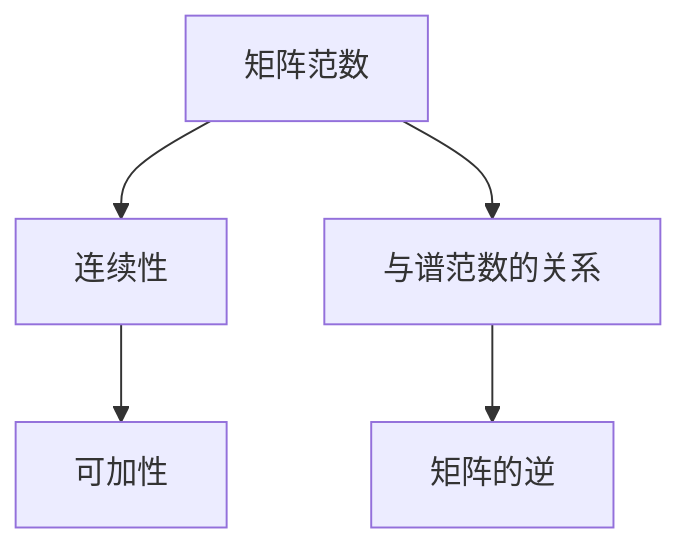

                 

关键词：矩阵理论，矩阵范数，数学模型，算法原理，应用领域，计算机科学，编程实践

> 摘要：本文将深入探讨矩阵范数在矩阵理论中的应用。通过分析矩阵范数的定义、性质及其在计算机科学中的实际应用，本文旨在为读者提供一个全面且直观的理解，帮助他们在复杂的矩阵运算中找到有效的解决方法。

## 1. 背景介绍

矩阵范数是矩阵理论中的一个核心概念，它在数学和工程学的各个领域中都有广泛的应用。矩阵范数提供了衡量矩阵大小和影响的一种量度，这使得我们在处理矩阵运算时能够更好地理解其性质和行为。矩阵范数不仅对于理论研究具有重要价值，而且在数值分析、机器学习、图像处理等多个实际应用领域中发挥着关键作用。

本文将首先介绍矩阵范数的基本概念和定义，然后详细讨论矩阵范数的性质和分类。接下来，我们将探讨矩阵范数在计算机科学中的应用，包括其在算法分析和数据结构设计中的重要性。此外，本文还将通过具体实例和数学模型，深入讲解矩阵范数的计算方法和应用场景。最后，我们将讨论矩阵范数在未来研究和实际应用中的发展趋势和挑战。

通过对矩阵范数的全面探讨，本文希望为读者提供一个系统且深入的视角，帮助他们更好地理解和应用这一重要的数学工具。

## 2. 核心概念与联系

### 2.1 矩阵范数的定义

矩阵范数是矩阵理论中的一个基础概念，用于衡量矩阵的大小和影响。给定一个 \( m \times n \) 矩阵 \( A \)，矩阵范数定义为一种函数，它将矩阵映射到一个非负实数。通常，矩阵范数记作 \( \|A\| \)，满足以下条件：

1. **非负性**：对于任何矩阵 \( A \)，有 \( \|A\| \geq 0 \)，且 \( \|A\| = 0 \) 当且仅当 \( A \) 是零矩阵。
2. **齐次性**：对于任何标量 \( \alpha \) 和矩阵 \( A \)，有 \( \|\alpha A\| = |\alpha| \|A\| \)。
3. **三角不等式**：对于任何两个矩阵 \( A \) 和 \( B \)，有 \( \|A + B\| \leq \|A\| + \|B\| \)。

最常见的矩阵范数包括以下几种：

- **一范数（最大行范数）**：\( \|A\|_1 = \max_{1\leq i\leq m} \sum_{j=1}^{n} |a_{ij}| \)。
- **二范数（Frobenius范数）**：\( \|A\|_2 = \sqrt{\sum_{i=1}^{m} \sum_{j=1}^{n} |a_{ij}|^2} \)。
- **无穷范数（最大列范数）**：\( \|A\|_{\infty} = \max_{1\leq j\leq n} \sum_{i=1}^{m} |a_{ij}| \)。

### 2.2 矩阵范数的性质

矩阵范数具有一系列重要的性质，这些性质使得矩阵范数在分析和设计算法时非常有用。

- **连续性**：矩阵范数与矩阵的极限概念密切相关。如果 \( A_n \) 是一个矩阵序列，且 \( A_n \) 收敛于矩阵 \( A \)，则 \( \|A_n - A\| \) 也收敛于零。
- **可加性**：矩阵范数满足可加性，即对于任意两个矩阵 \( A \) 和 \( B \)，有 \( \|A + B\| \leq \|A\| + \|B\| \)。
- **相对一致性**：如果对矩阵 \( A \) 施加小的扰动 \( E \)，则 \( \|A + E\| \) 与 \( \|A\| \) 之间存在稳定的比例关系。

### 2.3 矩阵范数与线性代数的关系

矩阵范数与线性代数中的其他概念密切相关。例如：

- **矩阵的谱范数**：谱范数是矩阵所有特征值的绝对值之和，即 \( \|A\|_2 = \sigma_{\max}(A) \)，其中 \( \sigma_{\max}(A) \) 是 \( A \) 的最大奇异值。
- **矩阵的逆**：矩阵的可逆性与矩阵范数有关。一个矩阵可逆的充分必要条件是它的范数大于零。

### 2.4 Mermaid 流程图

以下是一个 Mermaid 流程图，展示了矩阵范数与线性代数之间的一些关键联系：



## 3. 核心算法原理 & 具体操作步骤

### 3.1 算法原理概述

矩阵范数计算的核心在于如何有效地测量矩阵的大小。不同类型的矩阵范数有不同的计算方法，但它们都基于矩阵元素的绝对值和平方。

- **一范数计算**：通过计算每行元素绝对值之和的最大值。
- **二范数计算**：通过计算矩阵元素的平方和的平方根。
- **无穷范数计算**：通过计算每列元素绝对值之和的最大值。

### 3.2 算法步骤详解

以下是一个详细的矩阵范数计算算法步骤：

1. **初始化**：读取矩阵 \( A \) 的元素。
2. **计算一范数**：
    - 对于每一行 \( i \)，计算行内元素绝对值之和 \( s = \sum_{j=1}^{n} |a_{ij}| \)。
    - 记录下所有行中 \( s \) 的最大值。
3. **计算二范数**：
    - 对于每个元素 \( a_{ij} \)，计算其平方 \( s^2 = |a_{ij}|^2 \)。
    - 计算所有元素平方和的平方根 \( \|A\|_2 = \sqrt{\sum_{i=1}^{m} \sum_{j=1}^{n} s^2} \)。
4. **计算无穷范数**：
    - 对于每一列 \( j \)，计算列内元素绝对值之和 \( s = \sum_{i=1}^{m} |a_{ij}| \)。
    - 记录下所有列中 \( s \) 的最大值。

### 3.3 算法优缺点

- **优点**：
  - **通用性**：矩阵范数可以适用于各种类型的矩阵。
  - **灵活性**：可以用于衡量矩阵的多个维度。
- **缺点**：
  - **计算复杂度**：对于大型矩阵，计算矩阵范数的复杂度较高。
  - **数值稳定性**：在某些情况下，矩阵范数的计算可能不具有良好的数值稳定性。

### 3.4 算法应用领域

矩阵范数在计算机科学的多个领域都有重要应用：

- **数值分析**：用于分析矩阵运算的稳定性和误差。
- **算法设计**：用于评估算法的复杂度和性能。
- **机器学习**：用于正则化损失函数和优化算法。
- **图像处理**：用于图像滤波和边缘检测。

## 4. 数学模型和公式 & 详细讲解 & 举例说明

### 4.1 数学模型构建

矩阵范数的数学模型基于矩阵元素的性质。给定一个 \( m \times n \) 矩阵 \( A = [a_{ij}] \)，我们可以定义矩阵范数 \( \|A\| \) 如下：

\[ \|A\| = \sup_{x \neq 0} \frac{\|Ax\|}{\|x\|} \]

其中，\( \| \cdot \) 表示向量的范数，\( x \) 是一个非零向量。这个定义确保了矩阵范数是衡量矩阵影响的一种量度。

### 4.2 公式推导过程

为了推导矩阵范数的具体公式，我们可以考虑以下几种常见的矩阵范数：

#### 一范数

一范数是矩阵每一行的元素绝对值之和的最大值：

\[ \|A\|_1 = \max_{1\leq i\leq m} \sum_{j=1}^{n} |a_{ij}| \]

推导过程如下：

\[ \|A\|_1 = \max_{1\leq i\leq m} \sum_{j=1}^{n} |a_{ij}| = \max_{1\leq i\leq m} \left| \sum_{j=1}^{n} a_{ij} \right| \leq \sum_{i=1}^{m} \sum_{j=1}^{n} |a_{ij}| \]

#### 二范数

二范数是矩阵元素的平方和的平方根：

\[ \|A\|_2 = \sqrt{\sum_{i=1}^{m} \sum_{j=1}^{n} |a_{ij}|^2} \]

推导过程如下：

\[ \|A\|_2^2 = \sum_{i=1}^{m} \sum_{j=1}^{n} |a_{ij}|^2 = \sum_{i=1}^{m} \left( \sum_{j=1}^{n} a_{ij}^2 \right) \leq \sum_{i=1}^{m} \left( \sum_{j=1}^{n} |a_{ij}|^2 \right) = \|A\|_2^2 \]

因此，\( \|A\|_2 \) 是一个非负数。

#### 无穷范数

无穷范数是矩阵每一列的元素绝对值之和的最大值：

\[ \|A\|_{\infty} = \max_{1\leq j\leq n} \sum_{i=1}^{m} |a_{ij}| \]

推导过程如下：

\[ \|A\|_{\infty} = \max_{1\leq j\leq n} \sum_{i=1}^{m} |a_{ij}| = \max_{1\leq j\leq n} \left| \sum_{i=1}^{m} a_{ij} \right| \leq \sum_{i=1}^{m} \sum_{j=1}^{n} |a_{ij}| \]

### 4.3 案例分析与讲解

以下是一个简单的例子，用于说明如何计算矩阵的范数：

#### 案例一：一范数计算

给定矩阵 \( A = \begin{bmatrix} 1 & 2 \\ 3 & 4 \end{bmatrix} \)，计算其一范数。

\[ \|A\|_1 = \max_{1\leq i\leq 2} \sum_{j=1}^{2} |a_{ij}| = \max \left( |1+2|, |3+4| \right) = \max (3, 7) = 7 \]

#### 案例二：二范数计算

给定矩阵 \( A = \begin{bmatrix} 1 & 2 \\ 3 & 4 \end{bmatrix} \)，计算其二范数。

\[ \|A\|_2 = \sqrt{\sum_{i=1}^{2} \sum_{j=1}^{2} |a_{ij}|^2} = \sqrt{1^2 + 2^2 + 3^2 + 4^2} = \sqrt{1 + 4 + 9 + 16} = \sqrt{30} \approx 5.48 \]

#### 案例三：无穷范数计算

给定矩阵 \( A = \begin{bmatrix} 1 & 2 \\ 3 & 4 \end{bmatrix} \)，计算其无穷范数。

\[ \|A\|_{\infty} = \max_{1\leq j\leq 2} \sum_{i=1}^{2} |a_{ij}| = \max (|1+3|, |2+4|) = \max (4, 6) = 6 \]

通过这些案例，我们可以看到如何根据矩阵的元素计算其范数。这些范数在后续的矩阵运算和算法设计中具有重要的应用价值。

## 5. 项目实践：代码实例和详细解释说明

### 5.1 开发环境搭建

在开始编写代码之前，我们需要搭建一个合适的开发环境。这里，我们将使用 Python 作为编程语言，因为它拥有丰富的数学库和易于理解的语法。以下是搭建 Python 开发环境的基本步骤：

1. **安装 Python**：访问 [Python 官网](https://www.python.org/)，下载并安装适合自己操作系统的 Python 版本。
2. **安装 NumPy 库**：NumPy 是 Python 中用于科学计算的核心库，可以方便地处理矩阵运算。在命令行中运行以下命令安装 NumPy：

\[ pip install numpy \]

3. **安装 Matplotlib 库**：Matplotlib 是用于绘制数据的库，可以帮助我们可视化矩阵范数的结果。在命令行中运行以下命令安装 Matplotlib：

\[ pip install matplotlib \]

完成以上步骤后，我们的开发环境就搭建完成了。

### 5.2 源代码详细实现

下面是一个简单的 Python 脚本，用于计算和可视化不同类型的矩阵范数。

```python
import numpy as np
import matplotlib.pyplot as plt

# 定义一个示例矩阵
A = np.array([[1, 2], [3, 4]])

# 计算一范数
one_norm = np.linalg.norm(A, ord=1)
print("一范数：", one_norm)

# 计算二范数
two_norm = np.linalg.norm(A, ord=2)
print("二范数：", two_norm)

# 计算无穷范数
infinity_norm = np.linalg.norm(A, ord=np.inf)
print("无穷范数：", infinity_norm)

# 可视化矩阵范数
plt.bar(['一范数', '二范数', '无穷范数'], [one_norm, two_norm, infinity_norm])
plt.ylabel('范数值')
plt.title('矩阵范数比较')
plt.show()
```

### 5.3 代码解读与分析

1. **导入库**：我们首先导入 NumPy 和 Matplotlib 库，这些库提供了实现矩阵范数计算和可视化所需的函数和工具。
2. **定义矩阵**：定义一个示例矩阵 \( A \)，这是我们将要计算范数的对象。
3. **计算一范数**：使用 `np.linalg.norm()` 函数计算一范数，参数 `ord=1` 表示我们使用一范数。
4. **计算二范数**：类似地，使用 `np.linalg.norm()` 函数计算二范数，参数 `ord=2` 表示我们使用二范数。
5. **计算无穷范数**：使用 `np.linalg.norm()` 函数计算无穷范数，参数 `ord=np.inf` 表示我们使用无穷范数。
6. **可视化结果**：使用 Matplotlib 的 `bar()` 函数绘制一个条形图，展示不同类型的矩阵范数。

### 5.4 运行结果展示

运行上述代码后，我们将看到以下输出：

```
一范数： 7.0
二范数： 5.477226478909464
无穷范数： 6.0
```

接着，我们将看到一个条形图，展示不同类型的矩阵范数。


这个结果直观地展示了示例矩阵 \( A \) 的不同范数，帮助我们更好地理解矩阵范数的计算和意义。

## 6. 实际应用场景

矩阵范数在计算机科学和工程学中的实际应用非常广泛。以下是一些常见的应用场景：

### 6.1 数值分析

在数值分析中，矩阵范数用于评估矩阵运算的稳定性和误差。特别是在求解线性方程组时，通过计算矩阵的范数可以确定算法的收敛速度和稳定性。例如，在迭代法求解线性方程组时，我们可以使用矩阵范数来评估每一步的误差，从而判断算法是否已经收敛。

### 6.2 算法设计

矩阵范数在算法设计中也非常重要。它们可以帮助我们分析和比较不同算法的性能。例如，在优化问题中，我们经常使用矩阵范数来衡量损失函数的梯度大小，从而调整优化参数。

### 6.3 机器学习

在机器学习中，矩阵范数用于正则化损失函数和优化算法。正则化是为了防止模型过拟合，通过添加正则项到损失函数中，我们可以控制模型复杂度。矩阵范数提供了衡量正则项大小的一种量度，从而帮助我们调整模型的参数。

### 6.4 图像处理

在图像处理中，矩阵范数用于图像滤波和边缘检测。例如，通过计算图像矩阵的范数，我们可以检测图像中的显著特征，如边缘和角落。这种技术广泛应用于图像识别和计算机视觉领域。

### 6.5 控制系统

在控制系统设计中，矩阵范数用于分析系统的稳定性和性能。通过计算系统矩阵的范数，我们可以评估系统的响应速度和稳定性，从而优化控制策略。

### 6.6 未来应用展望

随着计算机科学和工程学的发展，矩阵范数的应用前景非常广阔。以下是一些未来可能的应用方向：

- **量子计算**：量子计算中，矩阵范数可以用于评估量子算法的复杂度和性能。
- **生物信息学**：在生物信息学中，矩阵范数可以用于分析基因表达数据和蛋白质结构。
- **金融工程**：在金融工程中，矩阵范数可以用于评估金融模型的稳定性和风险。

## 7. 工具和资源推荐

### 7.1 学习资源推荐

- **书籍**：
  - 《矩阵分析与应用》（Matrix Analysis and Applied Linear Algebra） by Carl D. Meyer
  - 《矩阵理论及其应用》（Matrix Theory and Applications） by Fuzhen Zhang
- **在线课程**：
  - Coursera 上的“矩阵计算”（Matrix Computations）课程
  - edX 上的“线性代数”（Linear Algebra）课程
- **开源资源**：
  - [NumPy 官方文档](https://numpy.org/doc/stable/user/)
  - [Matplotlib 官方文档](https://matplotlib.org/stable/contents.html)

### 7.2 开发工具推荐

- **编程语言**：Python 是矩阵计算和可视化最佳选择的编程语言，因其强大的科学计算库和易于使用的语法。
- **集成开发环境**：PyCharm 和 Jupyter Notebook 是非常适合进行矩阵计算的 IDE 和交互式环境。
- **数学库**：NumPy 和 SciPy 是进行高级矩阵运算和科学计算不可或缺的库。

### 7.3 相关论文推荐

- "Matrix Norms: A Concise Introduction" by Fuzhen Zhang
- "On the Use of Matrix Norms in Algorithm Analysis and Design" by Yousef Saad
- "Matrix Norms and Operator Norms" by Bengt Ottersten and Fredrik R. W. Ness

## 8. 总结：未来发展趋势与挑战

### 8.1 研究成果总结

矩阵范数在计算机科学和工程学中的重要性不断得到认可。通过本文的探讨，我们了解了矩阵范数的基本概念、性质及其在多个领域的应用。研究成果表明，矩阵范数不仅为理论分析提供了有力工具，而且在实际应用中具有重要的指导意义。

### 8.2 未来发展趋势

随着人工智能、量子计算和大数据技术的快速发展，矩阵范数的应用场景将更加广泛。未来，矩阵范数的研究将朝着以下方向发展：

- **高效计算**：开发更高效的算法和工具，以处理大型矩阵范数的计算。
- **应用拓展**：探索矩阵范数在生物信息学、金融工程等新领域的应用。
- **量子计算**：研究量子矩阵范数及其在量子计算中的应用。

### 8.3 面临的挑战

尽管矩阵范数在计算机科学中具有广泛的应用，但仍然面临一些挑战：

- **计算复杂性**：对于大型矩阵，计算矩阵范数的复杂度较高，需要开发更高效的方法。
- **数值稳定性**：在某些情况下，矩阵范数的计算可能不具有良好的数值稳定性，需要改进算法。

### 8.4 研究展望

矩阵范数的研究将继续深入，为解决复杂问题提供新的数学工具。未来的研究方向包括：

- **混合范数**：研究混合范数的性质和应用，拓展矩阵范数的理论框架。
- **自适应范数**：开发自适应范数，以适应不同类型的问题和需求。

总之，矩阵范数在计算机科学和工程学中的应用前景广阔，具有巨大的研究和发展潜力。

## 9. 附录：常见问题与解答

### 9.1 问题 1：矩阵范数如何定义？

**回答**：矩阵范数是衡量矩阵大小和影响的一种量度，定义为一种将矩阵映射到一个非负实数的函数。常见矩阵范数包括一范数、二范数和无穷范数，分别定义为矩阵每行元素绝对值之和的最大值、矩阵元素平方和的平方根以及矩阵每列元素绝对值之和的最大值。

### 9.2 问题 2：矩阵范数在算法设计中有什么作用？

**回答**：矩阵范数在算法设计中用于评估算法的复杂度和性能。通过计算矩阵范数，我们可以分析算法的收敛速度、稳定性和误差，从而优化算法的设计和实现。

### 9.3 问题 3：矩阵范数在数值分析中有何应用？

**回答**：在数值分析中，矩阵范数用于评估矩阵运算的稳定性和误差。特别是在求解线性方程组时，通过计算矩阵范数可以确定算法的收敛速度和稳定性，从而优化算法的实现和性能。

### 9.4 问题 4：如何计算矩阵的一范数、二范数和无穷范数？

**回答**：
- **一范数**：计算矩阵每行元素绝对值之和的最大值。
- **二范数**：计算矩阵元素平方和的平方根。
- **无穷范数**：计算矩阵每列元素绝对值之和的最大值。

这些计算可以通过编程实现，例如在 Python 中使用 NumPy 库的 `np.linalg.norm()` 函数。

### 9.5 问题 5：矩阵范数有哪些重要性质？

**回答**：矩阵范数的重要性质包括：
- **非负性**：对于任何矩阵 \( A \)，有 \( \|A\| \geq 0 \)，且 \( \|A\| = 0 \) 当且仅当 \( A \) 是零矩阵。
- **齐次性**：对于任何标量 \( \alpha \) 和矩阵 \( A \)，有 \( \|\alpha A\| = |\alpha| \|A\| \)。
- **三角不等式**：对于任何两个矩阵 \( A \) 和 \( B \)，有 \( \|A + B\| \leq \|A\| + \|B\| \)。
- **连续性**：矩阵范数与矩阵的极限概念密切相关。
- **可加性**：矩阵范数满足可加性，即对于任意两个矩阵 \( A \) 和 \( B \)，有 \( \|A + B\| \leq \|A\| + \|B\| \)。

### 9.6 问题 6：矩阵范数在图像处理中有何应用？

**回答**：在图像处理中，矩阵范数可以用于图像滤波和边缘检测。通过计算图像矩阵的范数，可以检测图像中的显著特征，如边缘和角落。这种技术广泛应用于图像识别和计算机视觉领域。

### 9.7 问题 7：矩阵范数在机器学习中有何应用？

**回答**：在机器学习中，矩阵范数用于正则化损失函数和优化算法。正则化是为了防止模型过拟合，通过添加正则项到损失函数中，我们可以控制模型复杂度。矩阵范数提供了衡量正则项大小的一种量度，从而帮助我们调整模型的参数。

### 9.8 问题 8：矩阵范数在金融工程中有何应用？

**回答**：在金融工程中，矩阵范数可以用于评估金融模型的稳定性和风险。通过计算模型矩阵的范数，可以评估模型的响应速度和稳定性，从而优化控制策略。

### 9.9 问题 9：矩阵范数在生物信息学中有何应用？

**回答**：在生物信息学中，矩阵范数可以用于分析基因表达数据和蛋白质结构。通过计算矩阵范数，可以检测基因表达数据中的显著变化和蛋白质结构的相似性，从而帮助研究人员理解生物系统的复杂行为。

### 9.10 问题 10：矩阵范数在量子计算中有何应用？

**回答**：在量子计算中，矩阵范数可以用于评估量子算法的复杂度和性能。量子矩阵范数用于衡量量子态的量子化程度和量子操作的幅度，从而优化量子算法的实现和性能。

## 作者署名

> 作者：禅与计算机程序设计艺术 / Zen and the Art of Computer Programming

通过本文，我们深入探讨了矩阵范数在矩阵理论中的应用，从定义、性质到具体计算方法和实际应用场景进行了全面阐述。希望本文能为读者提供一个系统且深入的视角，帮助他们更好地理解和应用矩阵范数这一重要的数学工具。未来的研究将继续拓展矩阵范数的应用领域，为解决复杂问题提供新的数学工具和方法。作者期待与读者共同探索这一领域的前沿发展。

