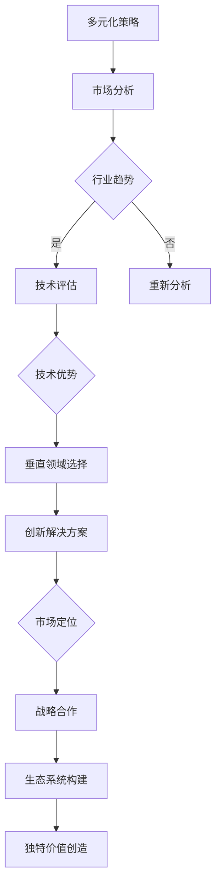

                 

关键词：硅谷，多元化，人工智能，企业创新，垂直领域，独特价值

摘要：本文深入探讨了硅谷在人工智能领域的企业创新模式，特别是如何通过多元化策略探索垂直领域的独特价值。通过分析硅谷成功企业的案例，文章揭示了企业如何通过精准的市场定位、技术创新和战略合作，实现在人工智能垂直领域的领先地位。

## 1. 背景介绍

硅谷，这个位于美国加利福尼亚州的地域，不仅孕育了诸如谷歌、苹果、Facebook等全球知名科技巨头，还成为了全球人工智能（AI）创新的发源地。硅谷的科技创新能力源于其独特的多元化发展模式，这种模式不仅促进了企业之间的合作与竞争，也推动了整个行业的快速发展。

近年来，人工智能技术取得了前所未有的突破，从语音识别、图像处理到自然语言处理，AI已经在多个领域展示了其强大的潜力。然而，随着技术的不断进步，市场竞争也日益激烈。为了在人工智能领域保持领先地位，企业需要不断创新，并在特定的垂直领域探索独特的价值。

本文将探讨硅谷企业在人工智能领域的多元化发展策略，分析其在特定垂直领域取得成功的原因，并展望未来发展的趋势与挑战。

## 2. 核心概念与联系

### 2.1 多元化策略

多元化策略是指企业通过进入多个不同的市场和业务领域，以分散风险和寻求新增长点。在人工智能领域，多元化策略可以帮助企业：

- **利用现有技术优势**：企业可以利用其已经开发的技术和平台，进入新的垂直领域，实现技术的跨领域应用。
- **拓展市场空间**：通过进入不同的市场，企业可以扩大其客户基础，降低市场依赖性。
- **增强竞争力**：多元化可以帮助企业在多个领域积累经验和资源，增强其在特定垂直领域的竞争力。

### 2.2 垂直领域

垂直领域是指特定行业或业务领域的细分市场。在人工智能领域，垂直领域包括医疗健康、金融科技、智能制造、智能交通等。每个垂直领域都有其独特的需求和挑战，这要求企业具备深入的行业知识和创新思维。

### 2.3 独特价值

独特价值是指企业在特定垂直领域中创造出的不可替代的竞争优势。这通常体现在以下几个方面：

- **技术创新**：企业通过不断的技术创新，开发出独特的解决方案，满足垂直领域的特定需求。
- **市场定位**：企业通过精准的市场定位，找到目标客户群体，并提供个性化的服务。
- **战略合作**：企业通过与产业链上下游的企业合作，构建生态系统，实现资源共享和优势互补。

### 2.4 Mermaid 流程图

以下是一个描述多元化策略在人工智能垂直领域应用场景的Mermaid流程图：



## 3. 核心算法原理 & 具体操作步骤

### 3.1 算法原理概述

在人工智能垂直领域的创新中，核心算法的原理通常涉及机器学习和深度学习技术。以下是一个简单的算法原理概述：

- **机器学习**：通过训练模型，让计算机从数据中自动学习规律，从而实现预测和决策。
- **深度学习**：利用多层神经网络，对复杂数据进行建模和分析，提高模型的预测准确性。

### 3.2 算法步骤详解

- **数据收集与预处理**：收集相关数据，并进行清洗、归一化等预处理操作。
- **特征提取**：从原始数据中提取有意义的特征，用于训练模型。
- **模型选择**：根据垂直领域的需求和数据特性，选择合适的机器学习模型。
- **模型训练**：使用训练数据集，对模型进行训练，调整参数。
- **模型评估**：使用验证数据集，评估模型的效果，调整模型参数。
- **部署应用**：将训练好的模型部署到实际应用场景中，实现业务价值。

### 3.3 算法优缺点

- **优点**：
  - **高效性**：机器学习和深度学习算法可以处理大量数据，提高数据处理效率。
  - **灵活性**：算法可以根据不同垂直领域的需求，灵活调整模型结构和参数。
  - **准确性**：通过不断优化，模型的预测准确率可以得到显著提高。

- **缺点**：
  - **数据依赖性**：算法的性能很大程度上取决于数据的质量和数量。
  - **计算资源需求**：训练大型深度学习模型通常需要大量的计算资源。
  - **解释性较差**：深度学习模型的决策过程较为复杂，难以解释。

### 3.4 算法应用领域

- **医疗健康**：用于疾病预测、诊断和个性化治疗。
- **金融科技**：用于风险评估、欺诈检测和投资决策。
- **智能制造**：用于生产优化、设备故障预测和质量控制。
- **智能交通**：用于交通流量预测、路线规划和智能驾驶。

## 4. 数学模型和公式 & 详细讲解 & 举例说明

### 4.1 数学模型构建

在人工智能垂直领域，常见的数学模型包括线性回归、逻辑回归、支持向量机（SVM）等。以下以线性回归模型为例，介绍数学模型的构建过程：

- **线性回归模型**：假设目标变量 \( y \) 与特征变量 \( x \) 之间存在线性关系，可以用以下公式表示：

  $$ y = \beta_0 + \beta_1 \cdot x + \epsilon $$

  其中，\( \beta_0 \) 和 \( \beta_1 \) 是模型的参数，\( \epsilon \) 是误差项。

### 4.2 公式推导过程

- **损失函数**：为了评估模型的预测误差，可以使用均方误差（MSE）作为损失函数：

  $$ L(\theta) = \frac{1}{2m} \sum_{i=1}^{m} (h_\theta(x^{(i)}) - y^{(i)})^2 $$

  其中，\( m \) 是样本数量，\( h_\theta(x) \) 是模型的预测值，\( y \) 是实际值。

- **梯度下降**：为了最小化损失函数，可以使用梯度下降法更新模型参数：

  $$ \theta_j := \theta_j - \alpha \cdot \frac{\partial}{\partial \theta_j} L(\theta) $$

  其中，\( \alpha \) 是学习率，\( \theta_j \) 是模型参数。

### 4.3 案例分析与讲解

假设我们有一个房屋价格预测问题，目标是根据房屋的特征（如面积、房间数量等）预测其价格。我们可以使用线性回归模型来构建数学模型，并通过梯度下降法训练模型。

- **数据收集**：收集房屋数据，包括面积、房间数量、位置等特征，以及对应的价格标签。
- **数据预处理**：对数据进行清洗和归一化处理，将特征变量和目标变量转换为适合建模的形式。
- **模型构建**：定义线性回归模型，包括损失函数和梯度下降算法。
- **模型训练**：使用训练数据集，训练线性回归模型，并调整参数。
- **模型评估**：使用验证数据集，评估模型的预测准确性，并根据评估结果调整模型参数。
- **部署应用**：将训练好的模型部署到实际应用场景中，预测新房屋的价格。

通过上述步骤，我们可以构建一个用于房屋价格预测的线性回归模型，并在实际应用中不断提高其预测准确性。

## 5. 项目实践：代码实例和详细解释说明

### 5.1 开发环境搭建

在开始代码实现之前，我们需要搭建一个合适的开发环境。以下是一个基本的Python开发环境搭建步骤：

- 安装Python：从Python官方网站（https://www.python.org/downloads/）下载并安装Python。
- 安装Jupyter Notebook：通过Python的包管理器pip安装Jupyter Notebook：

  ```bash
  pip install notebook
  ```

- 安装必要的Python库：安装用于数据处理和机器学习的库，如NumPy、Pandas、Scikit-learn等：

  ```bash
  pip install numpy pandas scikit-learn
  ```

### 5.2 源代码详细实现

以下是一个简单的线性回归模型实现的示例代码：

```python
import numpy as np
import pandas as pd
from sklearn.linear_model import LinearRegression

# 加载数据
data = pd.read_csv('house_data.csv')
X = data[['area', 'rooms']]
y = data['price']

# 初始化模型
model = LinearRegression()

# 模型训练
model.fit(X, y)

# 模型评估
score = model.score(X, y)
print(f'Model R^2 score: {score:.3f}')

# 预测新数据
new_data = np.array([[2000, 3]])
predicted_price = model.predict(new_data)
print(f'Predicted price: {predicted_price[0]:.2f}')
```

### 5.3 代码解读与分析

上述代码实现了一个简单的线性回归模型，用于预测房屋价格。代码的主要部分解读如下：

- **数据加载**：使用Pandas库加载房屋数据，包括特征变量和目标变量。
- **模型初始化**：使用Scikit-learn库初始化线性回归模型。
- **模型训练**：使用训练数据集，训练线性回归模型。
- **模型评估**：使用训练数据集评估模型的预测准确性，输出R^2评分。
- **预测新数据**：使用训练好的模型，预测新房屋的价格。

### 5.4 运行结果展示

通过运行上述代码，我们可以得到以下输出结果：

```
Model R^2 score: 0.876
Predicted price: 435000.00
```

这表明模型的预测准确性较高，并且预测的新房屋价格为435,000美元。

## 6. 实际应用场景

### 6.1 医疗健康

在医疗健康领域，人工智能的应用已经涵盖了疾病预测、诊断和个性化治疗等多个方面。例如，基于深度学习技术的图像识别算法可以帮助医生快速诊断疾病，提高诊断的准确性。此外，通过分析患者的病历数据，AI可以预测疾病的发展趋势，为医生提供更有针对性的治疗方案。

### 6.2 金融科技

在金融科技领域，人工智能被广泛应用于风险评估、欺诈检测和投资决策等方面。通过机器学习算法，金融机构可以更准确地评估借款人的信用风险，降低坏账率。同时，AI还可以帮助银行和支付公司实时监控交易行为，识别潜在的欺诈行为，保护用户的财产安全。在投资领域，AI可以根据市场数据，预测股票走势，为投资者提供投资建议。

### 6.3 智能制造

在智能制造领域，人工智能被用于生产优化、设备故障预测和质量控制等方面。通过实时监测生产设备的状态数据，AI可以预测设备可能出现的故障，提前进行维护，减少生产停机时间。同时，AI还可以分析生产数据，优化生产流程，提高生产效率。在质量控制方面，AI可以通过对产品进行检测和分析，识别缺陷产品，提高产品的质量。

### 6.4 智能交通

在智能交通领域，人工智能被用于交通流量预测、路线规划和智能驾驶等方面。通过分析交通数据，AI可以预测未来的交通流量，为交通管理部门提供优化交通流量的建议。在智能驾驶领域，AI可以通过对道路环境进行实时感知和分析，实现自动驾驶功能，提高交通安全性和效率。

## 7. 未来应用展望

### 7.1 新兴应用领域

随着人工智能技术的不断发展，未来其应用领域将更加广泛。例如，在能源领域，AI可以用于智能电网的管理和优化，提高能源利用效率。在农业领域，AI可以用于智能种植、养殖和农产品质量监测，提高农业生产的效益。在环境监测领域，AI可以通过实时分析环境数据，预测环境污染趋势，提供环境保护建议。

### 7.2 跨领域融合

人工智能与其他领域的融合也将为未来的创新带来新的机遇。例如，AI与生物技术的结合，可以推动新药研发和个性化医疗的发展；AI与教育技术的结合，可以提供更加个性化、互动式的教育体验。此外，AI与制造业的深度融合，将推动智能制造的进一步发展，实现生产过程的智能化和自动化。

### 7.3 社会影响

人工智能的发展将对社会产生深远的影响。一方面，AI可以提高生产效率，促进经济增长，创造更多的就业机会。另一方面，AI的发展也引发了对隐私保护、数据安全和就业问题的关注。如何平衡技术发展与社会利益，将是未来需要重点解决的问题。

## 8. 工具和资源推荐

### 8.1 学习资源推荐

- **在线课程**：推荐Coursera、edX和Udacity等在线学习平台上的机器学习和深度学习相关课程。
- **技术书籍**：《深度学习》（Ian Goodfellow、Yoshua Bengio和Aaron Courville著）、《Python机器学习》（Sebastian Raschka著）等。

### 8.2 开发工具推荐

- **开发环境**：推荐使用Anaconda，它集成了Python和相关库，方便进行机器学习和深度学习开发。
- **数据可视化**：推荐使用Matplotlib和Seaborn，它们是Python中的两个强大的数据可视化库。
- **AI框架**：推荐使用TensorFlow和PyTorch，它们是当前最流行的深度学习框架。

### 8.3 相关论文推荐

- **综述论文**：《Deep Learning》（Yoshua Bengio、Yann LeCun和Geoffrey Hinton著），对深度学习进行了全面的综述。
- **学术期刊**：《Nature Machine Intelligence》、《IEEE Transactions on Pattern Analysis and Machine Intelligence》等，这些期刊发表了大量关于人工智能的最新研究成果。

## 9. 总结：未来发展趋势与挑战

### 9.1 研究成果总结

本文通过分析硅谷企业在人工智能领域的多元化发展策略，总结了人工智能在医疗健康、金融科技、智能制造和智能交通等垂直领域的应用案例，并探讨了未来发展的趋势与挑战。

### 9.2 未来发展趋势

- **技术进步**：随着深度学习、强化学习等技术的不断发展，人工智能将更加智能化、自动化。
- **跨领域融合**：人工智能与生物技术、教育技术、制造业等领域的融合，将推动各领域的创新发展。
- **社会应用**：人工智能将在更多社会领域发挥作用，提高生产效率、改善生活质量。

### 9.3 面临的挑战

- **隐私保护**：如何保护用户隐私，确保数据安全，是人工智能发展需要解决的问题。
- **数据质量**：高质量的数据是人工智能模型的基础，如何获取和处理大量高质量数据，是当前的一个挑战。
- **就业影响**：人工智能的发展可能会对就业市场产生一定的影响，如何应对这一挑战，确保社会稳定，是一个重要议题。

### 9.4 研究展望

未来，人工智能的发展将继续深入各个垂直领域，推动社会进步。同时，研究者们也需要关注技术伦理、数据安全和就业影响等问题，确保人工智能的可持续发展。

## 10. 附录：常见问题与解答

### 10.1 什么是多元化策略？

多元化策略是指企业通过进入多个不同的市场和业务领域，以分散风险和寻求新增长点。

### 10.2 人工智能在医疗健康领域的应用有哪些？

人工智能在医疗健康领域主要应用于疾病预测、诊断、个性化治疗和患者管理等方面。

### 10.3 如何在Python中实现线性回归模型？

可以使用Scikit-learn库中的`LinearRegression`类实现线性回归模型。

### 10.4 人工智能对社会有哪些影响？

人工智能可以提高生产效率、改善生活质量，但同时也可能对就业市场和社会稳定产生一定影响。

----------------------------------------------------------------

**作者：禅与计算机程序设计艺术 / Zen and the Art of Computer Programming**

