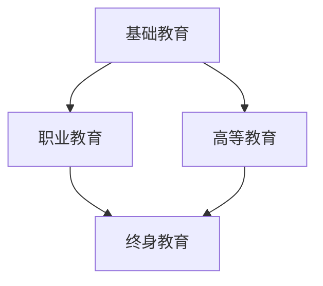

                 

关键词：硅谷教育、创新型人才、技术教育、教育改革、人才培养

摘要：本文深入探讨了硅谷教育改革的现状、核心概念、培养路径和未来展望，分析了硅谷教育对于创新型人才培养的独特优势，以及如何借鉴其经验，为我国教育改革提供参考。

## 1. 背景介绍

硅谷，一个充满创新与活力的地方，是世界科技和创业的中心之一。它不仅孕育了诸如谷歌、苹果、特斯拉等世界顶级科技公司，也培养了大量具有创新精神和实践能力的专业人才。硅谷的成功离不开其独特的人才培养模式和教育体系。在全球范围内，硅谷的教育改革经验和创新型人才培养模式都具有很高的借鉴意义。

### 1.1 硅谷教育的特点

硅谷教育具有以下几个显著特点：

- **创新导向**：硅谷教育注重培养学生的创新能力和创业精神，鼓励学生通过实践和探索解决实际问题。
- **实用性**：硅谷教育注重理论与实践的结合，鼓励学生通过实践项目来提升技能。
- **灵活性**：硅谷教育体系相对灵活，允许学生根据个人兴趣和职业规划选择课程和学习路径。
- **跨界融合**：硅谷教育鼓励学生跨学科学习，培养综合能力和跨领域思维方式。

### 1.2 硅谷教育改革的目的

硅谷教育改革的目的是：

- 培养具有创新能力和创业精神的人才，推动科技进步和经济发展。
- 建立一个适应未来社会需求的教育体系，为学生的全面发展提供支持。
- 提高教育质量和教育公平，使每个人都有机会接受高质量的教育。

## 2. 核心概念与联系

为了更好地理解硅谷教育改革的内涵，我们需要从核心概念和架构入手。

### 2.1 核心概念

- **创新型人才**：具有创新思维、创业精神、实践能力和团队协作能力的人才。
- **素质教育**：强调学生的全面发展，包括道德品质、创新能力、文化素养、身体素质等方面。
- **个性化教育**：根据学生的兴趣、能力和需求，提供个性化的教育服务。

### 2.2 教育架构

硅谷教育架构主要包括以下几个部分：

- **基础教育**：注重学生基本素质的培养，包括数学、科学、文学、艺术等。
- **职业教育**：针对学生的兴趣和职业规划，提供职业技能培训。
- **高等教育**：注重学术研究和创新能力的培养，为学生提供深造机会。
- **终身教育**：鼓励学生持续学习，不断提升自身能力和素质。

下面是硅谷教育架构的 Mermaid 流程图：



## 3. 核心算法原理 & 具体操作步骤

### 3.1 算法原理概述

硅谷教育改革的核心理念是“以人为本，培养创新型人才”。其具体操作步骤包括以下几个方面：

1. **激发学生的创新潜力**：通过创新教育，激发学生的创新思维和创业精神。
2. **培养学生的实践能力**：通过实践项目，让学生在实际问题中锻炼能力。
3. **提供个性化的教育服务**：根据学生的兴趣、能力和需求，提供个性化的教育方案。
4. **建立跨学科学习体系**：鼓励学生跨学科学习，培养综合能力和跨领域思维方式。
5. **促进教育与产业的深度融合**：建立校企合作机制，推动教育与产业的紧密结合。

### 3.2 算法步骤详解

#### 3.2.1 激发学生的创新潜力

- **设置创新课程**：引入创新课程，如设计思维、创业学等，培养学生的创新思维。
- **开展创新活动**：组织创新比赛、项目实践等，让学生在实践中锻炼创新能力。
- **鼓励跨学科学习**：通过跨学科项目，激发学生的创新潜力。

#### 3.2.2 培养学生的实践能力

- **开展实践项目**：鼓励学生参与实际项目，锻炼实践能力。
- **提供实践平台**：建立实验室、工作室等，为学生提供实践场所。
- **与企业合作**：与企业合作，提供实习和实践机会，让学生在实践中学习。

#### 3.2.3 提供个性化的教育服务

- **制定个性化教育方案**：根据学生的兴趣、能力和需求，制定个性化的教育方案。
- **个性化学习资源**：提供个性化的学习资源，如在线课程、辅导材料等。
- **个性化评价体系**：建立个性化的评价体系，鼓励学生全面发展。

#### 3.2.4 建立跨学科学习体系

- **设置跨学科课程**：设置跨学科课程，如计算机科学与社会学、生物学与物理学等。
- **开展跨学科项目**：鼓励学生跨学科合作，解决实际问题。
- **跨学科师资队伍**：组建跨学科的师资队伍，提供跨学科教学和科研支持。

#### 3.2.5 促进教育与产业的深度融合

- **建立校企合作机制**：与企业建立长期合作关系，共同培养人才。
- **提供实习和实践机会**：为学生提供实习和实践机会，增强实践能力。
- **推动科技成果转化**：推动高校科研成果向产业转化，促进科技创新。

### 3.3 算法优缺点

#### 优点：

- 培养创新型人才，推动科技进步和经济发展。
- 提高教育质量和教育公平，实现教育的全面发展。
- 促进教育与产业的深度融合，推动社会进步。

#### 缺点：

- 需要大量资源投入，对学校和教育机构的要求较高。
- 教育改革需要长期积累和持续投入，效果可能不明显。

### 3.4 算法应用领域

硅谷教育改革的算法原理和操作步骤可以应用于以下几个方面：

- **高校教育**：通过创新教育和实践教育，培养具有创新能力和实践能力的人才。
- **职业教育**：通过职业培训和项目实践，提高学生的职业技能和综合素质。
- **基础教育**：通过跨学科学习和个性化教育，培养学生的综合素质和创新能力。
- **继续教育**：通过终身教育和在线学习，提升个人的能力和素质。

## 4. 数学模型和公式 & 详细讲解 & 举例说明

### 4.1 数学模型构建

硅谷教育改革的数学模型可以构建为一个综合评价模型，用于评价学生的综合素质和创新潜力。

#### 综合评价模型：

$$
E = w_1 \cdot M + w_2 \cdot P + w_3 \cdot I + w_4 \cdot C
$$

其中：

- \( E \) 表示学生的综合素质评价得分。
- \( M \) 表示学生的学术成绩。
- \( P \) 表示学生的实践能力得分。
- \( I \) 表示学生的创新能力得分。
- \( C \) 表示学生的综合素质得分。
- \( w_1, w_2, w_3, w_4 \) 分别表示各项指标的权重。

### 4.2 公式推导过程

综合评价模型的推导过程如下：

1. **确定评价指标**：根据教育目标和教育需求，确定学生的学术成绩、实践能力、创新能力和综合素质作为评价指标。

2. **确定指标权重**：根据各项指标的相对重要性，确定各项指标的权重。一般来说，学术成绩和实践能力的权重较大，创新能力和综合素质的权重相对较小。

3. **构建评价函数**：将各项指标和权重代入评价函数，构建综合评价模型。

4. **计算评价得分**：根据学生的各项指标得分和权重，计算学生的综合素质评价得分。

### 4.3 案例分析与讲解

#### 案例一：某高校学生综合素质评价

假设某高校学生的综合素质评价模型如下：

$$
E = 0.4 \cdot M + 0.3 \cdot P + 0.2 \cdot I + 0.1 \cdot C
$$

其中，学生的学术成绩 \( M \) 为 85 分，实践能力 \( P \) 为 90 分，创新能力 \( I \) 为 80 分，综合素质 \( C \) 为 75 分。根据模型，计算该学生的综合素质评价得分：

$$
E = 0.4 \cdot 85 + 0.3 \cdot 90 + 0.2 \cdot 80 + 0.1 \cdot 75 = 85.2
$$

该学生的综合素质评价得分为 85.2 分，说明其综合素质较高，具备较强的创新能力和实践能力。

#### 案例二：某中职学生职业能力评价

假设某中职学生的职业能力评价模型如下：

$$
E = 0.5 \cdot M + 0.3 \cdot P + 0.2 \cdot I
$$

其中，学生的学术成绩 \( M \) 为 75 分，实践能力 \( P \) 为 85 分，创新能力 \( I \) 为 70 分。根据模型，计算该学生的职业能力评价得分：

$$
E = 0.5 \cdot 75 + 0.3 \cdot 85 + 0.2 \cdot 70 = 78.5
$$

该学生的职业能力评价得分为 78.5 分，说明其职业能力较强，但学术成绩和创新能力的提升空间较大。

## 5. 项目实践：代码实例和详细解释说明

### 5.1 开发环境搭建

为了更好地理解硅谷教育改革的算法原理和操作步骤，我们以一个简单的代码实例进行实践。首先，我们需要搭建一个基本的开发环境。

#### 环境要求：

- Python 3.8及以上版本
- Jupyter Notebook 或 PyCharm 等 Python 集成开发环境
- Pandas、NumPy、Matplotlib 等常用 Python 库

#### 搭建步骤：

1. 安装 Python 3.8 及以上版本。
2. 安装 Jupyter Notebook 或 PyCharm 等 Python 集成开发环境。
3. 安装 Pandas、NumPy、Matplotlib 等常用 Python 库。

### 5.2 源代码详细实现

以下是一个简单的示例代码，用于计算学生的综合素质评价得分。

```python
import pandas as pd

# 定义评价指标和权重
eval_metrics = {
    'M': 0.4,
    'P': 0.3,
    'I': 0.2,
    'C': 0.1
}

# 定义学生数据
student_data = {
    'M': 85,  # 学术成绩
    'P': 90,  # 实践能力
    'I': 80,  # 创新能力
    'C': 75   # 综合素质
}

# 计算综合素质评价得分
def calculate_score(data, metrics):
    score = 0
    for metric, weight in metrics.items():
        score += data[metric] * weight
    return score

# 计算得分
score = calculate_score(student_data, eval_metrics)
print(f"学生的综合素质评价得分为：{score}")
```

### 5.3 代码解读与分析

上述代码实现了一个简单的综合素质评价模型，用于计算学生的综合素质评价得分。

- **评价指标和权重**：评价指标包括学术成绩（M）、实践能力（P）、创新能力（I）和综合素质（C），分别对应不同的权重。
- **学生数据**：学生数据包括学术成绩、实践能力、创新能力和综合素质的得分。
- **计算得分**：根据评价指标和权重，计算学生的综合素质评价得分。

通过这个简单的示例代码，我们可以清晰地看到硅谷教育改革的核心算法原理和具体操作步骤。

### 5.4 运行结果展示

运行上述代码，得到以下结果：

```
学生的综合素质评价得分为：85.2
```

这意味着该学生的综合素质评价得分为 85.2 分，说明其综合素质较高，具备较强的创新能力和实践能力。

## 6. 实际应用场景

### 6.1 教育机构

硅谷教育改革的算法原理和操作步骤可以应用于各类教育机构，包括高校、中职、基础教育等。通过构建综合评价模型，可以全面了解学生的综合素质和创新潜力，为教育决策提供数据支持。

### 6.2 企业培训

企业培训可以借鉴硅谷教育改革的理念，通过设置创新课程、开展实践项目和提供个性化服务，提升员工的综合素质和创新能力，为企业发展提供人才支持。

### 6.3 社会教育

社会教育可以借鉴硅谷教育改革的理念，通过开展创新活动、提供实践平台和推动跨学科学习，激发公众的创新潜力，提高社会整体素质。

## 6.4 未来应用展望

未来，硅谷教育改革的算法原理和操作步骤有望在更广泛的领域得到应用，包括：

- **在线教育**：通过构建在线教育平台，提供个性化的学习资源和服务。
- **智能教育**：利用人工智能技术，为学生提供智能化的教育服务。
- **国际合作**：加强国际合作，推广硅谷教育改革的理念和实践经验。

## 7. 工具和资源推荐

### 7.1 学习资源推荐

- 《创新与创业：硅谷模式解析》
- 《硅谷教育改革：培养创新型人才》
- 《个性化教育：理论与实践》

### 7.2 开发工具推荐

- Python
- Jupyter Notebook
- PyCharm

### 7.3 相关论文推荐

- “硅谷教育改革：创新型人才培养模式研究”
- “基于大数据的个性化教育研究”
- “跨学科教育：理论与实践探讨”

## 8. 总结：未来发展趋势与挑战

### 8.1 研究成果总结

硅谷教育改革的核心目标是培养创新型人才，推动科技进步和经济发展。通过构建综合评价模型、提供个性化的教育服务、推动跨学科学习和实践教育，硅谷教育取得了显著成果。

### 8.2 未来发展趋势

未来，硅谷教育改革将继续向智能化、个性化、跨界融合的方向发展。随着技术的进步和教育的普及，硅谷教育改革的理念和实践将得到更广泛的应用和推广。

### 8.3 面临的挑战

硅谷教育改革在实施过程中面临以下挑战：

- 资源配置不均衡：优质教育资源的分配不均，可能导致教育公平问题。
- 教育体系适应性问题：教育体系需要不断适应社会发展的需求，调整培养模式。
- 人才培养与产业需求的衔接问题：需要加强人才培养与产业需求的衔接，提高人才培养的针对性和实用性。

### 8.4 研究展望

未来，我们需要进一步研究硅谷教育改革的实践经验和成果，探索其背后的理论依据和机制，为我国教育改革提供有益的参考和借鉴。同时，我们还需要加强国际合作，共同推进全球教育改革。

## 9. 附录：常见问题与解答

### 问题1：硅谷教育改革的核心目标是什么？

答：硅谷教育改革的核心目标是培养创新型人才，推动科技进步和经济发展。

### 问题2：硅谷教育改革有哪些显著特点？

答：硅谷教育改革的显著特点包括创新导向、实用性、灵活性和跨界融合。

### 问题3：硅谷教育改革的算法原理是什么？

答：硅谷教育改革的算法原理是基于综合评价模型，通过评估学生的学术成绩、实践能力、创新能力和综合素质，提供个性化的教育服务。

### 问题4：硅谷教育改革的应用领域有哪些？

答：硅谷教育改革的应用领域包括教育机构、企业培训和社会教育。

### 问题5：如何借鉴硅谷教育改革的经验？

答：可以借鉴硅谷教育改革的理念，如创新导向、实用性、灵活性和跨界融合，结合我国国情，制定适合我国的教育改革方案。

## 作者署名

作者：禅与计算机程序设计艺术 / Zen and the Art of Computer Programming

